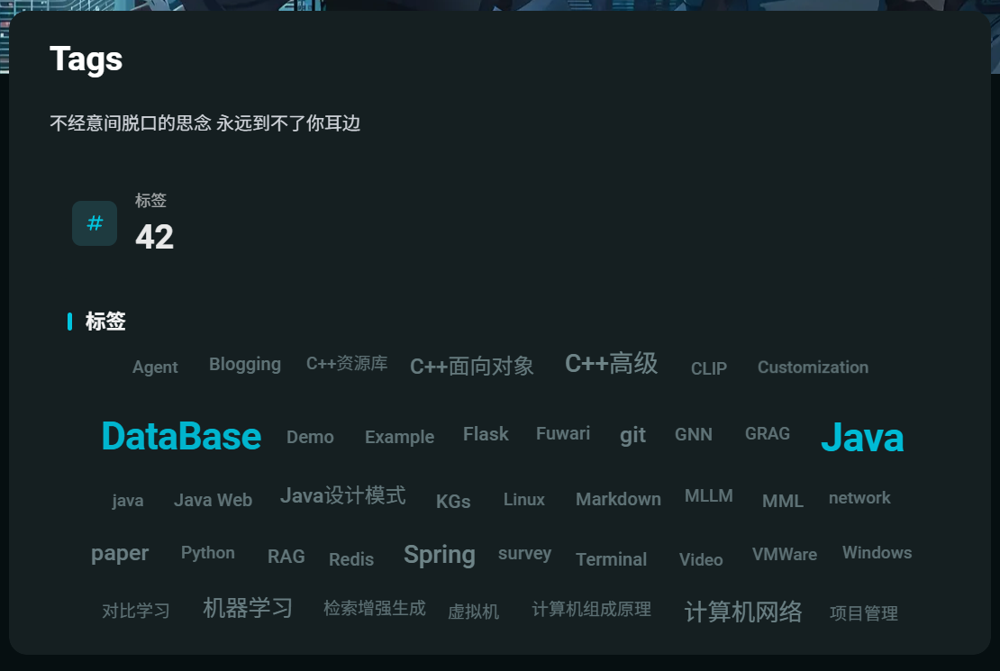
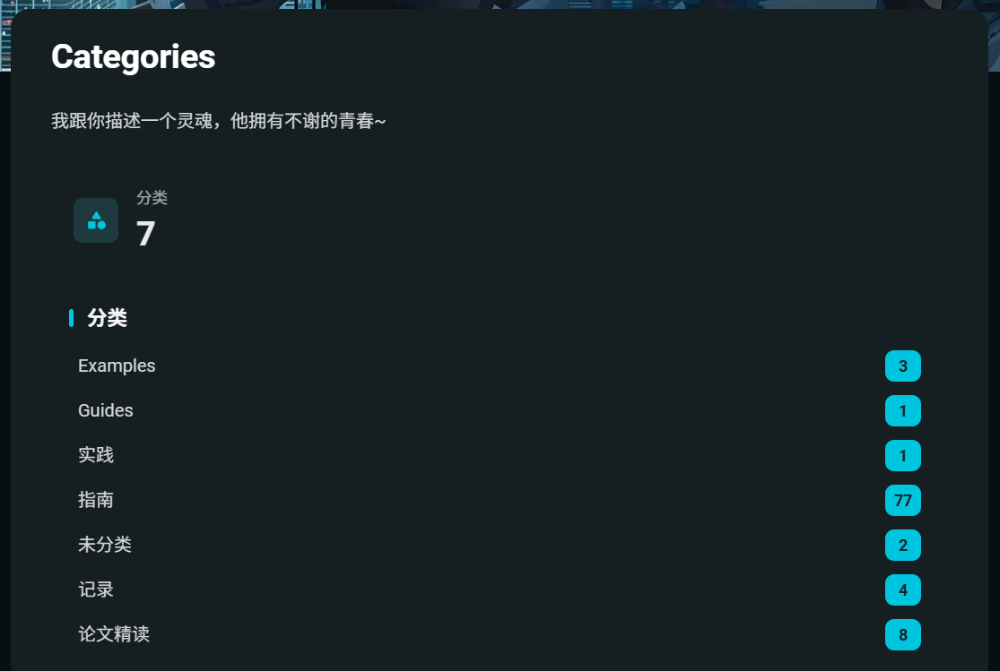

# 🍥 Memorris

基于 [Fuwari](https://github.com/saicaca/fuwari) 定制的个人博客，底层使用 [Astro](https://astro.build) 构建。

[**🖥️ 在线预览**](https://blog.memorris.dpdns.org/)&nbsp;&nbsp;&nbsp;/&nbsp;&nbsp;&nbsp;
[**📦 上游模板 Fuwari**](https://github.com/saicaca/fuwari)&nbsp;&nbsp;&nbsp;/&nbsp;&nbsp;&nbsp;
[**📦 旧 Hexo 版本**](https://github.com/saicaca/hexo-theme-vivia)

🌏 README：
[**English**](README.md) /
[**日本語**](README.ja-JP.md) /
[**한국어**](README.ko.md) /
[**Español**](README.es.md) /
[**ไทย**](README.th.md)

> README 版本：`2026-03-11`


## ✨ 功能特性

继承自 Fuwari 的基础能力：

- [X] 基于 Astro 和 Tailwind CSS 开发
- [X] 流畅的动画和页面过渡（Swup）
- [X] 亮色 / 暗色模式
- [X] 自定义主题色和横幅图片
- [X] 响应式设计
- [X] 全文搜索（[Pagefind](https://pagefind.app/)）
- [X] 文内目录（TOC）
- [X] KaTeX 数学公式
- [X] Markdown 扩展语法（Admonition、GitHub 卡片、Expressive Code）
- [X] RSS 订阅
- [ ] 评论

## 🔧 相对上游的定制

在 Fuwari 基础上，本仓库额外实现了以下增强：

### 文内目录（TOC）

- 左侧分组目录，一级标题可展开 / 折叠子标题
- 滚动进度追踪，带主题色虚线指示器
- 页面置顶时自动隐藏，避免遮挡正文
- 非文章页目录栏显示修复
- **KaTeX 公式标题**可在目录中正确渲染
- 与 Swup 页面过渡集成，切换页面时目录同步更新


### 性能优化

- 图片懒加载、`decoding="async"` 与 `fetchpriority` 控制
- `PostCard`、`Layout`、`Navbar`、`Profile` 等组件首屏加载优化
- 主题切换逻辑抽离至 `setting-utils.ts`

### 归档页体验

- **RollingCountCard**：分类 / 标签数量滚动计数动画
- **标签云**：按文章数量映射字号、透明度与字重，带稳定哈希配色
- **分类页**：默认展开全部分类（`forceExpand`）
- **StaggerReveal**：列表项交错入场动画，支持 `prefers-reduced-motion`

<p align="center">
  
  
</p>

## 🚀 使用方法

1. Clone 本仓库并在本地安装依赖：

   ```bash
   pnpm install
   ```

   若未安装 [pnpm](https://pnpm.io)，先执行 `npm install -g pnpm`。
2. 编辑 `src/config.ts` 自定义站点标题、导航、个人资料等；编辑 `astro.config.mjs` 中的 `site` 字段设置部署域名。
3. 执行 `pnpm new-post <filename>` 创建新文章，在 `src/content/posts/` 目录中编辑。
4. 本地开发：

   ```bash
   pnpm dev
   ```

5. 构建并预览：

   ```bash
   pnpm build
   pnpm preview
   ```

6. 部署：参考 [Astro 部署指南](https://docs.astro.build/zh-cn/guides/deploy/)，将 `dist/` 部署至任意静态托管服务。

## ⚙️ 站点配置

目录相关选项位于 `src/config.ts` 的 `siteConfig.toc`：

```ts
toc: {
  enable: true,   // 是否在文章页显示目录
  depth: 6,       // 目录显示的最大标题层级深度
}
```

## ⚙️ 文章 Frontmatter

```yaml
---
title: My First Blog Post
published: 2023-09-09
description: This is the first post of my new Astro blog.
image: ./cover.jpg
tags: [Foo, Bar]
category: Front-end
draft: false
lang: jp      # 仅当文章语言与 `config.ts` 中的网站语言不同时需要设置
---
```

## 🧞 指令

下列指令均需要在项目根目录执行：

| Command                      | Action                                     |
| :--------------------------- | :----------------------------------------- |
| `pnpm install`             | 安装依赖                                   |
| `pnpm dev`                 | 在 `localhost:4321` 启动本地开发服务器   |
| `pnpm build`               | 构建网站至 `./dist/`（含 Pagefind 索引） |
| `pnpm preview`             | 本地预览已构建的网站                       |
| `pnpm new-post <filename>` | 创建新文章                                 |
| `pnpm format`              | 使用 Biome 格式化代码                      |
| `pnpm lint`                | 使用 Biome 检查并自动修复                  |
| `pnpm astro ...`           | 执行 `astro add`、`astro check` 等指令 |
| `pnpm astro --help`        | 显示 Astro CLI 帮助                        |

## 🙏 致谢

本项目基于 [saicaca/fuwari](https://github.com/saicaca/fuwari) 二次开发。感谢上游作者的开源贡献。
