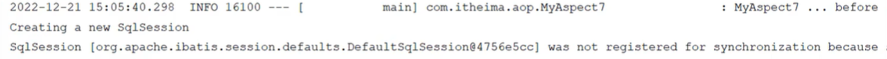

# AOP初入

导入依赖

```xml
<dependency>
    <groupId>org.springframework.boot</groupId>
    <artifactId>spring-boot-starter-aop</artifactId>
</dependency>
```

在切入点表达式中指定运行哪一层/哪一个类/哪一个功能时，执行切面逻辑

```java
@Component
@Aspect
@Slf4j
public class TimeAspect {

    // 切入点表达式，匹配所有service包及其子包中的所有方法
    @Around("execution(* org.example.mybatis_test.service..*(..))")
    public Object recordTime(ProceedingJoinPoint joinPoint) throws Throwable {
        //1. 获取开始时间
        long begin = System.currentTimeMillis();

        //2. 调用原始方法执行
        Object result =  joinPoint.proceed();

        //3. 记录结束时间
        long end = System.currentTimeMillis();
        log.info("方法执行时间: " + (end - begin) + "ms");

        return result;
    }
}
```

# AOP核心概念

* 连接点 :  JoinPoint，可以被AOP控制的方法(暗含方法执行时的相关信息)
* 通知 :  Advice，指哪些重复的逻辑，也就是共性功能(最终体现为一个方法)
* 切入点 :  Pointcut，匹配连接点的条件，通知仅会在切入点方法执行时被应用

# AOP进阶

### 通知类型

| 注解                | 中文名称   | 执行时机                             | 特点                                         | 易错点                                                                      |
| ------------------- | ---------- | ------------------------------------ | -------------------------------------------- | --------------------------------------------------------------------------- |
| `@Around`         | 环绕通知   | 在目标方法执行前后都会执行           | 可完全控制目标方法是否执行，可在前后添加逻辑 | 必须调用 `ProceedingJoinPoint.proceed()` 才会执行目标方法，否则会被拦截掉 |
| `@Before`         | 前置通知   | 在目标方法执行前执行                 | 可获取方法入参，适合做权限校验、日志记录等   | 无法获取返回值                                                              |
| `@After`          | 后置通知   | 在目标方法执行后执行（无论是否异常） | 类似 `finally`，常用于资源释放             | 无法区分正常返回还是异常退出                                                |
| `@AfterReturning` | 返回后通知 | 在目标方法正常返回后执行             | 可获取返回值，适合做结果处理、缓存更新等     | `returning` 参数名必须与方法形参名一致                                    |
| `@AfterThrowing`  | 异常后通知 | 在目标方法抛出异常后执行             | 可获取异常对象，适合做异常日志、告警等       | `throwing` 参数名必须与方法形参名一致                                     |

> @Around 的织入逻辑需要自己调用 `ProceedingJoinPoint.proceed()<span> </span>`来让底层的方法执行，其他注解不需要考虑原始方法执行

注意事项：

* @Around环绕通知需要自己调用 ProceedingJoinPoint.proceed()来让原始方法执行，其他通知不需要考虑目标方法执行
* @Around环绕通知方法的返回值，必须指定为0bject，来接收原始方法的返回值。

执行顺序：

```LESS
@Around（前半段）
    ↓
@Before
    ↓
目标方法执行
    ↓
@AfterReturning / @AfterThrowing
    ↓
@After
    ↓
@Around（后半段）
```

### 便捷写法

pointcut可以进行变量引用

```java
@Pointcut("execution(* org.example.mybatis_test.service..*(..))")
    public void pointCut() {
    }
  
    @Before("pointCut()")
    public void before() {
        log.info("方法执行前");
    }
```

而且如果声明为public，就可以在其他引用的文件中使用

## 通知顺序

当有多个切面的切入点都匹配到了目标方法，目标方法运行时，多个通知方法都会被执行。

1. 不同切面类中，默认按照切面类的类名字母排序
   * 目标方法前的通知方法:字母排名靠前的先执行
   * 目标方法后的通知方法:字母排名靠前的后执行
2. 用 **@Order(数字)** 加在切面类上来控制顺序
   * 目标方法前的通知方法:数字小的先执行
   * 目标方法后的通知方法:数字小的后执行

```java
@Aspect
@Order(1) // 优先级高，先执行
@Component
public class MyAspect1 {
    @Before("execution(* com.itheima.service.impl.LogServiceImpl.*(..))")
    public void before() {
        log.info("MyAspect1...");
    }
}

@Aspect
@Order(2) // 优先级低，后执行
@Component
public class MyAspect2 {
    @Before("execution(* com.itheima.service.impl.LogServiceImpl.*(..))")
    public void before() {
        log.info("MyAspect2...");
    }
}
```

# 切入点表达式

* 切入点表达式:描述切入点方法的一种表达式
* 作用:主要用来决定项目中的哪些方法需要加入通知
* 常见形式:
  * @execution(.):根据方法的签名来匹配
  * @annotation(.):根据注解匹配

## execution

execution 主要根据方法的返回值、包名、类名、方法名、方法参数等信息来匹配，语法为：

```java
execution(访问修饰符? 返回值 包名.类名.?方法名(方法参数) throws 异常?)
```

- 其中带 `?` 的表示可以省略的部分
  - 访问修饰符：可省略（比如：`public`、`protected`）
  - 包名.类名：可省略
  - `throws` 异常：可省略（注意是方法上声明抛出的异常，不是实际抛出的异常）

```java
@Before("execution(public void com.itheima.service.impl.DeptServiceImpl.delete(java.lang.Integer))")
public void before(JoinPoint joinPoint){
    // 方法体内容
}
```

- 可以使用通配符描述切入点

  - `*`：单个独立的任意符号，可以通配任意返回值、包名、类名、方法名、任意类型的一个参数，也可以通配包、类、方法名的一部分

    ```java
    execution(* com.*.service.*.update*(*))
    ```
  - `..`：多个连续的任意符号，可以通配任意层级的包，或任意类型、任意个数的参数

    ```java
    execution(* com.itheima..DeptService.*(..))
    ```

### 书写建议

* 所有业务方法名在命名时尽量规范，方便切入点表达式快速匹配。如:查询类方法都是find 开头，更新类方法都是 update开头。
* 描述切入点方法通常基于接口描述，而不是直接描述实现类，增强拓展性。
* 在满足业务需要的前提下，尽量缩小切入点的匹配范围。如:名匹配尽量不使用.，使用*匹配单个包。

## @annotation

`@annotation` 切入点表达式，用于匹配标识有特定注解的方法。

```
@annotation(com.itheima.anno.Log)
```

```java
@Before("@annotation(com.itheima.anno.Log)")
public void before(){
    log.info("before ....");
}
```

我们需要先在一个注解类中声明这一个注解，之后再进行引用：

```java
@Retention(RetentionPolicy.RUNTIME) //描述生效时间
@Target(ElementType.METHOD) //生效位置（方法上）
public @interface LogAnnotation {
}
```


之后在实现类中需要切入的地方添加这一注解：

```java
@LogAnnotation
@Override
public List<Dept> list() {
    return deptMapper.list();
}
```

最后在切面类中使用 `@annotation`调用这一个注解类

```java
@Pointcut("@annotation(org.example.mybatis_test.aop.LogAnnotation)")
public void pointCut() {
}

@Before("pointCut()")
public void before() {
    log.info("方法执行前");
}
```

这样在每一个使用LogAnnotation注释的方法都可以被这个切面识别到，并在被调用之前进行一次 `log.info("方法执行前");`



# 连接点

在 Spring 中用 `JoinPoint` 抽象了连接点，用它可以获得方法执行时的相关信息，如目标类名、方法名、方法参数等。

- 对于 `@Around` 通知，获取连接点信息只能使用 `ProceedingJoinPoint`
- 对于其他四种通知，获取连接点信息只能使用 `JoinPoint`，它是 `ProceedingJoinPoint` 的父类型

```java
@Around("execution(* com.itheima.service.DeptService.*(..))")
public Object around(ProceedingJoinPoint joinPoint) throws Throwable {
    String className = joinPoint.getTarget().getClass().getName(); // 获取目标类名
    Signature signature = joinPoint.getSignature(); // 获取目标方法签名
    String methodName = joinPoint.getSignature().getName(); // 获取目标方法名
    Object[] args = joinPoint.getArgs(); // 获取目标方法运行参数
    Object res = joinPoint.proceed(); // 执行原始方法，获取返回值（环绕通知）
    return res;
}
```

在非Around类中，需要对joinPoint进行信息提取：

```java
@Before("execution(* com.itheima.service.DeptService.*(..))")
public void before(JoinPoint joinPoint) {
    String className = joinPoint.getTarget().getClass().getName(); // 获取目标类名
    Signature signature = joinPoint.getSignature(); // 获取目标方法签名
    String methodName = joinPoint.getSignature().getName(); // 获取目标方法名
    Object[] args = joinPoint.getArgs(); // 获取目标方法运行参数
}
```

## 完整操作

```java
@Around("pointCut()")
public Object around(ProceedingJoinPoint joinPoint) throws Throwable {
    log.info("环绕通知：方法执行前");
    //1. 获取目标类名
String className = joinPoint.getTarget().getClass().getName();
    log.info("目标类名className: " + className);

    //2. 获取目标方法名
String methodName = joinPoint.getSignature().getName();
    log.info("目标方法名methodName: " + methodName);

    //3. 获取目标方法参数
Object[] args = joinPoint.getArgs();
    for (Object arg : args) {
        log.info("目标方法参数arg: " + arg);}

    //4. 放行
Object result = joinPoint.proceed();
    log.info("result: " + result);

    log.info("环绕通知：方法执行后");
    return result;
}
```


# AOP 实际操作

我们之前所介绍的内容都是如何调用AOP进行简易的通知操作，当我们遇到需要修改程序中复杂变量时，又应该细化这些方法

## 反射赋值

这里我们以数据库操作为例，逐步理解反射赋值

首先是使用拦截器获取到需要的类型，这是进行操作必要的前置：


```java
//        获取到当前拦截的方法上的数据库操作类型
//        获取方法签名对象
MethodSignature signature = (MethodSignature) joinPoint.getSignature();

//        获取方法上的注解对象
AutoFill autoFill = signature.getMethod().getAnnotation(AutoFill.class);

//        获取数据库操作类型
OperationType operationType = autoFill.value();
```

在这之后我们可以获取到真正的实体对象，

因为我们在Mapper层中的数据库函数声明是这样的，传参数组中的第一个变量正好是我们需要的实体对象：


```java
@AutoFill(OperationType.INSERT)
void insert(Employee employee);
```


```java
//        获取到当前被拦截的方法的参数---实体对象
Object[] args = joinPoint.getArgs();

        if (args == null || args.length == 0) {
            return;
        }

        Object entity = args[0];
```

接下来就是以下方法展开的赋值：


```java
//        转变赋值的数据
LocalDateTime now = LocalDateTime.now();
        Long currentId = BaseContext.getCurrentId();

//        根据当前不同的操作类型，为对应的属性通过反射来赋值
if (operationType == OperationType.INSERT) {
//            为4个公共字段赋值
try {
                Method setCreateTime = entity.getClass().getDeclaredMethod(AutoFillConstant.SET_CREATE_TIME, LocalDateTime.class);
                Method setCreateUser = entity.getClass().getDeclaredMethod(AutoFillConstant.SET_CREATE_USER, Long.class);
                Method setUpdateTime = entity.getClass().getDeclaredMethod(AutoFillConstant.SET_UPDATE_TIME, LocalDateTime.class);
                Method setUpdateUser = entity.getClass().getDeclaredMethod(AutoFillConstant.SET_UPDATE_USER, Long.class);

//              通过反射为对象赋值
setCreateTime.invoke(entity, now);
                setCreateUser.invoke(entity, currentId);
                setUpdateTime.invoke(entity, now);
                setUpdateUser.invoke(entity, currentId);
            } catch (Exception e) {
                throw new RuntimeException(e);
            }

        } else if (operationType == operationType.UPDATE) {
//            为2个公共字段赋值
try {
                Method setUpdateTime = entity.getClass().getDeclaredMethod(AutoFillConstant.SET_UPDATE_TIME, LocalDateTime.class);
                Method setUpdateUser = entity.getClass().getDeclaredMethod(AutoFillConstant.SET_UPDATE_USER, Long.class);

//              通过反射为对象赋值
setUpdateTime.invoke(entity, now);
                setUpdateUser.invoke(entity, currentId);
            } catch (Exception e) {
                throw new RuntimeException(e);
            }
        }
```
