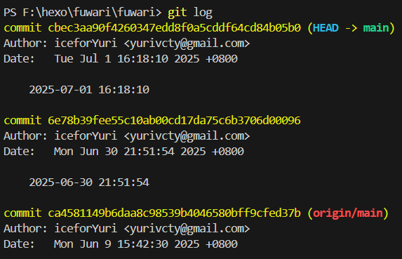
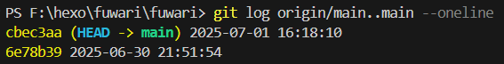
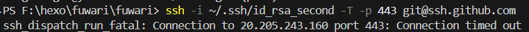
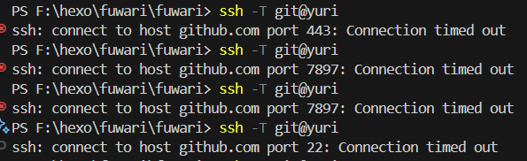
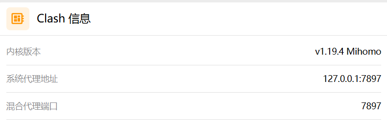
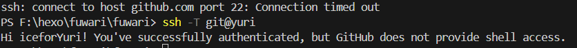

# 提交问题

今天闲着没事检查blog提交时发现提交又失败了，检查了一下提交记录，不知道为何最近两次提交冒着黄点（忘记截图了）

本来我以为提交到野分支上了，但是实际上我将log发给AI检查之后并不是分支提交的问题，这两次提交与正常提交的没有区别：



ai给出的说法是：

1. **本地 main 分支是最新的** ，有你最近的所有提交。
2. **远程 main 分支（origin/main）停留在 6月9日** ，新提交都没有上去。
3. 你的本地 `main2` 分支不确定是什么，暂时没有显示它的提交记录。

在这里我检查了一下本地提交和远程提交的连接：

```bash
//检查命令
git log origin/main..main --oneline

git log [分支1]..[分支2] --oneline
```

* `git log`：查看提交历史。
* `[分支1]..[分支2]`：表示“显示分支2相对于分支1，新增的所有提交”。
  * `origin/main`：远程仓库的 main 分支。
  * `main`：你本地的 main 分支。
  * `origin/main..main`：选取那些 **在 main 有、但在 origin/main 没有的提交** 。
* `--oneline`：每个提交只显示一行（简洁摘要），方便快速浏览。



这里看到输出，说明这两个提交 **只存在于你的本地 main 分支** ，还没有被推送到远程 origin/main。

理论上此时只需要推送一次即可：

```bash
git push origin main
```

但是这就牵扯出了刚回到家的一个问题：ssh连不上但https可以连上



# 连接转移

一开始ai尝试让我转换端口号来实现ssh也能走系统代理，因为原来的ssh默认走的是22端口，而Clash的介绍说Clash 的“全局模式”通常 **只代理 HTTP/HTTPS 流量** （即 80、443 端口），对于 **非 HTTP/HTTPS 端口** （比如 SSH 的 22 端口）， **是否能被代理，取决于具体的代理方式** 。

这有一个具体的说明：


**普通 HTTP/HTTPS 代理**

* 只代理浏览器和支持 HTTP/HTTPS 代理的软件。
* SSH、FTP、游戏等非 HTTP 协议流量， **默认不走代理** 。

**SOCKS5 代理**

* 如果你的 Clash 开启了 SOCKS5 代理端口（比如 7891）， **理论上所有支持 SOCKS5 的客户端都能通过它代理任意端口的 TCP 流量** （包括 SSH）。
* 但你需要手动配置 SSH 或其他程序使用 Clash 的 SOCKS5 端口。

**TUN/TAP（透明代理、系统级代理）**

* 如果启用了 Clash 的 TUN/TAP 模式（即“Tun模式”），可以让所有 TCP/UDP 流量都被转发（理论上全端口，包括 SSH）。
* 需要在 Clash 配置中开启并正确设置 TUN/TAP，并配合操作系统的网络设置。
* **部分 Windows 系统或配置出错时，TUN 也可能无法 100% 代理所有端口。**

我先尝试了一下修改端口号，但是似乎无效，Clash也不能走通包括混合端口在内的这几个端口？？

> **混合代理端口** （Mixed Port，一般默认是 7890）是指 **同时支持 HTTP、HTTPS 和 SOCKS5 协议的代理端口** 。

```pub
# 默认 GitHub 账户
Host github.com
    HostName github.com
    User git
    IdentityFile ~/.ssh/id_rsa

# 第二个 GitHub 账户，使用 443 端口
Host yuri
    HostName ssh.github.com
    User git
    Port 443
    IdentityFile ~/.ssh/id_rsa_second
```





反正我是懵比了，但是幸好的是，换了TUN模式之后，我的ssh终于能够连上了



这一次终于对整个Clash有了更充分的理解，希望下一次网络问题不要范这种毛病


# Clash代理具体分类

## 代理模式

### 1. 规则模式（Rule）

**原理：**

* Clash 根据你的配置文件（通常是 YAML 格式）中的“规则（rules）”来决定每一条网络请求的走向。
* 不同类型/目的地的流量，按规则分流到“代理”、“直连”、“阻止”等不同策略。

**举例：**

* `DOMAIN-SUFFIX,github.com,PROXY`：访问 github.com 走代理
* `DOMAIN-SUFFIX,baidu.com,DIRECT`：访问 baidu.com 不走代理
* `FINAL,PROXY`：剩余流量全部走代理


### 2. 全局模式（Global）

**原理：**

* 所有的流量都被转发到 “代理” 节点，不再区分国内/国外网站。
* 等于把你的网络“全部接管”，所有软件、网站都走代理。

**特点：**

* 简单粗暴，方便排查网络问题。
* 国内网站访问速度可能变慢，部分服务因绕道海外可能异常（如支付宝、银行、部分CDN）。


### 3. 直连模式（Direct）

**原理：**

* 所有流量都 **不经过代理** ，直接访问互联网。
* 实际等于“关闭代理”，此时 Clash 形同未开启。

**特点：**

* 完全本地网络体验，适合不需要代理时使用。
* 不保护隐私，不突破网络限制。

## 代理条件


### 1. 系统代理（System Proxy）

**原理：**

* Clash 监听本机一个端口（如 7890），将其设置为“系统代理端口”。
* 通过修改操作系统的“网络代理”设置，让浏览器/支持代理的软件自动把流量发给 Clash。
* 支持 HTTP/HTTPS、部分支持 SOCKS5。

**适用范围：**

* 浏览器、部分第三方软件（如 Telegram、网易云等）能自动识别。
* 大量本地程序（如微信、QQ、Steam、Git、命令行 SSH 等） **默认不会走系统代理** ，需要手动配置或用插件支持。


### 2. TUN 模式（透明代理/全局转发）

**原理：**

* Clash 通过 TUN/TAP 驱动建立一个虚拟网卡，接管所有本机网络流量。
* 类似 VPN，所有程序（只要走操作系统网络协议栈的）都能被 Clash 捕获和分流，包括不支持代理的软件（如游戏、Git、SSH、部分国产软件等）。

**适用范围：**

* 所有程序，包括命令行、系统服务等。
* 适合全局代理、科学上网和需要对所有流量分流的场景。

**优点：**

* 真正做到“全局代理”。
* 不需要单独配置每个软件。


| 模式     | 工作方式       | 适用范围         | 优缺点           |
| -------- | -------------- | ---------------- | ---------------- |
| 规则模式 | 按规则分流     | 自定义精准       | 灵活、需配置规则 |
| 全局模式 | 全部走代理     | 所有流量         | 简单粗暴、慢     |
| 直连模式 | 全部不走代理   | 所有流量         | 本地体验         |
| 系统代理 | HTTP/HTTPS代理 | 浏览器、少数软件 | 简单，非全局     |
| TUN模式  | 虚拟网卡全转发 | 所有程序         | 真全局、需权限   |
