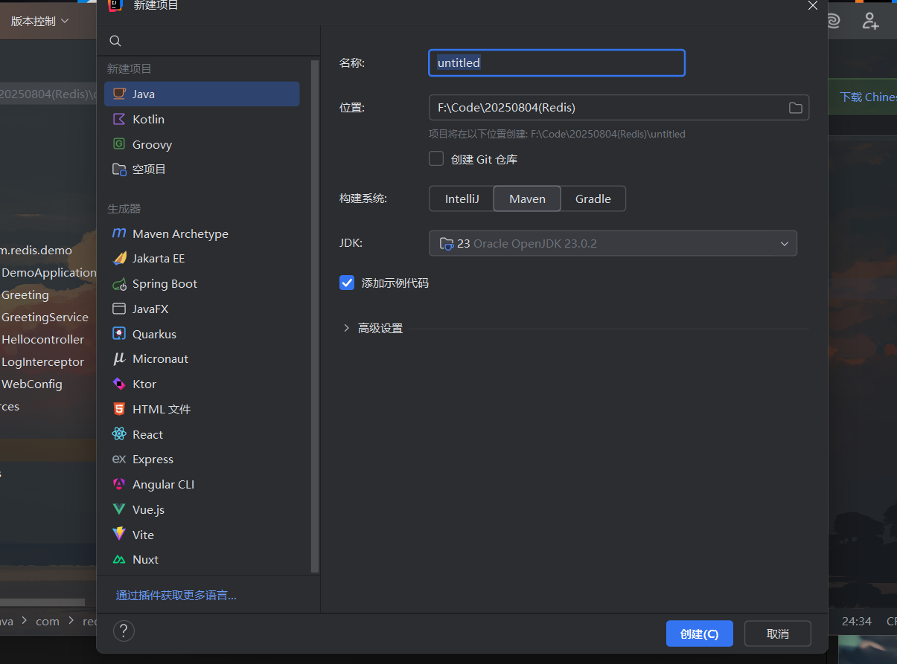

详细内容可见这一篇文章，博主在此就不献丑了（主要还是回来敲文字太麻烦）

[java-Web基础之Servlet、Filter、Listener](https://blog.ulna520.top/2025/05/19/java-Web%E5%9F%BA%E7%A1%80_20250519_165356/)

# Maven构建

Java中的Servlet，Filter，Listener等组件需要一定的依赖，所以我们需要在构建工具中进行演示和学习。本文使用Maven项目作为示例。

## 文件项目结构

我们可以通过IDEA直接构建一个Java的maven项目，选择好版本后可直接创建：



类似这样即可，获得一个初始化的项目

但此时的pom.xml还很简陋，后续我们还需要添加一些依赖：

```xml
<project xmlns="http://maven.apache.org/POM/4.0.0"
         xmlns:xsi="http://www.w3.org/2001/XMLSchema-instance"
         xsi:schemaLocation="http://maven.apache.org/POM/4.0.0
                             http://maven.apache.org/xsd/maven-4.0.0.xsd">
    <modelVersion>4.0.0</modelVersion>

    <groupId>com.example</groupId>
    <artifactId>servlet-lifecycle-demo</artifactId>
    <version>1.0-SNAPSHOT</version>
    <packaging>war</packaging>

    <dependencies>
        <dependency>
            <groupId>javax.servlet</groupId>
            <artifactId>javax.servlet-api</artifactId>
            <version>4.0.1</version> <scope>provided</scope>
        </dependency>
    </dependencies>

    <build>
        <finalName>servlet-lifecycle-demo</finalName>
        <plugins>
            <plugin>
                <groupId>org.apache.maven.plugins</groupId>
                <artifactId>maven-war-plugin</artifactId>
                <version>3.3.1</version>
            </plugin>
        </plugins>
    </build>
</project>
```


# Servlet

Servlet 是JavaWeb技术的核心组件，本质上就是运行在服务器端的小程序，用于处理客户端(如浏览器)的请求，生成动态响应。Servlet主要用于处理Http请求，实现动态网页内容生成。

## Servlet 生命周期


Servlet的生命周期由Servlet容器(如Tomcat)管理，主要有以下几个阶段：

> Servlet容器：Web服务器，用于接收HTTP请求并调用你写的Servlet 代码处理请求


### 初始化 `init()`


* 在Servlet第一次被访问时，容器会创建一个Servlet实例，然后调用它的 `init()`方法。
* 通常用来做资源的初始化操作、比如数据库连接、读取配置文件等。

```java
@Override
public void init() throws ServletException {
    System.out.println("Servlet 初始化：init()");
}
```


### 请求处理 `service()`


* 每次有客户端请求Servlet，Tomcat就会调用Servlet实例的 `service()` 方法
* `service()<span> </span>`实例会自动判断请求类型(GET/POST)，然后分发给对应的doGet() 或 doPost()

```java
@Override
protected void doGet(HttpServletRequest req, HttpServletResponse resp) throws ServletException, IOException {
    resp.getWriter().write("处理 GET 请求");
}

@Override
protected void doPost(HttpServletRequest req, HttpServletResponse resp) throws ServletException, IOException {
    resp.getWriter().write("处理 POST 请求");
}

```


### 销毁 `destroy()`


* 当Tomcat关闭、或Servlet被卸载(如热更新时)，容器会调用 `destroy()`方法
* 通常用来释放资源，如关闭数据库连接，停止线程等。

```java
@Override
public void destroy() {
    System.out.println("Servlet 被销毁：destroy()");
}
```
