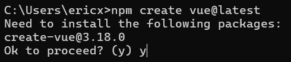
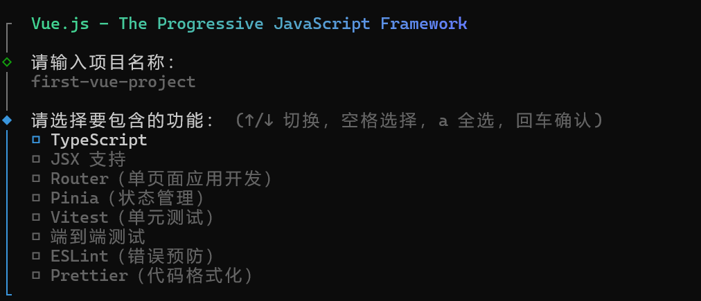
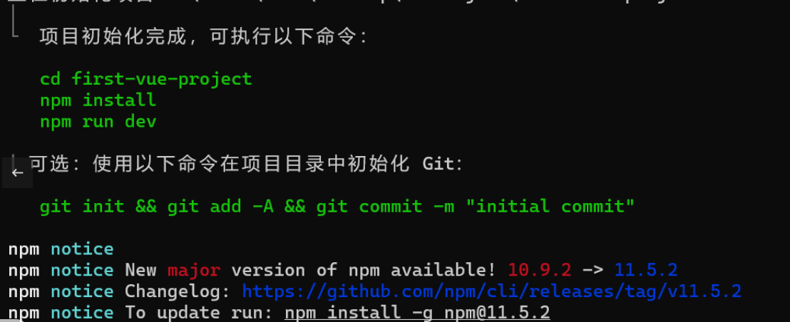
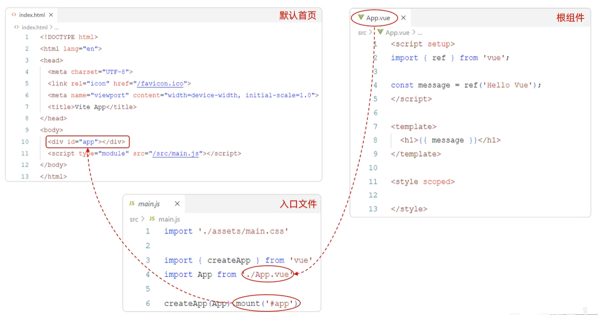
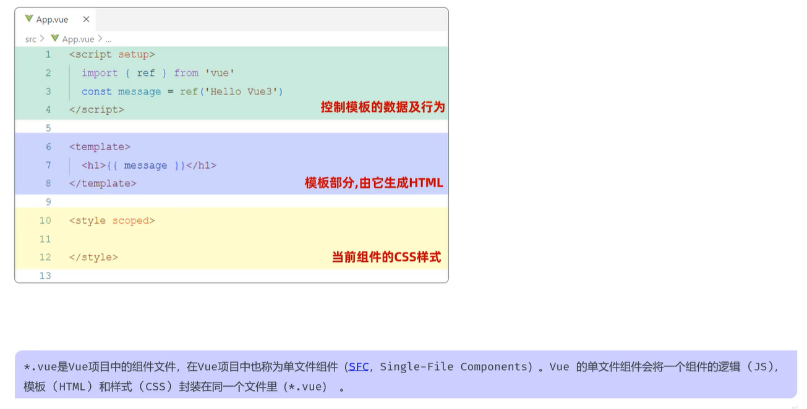
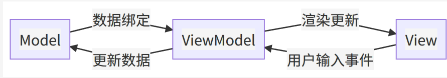

# 环境准备

## Vue3项目

* **定义** ：Vue 官方提供的脚手架工具，用于快速生成 Vue 项目的模板。
* **作用** ：帮助开发者高效创建符合最佳实践的 Vue 项目结构。

 **核心功能** ：

| 功能                     | 说明                                         |
| ------------------------ | -------------------------------------------- |
| 统一的目录结构           | 保持不同项目间的目录规范一致，便于协作与维护 |
| 本地调试                 | 内置本地开发服务器，可即时查看修改效果       |
| 热部署（Hot Deployment） | 修改代码后自动刷新页面，提高开发效率         |
| 单元测试                 | 集成单元测试框架，便于代码质量保证           |
| 集成打包上线             | 提供打包工具和配置，便于一键部署到生产环境   |

依赖环境：[Node.js — Run JavaScript Everywhere](https://nodejs.org/zh-cn)

# 创建Vue3项目

安装好nodejs后，我们在工作目录下打开powershell输入：

```bash
npm create vue@latest
```

这会安装名为 create-vue 的 Vue 官方的项目脚手架工具，输入y表示确认安装



之后我们输入项目名称，然后选择包含的功能：(名称默认为vue-project)



| 功能                                | 作用                                                                | 典型应用场景                                        |
| ----------------------------------- | ------------------------------------------------------------------- | --------------------------------------------------- |
| **TypeScript**                | 为项目引入强类型系统，提供类型检查与更好的 IDE 提示，减少运行时错误 | 复杂业务、多人协作、需要长期维护的项目              |
| **JSX 支持**                  | 允许在 `.vue`外使用 JSX/TSX 语法编写组件，更灵活的逻辑和渲染控制  | 需要在模板中编写复杂逻辑、或从 React 迁移过来的项目 |
| **Router（单页面应用开发）**  | 集成 Vue Router，支持多页面路由、嵌套路由和动态路由                 | SPA 应用、需要页面切换的后台管理系统                |
| **Pinia（状态管理）**         | 官方推荐的新一代状态管理库，替代 Vuex，API 更简洁，支持 TypeScript  | 多组件间共享数据、需要持久化的应用                  |
| **Vitest（单元测试）**        | 轻量快速的单元测试框架，与 Vite 深度集成，支持热更新测试            | 功能模块验证、算法测试、回归测试                    |
| **端到端测试（E2E Testing）** | 模拟真实用户在浏览器中的操作，验证全流程功能                        | 大型应用上线前验证、关键用户流程保障                |
| **ESLint（错误预防）**        | 统一代码风格、检测潜在错误，支持自动修复                            | 团队协作、代码审查前自动格式检查                    |
| **Prettier（代码格式化）**    | 自动统一代码排版，使格式一致、美观                                  | 跨团队协作、快速保持代码可读性                      |

选择实验功能：

| 功能                                | 说明                                                                                        | 适用场景                                       | 注意事项                                           |
| ----------------------------------- | ------------------------------------------------------------------------------------------- | ---------------------------------------------- | -------------------------------------------------- |
| **OxLint（试验阶段）**        | 新一代 JavaScript/TypeScript 代码检查工具，目标是比 ESLint 更快、更轻量，支持现代语法和规则 | 想体验更高性能的代码检查，尤其是大型项目       | 生态和规则库还不如 ESLint 完善，可能需要自定义配置 |
| **rolldown-vite（试验阶段）** | 基于 Rust 实现的 Vite 打包器替代方案，旨在提升构建速度和资源优化效果                        | 对构建速度要求极高的项目，或想测试最新打包技术 | 兼容性和插件支持可能不如 Vite 默认打包器成熟       |

之后选择需要的内容即可，安装完成



之后可以执行这三条命令进行依赖安装和直接运行：

```bash
cd first-vue-project
npm install
npm run dev
```

> npm安装时，依赖仅安装在 **当前项目中** ，所以每个项目启动前都需要执行 `npm install`安装依赖。

# Vue项目目录

```NIX
first-vue-project/
├── node_modules/          # npm依赖包目录
├── public/                # 静态资源目录
│   └── favicon.ico  
├── src/                   # 源代码目录
│   ├── assets/            # 资源文件目录
│   │   ├── main.css       # 全局样式文件
│   │   └── logo.svg       # Logo等图片资源
│   ├── components/        # Vue组件目录
│   │   ├── HelloWorld.vue 
│   │   └── TheWelcome.vue 
│   ├── router/            # 路由配置目录
│   │   └── index.js       # 路由配置文件
│   ├── views/             # 页面组件目录
│   │   ├── HomeView.vue   
│   │   └── AboutView.vue 
│   ├── App.vue            # 根组件
│   └── main.js            # 应用入口文件
├── .gitignore             # Git忽略文件配置
├── .vscode/               # VSCode配置目录
│   └── extensions.json    # 推荐的VSCode扩展
├── index.html             # HTML入口文件
├── package.json           # 项目配置和依赖管理
├── package-lock.json      # 依赖版本锁定文件
├── README.md              # 项目说明文档
└── vite.config.js         # Vite配置文件
```

### 配置文件

* **`package.json`** : 项目的核心配置文件，包含项目名称、版本、依赖包、脚本命令等
* **`vite.config.js`** : Vite构建工具的配置文件，定义开发服务器、构建选项、插件等
* **`index.html`** : 应用的HTML入口文件，Vite会自动注入构建后的JS和CSS文件
* **`.gitignore`** : 定义Git版本控制忽略的文件和目录
* **`README.md`** : 项目说明文档，通常包含项目介绍、安装和使用说明

### src目录

* **src/components** （组件）：存放可复用的Vue组件，如按钮、表单、卡片等通用UI组件
* **src/views** （页面）：存放路由对应的页面级组件，每个文件通常对应一个路由页面
* **src/router** （路由）：
* **`index.js`** : Vue Router配置文件，定义应用的路由规则和导航守卫
* **src/assets** （资源）：存放静态资源文件：图片、样式文件、字体文件等。
* **`main.js`** : 应用的JavaScript入口文件，创建Vue实例、挂载路由、全局配置等
* **`App.vue`** : 根组件，所有其他组件的父组件，定义应用的基本布局

### public目录

存放不需要构建处理的静态资源，这些文件会直接复制到构建输出目录。

### node_modules目录

npm安装的所有依赖包，由 `package.json`中的依赖自动生成，不应手动修改

## Vue基础配置

配置端口号、外部访问、自动打开浏览器：

在你的 `vite.config.js` 文件中添加 `server` 配置：

```js
import { fileURLToPath, URL } from 'node:url'

import { defineConfig } from 'vite'
import vue from '@vitejs/plugin-vue'
import vueDevTools from 'vite-plugin-vue-devtools'

// https://vite.dev/config/
export default defineConfig({
  plugins: [
    vue(),
    vueDevTools(),
  ],
  resolve: {
    alias: {
      '@': fileURLToPath(new URL('./src', import.meta.url))
    },
  },
  server:{
    port: 3000,	// 修改为你想要的端口号
    host: true, // 可选：允许外部访问
    open: true // 可选：自动打开浏览器
  }
})

```

# Vue项目的开发流程

`index.html`：

```html
<!DOCTYPE html>
<html lang="">
  <head>
    <meta charset="UTF-8">
    <link rel="icon" href="/favicon.ico">
    <meta name="viewport" content="width=device-width, initial-scale=1.0">
    <title>Vite App</title>
  </head>
  <body>
    <div id="app"></div>
    <script type="module" src="/src/main.js"></script>
  </body>
</html>

```

这是一个普通的html文件，body部分定义了一个id为 `app`的div标签，然后引入了 `src/main.js`文件。

```js
// 引入全局样式文件，使样式在整个应用中生效
import './assets/main.css'

// 从 Vue 库中引入 createApp 方法，用于创建应用实例
import { createApp } from 'vue'
// 引入根组件 App，作为应用的入口组件
import App from './App.vue'
// 引入路由实例，用于管理前端路由
import router from './router'

// 使用根组件 App 创建一个新的 Vue 应用实例
const app = createApp(App)

// 将路由插件注册到应用实例中，启用路由功能
app.use(router)

// 将应用挂载到页面中 id 为 'app' 的 DOM 节点上
app.mount('#app')

```

`main.js`中，我们将 `App.vue`中定义的Vue应用创建为实例，并最终挂载在index.html中的 `<div>`标签中。以达到渲染Vue程序的效果。

`App.vue`的Options API写法：

```js
<!-- 脚本区域，定义组件的逻辑和数据 -->
<script>
export default{ // 导出一个默认的组件配置对象
  data(){ // data 选项，定义组件的响应式数据
    return { // 返回一个对象，包含该组件的数据
      message: 'Hello World' // 定义名为 message 的数据，初始值为 'Hello World'
    }  
  }, 
} 
</script>

<!-- 模板区域，定义组件的 HTML 结构 -->
<template>
  <!-- 根容器，用于包裹组件内容 -->
  <div>
    <!-- 插值语法，渲染 data 中的 message 数据到页面 -->
    {{ message }}
  </div>
</template>

<!-- CSS样式区域 -->
<style scoped>

</style>
```

main.js将组件从vue文件中引入，通过createApp创建并注册到实例中



# API

## Vue3 基础

官网：[Vue.js - 渐进式 JavaScript 框架 | Vue.js](https://cn.vuejs.org/)

基本定义：

* **框架类型** ：前端 JavaScript 框架
* **目标** ：免去直接操作 DOM，简化代码书写
* **核心思想** ：基于 **MVVM (Model-View-ViewModel)** 模式
* **特性** ：数据 **双向绑定** ，编程关注点集中在数据逻辑而非 UI 更新



## 快速上手

```js
<div id="app">{{ message }}</div>

<script type="module">
  import { createApp } from 'https://unpkg.com/vue@3/dist/vue.esm-browser.js'

  createApp({
    data() {
      return {
        message: 'Hello Vue!'
      }
    }
  }).mount('#app')
</script>
```

* `createApp(...)`：创建一个Vue应用实例。
* `data()`：在这里定义的响应式数据、方法如果被 **返回** ，就可以被模板使用
* `.mount('#app')`：挂载应用到指定DOM容器。

### 整体执行流程

1. `createApp({...})` → 创建 Vue 应用实例。
2. `date()` 执行 → 定义响应式数据 `message`。
3. `return { message }` → 让模板能用到 `message`。
4. `.mount('#app')` → 绑定 `#app`，渲染出 `Hello Vue!`，并监听数据变化。

### Vue常用指令

| 指令                    | 用途                                                        | 示例代码                                                                                         | 注意点                                                                                        |
| ----------------------- | ----------------------------------------------------------- | ------------------------------------------------------------------------------------------------ | --------------------------------------------------------------------------------------------- |
| **`v-bind`**    | 动态绑定 HTML 属性值（如 `href`、`class`、`style`等） | `html<a v-bind:href="url">跳转</a>`                                 | 可用 `:`缩写，例如 `:class`；绑定 `style`时可用对象或数组形式                           |
| **`v-model`**   | 表单元素双向数据绑定                                        | `html<input v-model="username"/>``{{ username }}`                                              | 底层相当于 `:value`+`@input`组合；适配多种表单元素（`input`、`textarea`、`select`） |
| **`v-on`**      | 事件绑定                                                    | `html<button v-on:click="handleClick">点我</button><button @click="handleClick">简写</button>` | 支持事件修饰符 `.stop`、`.prevent`、`.once`等                                           |
| **`v-if`**      | 条件渲染（元素在条件为 `true`时渲染，否则销毁）           | `<p v-if="score" >= 90">成绩优秀</p>`                                                          | 频繁切换可能影响性能，因为会反复创建/销毁节点                                                 |
| **`v-else-if`** | 条件渲染的 else-if 分支                                     | `<p v-else-if="score" >= 60">成绩及格</p>`                                                     | 必须跟在 `v-if`或 `v-else-if`后                                                           |
| **`v-else`**    | 条件渲染的 else 分支                                        | `<p v-else>需要加油</p>`                                                                       | 必须紧挨在 `v-if`/`v-else-if`后面                                                         |
| **`v-show`**    | 条件渲染（通过 `display`切换显示/隐藏）                   | `<p v-show="isVisible">这段文字可以被快速隐藏/显示</p>`                                        | 节点始终存在于 DOM 中，仅切换样式，适合频繁切换                                               |
| **`v-for`**     | 列表渲染                                                    | `<li v-for="(item, index) in items" :key="index">``{{ index + 1 }}. {{ item }}``</li>`         | 必须有唯一 `key`以优化性能；支持对象遍历                                                    |

### Vue生命周期

**生命周期** ：指组件从 **创建 → 挂载 → 更新 → 销毁** 的整个过程。

在每个阶段，Vue 会自动调用对应的 **生命周期钩子函数** （Hooks）让我们在特定时机执行逻辑。

生命周期的八个阶段& 钩子方法：

| 阶段顺序 | 钩子方法          | 触发时机                                     | 常见用途                         |
| -------- | ----------------- | -------------------------------------------- | -------------------------------- |
| ①       | `beforeCreate`  | 实例初始化之前（data 和 methods 未初始化）   | 初始化非响应式数据、加载全局配置 |
| ②       | `created`       | 实例创建完成（data 已初始化，但 DOM 未挂载） | 发起 Ajax 请求、初始化数据状态   |
| ③       | `beforeMount`   | 模板编译完成，但尚未挂载到 DOM               | 在渲染前进行最后的数据修改       |
| ④       | `mounted`       | 组件挂载到 DOM 之后                          | 操作真实 DOM、第三方插件初始化   |
| ⑤       | `beforeUpdate`  | 响应式数据更新、DOM 重新渲染前               | 在渲染前保存状态、调试数据变化   |
| ⑥       | `updated`       | 虚拟 DOM 重新渲染并应用到真实 DOM 后         | 根据最新 DOM 状态执行逻辑        |
| ⑦       | `beforeUnmount` | 组件实例销毁前                               | 清除定时器、解绑事件、保存数据   |
| ⑧       | `unmount`       | 组件已销毁                                   | 释放资源、断开 WebSocket 连接等  |

* `mounted`：挂载完成,Vue初始化成功,HTML页面渲染成功。(发送请求到服务端,加载数据)

Vue3重写 `mounted`钩子方法：

```js
<div id="app">
</div>

<script type="module">
  import { createApp } from 'https://unpkg.com/vue@3/dist/vue.esm-browser.js'

createApp({
  data() {
    return {
      emps: []
    }
  },
  mounted() {
    axios.get('http://yapi.smart-xwork.cn/mock/169327/emp/list')
      .then(result => {
        this.emps = result.data.data
      })
      .catch(error => {
        console.error('获取员工数据失败', error)
      })
  }
}).mount('#app')
</script>
```

#### 数据响应式与异步请求

##### 一、声明响应式数据：`ref` 的基础应用

```js
//声明响应式数据
const name = ref('');
const gender = ref('');
const job = ref('');

const userList = ref([]);
```

1. 概念解析：

在 Vue 3 的组合式 API 中，ref 是一个核心函数，用于创建响应式数据。当你使用 ref 包裹一个基本类型（如字符串、数字）或复杂类型（如数组、对象）时，Vue 会自动追踪这个变量的变化。当这个变量的值发生改变时，任何依赖于它的视图都会自动更新。

2. 为什么需要 ref？

Vue 的视图是“声明式”的，即视图会根据数据自动渲染。但 JavaScript 本身并不知道数据的变化。ref 的作用就像一个“侦听器”，它将一个普通值封装成一个特殊的引用对象（Reference Object）。

* **内部原理：** `ref` 对象只有一个属性：`.value`。它在底层使用了 Vue 的响应式系统，当 `.value` 被访问或修改时，Vue 就会感知到变化，并触发依赖更新。
* **使用方式：** 在 `<script setup>` 中，你可以直接使用 `name`、`gender` 等变量，但在其他地方（例如 `search` 函数内部），你需要通过 `.value` 来访问或修改它们的值，例如：`name.value = 'John'`。
* **数组和对象：** 对于 `const userList = ref([]);`，你创建了一个响应式的空数组。如果你要往这个数组中添加数据，正确的做法是 `userList.value.push(...)`。

3. 思考：ref vs reactive

Vue 3 提供了两种创建响应式数据的方式：ref 和 reactive。

* **`ref`** 更适合处理**基本类型**数据，或者当你需要将一个值作为引用传递时。
* **`reactive`** 更适合处理**对象**或 **数组** ，它会深度响应式地追踪对象的所有属性。

在实践中，如果你的数据是一个简单的值或一个需要频繁替换的对象，`ref` 是更好的选择；如果是一个复杂的嵌套对象，`reactive` 可能更直观。

---

##### 二、异步请求处理：`async/await` 与 Axios

```js
//声明函数 - 箭头函数 - await & async
const search = async () => {
  //基于axios发送异步请求，请求服务器端加载数据
  const result = await axios.get('https://...');
}
```

1. 概念解析：

这段代码展示了现代 JavaScript 处理异步操作的最佳实践：async/await。

* **`async` 关键字：** 放在函数前面，表示这个函数是一个 **异步函数** 。异步函数在执行时，会返回一个 `Promise` 对象，允许你在函数内部使用 `await`。
* **`await` 关键字：** 只能在 `async` 函数内部使用。它会“暂停”函数的执行，直到它后面的 `Promise` 对象解析（resolve）完成并返回结果。

**2. 为什么使用 `async/await`？**

* **解决“回调地狱”：** 在 `async/await` 出现之前，我们通常使用 `.then().catch()` 来处理 Promise，当异步操作嵌套较深时，代码可读性会变差。
* **同步的代码风格：** `async/await` 让你用类似同步的方式编写异步代码，大大提高了代码的**可读性**和 **可维护性** 。`const result = await axios.get(...)` 就像是在说“等待 `axios.get` 请求完成，然后将结果赋值给 `result`”。

3. Axios 在这里的作用：

Axios 是一个基于 Promise 的 HTTP 客户端，用于浏览器和 Node.js。它的 axios.get() 方法本身就返回一个 Promise 对象，这使得它与 async/await 天然地完美配合。

* **数据获取：** `await axios.get(...)` 返回的 `result` 对象通常包含响应的所有信息，如：
  * `result.data`：服务器返回的真正数据
  * `result.status`：HTTP 状态码
  * `result.headers`：响应头信息

4. 进阶思考：错误处理

在实际项目中，我们必须考虑网络请求失败的情况。async/await 配合 try...catch 块是处理错误的首选方式，它提供了与同步代码类似的错误捕获机制。

```js
const search = async () => {
  try {
    const response = await axios.get('https://...');
    // 请求成功，在这里处理 response.data，例如：
    userList.value = response.data.list; // 注意要使用 .value
  } catch (error) {
    // 请求失败，在这里处理错误
    console.error('请求失败：', error);
  }
}
```

这段代码是一个非常好的起点。它将 Vue 3 的数据响应式与现代 JavaScript 的异步处理完美结合。在实际项目中，你还需要考虑加载状态（`isLoading = ref(true)`）、请求参数（`params`）以及更复杂的错误处理逻辑。
