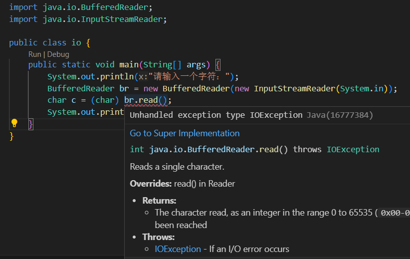

*⌈去成为谁也抓不住的风⌋*


# 控制台input

## System.in

`System.in` 是java中的一个静态成员变量，属于 `java.lang.System` 类，它是一个 `InputStream`，绑定到键盘，直接使用它进行读取有许多不方便之处：

* 它只能以**字节**为单位读取数据。
* 读取数据需要**手动处理字节到字符**的转换，以及处理不同数据类型（例如整数、浮点数等）。
* 中文字符通常占用多个字节，如果一次读取的字节数不足以包含一个完整的中文字符，则需要多次读取并将结果拼接起来。
* 需要**手动处理异常**

## BufferedReader


我们通常将System.in包装在一个InputStreamReader类中，将读取的字节流转换为字符流。在java中，char类型占用两个字节的空间，对于文本数据，我们可以通过InputStreamReader类来将原始的字节流合并为字符流，将两个字节的内容合并的一个char类型数据。

再将整体包装在一个BuffereredReader中，实现缓冲读取字节流转化为字符流的过程。

```java
import java.io.BufferedReader;
import java.io.InputStreamReader;

public class io {
    public static void main(String[] args) {
        System.out.println("请输入一个字符：");
        BufferedReader br = new BufferedReader(new InputStreamReader(System.in));
        char c = (char) br.read();
        System.out.println("您输入的字符是：" + c);
    }
}
```




Unhandled exception type IOException：未处理的 IOException 异常类型

BufferedReader.read()方法会抛出一个异常 `IOException`，因此我们需要使用 `try-catch` 来进行异常处理，这也就是我们之前引用的第三个头文件。

```java
import java.io.BufferedReader;
import java.io.InputStreamReader;
import java.io.IOException;

public class BfReader {
    public static void main(String[] args) {
        System.out.println("请输入一个字符：");
        BufferedReader br = new BufferedReader(new InputStreamReader(System.in));
        try {
            char c = (char) br.read();
            System.out.println("您输入的字符是：" + c);
        } catch (IOException e) {
            System.err.println("读取字符时发生错误: " + e.getMessage());
        }
    }
}
```


### 读取int、float、double类型数据

通过BufferedReader读取int、float、double类型需要借助三个java静态函数，分别是：

```java
int intValue = Integer.parseInt(bf.readLine());
float floatValue = Float.parseFloat(bf.readLine());
double doubleValue = Double.parseDouble(bf.readLine());
```
