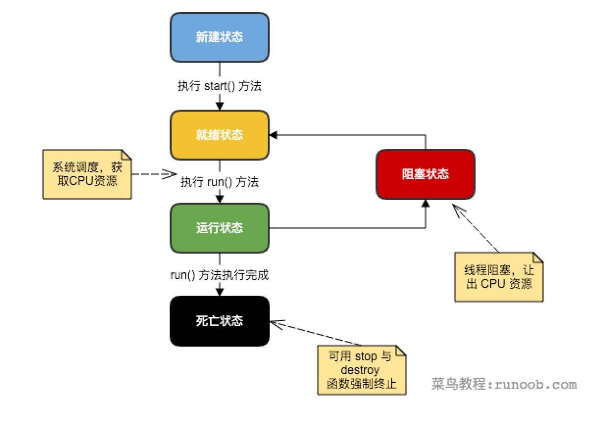
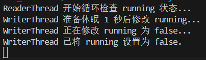
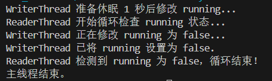

# 线程与进程

### 进程(Process)

* 进程是程序的运行实例。拥有**独立**的内存空间
* 系统为每个进程分配资源(如CPU时间、内存等)。
* 多个进程之间是相互独立的，它们通常不能直接访问彼此的内存。

### 线程(Thread)

进程中一个单一顺序的控制流，即进程中的执行单元。一个进程可以包含多个线程，这些线程共享同一个进程的资源(如内存)，但可以独立运行，执行不同的任务

# Java中线程的创建与生命周期

线程完整的生命周期：



## 线程的创建方式

### 方式一：继承 `Thread` 类

最直接的创建线程的方式，你的类直接成为一个线程：

```java
// 继承 Thread 类
class MyThread extends Thread {
    @Override
    public void run() {
        // 线程执行的任务逻辑都写在这里
        for (int i = 0; i < 5; i++) {
            System.out.println(Thread.currentThread().getName() + " - Count: " + i);
            try {
                // 让线程休眠一小段时间，模拟耗时操作
                Thread.sleep(100); 
            } catch (InterruptedException e) {
                System.out.println(Thread.currentThread().getName() + " was interrupted.");
                // 收到中断信号时，通常需要处理或退出循环
                Thread.currentThread().interrupt(); // 重新设置中断标志
            }
        }
        System.out.println(Thread.currentThread().getName() + " finished.");
    }
}

public class ThreadCreationDemo1 {
    public static void main(String[] args) {
        System.out.println("Main thread started.");

        // 创建 MyThread 实例
        MyThread thread1 = new MyThread();
        // 设置线程名称，便于调试
        thread1.setName("Worker-Thread-1"); 

        // 启动线程
        // 注意：这里是调用 start() 方法，而不是 run() 方法
        thread1.start(); 

        // 主线程继续执行自己的任务
        for (int i = 0; i < 5; i++) {
            System.out.println(Thread.currentThread().getName() + " - Main Count: " + i);
            try {
                Thread.sleep(150); 
            } catch (InterruptedException e) {
                e.printStackTrace();
            }
        }
        System.out.println("Main thread finished.");
    }
}
```

继承类中启动命令是start()方法，但在线程类中声明的却是run()方法

### 方式二：实现 `Runnable` 接口

更为灵活的创建方式

```java
// 实现 Runnable 接口
class MyRunnable implements Runnable {
    private String taskName;

    public MyRunnable(String taskName) {
        this.taskName = taskName;
    }

    @Override
    public void run() {
        // 线程执行的任务逻辑
        for (int i = 0; i < 5; i++) {
            System.out.println(taskName + " - Count: " + i);
            try {
                Thread.sleep(120);
            } catch (InterruptedException e) {
                System.out.println(taskName + " was interrupted.");
                Thread.currentThread().interrupt();
            }
        }
        System.out.println(taskName + " finished.");
    }
}

public class ThreadCreationDemo2 {
    public static void main(String[] args) {
        System.out.println("Main thread started.");

        // 创建 Runnable 实例
        MyRunnable task1 = new MyRunnable("Runnable-Task-1");
        MyRunnable task2 = new MyRunnable("Runnable-Task-2");

        // 将 Runnable 实例作为参数传入 Thread 构造器
        Thread threadA = new Thread(task1);
        threadA.setName("Thread-A");

        Thread threadB = new Thread(task2);
        threadB.setName("Thread-B");

        // 启动线程
        threadA.start();
        threadB.start();

        // 主线程继续执行自己的任务
        for (int i = 0; i < 5; i++) {
            System.out.println(Thread.currentThread().getName() + " - Main Count: " + i);
            try {
                Thread.sleep(100);
            } catch (InterruptedException e) {
                e.printStackTrace();
            }
        }
        System.out.println("Main thread finished.");
    }
}
```

这样可以避免继承了其他类之后不能继承 `Thread`类的问题，并且实现 `Runnable` 接口允许多个线程共享同一个 `Runnable` 对象

最重要的是：使用 `Runnable` 接口的任务可以被提交到**线程池**中执行，这是现代Java并发编程的推荐方式。而 `Thread` 类在某些情况下就显得不那么灵活

### run()和start()

* **`run()` 方法：**
  * 它包含了线程实际执行的业务逻辑代码。
  * **直接调用 `run()` 方法，它只会像普通方法一样在当前线程中执行** ，并不会创建新的线程。你的程序依然是单线程的，只是调用了一个方法而已。
* **`start()` 方法：**
  * 它是启动新线程的“开关”。
  * 当你调用 `start()` 方法时，JVM（Java虚拟机）会执行以下操作：
    1. **分配新的栈空间和程序计数器**给这个线程。
    2. **调用线程的 `run()` 方法** 。
  * 只有调用 `start()` 方法，才能真正启动一个独立的执行流，从而实现多线程。

**记住：永远不要直接调用线程的 `run()` 方法来启动一个新线程。**

## 线程的生命周期

线程并非从创建到结束一直处于运行状态

Java中线程的生命周期通常被划分为以下六种状态（自Java 5引入 `java.lang.Thread.State` 枚举），重点在于12347：

1. **新建 (New)：**
   当你使用 `new Thread()` 创建了一个线程对象，但还没有调用 `start()` 方法时，线程就处于这个状态。它只是一个对象，还没有得到系统资源的分配。
   * **代码示例：** `Thread thread = new Thread(myRunnable);` 此时 `thread` 处于 `NEW` 状态。
2. **可运行 (Runnable)：**
   当你调用了线程的 `start()` 方法后，线程就进入了可运行状态。处于此状态的线程可能正在运行，也可能正在等待CPU的调度。这取决于操作系统和JVM的线程调度策略。
   对于多核处理器，可能多个线程同时处于 `RUNNABLE` 状态并且并行执行；对于单核处理器，则会通过**时间片轮转**来切换执行。
   * **代码示例：** `thread.start();` 此时 `thread` 处于 `RUNNABLE` 状态。
3. **运行 (Running)：**
   这是一个概念上的状态，表示线程正在CPU上执行任务。在JVM层面，`RUNNABLE` 状态包含了正在运行和等待CPU调度的线程。
4. **阻塞 (Blocked)：**
   当一个线程试图获取一个对象的 **同步锁（`synchronized` 关键字或 `ReentrantLock` 等）** ，但这个锁已经被其他线程持有，那么这个线程就会进入阻塞状态，直到它获取到所需的锁。
   * **代码示例：** 两个线程同时尝试进入同一个 `synchronized` 方法或代码块，其中一个线程会 `BLOCK`。
5. **等待 (Waiting)：**
   线程无限期地等待另一个线程执行特定操作。例如，调用 `Object.wait()` 方法，或者调用 `Thread.join()` 方法，或者等待 `LockSupport.park()`。
   它不会自动唤醒，需要其他线程显式地调用 `Object.notify()` / `Object.notifyAll()` 或 `LockSupport.unpark()` 来唤醒。
   * **代码示例：**
     **Java**

     ```
     Object lock = new Object();
     synchronized (lock) {
         lock.wait(); // 线程进入 WAITING 状态，并释放锁
     }
     // 或者：
     Thread anotherThread = new Thread(() -> { /* ... */ });
     anotherThread.start();
     anotherThread.join(); // 当前线程等待 anotherThread 结束
     ```
6. **定时等待 (Timed Waiting)：**
   线程在指定的时间内等待另一个线程执行一个操作，或者等到指定的时间过后。例如，调用 `Thread.sleep(long millis)`、`Object.wait(long millis)`、`Thread.join(long millis)`、`LockSupport.parkNanos(long nanos)`、`LockSupport.parkUntil(long deadline)`。
   在指定时间到达后，线程会自动从 `TIMED_WAITING` 状态返回到 `RUNNABLE` 状态（如果被唤醒，则提前）。
   * **代码示例：** `Thread.sleep(1000);` 此时线程处于 `TIMED_WAITING` 状态。
7. **终止 (Terminated)：**
   线程已经执行完毕，或者因异常而退出 `run()` 方法。一旦线程进入终止状态，它就不能再被重新启动。
   * **代码示例：** 线程的 `run()` 方法执行完毕或抛出未捕获的异常。

## Thread 方法

下表列出了Thread类的一些重要方法：

| **序号** | **方法描述**                                                                                                                                 |
| -------------- | -------------------------------------------------------------------------------------------------------------------------------------------------- |
| 1              | **public void start()**``使该线程开始执行；**Java** 虚拟机调用该线程的 run 方法。                                                      |
| 2              | **public void run()**``如果该线程是使用独立的 Runnable 运行对象构造的，则调用该 Runnable 对象的 run 方法；否则，该方法不执行任何操作并返回。 |
| 3              | **public final void setName(String name)**``改变线程名称，使之与参数 name 相同。                                                             |
| 4              | **public final void setPriority(int priority)**``更改线程的优先级。                                                                          |
| 5              | **public final void setDaemon(boolean on)**``将该线程标记为守护线程或用户线程。                                                              |
| 6              | **public final void join(long millisec)**``等待该线程终止的时间最长为 millis 毫秒。                                                          |
| 7              | **public void interrupt()**``中断线程。                                                                                                      |
| 8              | **public final boolean isAlive()**``测试线程是否处于活动状态。                                                                               |

上述方法是被 Thread 对象调用的，下面表格的方法是 Thread 类的静态方法。

| **序号** | **方法描述**                                                                                                                                          |
| -------------- | ----------------------------------------------------------------------------------------------------------------------------------------------------------- |
| 1              | **public static void yield()**``暂停当前正在执行的线程对象，并执行其他线程。                                                                          |
| 2              | **public static void sleep(long millisec)**``在指定的毫秒数内让当前正在执行的线程休眠（暂停执行），此操作受到系统计时器和调度程序精度和准确性的影响。 |
| 3              | **public static boolean holdsLock(Object x)**``当且仅当当前线程在指定的对象上保持监视器锁时，才返回 true。                                            |
| 4              | **public static Thread currentThread()**``返回对当前正在执行的线程对象的引用。                                                                        |
| 5              | **public static void dumpStack()**``将当前线程的堆栈跟踪打印至标准错误流。                                                                            |

# 线程的同步与并发问题

*当多个线程**共享同一个资源**时，会发生什么？*

多个线程同时对一个数据进行读写操作，就可能导致**数据不一致**的问题

## 数据竞争（Data Race）与竞态条件（Race Condition）

* **数据竞争（Data Race）：** 当多个线程 **同时访问同一段内存区域** （共享变量），并且至少有一个线程进行 **写入操作** ，且这些操作**没有进行正确的同步**时，就会发生数据竞争。这是导致数据不一致的根本原因。
* **竞态条件（Race Condition）：** 程序的最终结果取决于 **线程执行的相对时序** 。上述银行取款的例子就是一个典型的竞态条件。不同的执行顺序会导致不同的结果，而你无法预测哪个线程会先完成。

## `synchronized` 关键字

Java提供了一个内置的同步机制，即 `synchronized` 关键字。它可以用来锁定一个对象或一段代码，确保在任何时刻，只有一个线程可以执行被 `synchronized` 保护的代码或访问被 `synchronized` 保护的对象

### 修饰方法

普通修饰：

* **锁是当前实例对象 `this`**
* 当一个线程调用一个 `synchronized` 实例方法时它必须获取该**实例**的锁。
* 其他线程如果也想调用该实例的**任何**synchronized实例方法，则必须等待锁释放。

```java
public class MyCounter {
    private int count = 0;

    // 同步实例方法，锁是 MyCounter 实例
    public synchronized void increment() {
        count++;
        System.out.println(Thread.currentThread().getName() + " incremented count to: " + count);
    }

    public int getCount() {
        return count;
    }
}
```

修饰静态方法：

* **锁是当前类的 `Class`对象(Myclass.class)**
* 当一个线程调用一个 `synchronized` 静态方法时，它必须先获取该类的Class对象的锁
* 其他线程如果也想调用该类的**任何** `synchronized` 静态方法，则必须等待锁释放。

```java
public class MyStaticCounter {
    private static int staticCount = 0;

    // 同步静态方法，锁是 MyStaticCounter.class
    public static synchronized void staticIncrement() {
        staticCount++;
        System.out.println(Thread.currentThread().getName() + " incremented staticCount to: " + staticCount);
    }

    public static int getStaticCount() {
        return staticCount;
    }
}
```

同步代码块：

将 `synchronized` 关键字用于一个代码块，并指定一个锁对象。

* 语法：`synchronized (lockObject) { // code to be synchronized }`
* `lockObject` 可以是任何对象(包括this、class对象、或其他自定义对象)
* 当一个线程进入synchronized 代码块时，它必须先获取 `lockObject<span> </span>`的锁
* 只有当该线程释放了 `lockObject`的锁后，其他线程才能获取该锁并进入该代码块。
* 这种方式提供了 **更细粒度的控制** ，只对需要同步的代码进行锁定，而不是整个方法。

## `synchronized` 的工作原理

当一个线程进入 `synchronized` 代码块或方法时，它会尝试获取一个 **对象的内置锁（monitor lock，也叫监视器锁）** 。

* 如果锁没有被其他线程持有，当前线程就获取到锁，然后执行被保护的代码。
* 如果锁已经被其他线程持有，当前线程就会进入 **阻塞状态** ，直到持有锁的线程释放锁。
* 当线程退出 `synchronized` 代码块或方法时（无论是正常结束还是抛出异常），它都会自动释放锁。

**这确保了在任何给定时刻，只有一个线程可以执行 `synchronized` 保护的代码段，从而避免了数据竞争。**

### 原理(Monitor/管程)

在Java中，`synchronized` 关键字实现同步的基石是  **Monitor（监视器）** ，也常被称为 **管程** 。每个Java对象都可以关联一个监视器，当一个线程试图进入 `synchronized` 代码块或方法时，它实际上就是在尝试获取这个对象所关联的监视器锁。

这与操作系统息息相关

**1.每个Java对象都是一个潜在的“锁”**

Java的设计哲学是， **每个Java对象都可以作为一把锁** 。当你使用 `synchronized` 关键字时，它背后操作的就是这个对象的监视器。

* **`synchronized (this)` 或 同步非静态方法：** 锁是当前实例对象。
* **`synchronized (SomeClass.class)` 或 同步静态方法：** 锁是当前类的 `Class` 对象。
* **`synchronized (someObject)`：** 锁是 `someObject` 实例。

**2. Monitor (管程) 的构成与工作机制**

在JVM层面，Monitor 是通过操作系统底层的互斥锁（Mutex）来实现的。每个Monitor都关联着一个Java对象，它主要包含以下几个关键部分：

1. **所有者（Owner）：**
   任何时刻， **只有一个线程可以拥有Monitor** 。当一个线程成功获取到Monitor的所有权后，它就可以进入被 `synchronized` 保护的“临界区”代码。
   如果Monitor已经被其他线程拥有，那么尝试获取该Monitor的线程就会进入**Entry Set（入口集合）**等待。
2. **Entry Set（入口集合 / 等待队列）：**
   这是一组**等待获取Monitor锁的线程**的集合。当一个线程调用 `synchronized` 代码块/方法，但发现Monitor已经被占用时，它就会被放入这个 `Entry Set` 中，并进入**阻塞（Blocked）**状态。这些线程会等待当前拥有Monitor的线程释放锁。
3. **Wait Set（等待集合 / 条件队列）：**
   这与 `Entry Set` 不同。`Wait Set` 中存放的是那些 **已经拥有Monitor锁** ，但由于某些**条件不满足**而调用了 `Object.wait()` 方法**主动释放锁并进入等待状态**的线程。
   当这些线程被 `Object.notify()` 或 `Object.notifyAll()` 唤醒时，它们并不会直接获得锁，而是会重新回到 `Entry Set` 去竞争锁。
4. **计数器（Reentrancy Counter）：**
   `synchronized` 是 **可重入锁** 。这意味着如果一个线程已经持有了某个对象的Monitor，那么它可以再次进入该对象的其他 `synchronized` 方法或代码块而不会死锁。
   Monitor内部有一个计数器。当一个线程首次获取Monitor时，计数器加1。每当同一个线程再次进入该Monitor（重入）时，计数器会再次加1。当线程退出 `synchronized` 代码块/方法时，计数器减1。只有当计数器归零时，锁才真正被释放。

**3. `synchronized` 的底层指令**

在JVM的字节码层面，`synchronized` 的实现主要是通过两个指令来完成的：

* **`monitorenter`：**
  当JVM执行到 `synchronized` 代码块的**开始位置**时，会执行 `monitorenter` 指令。它尝试获取 Monitor 的所有权。
  如果获取成功，计数器加1。如果Monitor已经被其他线程持有，当前线程会被阻塞直到获取到锁。
* **`monitorexit`：**
  当JVM执行到 `synchronized` 代码块的**结束位置**时（无论是正常退出还是异常退出），会执行 `monitorexit` 指令。它释放 Monitor 的所有权，计数器减1。当计数器为0时，锁才完全释放。

### 可重入性

`synchronized` 锁是可重入的。这意味着如果一个线程已经持有一个对象的锁，它可以再次进入同一个对象的其他 `synchronized` 方法或代码块而不会 **死锁** 。每次重入，锁的计数器会增加；每次退出，计数器会减少。只有当计数器归零时，锁才真正被释放

```java
public class ReentrancyDemo {

    public synchronized void methodA() {
        System.out.println(Thread.currentThread().getName() + "进入 methodA()");
        // 在 methodA() 中再次调用一个同步方法
        methodB(); 
        System.out.println(Thread.currentThread().getName() + "离开 methodA()");
    }

    public synchronized void methodB() {
        System.out.println(Thread.currentThread().getName() + "进入 methodB()");
        System.out.println(Thread.currentThread().getName() + "离开 methodB()");
    }

    public static void main(String[] args) {
        ReentrancyDemo demo = new ReentrancyDemo();

        new Thread(() -> {
            demo.methodA();
        }, "TestThread").start();
    }
}
```

运行上述代码，会有如下输出：

```
TestThread进入 methodA()
TestThread进入 methodB()
TestThread离开 methodB()
TestThread离开 methodA()
```

1. 当一个线程第一次成功获取到某个对象的Monitor锁时，这个 **计数器会加1** ，并且将Monitor的**所有者（Owner）**设置为当前线程。
2. 当同一个线程再次尝试获取这个对象的Monitor锁（例如，它调用了同一个对象的另一个 `synchronized` 方法，或者在一个 `synchronized` 方法中又调用了另一个 `synchronized` 方法），JVM会发现当前线程就是这个Monitor的Owner。此时，它不会阻塞当前线程，而是直接允许其进入，并且将 **计数器再次加1** 。
3. 每当线程退出一个 `synchronized` 代码块或方法时， **计数器就会减1** 。
4. 只有当计数器归零时，这个Monitor锁才会被完全释放，其他等待的线程才能有机会获取它

如果 `synchronized` 不具备重入性，那么当 `TestThread` 在 `methodA()` 中调用 `methodB()` 时，它会尝试再次获取 `demo` 对象的锁。由于 `demo` 对象的锁已经被 `TestThread` 持有，如果不可重入，`TestThread` 就会被自己阻塞，从而导致死锁。但由于 `synchronized` 是可重入的，`TestThread` 可以顺利进入 `methodB()`。


## `ReentrantLock`锁机制升级

本质上是locks部分：`ReentrantLock` 是 `Lock` 接口的实现类，它提供了与 `synchronized` 相似的互斥和内存可见性保证，但提供了更丰富的操作。

在Java 5之后，`java.util.concurrent.locks` 包（通常简称为 `JUC` 包中的 `locks` 部分）提供了比 `synchronized` 关键字更强大、更灵活的锁机制。其中最核心的就是 `ReentrantLock`。

### 核心方法


`Lock` 接口中几个重要的方法：

* **`void lock()`：**
  * 获取锁。如果锁被其他线程持有，当前线程会 **一直阻塞** ，直到获取到锁。
  * 与 `synchronized` 类似，是最常用的加锁方式。
* **`void unlock()`：**
  * 释放锁。 **必须在 `finally` 块中调用** ，以确保锁在任何情况下都能被释放，避免死锁。
  * 如果当前线程没有持有锁就调用 `unlock()`，会抛出 `IllegalMonitorStateException`。
* **`boolean tryLock()`：**
  * 尝试获取锁。如果锁可用，则立即获取并返回 `true`。
  * 如果锁不可用，则立即返回 `false`， **不会阻塞** 。
  * 这使得你可以实现非阻塞的锁获取逻辑，例如：“如果能拿到锁就处理，拿不到就先做别的事情”。
* **`boolean tryLock(long timeout, TimeUnit unit)`：**
  * 在指定的时间内尝试获取锁。
  * 如果在指定时间内获取到锁，返回 `true`。
  * 如果超时仍未获取到锁，返回 `false`。
  * 这使得你可以实现带超时机制的锁获取。
* **`void lockInterruptibly()`：**
  * 获取锁。如果锁被其他线程持有，当前线程会阻塞。
  * **但与 `lock()` 不同的是，如果当前线程在等待锁的过程中被中断，它会抛出 `InterruptedException`。**
  * 这使得你可以响应中断，优雅地退出等待。

```java
import java.util.concurrent.locks.Lock;
import java.util.concurrent.locks.ReentrantLock;

public class ReentrantLockDemo {
    private int counter = 0; // 共享资源：计数器
    private final Lock lock = new ReentrantLock(); // 创建 ReentrantLock 实例

    public void increment() {
        lock.lock(); // 获取锁
        try {
            // 临界区代码
            counter++;
            System.out.println(Thread.currentThread().getName() + " incremented counter to: " + counter);
        } finally {
            // 确保锁在任何情况下都被释放
            lock.unlock(); 
        }
    }

    public int getCounter() {
        // 通常读取共享变量也需要加锁，以保证可见性
        lock.lock();
        try {
            return counter;
        } finally {
            lock.unlock();
        }
    }

    public static void main(String[] args) throws InterruptedException {
        ReentrantLockDemo demo = new ReentrantLockDemo();

        Runnable task = () -> {
            for (int i = 0; i < 10000; i++) {
                demo.increment();
            }
        };

        Thread t1 = new Thread(task, "Thread-A");
        Thread t2 = new Thread(task, "Thread-B");
        Thread t3 = new Thread(task, "Thread-C");

        t1.start();
        t2.start();
        t3.start();

        t1.join(); 
        t2.join();
        t3.join();

        System.out.println("Final counter value: " + demo.getCounter());
        // 最终结果会是 30000
    }
}
```

**重点：`lock.unlock()` 必须放在 `finally` 块中！**
这是因为如果在 `try` 块中发生了异常，`lock()` 之后的代码可能不会执行，导致 `unlock()` 无法被调用，从而造成锁永远不会被释放，引发 **死锁** 。将 `unlock()` 放在 `finally` 块中，可以确保无论 `try` 块中的代码是否发生异常，`unlock()` 都会被执行。


### `ReentrantLock` 与 `synchronized` 的对比总结

| 特性/方面            | `synchronized`                               | `ReentrantLock`                                           |
| -------------------- | ---------------------------------------------- | ----------------------------------------------------------- |
| **用法**       | 关键字，隐式加锁/解锁                          | 类，显式调用 `lock()`和 `unlock()`方法                  |
| **灵活性**     | 较差，功能固定                                 | 更高，提供更多高级功能                                      |
| **中断响应**   | 无法响应中断（线程会一直阻塞）                 | `lockInterruptibly()`可响应中断                           |
| **尝试获取锁** | 无法实现非阻塞获取                             | `tryLock()`和 `tryLock(timeout, unit)`可实现            |
| **锁类型**     | 只能是排他锁                                   | 可实现公平锁/非公平锁，且可配合 `Condition`实现更复杂同步 |
| **性能**       | JDK 1.6 后优化很多，性能接近 `ReentrantLock` | 性能通常更高，尤其在低竞争环境下                            |
| **异常处理**   | 自动释放锁，无需 `finally`块                 | 必须在 `finally`块中手动 `unlock()`释放锁               |
| **底层实现**   | JVM 层面，基于 Monitor 对象                    | Java 代码层面，基于 AQS（AbstractQueuedSynchronizer）       |


## `volatile` 关键字

`volatile` 是Java 虚拟机提供的一种轻量级的同步机制，它主要用于保证变量的 **内存可见性** (Memory Visibility)和**禁止指令重排序。**

> Java内存层面上的观察者模式变量


### 内存可见性问题

 **Java内存模型** (Java Memory Moedel, JMM)。JMM规定了所有的变量都存储在 **主内存** (Main Memory)中。每个线程都有自己的 **工作内存** (Working Memory)，工作内存中保存了该线程使用到的变量的副本。线程对变量的所有操作(读、取)都必须在**工作内存**中进行，而不能直接读写主内存中的变量。

当一个线程修改了工作内存中的变量副本时，它需要将更新后的值刷新到主内存中，而其他线程如果想要读取这个变量，也需要从主内存中重新加载最新值到自己的工作内存中。这就是内存可见性问题。


### `volatile` 关键字的作用

`volatile` 关键字就是为了解决上述的**可见性**和 **有序性（禁止指令重排）问题，但它不保证原子性** 。

当你声明一个变量为 `volatile` 时，它会做以下两件事：

1. **保证可见性：**
   当一个线程修改了 `volatile` 变量的值时，这个新值会**立即被刷新到主内存**中。
   当另一个线程读取 `volatile` 变量时，它总是会 **从主内存中重新读取** ，而不是使用自己工作内存中的缓存值。
   这确保了对 `volatile` 变量的所有修改，对所有线程都是立即可见的。
2. **保证有序性（禁止指令重排）：**
   `volatile` 变量的读写操作会插入特殊的 **内存屏障（Memory Barrier）** 。

   * 在 `volatile` 写操作之前插入一个屏障：确保屏障之前的操作（包括对其他非 `volatile` 变量的修改）都已完成，且其结果对其他线程可见，并且不允许将屏障之后的指令重排到屏障之前。
   * 在 `volatile` 写操作之后插入一个屏障：确保屏障之前的 `volatile` 写操作已经刷新到主内存。
   * 在 `volatile` 读操作之后插入一个屏障：确保屏障之后的指令不会被重排到屏障之前，防止读取到过期的值。

   通过这些内存屏障，`volatile` 确保了对其变量的操作不会被重排序，从而避免了因指令重排导致的问题。
3. **`volatile` 不保证原子性**

这是 `volatile` 最常被误解的地方。**`volatile` 变量的复合操作（如 `i++`）不是原子的。**

* `i++` 这个操作实际上包含三个步骤：
  1. 读取 `i` 的当前值。
  2. 对 `i` 进行加1操作。
  3. 将新值写回 `i`。
* 虽然 `volatile` 可以保证步骤 1（读取）和步骤 3（写入）是直接与主内存交互，保证了可见性。但是，在步骤 1 和步骤 3 之间，如果有多个线程同时执行，仍然可能出现问题。


### 禁止指令重新排序

编译器和处理器为了优化性能，可能会对指令进行重排序。而 `volatile`关键字会**阻止**对其修饰的变量的读写操作与其他普通内存操作之间的重排序。

简单来说，`volatile`就像一个”屏障”，它之前的操作都必须在它之前运行，它之后的操作都必须在它之后运行。

```java
public class VolatileVisibilityDemo {

    // 共享变量：不使用 volatile 修饰
    private boolean running = true;

    public void stopRunning() {
        System.out.println(Thread.currentThread().getName() + " 正在修改 running 为 false...");
        running = false; // 修改标志位
        System.out.println(Thread.currentThread().getName() + " 已将 running 设置为 false.");
    }

    public void runLoop() {
        System.out.println(Thread.currentThread().getName() + " 开始循环检查 running 状态...");
        while (running) { // 持续检查 running 状态
            // 可以放一些不耗时的操作，或者短暂休眠，避免CPU空转过快
            // Thread.sleep(1); // 如果加入 sleep，可能会因为调度导致偶尔“正确”
        }
        System.out.println(Thread.currentThread().getName() + " 检测到 running 为 false，循环结束！");
    }

    public static void main(String[] args) throws InterruptedException {
        VolatileVisibilityDemo demo = new VolatileVisibilityDemo();

        // 线程A：读线程，负责循环检查 running 状态
        Thread readerThread = new Thread(() -> {
            demo.runLoop();
        }, "ReaderThread");

        // 线程B：写线程，负责在一段时间后修改 running 状态
        Thread writerThread = new Thread(() -> {
            try {
                System.out.println(Thread.currentThread().getName() + " 准备休眠 1 秒后修改 running...");
                Thread.sleep(1000); // 模拟一些耗时操作
                demo.stopRunning();
            } catch (InterruptedException e) {
                e.printStackTrace();
            }
        }, "WriterThread");

        readerThread.start();
        writerThread.start();

        // 等待两个线程执行完毕
        readerThread.join();
        writerThread.join();

        System.out.println("主线程结束。");
    }
}
```



可以看到进程一直卡死不动，说明在修改线程中对于flag的修改并没有加载到观察线程的工作区中。

添加volatile 指令：

```java
private volatile boolean running = true;
```

程序运行结果如下：


