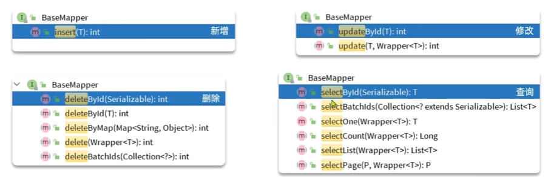
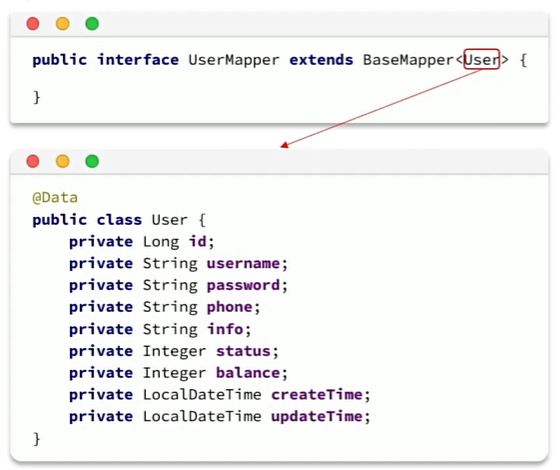
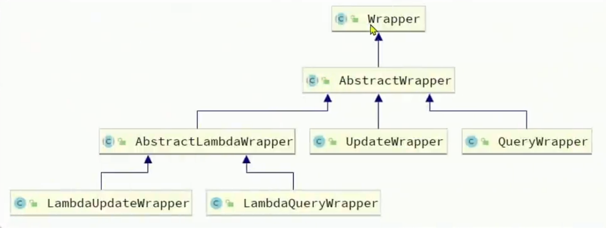

*为简化开发而生！*

官网：[MyBatis-Plus 🚀 为简化开发而生](https://baomidou.com/)

帮助文档： [快速开始 | MyBatis-Plus](https://baomidou.com/getting-started/)

# Mybatis Plus 速入

Mybatis-Plus采用“约定大于配置”的核心思想，按照约定进行定义

Mybatis-Plus通过大量的内置功能和智能化的默认约定，让开发者可以省去很多繁琐的配置和重复的代码编写，从而将精力集中在业务逻辑上


主要解决了以下痛点：

* **繁琐的 CRUD 操作** ：MP 提供了通用的 Service 和 Mapper，开发者可以直接调用现成的方法，几乎零 SQL 编写就能完成大部分单表操作。
* **分页的复杂性** ： MP 内置了功能强大的分页插件，只需简单配置，就能实现一键分页。
* **代码的重复** ：MP 提供了代码生成器，可以根据数据库表结构自动生成实体类、Mapper、Service 等，极大地减少了重复劳动。


## 使用步骤

### 1. Mybatis-Puls起步依赖

**MyBatis-Plus** 提供了 **Starter** ，集成了 MyBatis 与 MyBatisPlus 的完整功能，并实现了自动装配的效果

```xml
<dependency>
    <groupId>com.baomidou</groupId>
    <artifactId>mybatis-plus-boot-starter</artifactId>
    <version>3.5.3.1</version>
</dependency>
```


### 2. 定义Mapper

**MyBatis-Plus 特性** ：

* 通过继承 `BaseMapper<T>`，自动获得大量通用 CRUD 方法。
* 无需手写 XML 或实现类即可直接使用。



定义方式：

```java
public interface UserMapper extends BaseMapper<User> {
}
```


* **`UserMapper`** ：自定义的 Mapper 接口。
* **`BaseMapper<user>`** ：泛型指定实体类 `User`，自动绑定该实体的 CRUD 操作。
* 通过 **`BaseMapper<t>`** 接口，自动获得单表的常用 CRUD 方法，无需手写 SQL。
* 当然，如果希望手写方法我们也可以加上`@Override`注解进行方法重写

 **BaseMapper常用方法** ：

| 分类                      | 方法签名                                                              | 说明                       |
| ------------------------- | --------------------------------------------------------------------- | -------------------------- |
| **Create** （新增） | `int insert(T entity)`                                              | 插入一条记录，返回影响行数 |
| **Update** （更新） | `int updateById(T entity)`                                          | 根据 ID 更新记录           |
|                           | `int update(T entity, Wrapper<T> updateWrapper)`                    | 根据条件更新记录           |
| **Delete** （删除） | `int deleteById(Serializable id)`                                   | 根据 ID 删除记录           |
|                           | `int deleteByMap(Map<String, Object> columnMap)`                    | 根据字段条件 Map 删除记录  |
|                           | `int delete(Wrapper<T> queryWrapper)`                               | 根据条件删除记录           |
|                           | `int deleteBatchIds(Collection<? extends Serializable> idList)`     | 批量删除（根据 ID 集合）   |
| **Read** （查询）   | `T selectById(Serializable id)`                                     | 根据 ID 查询单条记录       |
|                           | `List<T> selectBatchIds(Collection<? extends Serializable> idList)` | 批量查询（根据 ID 集合）   |
|                           | `List<T> selectByMap(Map<String, Object> columnMap)`                | 根据字段条件 Map 查询记录  |
|                           | `T selectOne(Wrapper<T> queryWrapper)`                              | 根据条件查询单条记录       |
|                           | `Long selectCount(Wrapper<T> queryWrapper)`                         | 根据条件统计记录数         |
|                           | `List<T> selectList(Wrapper<T> queryWrapper)`                       | 根据条件查询列表           |
|                           | `IPage<T> selectPage(IPage<T> page, Wrapper<T> queryWrapper)`       | 分页查询                   |


## 常见注解

文档入口：[注解配置 | MyBatis-Plus](https://baomidou.com/reference/annotation/)

MybatisPlus通过扫描实体类，并基于反射获取实体类信息作为数据库表信息。

### 约定配置

以上述mapper接口为例：

```java
public interface UserMapper extends BaseMapper<User> {
}
```

MybatisPlus通过**反射**可以获取User类的定义，并通过约定配置进行 **自动配置** ：




约定配置：

* 类名驼峰转下划线作为表名。(表名为 `user`)
* 名为id的字段作为主键。
* 变量名驼峰转下划线作为表的字段名。(`createTime` -> `create_time`)


### 自定义配置

#### `@TableName`——指定表名

显式指定实体类对应的数据库表名，覆盖 MyBatis-Plus 的默认表名推导规则（类名 → 下划线 → 小写）。

```java
@TableName("t_user")
public class User { ... }
```


#### `@TableId`

标识实体类中的主键字段，可指定主键使用Type参数生成类型/策略

```java
@TableId(value = "id", type = IdType.AUTO)
private Long id;
```


常见主键类型(IdType 枚举)：

| 枚举值        | 说明                                 | 适用场景                           | 注意事项                                          |
| ------------- | ------------------------------------ | ---------------------------------- | ------------------------------------------------- |
| `AUTO`      | 数据库自增                           | MySQL 等支持自增主键的数据库       | 数据库字段需设置自增；插入时主键字段可为 `null` |
| `NONE`      | 未设置主键类型（默认跟随全局配置）   | 不想在实体类上单独指定策略         | 依赖全局 `global-config.db-config.id-type` 配置 |
| `INPUT`     | 手动输入主键                         | 主键由业务方生成（如外部系统传入） | 插入前必须手动设置主键值，否则报错                |
| `ASSIGN_ID` | 雪花算法生成全局唯一 ID（Long 类型） | 分布式系统、无数据库自增需求       | 默认策略（Long 类型主键）；不依赖数据库自增       |


异常：

* 数据库主键非自增却使用 `AUTO`，会导致插入失败。
* 忘记标注主键，分页、更新、删除等操作可能异常。

#### `@TableField`

**作用**

* 显式指定实体字段与数据库列的映射关系。
* 控制字段是否参与 SQL 操作（插入、更新、查询）。

```java
@TableField(value = "create_time", fill = FieldFill.INSERT)
private Date createTime;
```


| 属性名     | 类型        | 说明                 | 常见取值 / 示例             | 注意事项                                         |
| ---------- | ----------- | -------------------- | --------------------------- | ------------------------------------------------ |
| `value`  | `String`  | 指定数据库列名       | `"create_time"`           | 当字段名与列名不一致时必须指定                   |
| `exist`  | `boolean` | 是否为数据库表字段   | `true`（默认）、`false` | `false` 表示该字段不参与映射（如业务计算字段） |
| `select` | `boolean` | 查询时是否返回该字段 | `true`（默认）、`false` | `false` 可用于敏感字段（如密码）在查询时不返回 |
| `update` | `String`  | 更新时的 SQL 片段    | `"NOW()"`                 | 可用于更新时自动赋值，如更新时间字段             |

**使用情景：**

* 成员变量名与数据库字段不一致
* 成员变量使用驼峰命名法时(is开头使用bool值)，会将驼峰前的声明去除，剩下作为变量名，与最终数据库中存储的变量名不一致
* 成员变量名与数据库关键字冲突，如下方order与关键字order冲突
* 成员变量不是数据库字段

```java
//字段不一致
@TableField("username")
private String name;
//驼峰命名
@TableField("is_married")
private Boolean isMarried;
//关键字冲突
@TableField(" order ")
private Integer order;
//非数据库字段
@TableField(exist = false)
private String address;
```


## 常见配置

文档入口：[使用配置 | MyBatis-Plus](https://baomidou.com/reference/)

MyBatisPlus的配置项继承了MyBatis原生配置和一些自己特有的配置，每一部分都有不同的功能

```yaml
mybatis-plus:
  type-aliases-package: com.itheima.mp.domain.po # 别名扫描包
  mapper-locations: "classpath*:/mapper/**/*.xml" # Mapper.xml文件地址，默认值
  configuration:
    map-underscore-to-camel-case: true # 是否开启下划线和驼峰的映射
    cache-enabled: false # 是否开启二级缓存
  global-config:
    db-config:
      id-type: assign_id # id为雪花算法生成
      update-strategy: not_null # 更新策略：只更新非空字段
```


### 基础配置：(`mybatis-plus`根节点)

```
mybatis-plus:
  type-aliases-package: com.itheima.mp.domain.po
  mapper-locations: "classpath:/mapper/**/*.xml"
```


| 配置项                   | 作用                                             | 笔记关联 / 说明                                |
| ------------------------ | ------------------------------------------------ | ---------------------------------------------- |
| `type-aliases-package` | 指定实体类所在包，自动注册别名（类名首字母小写） | 在 XML 中可直接用别名代替全类名，例如 `user` |
| `mapper-locations`     | 指定 Mapper XML 文件位置（支持通配符）           | 对应 `UserMapper.xml` 等自定义 SQL 文件路径  |

### Mybatis核心配置(`configuration`节点)

```java
mybatis-plus:
    configuration:
        map-underscore-to-camel-case: true
        cache-enabled: false
```


| 配置项                           | 作用                          | 笔记关联 / 说明                                                               |
| :------------------------------- | ----------------------------- | ----------------------------------------------------------------------------- |
| `map-underscore-to-camel-case` | 开启下划线 ↔ 驼峰自动映射    | 例如 `create_time` ↔ `createTime`，布尔字段 `isMarried` ↔ `married` |
| `cache-enabled`                | 是否开启二级缓存（默认 true） | 分布式环境建议关闭，避免缓存不一致                                            |

### 全局配置(`global-config.db-config`)

```java
mybatis-plus:
    global-config:
    db-config:
        id-type: assign_id
        update-strategy: not_null
```


| 配置项              | 作用                            | 笔记关联 / 说明                                               |
| ------------------- | ------------------------------- | ------------------------------------------------------------- |
| `id-type`         | 全局主键策略（`IdType` 枚举） | 例如 `assign_id` = 雪花算法 Long ID，可被 `@TableId` 覆盖 |
| `update-strategy` | 字段更新策略                    | `not_null` 表示只更新非空字段，避免 null 覆盖数据库值       |

### 各层关系

* **实体类 ↔ 表映射** ：由 `map-underscore-to-camel-case` + 注解控制
* **主键策略** ：全局 `id-type` + `@TableId`
* **更新行为** ：全局 `update-strategy` + `@TableField`
* **SQL 文件加载** ：`mapper-locations` 决定 XML 能否被扫描到


# 核心制造


## 条件构造器-Wrapper

Wrapper是Mybatis-Plus提供的动态SQL条件构造器，用链式调用的方法构建复杂WHERE条件(以及SET更新字段)，避免手写SQL，提高可维护性，并减少SQL注入的风险。




| 构造器                     | 用途     | 特点                                     | 适用场景                       |
| -------------------------- | -------- | ---------------------------------------- | ------------------------------ |
| `QueryWrapper<T>`        | 查询条件 | 字段名用字符串                           | 简单场景，字段名固定           |
| `LambdaQueryWrapper<T>`  | 查询条件 | 字段名用方法引用（如 `User::getName`） | 推荐首选，避免硬编码，重构安全 |
| `UpdateWrapper<T>`       | 更新条件 | 支持 `set` + 条件                      | 无需实体对象参与更新           |
| `LambdaUpdateWrapper<T>` | 更新条件 | 方法引用 + 更新                          | 推荐首选，安全更新字段         |

> `QueryWrapper`：在 `AbstractWrapper`父类之上拓展了查询select的方法。
>
> `UpdateWrapper`：在父类之上拓展了更新set的方法。

常用条件方法：

| 方法                                    | 说明            | 示例                                             |
| --------------------------------------- | --------------- | ------------------------------------------------ |
| `eq`                                  | 等于            | `.eq("status", 1)` → `status = 1`           |
| `ne`                                  | 不等于          | `.ne(User::getName, "张三")`                   |
| `gt` / `ge`                         | 大于 / 大于等于 | `.gt("age", 18)`                               |
| `lt` / `le`                         | 小于 / 小于等于 | `.le(User::getAge, 30)`                        |
| `between`                             | 区间            | `.between("age", 20, 30)`                      |
| `like` / `likeLeft` / `likeRight` | 模糊匹配        | `.like(User::getName, "张")`                   |
| `isNull` / `isNotNull`              | 空值判断        | `.isNotNull("email")`                          |
| `in` / `notIn`                      | 集合匹配        | `.in("id", Arrays.asList(1,2,3))`              |
| `orderByAsc` / `orderByDesc`        | 排序            | `.orderByDesc("create_time")`                  |
| `and` / `or`                        | 逻辑组合        | `.and(w -> w.eq("status", 1).lt("age", 30))`   |
| `allEq`                               | 批量等于        | `.allEq(map, true)`（`null` 转 `IS NULL`） |

### QueryWrapper查询


```java
void testQueryWrapper() {
    // 1.查询语句条件
    QueryWrapper<User> wrapper = new QueryWrapper<User>()
        .select("id", "username", "info", "balance")
        .like("username", "o")
        .ge("balance", 1000);

    // 2.查询
    List<User> users = userMapper.selectList(wrapper);
    users.forEach(System.out::println);
}
```

### UpdateWrapper更新


```java
void testUpdateWrapper() {
    List`<Long>` ids = List.of(1L, 2L, 4L);

    UpdateWrapper`<User>` wrapper = new UpdateWrapper`<User>`()
        .setSql("balance = balance - 200")
        .in("id", ids);

    userMapper.update(null, wrapper);
}
```

### LambdaUpdateWrapper更新

LambdaWrapper表达式中属性的名字不采用硬编码，而使用对象方法来获取字段名。

> 硬编码：字段固定，开发规约不推荐

```java
void testLambdaQueryWrapper() {
    LambdaQueryWrapper<User> wrapper = new LambdaQueryWrapper<>();
    wrapper.select(User::getId, User::getUsername, User::getBalance)
           .eq(User::getUsername, "o")
           .ge(User::getBalance, 1000);
    List<User> users = userMapper.selectList(wrapper);
    users.forEach(System.out::println);
}
```
