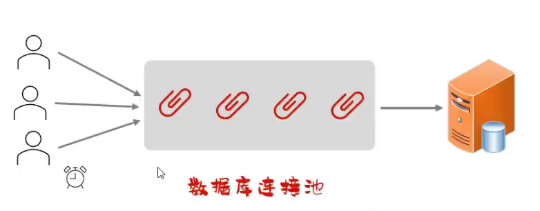
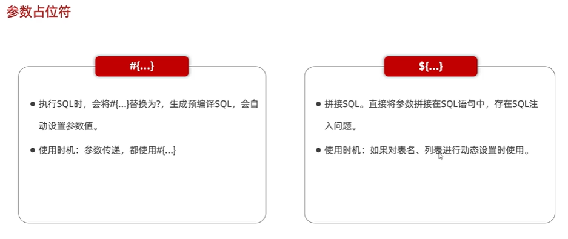

外表或举止上令人愉悦的优美和雅观；令人愉悦的精致和简单

MyBatis 3 : [官网 | 教程 - MyBatis](https://mybatis.org/mybatis-3/zh_CN/index.html)

# 介绍

**MyBatis** 是一款优秀的 **持久层框架** ，用于简化 **JDBC** 开发

主要作用：

1. **简化数据库交互** **：它封装了底层的 JDBC 操作，如创建连接、预编译语句、设置参数、处理结果集等。**
2. **映射**：通过 XML或注解配置将 Java 对象（POJO）与 SQL 语句的参数和结果进行灵活的映射。

Springboots分层架构中：

```
Controller（控制层） → Service（业务层） → DAO（持久层） → 数据库
```

* **DAO（Data Access Object）** ：通过 MyBatis 与数据库交互。

## 数据库连接池

**数据库连接池**是一个 **容器** ，用于**分配**和**管理**数据库连接（`Connection` 对象）。

 **作用** ：

* **复用**已有连接，避免频繁创建/销毁连接带来的性能开销。
* **统一管理**连接的生命周期，防止连接泄漏。



**核心机制**

1. **初始化** ：启动时创建一定数量的数据库连接，存放在连接池中。
2. **获取连接** ：应用程序向连接池请求可用连接，而不是直接新建连接。
3. **归还连接** ：使用完毕后将连接放回连接池，而不是关闭物理连接。
4. **回收机制** ：
   * 对**空闲时间超过最大空闲时间**的连接进行释放。
   * 避免因未释放连接导致的 **连接泄漏** 。

 **常见连接池** ：

| 实现     | 特点                                         |
| -------- | -------------------------------------------- |
| C3P0     | 较早期，稳定性好，性能一般                   |
| DBCP     | Apache 提供，配置简单                        |
| Druid    | 阿里巴巴开源，功能强大，性能优秀，监控能力强 |
| HikariCP | 高性能，轻量级，Spring Boot 默认连接池       |

更改数据库连接池：直接引入依赖

```xml
<properties>
        <java.version>17</java.version>
        <druid.version>1.2.20</druid.version>
    </properties>
	<dependency>
            <groupId>com.alibaba</groupId>
            <artifactId>druid-spring-boot-starter</artifactId>
            <version>${druid.version}</version>
        </dependency>
```

除此之外还需要在 `application.properties`中声明 `druid`并去除 `jdbc`有关依赖

```properties
spring.application.name=Mybatis_test
#spring.datasource.driver-class-name=com.mysql.cj.jdbc.Driver
spring.datasource.type=com.alibaba.druid.pool.DruidDataSource
spring.datasource.url=jdbc:mysql://localhost:3306/test
spring.datasource.username=root
spring.datasource.password=admin123
```

## lombok

**Lombok** 是一个 Java 类库，通过注解自动生成常用方法（构造器、getter/setter、equals、hashCode、toString 等），并可自动生成日志变量。

作用：简化开发，减少样板代码，提高开发效率

| 注解                      | 功能                                                                                |
| ------------------------- | ----------------------------------------------------------------------------------- |
| `@Getter` / `@Setter` | 为**所有**属性生成 `get` / `set` 方法                                     |
| `@ToString`             | 自动生成易读的 `toString()` 方法                                                  |
| `@EqualsAndHashCode`    | 根据类的非静态字段自动重写 `equals()` 和 `hashCode()` 方法                      |
| `@Data`                 | 综合注解，等价于 `@Getter` + `@Setter` + `@ToString` + `@EqualsAndHashCode` |
| `@NoArgsConstructor`    | 生成无参构造方法                                                                    |
| `@AllArgsConstructor`   | 生成包含所有字段（除 `static` 修饰字段）的全参构造方法                            |

依赖示例：

```xml
<dependency>
    <groupId>org.projectlombok</groupId>
    <artifactId>lombok</artifactId>
    <version>最新版本</version>
</dependency>
```

插件一直识别不出来mlgb

## SQL注入（传参）



# 拓展组件

## pageHelper

**PageHelper** 是一个基于 **MyBatis** 的无侵入式分页插件。它的核心作用是自动在SQL中追加分页语句(如 `LIMIT`)，并提供分页信息封装、避免手写分页逻辑。

### 快速集成

```xml
<dependency>
        <groupId>com.github.pagehelper</groupId>
        <artifactId>pagehelper-spring-boot-starter</artifactId>
        <version>1.4.7</version>
</dependency>
```


### 在Service实现层中使用

查询语句：

Mapper.java

```java
@Select("SELECT * FROM emp")
    public List<Emp> list();
```

PageHelper：

ServiceImpl.java

```java
@Service
public class EmpService {

    @Autowired
    public EmpMapper empMapper;

    public List<Emp> findAll(int pageNum, int pageSize) {
        PageHelper.startPage(pageNum, pageSize);

        List<Emp> empList = empMapper.list();
        Page<Emp> page = (Page<Emp>) empList;

        return page.getResult();
    }
}
```

PageHepler此时会自动把分页的范围检索出来

### PageHelper方法

PageHelper常用方法：

| 方法                                                     | 作用                                   | 示例                                       |
| -------------------------------------------------------- | -------------------------------------- | ------------------------------------------ |
| `startPage(int pageNum, int pageSize)`                 | 按页码分页                             | `PageHelper.startPage(1, 10)`            |
| `startPage(int pageNum, int pageSize, String orderBy)` | 分页并指定排序规则                     | `PageHelper.startPage(1, 10, "id desc")` |
| `offsetPage(long offset, long limit)`                  | 按偏移量分页（适合无限滚动等场景）     | `PageHelper.offsetPage(20, 10)`          |
| `orderBy(String orderBy)`                              | 单独设置排序规则（不分页也可用）       | `PageHelper.orderBy("create_time desc")` |
| `clearPage()`                                          | 清除当前线程分页参数，避免影响后续查询 | `PageHelper.clearPage()`                 |

Page对象常用方法：

| 方法              | 返回值类型  | 说明                        |
| ----------------- | ----------- | --------------------------- |
| `getResult()`   | `List<T>` | 当前页数据列表              |
| `getTotal()`    | `long`    | 总记录数                    |
| `getPages()`    | `int`     | 总页数                      |
| `getPageNum()`  | `int`     | 当前页码                    |
| `getPageSize()` | `int`     | 每页记录数                  |
| `getStartRow()` | `int`     | 当前页起始行号（从 1 开始） |
| `getEndRow()`   | `int`     | 当前页结束行号              |
| `isCount()`     | `boolean` | 是否执行了 `count` 查询   |

PageInfo(对Page进行 **封装类** )常用方法：

| 方法                      | 返回值类型  | 说明                   |
| ------------------------- | ----------- | ---------------------- |
| `getList()`             | `List<T>` | 当前页数据             |
| `getTotal()`            | `long`    | 总记录数               |
| `getPages()`            | `int`     | 总页数                 |
| `getPageNum()`          | `int`     | 当前页码               |
| `getPageSize()`         | `int`     | 每页记录数             |
| `isHasNextPage()`       | `boolean` | 是否有下一页           |
| `isHasPreviousPage()`   | `boolean` | 是否有上一页           |
| `getNavigatePages()`    | `int`     | 导航页码数量（可配置） |
| `getNavigatepageNums()` | `int[]`   | 导航页码数组           |
| `isIsFirstPage()`       | `boolean` | 是否为第一页           |
| `isIsLastPage()`        | `boolean` | 是否为最后一页         |

分页查询示例：

```java
import com.github.pagehelper.PageHelper;
import com.github.pagehelper.PageInfo;

public PageInfo<User> listUsers(int pageNum, int pageSize) {
    // 1. 开启分页（自动作用于紧跟的第一条查询语句）
    PageHelper.startPage(pageNum, pageSize, "create_time desc");
  
    // 2. 执行查询（Mapper 方法不需要修改 SQL）
    List<User> users = userMapper.selectAll();

    // 3. 封装分页结果
    return new PageInfo<>(users);
}
```


调用：

```java
PageInfo<User> pageInfo = listUsers(2, 5);
System.out.println("总记录数: " + pageInfo.getTotal());
System.out.println("总页数: " + pageInfo.getPages());
System.out.println("当前页数据: " + pageInfo.getList());
```


### 深入其原理

startpage这一个函数最后会由这样的方法实现：

```java
public static <E> Page<E> startPage(int pageNum, int pageSize, boolean count, Boolean reasonable, Boolean pageSizeZero) {
        Page<E> page = new Page(pageNum, pageSize, count);
        page.setReasonable(reasonable);
        page.setPageSizeZero(pageSizeZero);
        Page<E> oldPage = getLocalPage();
        if (oldPage != null && oldPage.isOrderByOnly()) {
            page.setOrderBy(oldPage.getOrderBy());
        }

        setLocalPage(page);
        return page;
    }
```

在这里将page对象传入了setLocalPage的方法中，而这一个方法实际上是由ThreadLocal实现的：

```java
protected static final ThreadLocal<Page> LOCAL_PAGE = new ThreadLocal();
    protected static boolean DEFAULT_COUNT = true;

    protected static void setLocalPage(Page page) {
        LOCAL_PAGE.set(page);
    }
```

这样讲page交给另一个线程，并存到存储空间中

然后在我们进行分页查询之前，通过ThreadLocal将页码和页面大小取出，插入到SQL的查询语句中，利用limit进行拼接：

```xml
<!--    员工分页查询-->
    <select id="pageQuery" resultType="com.sky.entity.Employee">
        select *
        from employee
        <where>
            <if test="name !=null and name!=''">
                and name like concat('%',#{name},'%')
            </if>
        </where>
	limit ...
    </select>
```
