Redis（Remote Dictionary Server）是一个开源的**基于内存**数据库，遵守 BSD 协议，它提供了一个高性能的键值（key-value）存储系统，常用于缓存、消息队列、会话存储等应用场景。

特征：

- 键值（key-value）型，value支持多种不同数据结构，功能丰富
- 单线程，每个命令具备原子性
- 低延迟，速度快（基于内存、IO多路复用、良好的编码）。
- 支持数据持久化
- 支持主从集群、分片集群

# 引入

## 关系型数据库和非关系型数据库

SQL vs. NoSQL

### 结构化

关系型数据库的主要存储方式是结构化，这意味着每个表中的字段都是固定的，每一行数据都应该具有对应字段的属性：

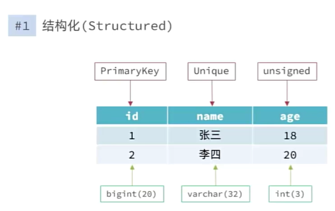

相比之下，非关联性数据库就没有那么多要求，它可以以键值对存储(Redis)、嵌入式文档型存储（json格式）(MongoDB)、又或者使用图(Neo4j)进行存储，即非统一的结构化

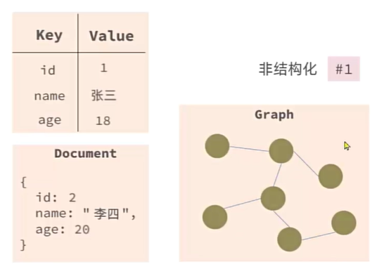

### 关联性

**关联型数据库**，比如MySQL、PostgreSQL，核心思想是 **数据之间的关联是通过预先定义的表结构和外键（Foreign Key）来维护的** 。它们遵循ACID（原子性、一致性、隔离性、持久性）原则，保证数据操作的事务性。

```sql
SELECT P.content, P.timestamp
FROM Posts P
JOIN Users U ON P.user_id = U.user_id
WHERE U.username = 'Alice';
```

这里的关键是 **Post表中的 `user_id`列引用了User表中的 `user_id`** 。当我们需要获取某个用户发布的所有帖子时，可以使用 **`JOIN`操作** 来连接这两个表

这里涉及到了事务的关联，一个帖子必须关联到一个真实存在的用户，如果用户被删除，关联的帖子要么被级联删除，要么操作被阻止。

**非关联型数据库**，如MongoDB、Redis，放弃了严格的表结构和外键约束，以换取更高的灵活性和可扩展性。它们通常不遵循严格的ACID，而是追求CAP理论中的最终一致性（Eventual Consistency）和可用性（Availability）

其问题在于：

* **数据一致性需要应用层来保证** ，增加了开发复杂性。程序员需要自行维护数据库的一致性
* 缺乏事务支持， **不适用于强事务性要求的业务** （如金融交易）。
* 嵌入式设计可能导致文档过大，在某些更新操作时效率较低。

### SQL语句查询

关联型数据库使用统一的SQL语句进行查询，而NoSQL则需要使用特定的查询方法进行查询，基于每一种非关系型数据库会有不同的查询语法

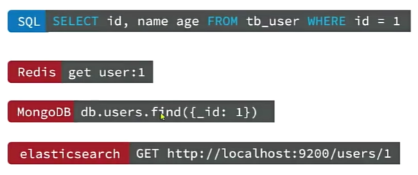

### 事务

ACID vs. BASE

|          | SQL                                                             | NoSQL                                                                       |
| -------- | --------------------------------------------------------------- | --------------------------------------------------------------------------- |
| 数据结构 | 结构化（Structured）                                            | 非结构化                                                                    |
| 数据关联 | 关联的（Relational）                                            | 无关联的                                                                    |
| 查询方式 | SQL查询                                                         | 非SQL                                                                       |
| 事务特性 | ACID                                                            | BASE                                                                        |
| 存储方式 | 磁盘                                                            | 内存                                                                        |
| 扩展性   | 垂直                                                            | 水平                                                                        |
| 使用场景 | 1）数据结构固定 `<br>`2）相关业务对数据安全性、一致性要求较高 | 1）数据结构不固定 `<br>`2）对一致性、安全性要求不高 `<br>`3）对性能要求 |

# Redis下载安装

官网：[Redis - The Real-time Data Platform](https://redis.io/)

中文网：[Redis中文网](https://www.redis.net.cn/)

由于Redis并没有Windows版本，所谓Windows版本都是微软帮忙编译的

下载途径 ：

- [Windows版下载地址](https://github.com/microsoftarchive/redis/releases)：https://github.com/microsoftarchive/redis/releases
- [Linux版下载地址](https://download.redis.io/releases/)：https://download.redis.io/releases/

使用Windows版本解压后的目录如下：

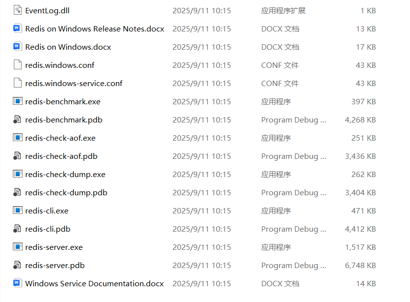

## 运行Redis

在Redis解压路径下使用命令：

```bash
 .\redis-server.exe .\redis.windows.conf
```

> 小技巧：当使用cmd或者powershell时，输入完大部分特征时使用Tab键可以自动补全
>
> ```bash
> PS F:\Code\20250728(sky)\pre\sky-take-out\Redis-x64-3.0.504> redis-s
> ```
>
> 就比如已经输入了redis-s后，自动补全为
>
> 

执行之后可以看到Redis开启

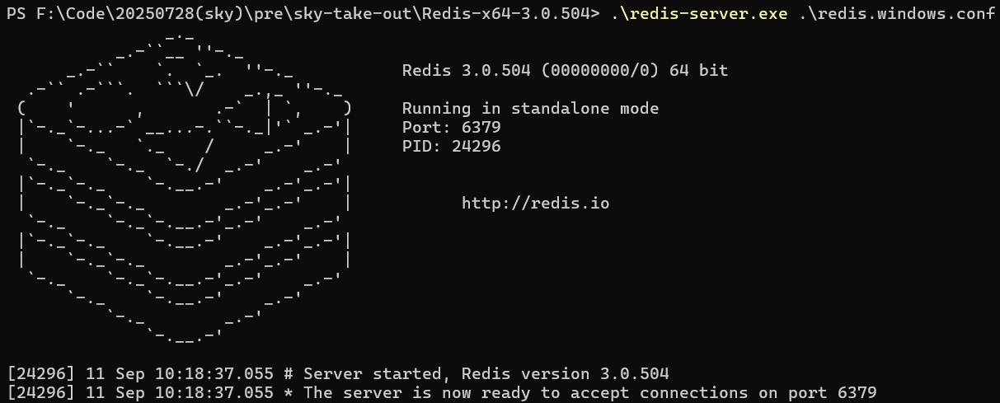

可见程序页展示了默认的端口号和进程PID

## 连接Redis

同样在解压包中启用客户端程序

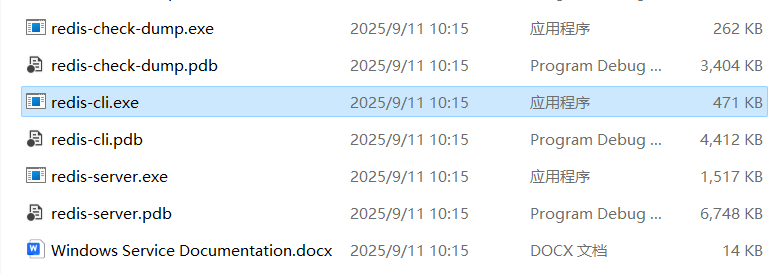

可以看到此时已经进入本地的端口号为6379服务

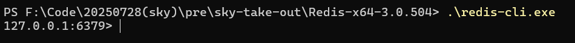

使用测试命令 `keys *`，可以发现是正常的输出，证明Redis连接已经成功

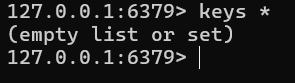

### 全域连接

上述启动的cli服务是默认的本地连接，当我们需要连接到别的服务器上时应该使用以下命令：

```bash
.\redis-cli.exe -h [IP地址/域名] -p [端口号] -a [密码]
```

如果是本地连接的话就是这样（目前未设置密码）：

```bash
PS F:\Code\20250728(sky)\pre\sky-take-out\Redis-x64-3.0.504> .\redis-cli.exe -h localhost -p 6379
localhost:6379> keys *
(empty list or set)
```

## Redis服务端配置

首先找到 `redis.windows.conf`这一个文件，在其中搜索 `pass `这一个注释位置：

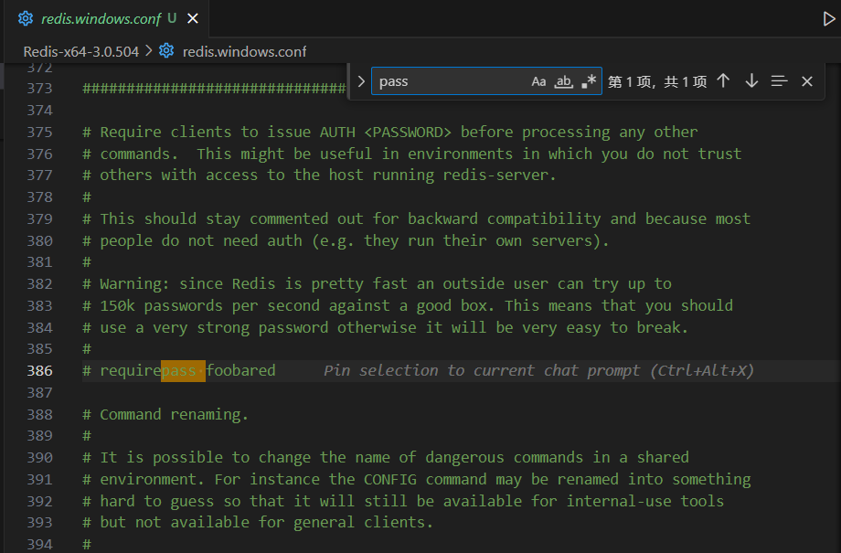

将其修改为这样，就是我们登录时需要用到的密码：

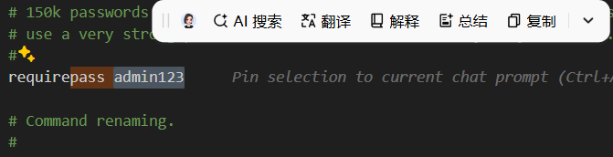

这个时候重启服务，客户端如果查询就会出现报错：

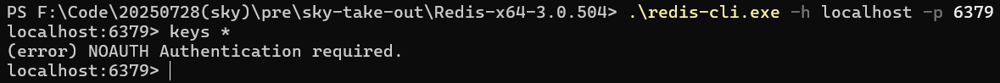

此时需要修改客户端登录命令：

```bash
.\redis-cli.exe -h localhost -p 6379 -a admin123
```

这样就能在接下来的查询中正常运行：

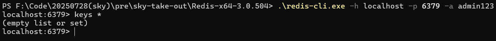

## Redis图形化应用

管理应用：[Releases · qishibo/AnotherRedisDesktopManager](https://github.com/qishibo/AnotherRedisDesktopManager/releases)

本人也尝试过使用[RESP](https://github.com/lework/RedisDesktopManager-Windows/releases)的管理方式，然后发现似乎Redis的版本需要到6.0以上才能在图形化界面中使用，但目前微软给出的windows版本Redis只有3.0左右的版本，这使得在填写用户+密码的时候一直报错。还是等使用Linux之后再来尝试RESP吧

使用ARDM这一个UI管理界面就不需要填写用户名这一个字段：

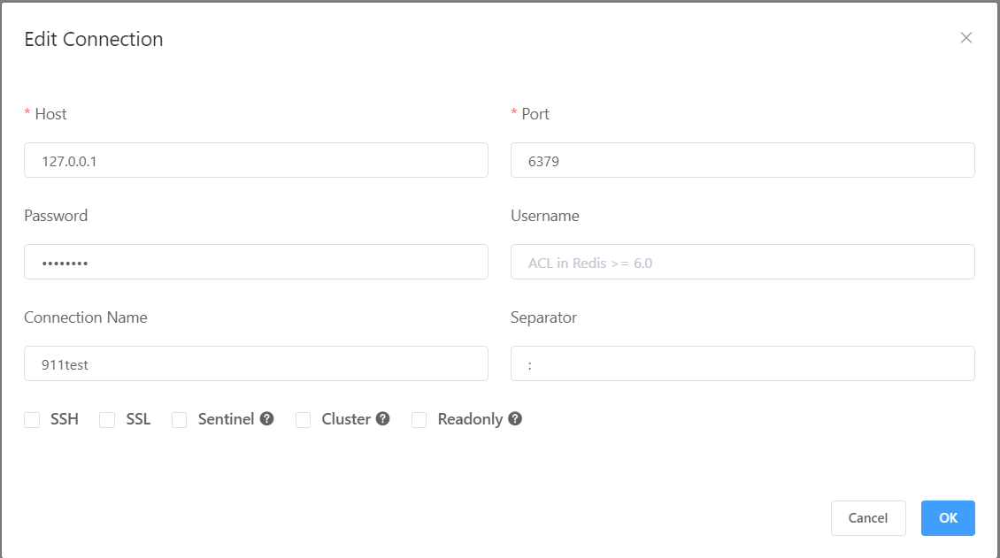

然后在我们填写完之后就登录成功了

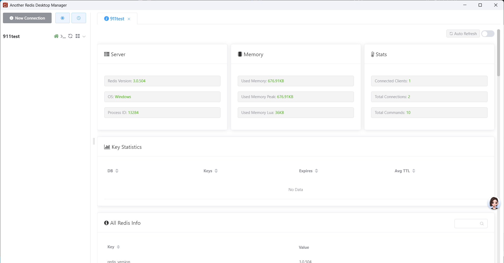

## 数据库细节

Redis默认创建16个数据库，我们在这里测试的一直是DB0，0号数据库

# Redis命令

## Redis数据结构

Redis 是一个高性能的 **键值（Key-Value）** 数据库。它强大的核心之一在于其值（Value）支持多种多样的数据结构，以适应不同的应用场景。

| **类型**        | **概念**                             | **底层实现（思考深度）**                                                                                                                                                                | **示例**                |
| --------------------- | ------------------------------------------ | --------------------------------------------------------------------------------------------------------------------------------------------------------------------------------------------- | ----------------------------- |
| **基本类型**    |                                            |                                                                                                                                                                                               |                               |
| **String**      | 最基础的字符串类型。                       | **简单动态字符串（SDS）** 。它类似C语言的字符串，但增加了长度信息，这使得获取字符串长度和追加操作更加高效，并且避免了缓冲区溢出。                                                       | `hello world`               |
| **Hash**        | 类似于对象，在单个键下存储多个字段-值对。  | **压缩列表（ziplist）或哈希表（hashtable）** 。当哈希中的键值对较少时，使用内存紧凑的 `ziplist`节约空间；一旦数量或大小超过阈值，会自动转换为更通用的 `hashtable`，以保证快速查找。 | `{ name: "Jack", age: 21 }` |
| **List**        | 有序的字符串列表，支持从两端操作。         | **压缩列表（ziplist）或双向链表（linkedlist）** 。在Redis 3.2版本后，用更优化的 **quicklist** （由多个 `ziplist`组成的双向链表）替代了它们，进一步平衡了内存效率和性能。        | `[A -> B -> C -> C]`        |
| **Set**         | 无序的唯一字符串集合，不允许重复。         | **哈希表（hashtable）或整数集合（intset）** 。当集合中的元素都是整数且数量不多时，使用 `intset`节省空间；否则使用 `hashtable`来保证 `O(1)`的平均查找效率。                        | `{A, B, C}`                 |
| **Sorted Set**  | 有序集合，每个元素带一个分数，按分数排序。 | **压缩列表（ziplist）或跳跃表（skiplist）** 。当元素数量较少时用 `ziplist`，当数量增多时，`skiplist`在 `O(logN)`的时间复杂度内提供了高效的查找、插入和删除操作。                  | `{A: 1, B: 2, C: 3}`        |
| **特殊类型**    |                                            |                                                                                                                                                                                               |                               |
| **GEO**         | 专门存储地理位置信息。                     | **跳跃表（skiplist）** 。利用 Geohash 算法将经纬度转换为一个分数，然后将这个分数和成员存储在有序集合中，从而利用有序集合的特性实现范围查找。                                            | `{A: (120.3, 30.5)}`        |
| **BitMap**      | 以位为单位的数组。                         | **字符串（String）** 。`BitMap`实际上是把一个 `String`类型当成一个巨大的位数组来操作。一个字节有8位，通过位运算可以对任意位进行读写。                                               | `0110110101110101011`       |
| **HyperLogLog** | 一种估算基数（不重复元素数量）的算法。     | **字符串（String）** 。它也是一种特殊编码的字符串，内部使用稀疏或稠密结构来存储数据，通过巧妙的概率算法实现对基数的估算。                                                               | `0110110101110101011`       |

另外，如果我们想了解更深入的实现原理，可以在Redis中借助命令help+@或者在官方浏览器中查看

官方命令入口：[Commands](https://redis.io/docs/latest/commands/)

## Redis通用命令

Redis 的通用命令是 **不针对特定数据类型** ，而是对所有键（key）都可使用的操作。它们是管理和维护 Redis 数据库的关键。

| **命令**       | **功能**              | **详细说明**                                                                                                                                                                                                                                               | **用法示例**                               |
| -------------------- | --------------------------- | ---------------------------------------------------------------------------------------------------------------------------------------------------------------------------------------------------------------------------------------------------------------- | ------------------------------------------------ |
| **`KEYS`**   | 查找符合特定模式的所有键。  | 这个命令用于**查询**数据库中所有符合给定通配符模式的键。例如，`KEYS *`可以匹配所有键，`KEYS user:*`则匹配所有以 `user:`开头的键。**注意：**此命令会遍历数据库中的所有键，如果键的数量巨大，会阻塞 Redis 服务，因此 **不建议在生产环境使用** 。 | `KEYS user:*<br>`查找所有以 "user:" 开头的键   |
| **`DEL`**    | 删除一个指定的键。          | `DEL`是一个原子操作，可以一次删除一个或多个键。如果指定的键不存在，该命令不做任何事。成功删除的键会返回一个计数。                                                                                                                                              | `DEL key1 key2<br>`删除名为 key1 和 key2 的键  |
| **`EXISTS`** | 判断一个键是否存在。        | 这个命令用于**检查**一个或多个键是否在数据库中。它会返回存在的键的数量。这是一个非常高效的操作。                                                                                                                                                           | `EXISTS mykey<br>`检查 "mykey" 是否存在        |
| **`EXPIRE`** | 为一个键设置有效期（TTL）。 | `EXPIRE`命令为指定的键设置一个 **过期时间** （以秒为单位）。当时间到达后，该键会自动被删除。这对于缓存、会话管理等场景非常有用。                                                                                                                         | `EXPIRE mykey 60<br>`设置 "mykey" 在60秒后过期 |
| **`TTL`**    | 查看一个键的剩余有效期。    | `TTL`命令返回一个键的剩余生存时间，以秒为单位。如果键不存在，返回 `-2`；如果键没有设置过期时间，返回 `-1`。                                                                                                                                                | `TTL mykey<br>`查看 "mykey" 剩余的秒数         |

---

### **如何查看命令用法？**

正如图片所示，你可以直接在 Redis 命令行界面使用 `help [command]` 来获取一个命令的详细帮助信息，包括其语法、功能摘要、版本要求等。

**示例：**

**Bash**

```
127.0.0.1:6379> help KEYS
```

这会返回如下信息：

```
KEYS pattern
summary: Find all keys matching the given pattern
since: 1.0.0
group: generic
```


## Key的层次格式

Redis没有类似MySQL中的Table的概念，我们该如何区分不同类型的key呢?

* 例如，需要存储用户、商品信息到redis，有一个用户id是1，有一个商品id恰好也是1

### key的结构

Redis的key允许有多个单词形成层级结构，多个单词之间用 `:`隔开，格式如下：

```
项目名:业务名:类型:id
```

这个格式并非固定，也可以根据自己的需求来删除或添加词条。

例如我们的项目名称叫 `heima`，有 `user`和 `product`两种不同类型的数据，我们可以这样定义key：

- user相关的key：`heima:user:1`
- product相关的key：`heima:product:1`

如果Value是一个Java对象，例如一个 `User`对象，则可以将对象序列化为JSON字符串后存储：

| KEY                 | VALUE                                         |
| ------------------- | --------------------------------------------- |
| `heima:user:1`    | `{"id":1, "name": "Jack", "age": 21}`       |
| `heima:product:1` | `{"id":1, "name": "小米11", "price": 4999}` |

当使用冒号 `:`隔开时，数据库中很自然地形成层级结构

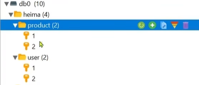

## String 类型

**String** 类型是 Redis 中最简单也最基础的数据结构。它的值可以是任何形式的字符串，但其强大之处在于 Redis 能够根据内容的类型（如普通字符串、整数或浮点数）自动进行优化，从而在存储和操作上实现高效。

### 1. String 类型的三种内部格式

虽然我们看到的都是字符串，但 Redis 内部为了节省内存和提升性能，会根据其内容采取不同的编码方式：

* **普通字符串** ：用于存储文本或二进制数据，例如 `hello world`。Redis 使用  **SDS** （简单动态字符串）结构，这让它在处理字符串时比传统的 C 语言字符串更高效、更安全。
* **整数** ：当字符串内容可以解析为 64 位整数时，Redis 会以整数形式存储。这使得像 `INCR` 和 `DECR` 这样的原子操作变得非常快。
* **浮点数** ：虽然浮点数也是以字符串形式存储，但像 `INCRBYFLOAT` 这样的命令可以专门对其进行增减操作。

> **小知识点** ：String 类型值的最大空间限制是  **512MB** 。在多数应用场景中，这个限制是绰绰有余的。

### 2. 常用操作与代码示例

掌握了基本概念，我们来看如何在实际中使用它。以下是一些最常用的 String 命令，并配有代码示例和简要说明。

* **设置与获取键值** ：`SET` 和 `GET` 是最基本的读写命令。

```
  127.0.0.1:6379> SET user:name "Jack"
  OK
  127.0.0.1:6379> GET user:name
  "Jack"
```

* **原子自增/自减** ：`INCR` 和 `DECR` 命令可以对数字类型的字符串值进行原子操作。

```
  127.0.0.1:6379> SET page:views 0
  OK
  127.0.0.1:6379> INCR page:views
  (integer) 1
  127.0.0.1:6379> INCR page:views
  (integer) 2
```

* **设置过期时间** ：`SETEX` 可以设置键值的同时，为其添加一个过期时间，非常适合用于缓存。

```
  127.0.0.1:6379> SETEX cache:data 60 "this is a cached data"
  OK
  127.0.0.1:6379> TTL cache:data
  (integer) 55
```

### 3. String 类型的典型应用场景

* **缓存** ：这是最常见的用途。你可以将数据库查询结果或复杂的计算结果存储为 String 类型，并设置过期时间。
* **计数器** ：网站访问量、文章阅读数、点赞数等。利用 `INCR` 和 `DECR` 的原子性，可以轻松实现高并发下的计数功能。
* **分布式锁** ：结合 `SETNX`（SET if Not eXists）和 `EXPIRE` 命令可以实现一个简单的分布式锁，确保在分布式系统中某些操作的唯一性。

### Redis String 类型的常见命令

掌握这些命令是高效使用 Redis 的第一步。它们涵盖了从基础的增删查改到原子计数等多种核心功能。

#### 基础操作：增、删、改、查

| 命令     | 功能                                            |
| -------- | ----------------------------------------------- |
| `SET`  | 添加或修改一个 String 类型的键值对。            |
| `GET`  | 根据 key 获取 String 类型的 value。             |
| `MSET` | 批量添加多个 String 类型的键值对。              |
| `MGET` | 根据多个 key 批量获取对应的 String 类型 value。 |

**代码示例：**

```
# 设置和获取单个键值
127.0.0.1:6379> SET name "Gemini"
OK
127.0.0.1:6379> GET name
"Gemini"

# 批量设置和获取多个键值
127.0.0.1:6379> MSET user:1:name "Jack" user:1:age 21
OK
127.0.0.1:6379> MGET user:1:name user:1:age
1) "Jack"
2) "21"
```

> **小知识点** ：`MSET` 和 `MGET` 都是 **原子操作** 。这意味着它们在一次操作中执行所有设置或获取，不会被其他命令中断。

#### 原子性操作：计数与增减

这些命令是 Redis 能够作为高性能计数器和限流工具的关键，它们在处理高并发场景时非常可靠。

| 命令            | 功能                                    |
| --------------- | --------------------------------------- |
| `INCR`        | 让一个整数型的 key 的值自增 1。         |
| `INCRBY`      | 让一个整数型的 key 的值自增指定的步长。 |
| `INCRBYFLOAT` | 让一个浮点型的数字自增并指定步长。      |

**代码示例：**

```
# 自增1，用于计数器
127.0.0.1:6379> SET page:views 100
OK
127.0.0.1:6379> INCR page:views
(integer) 101

# 自增指定步长
127.0.0.1:6379> INCRBY num 2
(integer) 103

# 浮点数自增
127.0.0.1:6379> SET score 9.5
OK
127.0.0.1:6379> INCRBYFLOAT score 0.5
"10"
```

> **深入理解** ：`INCR` 和 `INCRBY` 命令都是 **原子性操作** ，这保证了在高并发下，多个客户端同时对同一个 key 进行自增操作时，结果不会出错。

#### 特殊用途命令

| 命令      | 功能                                                              |
| --------- | ----------------------------------------------------------------- |
| `SETNX` | 添加一个 String 类型的键值对，前提是这个 key 不存在，否则不执行。 |
| `SETEX` | 添加一个 String 类型的键值对，并指定有效期（TTL，以秒为单位）。   |

**代码示例：**

```
# 使用 SETNX 实现锁的简单逻辑
127.0.0.1:6379> SETNX lock:resource "locked"
(integer) 1  # 成功获取锁
127.0.0.1:6379> SETNX lock:resource "locked"
(integer) 0  # 锁已存在，获取失败

# 设置带过期时间的键，常用于缓存
127.0.0.1:6379> SETEX mykey 10 "some data"
OK
127.0.0.1:6379> GET mykey
"some data"
# 10秒后，mykey 会自动消失
```

## Hash类型

Hash类型，也叫散列，其value是一个无序字典，类似于Java中的 `HashMap`结构。

String结构是将对象序列化为JSON字符串后存储，当需要修改对象某个字段时很不方便：

| KEY              | VALUE                     |
| ---------------- | ------------------------- |
| `heima:user:1` | `{name:"Jack", age:21}` |
| `heima:user:2` | `{name:"Rose", age:18}` |

Hash结构可以将对象中的每个字段独立存储，可以针对单个字段做CRUD：

| KEY              | field(Hash-key) | value |
| ---------------- | --------------- | ----- |
| `heima:user:1` | name            | Jack  |
| `heima:user:1` | age             | 21    |
| `heima:user:2` | name            | Rose  |
| `heima:user:2` | age             | 18    |

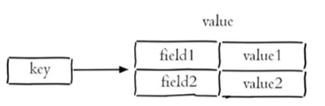

### Redis Hash 类型的常见命令

Hash 类型是一个键值（key-value）的集合，常被用来存储对象。它的命令前缀大多是 `H`，代表 Hash。

#### 基础操作：增、删、改、查

这些命令用于对 Hash 键中的单个或多个字段进行操作。

| 命令        | 功能                                       |
| ----------- | ------------------------------------------ |
| `HSET`    | 添加或修改一个 Hash 类型键中某个字段的值。 |
| `HGET`    | 获取一个 Hash 类型键中某个字段的值。       |
| `HMSET`   | 批量添加多个字段和值。                     |
| `HMGET`   | 批量获取多个字段的值。                     |
| `HGETALL` | 获取一个 Hash 键中的所有字段和值。         |
| `HKEYS`   | 获取一个 Hash 键中的所有字段。             |
| `HVALS`   | 获取一个 Hash 键中的所有值。               |

**代码示例：**

```
# 设置和获取单个字段
127.0.0.1:6379> HSET user:1 name "Jack"
(integer) 1
127.0.0.1:6379> HGET user:1 name
"Jack"

# 批量设置和获取多个字段
127.0.0.1:6379> HMSET user:1 age 21 city "Beijing"
OK
127.0.0.1:6379> HMGET user:1 name age city
1) "Jack"
2) "21"
3) "Beijing"

# 获取所有字段和值
127.0.0.1:6379> HGETALL user:1
1) "name"
2) "Jack"
3) "age"
4) "21"
5) "city"
6) "Beijing"
```

> **注意** ：`HGETALL`、`HKEYS` 和 `HVALS` 命令会返回 Hash 键中**所有**的字段或值。如果 Hash 键中包含的字段非常多（如数万个），执行这些命令可能会导致 Redis 暂时阻塞，影响性能。因此，在生产环境中应谨慎使用。

#### 特殊操作：计数与条件设置

这些命令提供了一些原子性或有条件的特殊操作，可以更灵活地处理数据。

| 命令        | 功能                                             |
| ----------- | ------------------------------------------------ |
| `HINCRBY` | 让一个 Hash 键中某个字段的值自增指定的步长。     |
| `HSETNX`  | 添加一个 Hash 键中的字段值，前提是该字段不存在。 |

**代码示例：**

```
# 对 Hash 键中的字段进行自增
127.0.0.1:6379> HINCRBY user:1 age 1
(integer) 22
127.0.0.1:6379> HGET user:1 age
"22"

# 只有当字段不存在时才设置
127.0.0.1:6379> HSETNX user:1 phone "123456789"
(integer) 1
127.0.0.1:6379> HSETNX user:1 phone "987654321"
(integer) 0  # 字段已存在，设置失败
```

> **知识点** ：`HINCRBY` 和 `HSETNX` 都是 **原子操作** 。这意味着即使有多个客户端同时执行，它们也能保证操作的正确性，不会出现数据竞争问题。

## List类型

Redis中的List类型与Java中的 `LinkedList`类似，可以看做是一个双向链表结构。既可以支持正向检索和也可以支持反向检索。

特征也与 `LinkedList`类似：

- 有序
- 元素可以重复
- 插入和删除快
- 查询速度一般

### Redis List 类型的常见命令

List 命令大多以 `L` 或 `R` 开头，分别代表从列表的左侧（Left）或右侧（Right）进行操作。


#### 基础操作：插入与移除

这些命令用于在列表的任一端添加或删除元素。

| 命令      | 功能                             |
| --------- | -------------------------------- |
| `LPUSH` | 向列表左侧插入一个或多个元素。   |
| `RPUSH` | 向列表右侧插入一个或多个元素。   |
| `LPOP`  | 移除并返回列表左侧的第一个元素。 |
| `RPOP`  | 移除并返回列表右侧的第一个元素。 |

**代码示例：**

```
# 从左侧推入和弹出元素（栈）
127.0.0.1:6379> LPUSH tasks "task1" "task2" "task3"
(integer) 3
127.0.0.1:6379> LPOP tasks
"task3"
127.0.0.1:6379> LPOP tasks
"task2"

# 从右侧推入和弹出元素（队列）
127.0.0.1:6379> RPUSH queue "job1" "job2"
(integer) 2
127.0.0.1:6379> LPOP queue
"job1"
```

> **小知识点** ：`LPUSH` 和 `RPUSH` 的原子性保证了即使在高并发下，元素的插入顺序也不会错乱，这在构建消息队列时尤为关键。

#### 实用操作：范围与阻塞

这些命令提供了更高级的功能，例如查看列表的一部分或在没有元素时进行等待。

| 命令                | 功能                                                        |
| ------------------- | ----------------------------------------------------------- |
| `LRANGE`          | 返回列表中指定索引范围内的所有元素。                        |
| `BLPOP`/`BRPOP` | 阻塞式移除并返回列表左/右侧的第一个元素，直到有元素或超时。 |

**代码示例：**

```
# 获取指定范围内的元素
127.0.0.1:6379> LRANGE tasks 0 -1
1) "task1"
2) "task2"

# 阻塞式弹出（消费者端应用）
# 当列表为空时，命令会阻塞，直到有元素被推入
127.0.0.1:6379> BLPOP tasks 5
# (在这里等待，直到有人用LPUSH推入新任务或5秒后超时)
```

> **深入理解** ：`BLPOP` 和 `BRPOP` 是构建 **阻塞式消息队列** 的核心。当消费者从空队列中拉取消息时，它们不会立即返回 `nil`，而是会等待一段时间，这大大减少了CPU的空转，并提高了效率。

---

#### List 类型的典型应用场景

* **消息队列** ：将任务或消息推入列表（如 `LPUSH`），消费者从另一端拉取（如 `BRPOP`），实现异步处理。
* **最新动态列表** ：如微博时间线、最新文章列表。新内容 `LPUSH` 到列表头部，展示时 `LRANGE` 获取最新 N 条。
* **栈和队列** ：`LPUSH/LPOP` 实现了栈（先进后出），而 `LPUSH/RPOP` 或 `RPUSH/LPOP` 则实现了队列（先进先出）。

## Set类型

Redis的Set结构与Java中的 `HashSet`类似，可以看做是一个value为null的 `HashMap`。因为也是一个hash表，因此具备与 `HashSet`类似的特征：

- 无序
- 元素不可重复
- 查找快
- 支持交集、并集、差集等功能

### Redis Set 类型的常见命令

这些命令是管理唯一性数据集合的基础。

#### 基础操作：增、删、查

这些命令用于对 Set 进行日常的增删改查。

| 命令                    | 功能                            |
| ----------------------- | ------------------------------- |
| **`SADD`**      | 向 Set 中添加一个或多个成员。   |
| **`SREM`**      | 移除 Set 中的指定成员。         |
| **`SCARD`**     | 返回 Set 中元素的个数（基数）。 |
| **`SISMEMBER`** | 判断一个元素是否存在于 Set 中。 |
| **`SMEMBERS`**  | 获取 Set 中的所有成员。         |

**代码示例：**

**Bash**

```
# 添加成员，重复的会自动忽略
127.0.0.1:6379> SADD users "Alice" "Bob" "Charlie" "Bob"
(integer) 3
# 获取所有成员
127.0.0.1:6379> SMEMBERS users
1) "Alice"
2) "Bob"
3) "Charlie"
# 判断是否存在
127.0.0.1:6379> SISMEMBER users "Bob"
(integer) 1
```

> **注意：** `SMEMBERS` 会返回 Set 中所有成员。如果 Set 成员数量非常大，这个命令会占用较多内存和网络带宽，因此在生产环境中需要谨慎使用。

#### 集合运算：交、并、差

这是 Set 类型最核心、最强大的功能。Redis 可以在服务器端以极高的效率完成这些运算。

| 命令                 | 功能                                          |
| -------------------- | --------------------------------------------- |
| **`SINTER`** | 返回多个 Set 的**交集** 。              |
| **`SUNION`** | 返回多个 Set 的**并集** 。              |
| **`SDIFF`**  | 返回第一个 Set 与其他 Set 的**差集** 。 |

**代码示例：**

**Bash**

```
# 准备两个Set
127.0.0.1:6379> SADD s1 "a" "b" "c"
(integer) 3
127.0.0.1:6379> SADD s2 "c" "d" "e"
(integer) 3

# 求交集：s1 和 s2 共有的元素
127.0.0.1:6379> SINTER s1 s2
1) "c"

# 求并集：s1 和 s2 的所有不重复元素
127.0.0.1:6379> SUNION s1 s2
1) "e"
2) "c"
3) "d"
4) "a"
5) "b"

# 求差集：s1 有而 s2 没有的元素
127.0.0.1:6379> SDIFF s1 s2
1) "a"
2) "b"
```

> **思考与应用：** 利用这些命令，你可以轻松实现诸如“ **共同好友** ”（`SINTER`）、“ **用户标签系统** ”（`SUNION` 找出所有相关标签）、“ **推荐排除** ”（`SDIFF` 找出用户没有看过的内容）等复杂功能，并且所有运算都在 Redis 内部高效完成。

## SortedSet类型

Redis的SortedSet是一个可排序的set集合，与Java中的TreeSet有些类似，但底层数据结构却差别很大。SortedSet中的每一个元素都带有一个score属性，可以基于score属性对元素排序，底层的实现是一个跳表（SkipList）加 hash表。

SortedSet具备下列特性：

- 可排序
- 元素不重复
- 查询速度快

因为SortedSet的可排序特性，经常被用来实现排行榜这样的功能。

### Redis SortedSet (ZSet) 类型的常见命令

这些命令是处理带有权重或优先级的有序数据的关键。

#### 基础操作：增、删、改、查

这些命令用于对 SortedSet 中的成员和分数进行基本管理。

| 命令        | 功能                                                         |
| ----------- | ------------------------------------------------------------ |
| `ZADD`    | 添加一个或多个元素到 SortedSet，如果成员已存在则更新其分数。 |
| `ZREM`    | 移除 SortedSet 中的一个或多个指定成员。                      |
| `ZSCORE`  | 获取指定成员的分数。                                         |
| `ZCARD`   | 获取 SortedSet 中的元素个数。                                |
| `ZCOUNT`  | 统计分数在给定范围内的元素个数。                             |
| `ZINCRBY` | 让指定成员的分数自增，步长为指定值。                         |

**代码示例：**

**Bash**

```
# 添加成员和分数，如游戏排行榜
127.0.0.1:6379> ZADD leaderboard 100 "player1" 200 "player2" 50 "player3"
(integer) 3

# 获取某个成员的分数
127.0.0.1:6379> ZSCORE leaderboard "player2"
"200"

# 增加某个成员的分数
127.0.0.1:6379> ZINCRBY leaderboard 10 "player1"
"110"

# 获取分数在指定范围内的成员数
127.0.0.1:6379> ZCOUNT leaderboard 0 150
(integer) 2
```

> **小贴士：** `ZADD` 命令的原子性保证了在高并发下，对成员分数的操作不会出错。利用 `ZINCRBY`，你可以轻松实现一个高并发下的实时积分系统。

#### 排序与排名：核心应用

这些命令是 SortedSet 实现排行榜功能的关键，你可以根据分数或排名来获取成员。

| 命令                 | 功能                                         |
| -------------------- | -------------------------------------------- |
| `ZRANK`            | 获取指定成员的排名（分数从低到高）。         |
| `ZREVRANK`         | 获取指定成员的排名（分数从高到低）。         |
| `ZRANGE`           | 按照排名范围，获取指定排名范围内的成员。     |
| `ZREVRANGE`        | 按照分数从高到低的排名范围，获取成员。       |
| `ZRANGEBYSCORE`    | 按照分数范围，获取指定分数范围内的成员。     |
| `ZREVRANGEBYSCORE` | 按照分数从高到低，获取指定分数范围内的成员。 |

**代码示例：**

**Bash**

```
# 排名从低到高，获取player1的排名（从0开始）
127.0.0.1:6379> ZRANK leaderboard "player1"
(integer) 1

# 获取分数从低到高排名的所有成员
127.0.0.1:6379> ZRANGE leaderboard 0 -1 WITHSCORES
1) "player3"
2) "50"
3) "player1"
4) "110"
5) "player2"
6) "200"

# 获取分数在100到150之间的成员
127.0.0.1:6379> ZRANGEBYSCORE leaderboard 100 150
1) "player1"
```

> **深入理解：** `ZRANGE` 和 `ZREVRANGE` 是实现排行榜展示功能的核心，你可以方便地获取前 N 名或后 N 名成员。`ZRANGEBYSCORE` 则更适用于过滤查询，例如“找出所有积分在 1000 到 2000 之间的玩家”。

#### 集合运算：交、并、差

SortedSet 也支持集合运算，但与普通 Set 不同的是，这些运算还可以指定聚合分数的方式。

| 命令       | 功能       |
| ---------- | ---------- |
| `ZDIFF`  | 返回差集。 |
| `ZINTER` | 返回交集。 |
| `ZUNION` | 返回并集。 |

> **思考：** 在进行这些运算时，Redis 提供了多种 **聚合策略** （如 `SUM`、`MIN`、`MAX`），来决定当一个成员出现在多个集合中时，如何计算其最终的分数。这为处理复杂场景提供了极大的灵活性。

## Redis 通用命令


Redis 的通用命令是**不区分数据类型**的，对所有的键（key）都可以使用。它们是管理和维护 Redis 数据库的关键。

| 命令                       | 功能                         | 核心用途与注意点                                                                                                                                                |
| -------------------------- | ---------------------------- | --------------------------------------------------------------------------------------------------------------------------------------------------------------- |
| **`KEYS pattern`** | 查找所有符合给定模式的键。   | 用于**查询**数据库中符合通配符模式的键。例如，`KEYS user:*`匹配所有以 `user:`开头的键。**注意：**此命令会阻塞 Redis， **严禁在生产环境使用** 。 |
| **`EXISTS key`**   | 检查指定的键是否存在。       | 这是检查键是否存在的**最快**方式，时间复杂度为 O(1)。在执行任何操作前，可以用它来判断键是否已存在。                                                       |
| **`TYPE key`**     | 返回键所存储的值的数据类型。 | 这是将**通用命令**与**数据结构**连接起来的桥梁。通过这个命令，你可以知道一个键的值是 `string`、`hash`、`list`、`set`、`zset`等。          |
| **`DEL key`**      | 删除一个或多个指定的键。     | `DEL`是一个原子操作，可以一次性删除多个键。如果键不存在，命令会忽略并继续执行。                                                                               |

---

### **实践与深入：`TYPE` 命令的应用**

`TYPE` 命令的重要性在于它能够帮助我们动态地了解键的类型，这在处理复杂数据时非常有用。它将我们之前学习过的所有数据结构串联起来。

#### **代码示例：**

我们来创建一个键，并用 `TYPE` 命令来检查它的数据类型。

**Bash**

```
# 1. 创建一个 String 类型
127.0.0.1:6379> SET my_string "hello world"
OK
127.0.0.1:6379> TYPE my_string
string

# 2. 创建一个 Hash 类型
127.0.0.1:6379> HSET my_hash name "Jack" age 21
(integer) 2
127.0.0.1:6379> TYPE my_hash
hash

# 3. 创建一个 List 类型
127.0.0.1:6379> LPUSH my_list "A" "B"
(integer) 2
127.0.0.1:6379> TYPE my_list
list

# 4. 创建一个 SortedSet 类型
127.0.0.1:6379> ZADD my_zset 100 "member1"
(integer) 1
127.0.0.1:6379> TYPE my_zset
zset
```

> **思考** ：`TYPE` 命令可以让你在不知道一个键是什么类型时，安全地进行下一步操作。例如，在读取数据前先用 `TYPE` 判断其类型，再选择正确的命令（如 `GET`、`HGET`、`LRANGE` 等）来处理，可以避免因类型不匹配而导致的错误。
>
