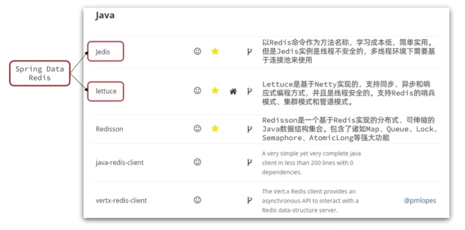
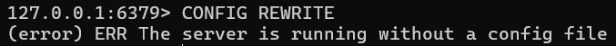
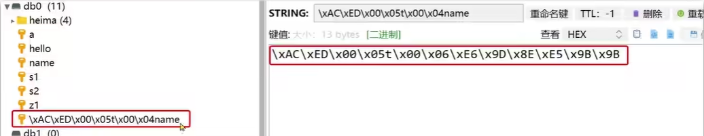
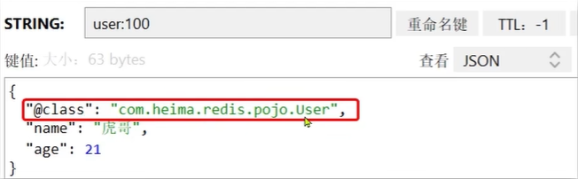
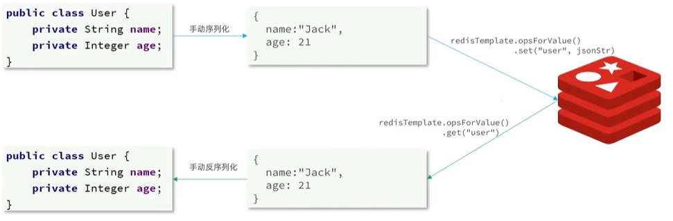

# Jedis

Jedis是Redis比较初步的Java客户端，学习成本较低



## 快速入门

Jedis的官网地址：[redis/jedis: Redis Java client](https://github.com/redis/jedis)

### 基本步骤

1.引入依赖
2.创建Jedis对象，建立连接

### 详细步骤

#### 1. 引入依赖：

```xml
<dependency>
    <groupId>redis.clients</groupId>
    <artifactId>jedis</artifactId>
    <version>3.7.0</version>
</dependency>
```

#### 2. 建立连接

在这里设置密码的注意了：如果是在redis的配置文件中设置了登录密码，则需要在启动服务器时指定配置文件

```bash
.\redis-server.exe .\redis.windows.conf
```

不能直接启动，否则配置不生效：



```java
private Jedis jedis;

@BeforeEach
void setUp() {
    // 建立连接
    jedis = new Jedis("192.168.150.101", 6379);
    // 设置密码
    jedis.auth("123321");
    // 选择库
    jedis.select(0);
}
```

#### 3. 测试string

```java
@Test
void testString() {
    // 插入数据，方法名称就是redis命令名称，非常简单
    String result = jedis.set("name", "张三");
    System.out.println("result = " + result);
    // 获取数据
    String name = jedis.get("name");
    System.out.println("name = " + name);
}
```

#### 4. 释放资源

```java
@AfterEach
void tearDown() {
    // 释放资源
    if (jedis != null) {
        jedis.close();
    }
}
```

### 详细测试

```java
@BeforeEach
    void setUp() {
        jedis = new Jedis("localhost", 6379);
        jedis.auth("admin123"); // Replace with your Redis password if needed
        jedis.select(0);
    }

    @Test
    void testString(){
        String in = jedis.set("name", "morris");
        System.out.println("input = "+in);
        String str = jedis.get("name");
        System.out.println("output = "+str);

    }

    @Test
    void testHash() {
        jedis.hset("user", "name", "morris");
        jedis.hset("user", "age", "18");

        Map<String, String> map = jedis.hgetAll("user");
        System.out.println(map);
//        jedis.hset
    }
    @AfterEach
    void tearDown() {
        if (jedis != null) {
            jedis.close();
        }
    }
```

## Jedis连接池

Jedis本身是线程不安全的，并且频繁的创建和销毁连接会有性能损耗，因此我们推荐大家使用Jedis连接池代替Jedis的直连方式。

```java
public class JedisConnectionFactory {
    private static final JedisPool jedisPool;

    static {
        JedisPoolConfig jedisPoolConfig = new JedisPoolConfig();
        // 最大连接
        jedisPoolConfig.setMaxTotal(8);
        // 最大空闲连接
        jedisPoolConfig.setMaxIdle(8);
        // 最小空闲连接
        jedisPoolConfig.setMinIdle(0);
        // 设置最长等待时间，ms
        jedisPoolConfig.setMaxWaitMillis(200);
        jedisPool = new JedisPool(jedisPoolConfig, "192.168.150.101", 6379, 1000, "123321");
    }
    // 获取Jedis对象
    public static Jedis getJedis(){
        return jedisPool.getResource();
    }
}
```

其实一个连接池无非就是配置最大连接、空闲连接、等待时间，以及方便获取对象的静态方法

> 静态方法讲解：从连接池中获取对象的方法，避免过多地创建或销毁对象，减少开销

接下来在Test程序中的创建部分将new替换成使用 `getJedis`的创建方式即可

```java
@BeforeEach
    void setUp() {
//        jedis = new Jedis("localhost", 6379);
        jedis = JedisApplication.getJedisPool();
        jedis.auth("admin123"); // Replace with your Redis password if needed
        jedis.select(0);
    }
```

在进一步分析之前，我们先了解一下java的**静态初始化块**方法

### 静态初始代码块

**静态初始化块**写法包含两个部分：

#### 1. 静态final字段声明

```java
private static final JedisPool jedisPool;
```

- `private static final`：声明一个私有的静态不可变字段
- 必须在声明时或静态初始化块中赋值

#### 2. 静态初始化块

```java
static {
    // 静态初始化代码
    jedisPool = new JedisPool("localhost", 6379);
}
```

#### 特点和用途

**执行时机**：类第一次被加载时执行，只执行一次

**适用场景**：

- 复杂的静态字段初始化
- 需要异常处理的静态初始化
- 多个静态字段需要协调初始化

#### 等价写法

以下写法是等价的：

```java
// 方式1：直接初始化
private static final JedisPool jedisPool = new JedisPool("localhost", 6379);

// 方式2：静态初始化块
private static final JedisPool jedisPool;
static {
    jedisPool = new JedisPool("localhost", 6379);
}
```

#### 何时使用静态初始化块

当初始化逻辑复杂时更适合使用静态初始化块：

```java
private static final JedisPool jedisPool;

static {
    try {
        // 复杂的初始化逻辑
        JedisPoolConfig config = new JedisPoolConfig();
        config.setMaxTotal(10);
        jedisPool = new JedisPool(config, "localhost", 6379, 2000, "password");
    } catch (Exception e) {
        throw new RuntimeException("Failed to initialize Redis pool", e);
    }
}
```

# SpringDataRedis（重点）

SpringData是Spring中数据操作的模块，包含对各种数据库的集成，其中对Redis的集成模块就叫做SpringDataRedis，

官网：[Spring Data Redis](https://spring.io/projects/spring-data-redis)

- 提供了对不同Redis客户端的整合（Lettuce和Jedis）
- 提供了 `RedisTemplate`统一API来操作Redis
- 支持Redis的发布订阅模型
- 支持Redis哨兵和Redis集群
- 支持基于Lettuce的响应式编程
- 支持基于JDK、JSON、字符串、Spring对象的数据序列化及反序列化
- 支持基于Redis的JDKCollection实现

## SpringDataRedis快速入门

SpringDataRedis中提供了 `RedisTemplate`工具类，其中封装了各种对Redis的操作。并且将不同数据类型的操作API封装到了不同的类型中：

| API                             | 返回值类型          | 说明                       |
| ------------------------------- | ------------------- | -------------------------- |
| `redisTemplate.opsForValue()` | `ValueOperations` | 操作 `String`类型数据    |
| `redisTemplate.opsForHash()`  | `HashOperations`  | 操作 `Hash`类型数据      |
| `redisTemplate.opsForList()`  | `ListOperations`  | 操作 `List`类型数据      |
| `redisTemplate.opsForSet()`   | `SetOperations`   | 操作 `Set`类型数据       |
| `redisTemplate.opsForZSet()`  | `ZSetOperations`  | 操作 `SortedSet`类型数据 |
| `redisTemplate`               | -                   | 通用的命令                 |

## SpringDataRedis快速入门

SpringBoot已经提供了对SpringDataRedis的支持，使用非常简单：

### 1. 引入依赖

```xml
<!--Redis依赖-->
<dependency>
    <groupId>org.springframework.boot</groupId>
    <artifactId>spring-boot-starter-data-redis</artifactId>
</dependency>
<!--连接池依赖-->
<dependency>
    <groupId>org.apache.commons</groupId>
    <artifactId>commons-pool2</artifactId>
</dependency>
```

### 2. 配置文件

```yaml
spring:
  redis:
    host: 192.168.150.101
    port: 6379
    password: 123321
    lettuce:
      pool:
        max-active: 8 # 最大连接
        max-idle: 8 # 最大空闲连接
        min-idle: 0 # 最小空闲连接
        max-wait: 100 # 连接等待时间
```

### 3. 注入 `RedisTemplate`

```java
@Autowired
private RedisTemplate redisTemplate;
```

### 4. 编写测试

```java
@SpringBootTest
public class RedisTest {

    @Autowired
    private RedisTemplate redisTemplate;

    @Test
    void testString() {
        // 插入一条string类型数据
        redisTemplate.opsForValue().set("name", "李四");
        // 读取一条string类型数据
        Object name = redisTemplate.opsForValue().get("name");
        System.out.println("name = " + name);
    }
}
```

## SpringDataRedis的序列化方式

`RedisTemplate`可以接收任意 `Object`作为值写入Redis，只不过写入前会把 `Object`序列化为字节形式，默认是采用JDK序列化，得到的结果是这样的：



缺点：

- 可读性差
- 内存占用较大

我们可以自定义 `RedisTemplate`的序列化方式，代码如下：

```java
@Bean
public RedisTemplate<String, Object> redisTemplate(RedisConnectionFactory redisConnectionFactory) throws UnknownHostException {
    // 创建Template
    RedisTemplate<String, Object> redisTemplate = new RedisTemplate<>();
    // 设置连接工厂
    redisTemplate.setConnectionFactory(redisConnectionFactory);
    // 设置序列化工具
    GenericJackson2JsonRedisSerializer jsonRedisSerializer = new GenericJackson2JsonRedisSerializer();

    // key和 hashKey采用 string序列化
    redisTemplate.setKeySerializer(RedisSerializer.string());
    redisTemplate.setHashKeySerializer(RedisSerializer.string());
    // value和 hashValue采用 JSON序列化
    redisTemplate.setValueSerializer(jsonRedisSerializer);
    redisTemplate.setHashValueSerializer(jsonRedisSerializer);
    return redisTemplate;
}
```

## StringRedisTemplate

尽管JSON的序列化方式可以满足我们的需求，但依然存在一些问题，如图：



可以看到在存储内容中加入了字节码，该字节码的空间甚至比数据本身还要长

为了在反序列化时知道对象的类型，JSON序列化器会将类的 `class`类型写入json结果中，存入Redis，会带来额外的内存开销。

为了节省内存空间，我们并不会使用JSON序列化器来处理value，而是统一使用String序列化器，要求只能存储String类型的key和value。当需要存储Java对象时，手动完成对象的序列化和反序列化。



Spring默认提供了一个 `StringRedisTemplate`类，它的key和value的序列化方式默认就是 `String`方式。省去了我们自定义 `RedisTemplate`的过程：

```java
@Autowired
private StringRedisTemplate stringRedisTemplate;
// JSON工具
private static final ObjectMapper mapper = new ObjectMapper();
@Test
void testStringTemplate() throws JsonProcessingException {
    // 准备对象
    User user = new User("虎哥", 18);
    // 手动序列化
    String json = mapper.writeValueAsString(user);
    // 写入一条数据到redis
    stringRedisTemplate.opsForValue().set("user:200", json);

    // 读取数据
    String val = stringRedisTemplate.opsForValue().get("user:200");
    // 反序列化
    User user1 = mapper.readValue(val, User.class);
    System.out.println("user1 = " + user1);
}
```
