SQL 的核心思想是**用一套标准化的语言来管理和操作关系型数据库**

因此无论面对哪种数据库，这些基本语法都能够通用

# SQL通用语法

1. SQL语句可以单行或多行书写，以分号结尾。
2. SQL语句可以使用空格/缩进来增强语句的可读性。
3. MySQL数据库的SQL语句不区分大小写，关键字建议使用大写。
4. 注释：
   * 单行注释：`--`注释内容或 `#`注释内容(MySQL特有)
   * 多行注释：`/* 注释内容 */`

# SQL分类

首先从宏观上将 SQL 语句进行分类，这就像是给你的工具箱进行分区，每个区域的工具都有其特定的用途

| 分类          | 全称                       | 说明                                                                                                                                            |
| ------------- | -------------------------- | ----------------------------------------------------------------------------------------------------------------------------------------------- |
| **DDL** | Data Definition Language   | **数据定义语言** ，用于定义和管理数据库对象的结构。可以把它理解为“建筑师的工具”，用来创建、修改或拆除数据库、表、字段等“建筑”。       |
| **DML** | Data Manipulation Language | **数据操纵语言** ，用于对数据库表中的**数据**进行增、删、改操作。这是“施工队长的工具”，负责往“建筑”里搬运、修改或移除“家具”。 |
| **DQL** | Data Query Language        | **数据查询语言** ，用于查询数据库中表的记录。这是“侦探的工具”，用来从大量的“家具”中，找出你需要的特定信息。                           |
| **DCL** | Data Control Language      | **数据控制语言** ，用于创建数据库用户并控制其访问权限。这是“物业管理员的工具”，负责管理谁有权限进入哪个“房间”以及能做什么。           |

# DDL语句

**DDL** 语句是构建数据库骨架的基础。它的核心是 **定义结构** 。

* **`CREATE`** ：用于创建数据库、表、视图、索引等。
* **`ALTER`** ：用于修改已存在的数据库对象。
* **`DROP`** ：用于删除数据库对象。

## 数据库操作

这一部分操作需要在代码开头使用

* 查询
  查询所有数据库：

  ```
  SHOW DATABASES;
  ```

  查询当前数据库：

  ```
  SELECT DATABASE();
  ```
* 创建数据库：

  ```
  CREATE DATABASE [IF NOT EXISTS] 数据库名 [DEFAULT CHARSET 字符集] [COLLATE 排序规则]; 
  ```

  **字符集**常见选项：

  * `utf8`：它支持大部分多语言字符，单每个字符最多使用3个字节。这意味着它不能完整的支持一些复杂的字符，如Emoji。
  * `utf8mb4`：这是MySQL官方推荐的、功能最全的UTF-8字符集。`mb4`代表”most bytes 4”，即每个字符最多可以占用4个字节。这使得它能够完整支持所有Unicode字符，包括Emoji、复杂的汉字、特殊符号。
  * `gbk`：用于简体中文，每个汉字占用两个字节。它只支持简体中文，不支持其他语言的字符。
  * `latin1`：这是MySQL的默认字符集。它只包含西欧语言字符，不支持中文。
  * `ascii`：最基本的字符集，只包含英文字母、数字和一些符号。

  **排序规则** ：排序规则是与特定字符集相关联的一组规则，它定义了如何比较和排序字符集中的 **字符串** 。同一个字符集可以有多种排序规则。以 `utf8mb4`为例：

  * `utf8mb4_general_ci`：这是 `utf8mb4`字符集的一个通用排序规则。`ci`表示不区分大小写。
  * `utf8mb4_unicode_ci`：它基于Unicode标准进行排序。不区分大小写。
  * `utf8mb4_bin`：直接按照字符的二进制值进行比较，因此是区分大小写的。
* 删除：

  ```
  DROP DATABASE[IF EXISTS] 数据库名;
  ```
* 使用：实际上是选中数据库

  ```
  USE 数据库名;
  ```

## 表操作

### 创建表 (CREATE TABLE)

```sql
CREATE TABLE table_name (
   column1_name  DATATYPE  [约束条件],
   column2_name  DATATYPE  [约束条件],
   ...
);
```

其中单例应当类似为：

```sql
id INT PRIMARY KEY AUTO_INCREMENT,
```

该方法定义了一个名为 `id` 的列

* **`INT`** ：数据类型，表示这是一个整数。
* **`PRIMARY KEY`** ： **主键约束** ，确保每本书的 `id` 都是唯一的，并且非空。主键是行的唯一标识符，就像是每个人的身份证号。
* **`AUTO_INCREMENT`** ： **自增约束** ，每次插入新行时，`id` 的值会自动递增。这省去了我们手动为每本书分配 ID 的麻烦。

### 修改表 (ALTER TABLE)

* `ADD COLUMN`：添加新列。
* `DROP COLUMN`：删除列。
* `MODIFY COLUMN`：修改列的数据类型或约束。

具体用法即在这些关键字后加上上述单例：

```sql
ALTER TABLE books
ADD COLUMN format VARCHAR(50) NOT NULL DEFAULT '实体书';
```

其中：

* `ALTER TABLE books`：指定我们要修改 `books` 表。
* `ADD COLUMN format VARCHAR(50)`：添加一个名为 `format` 的新列，数据类型为 `VARCHAR(50)`。
* `NOT NULL DEFAULT '实体书'`：为新列添加约束。`NOT NULL` 表示此列不能为空，`DEFAULT '实体书'` 则为其设置了默认值。这保证了即使不手动指定，新旧数据也都有一个默认的格式值。

### 删除表 (DROP TABLE)

普通删除：

```sql
DROP TABLE table_name;
```

删除重建：

```sql
TRUNCATE TABLE 表名
```

### 查询表

* 查询当前数据库所有表：

  ```
  SHOW TABLES;
  ```
* 查询表结构：

  ```
  DESC 表名;
  ```
* 查询指定表的建表语句

  ```
  SHOW CREATE TABLE 表名;
  ```

## 数据类型

### 数值类型

| 类型         | 大小 byte | SIGNED范围                                       | UNSIGNED范围              | 描述               |
| ------------ | --------- | ------------------------------------------------ | ------------------------- | ------------------ |
| TINYINT      | 1         | -128~127                                         | 0~255                     | 小整数值           |
| SMALLINT     | 2         | -32768~32767                                     | 0~65535                   | 整数值             |
| MEDIUMINT    | 3         | -8388608~8388607                                 | 0~16777215                | 整数值             |
| INT          | 4         | -2147483648~2147483647                           | 0~4294967295              | 大整数值           |
| BIGINT       | 8         | -9223372036854775808~9223372036854775807         | 0~18446744073709551615    | 极大整数值         |
| FLOAT        | 4         | -3.402823466E+38~3.402823466E+38                 | 0~3.402823466E+38         | 单精度浮点数值     |
| DOUBLE       | 8         | -1.7976931348623157E+308~1.7976931348623157E+308 | 0~1.7976931348623157E+308 | 双精度浮点数值     |
| DECIMAL(M,D) | 依赖M,D   | 依赖于M和D的值                                   | 依赖于M和D的值            | 小数值(精确定点数) |

> **关于显示宽度** ：
>
> 在某些数据库系统（如 MySQL）中，当你定义一个整数类型的列时，比如 `INT`，你可以为其指定一个括号里的数字，例如 `INT(11)`。这个数字就是 **显示宽度** 。
>
> **关键点** ：这个数字**并不**限制你能够存储的数值范围。`INT(11)` 和 `INT(5)` 能够存储的数值范围都是 `-2147483648` 到 `2147483647`。
>
> * 对于 **整数类型** ：括号中的M为 **显示宽度** ，表示客户端希望显示的 **最少字符数** 。只有在结合 `ZEROFILL`属性时才有实际意义，否则仅为显示提示。
> * 对于 **浮点数类型** ：M是数据的总位数(精度)，D是小数点后的位数(标度)。当整数部分长度大于M-D时会插入失败，小数部分长度大于D显示时会被截断。
> * 浮点数类型存储的都是近似值，而不是精确值。在要求高精度时，应该使用 `DECIMAL`。
> * `INT(M)`、`FLOAT(M, D)`、`DOUBLE(M, D)` 等写法以及 `ZEROFILL` 都是 MySQL 特有的语法扩展，不属于 SQL 标准。从 MySQL 8.0.17 开始它们已被标记为弃用（deprecated），在使用时会产生警告，未来可能被移除。使用时建议直接使用 `INT`、`FLOAT`、`DOUBLE` 。
>   [](https://blog.ulna520.top/image/SQL%E8%AF%AD%E8%A8%80_20250807_153153/1754565498387.png "1754565498387")
>   经过实测，这几个功能在：8.0.43MySQL中任然可以 **生效** 。

 **DECIMAL(M,D)类型详细说明** ：(这个是SQL语言标准，为定点数可以精确表示范围内的数值)

* M的取值范围：1~65，默认值为10
* D的取值范围：0~30，且不能大于M，默认值为0
* 例如：`DECIMAL(5,2)` 可以存储 -999.99 到 999.99

 **修饰符** （放在类型后面修饰）：

* `UNSIGNED`：表示为无符号数，不能存储负数
* `ZEROFILL`：用0填充，当数值少于指定位数时，会在左边补0，同时隐含UNSIGNED属性(MySQL独有，且已经 **准备弃用** )
* `AUTO_INCREMENT`：自动递增，通常用于主键字段

### 字符串类型

| 类型       | 大小               | 描述                         |
| :--------- | :----------------- | :--------------------------- |
| CHAR(M)    | 0-255 bytes        | 定长字符串                   |
| VARCHAR(M) | 0-65535 bytes      | 变长字符串                   |
| TINYBLOB   | 0-255 bytes        | 不超过255个字节的二进制数据  |
| TINYTEXT   | 0-255 bytes        | 短文本字符串                 |
| BLOB       | 0-65535 bytes      | 二进制形式的长文本数据       |
| TEXT       | 0-65535 bytes      | 长文本数据                   |
| MEDIUMBLOB | 0-16777215 bytes   | 二进制形式的中等长度文本数据 |
| MEDIUMTEXT | 0-16777215 bytes   | 中等长度文本数据             |
| LONGBLOB   | 0-4294967295 bytes | 二进制形式的极大文本数据     |
| LONGTEXT   | 0-4294967295 bytes | 极大文本数据                 |

> M：表示存储的最大 **字符数** 。

* char类型为定长字符串，存取性能较高。空余部分用空格填充。
* varchar为变长字符串，存取性能较差，但节省空间。
* BLOB类型存储二进制数据，如音频视频等文件，但是文件太大导致存储效率不高，通常使用**文件系统**代替。数据库只存储文件路径或URL。

### 日期类型

| 类型      | 大小 | 范围                                       | 格式                | 描述                     |
| :-------- | :--- | :----------------------------------------- | :------------------ | :----------------------- |
| DATE      | 3    | 1000-01-01 至 9999-12-31                   | YYYY-MM-DD          | 日期值                   |
| TIME      | 3    | -838:59:59 至 838:59:59                    | HH:MM:SS            | 时间值或持续时间         |
| YEAR      | 1    | 1901 至 2155                               | YYYY                | 年份值                   |
| DATETIME  | 8    | 1000-01-01 00:00:00 至 9999-12-31 23:59:59 | YYYY-MM-DD HH:MM:SS | 混合日期和时间值         |
| TIMESTAMP | 4    | 1970-01-01 00:00:01 至 2038-01-19 03:14:07 | YYYY-MM-DD HH:MM:SS | 混合日期和时间值，时间戳 |

# DML语句

**DML** 语句是与**数据本身**进行交互的核心，主要用来对数据库中表的**数据记录**进行增删改操作

但其操作都只能**根据行或列进行修改**

* **DDL** 的操作是**模式（Schema）级别**的。一个 DDL 语句通常会影响整个表或数据库的定义。
* **DML** 的操作是**行（Row）级别**的。一个 DML 语句通常只会影响表中的特定行，或者多行数据，但不会改变表的整体结构。

## 插入数据

1. 给指定字段添加数据

   ```sql
   INSERT INTO table_name (column1, column2, ...)
   VALUES (value1, value2, ...);
   ```
2. 给全部字段添加数据

   为所有列插入数据，并且值的顺序与列的顺序一致，可以省略列名

   ```
   INSERT INTO 表名 VALUES (值1, 值2, ...);
   ```
3. 批量添加数据

   ```
   INSERT INTO 表名 (字段名1, 字段名2, ...) VALUES (值1, 值2, ...), (值1, 值2, ...), ...;
   ```

   ```
   INSERT INTO 表名 VALUES (值1, 值2, ...), (值1, 值2, ...), ...;
   ```

> * 插入数据时，指定的字段顺序需要与值的顺序是一一对应的。
> * 字符串和日期类型数据应该包含在引导中。
> * 插入的数据大小，应该在字段的规定范围内。

## 修改数据

```sql
UPDATE table_name
SET column1 = value1, column2 = value2, ...
WHERE condition;
```

* 如果没有条件，则会修改整个表的数据。

## 删除数据

```
DELETE FROM 表名 [WHERE 条件];
```

* 无条件删除整个表
* DELETE语句不能删除某一个字段的值，只能一次删除一行。

# DQL

**DQL**着重于 `SELECT`语句的深入**，主要内容是从数据库中检索你想要的信息，**并将这些信息以你需要的方式组织和呈现出来

```sql
SELECT
	字段列表
FROM
	表名列表
WHERE
	条件列表
GROUP BY
	分组字段列表
HAVING
	分组后条件列表
ORDER BY
	排序字段列表
LIMIT
	分页参数
```

## 基础查询

1. 查询多个字段

   ```sql
   SELECT 字段1，字段2，字段3 ... FROM 表名;
   ```

   ```sql
   SELECT * FROM 表名;
   ```
2. 别名设置（可省略）

   ```sql
   SELECT 字段1 [AS "别名1"], 字段2 [AS "别名2"], 字段3 [AS "别名3"], ... FROM 表名;
   ```
3. 去除重复记录

```sql
SELECT DISTINCT 字段列表 FROM 表名;
```

## 条件查询

```sql
SELECT 字段列表 FROM 表名 WHERE 条件;
```

### SQL 比较运算符对照表

| 比较运算符              | 功能                                               |
| ----------------------- | -------------------------------------------------- |
| `>`                   | 大于                                               |
| `>=`                  | 大于等于                                           |
| `<`                   | 小于                                               |
| `<=`                  | 小于等于                                           |
| `=`                   | 等于                                               |
| `<>` 或 `!=`        | 不等于                                             |
| `BETWEEN ... AND ...` | 在某个范围之内（含最小、最大值）                   |
| `IN (...)`            | 在 `IN` 之后的列表中的值，多选一                 |
| `LIKE` “占位符”     | 模糊匹配（`_` 匹配单个字符，`%` 匹配任意字符） |
| `IS NULL`             | 是 `NULL`                                        |

| 逻辑运算符        | 功能                     |
| ----------------- | ------------------------ |
| `AND` 或 `&&` | 并且（多个条件同时成立） |
| `OR` 或 `\|\|`  | 或（一个条件成立即可）   |
| `NOT` 或 `!`  | 非，不是                 |

## 聚合查询（函数）

将**一列**数据作为一个整体，进行纵向计算。

```sql
SELECT 聚合函数(字段列表) FROM 表名;
```

### 常见聚合函数

| 函数        | 描述                     | 示例用法                           |
| ----------- | ------------------------ | ---------------------------------- |
| `COUNT()` | 统计行数（可选字段或 *） | `SELECT COUNT(*) FROM users;`    |
| `SUM()`   | 计算数值字段的总和       | `SELECT SUM(salary) FROM staff;` |
| `AVG()`   | 计算数值字段的平均值     | `SELECT AVG(score) FROM exams;`  |
| `MAX()`   | 获取字段中的最大值       | `SELECT MAX(age) FROM people;`   |
| `MIN()`   | 获取字段中的最小值       | `SELECT MIN(price) FROM goods;`  |

在这样一个列表中，可以使用user、test.user作为表名

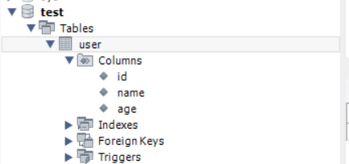

也可以使用以下命令指明：

```sql
use test;

SELECT count(*) FROM user;
```

## 分组查询

```sql
SELECT 字段列表 FROM 表名 [WHERE 条件] GROUP BY 分组字段名 [HAVING 分钟后过滤条件];
```

双重过滤：

分组之后，查询的字段一般为聚合函数和分组字段，查询其他字段无任何意义

WHERE 与HAVING 的区别：

* 执行时机不同：where是分组之前进行过滤，不满足where条件，不参与分组；而having是分组之后对结果进行过滤。

执行顺序：

* WHERE >聚合函数>HAVING

年龄小于30，根据id进行分组，

```sql
SELECT name,count(*) FROM user where age < 30 group by id;
```

**注意一个问题：在使用 GROUP BY 进行分组查询时，SELECT 列表中出现的非聚合函数列必须全部包含在 GROUP BY 子句中**

```sql
SELECT name, age, COUNT(*) 
FROM user 
GROUP BY age; -- 错误，因为name不在GROUP BY中
```

此时的 `name`列没有在 `GROUP BY`中，也没有使用聚合函数（如 MAX、MIN、SUM 等）。

因为一个项只能对应一行数据，所以一对多的表格（如一个组有多个名字）是不可行的，这也不是我们需要的：

```sql
SELECT workaddress,count(*) FROM user where age < 30 group by workaddress;
```

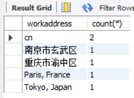

## 排序查询

```sql
SELECT 字段列表 FROM 表名 ORDER BY 字段1 排序方式1, 字段2 排序方式2;
```

排序方式：

* ASC：升序(默认值)(可省略)
* DESC：降序

## 分页查询

```sql
SELECT 字段列表 FROM LIMIT 起始索引, 每页查询记录数;
```

* 起始索引从0开始，起始索引= (查询页码 - 1) * 每页显示记录数。
* 分页查询是数据库的方言，不同的数据库有不同的实现，MySQL中是 `LIMIT`
* 如果查询的是第一页的数据，起始索引可以省略。

**方言**：数据库与数据库不同的地方

如有顺序要求可选：

```sql
-- 基本格式：先排序，再分页
SELECT * FROM 表名
WHERE 条件  -- 可选
ORDER BY 排序字段1 [ASC|DESC], 排序字段2 [ASC|DESC]  -- ASC升序（默认），DESC降序
LIMIT 每页条数 OFFSET 起始位置;  -- OFFSET从0开始
```

## 执行顺序

FROM -> WHERE ->GROUP BY -> SELECT -> HAVING -> ORDER BY LIMIT.

# DCL

DCL是数据控制语言，用来管理数据库用户、控制数据库的**访问权限**

## 管理用户

### 创建用户

mysql的用户由两部分组成：`'用户名'@'主机名'`

类似键值对，一对用户和主机唯一标识一个用户

#### 查询用户

用户数据存储在mysql数据库中的user表中

```sql
USE mysql;
SELECT * FROM user;
```

#### 创建用户

```sql
CREATE USER '用户名'@'主机名' IDENTIFIED BY '密码';
```

使用 `%` 代替主机名，表示任意IP的主机可以访问。

#### 修改用户密码

```sql
ALTER USER '用户名'@'主机名' IDENTIFIED WITH mysql_native_password BY '新密码';
```

#### 删除用户

```sql
DROP USER '用户名'@'主机名';
```

### 权限控制

常用权限：

| 权限                    | 说明               |
| :---------------------- | :----------------- |
| `ALL, ALL PRIVILEGES` | 所有权限           |
| `SELECT`              | 查询数据           |
| `INSERT`              | 插入数据           |
| `UPDATE`              | 修改数据           |
| `DELETE`              | 删除数据           |
| `ALTER`               | 修改表             |
| `DROP`                | 删除数据库/表/视图 |
| `CREATE`              | 创建数据库/表      |

#### 查询用户权限

```sql
SHOW GRANTS FOR '用户名'@'主机名';
```

#### 授予权限

```sql
GRANT 权限列表 ON 数据库名.表名 TO '用户名'@'主机名';
```

#### 撤销权限

```sql
REVOKE 权限列表 ON 数据库名.表名 FROM '用户名'@'主机名';
```

* 多个权限之间，使用 `,`分割
* 授权时，数据库名和表名可以使用  `*`  进行通配，代表所有。

# 函数

函数是指一段可以直接被另一程段程序调用的程序或代码。

## 字符串函数

MySQL中内置了很多字符串函数，常用的几个如下：

|             函数             | 功能                                                       |
| :--------------------------: | :--------------------------------------------------------- |
|   `CONCAT(S1,S2,...Sn)`   | 字符串拼接，将S1，S2，…Sn拼接成一个字符串                 |
|        `LOWER(str)`        | 将字符串str全部转为小写                                    |
|        `UPPER(str)`        | 将字符串str全部转为大写                                    |
|     `LPAD(str,n,pad)`     | 左填充，用字符串pad对str的左边进行填充，达到n个字符串长度  |
|     `RPAD(str,n,pad)`     | 右填充，用字符串pad对str的右边进行填充，达到n个字符串长度  |
|        `TRIM(str)`        | 去掉字符串**头部**和**尾部**的空格（中间无效） |
| `SUBSTRING(str,start,len)` | 返回从字符串str从start位置起的len个长度的字符串            |

> SUBSTRING函数的下标从1开始

```sql
select concat('Hello',' MySQL');

-- rpad
select rpad('01',5,'-');
-- trim
select trim('Hello MysQL ');
-- substring
select substring('Hello MysQL',1,5);
```

## 数值函数

常见的数值函数如下：

| 函数           | 功能                               |
| :------------- | :--------------------------------- |
| `CEIL(x)`    | 向上取整                           |
| `FLOOR(x)`   | 向下取整                           |
| `MOD(x,y)`   | 返回 `x % y` 的值                |
| `RAND()`     | 返回0~1内的随机数                  |
| `ROUND(x,y)` | 求参数x的四舍五入的值，保留y位小数 |

## 日期函数

常见的日期函数如下：

| 函数                                   | 功能                                              |
| :------------------------------------- | :------------------------------------------------ |
| `CURDATE()`                          | 返回当前日期                                      |
| `CURTIME()`                          | 返回当前时间                                      |
| `NOW()`                              | 返回当前日期和时间                                |
| `YEAR(date)`                         | 获取指定date的年份                                |
| `MONTH(date)`                        | 获取指定date的月份                                |
| `DAY(date)`                          | 获取指定date的日期                                |
| `DATE_ADD(date, INTERVAL expr type)` | 返回一个日期/时间值加上一个时间间隔expr后的时间值 |
| `DATEDIFF(date1,date2)`              | 返回 `date1`减去 `date2`之间的天数            |

## 流程函数

流程函数也是很常用的一类函数，可以在SQL语句中实现 **条件筛选** ，从而提高语句的效率。

| 函数                                                           | 功能                                                     |
| :------------------------------------------------------------- | :------------------------------------------------------- |
| `IF(value,t,f)`                                              | 如果value为true，则返回t；否则返回f                      |
| `IFNULL(value1,value2)`                                      | 如果value1不为空，返回value1；否则返回value2             |
| `CASE WHEN [val1] THEN [res1] ... ELSE [default] END`        | 如果val为true，返回res1，… 否则返回default默认值        |
| `CASE [expr] WHEN [val1] THEN [res1] ... ELSE [default] END` | 如果expr的值等于val1，返回res1，… 否则返回default默认值 |

```sql
select
	id,
    name,
    (case when age <= 25 then 'youth' when age >25 && age <=35 then 'strong' else 'old' end) 'age',
    workaddress
from user;
```

# 约束

* **概念** ：约束是作用于表中字段上的规则，用于限制存储在表中的数据。
* **目的** ：保证数据库中数据的正确、有效和完整。

| 约束                      | 描述                                                     | 关键字      |
| :------------------------ | :------------------------------------------------------- | :---------- |
| 非空约束                  | 限制该字段的数据不能为null                               | NOT NULL    |
| 唯一约束                  | 保证该字段的所有数据都是唯一、不重复的                   | UNIQUE      |
| 主键约束                  | 主键是一行数据的唯一标识，要求非空且唯一                 | PRIMARY KEY |
| 默认约束                  | 保存数据时，如果未指定该字段的值，则采用默认值           | DEFAULT     |
| 检查约束 (8.0.16版本之后) | 保证字段值满足指定条件                                   | CHECK       |
| 外键约束                  | 用来让两张表的数据之间建立连接，保证数据的一致性和完整性 | FOREIGN KEY |

> 约束是作用于表中字段上的，可以在创建表/修改表的时间添加约束。

> 一个字段可以添加多个约束。

对应关系：

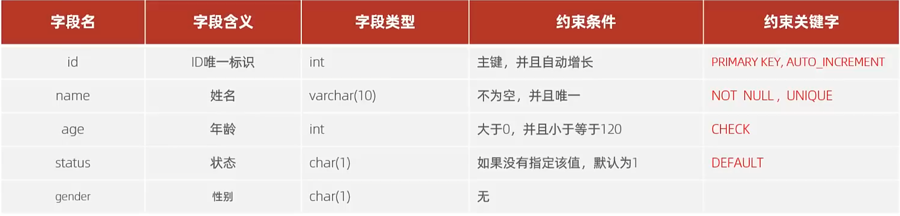

```sql
use test;
create table works(
	id int primary key auto_increment,
    name varchar(20) not null unique,
    importance int comment '优先级',
    status char(1) DEFAULT '1' COMMENT '状态'
    );
```

## 外键约束

外键将一个表中的列与另一个表的主键（或唯一键）关联起来，从而形成父子关系。

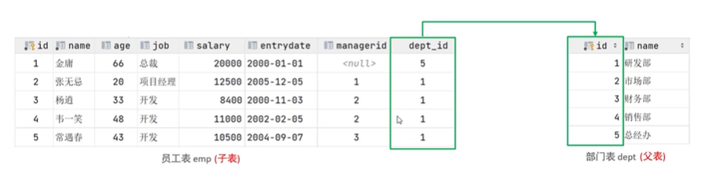

> 目前上述的两张表，在数据库层面，并未建立外键关联，所以是无法保证数据的一致性和完整性的。

语法：

添加外键：

* 创建时添加：

```sql
CREATE TABLE 表名(
	字段名 数据类型,
	...
	[CONSTRAINT] [外键名称] FOREIGN KEY (外键字段名) REFERENCES 主表(主表列名)
);
```

* 创建后添加：

```sql
ALTER TABLE 表名 ADD CONSTRAINT 外键名称 FOREIGN KEY (外键字段名) REFERENCES 主表(主表列名);
```

删除外键：

```sql
ALTER TABLE 表名 DROP FOREIGN KEY 外键名称;
```

删除/更新行为：

| 行为        | 说明                                                                                                                               |
| :---------- | :--------------------------------------------------------------------------------------------------------------------------------- |
| NO ACTION   | 当在父表中删除/更新对应记录时，首先检查该记录是否有对应外键，如果没有则不允许删除/更新。（与 RESTRICT 一致）(**默认行为** )) |
| RESTRICT    | 当在父表中删除/更新对应记录时，首先检查该记录是否有对应外键，如果没有则不允许删除/更新。（与 NO ACTION 一致）                      |
| CASCADE     | 当在父表中删除/更新对应记录时，首先检查该记录是否有对应外键，如果有，则也删除/更新外键在子表中的记录。                             |
| SET NULL    | 当在父表中删除/更新对应记录时，首先检查该记录是否有对应外键，如果有则设置子表中该外键值为null（这就要求该外键允许null）。          |
| SET DEFAULT | 父表有变更时，子表将外键列设置成一个默认的值 (Innodb不支持)                                                                        |

```sql
ALTER TABLE 表名 ADD CONSTRAINT 外键名称 FOREIGN KEY (外键字段) REFERENCES 主表名(主表字段名) ON UPDATE 行为 ON DELETE 行为;
```

# 多表查询

## 多表关系

项目开发中，在进行数据库表结构设计时，会根据业务需求以及业务模块之间的关系，分析并设计表结构，由于业务之间相互关联，所以各个表结构之间也存在着各种联系，基本上分为三种：

* 一对多(多对一)
* 多对多
* 一对一

### 一对多

案例：部门 与 员工的关系

关系：**一个部门**对应 **多个员工** ；一个员工对应一个部门。

实现：**在多的一方建立外键，指向一的一方的主键。**

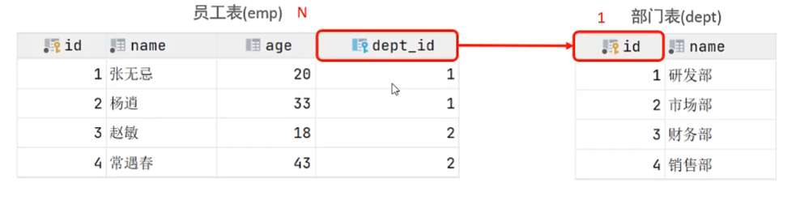

### 多对多

案例：学生 与 课程的关系

关系：**一个学生**可以选修 **多门课程** ，**一个课程**可以供多个。

实现：建立第三张中间表，中间表至少包含两个外键，分别关联两方主键。

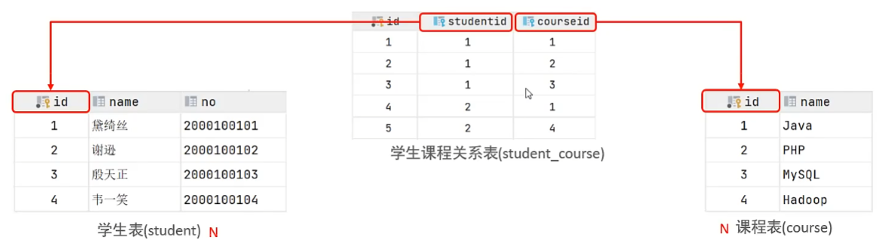

### 一对一

案例：用户 与 用户详情的关系

关系：一对一关系，用于单表拆分，将一张表的**基础字段**放在一张表中，其他**详情字段**放在另一张表中，以提升操作效率。

实现：在任意一方加入外键，关联另一方的主键，并且设置外键为唯一的(UNIQUE)。

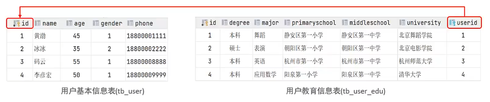

## 多表查询概述

从多张表中查询数据。

笛卡尔积：两个集合的所有组合情况

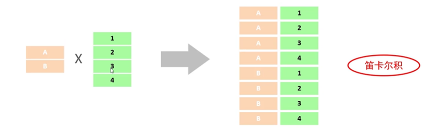

多表查询分类：

* 连接查询：
  * 内连接：查询A, B交集部分数据。
  * 外连接：
    * 左外连接：查询左表所有数据，以及两张表交集部分数据。
    * 右外连接：查询右表所有数据，以及两张表交集部分数据。
  * 自连接：当前表与自身的连接查询，自连接必须使用表别名。
* 子查询

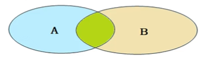

## 内连接

内连接查询两张表交集部分

* 隐式内连接：

  ```sql
  SELECT 字段列表 FROM 表1, 表2 WHERE 条件...;
  ```
* 显式内连接：

  ```sql
  SELECT 字段列表 FROM 表1 [INNER] JOIN 表2 ON 连接条件...;
  ```

```sql
-- 从两表中选择
use test;

select user.name,user.age,works.name,works.status from user,works where user.age >=28 and user.id=works.id;

select u.name,u.age,w.name,w.status from user u inner join works w on u.age >=28 and u.id=w.id;
```


## 外连接

外连接可以查到左表或右表的所有数据，相当于显示所有的A或B

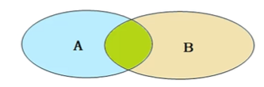

* 左外连接：

  ```sql
  SELECT 字段列表 FROM 表1 LEFT [OUTER] JOIN 表2 ON 条件...;
  ```

  > 相当于查询表1(左表)的**所有数据** 包含表1和表2交集部分的数据。
  >
* 右外查询：

  ```sql
  SELECT 字段列表 FROM 表1 RIGHT [OUTER] JOIN 表2 ON 条件...;
  ```

  > 相当于查询表2(右表)的所有数据 包含 表1 和 表2 交集部分的数据。
  >
* 笛卡尔积

  ```sql
  SELECT 字段列表 FROM 表1 CROSS JOIN 表2;
  ```

## 自连接

自连接查询可以是内连接，也可以是外连接。

```sql
SELECT 字段列表 FROM 表A 别名A JOIN 表A 别名B ON 条件...;
```

自己对自己进行筛选：

```sql
select a.name ,b.name from emp a, emp b where a.managerid = b.id;
```

> 当前表与自身的连接查询，自连接必须使用表别名

## 联合查询

对于union查询，就是把多次查询结果合并起来，形成一个新的查询结果集。

```sql
SELECT 字段列表 FROM 表A ...
UNION [ALL]
SELECT 字段列表 FROM 表B ...;
```

* 有 `ALL` 关键字不会进行自动去重，删除 `ALL` 就可以去重
* 表A与表B的**查询字段** （字段列表）必须完全相同，否则会报错。

> 对于联合查询的多张表的列数必须保持一致，字段类型也需要保持一致，

## 子查询

**子查询（Subquery）** 是嵌套在其他 SQL 语句中的查询语句，通常用于在主查询中提供中间结果。它可以出现在 `SELECT`、`FROM`、`WHERE`、`HAVING` 等子句中。

* **基本示例** ：

```sql
SELECT *
FROM t1
WHERE column1 = (SELECT column1 FROM t2);
```

子查询的分类与用途

* 按结果分：

| 类型                 | 返回结果           | 场景举例                              |
| -------------------- | ------------------ | ------------------------------------- |
| **标量子查询** | 单个值             | 比较运算，如 `=`、`>`             |
| **列子查询**   | 一列（多行）       | 用于 `IN`、`ANY`、`ALL`         |
| **行子查询**   | 一行（多列）       | 用于多列比较 `(col1, col2) = (...)` |
| **表子查询**   | 多行多列（临时表） | 常放在 `FROM`后做中间结果集         |

* 按位置分：

| 位置                  | 示例                                 | 用途         |
| --------------------- | ------------------------------------ | ------------ |
| **WHERE 之后**  | 过滤条件中使用子查询                 | 条件筛选     |
| **FROM 之后**   | 将子查询结果当作临时表（派生表）使用 | 中间计算     |
| **SELECT 之后** | 作为列计算的来源                     | 动态计算字段 |

### 标量子查询

子查询返回的结果是单个值(数字、字符串、日期等)，最简单的形式，这种子查询称为标量子查询。

* 常用操作符：`=`、`!=`、`>=`、`>`、`<`、`<=`

WHERE 子句中的标量子查询 ：

```sql
SELECT name
FROM t1
WHERE column1 = (SELECT column1 FROM t2 where ...);
```

### 列子查询

子查询返回的结果是 **一列** (可能是多行)，这种子查询称为列子查询（不是一个范围而是一个集合）

常用操作符：`IN`、`NOT IN`、`ANY`、`SOME`、`ALL`

| 操作符 | 描述                                        |
| ------ | ------------------------------------------- |
| IN     | 在指定的集合范围之内，多选一                |
| NOT IN | 不在指定的集合范围之内                      |
| ANY    | 子查询返回列表中，有任意一个满足即可        |
| SOME   | 与 ANY 等同，使用 SOME 的地方都可以使用 ANY |
| ALL    | 子查询返回列表的所有值都必须满足            |

```sql
--D。根据部门ID，查询员工信息
select * 
from emp 
where dept_id in (
	select id 
	from dept 
	where name ='销传部'or name ='i场都');
```

```sql
SELECT * 
FROM emp 
WHERE salary > ALL (
    SELECT salary 
    FROM emp 
    WHERE dept_id = (
        SELECT id 
        FROM dept 
        WHERE name = '财务部'
    )
);
```

### 行子查询

子查询返回的结果是一行(可以是多列)，这种子查询称为行子查询。

常用操作符：`=`、`!=`、`IN`、`NOT`、`IN`

```sql
-- 查询与 "张无忌" 的薪资及直属领导相同的员工信息；
SELECT * 
FROM emp 
WHERE (salary, managerid) = (
    SELECT salary, managerid 
    FROM emp 
    WHERE name = '张无忌'
);

```

### 表子查询

子查询返回的结果是多行多列，这种子查询称为表子查询。

常用操作符：`IN`

```sql
SELECT e.*, d.* 
FROM (
    SELECT * 
    FROM emp 
    WHERE entrydate > '2006-01-01'
) e 
LEFT JOIN dept d 
    ON e.dept_id = d.id;
```

# 事务

事务是一组操作的集合，它是一个不可分割的工作单位，事务会把所有的操作作为一个整体一起向系统提交或撤销操作请求，即这些操作 **要么同时成功，要么同时失败** 。

MySQL默认自动提交，这导致如果我们不把一串操作连接成事务时，如果中途出错，前半部分的操作会直接提交，而后半部分还没开始执行就停止，但此时数据库已经被修改

## 事务操作

* 查看事务提交方式

  ```sql
  SELECT @@autocommit;
  ```

  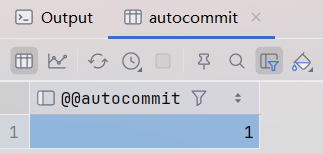

  此时的1表示自动提交开启（默认）使用 `SET @@autocommit=0`可将其关闭
  否则不提交的话内容仅对当前窗口有效，进行数据库的表查看时会发现没有修改
* 设置事务提交方式

  ```sql
  SET @@autocommit=0;
  ```
* 提交事务：将本次修改进行提交

  ```sql
  COMMIT;
  ```
* 回滚事务：回滚到上次提交事务的状态

  ```sql
  ROLLBACE;
  ```
* 开启事务

  ```sql
  START TRANSACTION;
  ```

> 开启事务后，执行到COMMIT或ROLLBACK 就算事务结束。

## 事务四大特性

* **原子性** (Atomicity)：**原子性** 意味着一个事务中的所有操作，要么全部完成，要么全部失败回滚， **不可分割** 。
  
* **一致性** (Consistency)：**一致性** 确保事务执行前后，数据库从一个**合法状态**转移到另一个 **合法状态** 。
  
* **隔离性** (Isolation)：**隔离性** 指的是一个事务的执行不应该被其他事务干扰。
* **持久性** (Durability)：**持久性** 意味着一旦事务 **提交（commit）** ，它对数据库的更改就是永久性的，即使系统发生故障（如断电或系统崩溃），这些更改也不会丢失。
  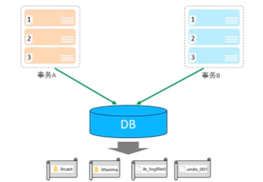

## 并发事务问题

| 问题                 | 描述                                                                                                     |
| -------------------- | -------------------------------------------------------------------------------------------------------- |
| **脏读**       | 一个事务读到另外一个事务还没有提交的数据。                                                               |
| **不可重复读** | 一个事务先后读取同一条记录，但两次读取的数据不同，称之为不可重复读。                                     |
| **幻读**       | 一个事务按照条件查询数据时，没有对应的数据行，但是在插入数据时，又发现这行数据已经存在，好像出现了幻影。 |

### 事务的隔离性

小明在研究锁之前，又回想到之前上学的时候教过的数据库事务隔离性，其实锁在数据库中其功能之一也是用来实现事务隔离性。而事务的隔离性其实是用来解决，脏读，不可重复读，幻读几类问题。

### 2.2.1 脏读

一个事务读取到另一个事务未提交的更新数据。
什么意思呢?

| 时间点 | 事务A                            | 事务B                                       |
| ------ | -------------------------------- | ------------------------------------------- |
| 1      | begin;                           |                                             |
| 2      | select * from user where id = 1; | begin;                                      |
| 3      |                                  | update user set namm = 'test' where id = 1; |
| 4      | select * from user where id = 1; |                                             |
| 5      | commit;                          | commit;                                     |

在事务A，B中，事务A在时间点2，4分别对user表中id=1的数据进行了查询了，但是事务B在时间点3进行了修改，导致了事务A在4中的查询出的结果其实是事务B修改后的。破坏了数据库中的隔离性。

### 2.2.2 不可重复读

在同一个事务中，多次读取同一数据返回的结果不同，和脏读不同的是这里读取的是已经提交过后的。

| 时间点                                                                                          | 事务A                            | 事务B                                       |
| ----------------------------------------------------------------------------------------------- | -------------------------------- | ------------------------------------------- |
| 1                                                                                               | begin;                           |                                             |
| 2                                                                                               | select * from user where id = 1; | begin;                                      |
| 3                                                                                               |                                  | update user set namm = 'test' where id = 1; |
| 4                                                                                               |                                  | commit;                                     |
| 5                                                                                               | select * from user where id = 1; |                                             |
| 6                                                                                               | commit;                          |                                             |
| 在事务B中提交的操作在事务A第二次查询之前，但是依然读到了事务B的更新结果，也破坏了事务的隔离性。 |                                  |                                             |

### 2.2.3 幻读

一个事务读到另一个事务已提交的insert数据。但是通过select查询却没有对应插入数据

| 时间点 | 事务A                            | 事务B                 |
| ------ | -------------------------------- | --------------------- |
| 1      | begin;                           |                       |
| 2      | select * from user where id > 1; | begin;                |
| 3      |                                  | insert user select 2; |
| 4      |                                  | commit;               |
| 5      | select * from user where id > 1; |                       |
| 6      | commit;                          |                       |

在事务A中查询了两次id大于1的，在第一次id大于1查询结果中没有数据，但是由于事务B插入了一条Id=2的数据，导致事务A第二次查询时能查到事务B中插入的数据。

## 事务的隔离级别

| 隔离级别 (Isolation Level) | 脏读 (Dirty Read) | 不可重复读 (Non-repeatable Read) | 幻读 (Phantom Read) |
| -------------------------- | ----------------- | -------------------------------- | ------------------- |
| Read uncommitted           | √                | √                               | √                  |
| Read committed             | ×                | √                               | √                  |
| Repeatable Read (默认)     | ×                | ×                               | √                  |
| Serializable（串行化）     | ×                | ×                               | ×                  |

* 从上到下越发安全，但性能越差
* 只有当前一个提交完成后才能进入下一个事务

设置操作：

```sql
-- 查看事务隔离级别
SELECT @@TRANSACTION_ISOLATION

-- 设置事务隔离级别
SET [SESSION | GLOBAL] TRANSACTION ISOLATION LEVEL 隔离级别
```

这里如果设置session级别则仅对当前窗口生效（不提交）

## 事务应用

当在一个事务中创建另一个事务时，需要在子事务中的 `@Transactional` 中声明

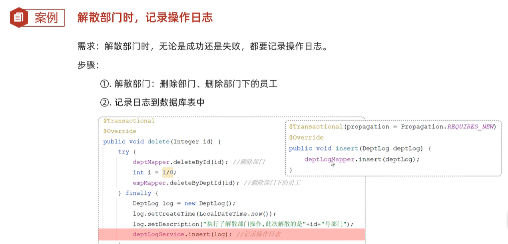

* **REQUIRED** : 大部分情况下都是用该传播行为即可。
* **REOUIRES NEW** : 当我们不希望事务之间相互影响时，可以使用该传播行为。比如:下订单前需要记录日志，不论订单保存成功与否，都需要保证日志记录能够记录成功。
