# 存储引擎

存储引擎就是存储数据、建立索引、更新/查询数据等技术的实现方式。存储引擎是基于表的，而不是基于库的，所以存储引擎也可被称为表类型。

## 体系结构

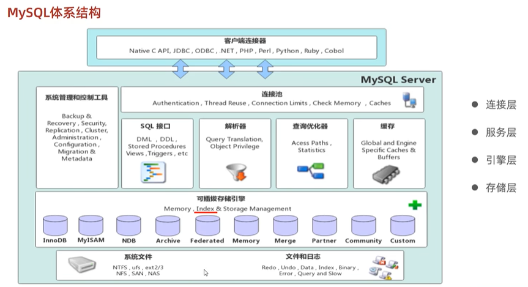

1. 连接层

最上层是一些客户端和链接服务，主要完成一些类似于连接处理、授权认证、及相关的安全方案。
服务器也会为安全接入的每个客户端验证它所具有的操作权限。

2. 服务层

第二层架构主要完成大多数的核心服务功能，如 SQL 接口，并完成缓存的查询，SQL 的分析和优化，部分内置函数的执行。
所有跨存储引擎的功能也在这一层实现，如过程、函数等。

3. 引擎层

存储引擎真正的负责了 MySQL 中数据的存储和提取，服务器通过 API 和存储引擎进行通信。
不同的存储引擎具有不同的功能，这样我们可以根据自己的需要，来选取合适的存储引擎。

4. 存储层

主要是将数据存储在文件系统之上，并完成与存储引擎的交互。

## 简介

使用命令：

```sql
show create table [已建表名];
```

查看建表语句

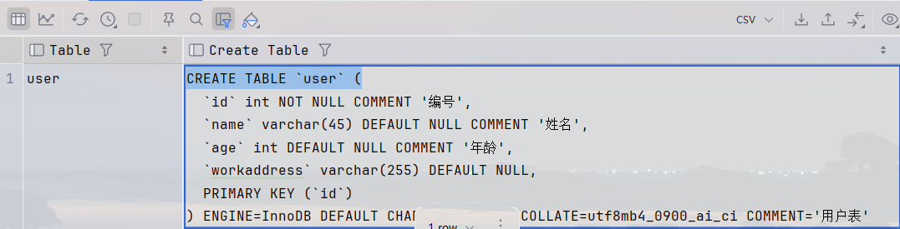

1. 在创建表时，指定存储引擎

```sql
CREATE TABLE 表名(
    字段1 字段1类型 [COMMENT 字段1注释],
    ......
    字段n 字段n类型 [COMMENT 字段n注释]
) ENGINE = INNODB [COMMENT 表注释];
```

2. 查看当前数据库支持的存储引擎

```sql
SHOW ENGINES;
```

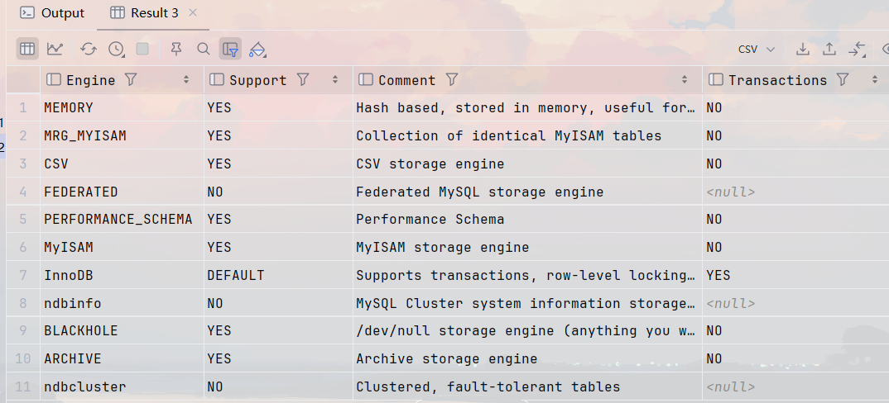

## 常见引擎

### InnoDB

- 介绍

  - InnoDB是一种兼顾高可靠性和高性能的通用存储引擎，在MySQL 5.5之后，InnoDB是默认的MySQL存储引擎。
- 特点

  - DML操作遵循ACID模型，支持**事务**；
  - **行级锁**，提高并发访问性能；
  - 支持**外键**FOREIGN KEY约束，保证数据的完整性和正确性；
- 文件

  - xxx.ibd: xxx代表的是表名，innoDB引擎的每张表都会对应这样一个表空间文件，存储该表的表结构（frm、sdi）、数据和索引。
  - 参数: innodb_file_per_table

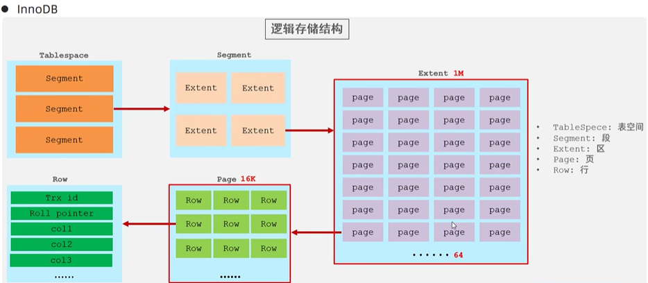

### MyISAM

- 介绍
  - MyISAM是MySQL早期的默认存储引擎。
- 特点
  - 不支持事务
  - 不支持外键支持表锁
  - 不支持行锁访问速度快
- 文件
  xxx.sdi: 存储表结构信息
  xxx.MYD: 存储数据
  xxx.MYI: 存储索引

### Memory

- 介绍
  - Memory引擎的表数据时存储在内存中的，由于受到硬件问题、或断电问题的影响，只能将这些表作为临时表或缓存使用。
- 特点
  - 内存存放
  - hash索引（默认）
- 文件
  - xxx.sdi: 存储表结构信息

### 存储引擎特点

| 特点         | InnoDB            | MyISAM | Memory |
| ------------ | ----------------- | ------ | ------ |
| 存储限制     | 64TB              | 有     | 有     |
| 事务安全     | 支持              | -      | -      |
| 锁机制       | 行锁              | 表锁   | 表锁   |
| B+tree 索引  | 支持              | 支持   | 支持   |
| Hash 索引    | -                 | -      | 支持   |
| 全文索引     | 支持(5.6版本之后) | 支持   | -      |
| 空间使用     | 高                | 低     | N/A    |
| 内存使用     | 高                | 低     | 中等   |
| 批量插入速度 | 低                | 高     | 高     |
| 支持外键     | 支持              | -      | -      |

#### 引擎选择

在选择存储引擎时，应该根据应用系统的特点选择合适的存储引擎。对于复杂的应用系统，还可以根据实际情况选择多种存储引擎进行组合。

- **InnoDB**：是 Mysql 的默认存储引擎，支持事务、外键。如果应用对事务的完整性有比较高的要求，在并发条件下要求数据的一致性，数据操作除了插入和查询之外，还包含很多的更新、删除操作，那么 InnoDB 存储引擎是比较合适的选择。
- **MyISAM**：如果应用是以读操作和插入操作为主，只有很少的更新和删除操作，并且对事务的完整性、并发性要求不是很高，那么选择这个存储引擎是非常合适的。
- **MEMORY**：将所有数据保存在内存中，访问速度快，通常用于临时表及缓存。MEMORY 的缺陷就是对表的大小有限制，太大的表无法缓存在内存中，而且无法保障数据的安全性。

# 索引

## 概述

- 介绍

索引（index）是帮助 MySQL 高效获取数据的数据结构（有序）。在数据之外，数据库系统还维护着满足特定查找算法的数据结构，这些数据结构以某种方式引用（指向）数据，这样就可以在这些数据结构上实现高级查找算法，这种数据结构就是索引。

* 索引结构

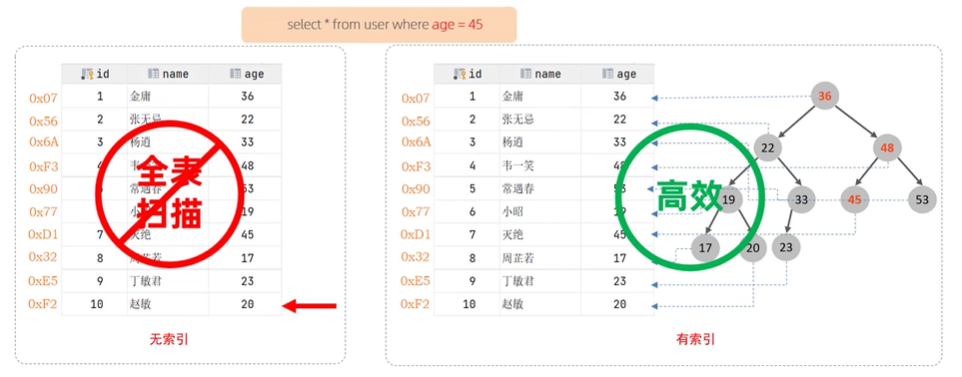

* 优缺点

| 优势                                                            | 劣势                                                                                               |
| --------------------------------------------------------------- | -------------------------------------------------------------------------------------------------- |
| 提高数据检索的效率，降低数据库的 I/O 成本                       | 索引列也是要占用空间的。                                                                           |
| 通过索引列对数据进行排序，降低数据排序的成本，降低 CPU 的消耗。 | 索引大大提高了查询效率，同时却也降低更新表的速度，如对表进行 INSERT、UPDATE、DELETE 时，效率降低。 |

## 索引结构

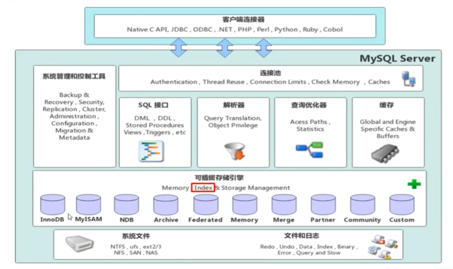

MySQL 的索引是在存储引擎层实现的，不同的存储引擎有不同的结构，主要包含以下几种：

| 索引结构            | 描述                                                                             |
| ------------------- | -------------------------------------------------------------------------------- |
| B+Tree 索引         | 最常见的索引类型，大部分引擎都支持 B+ 树索引                                     |
| Hash 索引           | 底层数据结构是用哈希表实现的，只有精确匹配索引列的查询才有效，不支持范围查询     |
| R-tree(空间索引)    | 空间索引是 MyISAM 引擎的一个特殊索引类型，主要用于地理空间数据类型，通常使用较少 |
| Full-text(全文索引) | 是一种通过建立倒排索引，快速匹配文档的方式。类似于 Lucene,Solr,ES                |

* 索引支持情况

| 索引        | InnoDB          | MyISAM | Memory |
| ----------- | --------------- | ------ | ------ |
| B+tree 索引 | 支持            | 支持   | 支持   |
| Hash 索引   | 不支持          | 不支持 | 支持   |
| R-tree 索引 | 不支持          | 支持   | 不支持 |
| Full-text   | 5.6版本之后支持 | 支持   | 不支持 |

索引如果没有特别指明，都是指B+树索引

### 二叉树

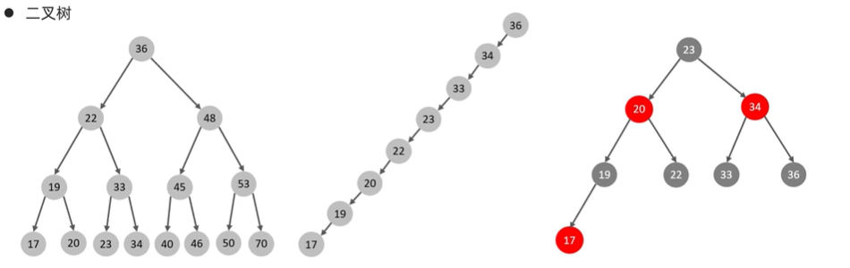

* 二叉树缺点:顺序插入时，会形成一个链表，查询性能大大降低。大数据量情况下，层级较深，检索速度慢
* 红黑树:大数据量情况下，层级较深，检索速度慢。

### B(-)树（多路平衡查找树）

以一颗最大度数(max-degree)为5(5阶)的b-tree为例(每个节点最多存储4个key，5个指针):

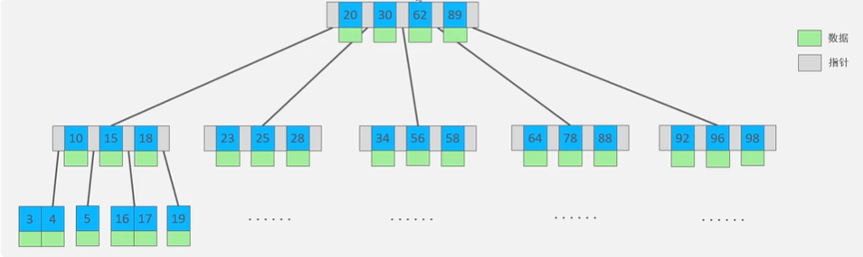

> 树的度数是指一个节点的子节点数量

B树演变过程请参考[数据结构可视化](https://www.cs.usfca.edu/~galles/visualization/Algorithms.html)，可以详细看到数据结构的操作过程

### B+树

以一颗最大度数(max-degree)为4(4阶)的b+tree为例，所有的数据都出现在叶子节点：

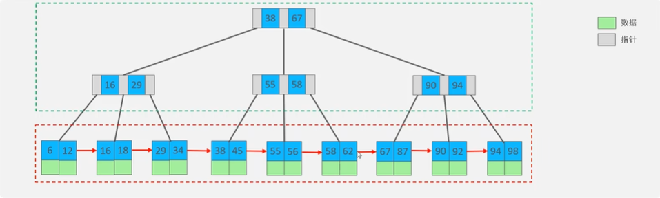

* 非叶子节点起到索引结构
* 叶子节点存储数据
* 叶子节点中形成一个单向链表，每一个叶子节点指向下一个叶子节点

#### InnoDB采用B+树原因(重点)

- 相对于二叉树，层级更少，搜索效率高；
- 对于 B-tree，无论是叶子节点还是非叶子节点，都会保存数据，这样导致一页中存储的键值减少，指针跟着减少，要同样保存大量数据，只能增加树的高度，导致性能降低；
- 相对 Hash 索引，B+tree 支持范围匹配及排序操作；

### MySQL索引数据结构

MySQL索引数据结构对经典的B+Tree进行了优化。在原B+Tree的基础上，增加一个指向相邻叶子节点的链表指针，就形成了带有顺序指针的B+Tree，提高区间访问的性能。

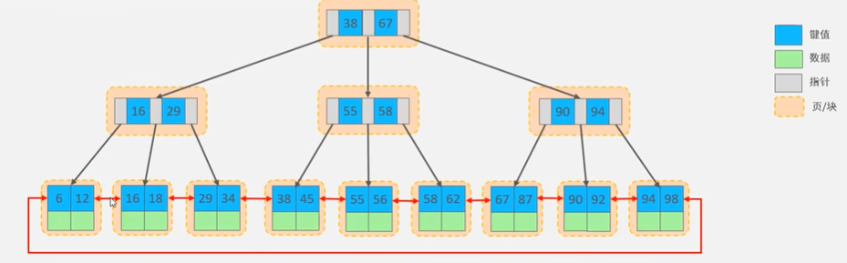

### Hash

哈希索引就是采用一定的hash算法，将键值换算成新的hash值，映射到对应的槽位上，然后存储在hash表中。

哈希冲突解决方法：移位、链表...

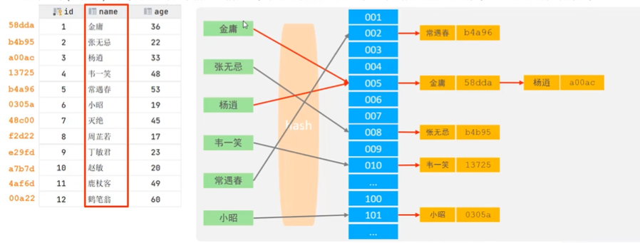

- Hash索引特点
  1. Hash索引只能用于对等比较(=, in)，不支持范围查询（between，>，<，…）
  2. 无法利用索引完成排序操作
  3. 查询效率高，通常只需要一次检索就可以了，效率通常要高于B+tree索引
- 存储引擎支持
  - 在MySQL中，支持hash索引的是Memory引擎，而innoD8中具有自适应hash功能，hash索引是存储引擎根据B+Tree索引在指定条件下**自动构建**的。

## 索引分类

| 分类     | 含义                                                 | 特点                     | 关键字   |
| -------- | ---------------------------------------------------- | ------------------------ | -------- |
| 主键索引 | 针对于表中主键创建的索引                             | 默认自动创建，只能有一个 | PRIMARY  |
| 唯一索引 | 避免同一个表中某数据列中的值重复                     | 可以有多个               | UNIQUE   |
| 常规索引 | 快速定位特定数据                                     | 可以有多个               |          |
| 全文索引 | 全文索引查找的是文本中的关键词，而不是比较索引中的值 | 可以有多个               | FULLTEXT |

### 存储形式分类

在 InnoDB 存储引擎中，根据索引的存储形式，又可以分为以下两种：

| 分类                      | 含义                                                       | 特点                         |
| ------------------------- | ---------------------------------------------------------- | ---------------------------- |
| 聚集索引(Clustered Index) | 将数据存储与索引放到了一块，索引结构的叶子节点保存了行数据 | 必须有，而且只有一个（唯一） |
| 二级索引(Secondary Index) | 将数据与索引分开存储，索引结构的叶子节点关联的是对应的主键 | 可以存在多个                 |

聚集索引选取规则

- 如果存在主键，主键索引就是聚集索引。
- 如果不存在主键，将使用第一个唯一（UNIQUE）索引作为聚集索引。
- 如果表没有主键，或没有合适的唯一索引，则 InnoDB 会自动生成一个 rowid 作为隐藏的聚集索引。

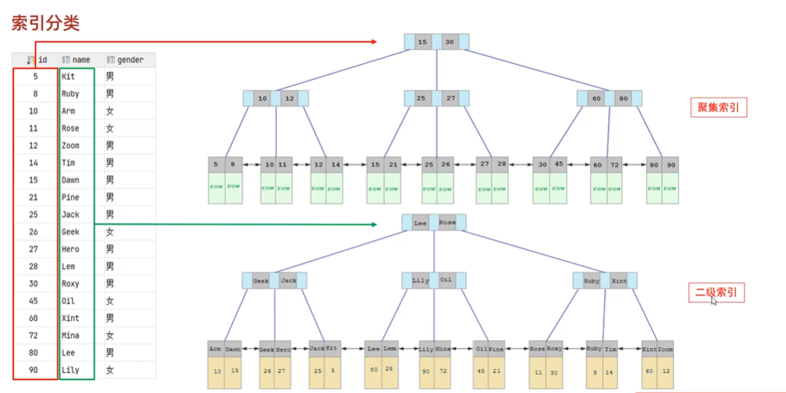

* 聚集索引存储的数据是该行的详细内容
* 二级索引存储的数据是该行的唯一id

### sql语句查找

```sql
select * from user where name = 'Arm'
```

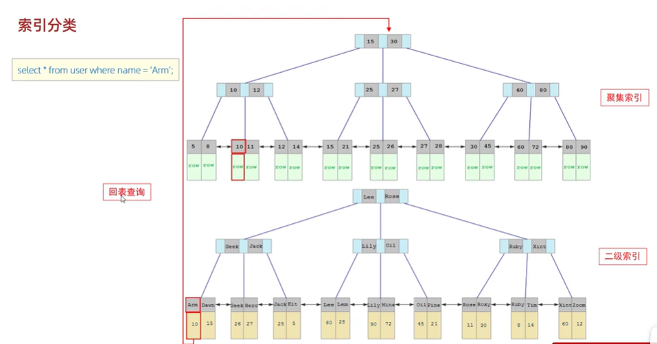

1. 首先在二级索引中找到对应名称的id
2. 通过回表查询进行聚集索引
3. 聚集索引找到对应id的raw数据

## 索引语法

* 创建索引
  *方框中可省略*

```sql
CREATE [UNIQUE | FULLTEXT] INDEX index_name ON table_name (index_col_name,...);  
```

* 查看索引

```sql
SHOW INDEX FROM table_name;  
```

* 删除索引

```sql
DROP INDEX index_name ON table_name;  
```

## SQL性能分析

### SQL执行频率

MySQL 客户端连接成功后，通过 `show [session|global] status`命令可以提供服务器状态信息。通过如下指令，可以查看当前数据库的 `INSERT`、`UPDATE`、`DELETE`、`SELECT`的访问频次：

```sql
SHOW GLOBAL STATUS LIKE 'Com____';
```

一个下划线代表一个字符（输出？）

### 慢查询日志

慢查询日志记录了所有执行时间超过指定参数（`long_query_time`，单位：秒，默认 10 秒 ）的所有 SQL 语句的日志。

MySQL 的慢查询日志默认没有开启，需要在 MySQL 的配置文件（`/etc/my.cnf` ）中配置如下信息：

```ini
# 开启MySQL慢日志查询开关  
slow_query_log=1  

# 设置慢日志的时间为2秒，SQL语句执行时间超过2秒，就会视为慢查询，记录慢查询日志  
long_query_time=2  
```

### profile详情

`show profiles` 能够在做 SQL 优化时帮助我们了解时间都耗费到哪里去了。通过 `have_profiling` 参数，能够看到当前 MySQL 是否支持 profile 操作：

```sql
SELECT @@have_profiling;  
```

默认 `profiling` 是关闭的，可以通过 `set` 语句在 `session/global` 级别开启 `profiling`：

```sql
SET profiling = 1;  
```

### explain执行计划

`EXPLAIN` 执行计划各字段含义：

#### id

select查询的序列号，表示查询中执行select子句或者是操作表的顺序（id相同，执行顺序从上到下；id不同，值越大，越先执行 ）。

#### select_type

表示 `SELECT` 的类型，常见的取值有 `SIMPLE`（简单表，即不使用表连接或者子查询 ）、`PRIMARY`（主查询，即外层的查询 ）、`UNION`（`UNION` 中的第二个或者后面的查询语句 ）、`SUBQUERY`（`SELECT/WHERE` 之后包含了子查询 ）等

#### type

表示连接类型，性能由好到差的连接类型为 `NULL`、`system`、`const`、`eq_ref`、`ref`、`range`、`index`、`all` 。

#### possible_key

##### Key

实际使用的索引，如果为 `NULL`，则没有使用索引。

##### Key_len

表示索引中使用的字节数，该值为索引字段最大可能长度，并非实际使用长度，在不损失精确性的前提下，长度越短越好 。

##### rows

MySQL 认为必须要执行查询的行数，在 InnoDB 引擎的表中，是一个估计值，可能并不总是准确的。

##### filtered

表示返回结果的行数占需读取行数的百分比，`filtered` 的值越大越好。

## 索引使用

### 验证索引效率

在未建立索引之前，执行如下 SQL 语句，查看 SQL 的耗时。

```sql
SELECT * FROM tb_sku WHERE sn = '100000003145001';  
```

针对字段创建索引

```sql
create index idx_sku_sn on tb_sku(sn);  
```

然后再次执行相同的 SQL 语句，再次查看 SQL 的耗时。

```sql
SELECT * FROM tb_sku WHERE sn = '100000003145001';  
```

### 最左前缀法则

如果索引了多列（联合索引 ），要遵守最左前缀法则。最左前缀法则指的是查询从索引的最左列开始，并且不跳过索引中的列。

如果跳跃某一列，索引将部分失效（后面的字段索引失效 ）。

```sql
explain select * from tb_user where profession = '软件工程' and age = 31 and status = '0';  
```

```sql
explain select * from tb_user where profession = '软件工程' and age = 31;  
```

```sql
explain select * from tb_user where profession = '软件工程';  
```

```sql
explain select * from tb_user where age = 31 and status = '0';  
```

```sql
explain select * from tb_user where status = '0';  
```

### 范围查询

联合索引中，出现范围查询（`>`、`<` ），范围查询右侧的列索引失效

```sql
explain select * from tb_user where profession = '软件工程' and age > 30 and status = '0';  
```

```sql
explain select * from tb_user where profession = '软件工程' and age >= 30 and status = '0';  
```

### 索引列运算

不要在索引列上进行运算操作，索引将失效。

```sql
explain select * from tb_user where substring(phone,10,2) = '15';  
```

### 字符串不加引号

字符串类型字段使用时，不加引号，索引将失效。

```sql
explain select * from tb_user where profession = '软件工程' and age = 31 and status = 0;  
```

```sql
explain select * from tb_user where phone = 17799990015;  
```

### 模糊查询

如果仅仅是尾部模糊匹配，索引不会失效。如果是头部模糊匹配，索引失效。

```sql
explain select * from tb_user where profession like '软件%';  
```

```sql
explain select * from tb_user where profession like '%工程';  
```

```sql
explain select * from tb_user where profession like '%工%';  
```

### or连接的条件

用 `or`分割开的条件，如果 `or`前的条件中的列有索引，而后面的列中没有索引，那么涉及的索引都不会被用到。

```sql
explain select * from tb_user where id = 10 or age = 23;  
```

```sql
explain select * from tb_user where phone = '17799990017' or age = 23;  
```

由于 `age`没有索引，所以即使 `id`、`phone`有索引，索引也会失效。所以需要针对于 `age`也要建立索引。

### 数据分布影响

如果MySQL评估使用索引比全表更慢，则不使用索引。

```sql
select * from tb_user where phone >= '17799990005';  
```

```sql
select * from tb_user where phone >= '17799990015';  
```

### SQL提示

SQL提示，是优化数据库的一个重要手段，简单来说，就是在SQL语句中加入一些人为的提示来达到优化操作的目的。

**use index**

```sql
explain select * from tb_user use index(idx_user_pro) where profession = '软件工程';  
```

**ignore index**

```sql
explain select * from tb_user ignore index(idx_user_pro) where profession = '软件工程';  
```

**force index**

```sql
explain select * from tb_user force index(idx_user_pro) where profession = '软件工程';  
```

### 覆盖索引

尽量使用覆盖索引（查询使用了索引，并且需要返回的列，在该索引中已经全部能够找到 ），减少 `select *` 。

```sql
explain select id,profession from tb_user where profession = '软件工程' and age = 31 and status = '0';  
```

```sql
explain select id,profession,age,status from tb_user where profession = '软件工程' and age = 31 and status = '0';  
```

```sql
explain select id,profession,age,status,name from tb_user where profession = '软件工程' and age = 31 and status = '0';  
```

```sql
explain select * from tb_user where profession = '软件工程' and age = 31 and status = '0';  
```

> using index condition：查找使用了索引，但是需要回表查询数据
> using where;using index：查找使用了索引，但是需要的数据都在索引列中能找到，所以不需要回表查询数据

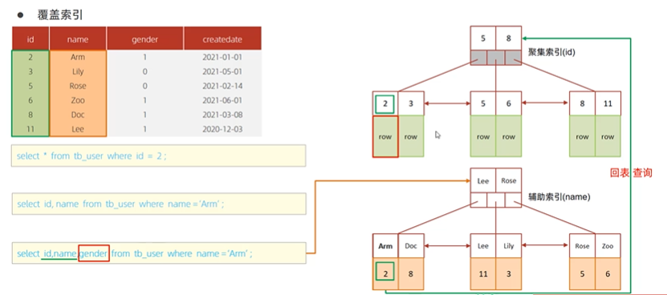

#### 思考

一张表，有四个字段（`id`、`username`、`password`、`status` ），由于数据量大，需要对以下 SQL 语句进行优化，该如何进行才是最优方案：

```sql
select id,username,password from tb_user where username = 'itcast';  
```

**优化思路**：可创建基于 `username` 字段的索引，并且利用覆盖索引进一步优化。比如创建联合索引 `idx_username_id_pass` 包含 `username`、`id`、`password` 字段（因为查询需返回 `id`、`username`、`password`，索引包含这些列可形成覆盖索引 ），语句如下：

```sql
CREATE INDEX idx_username_id_pass ON tb_user(username, id, password);  
```

这样查询时能通过索引快速定位数据，且直接从索引获取所需返回列，减少回表操作，提升查询效率 。

### 前缀索引

当字段类型为字符串（`varchar`，`text`等 ）时，有时候需要索引很长的字符串，这会让索引变得很大，查询时，浪费大量的磁盘IO，影响查询效率。此时可以只将字符串的一部分前缀，建立索引，这样可以大大节约索引空间，从而提高索引效率。

#### 语法

```sql
create index idx_xxx on table_name(column(n));  
```

#### 前缀长度

可以根据索引的选择性来决定，而选择性是指不重复的索引值（基数）和数据表的记录总数的比值，索引选择性越高则查询效率越高，唯一索引的选择性是1，这是最好的索引选择性，性能也是最好的。

```sql
select count(distinct email) / count(*) from tb_user;  
```

```sql
select count(distinct substring(email,1,5)) / count(*) from tb_user;  
```

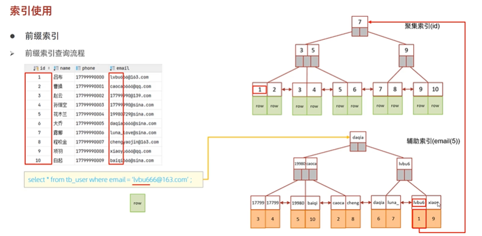

### 单列索引与联合索引

- **单列索引**：即一个索引只包含单个列。
- **联合索引**：即一个索引包含了多个列。

在业务场景中，如果存在多个查询条件，考虑针对查询字段建立索引时，建议建立联合索引，而非单列索引。

#### 单列索引情况

```sql
explain select id,phone,name from tb_user where phone = '17799990010' and name = '韩信';  
```

```
mysql> explain select id, phone, name from tb_user where phone = '17799990010' and name = '韩信';  
+----+-------------+--------+------------+-------------+---------------------+---------------------+---------+------+------+----------+-------+  
| id | select_type | table  | partitions | type        | possible_keys       | key                 | key_len | ref  | rows | filtered | Extra |  
+----+-------------+--------+------------+-------------+---------------------+---------------------+---------+------+------+----------+-------+  
|  1 | SIMPLE      | tb_user| NULL       | const       | idx_user_phone,idx_user_name | idx_user_phone     | 47      | const|    1 |   100.00 | NULL  |  
+----+-------------+--------+------------+-------------+---------------------+---------------------+---------+------+------+----------+-------+  
1 row in set, 1 warning (0.00 sec)  
```

多条件联合查询时，MySQL优化器会评估哪个字段的索引效率更高，会选择该索引完成本次查询。

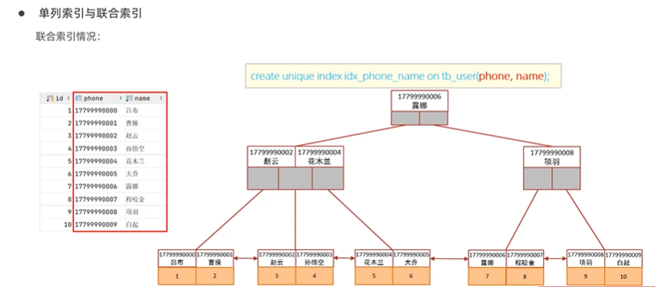

## 索引设计原则

1. 针对于数据量较大，且查询比较频繁的表建立索引。
2. 针对于常作为查询条件（`where` ）、排序（`order by` ）、分组（`group by` ）操作的字段建立索引。
3. 尽量选择区分度高的列作为索引，尽量建立唯一索引，区分度越高，使用索引的效率越高。
4. 如果是字符串类型的字段，字段的长度较长，可以针对于字段的特点，建立前缀索引。
5. 尽量使用联合索引，减少单列索引，查询时，联合索引很多时候可以覆盖索引，节省存储空间，避免回表，提高查询效率。
6. 要控制索引的数量，索引并不是多多益善，索引越多，维护索引结构的代价也就越大，会影响增删改的效率。
7. 如果索引列不能存储 `NULL`值，请在创建表时使用 `NOT NULL`约束它。当优化器知道列是否包含 `NULL`值时，它可以更好地确定哪个索引最有效地用于查询。


# SQL视图

视图(View)是一种虚拟存在的表。视图中的数据并不在数据库中实际存在，行和列数据来自定义视图的查询中使用的表，并且是在使用视图时动态生成的。

通俗的讲，视图只保存了查询的SQL逻辑，不保存查询结果。所以我们在创建视图的时候，主要的工作就落在创建这条SQL查询语句上。

## 基础语法


- **创建**

  ```sql
  CREATE [OR REPLACE] VIEW 视图名称[(列名列表)] AS SELECT语句 [WITH[CASCADED | LOCAL] CHECK OPTION]
  ```

也可以在最后添加一条语句：

```sql
... with cascaded check option
```

这样可以保证只能插入条件允许的数据到视图中


- **查询**

  ```sql
  -- 查看创建视图语句
  SHOW CREATE VIEW 视图名称;  
  -- 查看视图数据
  SELECT * FROM 视图名称 ......;  
  ```

  在查询这一部分其实就和普通的查询一致了（DDL语句）
- **修改**

  ```sql
  -- 方式一  
  CREATE [OR REPLACE] VIEW 视图名称[(列名列表)] AS SELECT语句 [WITH[CASCADED | LOCAL] CHECK OPTION]  
  -- 方式二  
  ALTER VIEW 视图名称[(列名列表)] AS SELECT语句 [WITH[CASCADED | LOCAL] CHECK OPTION]  
  ```
- **删除**

  ```sql
  DROP VIEW [IF EXISTS] 视图名称 [,视图名称 ...]
  ```

### 检查选项

当使用WITH CHECK OPTION子句创建视图时，MySOL会通过视图检查正在更改的每个行，例如 插入，更新，制除，以使其符合视图的定义。MySOL允许基于另一个视图创建视图，它还会检查依赖视图中的规则以保持一致性。为了确定检查的范围，mvsgl提供了两个选项:CASCADED和LOCAL，默认值为 CASCADED

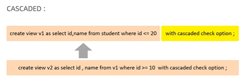

只要添加了这一个检查选项，才在修改时进行检查，否则都不需要检查（而且是递归检查）

## 视图更新


要使视图可更新，视图中的行与基础表中的行之间必须存在一对一的关系。如果视图包含以下任何一项，则该视图不可更新：

1. 聚合函数或窗口函数（`SUM()`、`MIN()`、`MAX()`、`COUNT()` 等）
2. `DISTINCT`
3. `GROUP BY`
4. `HAVING`
5. `UNION` 或者 `UNION ALL`


## 作用

- **简单**
  - 视图不仅可以简化用户对数据的理解，也可以简化他们的操作。那些被经常使用的查询可以被定义为视图，从而使得用户不必为以后的操作每次指定全部的条件。
- **安全**
  - 数据库可以授权，但不能授权到数据库特定行和特定的列上。通过视图用户只能查询和修改他们所能见到的数据。
- **数据独立**
  - 视图可帮助用户屏蔽真实表结构变化带来的影响。
