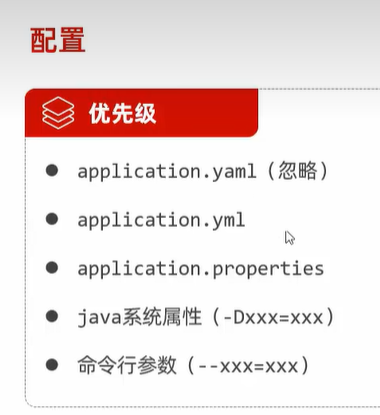
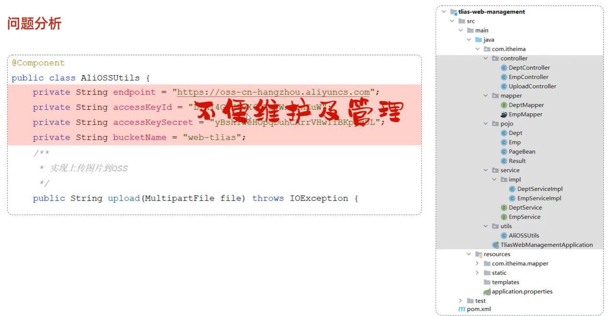

# 配置优先级

SpringBoot 提供了多种属性配置方式：

- `application.properties`：层级结构不清晰
  ```properties
  server.port=8080
  server.address=127.0.0.1
  ```
- `application.yml`：简洁，数据为中心
  ```yaml
  server:
    port: 8080
    address: 127.0.0.1
  ```
- `application.yaml`：
  ```yaml
  server:
    port: 8080
    address: 127.0.0.1
  ```

## yml

* 大小写敏感
* 数值前边必须有空格，作为分隔符
* 使用缩进表示层级关系，缩进时，不允许使用 `Tab`键，只能用空格（idea 中会自动将 `Tab`转换为空格）
* 缩进的空格数目不重要，只要相同层级的元素左侧对齐即可
* `#`表示注释，从这个字符一直到行尾，都会被解析器忽略

详见后续：[Springboot | 配置优先级](https://www.bilibili.com/video/BV1m84y1w7Tb?spm_id_from=333.788.videopod.episodes&vd_source=74f4827cbcb229713bfcc88faf3e6252&p=183)



# 配置文件

为防止配置过于松散，将所有的配置文件内容放在同一的application.properties/yml/yaml文件中



## 配置类中直接对应

直接配置使用@Value注解来简易实现

```properties
# 自定义的阿里云OSS配置信息
aliyun.oss.endpoint=https://oss-cn-hangzhou.aliyuncs.com
aliyun.oss.accessKeyId=LTAI4GCh1vX6DKqJwxd6nEuW
aliyun.oss.accessKeySecret=yBshYweHopqDuhCArrVhwIiBKpyqSL
aliyun.oss.bucketName=web-tlias
```

```java
@Component
public class AliOSSUtils {

    @Value("${aliyun.oss.endpoint}")
    private String endpoint;

    @Value("${aliyun.oss.accessKeyId}")
    private String accessKeyId;

    @Value("${aliyun.oss.accessKeySecret}")
    private String accessKeySecret;

    @Value("${aliyun.oss.bucketName}")
    private String bucketName;
}
```

`@Value` 注解通常用于外部配置的属性注入，具体用法为：`@Value("${配置文件中的key}")`

## `@ConfigurationProperties`注解

直接将配置文件中的配置项属性注入配置文件中

```yaml
aliyun:
  oss:
    endpoint: https://oss-cn-hangzhou.aliyuncs.com
    accessKeyId: LTAI4GCh1vX6DKqJwxd6nEuW
    accessKeySecret: yBshYweHopqDuhCArrVhwIiBKpyqSL
    bucketName: web-framework
```

```java
@Data
@Component
public class AliOSSProperties {
    private String endpoint;
    private String accessKeyId;
    private String accessKeySecret;
    private String bucketName;
}
```

配置类需要声明为ioc容器管理
