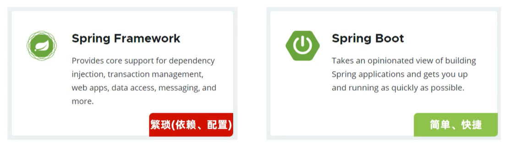
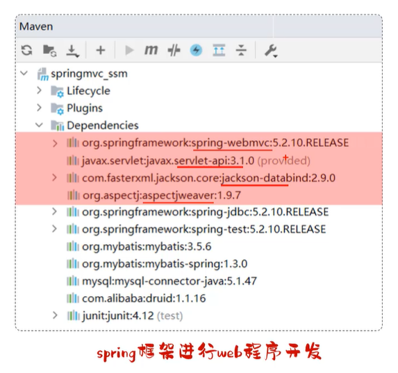
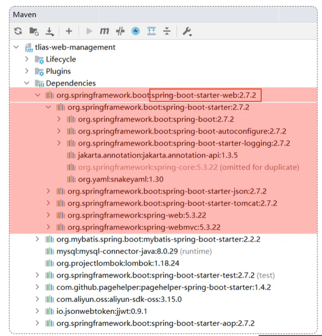
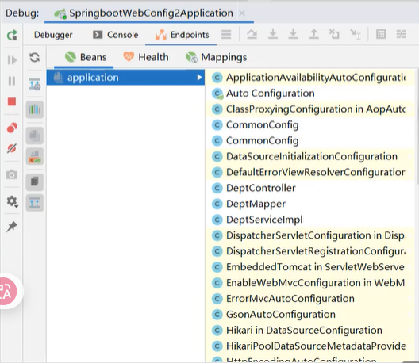
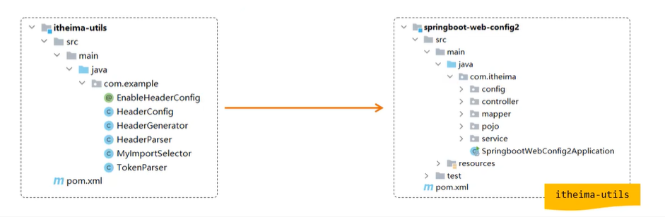
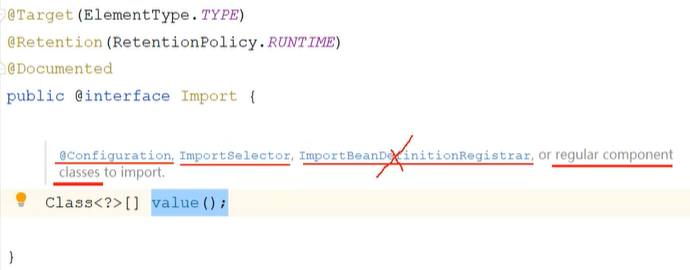
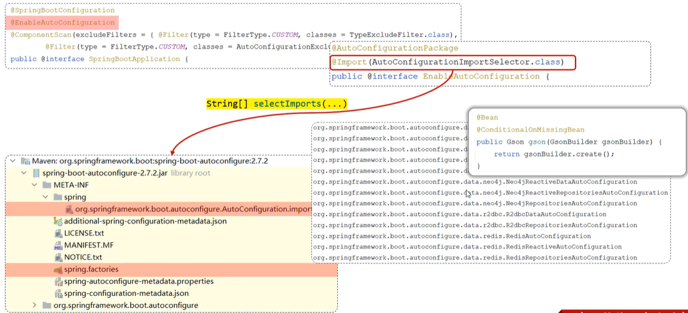
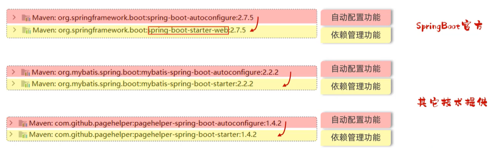
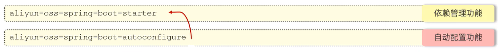

与普通Spring框架相比的优势：**起步依赖 + 自动配置**

# 起步依赖



spring依赖



springboot依赖 + **maven依赖传递**

重点在于maven能够实现的依赖传递：如果在A中定义了依赖X，B依赖了A，B就可以不引用依赖X

# 自动配置

SpringBoot的自动配置就是当spring容器启动后，一些配置类、bean对象就自动存入到了I0C容器中，不需要我们手动去声明，从而简化了开发，省去了繁琐的配置操作。



在控制台下方的Endpoints中

## 实质

**引入依赖后，是如何将依赖架包中的定义的配置类以及bean加载到spring的ioc容器中的**

## 原理

### 方案一：`@ComponentScan` 组件扫描

通过组件扫描形式来扫描第三方依赖中的Bean和配置类

但是大范围的扫描可能过于繁琐

```java
@ComponentScan({"com.example","com.itheima"})
@SpringBootApplication
public class SpringbootWebConfig2Application {
}
```



### 方案二：`@Import` 导入

使用 `@Import` 导入的类会被 Spring 加载到 IOC 容器中，导入形式主要有以下几种：

- 导入 普通类
- 导入 配置类
- 导入 `ImportSelector` 接口实现类
- 手动写一个@EnableXxx注解对@import进行封装，在需要的地方使用该注解

（源代码）



```java
@Import({TokenParser.class, HeaderConfig.class})
@SpringBootApplication
public class SpringbootWebConfig2Application {
}
```

## 源码跟踪

```java
@SpringBootApplication
public class SpringbootThirdbeanApplication {
    public static void main(String[] args) {
        SpringApplication.run(SpringbootThirdbeanApplication.class, args);
    }
}
```

```java
@SpringBootConfiguration
@EnableAutoConfiguration
@ComponentScan(excludeFilters = { @Filter(type = FilterType.CUSTOM, classes = TypeExcludeFilter.class),
        @Filter(type = FilterType.CUSTOM, classes = AutoConfigurationExcludeFilter.class) })
public @interface SpringBootApplication {
}
```

### `@SpringBootApplication`

该注解标识在 SpringBoot 工程引导类上，是 SpringBoot 中最最最重要的注解。该注解由三个部分组成：

- `@SpringBootConfiguration`：该注解与 `@Configuration` 注解作用相同，用来声明当前也是一个配置类。
- `@ComponentScan`：组件扫描，默认扫描当前引导类所在包及其子包。
- `@EnableAutoConfiguration`：SpringBoot 实现自动化配置的核心注解。
  - 内置 `@import`注解，导入配置类的全类名



在spring 3.X版本之后配置类都定义在.import文件内

> @ConditionalXxxx注解
>
> 不可能所有的配置类都一次性加载到ioc容器中，因此使用条件装配

### `@Conditional`

- 作用：按照一定的条件进行判断，在满足给定条件后才会注册对应的 bean 对象到 Spring IOC 容器中。
- 位置：方法、类
- `@Conditional` 本身是一个父注解，派生出大量的子注解：
  - `@ConditionalOnClass`：判断环境中是否有对应字节码文件，才注册 bean 到 IOC 容器。
  - `@ConditionalOnMissingBean`：判断环境中没有对应的 bean（类型 或 名称），才注册 bean 到 IOC 容器。
  - `@ConditionalOnProperty`：判断配置文件中有对应属性和值，才注册 bean 到 IOC 容器。

```java
@Bean
@ConditionalOnMissingBean
public Gson gson(GsonBuilder gsonBuilder) {
    return gsonBuilder.create();
}
```

实际区分：

```java
@Bean
@ConditionalOnClass(name = "io.jsonwebtoken.Jwts") // 当前环境存在指定的这个类时，才声明该bean
public HeaderParser headerParser() {...}
```

```java
@Bean
@ConditionalOnMissingBean // 当不存在当前类型的bean时，才声明该bean
public HeaderParser headerParser() {...}
```

```java
@Bean
@ConditionalOnProperty(name = "name", havingValue = "itheima") // 配置文件中存在对应的属性和值，才注册bean到IOC容器。
public HeaderParser headerParser() {...}
```

## 自定义starter

在实际开发中，经常会定义一些公共组件，提供给各个项目团队使用。而在 SpringBoot 的项目中，一般会将这些公共组件封装为 SpringBoot 的 starter。



starter仅定义起步依赖，autoconfigure包定义自动配置操作，然后starter需要将autoconfigure包引入进来

这样在之后的开发中只需要引入starter（起步依赖）即可，通过依赖传递将自动配置也同时引入

### 需求

- 需求：自定义 `aliyun-oss-spring-boot-starter`，完成阿里云 OSS 操作工具类 `AliyunOSSUtils` 的自动配置。
- 目标：引入起步依赖之后，要想使用阿里云 OSS，注入 `AliyunOSSUtils` 直接使用即可。

### 步骤

- 创建 `aliyun-oss-spring-boot-starter` 模块
- 创建 `aliyun-oss-spring-boot-autoconfigure` 模块，在 starter 中引入该模块
- 在 `aliyun-oss-spring-boot-autoconfigure` 模块中定义自动配置功能，并定义自动配置文件 `META-INF/spring/xxxx.imports`


