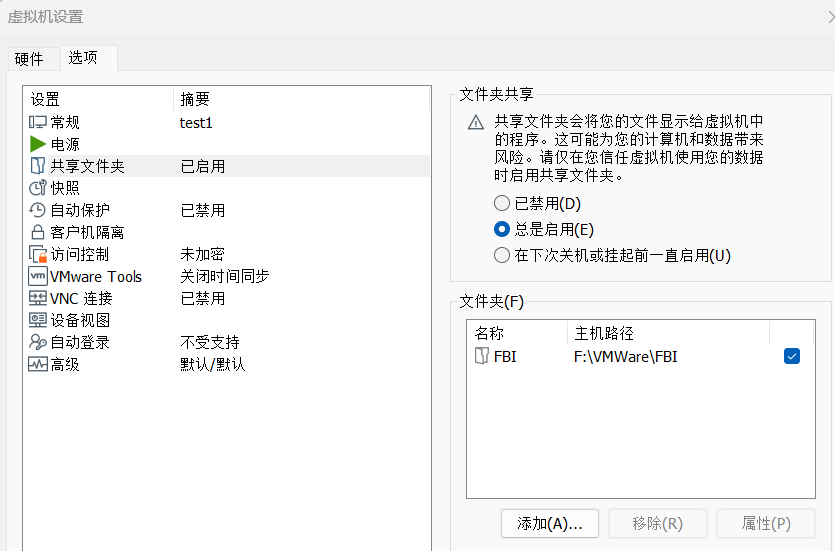

*望海潮，望归乡*

# 一、在Linux中创建挂载目录

```
sudo mkdir -p /mnt/FBI
```

# 二、VMWare中开启共享文件夹

这里记得记录共享文件夹名字，后续要用



# 三、编译fstab文件开启启动时自动挂载

首先查找id，但是大家默认的id应该是一样的

然后启动编辑：

```
sudo nano /etc/fstab
```

在文件末尾添加一行（注意替换你的共享名）：

```
.host:/FBI /mnt/FBI fuse.vmhgfs-fuse defaults,allow_other,uid=1000,gid=1000 0 0
```

然后刷新一下：刷新 systemd 配置（消除警告）：

```
sudo systemctl daemon-reload
```

最后进行测试：

```
sudo mount -a
```

* **如果没有报错：** 恭喜，配置正确，可以放心重启。
* **如果有报错：**  **千万不要重启** ，立刻回去修改 `/etc/fstab`，检查拼写或注释掉那一行，直到 `mount -a` 不报错为止。
