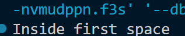
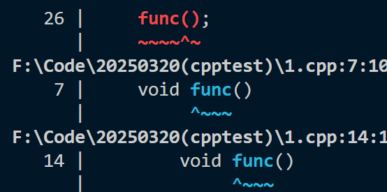

*It's not like I'm pessimistic or anything... I'm just moving forward without looking back.*——*Sekai Ichi Hatsukoi - World's Greatest First Love*

本质上，命名空间就是定义了一个范围，定义了能够使用的当前库对象

# 定义命名空间

```cpp
namespace namespace_name {
   // 代码声明
}
```

调用命名空间中的函数或变量时，在调用代码的前面加上命名空间的名称即可

```
<_name>::<_code>;  // code 可以是变量或函数
```

## using指令

使用 **using namespace** 指令在使用命名空间时就可以不用在前面加上命名空间的名称，后续的代码将使用指定的命名空间中的名称

当然我们也可以使用整个命名空间中的某一个项目，但是命名空间中的其他项目仍然需要加上命名空间名称作为前缀：

```cpp
#include <iostream>
using std::cout;
 
int main ()
{
 
   cout << "std::endl is used with std!" << std::endl;
   
   return 0;
}
```


## 不连续的命名空间

一个命名空间的各个组成部分可以分散在多个文件中。

如果命名空间中的某个组成部分需要请求定义在另一个文件中的名称，则仍然需要声明该名称。

但是你的声明既可以定义一个新的命名空间，也可以补充已有的命名空间：

```cpp
namespace namespace_name {
   // 代码声明
}
```


## 嵌套的命名空间

命名空间可以嵌套，即可以在一个命名空间中定义另外一个命名空间

```cpp
namespace namespace_name1 {
   // 代码声明
   namespace namespace_name2 {
      // 代码声明
   }
}
```

此时就需要使用 `::`来访问嵌套的命名空间

```
// 访问 namespace_name2 中的成员
using namespace namespace_name1::namespace_name2;
 
// 访问 namespace_name1 中的成员
using namespace namespace_name1;
```

在这个例子中，展示了嵌套命名空间的使用方法：

```cpp
// 第一个命名空间
namespace first_space{
   void func(){
      cout << "Inside first_space" << endl;
   }
   // 第二个命名空间
   namespace second_space{
      void func(){
         cout << "Inside second_space" << endl;
      }
   }
}
using namespace first_space::second_space;
int main ()
{
 
   // 调用第二个命名空间中的函数
   func();
   
   return 0;
}
```

这样输出的应该是


但当换成 `using namespace first_space;`时，输出便换成了



由此可见使用外层空间时不会访问到嵌套的命名空间

但是有一个问题就是两个含有相同函数声明的命名空间不能同时引用，不然


