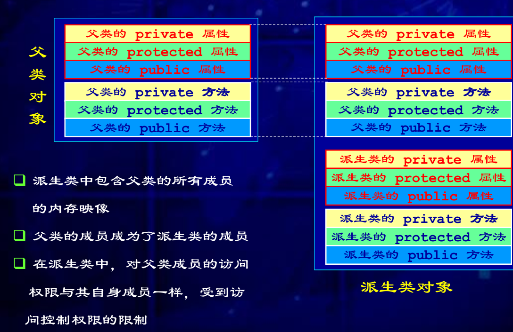
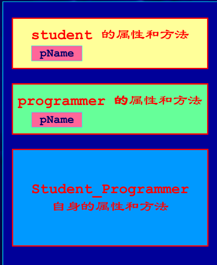

*People say love can be developed, but in the end the only person they love is themselves, that's why you choose to love someone who can please you the most.*——*Nana*

当类之间存在层次结构，并且类之间是通过继承关联时，就会用到多态。

# C++ 继承与派生

* 保持已有类的特性而构造新类的过程称为继承
* 在已有类的基础上新增自己的特性而产生新类的过程称为派生
* 被继承的已有类称为基类（或父类）
* 派生出的新类称为派生类
  * 派生类将自动继承基类的所有特性（属性和方法）
  * 派生类可以定义新的特性（属性和方法）
  * 派生类可以对继承的方法定义新实现

派生是一个从抽象到具体的过程

## 目的

继承：实现代码重用，派生问题可以继承原有问题中具有普遍性的解决方法

派生：当新的问题出现，原有程序无法解决（或不能完全解决）时，需要对原有程序进行改造，具体解决新问题

## 继承中的特点

1. **public 继承：** 基类 public 成员，protected 成员，private 成员的访问属性在派生类中分别变成：public, protected, private
2. **protected 继承：** 基类 public 成员，protected 成员，private 成员的访问属性在派生类中分别变成：protected, protected, private
3. **private 继承：** 基类 public 成员，protected 成员，private 成员的访问属性在派生类中分别变成：private, private, private

无论哪种形式，有两点不被改变

1. private 成员只能被本类成员（类内）和友元访问，不能被派生类访问；
2. protected 成员可以被派生类访问。

## 单继承与多重继承

单继承：派生类只从一个基类派生

多重继承：派生类从多个基类派生，且能继承多个基类的所有的属性和行为成员

### 多重继承方式

```cpp
class A
{
public:
    void setA(int);
    void showA();
    ...;
};
class B
{
public:
    void setB(int);
    void showB();
    ...
};
class C : public A, private B
{
public:
    void setC(int a, int b);
    void showC();
    ...
};
```

即类似如下的继承方式：

```cpp
class 派生类名：继承方式1  基类名1，
		继承方式2  基类名2，
		...
```

## 派生类的构造函数

基类的构造函数不被直接继承成为派生类的构造函数，派生类中需要声明自己的构造函数

两个初始化：

* 需要对本类中新增成员进行初始化
* 对继承的基类成员的初始化（使用基类构造函数）/重新初始化

```cpp
派生类名::派生类名(参数表) ; 基类名1(参数表1),基类名2(参数表2),... 成员1(参数表),成员2(参数表),...
{
    成员的初始化；
}

```

调用基类构造函数，调用顺序按照它们被继承时声明的顺序（从左向右）

调用成员对象的构造函数，调用顺序按照它们在类中声明的顺序

析构函数的调用次序与构造函数相反，一般情况下是隐式调用

## 同名隐藏规则

当派生类与基类中有相同成员时：

* 若未加限定，则通过派生类对象访问的是派生类中的同名成员
* 如要通过派生类对象访问基类中被覆盖的同名成员，应使用基类名限定

## 类继承对象的内存映像

派生类继承了父类的所有方法和属性



### 多重继承

派生类将继承和拥有所有父类的属性和方法：



#### 多义性

在多重继承时，基类之间出现同名成员时，将出现访问时的二义性（不确定性），二义性将导致编译器报错

```cpp
char *Student_Programmer::GetName()
{
    return Student::pName;
    //
    或者：
    //  return Programmer::pName;
}
```

必须加类限定符“::”，以消除二义性。

当派生类从多个基类派生，而这些基类又从同一个基类派生，则在访问此共同基类中的成员时，将产生二义性——采用虚基类来解决

# 多态性

发出同样的消息被不同类型的对象接收时有可能导致完全不同的行为

## 重载

### 重载运算符

两种方法：

1. 将操作符重载为类成员函数
   * 操作符函数是类成员函数
2. 重载为友元函数
   * 操作符函数是类的友元函数
   * 若操作符函数只访问类中的public 成员，则无须是友元

### 类成员重载

#### 形式

```cpp
函数类型 operator 运算符（形参）
{
 ......
}
```

* 重载为类成员函数时
  * 参数个数= 原操作数个数-1（后置++、--除外）
  * 其中第一个本应需要的操作数是自己
* 重载为友元函数时
  * 参数个数= 原操作数个数
  * 且至少应该有一个是自定义类型的形参

```cpp
// 友元函数方法可以需要两个参数（左右操作数）
    friend matrix operator+(const matrix &m1, const matrix &m2)
    {
        if (m1.rows != m2.rows || m1.lines != m2.lines)
        {
            std::cout << "矩阵大小不同，无法相加" << std::endl;
            return matrix(m1);
        }
        matrix m3(m1.rows, m1.lines);
        for (int i = 0; i < m1.rows; i++)
        {
            for (int j = 0; j < m1.lines; j++)
            {
                m3.matri[i][j] = m1.matri[i][j] + m2.matri[i][j];
            }
        }
        return m3;
    }

    matrix operator-(const matrix &m1)
    {
        if (rows != m1.rows || lines != m1.lines)
        {
            std::cout << "矩阵大小不同，无法相减" << std::endl;
            return matrix(*this);
        }
        matrix m3(rows, lines);
        for (int i = 0; i < rows; i++)
        {
            for (int j = 0; j < lines; j++)
            {
                m3.matri[i][j] = matri[i][j] - m1.matri[i][j];
            }
        }
        return m3;
    }
```

#### 设计细节

##### 二元运算符（以a+b为例）

被重载为A 类的一个成员函数A::operator+(Typeb)

那么a+b相当于

```cpp
a.A::operator+(b)
```

##### 前置一元运算符（+a -a ++a --a 等）

前置符号*，*a相当于：

```cpp
a.A::operator*()
```

##### 后置一元运算符++和--

本来可以进行相同声明，但是为了区分，可能会在传入参数中添加数据类型，如：

```cpp
a.A::operator--(0)
ReturnType operator++(int);
```

前置和后置的对比如下：

```cpp
// 前置++重载
complex& operator++() {
    // 先增加
    real++;
    // 然后返回自身引用
    return *this;
}

// 后置++重载
complex operator++(int) {
    // 保存当前状态
    complex temp = *this;
    // 增加
    real++;
    // 返回原始状态的副本
    return temp;
}
```

##### 在operator=中检查给自己赋值的情况

效率：若在赋值运算符函数体的首部检测到是给自己赋值，就可以立即返回，从而可以节省大量的工作

```cpp
class x
{
    ...
};
x a;
a = a;
// a赋值给自己，它完全合法
a = b; // 如果b是a的另一个名字（例如，已被初始化
// 为a的引用），那这也是对自己赋值
class string
{
public:
    string(const char *value);
    ~string();
    ... string &operator=(const string &rhs);

private:
    char *data;
};
```

保证正确性：一个赋值运算符必须首先释放掉一个对象的资源（去掉旧值），然后根据新值分配新的资源。在自己给自己赋值的情况下，释放旧的资源将是灾难性的，因为在分配新的资源时会需要旧的资源

```cpp
string &string::operator=(const string &rhs)
{
    delete[] data;
    // delete old memory
    // 分配新内存，将rhs的值拷贝给它
    data = new char[strlen(rhs.data) + 1];
    strcpy(data, rhs.data);
    return *this;
}
string a = "hello";
a = a;// same as a.operator=(a)
*this data-- -- -- -- -- --> "hello\0" //rhs data-- --赋值运算符做的第一件事是用delete删除data，其结果
*this data-- -- -- -- -- -->? ? ? //rhs data-- --当赋值运算符对rhs.data调用strlen时，结果无法确定
```

##### 为需要动态分配内存的类声明一个拷贝构造函数和一个赋值操作符？？？

只要类里有指针时，就要写自己版本的拷贝构造函数和赋值操作符函数！

### 友元函数重载

* 二元运算符（+/*-等）重载
  * a + b 等同于 `operator+ (a, b)`
* 前置一元运算符（+ -++ --等）重载
  * ++a 等同于 `operator++(a)`
* 后置单目运算符(++和--)重载
  * a++ 等同于 `operator++ (a,0 )`

```
//二元运算
complex operator+(complex c1, complex c2)
{
    c1.real += c2.real;
    c1.imag += c2.imag;
    return c1;
}

class A
{
    // 声明友元函数
    friend A operator++(A &obj);       // 前置++
    friend A operator++(A &obj, int);  // 后置++

private:
    void Display();
    int x;
};

// 实现前置++
A operator++(A &obj)
{
    // 先增加
    obj.x++;
    // 返回修改后的对象
    return obj;
}

// 实现后置++
A operator++(A &obj, int)
{
    // 保存当前状态
    A temp = obj;
    // 增加
    obj.x++;
    // 返回操作前的对象副本
    return temp;
}

```

## 静态绑定与动态绑定

绑定（联编）：程序自身彼此关联的过程，确定程序中的操作调用与执行该操作的代码间的关系

* 静态联编：联编工作出现在编译阶段，用对象名或者类名来限定要调用的函数
  * 由编译程序在编译时确定调用特定类的特定方法
  * 效率高，但灵活性差
* 动态联编：联编工作在程序运行时执行，在程序运行时才确定将要调用的函数
  * 编译程序在编译时无法确定调用哪一个类的方法，这种情况下，需要在运行时动态地确定具体调用哪一个类的方法
  * 灵活性好、高度的抽象性，但需要额外的运行开销

## 虚函数

* 在基类中声明一个函数为虚函数，使用关键字 `virtual`。
* 具有继承性，基类中声明了虚函数，派生类中无论是否说明，同原型函数都自动为虚函数。
* 派生类可以重写（override）这个虚函数。
* 调用虚函数时，会根据对象的实际类型来决定调用哪个版本的函数。

虚函数实际上是作为继承类的一个备用声明，继承类可以改写并调用该函数，不过是新的声明

```cpp
// 基类 Animal
class Animal {
public:
    // 虚函数 sound，为不同的动物发声提供接口
    virtual void sound() const {
        cout << "Animal makes a sound" << endl;
    }
   
    // 虚析构函数确保子类对象被正确析构
    virtual ~Animal() {
        cout << "Animal destroyed" << endl;
    }
};

// 派生类 Dog，继承自 Animal
class Dog : public Animal {
public:
    // 重写 sound 方法
    void sound() const override {
        cout << "Dog barks" << endl;
    }
   
    ~Dog() {
        cout << "Dog destroyed" << endl;
    }
};
```

其中有一个重点是，对virtual声明的函数在子类中需要override声明，但是在同一个类中依旧可以再一次重载：

```cpp
double area() override
    {
        return M_PI * radius * radius;
    }
    double area(int r) const
    {
        return M_PI * r * r;
    }
```

其中重写的函数部分声明也需要与继承类中的一致（不能一个const一个不const）

不过需要注意的是，**当析构函数被虚化后，继承类的析构将要递归析构**

```
animalPtr = new Dog();
animalPtr->sound();  // 调用 Dog 的 sound 方法
delete animalPtr;    // 释放内存，调用 Dog 和 Animal 的析构函数
#结果如下
Dog barks
Dog destroyed
Animal destroyed
```

### 纯虚函数

纯虚函数是没有实现的虚函数，在基类中用 **= 0** 来声明。

```
class Shape {
public:
    virtual int area() = 0;  // 纯虚函数，强制子类实现此方法
};
```

## 动态绑定

在一个多态的场景下，基类指针可以指向派生类对象，当通过基类指针调用一个虚函数时，实际调用的是派生类中重写的那个函数

官方文档如下：

* 也称为晚期绑定（Late Binding），在运行时确定函数调用的具体实现。
* 需要使用指向基类的指针或引用来调用虚函数，编译器在运行时根据对象的实际类型来决定调用哪个函数。

```
// 函数接受基类引用
void letAnimalMakeSound(const Animal& animal) {
    // 动态绑定: 根据实际对象类型调用相应的函数
    animal.makeSound();
}

int main()
{
    std::cout << "\n通过基类引用调用 (动态绑定):" << std::endl;
    letAnimalMakeSound(animal);  // 输出: 动物发出声音
    letAnimalMakeSound(dog);     // 输出: 汪汪汪!  (动态绑定!)
    letAnimalMakeSound(cat);     // 输出: 喵喵喵~  (动态绑定!)
  
    std::cout << "\n通过基类指针调用 (动态绑定):" << std::endl;
    Animal* animalPtr = &animal;
    animalPtr->makeSound();      // 输出: 动物发出声音
}
```
