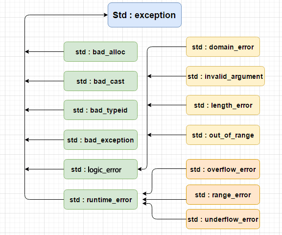

*First you must decide, then you must follow through. I believe that’s the only way you can get anything accomplished.*——*Mobile Suit Gundam SEED*

异常是程序在执行期间产生的问题。C++ 异常是指在程序运行时发生的特殊情况，比如尝试除以零的操作

异常提供了一种转移程序控制权的方式。C++ 异常处理涉及到三个关键字： **try、catch、throw** 。

* **throw:** 当问题出现时，程序会抛出一个异常。这是通过使用 **throw** 关键字来完成的。
* **catch:** 在您想要处理问题的地方，通过异常处理程序捕获异常。**catch** 关键字用于捕获异常。
* **try:** **try** 块中的代码标识将被激活的特定异常。它后面通常跟着一个或多个 **catch** 块

如果有一个块抛出一个异常，捕获异常的方法会使用 **try** 和 **catch** 关键字，格式如下

```cpp
try
{
   // 保护代码
}catch( ExceptionName e1 )
{
   // catch 块
}catch( ExceptionName e2 )
{
   // catch 块
}catch( ExceptionName eN )
{
   // catch 块
}
```

# 抛出异常 throw

**throw** 语句在代码块中的任何地方抛出异常。throw 语句的操作数可以是任意的表达式，表达式的结果的类型决定了抛出的异常的类型。

```cpp
double division(int a, int b)
{
   if( b == 0 )
   {
      throw "Division by zero condition!";
   }
   return (a/b);
}
```

# 捕获异常 catch

**catch** 块跟在 **try** 块后面，用于捕获异常。try 块中放置可能抛出异常的代码，try 块中的代码被称为保护代码。

```cpp
try
{
   // 保护代码
}catch( ExceptionName e )
{
  // 处理 ExceptionName 异常的代码
}
```

上面的代码会捕获一个类型为 **ExceptionName** 的异常，catch只能捕获与其相同类型的throw异常

# c++标准异常

C++ 提供了一系列标准的异常，定义在 **`<exception>`** 中，以父子类层次结构组织起来的，如下所示：



以下为说明：

| 异常                         | 描述                                                                      |
| ---------------------------- | ------------------------------------------------------------------------- |
| **std::exception**     | 该异常是所有标准 C++ 异常的父类。                                         |
| std::bad_alloc               | 该异常可以通过**new** 抛出。                                        |
| std::bad_cast                | 该异常可以通过**dynamic_cast** 抛出。                               |
| std::bad_typeid              | 该异常可以通过**typeid** 抛出。                                     |
| std::bad_exception           | 这在处理 C++ 程序中无法预期的异常时非常有用。                             |
| **std::logic_error**   | 理论上可以通过读取代码来检测到的异常。                                    |
| std::domain_error            | 当使用了一个无效的数学域时，会抛出该异常。                                |
| std::invalid_argument        | 当使用了无效的参数时，会抛出该异常。                                      |
| std::length_error            | 当创建了太长的 std::string 时，会抛出该异常。                             |
| std::out_of_range            | 该异常可以通过方法抛出，例如 std::vector 和 std::bitset<>::operator[]()。 |
| **std::runtime_error** | 理论上不可以通过读取代码来检测到的异常。                                  |
| std::overflow_error          | 当发生数学上溢时，会抛出该异常。                                          |
| std::range_error             | 当尝试存储超出范围的值时，会抛出该异常。                                  |
| std::underflow_error         | 当发生数学下溢时，会抛出该异常。                                          |

# 定义新的异常

同样的，我们也可以通过继承和重载 **exception** 类来定义新的异常

```cpp
#include <iostream>
#include <exception>
using namespace std;
 
struct MyException : public exception
{
  const char * what () const throw ()
  {
    return "C++ Exception";
  }
};

struct exception : public exception//不能重载类只能重载函数和运算符
```
