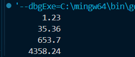
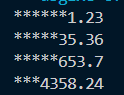
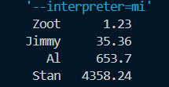

*Agh, it penetrates my brain!*——*Yu Yu Hakusho*

# C++ **文件和流**

当程序与外界环境进行信息交换时，存在着两个对象，一个是程序中的流对象，另一个是文件对象

流是一种抽象，它负责在数据的生产者和数据的消费者之间建立联系，并管理数据的流动

# 流

## 输出流

### ostream

ostream定义了以下三种输出流对象：

* `cout` 标准输出
* `cerr` 标准错误输出，没有缓冲，发送给它的内容立即被输出。
* `clog` 类似于 `cerr`，但是有缓冲，缓冲区满时被输出

#### 插入运算符 `<<`

用于将数据转换成输出字节串的形式，传送到一个输出流对象

#### 控制输出流格式

##### 控制输出宽度

setw和width都可以，都是指定当前项的末尾应该在对应的位置，如果字符数量超过所给长度就会失效

###### width示例

```cpp
#include <iostream>
using namespace std;
int main()
{
    double values[] = {1.23, 35.36, 653.7, 4358.24};
    for (int i = 0; i < 4; i++)
    {
        cout.width(10);
        cout << values[i] << '\n';
    }
}
```

输出结果如下：



这里默认的填充是空格符，也可以设置 `cout.fill("*")`来控制填充的符号为”*”

```cpp
cout.width(10);
cout.fill('*');
cout<<values[i]<<'\n';
```

那么输出就会变成



###### setw示例

```cpp
#include <iostream>
#include <iomanip>
using namespace std;
int main()
{
    double values[] = {1.23, 35.36, 653.7, 4358.24};
    char *names[] = {"Zoot", "Jimmy", "Al", "Stan"};
    for (int i = 0; i < 4; i++)
    {
        cout << setw(6) << names[i];
        cout << setw(10) << values[i] << endl;
    }
}
```

输出如下：



### ofstream

ofstream 类支持磁盘文件输出

如果在构造函数中指定一个文件名，当构造这个文件时该文件是自动打开的

```cpp
ofstream myFile("filename",iosmode);
```

如同下文文件所示，当创建对象后就可以调用 `open()`函数了

#### ofstream成员函数

除了`open()`之外当然还有很多ofstream可以使用的函数

* `open()`
  * 把流与一个特定的磁盘文件关联起来
  * 需要指定打开模式
* `put()`
  * 把一个字符写到输出流中
* `write()`
  * 把内存中的一块内容写到一个输出文件流中
* `seekp() & tellp()`
  * 操作文件流的内部指针
* `close()`
  * 关闭与一个输出文件流关联的磁盘文件
* 错误处理函数
  * 在写到一个流时进行错误处理
* `<<`插入操作符

## 输入流

### istream

最适合用于顺序文本模式输入

`cin` 是预定义的标准输入对象

### ifstream

与ofstream一样，依旧可以在构造该对象时该文件便自动打开

```cpp
ifstream myFile("filename",iosmode);
```

不过其成员函数有所差异：

```cpp
open（）get（）getline（）read（）seekg（）tellg（）close（）
```


# 文件

## 打开文件

**ofstream** 和 **fstream** 对象都可以用来打开文件进行写操作，如果只需要打开文件进行读操作，则使用 **ifstream** 对象。

```cpp
void open(const char *filename, ios::openmode mode);
```

下面是 open() 函数的标准语法，open() 函数是 fstream、ifstream 和 ofstream 对象的一个成员。

| 模式标志   | 描述                                                                   |
| ---------- | ---------------------------------------------------------------------- |
| ios::app   | 追加模式。所有写入都追加到文件末尾。                                   |
| ios::ate   | 文件打开后定位到文件末尾。                                             |
| ios::in    | 打开文件用于读取。                                                     |
| ios::out   | 打开文件用于写入。                                                     |
| ios::trunc | 如果该文件已经存在，其内容将在打开文件之前被截断，即把文件长度设为 0。 |

以上模式也可以多个同时使用：

```cpp
ofstream outfile;
outfile.open("file.dat", ios::out | ios::trunc );
```

## 关闭文件

```cpp
void close();
```

## 写入/读取文件

```cpp
#include <fstream>
#include <iostream>


   char data[100];
// 以写模式打开文件
   ofstream outfile;
   outfile.open("afile.dat");
   cin.getline(data, 100);
// 向文件写入用户输入的数据
   outfile << data << endl;

// 以读模式打开文件
   ifstream infile; 
   infile.open("afile.dat"); 
```

## 文件位置指针

文件位置指针是一个整数值，指定了从文件的起始位置到指针所在位置的字节数。

**istream** 和 **ostream** 都提供了用于重新定位文件位置指针的成员函数。这些成员函数包括关于 istream 的  **seekg** （"seek get"）和关于 ostream 的  **seekp** （"seek put"）。

seekg 和 seekp 的参数通常是一个长整型。第二个参数可以用于指定查找方向。查找方向可以是  **ios::beg** （默认的，从流的开头开始定位），也可以是  **ios::cur** （从流的当前位置开始定位），也可以是  **ios::end** （从流的末尾开始定位）。

```cpp
// 定位到 fileObject 的第 n 个字节（假设是 ios::beg）
fileObject.seekg( n );
 
// 把文件的读指针从 fileObject 当前位置向后移 n 个字节
fileObject.seekg( n, ios::cur );
 
// 把文件的读指针从 fileObject 末尾往回移 n 个字节
fileObject.seekg( n, ios::end );
 
// 定位到 fileObject 的末尾
fileObject.seekg( 0, ios::end );
```
