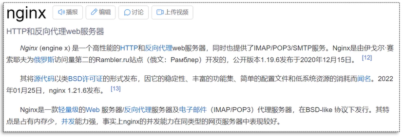
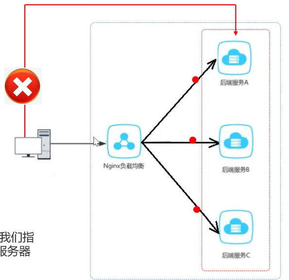
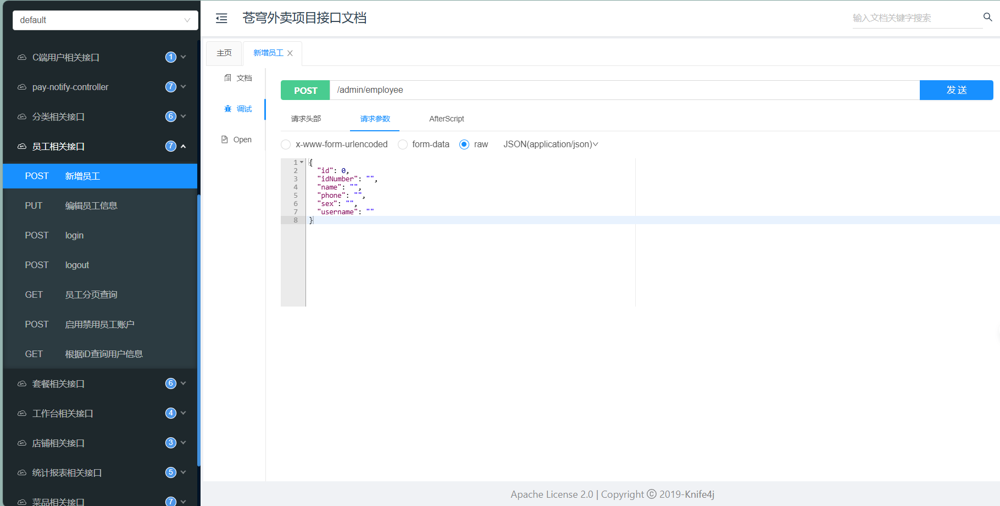

111

# 开发环境

## 后端环境搭建


| 序号 | 名称         | 说明                                                          |
| ---- | ------------ | ------------------------------------------------------------- |
| 1    | sky-take-out | maven父工程，统一管理依赖版本，聚合其他子模块                 |
| 2    | sky-common   | 子模块，存放公共类，例如：工具类、常量类、异常类等            |
| 3    | sky-pojo     | 子模块，存放实体类、VO、DTO等                                 |
| 4    | sky-server   | 子模块，后端服务，存放配置文件、Controller、Service、Mapper等 |

* sky-common 子模块中存放的是一些公共类，可以供其他模块使用
* sky-pojo 子模块中存放的是一些 entity、DTO、VO
* sky-server 子模块中存放的是 配置文件、配置类、拦截器、controller、service、mapper、启动类等

| 名称   | 说明                                                   |
| ------ | ------------------------------------------------------ |
| Entity | 实体，通常和数据库中的表对应                           |
| DTO    | 数据传输对象，通常用于程序中各层之间传递数据           |
| VO     | 视图对象，为前端展示数据提供的对象                     |
| POJO   | 普通Java对象，只有属性和对应的 `getter`和 `setter` |

## 前后端联调(nginx)

nginx 反向代理，就是**将前端发送的动态请求由 nginx 转发到后端服务器**




nginx 反向代理的好处：

- 提高访问速度
- 进行负载均衡
- 保证后端服务安全

所谓**负载均衡**，就是把大量的请求按照我们指定的方式均衡的分配给集群中的每台服务器



### 反向代理配置方式

nginx 反向代理的配置方式：（以下内容均在nginx.config中配置）

```nginx
server {
    listen 80;
    server_name localhost;

    location /api/ {
        proxy_pass http://localhost:8080/admin/; # 反向代理
    }
}
```

### 负载均衡配置方式

nginx 负载均衡的配置方式：

```nginx
upstream webservers {
    server 192.168.100.128:8080;
    server 192.168.100.129:8080;
}

server {
    listen 80;
    server_name localhost;

    location /api/ {
        proxy_pass http://webservers/admin/; # 负载均衡
    }
}
```

#### 配置策略

当服务器硬件配置不一样时，我们应该采取更灵活的负载均衡方式

| 名称       | 说明                                                   |
| ---------- | ------------------------------------------------------ |
| 轮询       | 默认方式                                               |
| weight     | 权重方式，默认为1，权重越高，被分配的客户端请求就越多  |
| ip_hash    | 依据ip分配方式，这样每个访客可以固定访问一个后端服务   |
| least_conn | 依据最少连接方式，把请求优先分配给连接数少的后端服务   |
| url_hash   | 依据url分配方式，这样相同的url会被分配到同一个后端服务 |
| fair       | 依据响应时间方式，响应时间短的服务将会被优先分配       |

示例：

```nginx
upstream myserver {
    server 127.0.0.1:8080 weight=90;
    #server 127.0.0.1:8088 weight=10;
}
```

## 数据库MD5加密

### 登录功能

1. 修改数据库中明文密码，改为MD5加密后的密文
2. 修改Java代码，前端提交的密码进行MD5加密后再跟数据库中密码比对

```java
// 进行md5加密，然后再进行比对
password = DigestUtils.md5DigestAsHex(password.getBytes());
if (!password.equals(employee.getPassword())) {
    // 密码错误
    throw new PasswordErrorException(MessageConstant.PASSWORD_ERROR);
}
```

### 添加员工

设置密码时调用加密功能

```java
//设置密码，默认密码123456
employee.setPassword(DigestUtils.md5DigestAsHex(PasswordConstant.DEFAULT_PASSWORD.getBytes()));
```

### 更新员工

```java
@Override
    public void update(EmployeeDTO employeeDTO) {
        Employee employee = new Employee();
        BeanUtils.copyProperties(employeeDTO, employee);

//        // 如果包含密码字段，需要进行MD5加密
//        if (employee.getPassword() != null && !employee.getPassword().isEmpty()) {
//            employee.setPassword(DigestUtils.md5DigestAsHex(employee.getPassword().getBytes()));
//        }

        employee.setUpdateTime(LocalDateTime.now());
        employee.setUpdateUser(BaseContext.getCurrentId());
        employeeMapper.update(employee);
    }
```

## Swagger 辅助接口文档

在WebMvcConfiguration.java这一个文件中，除了拦截器intercepter的注册之外，还有这一文档的声明和初始化，辅助整个项目接口的开发：



我们先从接口注解开始了解

### 常用注解

通过注解可以控制生成的接口文档，使接口文档拥有更好的可读性，常用注解如下:

| 注解                  | 说明                                                        |
| --------------------- | ----------------------------------------------------------- |
| `@Api`              | 用在类上，例如 `Controller`，表示对类的说明               |
| `@ApiModel`         | 用在类上，例如 `Entity`、`DTO`、`VO`                  |
| `@ApiModelProperty` | 用在属性上，描述属性信息                                    |
| `@ApiOperation`     | 用在方法上，例如 `Controller`的方法，说明方法的用途、作用 |

在对应controller类开头声明@Api：

```java
@RestController
@RequestMapping("/admin/employee")
@Slf4j
@Api(tags = "员工相关接口")
public class EmployeeController {
}
```

就会有：


同理，甚至可以使用@ApiOperation代替注释？

```java
/**
     * 新增员工
     * @param employeeDTO
     * @return
     */
    @PostMapping
    @ApiOperation("新增员工")
    public Result save(@RequestBody EmployeeDTO employeeDTO) {
        log.info("新增员工：{}",employeeDTO);
        employeeService.save(employeeDTO);
        return Result.success();
    }

    /**
     * 员工分页查询
     * @param employeePageQueryDTO
     * @return
     */
    @GetMapping("/page")
    @ApiOperation("员工分页查询")
    public Result<PageResult> page(EmployeePageQueryDTO employeePageQueryDTO) {
        log.info("员工分页查询，参数为：{}", employeePageQueryDTO);
        PageResult pageResult = employeeService.pageQuery(employeePageQueryDTO);
        return Result.success(pageResult);
    }
```

# 员工开发

## 员工认证

### 代码完善

后续请求中，前端会携带JWT令牌，通过JWT令牌可以解析出当前登录员工id：

```java
//1、从请求头中获取令牌
String token = request.getHeader(jwtProperties.getAdminTokenName());
//2、校验令牌
try {
    Claims claims = JwtUtil.parseJWT(jwtProperties.getAdminSecretKey(), token);
    Long empId = Long.valueOf(claims.get(JwtClaimsConstant.EMP_ID).toString());
    //3、通过，放行
    return true;
} catch (Exception ex) {
    //4、不通过，响应401状态码
    response.setStatus(401);
    return false;
}
```

（类为 `JwtTokenAdminInterceptor`）

如代码所示，我们并没有在拦截器中调用service的方法，那么解析出登录员工id后，如何传递给Service的save方法？

#### ThreadLocal

这里我们引入ThreadLocal方法

* ThreadLocal 并不是一个Thread，而是Thread的局部变量。
* ThreadLocal为每个线程提供单独一份存储空间，具有线程隔离的效果，只有在线程内才能获取到对应的值，线程外则不能访问。

在校验令牌时，我们有这样一个 `BaseContext`方法：

```java
try {
            log.info("jwt校验:{}", token);
            Claims claims = JwtUtil.parseJWT(jwtProperties.getAdminSecretKey(), token);
            Long empId = Long.valueOf(claims.get(JwtClaimsConstant.EMP_ID).toString());
            log.info("当前员工id：", empId);

//            将用户id存储到ThreadLocal
	BaseContext.setCurrentId(empId);

            //3、通过，放行
return true;
        } catch (Exception ex) {
            //4、不通过，响应401状态码
response.setStatus(401);
            return false;
        }
```

在BaseContext中有这样的定义，专门声明了一个ThreadLocal用来处理单个线程：

```java
package com.sky.context;

public class BaseContext {

    public static ThreadLocal<Long> threadLocal = new ThreadLocal<>();

    public static void setCurrentId(Long id) {
        threadLocal.set(id);
    }

    public static Long getCurrentId() {
        return threadLocal.get();
    }

    public static void removeCurrentId() {
        threadLocal.remove();
    }

}
```

那么在插入员工信息中就可以根据相同的ThreadLocal进行员工信息的提取

```java
//        通过ThreadLocal获取用户信息
        Long currentId = BaseContext.getCurrentId();

        //设置当前记录创建人id和修改人id
        // TODO 改为用户动态ID
        employee.setCreateUser(currentId);//目前写个假数据，后期修改
        employee.setUpdateUser(currentId);
```
