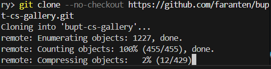
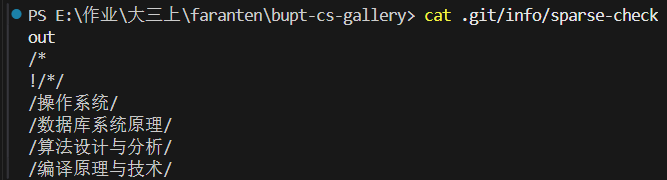
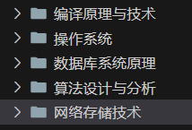

面对多次大型项目，结果又忘记了刚开始是怎么做的，实在顶不住了——

# git sparse-checkout 稀疏检出

## 标准查询

### 第一步：添加 `--no-checkout` 参数

这个参数告诉Git： **“克隆历史，但不要将任何文件检出到工作目录”** 。这样，我们本地只下载了 `.git` 目录，包含了所有的历史记录，但工作区是空的。

```bash
git clone --no-checkout https://github.com/faranten/bupt-cs-gallery.git
```

这里的重点在于压缩，即便如此，它也要压缩很久：


### 第二步：进入目录并启用稀疏检出

现在，我们进入新创建的 `bupt-cs-gallery` 目录，并启用稀疏检出模式。

```bash
cd bupt-cs-gallery
git sparse-checkout init
```

执行 `git sparse-checkout init` 后，Git 会在 `.git/info/sparse-checkout` 文件中创建一个默认的规则，但目前工作区仍然是空的。

### 第三步：添加需要克隆的路径

现在是关键的一步，我们需要告诉Git我们想要哪个子目录。你提供的路径是 `网络存储技术`，这个文件夹的中文名需要被正确处理。**在稀疏检出中，需要使用与仓库中完全匹配的路径。**

```bash
git sparse-checkout set "网络存储技术"
```

这条命令会把 `网络存储技术` 文件夹添加到 `.git/info/sparse-checkout` 配置文件中。注意，如果路径中含有空格或特殊字符，最好用引号引起来。

### 第四步：完成检出

最后，执行 `git checkout` 命令来完成检出。Git会根据你在稀疏检出中设置的路径，只将 `网络存储技术` 文件夹下的内容拉取到你的本地工作区。

```bash
git checkout main
```

**完整的操作流程如下：**

```bash
# 克隆仓库，但不要检出任何文件
git clone --no-checkout https://github.com/faranten/bupt-cs-gallery.git

# 进入目录
cd bupt-cs-gallery

# 初始化稀疏检出
git sparse-checkout init

# 设置你需要克隆的子目录
git sparse-checkout set "网络存储技术"

# 检出主分支，只拉取你设置的子目录下的文件
git checkout main
```

## 查询历史/仓库已有sparse

Git并没有一个专门的“历史记录”命令，但你可以通过查看其配置文件来获取当前正在生效的规则。

我上一次已经尝试过内容，因此可以通过 `.git/info/sparse-checkout`路径下这一文件，来查看之前的内容

> 因为该文件是无文本内容，需要使用文本编辑器查看
>
> 当然也可以直接使用 `cat`命令

```bash
# 使用 cat 命令查看配置文件内容
cat .git/info/sparse-checkout
```



## 添加新内容

首先我们要区分之前的 `set`命令和 `add`命令之间的区别

* **`git sparse-checkout set <路径1> <路径2> ...`** ：这个命令会**重置**或**覆盖** `.git/info/sparse-checkout` 文件中的所有路径。它会清空原有列表，然后用你新提供的路径来填充。如果你直接用这个命令添加 `网络存储技术`，你之前检出的所有目录（如 `操作系统`）都会被移除。
* **`git sparse-checkout add <新路径1> <新路径2> ...`** ：这个命令的作用是**在原有路径列表的基础上，追加**你提供的新路径。它不会影响你已经设置过的路径。

如果你想在这个基础上**添加**新的内容，比如 `网络存储技术`，而不是覆盖掉之前的记录，你需要使用 `git sparse-checkout add` 命令。

```bash
# 添加新的稀疏检出路径
git sparse-checkout add "网络存储技术"
```

执行这条命令后，Git 会自动将 `"网络存储技术"` 这个路径添加到 `.git/info/sparse-checkout` 文件中，并且将该目录下的文件同步到你的本地工作区。

我们可以直接在工作区看到需要的文件：


