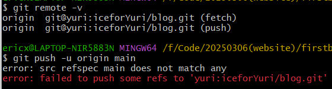
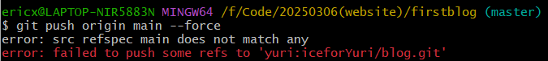
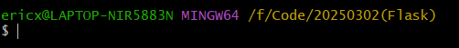

*The more painful the memories one recollects, the better the laughter.*——*Spice and Wolf*

## 20250306

今天使用 v0 创建一个新的网页时，尝试将网站 code 拉下来再上传到 git 仓库中时，遇到一些奇怪的东西，这也是将来需要注意的

一开始的操作都比较正常，错误都是之前经验能够解决的知道在最后一步push时遇到



反复确认仓库名字与ssh连接无果后，就连强制推送也没办法



我开始怀疑是url问题，但是ssh连接都没有问题，那上哪去找url问题，难道我上次配置的ssh就坏了？

直到chatgpt让我检查分支问题，我才意识到这种项目已经帮你做好分支了，我说怎么一开始的初始化失败

但是其实在git bash中每一行命令都在文件位置的结尾显示了分支名称（上图有示例），但是像没有初始化或挂分支的项目是不会显示的



### 解决方法

#### 检查 Git 本地分支是否正确

查看本地分支是否正确连接到远程仓库：

```
git branch -vv
```

如果 `main` 分支没有 tracking 远程 `origin/main`，需要手动设置：

```
git branch --set-upstream-to=origin/main main
git pull origin main --rebase
git push origin main
```

如果你当前在 `master` 而不是 `main`，可以检查远程是否是 `master`：

```
git branch -a
```

如果两边分支名称一致，那应该修改推送命令为：

```
git push origin <_name> #分支名
git push origin master
```


#### 检查本地仓库是否干净

如果你的 Git 记录出了问题，可以尝试 `git status`：

```
git status
```

如果有未提交的更改或冲突，先提交：

```
git add .
git commit -m "Fix conflicts"
```

然后再尝试推送

如果 `git status` 显示 `You have unstaged changes` 或 `Your branch is ahead of 'origin/main' by X commits.`，你可以尝试

**重置本地分支** ：

```
git reset --hard origin/main
git pull origin main
git push origin main
```

不过需要注意的是，`git reset --hard` 会丢失所有未提交的更改，这种操作还不如重新打开一个文件夹重建项目
