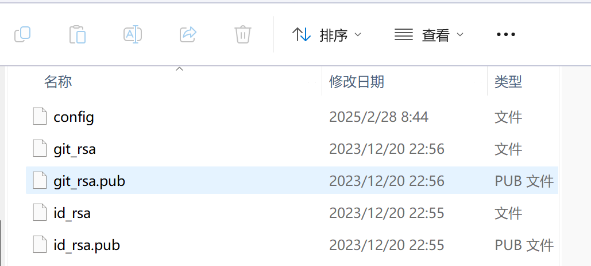
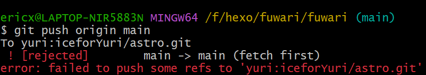

上一次搞了好久，这一次决定从根本上解决问题

为了给电脑添加账号，得从ssh入手，意思就是还要为第二个账号配备ssh密钥

首先我们需要在C:/Users/你的用户名/.ssh/找到.ssh这个文件夹，里面应该会有上一次生成的密钥之类的数据



如果没有，按照以下命令创建.ssh文件夹，配置ssh密钥之后也会自动生成的

### **在 `.ssh` 目录中生成 SSH 密钥（我们此时已经在.ssh文件夹中）**

在 `.ssh` 目录中，运行以下命令（注意 `-f` 后不使用 `~/.ssh/`）：

```
ssh-keygen -t rsa -b 4096 -C "your-second-email@example.com" -f id_rsa_second

```

* `id_rsa_second` 是新密钥的文件名，它会直接生成在当前目录（`.ssh/`）。
* `id_rsa_second`（私钥）和 `id_rsa_second.pub`（公钥）会出现在 `.ssh` 目录下。

我们可以修改id_rsa_second名称和邮箱作为自己的辨识

输完命令后系统会提示：

```
Enter passphrase (empty for no passphrase):

```

直接回车就行，不用设置密码

### **查看生成的 SSH 密钥**

执行以下命令，确认密钥已创建：

```
ls -la

```

成功的话会看到如下输出：

```
-rw-------  1 user user  3326 Feb 28 14:00 id_rsa_second
-rw-r--r--  1 user user   742 Feb 28 14:00 id_rsa_second.pub

```

但其实在文件夹下就可以看到新创建的文件


### **添加 SSH 密钥到 SSH 代理**

确保 SSH 代理正在运行：

```
eval "$(ssh-agent -s)"

```

可以使用以下命令检查当前 SSH 代理中已加载的密钥：

```
ssh-add -l

```

然后添加新/旧密钥：（保证所有的密钥都加入）

```
ssh-add id_rsa_second
ssh-add id_rsa

```

### 将公钥 (`id_rsa_second.pub`) 添加到 GitHub

1. 登录你的 **第二个 GitHub 账户**
1. 进入 **Settings -> SSH and GPG keys**
1. 点击 **New SSH key**
1. 粘贴 `id_rsa_second.pub` 的内容，并保存


### **配置 `.ssh/config` 以区分多个账户**

现在需要编辑 `~/.ssh/config` 文件，确保 Git 使用正确的 SSH 密钥

运行：

```
nano ~/.ssh/config

```

或者同样是进入.ssh文件夹下的config文件直接编辑

在文件中添加：

```
# 默认 GitHub 账户
Host github.com
    HostName github.com
    User git
    IdentityFile ~/.ssh/id_rsa

# 第二个 GitHub 账户
Host github-second
    HostName github.com
    User git
    IdentityFile ~/.ssh/id_rsa_second

```

* **第一个账户**的配置中，`Host` 是 `github.com`，因为这个配置会被默认用来连接 GitHub，`IdentityFile` 指定的是你为第一个账户生成的 SSH 密钥文件（`id_rsa`）。
* **第二个账户**的配置中，`Host` 是 `github-second`，`IdentityFile` 指定的是第二个账户的密钥文件（`id_rsa_second`）。`HostName` 仍然是 `github.com`，只是这里给它起了一个别名 `github-second`，这样当你使用第二个账户时，可以通过 `github-second` 来区分。

## 使用方法

### **测试 SSH 连接**

测试 ：

```
ssh -T git@github.com #第一个 GitHub 账户
ssh -T git@github-second #第二个 GitHub 账户
```

其中github-second正是在config中设置的用户名，也只有这一个用户名可以更改用来区分


### **克隆或修改远程仓库**

克隆属于第二个 GitHub 账户的仓库

```
git clone git@github-second:second-username/repository.git
```

切换到第二个账户

```
git remote set-url origin git@github-second:second-username/repository.git
```

就像我现在使用的第二个用户名yuri

```
git remote set-url origin git@yuri:second-username/repository.git

```

### 更新仓库

首先还是需要一次重新添加将更改过的文件加入本地仓库

```
git add <_file_name1> <_file_name2> ... #将文件添加到暂存区
git add <_dir_name>                     #将文件夹添加到暂存区
git add --all                           #将所有的改动过的文件提交到缓存区
git add .                               #将目录下的所有文件添加到暂存区
```

然后提交一次

```
git commit -m "日志信息" 
git commit <_file_name1> <_file_name2> ... -m "日志信息"    #提交暂存区内的部分文件
git commit -a   #无需执行git add,直接提交
```

本来一句 `git push origin main `可以在连接远程仓库之后直接推送上传，但如果本来的仓库不是空的，可能会造成一些版本冲突：



官方会建议你先pull之前的版本，尝试将它们与你的本地更改合并

```
git pull origin main
```

如果存在冲突，在拉取后，Git 会告诉你有哪些文件存在冲突，并标记出冲突的部分。

你可以打开这些文件并选择要保留的更改。解决冲突后，标记为已解决并提交更改：

```
git add <file>
git commit -m "Resolve merge conflicts"
```

解决所有冲突并提交后，再重新执行推送

但是还有可能还是冲突，这个时候就可以强制推送，将本地仓库的内容覆盖远程仓库

```
git push origin main --force
```
