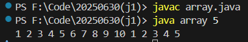

# 数组声明

java中支持两种数组的声明方式：

```java
dataType[] arrayRefVar;   // 首选的方法
 
或
 
dataType arrayRefVar[];  // 效果相同，但不是首选方法
```

建议使用 **dataType[] arrayRefVar** 的声明风格声明数组变量。 dataType arrayRefVar[] 风格是来自 C/C++ 语言 ，在Java中采用是为了让 C/C++ 程序员能够快速理解java语言。

例：

```java
int[] arr;
int arr[];
```

注意：与c/c++不同，声明中的 `[]`中不能填写数字来表示数组的大小，仅仅只表示该变量为一个数组引用。

# 创建数组

直接声明

```java
int[] array = { 1, 2, 3, 4, 5, 6, 7, 8, 9, 10 };
        for (int arr : array) {
            System.out.print(arr + " ");
        }
```

通过new操作来为类的实例和数组开辟空间

```java
int[] numbers = new int[arraysize];
        for (int i = 0; i < arraysize; i++) {
            numbers[i] = i + 1;
        }
        for (int i = 0; i < numbers.length; i++) {
            System.out.print(numbers[i] + " ");
        }
```

那么打印效果就是：




## java中引用的概念


在 Java 中：

> 引用（Reference）就是**指向对象在堆内存中的地址**的变量。

它不是对象本身，而是对象的“身份证” 或 “指针”（但不同于 C/C++ 的指针）。

举new分配空间为例：

```java
Person p = new Person();
```

* `new Person()`：在堆内存中创建了一个 `Person` 类型的对象。
* `p`：是一个引用，指向那个对象的内存地址。

当我们使用new操作时，它的返回值就是开辟空间的地址。所以我们通过一个引用变量来指向创建的空间，此时可以通过 `p` 可以访问该对象的属性或方法。

* 特点：
  * 引用变量存储的是对象的内存地址
  * 当我们将一个引用赋值给另一个引用时，其实是将对象的地址复制给了新的变量，此时两个引用指向同一个地址，如：`myClass obj2 = obj1`
  * 引用可以被赋值为 `null`，表示不引用任何对象

一个对象可以被多个引用指向，但是当一个对象没有任何引用指向时，它将成为垃圾，会在某个时刻被垃圾回收器回收。（java自带**自动垃圾回收机制（Garbage Collection, 简称 GC）** ）

引用本身也是一个变量，存储在栈内存中。

> **程序员不需要手动释放内存（不像 C/C++ 用 malloc/free）** ，而是由 **JVM 的垃圾回收器** 自动判断哪些对象不再被使用，并释放它们。


对于数组，可以通过访问 `arrayRefVar.length` 来获得数组的长度。需要注意的是，通过该成员获取的长度是数组的总长度，而非已经初始化元素的个数，如：

```java
class array1 {
    public static void main(String[] args) {
        int[] arrays = new int[5];
        arrays[0] = 1;
        arrays[1] = 2;
        arrays[2] = 3;
        System.out.println(arrays.length);
    }
}
```

此时输出结果依旧为 `5`


# 数组的增强处理

JDK1.5 引进了一种新的循环类型，被称为增强的for循环。（此事在 C++11 中亦有记载，被称为基础循环（好像是））

很显然，在遍历数组时，java编译器更加推荐你使用增强的for循环。

```java
for(type element: array)
{
    System.out.println(element);
}
```

该遍历方法类似python中数组的遍历方法，我们声明一个局部变量，用该变量来代替数组中每个元素，该局部变量的生命域只在for循环内。

以上述的例子为示范：

```java
int arraysize = Integer.parseInt(args[0]);
        int[] array = { 1, 2, 3, 4, 5, 6, 7, 8, 9, 10 };
        for (int arr : array) {
            System.out.print(arr + " ");
        }
```


# 二维数组

与c/c++中理解的多维数组相似，java中的二维数组也可以认为是一个对于一维数组的数组。

```java
String[][] str = new String[3][4];
```

同样可以单独给每一个二维指针分配单独不同的一维数组空间：

```java
String[][] s = new String[2][];
s[0] = new String[2];
s[1] = new String[3];
```


# Arrays 类

java.util.Arrays 类能方便地操作数组，它提供的所有方法都是静态的。

具有以下功能：

* 给数组赋值：通过 fill 方法。
* 对数组排序：通过 sort 方法,按升序。
* 比较数组：通过 equals 方法比较数组中元素值是否相等。
* 查找数组元素：通过 binarySearch 方法能对排序好的数组进行二分查找法操作。


具体说明请查看下表：

| 序号 | 方法和说明                                                                                                                                                                                                                                                                                                                                                  |
| ---- | ----------------------------------------------------------------------------------------------------------------------------------------------------------------------------------------------------------------------------------------------------------------------------------------------------------------------------------------------------------- |
| 1    | **public static int binarySearch(Object[] a, Object key)** ``用二分查找算法在给定数组中搜索给定值的对象(Byte,Int,double等)。数组在调用前必须排序好的。如果查找值包含在数组中，则返回搜索键的索引；否则返回 (-( *插入点* ) - 1)。                                                                                                                    |
| 2    | **public static boolean equals(long[] a, long[] a2)** ``如果两个指定的 long 型数组彼此 *相等* ，则返回 true。如果两个数组包含相同数量的元素，并且两个数组中的所有相应元素对都是相等的，则认为这两个数组是相等的。换句话说，如果两个数组以相同顺序包含相同的元素，则两个数组是相等的。同样的方法适用于所有的其他基本数据类型（Byte，short，Int等）。 |
| 3    | **public static void fill(int[] a, int val)** ``将指定的 int 值分配给指定 int 型数组指定范围中的每个元素。同样的方法适用于所有的其他基本数据类型（Byte，short，Int等）。                                                                                                                                                                              |
| 4    | **public static void sort(Object[] a)** ``对指定对象数组根据其元素的自然顺序进行升序排列。同样的方法适用于所有的其他基本数据类型（Byte，short，Int等）。                                                                                                                                                                                              |
