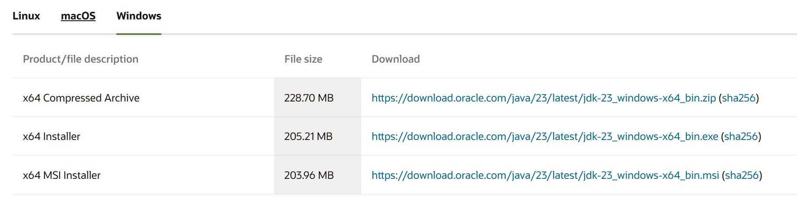
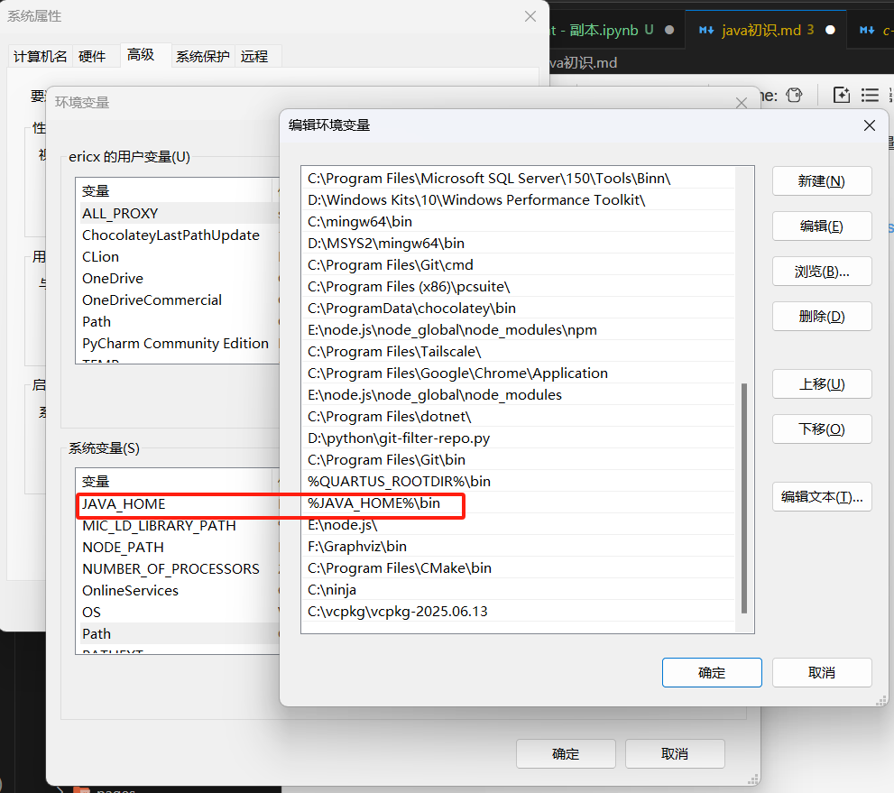
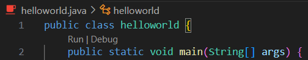
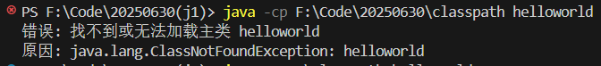
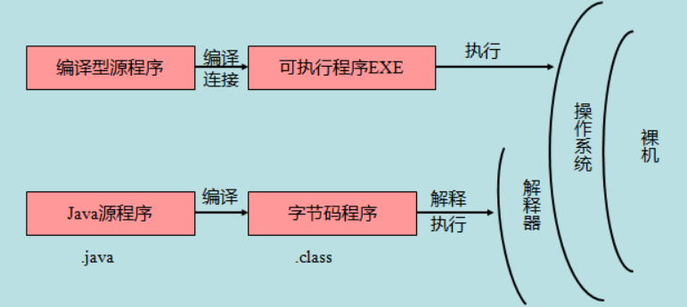

# 环境配置

1.官网下载JDK：[Java Downloads | Oracle 中国
](https://www.oracle.com/cn/java/technologies/downloads/)

在选择合适的版本安装之后，按例配置系统环境变量：



当然你也可以使用微软官方开发的拓展工具：[Microsoft PowerToys ](https://learn.microsoft.com/zh-cn/windows/powertoys/)

详细内容在ulna博客上：[Java入门](https://blog.ulna520.top/2025/01/15/java%E5%85%A5%E9%97%A8_20250115_094123/)

在接下来的手动编译运行时，命令如下：

```bash
javac HelloWorld.java
java HelloWorld
```

注意一定要先编译！

当然vscode中提供了代码内独立的类运行，支持对于单独一个函数功能的单独调试



具体尝试可以使用以下代码：

```java
public class HelloWorld {
    /* 第一个Java程序
     * 它将输出字符串 Hello World
     */
    public static void main(String[] args) {
        System.out.println("Hello World"); // 输出 Hello World
    }
}
```

# classpath

在运行java代码之前，我们需要先区分两个文件：

1. 编写java代码，存放在 `.java`文件中
2. 编译java代码为**字节码**，存放在 `.class` 文件中
3. JVM将.`class` 中的字节码加载到内存中，并且将字节码转化为对应平台的机器码

当我们直接使用 `javac`编译程序时会获得这两个文件


classpath环境变量用于告诉java解释器，应该在硬盘中的哪里加载 `.class`中的字节码，便于我们将所有编译生成的字节码与源代码分开放置，便于文件管理。

在终端执行.class程序时，通过参数 `-cp + 绝对路径` 来添加classpath参数



同样的，也可以使用相对路径来执行程序：

```bash
java -cp . helloworld
```

这里的 `.` 表示当前目录，是相对路径的写法

#### 字节码(Bytecode)

字节码是一种介于机器码于高级语言代码的中间表示形式，它是 Java 源代码（`.java` 文件）经过编译器（`javac`）编译后生成的机器无关的代码，存储在 `.class` 文件中。字节码是为 Java 虚拟机（JVM）设计的，而不是直接为任何具体硬件或操作系统服务。

这一特性使得java编译后的字节码，可以在任何一个装有JVM的机器上运行，无需考虑机器的处理架构，或处理器指令集不同等硬件层面不同，由JVM负责将字节码转化为机器对应的字节码，使得可以在任何平台上运行。

我们可以借此分辨Java源程序与编译型运行之间的区别：



通过引入字节码和 JVM，Java 实现了平台无关性，**开发者编写的代码可以在 Windows、macOS、Linux 等不同操作系统上运行，而无需为每个平台重新编译**。这与 C/C++ 等纯编译型语言形成鲜明对比，后者编译出的可执行文件是特定于其编译环境的。

这种架构也带来了性能上的权衡：Java 在启动时需要 JVM 加载和初始化，以及字节码解释或 JIT 编译的开销，这可能导致启动速度略慢于纯编译型语言。然而，随着 JIT 编译器技术的不断发展，Java 在长时间运行的应用中，其执行效率已经非常接近甚至在某些场景下超越了传统编译型语言。
