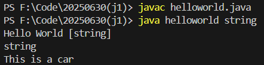
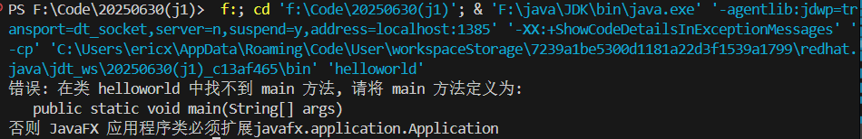
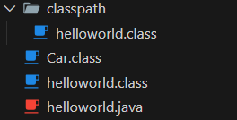
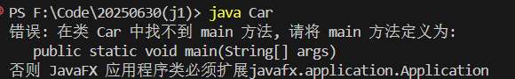
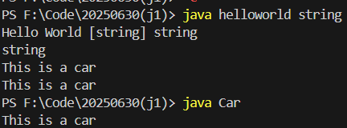

# 一个简单java程序组成

关于面向对象的核心思想：一个 Java 程序可以认为是一系列对象的集合，而这些对象通过调用彼此的方法来协同工作

java程序最外层是一个类，如顶级的public类

```java
public class HelloWorld{

}
```

因为该顶层类的命名为 `HelloWorld`，故java程序的文件名也需要命名为 `HelloWorld.java`，在java中每个 `.java`文件都只能有一个 **顶级public类** ，但是可以拥有多个非public类

```java
public class helloworld {
    public static void main(String[] args) {
        System.out.println("Hello World " + java.util.Arrays.toString(args)); // 输出 Hello World
        for (String arg : args) {
            System.out.print(arg + " "); // 输出每个参数
        }
        System.out.println(); // 换行
        Car myCar = new Car();
        myCar.display();
    }
}

class Car {
    public void display() {
        System.out.println("This is a car");
    }
}
```



方便的一点是：类的定义可以出现在类调用的后面

# 函数入口main()

每个可执行 Java 应用程序的**主方法 (main method)** 的声明是main函数，当运行一个 Java 程序时，Java 虚拟机 (JVM) 会从这个方法开始执行代码

```java
public static void main(String[] args) {
    // 程序逻辑代码
}
```

1. `public` 访问修饰符：
   * 表示该方法是公开的，可以从任何地方访问。
   * JVM 需要能够从外部访问 `main` 方法，因此它必须是 `public` 的。
2. `static` **访问控制**关键字：
   * 表示该方法是静态的，属于类本身，而不是类的实例。
   * JVM 在执行程序时，不需要创建类的实例就可以调用 `main` 方法。因为 `main` 方法是程序的起点，如果需要实例才能调用，就陷入了先有鸡还是先有蛋的问题。

是否有static修饰的方法区别如下：

| 特性            | `static` 方法                                | 非 `static` 方法（实例方法） |
| --------------- | ---------------------------------------------- | ------------------------------ |
| 调用方式        | 类名调用                                       | 对象实例调用                   |
| 访问权限        | 只能访问静态成员变量，不能直接访问实例成员变量 | 可以访问所有成员变量           |
| `this` 关键字 | 不能使用 `this`                              | 可以使用 `this`              |
| 内存分配        | 类加载时分配                                   | 创建对象时分配                 |
| 适用场景        | 工具方法、辅助方法、工厂方法等                 | 操作对象状态、实现对象行为     |

3. `void` 返回类型：
   * `void` 表示该方法不返回任何值。
   * `main` 方法通常不需要向 JVM 返回任何值，它的主要作用是启动程序的执行。
4. `main` 方法名：
   * `main` 是一个特殊的方法名，JVM 约定用它作为 **程序的入口点** 。
   * 方法名必须**完全匹配**为 `main`，区分大小写。
5. **`String[] args` 参数:**
   * `String[] args` 是一个字符串数组，用于接收命令行参数。
   * 当您从命令行运行 Java 程序时，可以在程序名后面添加一些参数，这些参数会以字符串的形式传递到 `main` 方法的 `args` 数组中。
   * 例如，如果您运行 `java MyProgram arg1 arg2 arg3`，那么 `args` 数组中会包含三个字符串 `"arg1"`, `"arg2"`, 和 `"arg3"`。
   * `args` 数组是**可选**的，如果不需要接收命令行参数，可以 **不使用** 。**但是必须有，若删除参数则报错：**



需要注意的是，同一个代码中有两个以上的类，多个类会被分开编译，每个类生成一个 `.class`文件



此时运行 `java Car` 可以得到以下输出：



此时做一些小小的修改将 `Car` 类中增加一个主函数方法，并在 `helloworld`中应用

```java
public class helloworld {
    public static void main(String[] args) {
        System.out.println("Hello World " + java.util.Arrays.toString(args) + " " + args[0]); // 输出 Hello World
        for (String arg : args) {
            System.out.print(arg + " "); // 输出每个参数
        }
        System.out.println(); // 换行
        Car myCar = new Car();
        Car.main(args); // 调用 Car 类的 main 方法
        myCar.display();
    }
}

class Car {
    public static void main(String[] args) {
        System.out.println("This is a car");
    }

    public void display() {
        System.out.println("This is a car");
    }
}
```

此时会以 `HelloWorld.java`中的main()方法作为程序的入口，Car中的main方法会被当做一个普通的名字为main的方法。同时，若单独运行Car，也有类似的效果：



更准确的说，一个类中只能存在一个标准的函数 `public static void main(String[] args)` 作为程序入口。

在此给出一个最简单的java程序创建模板：

```java
// name.java
public class name {
    public static void main(String[] args) {
  
    }
}
```
