# 一

## 监督学习

准确区分对错

## 无监督学习

尝试划分

# 二、模型

## 描述术语

m= Number of trainingexamples
x's = “input" variable / features
y's = “output" variable /“target" variable
(x , y) = 训练样本

## 代价函数

拟合方差最小化

线性回归方程

## 梯度下降（最小化平方差代数函数）

两个0和1为初始值，alpha：学习速率

该循环会使theta更接近自己斜率方向的极点（局部最低点）

j=0、j=1两点偏导数：

Batch梯度下降算法：每一步下降都遍历全部样本，从而达到全局最优

# 四、多功能

## 多元线性回归

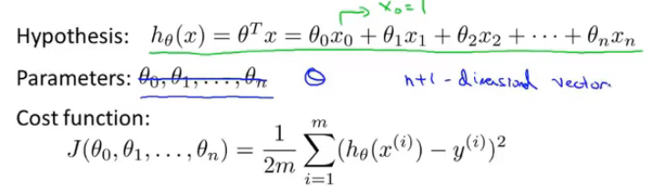

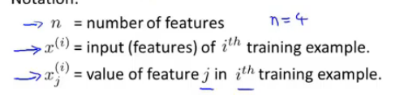

n种特征：n列

x(i)：n维向量，第i行

x(i)j：x(i)的第j项

因此当有n种特征时，h(x)的表达式如下

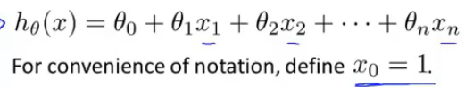

又被称作多元线性回归

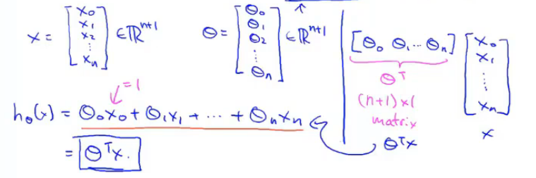

## 多元梯度下降

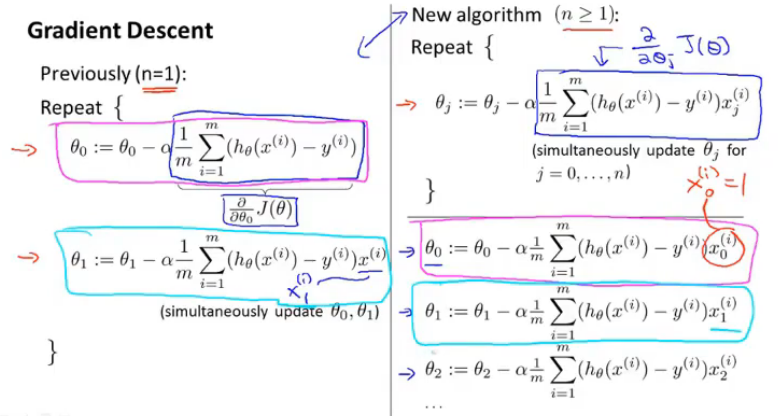

## 正规方程

矩阵乘法的正规方程，实际是需要求theta

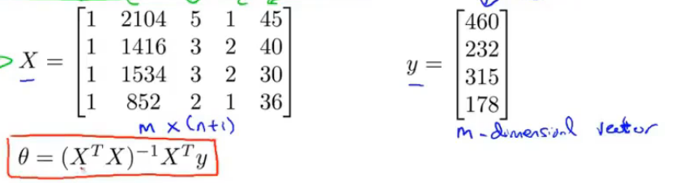

X矩阵的构造：

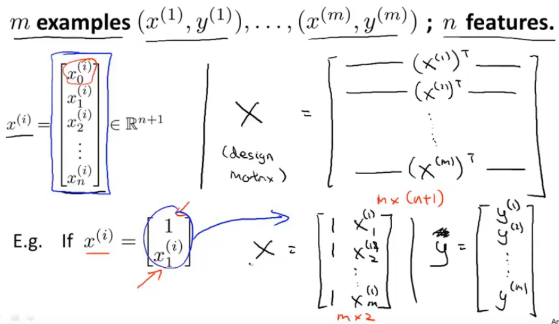

注意的是，需要额外加一列1

### 当XTX不可逆时（奇异矩阵）

1. 概念相同的参数
2. 过多参数

# 六、分类方法

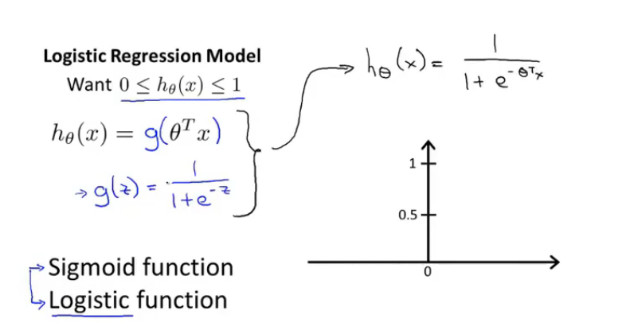

代价函数：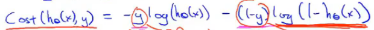

与线性回归之间的区别：

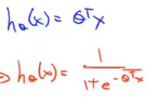

# 七、过拟合问题

为了解决过拟合问题，代价方程种加入了一个尾项：

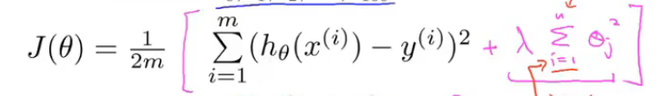

之后便是对每一个theta求偏导的过程

用矩阵化表示就是：

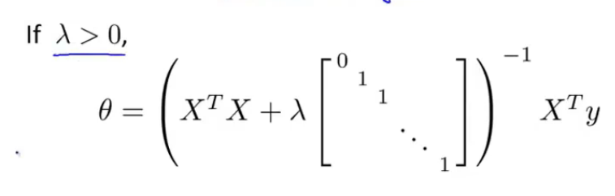

# 九、神经网络函数

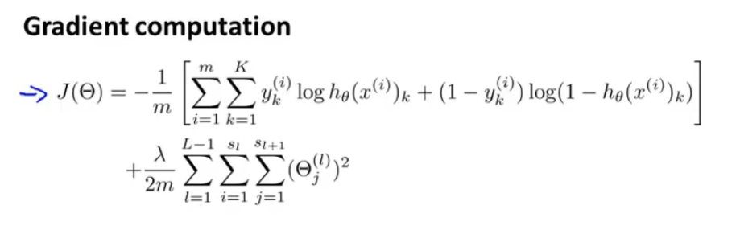
