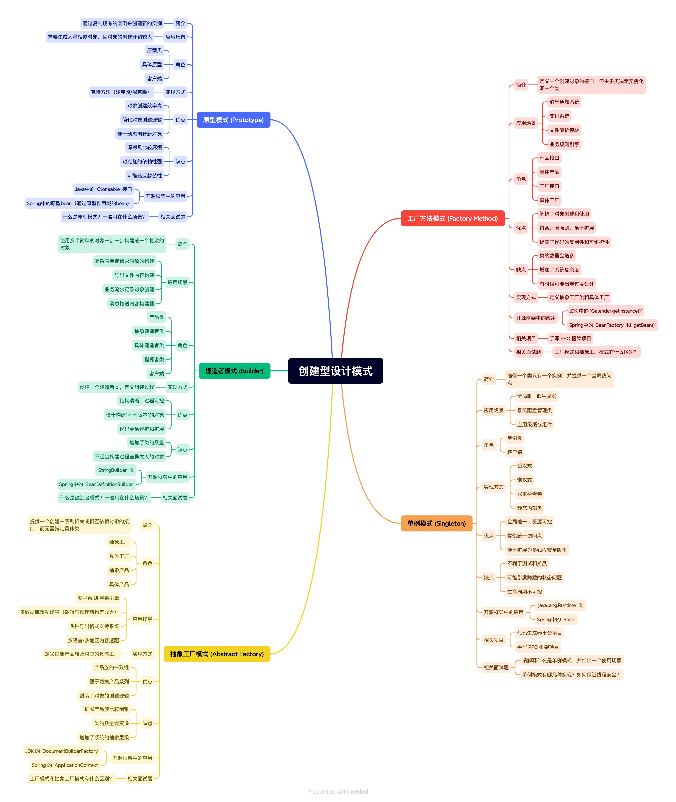
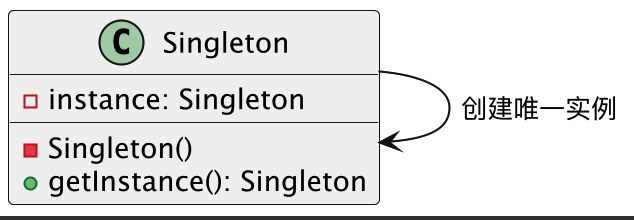
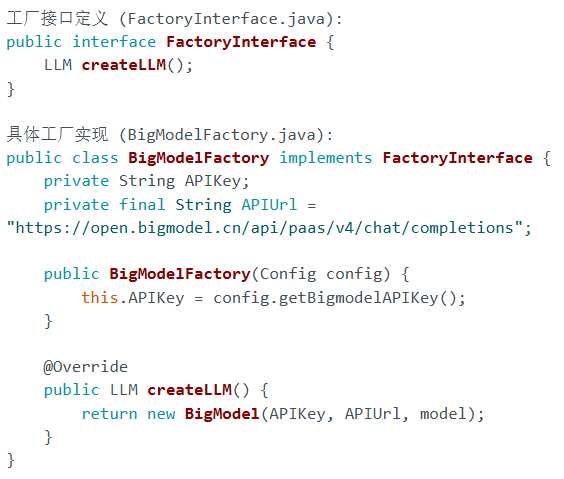
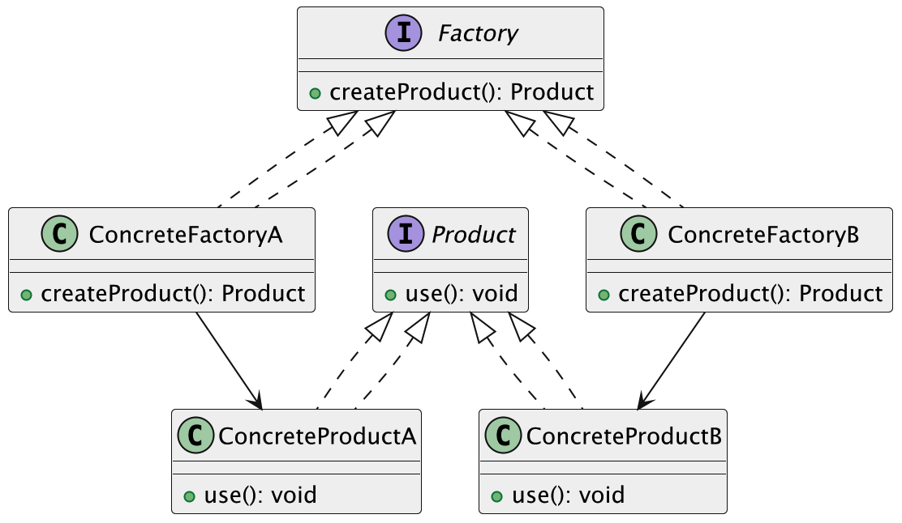

专门用来归纳解决对象创建问题的一类设计方案

**重点关注：**对象该怎么创建，什么时候创建，由谁来创建，创建后怎么保证系统结构清晰又可扩展。



# 单例模式

顾名思义，一个类在整个应用运行期间，**只能有一个实例，这个实例对外提供一个全局访问点。**

> 换句话说，无论是在哪儿调用这个类，拿到的永远都是同一个对象

场景可以是这样：

* 配置管理器：整个应用程序只需要一个配置对象。
* 日志记录器：所有日志操作都通过同一个日志实例。
* 数据库连接池：一个应用程序通常只需要一个连接池实例来管理数据库连接。

## 单例模式优势

1. 节省资源：控制实例数量，避免在高频访问场景中反复创建销毁。
2. 统一管理：全局只有一个入口，方便统一初始化和清理，比如统一配置、日志级别控制 。
3. 线程安全：好的单例实现可以天然保证多线程环境下只有一次创建，避免竞态条件。
4. 与其他模式结合：单例常常作为工厂、抽象工厂等模式的基础组件，为更复杂的结构型、行为型模式提供支持。

以数据库连接管理器为例，不使用单例模式时如下：

```java
public class DBConnectionManager {
    private Connection connection; // 数据库连接对象

    public DBConnectionManager() {
        // 创建数据库连接
        connection = new Connection(); // 每次实例化都会创建一个新的连接
    }

    public Connection getConnection() {
        return connection;
    }
}
// 使用示例
// DBConnectionManager manager1 = new DBConnectionManager();
// DBConnectionManager manager2 = new DBConnectionManager();
// 创建了多个连接实例，造成资源浪费
```

可以看出不使用单例模式时，每次创建 `DBConnectionManager` 实例都会建立新的数据库连接。这可能导致了资源浪费、连接对象数过多、管理困难等问题。

在使用了单例模式后，对象声明可以新增条件判断，从而固定只存在一个实例：

```java
// 单例数据库连接管理器
public class DBConnectionManager {
    private static DBConnectionManager instance; // 静态变量，用于保存唯一实例
    private Connection connection; // 数据库连接对象

    // 私有构造函数，防止外部直接实例化
    private DBConnectionManager() {
        // 创建数据库连接
        connection = new Connection(); // 只在第一次创建实例时执行
    }

    // 提供全局访问点
    public static synchronized DBConnectionManager getInstance() {
        // 约定：只有在 instance 为 null 时（即第一次调用时）才创建实例
        if (instance == null) {
            instance = new DBConnectionManager();
        }
        return instance; // 约定：返回已存在的唯一实例
    }

    public Connection getConnection() {
        return connection;
    }
}

// 使用示例
// DBConnectionManager manager1 = DBConnectionManager.getInstance();
// DBConnectionManager manager2 = DBConnectionManager.getInstance();
// manager1 和 manager2 是同一个实例
```

而使用单例模式后，我们确保了整个应用程序中只有一个数据库连接实例，有效避免了资源浪费。通过私有构造函数和静态获取方法，我们实现了对实例创建的严格控制，保证了连接的唯一性。这种实现方式不仅节省了系统资源，还简化了连接管理，提高了系统的可维护性。

## 单例模式基本结构

我们可以通过如下图示进一步理解：



* `Singleton()` 是私有构造方法，防止外部实例化
* `instance`是私有的静态实例变量
* `getInstance()` 是对外暴露的获取实例的静态方法

从而保证封装性和使用需求

## 单例模式基本要求

* 私有化构造器：统一的构造函数，外部禁止使用 `new`创建
* 持有唯一实例的静态变量：通常写成 `private static Singleton instance;`
* 全局访问点：提供一个 `public static getInstance()` 方法，外部就通过这个方法拿到唯一实例

## 单例模式基本实现

### 饿汉式（Eager Initialization）

可以看到在类内部定义了不可更改的实例初始化，这会导致类加载阶段就完成实例化，保证从第一次访问该类到程序结束，全局只有这一个实例

```java
public class EagerSingleton {
    // 1. 类加载时就创建实例
    private static final EagerSingleton INSTANCE = new EagerSingleton();

    // 2. 私有构造函数，防止外部直接实例化
    private EagerSingleton() {
        System.out.println("EagerSingleton 实例被创建了！");
    }

    // 3. 提供全局访问点
    public static EagerSingleton getInstance() {
        return INSTANCE;
    }

    public void showMessage() {
        System.out.println("Hello from EagerSingleton!");
    }
}

// 使用
// EagerSingleton singleton = EagerSingleton.getInstance();
// singleton.showMessage();
```

依赖 JVM 的类加载机制来确保线程安全

### 懒汉式（Synchronized Lazy）

只在第一次调用创建函数时创建实例，并通过对该方法加锁来保证线程安全

在多线程环境下，如果两个线程同时调用 `getInstance()`并且 `instance`都为 `null`，它们会同时进入 `if`块，导致创建两个实例，违背了单例模式的初衷，因此需要使用 `synchronized`声明进行加锁。

```java
public class SynchronizedLazySingleton {
    private static SynchronizedLazySingleton instance;

    private SynchronizedLazySingleton() {
        System.out.println("SynchronizedLazySingleton 实例被创建了！");
    }

    // 对整个方法加锁
    public static synchronized SynchronizedLazySingleton getInstance() {
        if (instance == null) {
            instance = new SynchronizedLazySingleton();
        }
        return instance;
    }

    public void showMessage() {
        System.out.println("Hello from SynchronizedLazySingleton!");
    }
}
```

### 双重检查锁定（Double-Checked Locking）

继承方法一的“无额外同步，通过标记直接判断”和方法二的“懒加载”

```java
public class StaticInnerClassSingleton {

    private StaticInnerClassSingleton() {
        System.out.println("StaticInnerClassSingleton 实例被创建了！");
    }

    // 静态内部类，它只有在第一次被引用时才会被加载
    private static class SingletonHolder {
        private static final StaticInnerClassSingleton INSTANCE = new StaticInnerClassSingleton();
    }

    public static StaticInnerClassSingleton getInstance() {
        // 当调用此方法时，SingletonHolder类才会被加载，从而创建实例
        return SingletonHolder.INSTANCE;
    }

    public void showMessage() {
        System.out.println("Hello from StaticInnerClassSingleton!");
    }
}
```

### 静态内部类（Initialization-on-demand Holder）

利用 JVM 在加载外部类时并不立即加载内部类的特性，将实例的创建延迟到真正访问内部类时。既能延迟加载，又能借助类加载的线程安全特性。

```java
public class StaticInnerClassSingleton {

    private StaticInnerClassSingleton() {
        System.out.println("StaticInnerClassSingleton 实例被创建了！");
    }

    // 静态内部类，它只有在第一次被引用时才会被加载
    private static class SingletonHolder {
        private static final StaticInnerClassSingleton INSTANCE = new StaticInnerClassSingleton();
    }

    public static StaticInnerClassSingleton getInstance() {
        // 当调用此方法时，SingletonHolder类才会被加载，从而创建实例
        return SingletonHolder.INSTANCE;
    }

    public void showMessage() {
        System.out.println("Hello from StaticInnerClassSingleton!");
    }
}
```

### 枚举式（Enum Singleton）

利用 Java 枚举类型的特性，枚举值在类加载时就创建，JVM 保证枚举实例的线程安全和唯一性？

```java
public enum EnumSingleton {
    INSTANCE; // 唯一的实例

    public void showMessage() {
        System.out.println("Hello from EnumSingleton!");
    }
}

// 使用
// EnumSingleton singleton = EnumSingleton.INSTANCE;
// singleton.showMessage();
```

### 单例模式应用

**Bean**，如果没有额外指定 scope，都是单例的。

```java
@Configuration
public class AppConfig {
    @Bean
    public UserService userService() {
        return new UserService();
    }
}

```

后续可以单独了解一下Bean……

# 工厂方法模式

工厂模式的目标是**定义一个用于创建对象的接口，但将具体的实例化工作放到子类中去完成**

换而言之，就是**通过让子类（类型）决定实例化哪个具体类**

这样， **产品类的实例化延迟到子类** 。

## 工厂方法模式对比

普通方法：

通过类内部的 `if-else if`链进行选择声明

```java
// 直接创建不同类型的日志记录器
public class Logger {
    private String type; // 用于区分日志类型

    public Logger(String type) {
        this.type = type;
    }

    public void log(String message) {
        if (type.equals("file")) {
            // 写入文件日志
            System.out.println("写入文件日志: " + message);
        } else if (type.equals("database")) {
            // 写入数据库日志
            System.out.println("写入数据库日志: " + message);
        } else if (type.equals("console")) {
            // 输出控制台日志
            System.out.println("输出控制台日志: " + message);
        }
        // ... 如果未来有更多日志类型，这里还需要添加更多 else if
    }
}
```

而工厂方法定义了统一接口，这是所有具体日志记录器的 **抽象产品** 。所有具体日志类（`FileLogger`, `DatabaseLogger`, `ConsoleLogger`）都实现了这个接口

```java
// 日志记录器接口
public interface Logger {
    void log(String message);
}

// 具体日志记录器 (例如：FileLogger)
public class FileLogger implements Logger {
    @Override
    public void log(String message) {
        // 写入文件日志的具体实现
        System.out.println("FileLogger: " + message);
    }
}

// 具体日志记录器 (例如：DatabaseLogger)
public class DatabaseLogger implements Logger {
    @Override
    public void log(String message) {
        // 写入数据库日志的具体实现
        System.out.println("DatabaseLogger: " + message);
    }
}

// 具体日志记录器 (例如：ConsoleLogger)
public class ConsoleLogger implements Logger {
    @Override
    public void log(String message) {
        // 输出控制台日志的具体实现
        System.out.println("ConsoleLogger: " + message);
    }
}

// 日志工厂接口
public interface LoggerFactory {
    Logger createLogger(); // 工厂方法
}

// 具体工厂：文件日志工厂
public class FileLoggerFactory implements LoggerFactory {
    @Override
    public Logger createLogger() {
        return new FileLogger();
    }
}

// 具体工厂：数据库日志工厂
public class DatabaseLoggerFactory implements LoggerFactory {
    @Override
    public Logger createLogger() {
        return new DatabaseLogger();
    }
}

// 具体工厂：控制台日志工厂
public class ConsoleLoggerFactory implements LoggerFactory {
    @Override
    public Logger createLogger() {
        return new ConsoleLogger();
    }
}
```

同时，因为接口的规则是需要子类中实现，而子类中还可以扩展地添加一些逻辑如内部静态变量和方法，进一步完善接口的实现



## 工厂方法模式基本结构

1）抽象产品（Product）：定义产品的公共接口，是所有具体产品的父类。

2）具体产品（ConcreteProduct）：实现了抽象产品接口，表示某种具体的产品。

3）抽象工厂（Factory）：定义了一个返回产品对象的方法（一般是一个抽象方法）。

4）具体工厂（ConcreteFactory）：实现了抽象工厂中的创建产品的方法，生成具体的产品实例。

可以这样理解：1、2是一对，3、4是一对，4使用2创建



整个流程如下：

1）定义抽象产品接口（比如通知接口）

```java
// 抽象产品接口：通知消息
public interface Message {
    void send(String to, String content);
}
```

这个接口是所有“消息产品”的统一标准，无论是短信、邮件还是站内信，都必须实现 `send` 方法。

2）定义多个具体产品，比如短信、邮件、站内信：

```java
public class SmsMessage implements Message {
    @Override
    public void send(String to, String content) {
        System.out.println("发送短信给 " + to + "，内容：" + content);
    }
}

public class EmailMessage implements Message {
    @Override
    public void send(String to, String content) {
        System.out.println("发送邮件给 " + to + "，内容：" + content);
    }
}

public class InAppMessage implements Message {
    @Override
    public void send(String to, String content) {
        System.out.println("发送站内信给 " + to + "，内容：" + content);
    }
}
```

每个类都实现了 `Message` 接口，表示各自的发送方式。

3）定义抽象工厂接口

```java
// 抽象工厂接口：负责生产消息对象
public interface MessageFactory {
    Message createMessage();
}
```

这是抽象工厂的核心部分，它规定了工厂要提供的“产品生产线”接口。

4）定义多个具体工厂（每种通知方式一个工厂）

```java
public class SmsMessageFactory implements MessageFactory {
    @Override
    public Message createMessage() {
        return new SmsMessage();
    }
}

public class EmailMessageFactory implements MessageFactory {
    @Override
    public Message createMessage() {
        return new EmailMessage();
    }
}

public class InAppMessageFactory implements MessageFactory {
    @Override
    public Message createMessage() {
        return new InAppMessage();
    }
}
```

每个工厂只负责创建一种消息对象，具体怎么创建，它自己说了算。

5）客户端调用（用工厂创建消息，不直接 new）

```java
public class NotificationService {
    private final MessageFactory messageFactory;

    public NotificationService(MessageFactory factory) {
        this.messageFactory = factory;
    }

    public void notifyUser(String to, String content) {
        Message message = messageFactory.createMessage();
        message.send(to, content);
    }
}
```

客户端完全不需要关心到底是邮件、短信还是站内信，只需要注入一个“消息工厂”，然后就可以调用。

6）测试使用

```java
public class Main {
    public static void main(String[] args) {
        MessageFactory factory = new SmsMessageFactory(); // 切换只需换这里
        NotificationService service = new NotificationService(factory);
        service.notifyUser("13812345678", "您的验证码是 123456");
    }
}
```

在工厂方法模式中，其核心流程和角色分工如下：

1. **定义抽象产品（Product）接口或抽象类** ：它声明了所有具体产品共同具备的功能或行为。这个抽象产品类型既用于 **客户端进行功能调用（通过多态性）** ，也作为 **工厂方法返回值的声明类型** 。
2. **定义具体产品（Concrete Product）类** ：它们实现了抽象产品接口，并 **只实现其自身的功能行为** ，不再关心如何被创建。
3. **定义抽象工厂（Creator）接口或抽象类** ：它声明了 **工厂方法** （即创建产品的方法），但将具体产品的实例化延迟到其子类。
4. **定义具体工厂（Concrete Creator）类** ：针对每一种具体产品，都需要实现一个具体的工厂类。这个具体工厂将实现抽象工厂接口中的工厂方法，从而 **负责创建对应类型的具体产品实例** 。

通过这种方式，产品的创建职责从客户端中完全剥离，并由专业的工厂来负责，从而实现了高度解耦和满足开闭原则。

# 抽象工厂模式

提供一个“超级工厂”的接口，专门用来创建一整组互相关联的产品对象，而且不用我们关心这些产品具体是怎么实现的

> 抽象工厂模式就是工厂方法模式的聚合，涵盖多个具体工厂类，每个具体工厂负责生产**一个产品家族**

但是这依旧需要在主程序中进行选择：

```java
// 抽象产品A：按钮
interface Button {
    void render();
}

// 抽象产品B：文本框
interface TextField {
    void display();
}

// 具体产品A1：Windows按钮
class WinButton implements Button {
    @Override public void render() { System.out.println("Rendering Windows Button"); }
}
// 具体产品A2：Mac按钮
class MacButton implements Button {
    @Override public void render() { System.out.println("Rendering Mac Button"); }
}

// 具体产品B1：Windows文本框
class WinTextField implements TextField {
    @Override public void display() { System.out.println("Displaying Windows TextField"); }
}
// 具体产品B2：Mac文本框
class MacTextField implements TextField {
    @Override public void display() { System.out.println("Displaying Mac TextField"); }
}

// 抽象工厂：UIFactory
interface UIFactory {
    Button createButton();
    TextField createTextField();
}

// 具体工厂1：WindowsUIFactory (生产Windows风格的产品家族)
class WinUIFactory implements UIFactory {
    @Override public Button createButton() { return new WinButton(); }
    @Override public TextField createTextField() { return new WinTextField(); }
}

// 具体工厂2：MacUIFactory (生产Mac风格的产品家族)
class MacUIFactory implements UIFactory {
    @Override public Button createButton() { return new MacButton(); }
    @Override public TextField createTextField() { return new MacTextField(); }
}

// 客户端使用
public class Application {
    private Button button;
    private TextField textField;

    public Application(UIFactory factory) {
        this.button = factory.createButton();
        this.textField = factory.createTextField();
    }

    public void paint() {
        button.render();
        textField.display();
    }

    public static void main(String[] args) {
        UIFactory factory;
        String os = "Mac"; // 或者从配置文件读取

        if ("Windows".equals(os)) {
            factory = new WinUIFactory();
        } else if ("Mac".equals(os)) {
            factory = new MacUIFactory();
        } else {
            throw new IllegalArgumentException("Unknown OS");
        }

        Application app = new Application(factory);
        app.paint();
    }
}
```

# 建造者模式

> 引子：当一个复杂对象的构建过程非常复杂，包含多个步骤，并且这些步骤的顺序或某些部件的选择可能有所不同时，我们如何才能使构建过程更加清晰、灵活，并能够创建出该复杂对象的不同“表示”？

建造者模式专门负责分步骤构建复杂对象，将一个复杂对象的 **构建与它的表示（最终形态）分离** ，使得同样的构建过程可以创建出该复杂对象的 **不同表示** 。

## 模式结构

1. **产品（Product）** ：
   * 待构建的复杂对象。它通常包含多个部件，并且这些部件之间存在一定的组装关系。
   * 在电脑组装的例子中，就是 `Computer` 类，它包含了 `CPU`, `Memory`, `Storage`, `GraphicsCard` 等属性。产品类本身不负责任何构建细节。
2. **抽象建造者（Builder）** ：
   * 定义创建产品各个部件的抽象接口，以及一个返回最终产品的方法。
   * 例如：`ComputerBuilder` 接口，包含 `buildCPU()`, `buildMemory()`, `buildStorage()`, `buildGraphicsCard()`, 和 `getComputer()` 等方法。
3. **具体建造者（Concrete Builder）** ：
   * 实现了抽象建造者接口，负责构建和装配产品对象的各个部件。它还负责创建具体的产品实例。
   * 例如：`GamingComputerBuilder`（游戏电脑建造者）、`OfficeComputerBuilder`（办公电脑建造者）。每个具体建造者会根据特定的配置来构建部件。
4. **指挥者（Director）** ：
   * 可选角色。它使用建造者接口来构建产品对象。它知道如何按顺序调用建造者接口中的构建方法，以构建出特定类型的产品。
   * 例如：`Assembler`（装配员）。客户端可以将建造者对象传递给指挥者，然后指挥者按照预设的流程来构建电脑。客户端也可以直接使用建造者。

### 典型代码实现（Java 示例 - 组装电脑）

我们以组装电脑为例来演示：

#### 1.产品：`Computer` 类

```java
// 产品：电脑
public class Computer {
    private String cpu;
    private String memory;
    private String storage;
    private String graphicsCard; // 可选部件

    // 私有构造函数，只能通过建造者来创建
    private Computer() {}

    // 使用建造者内部类实现链式调用和更灵活的构建
    public static class Builder {
        private String cpu;
        private String memory;
        private String storage;
        private String graphicsCard;

        public Builder setCpu(String cpu) {
            this.cpu = cpu;
            return this; // 返回Builder自身，支持链式调用
        }

        public Builder setMemory(String memory) {
            this.memory = memory;
            return this;
        }

        public Builder setStorage(String storage) {
            this.storage = storage;
            return this;
        }

        public Builder setGraphicsCard(String graphicsCard) {
            this.graphicsCard = graphicsCard;
            return this;
        }

        public Computer build() {
            Computer computer = new Computer();
            computer.cpu = this.cpu;
            computer.memory = this.memory;
            computer.storage = this.storage;
            computer.graphicsCard = this.graphicsCard;
            // 可以在这里添加构建后的验证逻辑
            if (computer.cpu == null || computer.memory == null || computer.storage == null) {
                throw new IllegalStateException("CPU, Memory, and Storage are required.");
            }
            return computer;
        }
    }

    public void showConfig() {
        System.out.println("--- 电脑配置 ---");
        System.out.println("CPU: " + (cpu != null ? cpu : "N/A"));
        System.out.println("内存: " + (memory != null ? memory : "N/A"));
        System.out.println("硬盘: " + (storage != null ? storage : "N/A"));
        System.out.println("显卡: " + (graphicsCard != null ? graphicsCard : "N/A (集成显卡)"));
        System.out.println("----------------");
    }
}
```

这里 `Computer` 类内部的 `Builder` 将抽象建造者和具体建造者的概念融入到了产品类内部，并提供了链式调用

#### 2.抽象建造者：`ComputerBuilder` 接口

```java
// 抽象建造者：电脑建造者
public interface ComputerBuilder {
    ComputerBuilder buildCPU(String cpu);
    ComputerBuilder buildMemory(String memory);
    ComputerBuilder buildStorage(String storage);
    ComputerBuilder buildGraphicsCard(String graphicsCard); // 可选
    Computer getResult(); // 获取最终产品
}
```

#### 3.具体建造者：`GamingComputerBuilder` 和 `OfficeComputerBuilder`

```java
// 具体建造者：游戏电脑建造者
public class GamingComputerBuilder implements ComputerBuilder {
    private Computer computer;

    public GamingComputerBuilder() {
        this.computer = new Computer.Builder().build(); // 或直接 new Computer() 如果构造函数是public
    }

    @Override
    public ComputerBuilder buildCPU(String cpu) {
        this.computer = new Computer.Builder() // 这里需要基于现有computer状态去构建，简化起见这里用setter模拟
                                .setCpu(cpu != null ? cpu : "Intel i9")
                                .setMemory(computer.memory)
                                .setStorage(computer.storage)
                                .setGraphicsCard(computer.graphicsCard)
                                .build();
        return this;
    }

    @Override
    public ComputerBuilder buildMemory(String memory) {
        this.computer = new Computer.Builder()
                                .setCpu(computer.cpu)
                                .setMemory(memory != null ? memory : "32GB DDR4")
                                .setStorage(computer.storage)
                                .setGraphicsCard(computer.graphicsCard)
                                .build();
        return this;
    }

    @Override
    public ComputerBuilder buildStorage(String storage) {
        this.computer = new Computer.Builder()
                                .setCpu(computer.cpu)
                                .setMemory(computer.memory)
                                .setStorage(storage != null ? storage : "1TB NVMe SSD")
                                .setGraphicsCard(computer.graphicsCard)
                                .build();
        return this;
    }

    @Override
    public ComputerBuilder buildGraphicsCard(String graphicsCard) {
        this.computer = new Computer.Builder()
                                .setCpu(computer.cpu)
                                .setMemory(computer.memory)
                                .setStorage(computer.storage)
                                .setGraphicsCard(graphicsCard != null ? graphicsCard : "NVIDIA RTX 4080")
                                .build();
        return this;
    }

    @Override
    public Computer getResult() {
        return this.computer;
    }
}

// 具体建造者：办公电脑建造者
public class OfficeComputerBuilder implements ComputerBuilder {
    private Computer computer;

    public OfficeComputerBuilder() {
        this.computer = new Computer.Builder().build(); // 或直接 new Computer()
    }

    @Override
    public ComputerBuilder buildCPU(String cpu) {
        this.computer = new Computer.Builder()
                                .setCpu(cpu != null ? cpu : "Intel i5")
                                .setMemory(computer.memory)
                                .setStorage(computer.storage)
                                .setGraphicsCard(computer.graphicsCard)
                                .build();
        return this;
    }

    @Override
    public ComputerBuilder buildMemory(String memory) {
        this.computer = new Computer.Builder()
                                .setCpu(computer.cpu)
                                .setMemory(memory != null ? memory : "8GB DDR4")
                                .setStorage(computer.storage)
                                .setGraphicsCard(computer.graphicsCard)
                                .build();
        return this;
    }

    @Override
    public ComputerBuilder buildStorage(String storage) {
        this.computer = new Computer.Builder()
                                .setCpu(computer.cpu)
                                .setMemory(computer.memory)
                                .setStorage(storage != null ? storage : "512GB SSD")
                                .setGraphicsCard(computer.graphicsCard)
                                .build();
        return this;
    }

    @Override
    public ComputerBuilder buildGraphicsCard(String graphicsCard) {
        // 办公电脑通常不需要独立显卡，或者用默认的简单配置
        this.computer = new Computer.Builder()
                                .setCpu(computer.cpu)
                                .setMemory(computer.memory)
                                .setStorage(computer.storage)
                                .setGraphicsCard(graphicsCard != null ? graphicsCard : "Integrated Graphics")
                                .build();
        return this;
    }

    @Override
    public Computer getResult() {
        return this.computer;
    }
}
```

#### 4.指挥者：`ComputerAssembler` 类 (可选，这里演示一个简单的，更复杂的Director会封装特定构建流程)

```java
// 指挥者：电脑装配员（可选角色，这里简化）
public class ComputerAssembler {
    public Computer assembleGamingComputer() {
        // 使用 Computer 内部的 Builder 直接构建
        return new Computer.Builder()
                .setCpu("Intel i9-14900K")
                .setMemory("64GB DDR5")
                .setStorage("2TB NVMe SSD")
                .setGraphicsCard("NVIDIA RTX 4090")
                .build();
    }

    public Computer assembleOfficeComputer() {
        return new Computer.Builder()
                .setCpu("Intel i5-13400")
                .setMemory("16GB DDR4")
                .setStorage("512GB SSD")
                // 办公电脑通常不特别指定显卡，用集成显卡
                .build();
    }

    public Computer assembleBasicComputer() {
        return new Computer.Builder()
                .setCpu("AMD Ryzen 3 4100")
                .setMemory("8GB DDR4")
                .setStorage("256GB SSD")
                .build();
    }
}
```

## 核心思想

我有一种理解：**从简单工厂到工厂方法，再到抽象工厂，以及建造者模式，它们在某种程度上是复杂程度的递进，并且可以看作是在前一种模式的基础上，为了解决更复杂的问题或提升某个维度的灵活性而进行的“延伸”。**

* **简单工厂** ：是**创建简单对象**的初步封装。
* **工厂方法** ：在简单工厂的基础上，通过引入**工厂族（抽象工厂和具体工厂）**来解决**单个产品等级**的**扩展性**问题。
* **抽象工厂** ：在工厂方法的基础上，进一步扩展到创建 **多个产品等级的“家族”** ，解决**产品族的一致性**问题。
* **建造者模式** ：则跳出了“实例化”的范畴，更专注于 **单个“复杂对象”的“分步构建”过程** ，解决**构建步骤复杂、参数繁多、需要多种表示**的问题。

但是我觉得建造者模式还有一种更好的理解方法：

> 建造者模式是抽象工厂模式的延伸，只是将系列产品转换成了生产一个产品中各个零件，然后再用一个指挥者类将其包装起来

# 原型模式

**原型模式** （Prototype Pattern）是一种创建型设计模式，主要用于 **通过复制现有的对象来创建新对象** ，而不是通过“new”关键字来直接实例化。简而言之，原型模式让我们能够在已有对象的基础上创建新对象。它依赖于“克隆”已有对象的状态，从而减少了重复构建相同对象的成本。

> 想象一个场景：你有一个非常复杂的对象，它的创建成本很高（比如需要查询数据库、加载大量资源、进行复杂计算等），或者它的初始化过程非常繁琐。现在，你需要创建很多个与这个对象 **几乎相同** ，但可能只有少数属性不同的新对象。
>
> *提供一个“原型”对象，当你需要一个新对象时，不是重新创建，而是**复制**这个原型对象，然后对复制品进行必要的修改。*


原型模式通常包含以下三个核心角色：

1. **抽象原型（Prototype）** ：

* 声明一个用于克隆自身的操作接口。在 Java 中，通常是通过实现 `java.lang.Cloneable` 接口并重写 `Object` 类的 `clone()` 方法来实现。
* 它是所有具体原型类的公共接口。

1. **具体原型（Concrete Prototype）** ：

* 实现了抽象原型接口中声明的克隆操作。它会返回自身的副本。
* 例如：`Document` 类，实现了 `Cloneable` 并重写 `clone()` 方法。

1. **客户端（Client）** ：

* 请求原型对象克隆自身，以获取新对象。
* 它不直接调用具体原型的构造函数，而是通过克隆方法获取新对象。


## 示例：文档原型

假设我们有一个 `Document` 类，包含标题和内容，我们想快速创建具有相同标题和内容的新文档。

```java
import java.util.ArrayList;
import java.util.List;

// 1. 抽象原型 (在Java中通常是Cloneable接口和重写的clone方法)
// 这里我们直接在具体原型中实现Cloneable

// 2. 具体原型：文档类
public class Document implements Cloneable {
    private String title;
    private String content;
    // 假设文档中包含一个列表，用来演示深拷贝与浅拷贝的区别
    private List<String> authors;

    public Document(String title, String content, List<String> authors) {
        this.title = title;
        this.content = content;
        this.authors = authors;
        System.out.println("Document(" + title + ") Constructor called."); // 演示创建成本
    }

    public String getTitle() {
        return title;
    }

    public void setTitle(String title) {
        this.title = title;
    }

    public String getContent() {
        return content;
    }

    public void setContent(String content) {
        this.content = content;
    }

    public List<String> getAuthors() {
        return authors;
    }

    public void addAuthor(String author) {
        if (this.authors == null) {
            this.authors = new ArrayList<>();
        }
        this.authors.add(author);
    }

    @Override
    public String toString() {
        return "Document [title=" + title + ", content=" + content.substring(0, Math.min(content.length(), 20)) + "..., authors=" + authors + ", hashCode=" + this.hashCode() + "]";
    }

    /**
     * 实现浅拷贝
     */
    @Override
    protected Object clone() throws CloneNotSupportedException {
        System.out.println("Performing shallow copy of Document.");
        return super.clone(); // 调用Object类的浅拷贝
    }

    /**
     * 实现深拷贝（如果需要）
     * 对于引用类型字段，需要手动克隆其引用的对象
     */
    public Document deepClone() throws CloneNotSupportedException {
        System.out.println("Performing deep copy of Document.");
        Document clonedDoc = (Document) super.clone(); // 先进行浅拷贝
        // 手动克隆引用类型的字段
        if (this.authors != null) {
            clonedDoc.authors = new ArrayList<>(this.authors); // 克隆新的List对象
        }
        return clonedDoc;
    }
}
```

在客户端中如此使用（主函数）：

```java
import java.util.Arrays;
import java.util.List;

public class Client {
    public static void main(String[] args) {
        // 创建一个原型文档，假设这个创建过程很复杂或耗时
        System.out.println("--- 创建原型文档 ---");
        List<String> initialAuthors = Arrays.asList("AuthorA", "AuthorB");
        Document originalDoc = new Document("项目提案 V1.0", "这是一个关于新产品的功能提案，包含了市场分析、技术实现、预期收益等详细内容。", initialAuthors);
        originalDoc.addAuthor("OriginalCreator"); // 增加一个作者
        System.out.println("原始文档: " + originalDoc);
        System.out.println("原始文档作者列表 hash: " + originalDoc.getAuthors().hashCode());

        System.out.println("\n--- 使用浅拷贝创建新文档 ---");
        Document clonedDoc1 = null;
        try {
            clonedDoc1 = (Document) originalDoc.clone(); // 浅拷贝
        } catch (CloneNotSupportedException e) {
            e.printStackTrace();
        }
        if (clonedDoc1 != null) {
            clonedDoc1.setTitle("项目提案 V1.1");
            clonedDoc1.setContent("这是V1.0的修订版，主要修改了预期收益部分。");
            // 注意：浅拷贝会导致这里对作者列表的修改影响到原始文档
            clonedDoc1.getAuthors().add("NewAuthor1"); // 修改克隆文档的引用类型成员
            System.out.println("克隆文档1 (浅拷贝): " + clonedDoc1);
            System.out.println("克隆文档1作者列表 hash: " + clonedDoc1.getAuthors().hashCode());
            System.out.println("原始文档 (受浅拷贝影响): " + originalDoc); // 原始文档的authors也被修改了
            System.out.println("原始文档作者列表 hash (受浅拷贝影响): " + originalDoc.getAuthors().hashCode());
        }

        System.out.println("\n--- 重新创建原型文档以演示深拷贝 ---");
        List<String> newInitialAuthors = new ArrayList<>(Arrays.asList("AuthorX", "AuthorY")); // 重新初始化作者列表
        Document originalDocForDeepCopy = new Document("需求分析 V2.0", "详细的用户需求分析报告。", newInitialAuthors);
        originalDocForDeepCopy.addAuthor("OriginalAnalyst");
        System.out.println("深拷贝原始文档: " + originalDocForDeepCopy);
        System.out.println("深拷贝原始文档作者列表 hash: " + originalDocForDeepCopy.getAuthors().hashCode());

        System.out.println("\n--- 使用深拷贝创建新文档 ---");
        Document clonedDoc2 = null;
        try {
            clonedDoc2 = originalDocForDeepCopy.deepClone(); // 深拷贝
        } catch (CloneNotSupportedException e) {
            e.printStackTrace();
        }
        if (clonedDoc2 != null) {
            clonedDoc2.setTitle("需求分析 V2.1");
            clonedDoc2.setContent("V2.0的修订版，增加了用户画像。");
            clonedDoc2.getAuthors().add("NewAnalyst2"); // 修改克隆文档的引用类型成员
            System.out.println("克隆文档2 (深拷贝): " + clonedDoc2);
            System.out.println("克隆文档2作者列表 hash: " + clonedDoc2.getAuthors().hashCode());
            System.out.println("深拷贝原始文档 (不受影响): " + originalDocForDeepCopy); // 原始文档的authors不受影响
            System.out.println("深拷贝原始文档作者列表 hash (不受影响): " + originalDocForDeepCopy.getAuthors().hashCode());
        }
    }
}
```

原型模式提供了一种非常优雅且高效的对象创建方式，特别适用于那些创建成本高昂或初始化复杂的对象。理解浅拷贝与深拷贝的区别是掌握原型模式的关键。


# 原型模式与工厂模式的区别（思考与延展）

* **创建方式** ：
  * **工厂模式** ：通过调用**工厂的创建方法**来实例化对象（通常是 `new`）。
  * **原型模式** ：通过**克隆现有对象**来创建新对象（通常是 `clone()`）。
* **关注点** ：
  * **工厂模式** ：关注 **对象的实例化过程** 。它隐藏了产品类名和构造函数的细节。
  * **原型模式** ：关注 **对象的高效复制** 。它隐藏了对象初始化的复杂过程，侧重于通过复制来减少开销。
* **创建时机** ：
  * **工厂模式** ：通常在需要时按需创建新对象。
  * **原型模式** ：需要有一个**原型实例**作为基础才能进行克隆。

**一个形象的比喻：**

* **工厂模式** ：你打电话给“披萨工厂”，说“给我来一个海鲜披萨”。工厂会根据你的要求，从零开始制作一个新的海鲜披萨给你。
* **原型模式** ：你有一个已经制作好的“标准披萨”（原型）。你需要一个新的披萨时，不是重新制作，而是用这个“标准披萨”复制一个一模一样的，然后如果你想加点香肠，就在复制品上加，不影响“标准披萨”本身。
