*上下同欲者胜，风雨同舟者兴*

在本章中，我们关注于实体一联系(E-R）数据模型，它提供了一种识别数据库中表示的实体以及这些实体间如何关联的方式。最终，数据库设计将会被表示为一个关系数据库设计和一个与之关联的约束集合。 我们将在本章中讲述一个E-R设计如何转换成一个关系模式的集合以及如何在该设计中捕获某些约束。

# 6.1 设计过程概览

## 6.1.1 设计阶段

1. 描述数据需求
2. **概念设计（conceptual-design）阶段：实体——联系模型**
3. 功能需求规格说明（specification of functional requirement）
4. **逻辑设计阶段（logical-design phase）**：将高层概念模式映射到将被使用的数据库系统具体实现的数据模型
   * 关系数据模型
   * 实体——联系模型定义的概念模式映射到**关系模式**。
5. **物理设计阶段(physical-design phase）：文件组织形式和索引结构的选择**

# 6.2 实体一联系模型

实体一联系数据模型（E-R数据模型）：通过允许定义代表数据库全局逻辑结构的企业模式（enterprise schema ）来做到的。

## 6.2.1 实体集

* 实体（entity）：可区别于所有其他对象的一个“事物”或“对象”
  * 属性（attribute）：实体集中每个成员所拥有的描述性性质
  * 值（value)：
* 实体集（entity set）：共享相同性质或属性的、 具有相同类型的实体的集合

## 6.2.2 联系集

* 联系（relationship ）是多个实体间的相互关联
* 联系集（relationship set）是相同类型联系的集合。
* 联系实例（relationship instance）表示在所建模的现实企业中被命名的实体之间的一种关联
* 角色（role) 是实体在联系中扮演的功能

形式化地说，联系集是在 $n \geq 2$ 个（可能相同的）实体集上的数学关系。如果 $E_1, E_2, \dots, E_n$ 为实体集，那么联系集 $R$ 是

$\left\{ (e_1, e_2, \dots, e_n) \mid e_1 \in E_1, e_2 \in E_2, \dots, e_n \in E_n \right\}$

的一个子集，其中 $(e_1, e_2, \dots, e_n)$ 是一个联系实例。

### 表示

联系集在E-R图中用菱形表示，菱形通过线条连接到多个不同的实体集矩形）

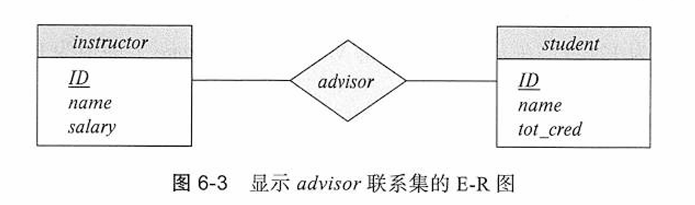

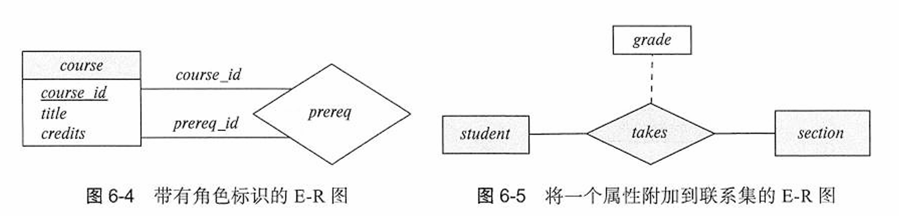

# 6.3 复杂属性

域（domain) / 值集（value set)：每个属性都有一个可取值的集合

* 简单复合：直接划分
  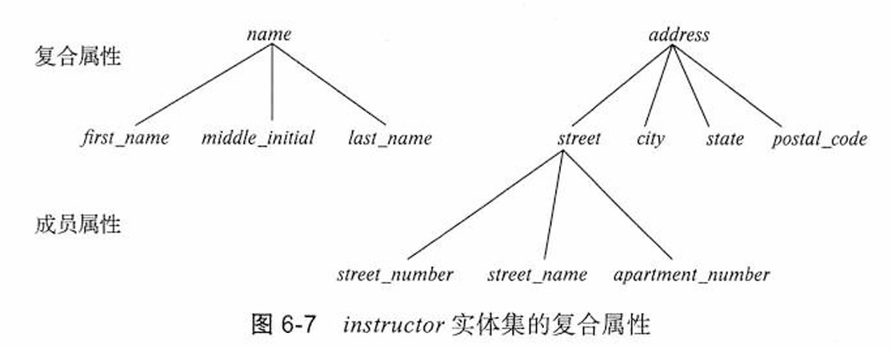
* 多值（multivalued）属性：1对n
* 派生属性（derived attribute)：

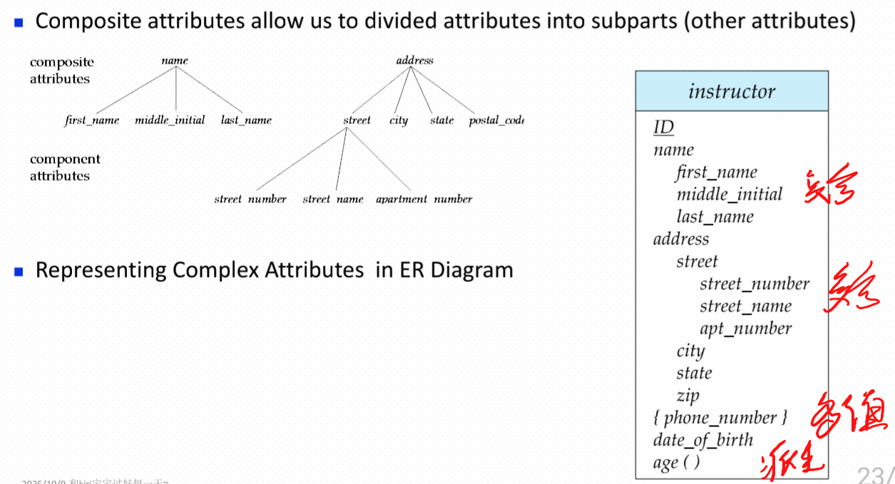

# 6.4 映射基数

映射基数（mapping cardinality）或基数比率表示一个实体能通过一个联系集关联的另一
些实体的数量。

## 6.4.1 一对一（one-to-one)

 A 中的一个实体至多与B 中的一个实体相关联，并且 B 中的一个实体也至多与 A 中的一个实体相关联

从联系集到两个实体集各画一条有向线段

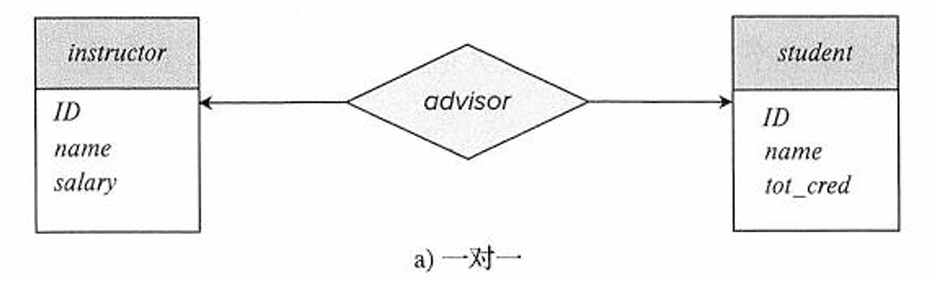

## 6.4.2 一对多（one-to-many)

A 中的一个实体可以与B中任意数量（零个或多个 ）的实体相关联，而B中的一个实体至多与A 中的一个实体相关联

从联系集到联系的“一”侧画一条有向线段

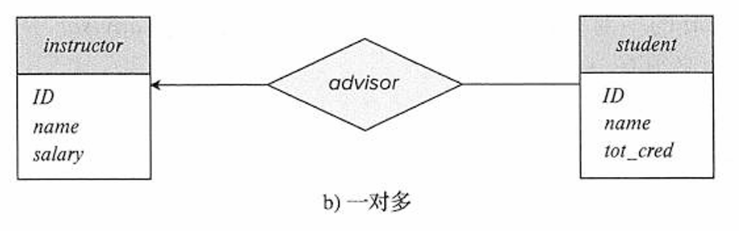

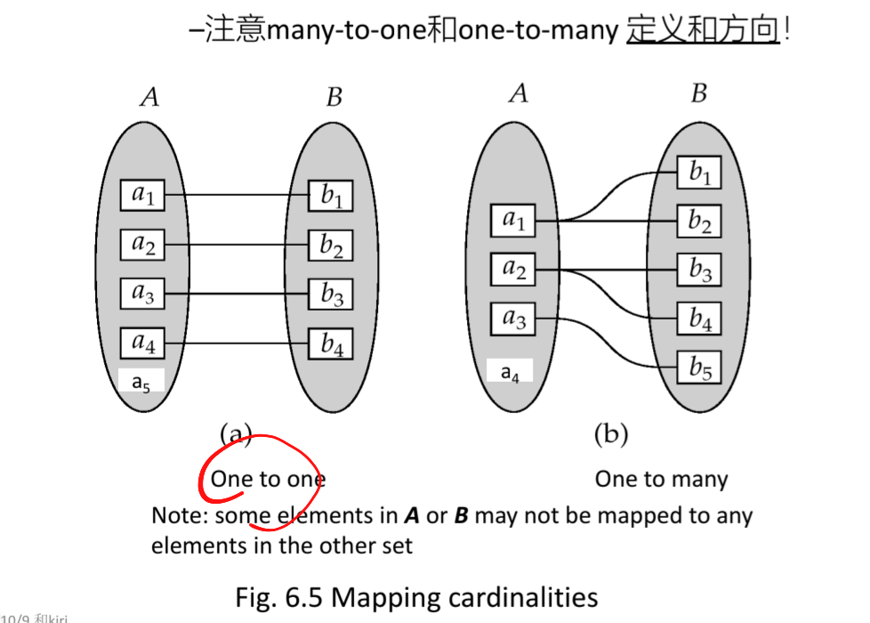

## 6.4.3 多对一（many-to-one)

A 中的一个实体至多与B中的一个实体相关联，而B中的一个实体可以与A 中任意数量（零个或多个）的实体相关联

我们从联系集到联系的“一”侧画一条有向线段

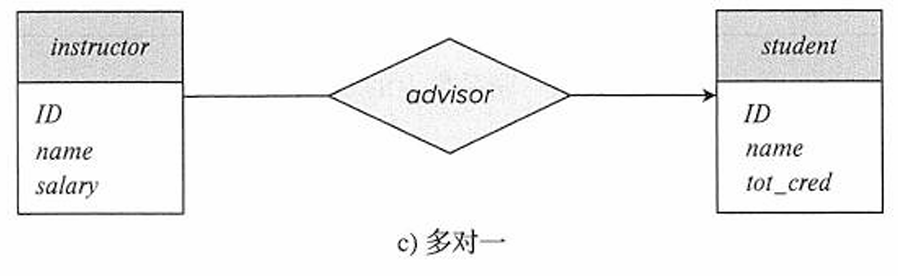

## 6.4.4 多对多（many-to-many)

A 中的一个实体可以与B 中任意数量（零个或多个）的实体相关联， rfr1且B 中的一个实体也可以与A 中任意数量（零个或多个）的实体相关联

我们从联系集到两个实体集各画一条无向线段

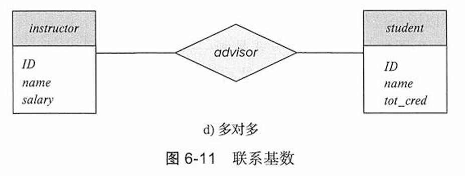

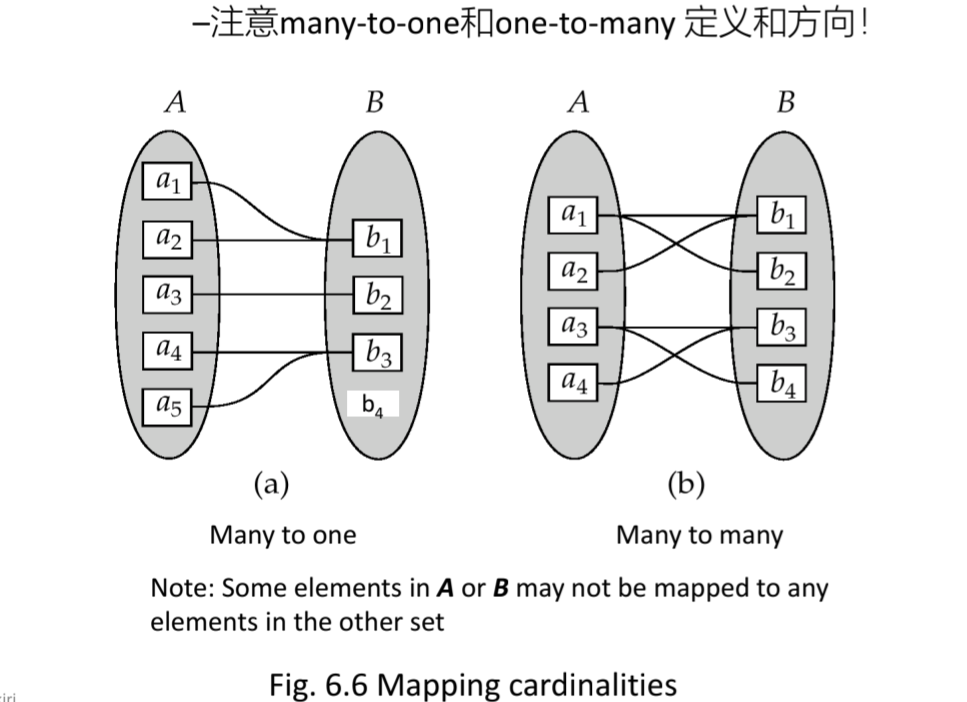

## 6.4.5 全部参与与部分参与

* 全部参与：实体集 E 中的每个实体都必须参与到联系集 R 中的至少一个联系中
* 部分参与：E 中一些实体可能不参与到 R 的联系中

### 单双线显示

用双线表示一个实体在联系集中的全部参与，单线表示部分参与

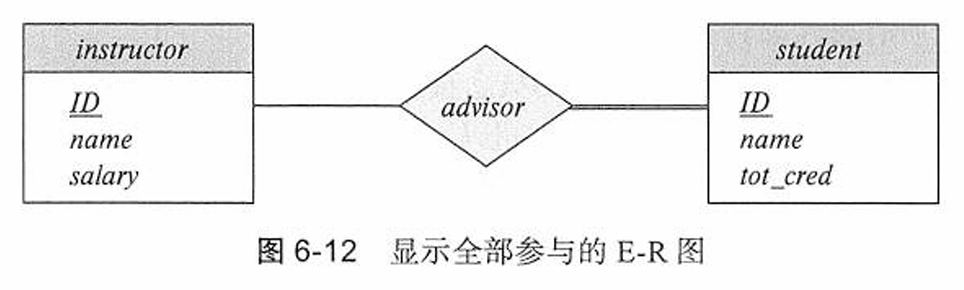

双线表示学生必须有导师

### 基数显示

线段上可以有一个关联的最小和最大基数，用 $l..h$ 的形式表示，其中 $l$ 表示最小基数，$h$ 表示最大基数。

* 最小值为 1 表示实体集全部参与联系集，即实体集中的每个实体在该联系集中的至少一个联系中出现。
* 最大值为 1 表示实体至多参与一个联系，而最大值为 $*$ 代表没有限制。

advisor 和 instructor 之间的线段有 $0..*$ 的限制，说明一位教师可以有零名或多名学生。因此，advisor 联系是从 instructor 到 student 的一对多联系，更进一步地讲，student 在 advisor 中的参与是全部的，这意味着一名学生必须有一位导师。

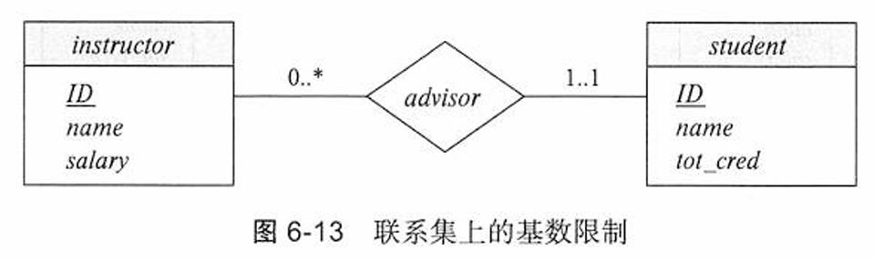

# 6.5 主键

## 6.5.1 实体集

主键：一个实体的属性取值必须可以唯一标识该实体

## 6.5.2 联系集

设$R$是一个涉及实体集$E_1, E_2, \dots, E_n$的联系集。设$\text{primary-key}(E_i)$代表构成实体集$E_i$的主码的属性集合。现在假设所有主码的属性名是互不相同的。联系集主码的构成依赖于与联系集$R$相关联的属性集合。

如果联系集$R$没有属性与之相关联，那么属性集合

$$
\text{primary-key}(E_1) \cup \text{primary-key}(E_2) \cup \dots \cup \text{primary-key}(E_n)
$$

描述了集合$R$中一个单独的联系，也就是属性集中的**超键**

如果联系集$R$有属性$a_1, a_2, \dots, a_m$与之相关联，那么属性集合

$$
\text{primary-key}(E_1) \cup \text{primary-key}(E_2) \cup \dots \cup \text{primary-key}(E_n) \cup \{a_1, a_2, \dots, a_m\}
$$

描述了集合$R$中一个单独的联系。

### 主键选取

二元联系集主码的选择取决于联系集的映射基数。

对于**多对多关系**，前述**主码的并集**是**最小的超码，并被选作主码**。作为一个示例，考虑6.2.2节中的$instructor$和$student$实体集以及$advisor$联系集。假设联系集是多对多的，那么$advisor$的主码由$instructor$和$student$的主码的并集构成。

对于**一对多和多对一关系**，**“多”方的主码是最小的超码，并被用作主码**。例如，如果从$student$到$instructor$的联系是多对一的，即每名学生最多只能有一位导师，则$advisor$的主码就仅是$student$的主码。而如果一位教师只能指导一名学生，即$advisor$联系是从$instructor$到$student$的多对一联系，则$advisor$的主码就仅是$instructor$的主码。

对于**一对一的联系**，**任一参与实体集的主码**都构成最小超码，并且可以**选择任意一个作为联系集的主码**。但是，如果一位教师只能指导一名学生，并且每名学生只能由一位教师指导，也就是说，如果$advisor$联系是一对一的，那么，可以选择$student$或$instructor$的主码作为$advisor$的主码。

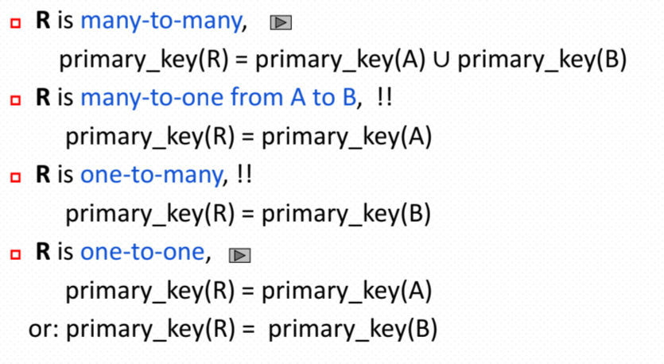

## 6.5.3 弱实体集

弱实体集（weak entity set）的存在依赖标识性实体集（identifying entity set)

使用**标识性实体集的主码**以及称为分辨符属性（discriminator attribute）的**额外属性**来唯一地标识弱实体

因此，下图中的主键就是 `{course _id, sec_id, year, semester}`

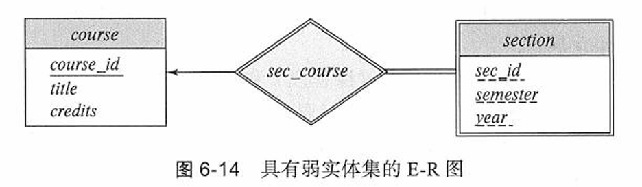

**弱实体集**在联系中的参与是全部的，并且该联系是到标识性实体集的多对一联系。
**标识性联系集**不应该有任何描述性属性。

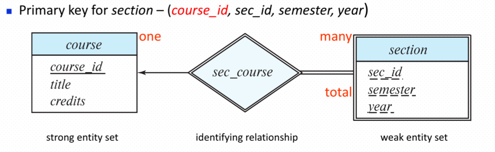

# 6.6 从实体集中删除冗余属性（承接上部分主键合并）

不同实体集中的属性存在冗余，并需要将其从原始实体集中删除

## 6.6.1 复杂属性处理

* 复合属性：直接展开
* 多值属性：构建新关系模式
* 派生属性：直接忽略

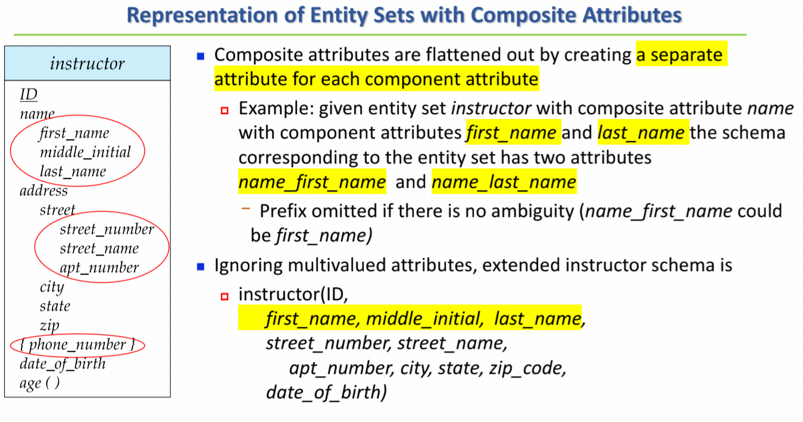

剩下详情请见 **6.7关系模式**

# 6.7 将 E-R 图转换为关系模式

## 6.7.1 具有复杂属性的强实体集的表示

从具有复杂属性的$instructor$实体集的版本转换而来的、不包含多值属性的关系模式是这样的：

```
instructor (ID, first_name, middle_initial, last_name,
            street_number, street_name, apt_number,
            city, state, postal_code, date_of_birth)
```

对于一个多值属性$M$，我们构建关系模式$R$，该模式具有一个对应于$M$的属性$A$，以及对应于$M$所在的实体集或联系集的主码的属性。

考虑图6-8中的E-R图，它描述了包含$phone\_number$多值属性的$instructor$实体集。$instructor$的主码是$ID$。对于这个多值属性，我们构建一个关系模式：

```
instructor_phone (ID, phone_number)
```

## 6.7.2 弱实体集的表示

对于从弱实体集转换而来的模式，该模式的主码由其强实体集的主码与弱实体集的分辨符组合而成

作为一个示例，考虑图6-15的E-R图中的$section$弱实体集。该实体集有属性：$sec\_id$、$semester$和$year$。$section$所依赖的$course$实体集的主码是$course\_id$。因此，我们用具有以下属性的模式来表示$section$：

```
section (course_id, sec_id, semester, year)
```

## 6.7.3 模式冗余

### 多对多

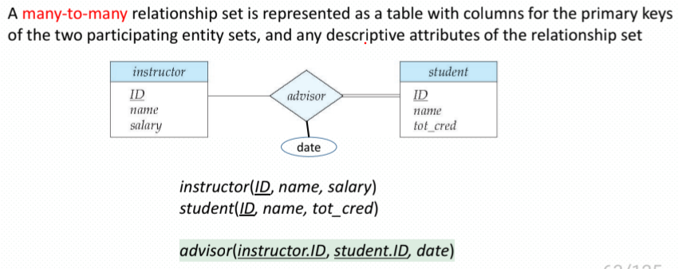

### 一对多/多对一

多方添加单方的主键，作为外键约束

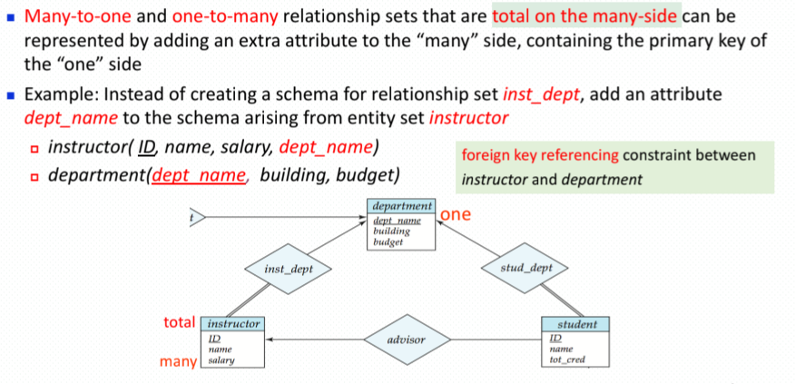

### 一对一

双方都可以选一个的主键添加到另外一方

# 6.8 扩展的 E-R特性

## 6.8.1 特化

特化（specialization)：在实体集**内部进行（细分）** 分组的过程（自顶向下）

描述特化的方式取决于一个实体是否可以属于多个特化实体集，或者它是否必须属于至多一个特化实体集

* 前者（允许多个集合）称为重叠特化（overlapping specialization)
* 后者（允许至多一个集合）称为不相交特化（disjoint specialization)

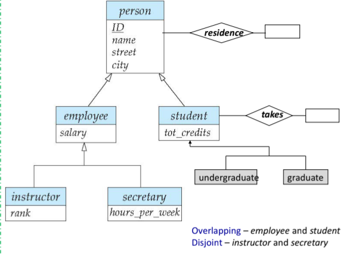

## 6.8.2 概化

概化：在一个高层（higher-level ）实体集与一个或多个低层（lower-level ）实体集之间存在的包含联系
