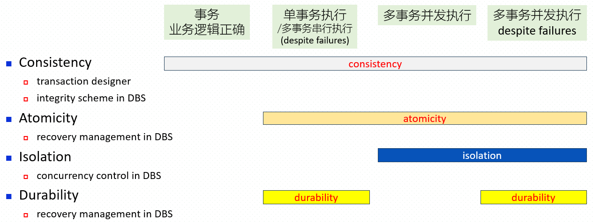
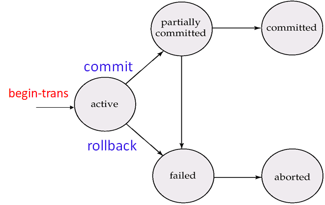
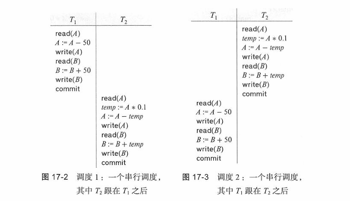
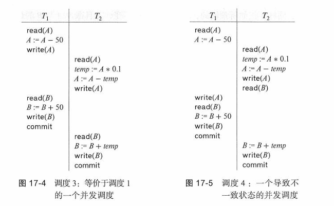
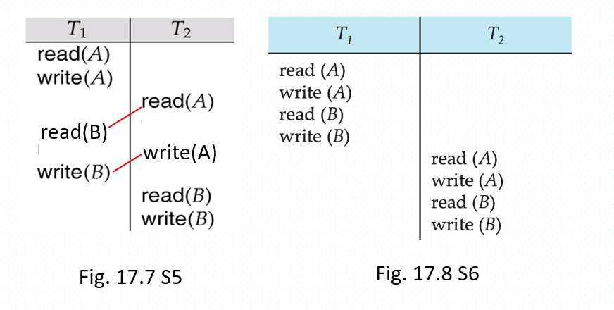
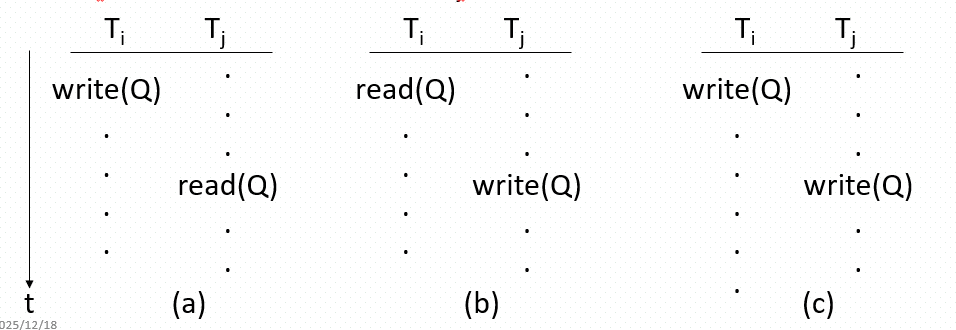
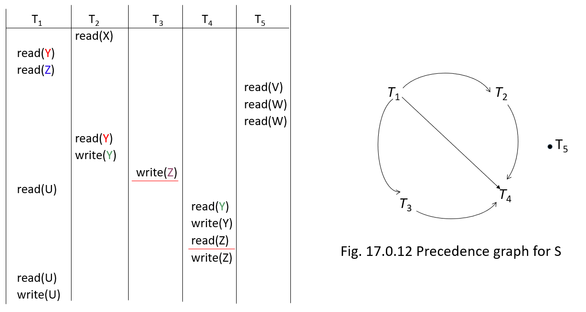

————*Gypsophila: “You know, I think I understand now. Even if we can't be together, just being able to see you is enough for me.”*

构成单一逻辑工作单元的操作集合称作事务。

# 17.1 事务的概念

事务（transaction）：访问并可能更新各种数据项的一个程序执行单元（unit)，是不可分割最小工作单元，事务内全部DB访问操作，要么全部成功执行，要么全部失败

ACID：

* **原子性（atomicity)：**
  * 事务是不可分割的，要么执行其全部操作，要么就根本不执行
* **一致性（consistant）：**
  * 如果事务从一个一致的数据库开始以原子方式隔离地运行，那么该数据库在事务结束时必须重新保持一致
* **隔离性（isolation)：**
  * 不能被并发干扰
* **持久性（durability)：**
  * 系统会记忆操作
* 
* 

# 17.2 一个简单的事务模型

概念要点：

- 事务中的每一次数据访问（比如SQL中的select、Update，或是ODBC中的API），都会被DBMS转换/分解为一个或多个 `read`和 `write`操作
- 参考图17.0.3
- DBMS会执行这些 `read`和 `write`操作，以完成事务中的数据访问
- 对于每个事务，DBMS会在主存中分配一个**本地缓冲区（local buffer）**，作为该事务的工作区域
- 数据库永久存储在磁盘上，但其中的部分数据会临时存放在主存的**磁盘缓冲区（disk buffer）** 中

### 读写-buffer模型

事务采用以下两种操作来访问数据：

- $\text{read}(X)$，从数据库数据项$X$传送给一个也称为$X$的变量，$X$位于属于执行$\text{read}$操作的事务的主缓冲区中。
- $\text{write}(X)$，从执行$\text{write}$的事务的主缓冲区中把变量$X$的值传送给数据库中的数据项$X$。
- 在实际的数据库系统中，事务发起的 `write`操作不一定会立即更新磁盘上的数据，该操作可能会临时存储在系统缓冲区中，之后再执行磁盘写入

### ACID特性

- **原子性（Atomicity）**：事务的所有操作要么全部正确地反映到数据库中，要么一个都不反映。
- **一致性（Consistency）**：事务在隔离执行的情况下，能保持数据库的一致性。
- **隔离性（Isolation）**：尽管多个事务可能并发执行，但每个事务必须感知不到其他并发执行的事务。事务的中间结果必须对其他并发执行的事务隐藏。
  - 也就是说，对于任意一对事务$T_i$和$T_j$，在$T_i$看来，要么$T_j$在$T_i$开始前就已执行完毕，要么$T_j$在$T_i$结束后才开始执行——好像两者串行执行。
- **持久性（Durability）**：事务成功完成后，它对数据库所做的修改会永久保留，即使发生系统故障也不会丢失。

# 17.3 存储器结构（略）

* 易失性存储器（volatile storage)
* 非易失性存储器（non-volatile storage)
* 稳定存储器（stable storage)

# 17.4 事务的原子性和持久性

基础概念：

- 若事务成功完成执行，则称该事务已**提交（committed）**
- 若事务无法成功完成执行，则称该事务已**夭折（aborted）**
- 一旦夭折事务造成的修改被**撤销（undone）**，则称该事务已**回滚（rollback）**
- 若事务要么已提交、要么已夭折，则称该事务已**结束（terminated）**
- 成功完成执行的事务，会将 `commit`指令作为最后一条语句
- 未能成功完成执行的事务，会将 `abort`指令作为最后一条语句

## 17.4.1 事务状态

- **活跃（Active）**——初始状态；事务在执行期间处于此状态
- **部分提交（Partially committed）**——在最后一条语句（例如 `commit`）执行完成后
- **失败（Failed）**——在发现无法继续正常执行之后
- **夭折/中止（Aborted）**——在事务被回滚、且数据库恢复到事务开始前的状态之后
  - 可重启（restart）：重启的事务被看成一个新事务。
  - 可杀死（kill ）：通过重写应用程序改正错误
- **提交（Committed）**——在事务成功完成之后

* 已提交/中止：终止（terminated）

# 17.5 事务的隔离性

- 一组事务的并发执行可以实现：

  - 高吞吐量与资源利用率，减少等待时间
  - 例如：多用户票务订购系统
- 事务并发执行的缺点：

  - 对于包含共享数据操作的一组事务，不同的调度方式（串行、并发）可能导致所有事务结束后，数据库的最终状态不同
    - 会出现竞争条件吗？例如 `count++`、`count--`，这与操作系统中的场景类似
- 因此需要并发控制机制与事务调度策略

## 调度

- **调度（schedule）** 是由DBMS并发控制组件编排的一组并发事务的执行序列，它指定了并发事务的指令/操作的执行时间顺序

  - 一组事务的调度必须包含这些事务的**所有**指令
  - 必须保留每个事务内部指令原有的出现**顺序**
- 串行调度（Serial schedules）、并发调度（concurrent schedules）

### 串行调度

这里考虑简化银行系统，其中有多个账户以及一组存取和更新这些账户的事务。令$T_1$和$T_2$是将资金从一个账户转移到另一个账户的两个事务。事务$T_1$从账户$A$转$50到账户$B$，它被定义为：

$$
\begin{align*}
T_1: &\ \text{read}(A); \\
&\ A := A - 50; \\
&\ \text{write}(A); \\
&\ \text{read}(B); \\
&\ B := B + 50; \\
&\ \text{write}(B).
\end{align*}
$$

事务$T_2$从账户$A$将存款余额的10%转到账户$B$。它被定义为：

$$
\begin{align*}
T_2: &\ \text{read}(A); \\
&\ \text{temp} := A * 0.1; \\
&\ A := A - \text{temp}; \\
&\ \text{write}(A); \\
&\ \text{read}(B); \\
&\ B := B + \text{temp}; \\
&\ \text{write}(B).
\end{align*}
$$

### 并行调度

相比之下，S3给出了正确的答案，S4错了：

- 在S3中，T1和T2**串行**访问共享数据A和B

  - 对于共享数据A和B来说，S3的执行结果与串行调度S1相同，且S3与串行调度S1**等价**
- 在S4中

  - T1和T2以**交错**的方式操作共享数据A和B
  - S4的执行结果与串行调度S1不同，且与串行调度S1**不等价**
  - S4会使数据库处于**不一致**状态，隔离性与一致性都被破坏了

# 17.6 可串行化

可串行化：并发调度的正确性标准

* 冲突可串行
* 视图可串行

简化为冲突可串行化（conflict serializability），并只考虑read和write指令，此时需要考虑的情况：

1. $I = \text{read}(Q),\ J = \text{read}(Q)$。$I$与$J$的次序无关紧要，因为不论该次序如何，$T_i$与$T_j$读取的$Q$值总是相同的。
2. $I = \text{read}(Q),\ J = \text{write}(Q)$。若$I$先于$J$，则$T_i$不会读取到由$T_j$在指令$J$中所写入的$Q$值。若$J$先于$I$，则$T_i$读取到由$T_j$所写入的$Q$值。因此，$I$与$J$的次序是重要的。
3. $I = \text{write}(Q),\ J = \text{read}(Q)$。$I$与$J$的次序是重要的，其原因与前一种情况类似。
4. $I = \text{write}(Q),\ J = \text{write}(Q)$。由于两条指令均为$\text{write}$操作，这些指令的次序对$T_i$与$T_j$并没有什么影响。然而，$S$的下一条$\text{read}(Q)$指令所读取的值将受到影响，因为数据库里只保留两条$\text{write}$指令中后一条的结果。如果在$S$的指令$I$与$J$之后再没有其他的$\text{write}(Q)$指令，则$I$与$J$的次序直接影响由调度$S$所产生的数据库状态中$Q$的最终值。

因此，只有在$I$与$J$全为$\text{read}$指令的情况下，两条指令执行的相对顺序才是无关紧要的。

- 将$T_1$的$\text{read}(B)$指令与$T_2$的$\text{read}(A)$指令进行交换。
- 将$T_1$的$\text{write}(B)$指令与$T_2$的$\text{write}(A)$指令进行交换。
- 将$T_1$的$\text{write}(B)$指令与$T_2$的$\text{read}(A)$指令进行交换。

经过这些交换的最终结果是一个串行调度，即图17-8 所示的调度 6。

### 总结要点

* 如果调度$S$可以经过一系列非冲突指令的交换而转换成调度$S'$，则称$S$与$S'$是冲突等价的。
* 若一个调度$S$与一个串行调度是冲突等价的，则称调度$S$是冲突可串行化的。

## 17.6.1 冲突可串行化判断（比较重要）

### 前驱图

给定一组事务$T_1, T_2, ..., T_n$的调度$S$，$S$的前趋图（precedence graph）$G(S)=(V,E)$定义为：

- 一个有向图$G=(V,E)$，其中顶点是各个事务
- 存在一条从$T_i$指向$T_j$的弧$T_i \rightarrow T_j$，当且仅当满足以下三个条件之一：
  - $T_i$执行$\text{write}(Q)$的操作早于$T_j$执行$\text{read}(Q)$的操作
  - $T_i$执行$\text{read}(Q)$的操作早于$T_j$执行$\text{write}(Q)$的操作
  - $T_i$执行$\text{write}(Q)$的操作早于$T_j$执行$\text{write}(Q)$的操作

### 判断方法

* 如果关于S的优先图中**有环**，则调度S是**非冲突可串行化**的；
* 如果优先图中**无环**，则调度S是**冲突可串行化**的。

#### 1. 关注数据项 **$Y$**

* **$T_1$ 先执行了 `read(Y)`** 。
* 随后， **$T_2$ 执行了 `write(Y)`** 。
* **冲突点** ：读-写冲突。由于 **$T_1$** 在前，**$T_2$** 在后，产生边： **$T_1 \to T_2$** 。
* 紧接着， **$T_4$ 执行了 `write(Y)`** 。
* **冲突点** ：**$T_2$** 的写与 **$T_4$** 的写冲突。由于 **$T_2$** 在前，产生边： **$T_2 \to T_4$** 。

#### 2. 关注数据项 **$Z$**

* **$T_1$ 先执行了 `read(Z)`** 。
* 随后， **$T_3$ 执行了 `write(Z)`** 。
* **冲突点** ：读-写冲突。**$T_1$** 在前，**$T_3$** 在后，产生边： **$T_1 \to T_3$** 。
* 再往后， **$T_4$ 执行了 `write(Z)`** （虽然中间有 `read(Z)`，但关键是写）。
* **冲突点** ：**$T_3$** 的写先于 **$T_4$** 的写。产生边： **$T_3 \to T_4$** 。

#### 3. 关注数据项 **$U, V, W, X$**

* **$U$** ：只有 **$T_1$** 在操作（读和写），没有跨事务冲突。
* **$V, W$** ：只有 **$T_5$** 在读，没有写操作，不构成冲突。
* **$X$** ：只有 **$T_2$** 在读，没有冲突。

#### 总结结果：

通过以上分析，我们得到了图中所有的有向边：

* **$T_1 \to T_2$**
* **$T_2 \to T_4$**
* **$T_1 \to T_3$**
* **$T_3 \to T_4$**
* 以及隐藏的 **$T_1 \to T_4$**（因为 **$T_1$** 读了 **$Y$**，**$T_4$** 后来写了 **$Y$**；**$T_1$** 读了 **$Z$**，**$T_4$** 后来写了 **$Z$**）。

# 17.7 事务的隔离性和原子性
