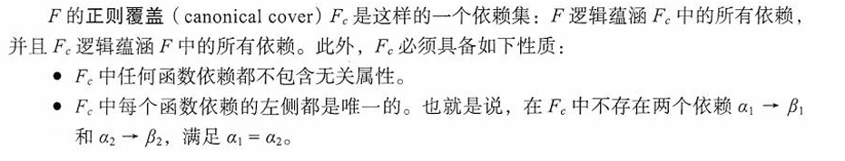
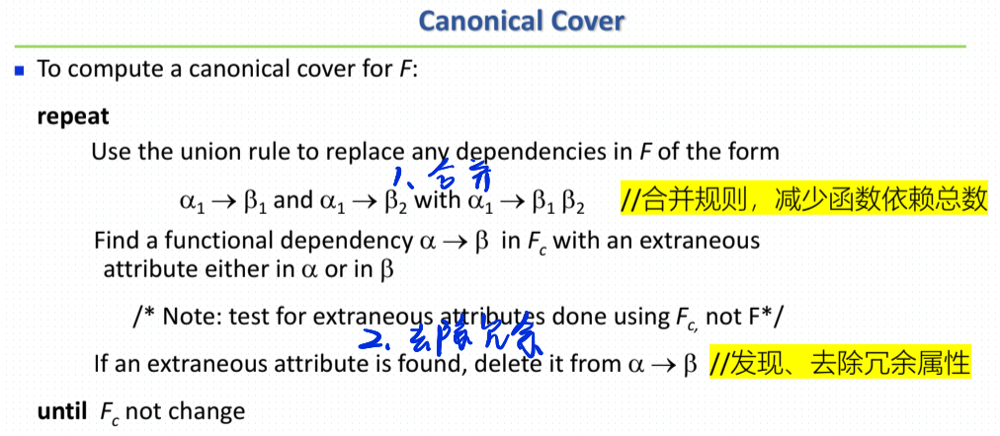
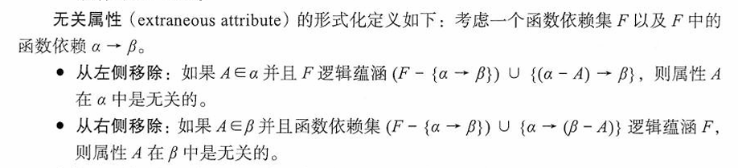
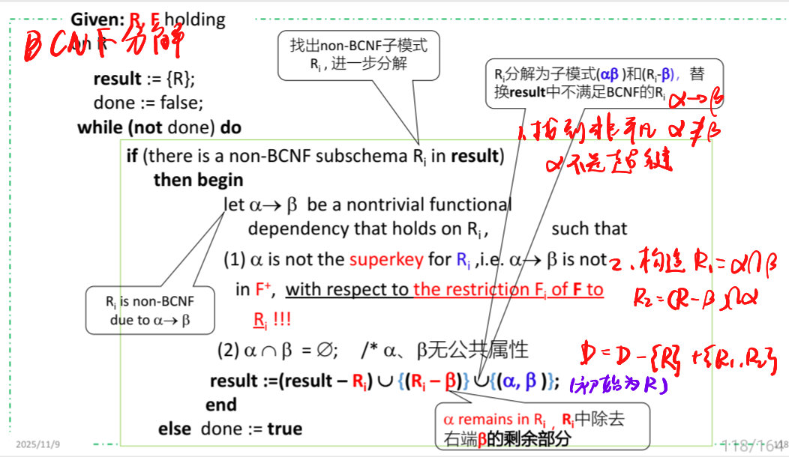
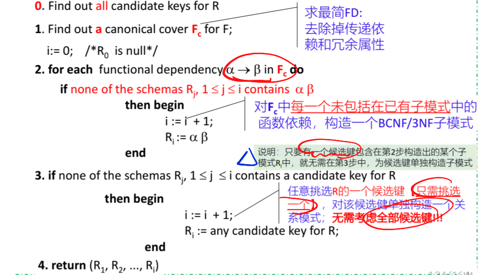

*FIRST STAGE*

一般而言，关系数据库设计的目标是生成一组关系模式，使得我们存储信息时避免不必要的冗余，并且让我们可以轻松地获取信息。 这是通过设计满足适当**范式（normal form）**的模式来实现的。 为了确定一个关系模式是否属于理想的范式，我们需要用数据库建模的真实企业的相关信息。 某些信息存在于设计良好的E-R图中，但是可能还需要关于该企业的额外信息。

# 7.1 好的关系设计特点

## 7.1.1 分解

解决信息重复问题的唯一方式是将其分解为两个模式

```
employee (ID, name, street, city, salary)
```

分解为以下两个模式：

```
employee1 (ID, name)
employee2 (name, street, city, salary)
```

## 7.1.2 有损分解

有损分解：分解后不能通过子关系恢复完整的原始数据，可能导致冗余或丢失的信息。

> 将一个关系分解成多个子关系后，不能通过自然连接将这些子关系合并回原始关系，并且在这个过程中丢失了一些信息。也就是说，分解后的子关系无法完全恢复原始的关系，某些数据会丢失。

## 7.1.3 无损分解

### 概念

无损分解：从分解后的子关系中可以无损地重建原始的关系

> 将一个关系分解成多个子关系时，能够通过自然连接（自然连接是基于公共属性的连接方式）将所有分解后的子关系合并回原始关系，且不丢失任何信息。

**条件：分解后的子关系的公共属性（也称为交集）能够确定至少一个原始关系的主键。**

* 如果一个关系被无损地分解成多个子关系，那么可以保证没有信息丢失，所有的数据都可以通过子关系合并恢复。
* 关键在于分解后的关系能保留原始关系的所有数据

### 定义

令$R$为关系模式，并令$R_1$和$R_2$构成$R$的分解——也就是说，将$R$、$R_1$和$R_2$视为属性集，$R=R_1 \cup R_2$。

如果用两个关系模式$R_1$和$R_2$去替代$R$时没有信息丢失，则我们称该分解是一个无损分解（lossless decomposition）。

```sql
select *
from (select R_1 from r)
     natural join
     (select R_2 from r)
```

这可以用关系代数更简洁地表示为：

$$
\Pi_{R_1}(r) \bowtie \Pi_{R_2}(r) = r
$$

### 判定（重点，下一部分也有）

假设我们有一个关系$R$，它被分解为两个子关系$R_1$和$R_2$，其中：

* $R = R_1 \cup R_2$
* $R_1 \cap R_2$是$R_1$和$R_2$之间的公共属性集

无损连接的条件是：
如果$(R_1 \cap R_2) \rightarrow R_1$或者$(R_1 \cap R_2) \rightarrow R_2$，
则$R_1$和$R_2$的分解是无损连接的。

这里的箭头$\rightarrow$表示“函数依赖”关系，即左边的属性集能够决定右边的属性集。

# 7.2 使用函数依赖进行分解

## 7.2.1 键和函数依赖

### 超键

在2.3节中，我们将超码的概念定义为能够一起来唯一标识出关系中一个元组的一个或多个属性的集合。我们在这里重新表述该定义如下：

> 给定$r(R)$，在$r(R)$的任意合法实例中，对于$r$的实例中的所有元组对$t_1$和$t_2$总满足：若$t_1 \neq t_2$，则$t_1[K] \neq t_2[K]$。
>
> 此时称：$R$ 的一个子集$K$是$r(R)$的超码（superkey）

也就是说，在关系$r(R)$的任意合法实例中，不存在两个元组在属性集$K$上具有相同的值。如果在$r$中没有两个元组在$K$上具有相同的值，那么在$r$中一个$K$值就能**唯一标识出一个元组**。

### 函数依赖

函数依赖（Functional Dependency，简称FD）是关系数据库理论中的一个核心概念，用来描述属性之间的约束关系。在关系数据库中，**函数依赖**是指一种属性或属性集能够唯一确定另一个属性或属性集的关系。

#### 定义

考虑一个关系模式$r(R)$，并且令$\alpha \subseteq R$且$\beta \subseteq R$。

函数依赖（functional dependency）$\alpha \rightarrow \beta$：

> 给定$r(R)$的一个实例，如果对于该实例中的所有元组对$t_1$和$t_2$，使得若$t_1[\alpha] = t_2[\alpha]$，则$t_1[\beta] = t_2[\beta]$也成立，那么我们称该实例满足（satisfy）函数依赖

换句话说，**函数依赖**表示，给定某些属性（即决定属性集 $\alpha$），就能够唯一地确定另一些属性（即被决定属性集 $\beta$）的值。

如果$r(R)$的每个合法实例都满足函数依赖$\alpha \rightarrow \beta$，则我们称该函数依赖在模式$r(R)$上成立（hold）。

#### 函数依赖成立

当我们说函数依赖在模式$r(R)$上成立，我们意味着对于所有的合法实例（即符合该模式约束的所有数据实例），都必须满足这个函数依赖。

例如，如果我们说$\alpha \rightarrow \beta$在模式$r(R)$上成立，那么无论我们如何插入或更新数据，只要数据遵循该模式，都必须满足：在任何两个元组中，如果它们在属性集$\alpha$上的值相同，那么它们在属性集$\beta$上的值也必然相同。

#### 平凡依赖（trivial）

如果对于关系模式$r(R)$，存在属性集$\alpha$和$\beta$使得：

$$
\alpha \rightarrow \beta
$$

是一个平凡依赖，那么这一定成立，当且仅当$\beta \subseteq \alpha$。

换句话说，平凡依赖是指一个属性集（或者属性集的子集）决定它自己的一个子集。

#### 闭包

$F^＋$ 来表示集合 $F$ 的闭包（closure)

## 7.2.3 无损分解与函数依赖

令$R、R_1、R_2$和$F$如上所述。$R_1$和$R_2$构成$R$的一个无损分解的条件是，以下函数依赖中至少有一个是在$F^+$中：

* $R_1 \cap R_2 \rightarrow R_1$
* $R_1 \cap R_2 \rightarrow R_2$

换句话说，如果$R_1 \cap R_2$要么构成$R_1$的超码要么构成$R_2$的超码，则$R$的该分解就是一个无损分解。

### 例子

假设我们将一个关系模式$r(R)$分解为$r_1(R_1)$和$r_2(R_2)$，其中$R_1 \cap R_2 \rightarrow R_1$，那么一定存在以下约束：

* $R_1 \cap R_2$是$r_1$的主码。
  此约束强制实施该函数依赖性。
* $R_1 \cap R_2$是从$r_2$引用$r_1$的外码。

这个约束确保$r_2$中的每个元组在$r_1$中都有一个匹配元组，如果没有这个匹配元组，它就不会出现在$r_1$和$r_2$的自然连接中。

# 7.3 范式

## 7.3.1 第一范式 (1NF)

第一范式强调每个字段都必须是不可分割的**原子值**。换句话说，表中的每一列都必须只包含单一的值，而不能包含集合、数组或其他复合数据结构。如果一个表在每一列都是原子值的情况下，它就满足了第一范式。

 **例子** ：

假设有一个学生表 `学生(学号, 姓名, 电话号码)`，其中一个学生可能有多个电话号码。如果电话号码存储为“`1234567890, 9876543210`”这种形式，那么这表明电话号码不符合原子性要求。为使其符合 1NF，应将每个电话号码拆分成多个行，每行只包含一个电话号码。

### 判别标准

* 每个列中的值必须是原子的，即每个字段只能包含一个值，而不是一组值（如数组、列表等）。
  （无多值属性）
* 关系中的每个元组必须是唯一的。

## 7.3.2 第二范式（2NF）

> 一个关系处于第二范式（2NF）当且仅当它处于第一范式（1NF），并且每个非主属性完全依赖于每个候选键。

第二范式的核心要求是避免 **部分依赖** ，即非主属性不能只依赖于候选键的一部分。它要求每个非主属性完全依赖于整个候选键。

计算出候选键（主键）后，再对当前所有表达式进行计算判断是否有部分依赖的情况发生

## 7.3.3 第三范式（3NF）

> 一个关系处于第三范式（3NF）当且仅当它处于第二范式（2NF），并且没有 **传递依赖** 。

第三范式的核心要求是避免 **传递依赖** ，即非主属性不应该依赖于其他非主属性。如果一个非主属性依赖于另一个非主属性，而不是直接依赖于候选键，则产生了传递依赖。

### 判别标准

三选一：

1. 平凡依赖：如果$\beta \subseteq \alpha$（即右边是左边的子集），则称这个依赖是平凡的。对于平凡依赖，显然它总是成立，因此它自然满足3NF。
2. 超键依赖：如果$\alpha$是候选键（即超键），则这个依赖满足3NF。换句话说，如果决定属性集$\alpha$是超键（可以唯一地识别每个元组），则$\alpha \rightarrow \beta$这个依赖满足3NF。
3. 右侧是主属性：如果$\beta$中的所有属性都是主属性（即它们是候选键的一部分），那么这个依赖也满足3NF。主属性是指在候选键中出现的属性。

## 7.3.4 BCNF

BCNF相对于 3NF 更严格一些，在 BCNF 中， **每个决定性属性集都必须是候选键** ，即不存在除了候选键之外的属性集决定其他属性。

### 判别标准

二选一：

* 平凡依赖：如果$\beta \subseteq \alpha$（即右边是左边的子集），则称这个依赖是平凡的。对于平凡依赖，显然它总是成立，因此它自然满足BCNF。
* 超键依赖：如果$\alpha$是候选键（即超键），则这个依赖满足BCNF。换句话说，如果决定属性集$\alpha$是超键（可以唯一地识别每个元组），则$\alpha \rightarrow \beta$这个依赖满足BCNF。

# 7.4 函数依赖理论

## 函数依赖SQL语句判断（重点）

## 7.4.1 函数依赖集的闭包

### 阿姆斯特朗公理（Armstrong 's axiom)

* 自反律（reflexivity rule）：若$\alpha$为一个属性集且$\beta \subseteq \alpha$，则$\alpha \rightarrow \beta$成立。
* 增补律（augmentation rule）：若$\alpha \rightarrow \beta$成立且$\gamma$为一个属性集，则$\gamma\alpha \rightarrow \gamma\beta$成立。
* 传递律（transitivity rule）：若$\alpha \rightarrow \beta$成立且$\beta \rightarrow \gamma$成立，则$\alpha \rightarrow \gamma$成立。

定理拓展：

* 合并律（union rule）：若$\alpha \rightarrow \beta$成立且$\alpha \rightarrow \gamma$成立，则$\alpha \rightarrow \beta\gamma$成立。
* 分解律（decomposition）：若$\alpha \rightarrow \beta\gamma$成立，则$\alpha \rightarrow \beta$成立且$\alpha \rightarrow \gamma$成立。
* 伪传递律（pseudotransitivity rule）：若$\alpha \rightarrow \beta$成立且$\gamma\beta \rightarrow \delta$成立，则$\alpha\gamma \rightarrow \delta$成立。

## 7.4.2 属性集的闭包

如果$\alpha \rightarrow B$，我们就称属性$B$被$\alpha$函数决定（functionally determine）

将函数依赖中能够推导的属性加入集合，这就是属性闭包

## 7.4.3 正则覆盖（重点）

正则覆盖是给定一组函数依赖集$F$，通过某些规则对其进行简化，得到一个等价的更简洁的函数依赖集$F'$，而不丢失任何推导出的函数依赖关系。简而言之，正则覆盖通过去除冗余依赖或合并依赖来“覆盖”原函数依赖集。



#### 正则覆盖的要求

1. **等价性**：简化后的函数依赖集$F'$与原依赖集$F$等价，即两者可以推导出相同的所有函数依赖。
2. **简化性**：简化后的依赖集$F'$尽量包含更少的依赖，且每个依赖都不会多余或冗余。

### 7.4.3.1 具体规则

在数据库中，正则覆盖是对函数依赖集的简化优化方式，核心是通过**循环以下规则**得到更简洁且等价的依赖集：（合并+消除）

1. 删除冗余依赖

若某函数依赖$\alpha \rightarrow \beta$在依赖集$F$中是“多余”的（即去掉该依赖后，剩余集合仍能推导出$\alpha \rightarrow \beta$），则可删除该依赖，不影响依赖集的推导能力。

2. 删除冗余属性

对于函数依赖$\alpha \rightarrow \beta$，若$\alpha$中存在属性集$\gamma$，使得去掉$\gamma$后的$\alpha-\gamma$仍能决定$\beta$（即$\alpha-\gamma \rightarrow \beta$成立），则$\gamma$是冗余属性，可从$\alpha$中删除以简化决定因素。

3. 合并依赖

若存在两个依赖$\alpha \rightarrow \beta$和$\alpha \rightarrow \gamma$，可将其合并为$\alpha \rightarrow \beta \cup \gamma$，前提是合并后的依赖与原两个依赖等价。

4. 最小化右侧属性

若函数依赖的右侧$\beta$包含多个属性，可尝试拆分为多个单属性的依赖；若拆分后仍能推导原结果，则说明这些依赖可通过合并/简化优化。

**核心作用**：正则覆盖通过上述规则，在保持依赖集推导能力不变的前提下，减少依赖数量、简化依赖形式，提升数据库设计中函数依赖分析的效率与清晰度。



### 7.4.3.2 合并依赖

若存在两个依赖$\alpha \rightarrow \beta$和$\alpha \rightarrow \gamma$，可将其合并为$\alpha \rightarrow \beta \cup \gamma$，前提是合并后的依赖与原两个依赖等价。

### 7.4.3.3 去除冗余



#### 左侧去除

目标：判断在函数依赖$\alpha \rightarrow \beta$中，左端属性$A \in \alpha$是否是冗余的。

判断：

$$
\alpha \rightarrow A under F'
$$

其中

$$
F' = (F - \{\alpha \rightarrow \beta\}) \cup \{\alpha \rightarrow (\beta - A)\}
$$

**操作步骤：**

1. 假设移除属性$A$，得到新的左端$\gamma = \alpha - \{A\}$。
2. 测试条件：检查在函数依赖集$F$下，新的函数依赖$\gamma \rightarrow \beta$是否成立，具体操作是计算$\gamma^+$（$\gamma$的闭包）。
3. 如果$\beta \subseteq \gamma^+$，则说明移除$A$后，依赖$\gamma \rightarrow \beta$仍然成立，$A$是冗余的。

**结论：**

* 如果$\beta \subseteq \gamma^+$成立，则$A$是左端冗余属性，可以用$\gamma \rightarrow \beta$替换原依赖$\alpha \rightarrow \beta$。

#### 右侧去除

目标：判断在函数依赖$\alpha \rightarrow \beta$中，右端属性$A \in \beta$是否是冗余的。

即：

$$
(\alpha - A) \rightarrow \beta under F？
$$

**操作步骤：**

1. 构造新依赖集$F'$：移除待测试的依赖$\alpha \rightarrow \beta$，并加入移除$A$后的新依赖$\alpha \rightarrow (\beta - \{A\})$。
2. 测试条件：在新的依赖集$F'$下，检查是否仍能推导出$\alpha \rightarrow A$。
3. 计算$\alpha^+$（$\alpha$的闭包）在$F'$下是否包含$A$。

**结论：**

* 如果$A \in \alpha^+$成立，则$A$是右端冗余属性，可以用$\alpha \rightarrow (\beta - \{A\})$替换原依赖$\alpha \rightarrow \beta$。
* 如果$A$是唯一的右端属性且冗余，则直接移除$\alpha \rightarrow A$。

## 7.4.4 保持依赖

如果关系模式$R$被分解成多个子关系模式$R_1, R_2, \dots, R_n$，我们需要确保，原始的函数依赖集$F$在新的分解中仍然得到保持，即分解后的函数依赖集$F'$能够推导出原始依赖集$F$中的所有依赖。

### 1. 依赖保持的验证

* **目标**：验证分解后的依赖集$F'$是否能保持原始依赖集$F$中的所有依赖。
* **步骤**：对每个$\alpha \rightarrow \beta \in F$，计算$F'$下$\alpha$的闭包，如果闭包包含$\beta$，则说明该依赖被保持。
* **结果**：只有当所有依赖都被验证保持时，分解才是依赖保持的。

### 2. 优化属性闭包算法

* **目标**：避免直接计算$F'$的闭包，从而提高效率。
* **步骤**：逐个计算每个子关系模式$R_i$下的闭包，并与当前结果交集，更新结果，直到遍历所有子关系模式。

# 7.5 使用函数依赖的分解算法

## 7.5.1 BCNF 分解

### 7.5.1.1 BCNF 检测

在某些情况下，检测一个关系模式$R$是否满足BCNF可以做如下简化：

* 为了检查一个**非平凡**的依赖$\alpha \rightarrow \beta$是否违反BCNF，可以计算$\alpha^+$（$\alpha$的属性闭包），并且验证它是否包含了$R$中的所有属性
  * 也就是说，**验证它是否是$R$的一个超码**。
* 为了检查一个关系模式$R$是否属于BCNF，仅需检查给定集合$F$中的依赖是否违反BCNF就足够了，而不用检查$F^+$中的所有依赖。

BCNF的另一种可替代测试有时会比计算$F^+$中的所有依赖更为简单。为了检查$R$分解后的一个关系模式$R_i$是否属于BCNF，我们应用这样的测试：

* 对于$R_i$中属性的每个子集$\alpha$，检查$\alpha^+$（$F$下$\alpha$的属性闭包）要么不包含$R_i - \alpha$的任何属性，要么包含$R_i$的所有属性。

如果$R_i$中有某个属性集$\alpha$违反了该条件，则考虑如下的函数依赖（可以证明它出现在$F^+$中）：

$$
\alpha \rightarrow (\alpha^+ - \alpha) \cap R_i
$$

这个函数依赖说明$R_i$违反了BCNF。

### 7.5.1.2 BCNF 分解算法

```BCNF
result := {R};
done := false;
while (not done) do
    if (在result中存在一个模式R_i不属于BCNF)
    then begin
        令α→β为在R_i上成立的一个非平凡函数依赖，使得α⁺并不包含R_i，
        并且α∩β = ∅；
        result := (result - {R_i}) ∪ {R_i - β} ∪ {(α, β)};
    end
    else done := true;
```

| **步骤**   | **核心操作/循环**                 | **重要的判断信息**                                                                                                                                      |
| ---------------- | --------------------------------------- | ------------------------------------------------------------------------------------------------------------------------------------------------------------- |
| **步骤 1** | **寻找不满足 BCNF 的模式**$R_i$ | 判断：**在当前结果集 `result`中，是否存在子模式**$R_i$违反 BCNF？                                                                                   |
|                  |                                         | **违例条件：**找到一个成立在**$R_i$**上的非平凡函数依赖**$\alpha \to \beta$**，使得$\alpha$ **不是**$R_i$**的超键** 。 |
| **步骤 2** | **执行分解**                      | **构造新关系：**利用违例依赖**$\alpha \to \beta$**，分解$R_i$为两个新关系：                                                                   |
|                  |                                         | ***$R_{\text{new}1}$** **$= \alpha \cup \beta$**                                                                                              |
|                  |                                         | ***$R_{\text{new}2}$** **$= (R_i - \beta) \cup \alpha$**                                                                                      |
| **步骤 3** | **更新结果集**                    | **更新：**从 `result`中**移除** **$R_i$**，并将新生成的*$R_{\text{new}1}$**和**$R_{\text{new}2}$ **加入** `result`。 |
| **重复**   | **算法终止判断**                  | **终止：**重复步骤 1、2、3，直到 `result`中**所有**子模式都满足 BCNF 为止。                                                                     |



## 7.5.2 3NF 分解

3NF 分解比较简略，只需要两步：

1. 求出一个$F_c$（最小正则覆盖）
2. 求出所有候选键，取其中的一个（在之前求超键部分有提过，但是有完整算法）



## 7.5.3 候选键标准求解

### 1. 理论基础与属性分类

#### 定理（主属性的判断）

如果属性 **$A$** **只出现在**函数依赖集 **$F$** 中依赖的**左部** **$\alpha$**，则 **$A$** 一定是 **主属性** （Prime Attribute），必然出现在某个候选键中。

$$
R, F=\{\alpha \rightarrow \beta\}\text{ holds on }R
$$

#### 步骤 1: 属性分类

将关系模式 **$R$** 的所有属性根据它们在函数依赖集 **$F$** 中的位置分为四类：

| **类别**  | **名称** | **定义**                                              | **特性**                             |
| --------------- | -------------- | ----------------------------------------------------------- | ------------------------------------------ |
| **L 类**  | Left-only      | **仅**出现在**$F$**中函数依赖的**左部**的属性 | **必定**是候选键的一部分（核心部分） |
| **R 类**  | Right-only     | **仅**出现在**$F$**中函数依赖的**右部**的属性 | **绝对不可能**是候选键的一部分       |
| **N 类**  | Neither        | 在**$F$**中函数依赖**左右两边均未出现**的属性       | **必定**是候选键的一部分（核心部分） |
| **LR 类** | Left-Right     | 在**$F$**中函数依赖**左右两边都出现**的属性         | 是构成候选键的**候选补充属性**       |

### 2. 求解候选键的算法步骤

#### 步骤 2: 确定候选键的**核心部分** **$X_{\text{set}}$**

1. 定义核心属性集 **$X_{\text{set}}$**：
   * **$X_{\text{set}}$** = L 类属性 **$\cup$** N 类属性。
2. **求闭包并检查：** 计算 **$X_{\text{set}}$** 在 **$F$** 下的属性闭包 **$X_{\text{set}}^{+}$**。
3. **判断：**
   * 如果 **$X_{\text{set}}^{+} = R$**（包含了 **$R$** 的所有属性），则 **$X_{\text{set}}$**  **就是 **$R$** 的唯一候选键** 。
   * 如果满足，则 **转到步骤 5** 。

#### 步骤 3: 寻找由**核心**和**一个补充属性**构成的候选键

* **前提：** **$X_{\text{set}}^{+} \neq R$**，需要从 LR 类属性集 **$Y_{\text{set}}$** 中补充属性。
* **定义补充属性集：** **$Y_{\text{set}}$** = LR 类属性。
* **迭代测试：**
  * 从 **$Y_{\text{set}}$** 中取出 **一个属性 **$A$**** 。
  * 计算 **$(X_{\text{set}} \cup \{A\})^{+}$** 的闭包。
  * **判断：** 如果 **$(X_{\text{set}} \cup \{A\})^{+}$** 包含了 **$R$** 的所有属性，则 **$X_{\text{set}} \cup \{A\}$** 是一个 **候选键** 。
* **重复：** 调换属性 **$A$**，重复此过程，直到试完所有 **$Y_{\text{set}}$** 中的属性。

#### 步骤 4: 寻找由**核心**和**多个补充属性**构成的候选键

* **前提：** 如果通过步骤 3 找到了**所有**候选键，则 **转到步骤 5** 。
* **迭代测试：** 否则，继续在 **$Y_{\text{set}}$** 中依次选取**两个、三个...**属性。
  * 对于每个组合 **$A_1 A_2 \dots A_k \subseteq Y_{\text{set}}$**，计算 **$(X_{\text{set}} \cup \{A_1 A_2 \dots A_k\})^{+}$** 的闭包。
  * **判断：** 直到其闭包包含 **$R$** 的所有属性为止。
  * **验证：** 找到一个超键 **$K = X_{\text{set}} \cup \{A_1 A_2 \dots A_k\}$** 后，还需要验证其**真子集**是否仍是超键，以确保 **$K$** 是 **最小的** ，从而确定它是一个候选键。

#### 步骤 5: 终止与输出

* 停止计算，输出找到的所有候选键。
