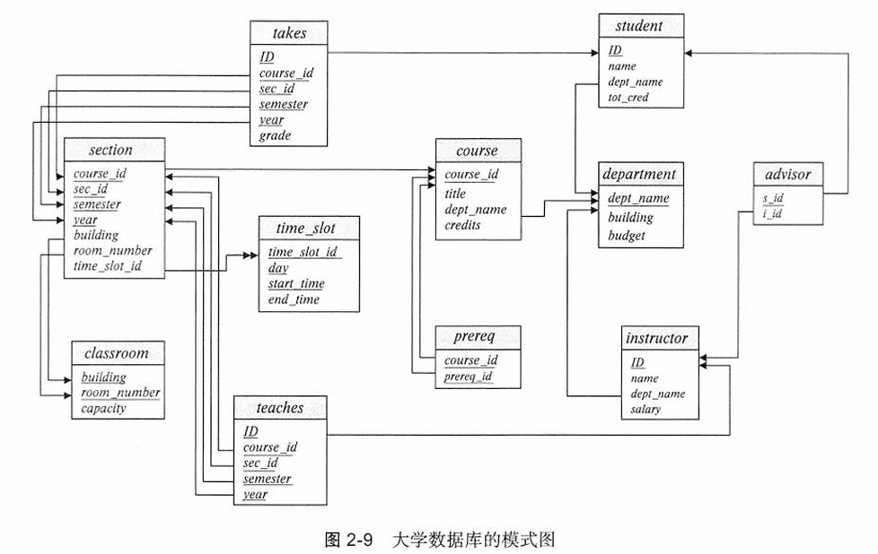

*think hard, make it simple.*

# 2.1 关系数据库的结构

## 关系模型术语

* **关系（relation）**：表
* **元组（tuple）**：行
* **属性（attribute）**：列
* **关系实例（relation instance）**：指代一个关系的特定实例，也就是说关系实例包含一组特定的行
* **域（domain)：**允许取值的集合

# 2.2 数据库模式

* **数据库模式（database schema)**：数据库的逻辑设计（表结构）
* **数据库实例（database instance)**：在给定时刻数据库中数据的一个快照（表内容）

```sql
department (dept_name, building, budget)
```

# 2.3 码

* **超码（superkey）**：一个或多个属性的集合，将这些属性组合在一起可以允许我们在一个关系中唯一地标识出一个元组。
* **候选码（candidate key)**：任意真子集都不是超码，最小超键

这两者皆为**主属性**

> * **主属性 (Prime Attribute)：** 只要一个属性**存在于任何一个候选键**中，它就是主属性。
> * **非主属性 (Non-Prime Attribute)：** **不**存在于**任何一个**候选键中的属性。

主属性在第7章的关系设计中的 3NF 判定中用到：

> 第三范式要求表中的非主属性不仅要**完全依赖于主键**，还要**消除传递依赖**。即非主属性不能依赖于其他非主属性。

### 外键约束

**外码约束（foreign-key constraint）**：

从$r_1$关系的$A$属性（集）到$r_2$关系的主码$B$的外码约束（foreign-key constraint）在任何数据库实例中，$strong$**中每个元组对$A$的取值也必须是$r_2$中某个元组对$B$的取值。**$A$属性集被称为从$r_1$引用$r_2$的外码（foreign key）。$r_1$关系也被称为此外码约束的**引用关系（referencing relation**），且$r_2$被称为**被引用关系（referenced relation）**。

即**一个表的字段（属性）$r_1$ 指向另一个表 $r_2$ 中的主键**，称其为 $r_1$ **引用**了 $r_2$

**即 $r_1$ 为主动（引用），$r_2$ 为被动（被引用）**

在表 $r_1$ 中需要声明：

```sql
create table r1 (
 A,
 foreign key (A) reference r2,
)
```

在导入表时也需要先导 r2 再导 r1

### 引用完整性约束（referential integrity constraint）

求引用关系中的任意元组在指定属性上出现的取值也必然出现在被引用关系中至少一个元组的指定属性上

> 形象地描述应该是：若 r1 引用了 r2 ，**r1 中外键的取值，在 r2 中的主键取值中一定会出现**


### 完整性约束SQL查询

* 普通**函数依赖**
  * 检验**非箭头侧**的表中**唯一性**
  * ```sql
    SELECT 
        MAX(A.Unique_MFGR_Count) AS Max_Unique_MFGR_Count
    FROM (
        SELECT 
            P_BRAND,
            COUNT(DISTINCT P_MFGR) AS Unique_MFGR_Count
        FROM 
            PART
        GROUP BY 
            P_BRAND
    ) AS A;

    ```
* **主键**依赖
  * 检验主键在表中的**唯一性**
  * 通过 where xx is null **检验非空状态**
  * ```sql
    select l_orderkey, count(*) 
    from lineitemcopy1
    group by (l_orderkey, l_linenumber) 
    having count(*)>1;

    select * from lineitemcopy1 
    where l_orderkey is null 
    and l_linenumber is null;

    ```
* **外键**依赖
  * 检验外键表中的取值是否**都出现在了主键表**中
  * ```sql
    select count(O_CUSTKEY) 
    from orderscopy1 
    where O_CUSTKEY 
    not in 
    ( select C_CUSTKEY from customercopy1 );

    ```

# 2.4 模式图

一个带有主码和外码约束的数据库模式可以用模式图（schema diagram）来表示



* **主码**属性用**下划线**标注
* **外码约束**用从引用关系的**外码属性指向被引用关系的主码属性**的箭头来表示
* **双头箭头**表示**不是外码约束的引用完整性约束**。
  * 这里好像表示的是多值属性

# 2.5 关系查询语言

* **函数式**查询语言（functional query language）：**计算被表示为对函数的求值**
  * 计算被表示为对函数的求值函数可以在数据库中的数据上运行或在其他函数给出的结果上运行；函数没有附带作用，并且它们并不更新程序的状态。
* **声明式**查询语言（declarative query language）：用户只需**描述所需信息**，而不用给出获取该信息的具体步骤序列或函数调用

**“纯”查询语言**：

* **关系代数（relational algebra ）**：函数式
* **元组关系演算**：声明式
* **域关系演算**：声明式

# 2.6 关系代数

**六大基础关系代数：**

* **(选择) select**: $\sigma$
* **(投影) project**: $\prod$
* **(笛卡尔积) Cartesian product**: $\times$
* **(集合并) union**: $\cup$
* **(集合差) set difference**: $-$
* **(重命名) rename**: $\rho$

Join (连接) 不是基本关系代数

## 2.6.1 选择运算

$$
\sigma_{p} (r)
$$

表示从 r 中选择条件为 p 的内容

等价于：

```sql
select *
from r
where p
```

where p 部分允许使用下列符号进行辅助判断：

$$
\neq, >, \geq, <, \leq, and (\text{and}), \lor (\text{or}), \neg (\text{not})
$$

## 2.6.2 投影运算

$$
\prod_{A_1,A_2,A_3,\dots,A_k} (r)
$$

表示从 r 中选择列为 A1,A2,...,Ak 的内容

等价于：

```sql
select A1,A2,...,Ak
from r
```

与选择运算组合后就成为了完整的基础运算

## 2.6.4 笛卡儿积运算

笛卡儿积（Cartesian-product）运算用叉号（$\times$）表示，它允许我们结合来自任意两个关系的信息。我们将关系$r_1$与$r_2$的笛卡儿积记为$r_1 \times r_2$。

$$
r_1 \times r_2
$$

等价于：

```sql
select * from r1,r2
```

## 2.6.5 连接运算

连接运算类似选择和笛卡尔积的合并，即：

$$
\sigma_{s.ID = r.ID} (s\times r)
$$

但这个表达式会导致教师**ID的重复出现**（表明条件的连接符号，而**自然连接 (natural join) 不会使连接符号冗余，同时不需要限定连接条件**）

连接运算使我们能够将选择与笛卡儿积合并到单个运算中。

请考虑关系$r(R)$和$s(S)$，并令$\theta$为$R \cup S$模式的属性上的一个谓词。连接（join）运算$r \bowtie_\theta s$定义如下：

$$
r \bowtie_\theta s = \sigma_\theta (r \times s)
$$

## 2.6.6 集合运算

* 并（union）运算：

$$
r \cup s
$$

* 交（intersection）运算：

$$
r \cap s
$$

* 集差（set-difference）运算：

$$
r-s
$$

在SQL语句中，这一类运算需要用 () 包裹两端表才能使用

## 2.6.7 赋值运算

**赋值（assignment）运算**用 <- 来表示，通常在更新、插入中出现(DDL语句转换)

$$
\text{courses\_fall\_2017} \leftarrow \prod_{\text{course\_id}}(\sigma_{\text{semester} = "Fall" \land \text{year}=2017} (\text{section}))
$$

$$
\text{courses\_spring\_2018} \leftarrow \prod_{\text{course\_id}}(\sigma_{\text{semester} = "Spring" \land \text{year}=2018} (\text{section}))
$$

$$
\text{courses\_fall\_2017} \cap \text{courses\_spring\_2018}
$$

## 2.6.8 更名运算

**更名（rename）运算**用小写希腊字母 rho（$\rho$）来表示

给定一个关系代数表达式 $E$，下述表达式

$$
\rho_x (E)
$$

返回 以 $x$ 命名的表达式 $E$ 的结果。

更名运算的第二种形式如下：假设一个关系代数表达式 $E$ 的元数为 $n$。那么，表达式

$$
\rho_{x(A_1,A_2,\dots,A_n)} (E)
$$

返回以 $x$ 命名的表达式 $E$ 的结果，并将其属性重命名为 $A_1, A_2, \dots, A_n$
