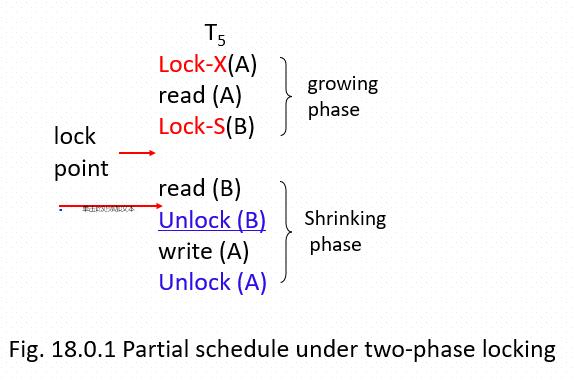
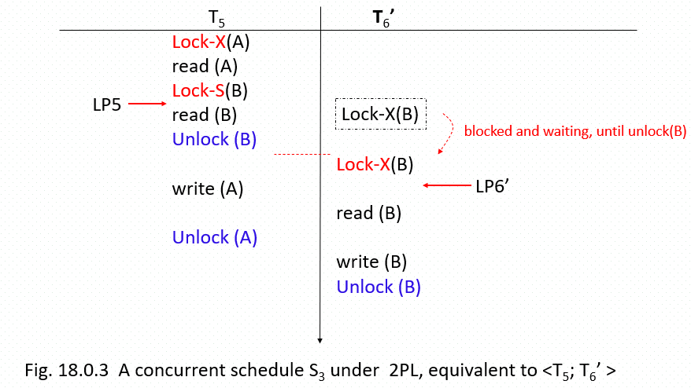
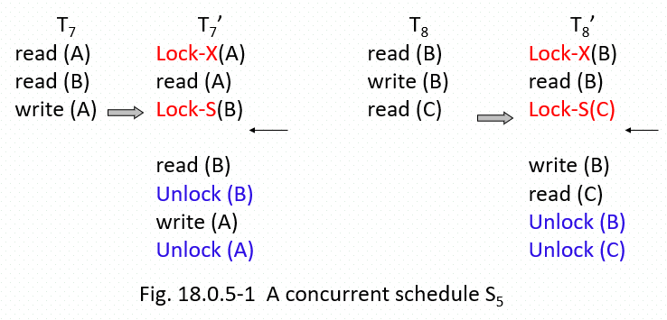
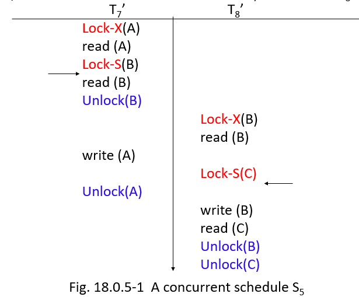
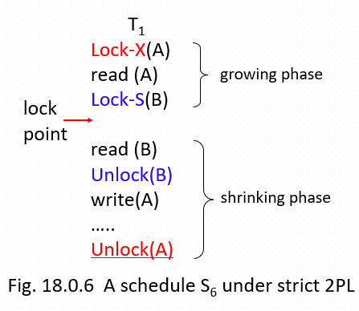
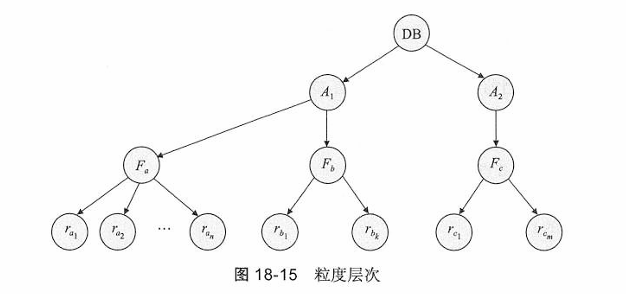
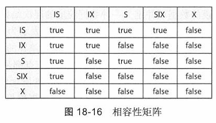
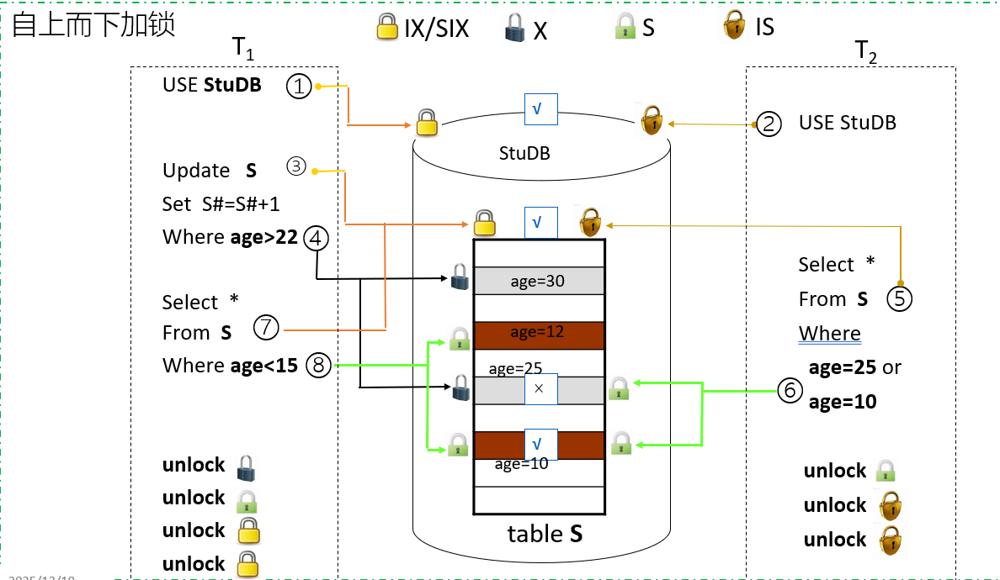
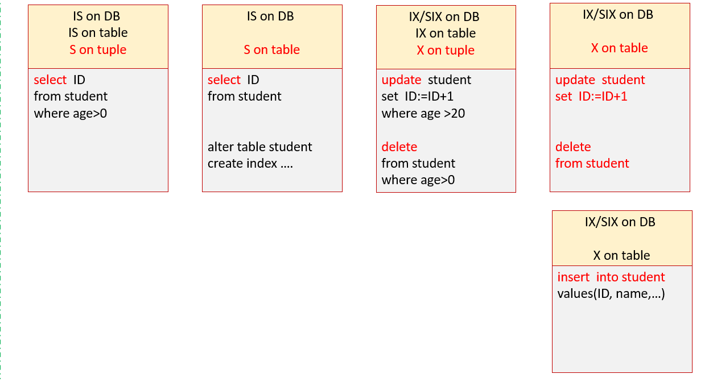

————*Rearrange this content*

在本章中，我们考虑对并发执行事务的管理，并且我们忽略故障。 在第19章中，我们将看到系统如何从故障中进行恢复。

# 18.1 基于锁的协议

## 18.1.1 锁

锁是一种【二元信号量】机制，用于控制对数据项的并发访问

- 事务只有在当前持有某个数据项的锁时，才被允许访问该数据项
- 数据项可以以**两种模式**加锁

  - **排他（X）模式/互斥锁**
    - 数据项既可以被读取，也可以被写入
    - 通过 `lock-X`指令请求X锁
  - **共享（S）模式/共享锁**
    - 数据项只能被读取
    - 通过 `lock-S`指令请求S锁
- 锁原语

  - `lock-S(Q)`, `unlock-S(Q)`；`lock-X(Q)`, `unlock-X(Q)`
- 锁请求由程序员向**并发控制管理器**发起。只有在请求被批准后，事务才能继续执行

## 18.1.3 两阶段封锁协议 2PL （重点）

保证可串行化的一种协议是两阶段封锁协议（two-phase locking protocol)。 该协议要求每个事务分两个阶段提出加锁和解锁申请。

1. 增长阶段（growing phase)：一个事务可以获得锁，但不能释放任何锁。
2. 缩减阶段（shrinking phase)：一个事务可以释放锁，但不能获得任何新锁。

**一旦开始释放任何锁，就不能再申请新锁，直到事务终止为止都不能申请锁**

> - 生长阶段
>   - $T_i$可以获取锁，但不能释放任何锁
> - 收缩阶段
>   - $T_i$可以释放锁，但不能获取任何锁
> - 当$T_i$开始时，它进入生长阶段
> - 当$T_i$通过解锁操作释放它的**第一个锁**时，它进入收缩阶段，且不允许再申请锁，即不允许回到生长阶段

- 该协议可保证可串行化。可以证明，事务能按照它们的**锁点（lock points）** 顺序实现串行化
- 锁点指事务获取到其最后一个锁的时刻
- **锁点**
  - 是事务/调度中的一个时刻：此时事务**已获取到其最后一个锁**，但尚未释放任何锁
  - 或者说，是在事务通过解锁操作释放第一个锁**之前**的时刻
    
-

若存在一个符合两段锁协议（2PL）的并发调度$S$，则$S$等价于一个串行调度$S'$，满足：

- $S$中各事务锁点的顺序，与$S'$中事务的顺序一致

例如：图18.0.3中的$S3$是冲突可串行化的，且等价于$<T_5; T_6'>$

- $T_5$的锁点早于$T_6'$的锁点



### 给定若干事务,构造满足2PL的并发调度S（本质上是冲突可串行化的需求）

S中各事务的 growing phase 和 shrinking phase 应尽可能错开，**不允许访问同一数据的2个事务（冲突事务）同时处于 growing phase**

1. 分别对事务的读写操作添加 S 锁和 X 锁：
   
2. 根据锁的相容性构造调度，使其满足可串行化调度的锁点优先级
   

### 特点

- 可构造**冲突可串行化**并发调度
- 无法避免**级联回滚**
- 无法避免**死锁**
- 严格 2PL 可构造无级联、可恢复，但是可能导致死锁、饿死

### 例题（上述）

- 判断是否满足 2PL
- 多事务构造符合 2PL 的调度

## 18.1.4 增强 2PL

### 严格两段锁（2PL）协议

- 事务获取的所有**排他锁（X锁）**，都要保持到事务提交/中止时才释放，也就是说，所有排他锁只能在事务结束时解锁
- 这会产生**无级联、可恢复且可串行化**的调度
- 例如：图18.0.6中的调度$S_6$



### 强制两段锁（2PL）协议

- 事务获取的所有排他锁（X锁）和共享锁（S锁），都要保持到事务提交/中止时才释放
  - 这会使事务按照它们的提交顺序实现串行化
- 确保了**可恢复性**，且**避免了级联回滚**
- 例如：图18.0.7中的调度$S_7$
-

$T_1$的操作流程：

```
Lock-X(A)
read (A)
Lock-S(B)  } 生长阶段
read (B)
write (A)
...
Unlock (A)  } 收缩阶段
Unlock (B)
```

大多数数据库实现了强制两段锁，但仅将其简称为两段锁

# 18.2 死锁处理（略）

这一部分操作系统提及的比较多

## 18.2.1 死锁预防

破坏四种条件？

1. 等待一死亡（wait-die）机制：非抢占
2. 伤害一等待（wound-wait）机制：抢占

## 18.2.2 死锁检测与恢复

### 18.2.2.1 死锁检测

等待图

### 18.2.2.2 从死锁中恢复

1. 选择牺牲者
2. 回滚
3. 饿死

# 18.3 多粒度（重点）

**数据项的粒度（Granularity of data items）**：指要访问的、或要执行同步操作（如加锁）的数据项的大小

- **关系数据库中可以加锁的数据对象**

  1. **逻辑单元**

     - 属性值、属性值集合、元组、关系、索引项、整个索引、整个数据库
  2. **物理单元**

     - 数据页（page）、索引页、数据块（block）、数据库文件（DB file）
  3. **SQL Server 加锁粒度/对象**

**粒度层次树（Granularity hierarchy tree）**

- 允许事务访问的数据项具有不同的大小
- 定义了数据粒度的层次结构：**小粒度嵌套在大粒度中，以树的形式可视化表示**，参考图18.15



### 多粒度加锁（Multiple Granularity Locking）

树中的每个节点都可以通过锁原语（如 `lock_S(Q)`、`lock_X(Q)`）单独加锁

**加锁粒度（Granularity of locking）**

- 指在树中执行加锁操作的层级

  - **细**粒度（树的**下层**）：例如对元组加锁
  - **粗**粒度（树的**上层**）：例如对表、数据库加锁

此外，当事务**显式**对树中的一个节点加锁时，会以相同模式**隐式**锁住该节点的**所有后代节点**

- 对高层的粗粒度数据对象显式加锁，代表隐式地对该对象包含的下层细粒度数据对象加锁 → 意向锁
- 例如：对 `student`表加锁，意味着隐式地对该表中的所有元组加锁
- 举例：在图18.15中，$T_i$已显式以排他模式锁住了$F_b$

  - 若$T_j$希望对记录$r_{b1}$加共享锁或排他锁，则必须等待
  - 若$T_k$希望锁住整个数据库（即锁住根节点），则无法成功

### 意向锁（intention lock）

- 如果一个节点加上了意向模式的锁，则意味着要在树的较低层（也就是说，在更细的粒度上）进行显式加锁
- **在一个节点被显式加锁之前，该节点的全部祖先节点均要加上意向锁，避免2个事务因加锁不同级别的资源而产生潜在的冲突**
  1. 先获得对**高层**粗粒度数据对象（如database,table）的**访问许可**
  2. 其后，再获得对**粗粒度数据**对象**包含的细粒度数据**对象的访问权，进行读写操作

除了共享锁S和排他锁X模式外（**局部**加锁），多粒度加锁还包含**三种额外的锁模式**（**整体**加锁）：

- **意向共享锁（intention-shared，IS）**

  - 若一个节点以IS模式加锁，则会在树的**更低层级执行显式加锁**，但**仅使用共享锁**
  - 例如：对 `student`表加IS锁，对表中的元组加S锁
- **意向排他锁（intention-exclusive，IX）**

  - 若一个节点以IX模式加锁，则会在树的**更低层级执行显式加锁**，使用的是**排他锁或共享锁**
  - 例如：对 `student`表加IX锁，对表中的元组加S锁或X锁
- **共享意向排他锁（shared and intention-exclusive，SIX）**

  - 若一个节点以SIX模式加锁，以该节点为根的子树被**显式以共享模式加锁**
  - 会在更低层级执行显式加锁，使用的是**排他模式锁**

### 多粒度封锁协议



- 首先事务需遵守锁 图 18-16 中的**锁相容函数**
- 事务$T_i$必须**首先封锁树的根节点**，并且可以任意的模式来封锁它。
- 仅当事务$T_i$当前对$Q$的**父节点**具有**IX模式或者IS模式**的锁时，$T_i$才能以**S或IS模式**对节点$Q$加锁。（共享约束）
- 仅当事务$T_i$当前对$Q$的**父节点**具有**IX模式或者SIX模式的锁**时，$T_i$才能以**X、SIX或IX模式**对节点$Q$加锁。（排他约束）
- 仅当事务$T_i$之前未曾对任何节点解锁时，$T_i$才可对一个节点加锁（也就是说，$T_i$是两阶段的）。
- 仅当事务$T_i$当前不持有$Q$的任何孩子节点的锁时，$T_i$才可对节点$Q$解锁。



判断语句加什么类型的锁（示例可参考）



#### 例题

在大学数据库系统中，假设多粒度锁是在三级数据项（即数据库、表、元组）上授予的

1. 若事务$T_1$当前通过以下语句修改 `Course`表：

   ```sql
   update Course
   set credits=credits+1
   where title='DBS'
   ```

   那么它需要持有数据库、表和元组上的哪些类型的锁？

   - 答：数据库上的SIX或IX锁，`Course`表上的IX锁，元组上的X锁
2. 当$T_1$正在修改 `Course`时，事务$T_2$希望通过以下语句访问 `Course`：

   ```sql
   select *
   from  Course
   where title in {'OS', 'DBS', 'Compiler'}
   ```

   那么$T_2$需要请求哪些三级锁？这些锁请求中，哪些会被授予，哪些会被拒绝？

   - > 注意：数据库上不能加IX或X锁，因为 `select`只是对数据库对象的读操作，而非写操作，参见P86锁兼容性矩阵表
     >
   - 答：数据库上的IS锁，`Course`表上的IS锁，元组上的S锁；
   - 前两个锁请求会被授予，最后一个会被拒绝
