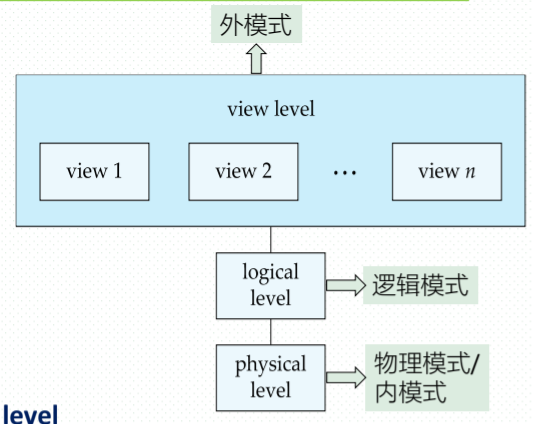
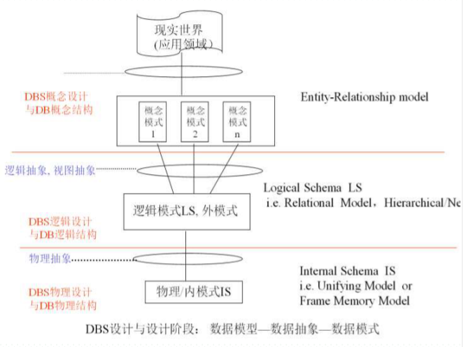
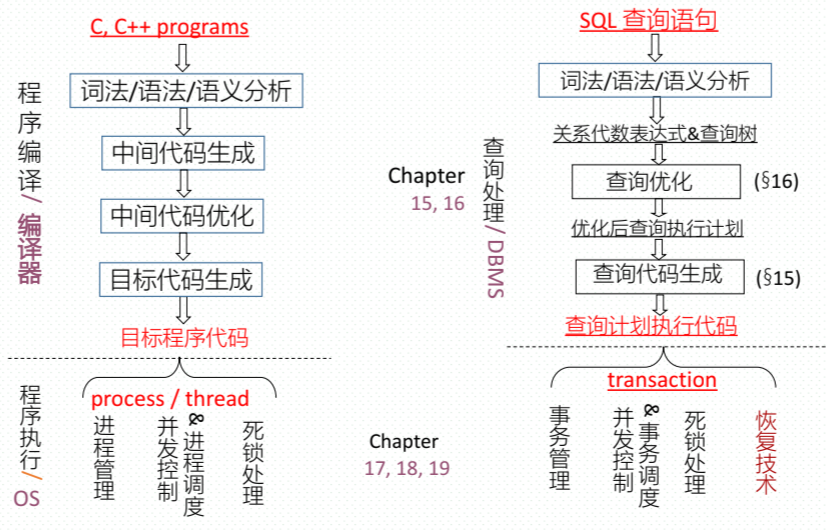

*忘却不是毒药，而是解脱。*

# 1.1 数据库系统应用

## DB、DBMS、DBS、DBAS

* **数据库管理系统**（DataBase-Management System , DBMS）由一个互相关联的数据的集
  合和一组用以访问这些数据的程序组成。
  * 目标：要提供一种可以方便、 高效地存取数据库信息的途径。
* 数据集合通常称作**数据库（database)**

## 使用数据库的方式

### 联机事务处理（online transaction processing )

大量的用户使用数据库，每个用户检索相对少量的数据，进行小的更新。

### 数据分析（data analytics)

审阅数据，给出结论，并推导出规则或决策程序，以用于驱动业务决策。

# 1.2 数据库系统的目标

* 数据的冗余和不一致性（data redundancy and inconsistency)
* 数据访问困难（difficulty in accessing data )
* 数据孤立（data isolation)
* 完整性问题（integrity problem )
* 原子性问题（atomicity problem )
* 并发访问异常（concurrent-access anomaly)
* 安全性问题（security problem )

# 1.3 数据视图

## 1.3.1 数据模型

**数据模型（data model)：** 一个描述数据、 数据联系、 数据语义以及一致性约束的概念工具的集合。

* **关系模型（relational model)。** 关系模型用表的集合来表示数据和数据间的联系。
* **实体 -联系模型（entity-relationship model)。** 实体- 联系（E-R）数据模型使用称作实体的基本对象的集合，以及这些对象间的联系。
* **半结构化数据模型（semi-structured data model)。** 半结构化数据模型允许在其数据定
  义中某些相同类型的数据项含有不同的属性集。
* **基于对象的数据模型（object-based data model)。** 面向对象的程序设计（特别是Java,
  C++ 或C#）已经成为占主导地位的软件开发方法。

## 1.3.2 数据抽象

**数据抽象（data abstraction）：** 对用户屏蔽复杂性，以简化用户与系统的交互。

* **物理层（physical level)。** 最低层次的抽象，描述数据实际上是怎样存储的。 物理层详细描述复杂的底层数据结构。
* **逻辑层（logical level)。** 描述数据库中存储什么数据以及这些数据间存在什么联系
  * 物理数据独立性（physical data independence)
* **视图层（view level)。** 最高层次的抽象，它只描述整个数据库的某个部分



## 1.3.3 实例和模式

* **实例（instance)：** 特定时刻存储在数据库中的信息的集合
* **模式( schema )：** 而数据库的总体设计
  * **物理模式（physical schema ）：** 在物理层描述数据库的设计
  * **逻辑模式（logical schema ）：** 在逻辑层描述数据库的设计
* **子模式（subschema)：** 视图层描述模式

# 1.4 数据库语言

数据库系统提供数据定义语言（Data-Definition Language, DDL ）来定义数据库模式，并提供数据操纵语言（Data-Manipulation Language, DML ）来表达数据库的查询和更新。

## 1.4.1 数据定义语言 DDL

DDL语句说明数据库系统所采用的**存储结构和访问方式**，这些语句定义了数据库模式的实现细节，而这些细节对用户来说通常是不可见的。

包含元数据：

* 数据模式
* 完整性约束
  * **域约束（domain constraint)：** 每个属性都必须对应于一个所有可能的取值构成的域
  * **引用完整性（referential integrity)：** 确保一个关系中给定属性集上的取值也在另一关系的某一属性集的取值中出现（引用完整性）。
  * **授权（authorization)：** 对于不同的用户在数据库中的不同数据值上允许不同的访问类型

DDL 的输出放在数据字典（data dictionary）中，数据字典包含**元数据（metadata)**，元数据是关于数据的数据。

> * **元数据 (Metadata)：** 关于数据的数据。它描述了数据库的结构、约束、数据类型、存储位置等信息。
> * **数据字典 (Data Dictionary)：** 存储数据库元数据的地方。它由 DBMS 维护，包含了数据库中所有对象（表、列、索引、视图等）的定义信息。

简而言之，数据字典存储的是 **数据库的定义和骨架** ，而不是具体的用户数据。

SQL语句格式：

```sql
create table A (
 a, b, c, d,...
 Integrity(1),
 Integrity(2),...
)
```

## 1.4.2 数据操纵语言 DML

数据操纵语言是这样一种语言，它使得用户可以访问或操纵那些按照某种适当的数据模型组织起来的数据。 有以下访问类型：（增删改查）

* 对存储在数据库中的信息进行检索；
* 向数据库中插入新的信息；
* 从数据库中删除信息；
* 修改数据库中存储的信息。

两种类型的数据操纵语言：

* **过程化的DML (procedural DML ）** 要求用户指定需要什么数据以及如何获得这些数据。
* **声明式的 DML ( declarative DML )** （也称为非过程化的DML ）只要求用户指定需要什么数据，而不必指明如何获得这些数据。

# 1.5 数据库设计

在第六章中有展开对照

1. 概念设计阶段（conceptual-design）
   * 实体-关系模型
2. 逻辑设计阶段（logical-design phrase)
   * 关系模型
   * 逻辑模式
   * 表结构
3. 物理设计阶段( physical-design phrase）
   * 数据库结构
   * 索引



# 1.6 数据库引擎

* 存储管理器
* 查询处理器（query processor）部件
* 事务管理部件



## 1.6.1 存储管理器

存储管理器（storage manager ）是数据库系统中负责在数据库中存储的低层数据与应用程序以及向系统提交的查询之间提供接口的部件。

* 负责与文件管理器进行交互
* 器将各种DML 语句翻译为底层文件系统命令
* 负责数据库中数据的存储、 检索和更新。

存储管理器部件包括：

* 权限及完整性管理器（authorization and integrity manager)
* 事务管理器（transaction manager)
* 文件管理器（file manager)
* 缓冲区管理器（buffer manager)

存储管理器实现了以下几种数据结构：

* 数据文件（data file)，它存储数据库自身。
* 数据字典（data dictionary)，它存储关于数据库结构的元数据，特别是数据库模式。
* 索引 ( index)，它提供对数据项的快速访问

## 1.6.2 查询处理器

* DDL 解释器（DDL interpreter)，它解释DDL 语句并将这些定义记录在数据字典中。
* DML 编译器（DML compiler)，它将查询语言中的DML 语句翻译为包括一系列查询执行引擎能理解的低级指令的执行方案。
* 查询执行引擎(query evaluation engine)，它执行由DML 编译器产生的低级指令。

## 1.6.3 事务管理

事务（transaction）是数据库应用中完成单一逻辑功能的操作集合

既具原子性又具一致性的单元

主要保证原子性和持久性
