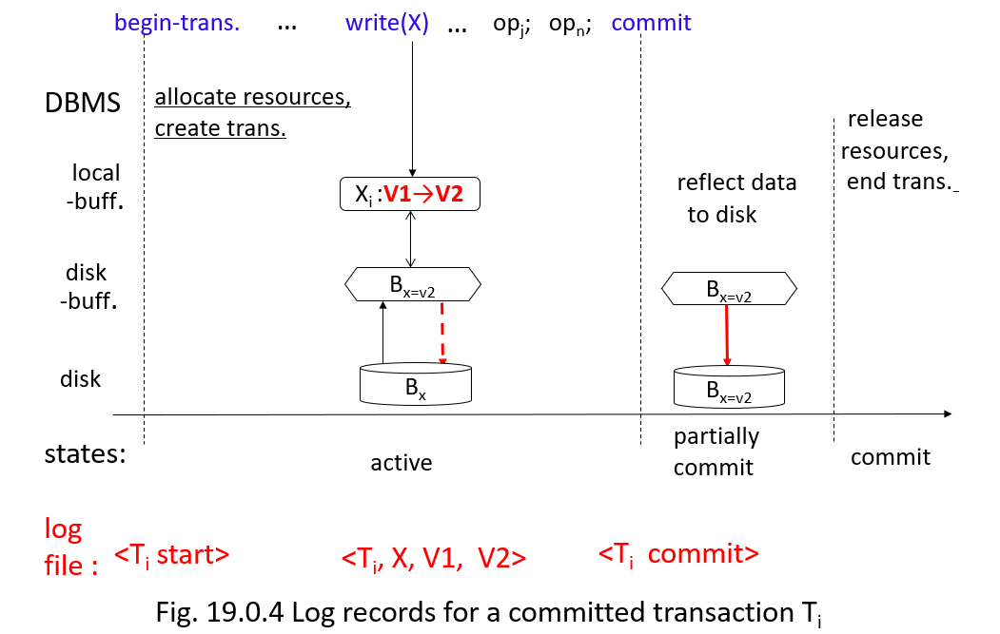
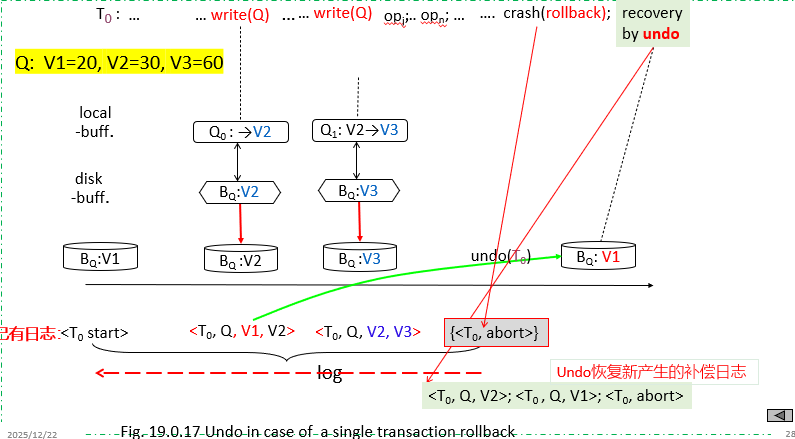
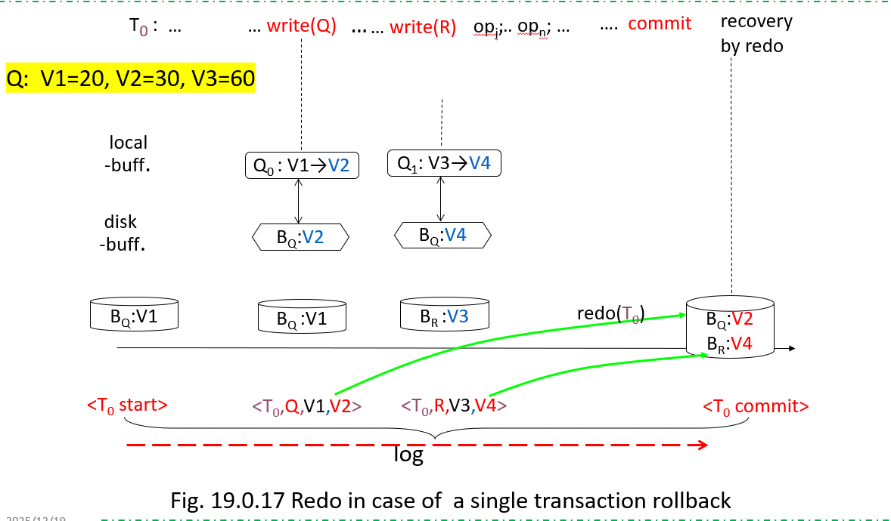
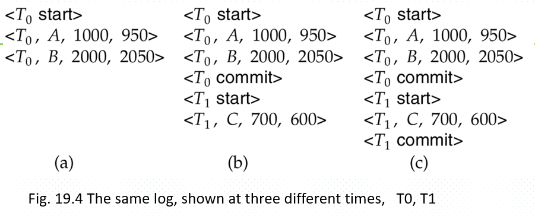
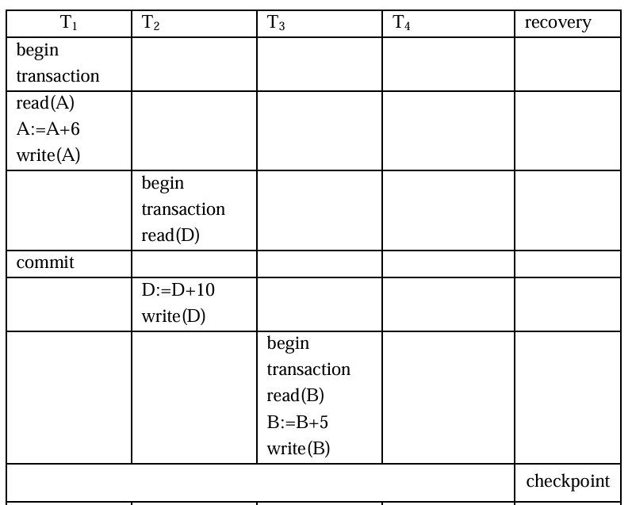
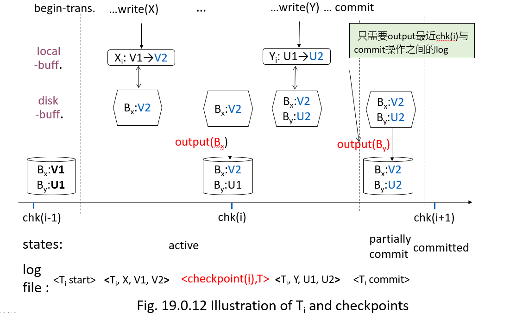
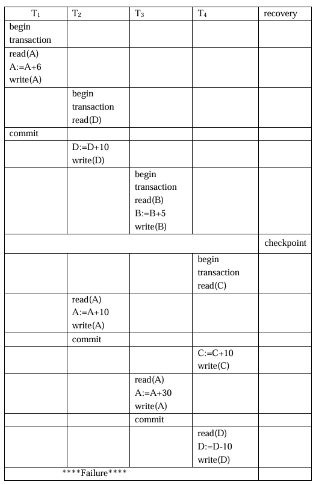
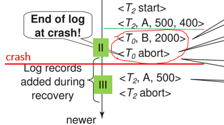
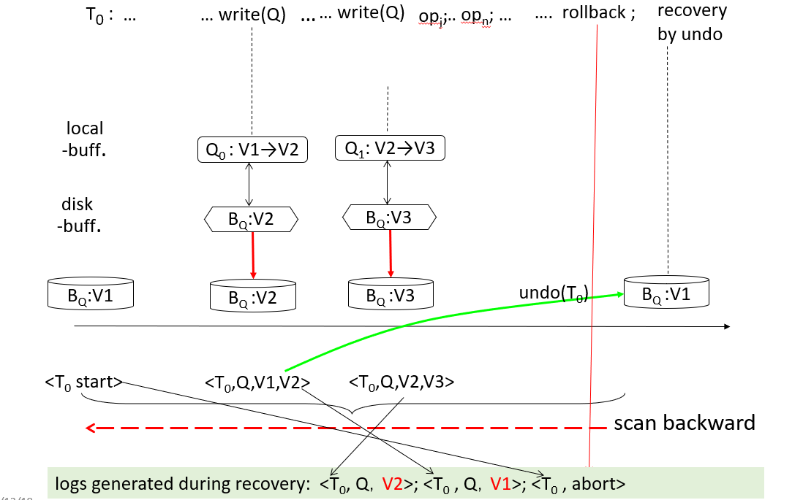
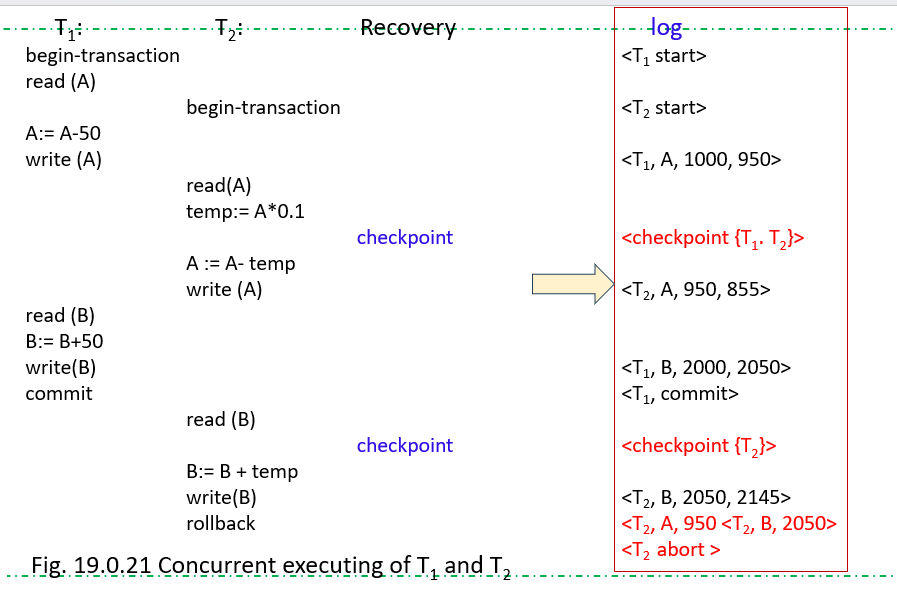

————*Ater Twilight*

# 19.1 故障分类

- **事务故障（transaction failure）：** 有两种错误可能造成事务执行失败：

  - **逻辑错误（logical error）**。事务由于某些**内部情况**而**无法继续其正常执行**，这样的内部情况诸如非法输入、找不到数据、溢出或超出资源限制。
  - **系统错误（system error）**。系统进入一种**不良状态（如死锁）**，其结果是事务无法继续其正常执行。但该事务可以**在之后的某个时间重新执行**。
- **系统崩溃（system crash）**：硬件故障，或者是数据库软件或操作系统的漏洞，导致易失性存储器内容的丢失，并使得事务处理停止。但非易失性存储器内容完好无损且没被破坏。

  - 硬件错误和软件漏洞致使系统终止，但不破坏非易失性存储器内容的假设被称为故障-停止假设（fail-stop assumption）。设计良好的系统在硬件和软件层有大量的内部检查，一旦有错误发生就会将系统停止。因此，故障-停止假设是合理的。
- **磁盘故障（disk failure）**：在数据传输操作中由于磁头损坏或故障造成磁盘块上的内容丢失。其他磁盘上的数据拷贝，或三级介质（如DVD或磁带）上的归档备份可用于从这种故障中恢复。

# 19.3 恢复与原子性

当系统故障发生时，事务对数据库的修改可能会使数据库处于不一致状态

## 19.3.1 日志记录

更新**日志记录（update log record）**描述一次数据库写操作，具有以下字段：

$$
<T_i, X,V1,V2>
$$

- **事务标识 $T_i$（transaction identifier）**，是执行$\text{write}$操作的事务的唯一标识。
- **数据项标识 $X$（data-item identifier）**，是所写数据项的唯一标识。通常是数据项在磁盘上的位置，包括该数据项所驻留的块的块标识以及块内偏移量。
- **旧值 $V_1$（old value）**，是数据项的写前值。
- **新值 $V_2$（new value）**，是数据项写后应取的值。

日志记录类型：

- $\text{<}T_i\text{ start>}$。事务$T_i$开始。
- $\text{<}T_i\text{ commit>}$。事务$T_i$提交。
- $\text{<}T_i\text{ abort>}$。事务$T_i$中止。

MySQL三种日志类型：

- binlog（二进制日志）
- redo log（重做日志）
- undo log（回滚日志）

## 19.3.2 数据库修改

事务$T$修改数据项的过程如下：

- 步骤1：$T$在主存的私有缓冲区中执行计算，例如$A:=A-50$
- 步骤2：$T$修改主存中磁盘缓冲区里存放该数据项的数据块
- 步骤3：DBMS执行$\text{output}$/持久化操作，将数据块写入磁盘
  - 物理写$\text{output}()$

$T$对主存私有部分的更新不算作数据库修改

**两种数据库修改方式**【进行物理写$\text{output}()$的时机】

- 延时更新（deferred modification）
  - 事务在提交之前**不会修改数据库**
- 即时/立即更新（immediate modification）
  - 事务在**活跃状态时就修改数据库**

由于执行所有的数据库修改之前必须先创建日志记录，所以系统可以使用数据项修改前的旧值和要写给数据项的新值。 这就要求系统能够执行适当的撤稍和重做操作。

- **撤销操作**使用一条日志记录$<T, X, V1, V2>$，将该日志记录中指定数据项置为日志记录中包含的旧值 V1。（原子性）
  - $<T_i, V1>  <T_i\;abort>$
- **重做操作**使用一条日志记录$<T, X, V1, V2>$，将该日志记录中指定数据项置为日志记录中包含的新值 V2。（持久性）

## 19.3.3 并发控制与恢复

对并发事务，当恢复方案（recovery scheme）修改数据项时，也需符合两段锁协议（2PL）

- 当多个事务并发访问数据项$X$（由加锁机制控制）时，恢复算法应要求：若$X$已被一个事务修改，则在该事务提交或中止前，其他事务不能修改$X$
  - 使用两段锁协议（2PL）来调度这些事务

## 19.3.4 事务提交

> 事务提交之前/之后，发生崩溃（crash），恢复（recovery）采取的操作

当事务$T$的提交日志记录$\text{<}T,\text{committed>}$（这是该事务的最后一条日志记录）被写入稳定存储时，事务$T$才算提交完成

- 提交日志$\text{<}T,\text{committed>}$被写入稳定存储，代表事务成功提交并结束
- 该事务之前的所有日志记录必须已被输出

然而，事务执行的写操作在事务提交时可能仍处于缓冲区中（例如在延时更新方式下），并可能在之后才被输出

系统崩溃后的恢复操作

- 【**提交之后崩溃**】若系统在$T$提交后发生崩溃，$T$的更新可以被**重做**（redo操作）
  - 基于$\text{<}T, X, V1, V2\text{>}$，将新值$X2$重新写入磁盘上的数据库文件
- 【**提交之前崩溃**】若系统在日志记录$\text{<}T,\text{committed>}$被输出到稳定存储之前（即$T$提交完成之前）发生崩溃，$T$将被**回滚**（undo操作）
  - 基于$\text{<}T, X, V1, V2\text{>}$，撤销对$X$的修改，将$X$恢复为$V1$

## 19.3.5 使用日志来重做和撤销事务

### 情况1：单事务，多次修改

一个事务可能多次修改数据库中的数据项，如何通过undo和redo操作进行恢复

- 例如：$\text{<}T, X, 20, 30\text{>}$、$\text{<}T, X, 30, 60\text{>}$：$X$的取值变化为$20 \to 30 \to 60$

**事务的撤销（Undo of Transaction）**，$\text{undo}(T_i)$，参考图19.0.17

1. 将$T_i$更新过的所有数据项的值**恢复为它们的旧值**，即数据项$X$的最旧值（例如20），方法是从$T_i$的最后一条日志记录开始反向回溯
2. 每次将数据项$X$恢复为其旧值$V$时，会在日志文件中**写入一条特殊的日志记录（称为“仅重做记录”）**$\text{<}T_i, X, V\text{>}$，记录撤销过程中执行的更新操作
3. 当事务的撤销完成时，会**写入一条日志记录**$\text{<}T_i \text{ abort>}$，表示撤销操作已完成

**事务的重做（Redo of Transaction）**

- $\text{redo}(T_i)$会将$T_i$更新过的所有数据项的值设置为新值，即数据项$X$的最新值（例如60）
- 方法是从$T_i$的第一条日志记录（即$\text{<}T_i \text{ start>}$）开始正向遍历
  - **这种情况下不会进行日志记录**

### 情况2：并发事务

根据日志，判断采取的恢复动作、恢复结果

系统崩溃后，系统会查阅日志以确定哪些事务需要重做、哪些需要撤销，从而保证原子性

- 若日志满足以下条件，事务$T_i$需要被撤销：

  1. 包含记录$\text{<}T_i \text{ start>}$
  2. 但不包含$\text{<}T_i \text{ commit>}$或$\text{<}T_i \text{ abort>}$中的任意一条
     - 发生崩溃时，$T_i$未完成
- 若日志满足以下条件，事务$T_i$需要被重做：

  1. 包含记录$\text{<}T_i \text{ start>}$
  2. 且包含$\text{<}T_i \text{ commit>}$或$\text{<}T_i \text{ abort>}$
     - 发生故障时，$T_i$逻辑上已完成全部工作，但修改结果可能未写入磁盘文件

#### 练习

上述每种情况对应的恢复操作如下：

- (a) 撤销$T_0$

  - 将$B$恢复为2000、$A$恢复为1000；写入日志记录$\text{<}T_0, B, 2000\text{>}$、$\text{<}T_0, A, 1000\text{>}$、$\text{<}T_0 \text{ abort>}$
- (b) 重做$T_0$并撤销$T_1$

  - 将$A$设为950、$B$设为2050，同时将$C$恢复为700；写入日志记录$\text{<}T_1, C, 700\text{>}$、$\text{<}T_1 \text{ abort>}$
- (c) 重做$T_0$并重做$T_1$

  - 先将$A$设为950、$B$设为2050，再将$C$设为600

## 19.3.6 检查点

恢复系统通过定期执行检查点来**简化恢复流程**，这需要执行以下一系列操作：

1. 【**日志计入稳定存储**】：将当前驻留在主存中的所有日志记录输出到稳定存储上的日志文件中
2. 【**修改后的数据批量写回数据库文件**】：将检查点之前磁盘缓冲区中所有被修改的缓冲块输出/同步到磁盘！
   - 定期将内存中的日志和磁盘缓冲区中修改后的数据块写回外设磁盘的数据库文件中
   - 优点：
     1. 将随机写转为批量写，降低I/O负荷；
     2. 节省缓冲区
3. 【**生成检测点日志**】：将格式为$\text{<checkpoint L>}$的日志记录输出到稳定存储，其中$L$是检查点时刻**处于活跃状态**的**并发事务列表（当前未提交或终止的事务）**
   此时的检查点日志：
   **`<checkpoint {T2, T3}>`** (此时 T2, T3 正在运行)

在检查点执行过程中，事务不允许执行任何更新操作（例如写入缓冲块或写入日志记录）

- 数据项$X$的更新后的值（即$V2$）由检查点$(i)$同步/输出到磁盘
- 数据项$Y$的更新后的值（即$U2$）在$T_i$处于部分提交状态时被同步/输出到磁盘

### 检查点修复

系统崩溃后，系统会检查日志以找到**最近的$\text{<checkpoint L>}$记录**【最近检查点】：

- 可通过从日志末尾反向搜索，直到找到第一条$\text{<checkpoint L>}$记录来实现

**本质上就是回退到这一个检查点上，因为已经是写入存储的记录了**

#### 情况1：最近检查点之前完成的事务，无需恢复/动作

考虑在最近检查点之前完成的事务$T_i$，即$\text{<}T_i \text{ commit>}$记录（或$\text{<}T_i \text{ abort>}$记录）出现在日志中最近的$\text{<checkpoint>}$记录之前：

- $T_i$对数据库的所有修改，要么在检查点之前已写入数据库，要么作为检查点流程的一部分被写入
- 因此，在恢复时，无需对$T_i$执行重做操作

> **Ignore（忽略）** :  **T1** 。他在检查点之前已经完成了 `commit`，其更新已安全写入数据库。

#### 情况2：最近检查点时仍活跃，或最近检查点之后开始的事务

仅需对$L$中的事务，以及所有在$\text{<checkpoint L>}$记录写入日志后才开始执行的事务，应用重做或撤销操作

- 将这组事务记为$T$
- 对于$T$中日志里没有$\text{<}T_k \text{ commit>}$记录或$\text{<}T_k \text{ abort>}$记录的所有事务$T_k$，执行$\text{undo}(T_k)$
  - > **Redo（重做）** :  **T2, T3** 。这两个事务在检查点时正在运行，或在检查点之后开始，并且在失效发生前已经完成了 `commit`。
    >
- 对于$T$中日志里存在$\text{<}T_k \text{ commit>}$记录或$\text{<}T_k \text{ abort>}$记录的所有事务$T_k$，执行$\text{redo}(T_k)$
  - > **Undo（撤销）** :  **T4** 。它在失效发生时仍处于运行状态，没有 `commit` 记录，必须撤销其对数据库的影响。
    >

# 19.4 恢复算法

正如19.3中所述，需要重做或撤销的并发事务已被识别

对于这些已识别的事务，本节给出了具体的恢复算法：

1. 使用日志记录从**事务故障中恢复**，由**回滚**操作触发

   - 事务主动回滚
   - 特点：日志文件中存在补偿/回滚日志$\text{<}T_i, X, V1\text{>}$、$\text{<}T_i \text{ abort>}$
     
2. 结合**最近的检查点和日志记录**，从系统崩溃中**恢复**

   - 发生外部故障

## 19.4.1 正常情况回滚（事务主动rollback）

1. 从后往前扫描日志，对于所发现的$T_i$的每条形如$\text{<}T_i, X_j, V_1, V_2\text{>}$的日志记录：
   1. 将值$V_1$写到数据项$X_j$。【**undo操作，恢复旧值**】
   2. 往日志中写一条特殊的redo-only（**补偿日志**）日志记录$\text{<}T_i, X_j, V_1\text{>}$，其中$V_1$是在本次回滚中数据项$X_j$被恢复成的值。
2. 一旦发现了$\text{<}T_i \text{ start>}$日志记录，就停止反向扫描，往日志中写一条$\text{<}T_i \text{ abort>}$日志记录。

## 19.4.2 系统崩溃后的恢复

恢复操作分为两个阶段：重做阶段、撤销阶段

- step1. 重做阶段 —— 对已提交事务执行重做，并构造撤销列表（undo-list）
- step2. 撤销阶段 —— 根据撤销列表，回滚未提交事务

### redo重做阶段【redo已结束（成功提交、失败回滚）的事务，构造撤销列表】

1. 找到最近检查点的$\text{<checkpoint L>}$记录，将撤销列表（undo-list）初始化为$L$

   - undo-list初始化为最近检查点$\text{<checkpoint, L>}$的**活跃事务列表**$L$；
     **最后一个检查点处还没有提交的事务**，崩溃时可能没有提交，可能需要回滚
2. 从上述$\text{<checkpoint L>}$记录开始正向扫描 （从最新日志向日志文件尾扫描）

   - 每当找到记录$\text{<}T_i, X_j, V_1, V_2\text{>}$，或遇到仅重做记录$\text{<}T_i, X_j, V_2\text{>}$时，通过将$V_2$写入$X_j$来重做该操作
     - 最近检查点时正在进行、还未结束的事务，再做一次
   - 每当找到**日志记录$\text{<}T_i \text{ start>}$时，将$T_i$添加到undo-list中**
     - 最近检查点之后开始的事务$T_i$，加入undo-list，可能需要撤销
   - 每当找到日志记录$\text{<}T_i \text{ commit>}$或$\text{<}T_i \text{ abort>}$时，将$T_i$从undo-list中移除
     - 崩溃发生前**已经提交或已经回滚（主动rollback）的事务$T_i$移出undo-list**，这些事务只需重做，无需撤销

### undo撤销阶段

从日志末尾反向扫描，**回滚撤销列表（undo-list）中的所有事务**

1. 每当找到日志记录$\text{<}T_i, X_j, V_1, V_2\text{>}$且$T_i$在undo-list中时，执行与事务回滚相同的操作

   1. 将$V_1$写入$X_j$以执行撤销操作。
   2. **写入一条日志记录$\text{<}T_i, X_j, V_1\text{>}$**
2. 每当找到日志记录$\text{<}T_i \text{ start>}$或$\text{<}T_i \text{ rollback>}$且$T_i$在undo-list中时：

   1. **写入一条日志记录$\text{<}T_i \text{ abort>}$ /*表示恢复动作完成*/**
   2. 将$T_i$从undo-list中移除
3. 一旦undo-list为空，扫描终止

   - 即系统已找到初始在undo-list中的所有事务对应的$\text{<}T_i \text{ start>}$日志记录

## 习题（未完成）

- 最近checkpoint时仍活跃，crash之前已经正常提交/commit的事务，需要redo
- 最近checkpoint时仍活跃，crash之前已经rollback主动回滚，完成recovery的事务，需要redo
- 最近checkpoint时仍活跃，crash之后没有commit或rollback的事务，需要undo
- 最近checkpoint之前已经commit/rollback，即最近checkpoint时不活跃的事务，不考虑(ignored)

