————*像一关过完再单打一次*

# 13.1 数据库存储架构

持久性数据存储在非易失性存储器中，通常是磁盘或固态硬盘。 磁盘和固态硬盘都是块结构设备，也就是说，以块为单位读或写数据。

相反地，数据库则处理记录，它通常比块小很多

大多数数据库使用操作系统文件作为存储记录的中间层，它抽象出底层块的一些细节。可是，为了保证有效访问，同时支持故障恢复（我们将在第19章介绍），数据库也必须了解块。

# 13.2 文件组织

* 一个数据库被映射为多个不同的文件，这些文件由底层的操作系统来维护，并永久地驻留在磁盘上。
  * DB Files：主文件、辅文件、日志文件
* 一个文件（file）在逻辑上被组织为记录的一个序列
* **块（block)**：每个文件还从逻辑上被分成定长的存储单元，是**存储分配和数据传输**的单位。

### 块

* 一个块可能包括几条记录
* 一个块所包含的确切的记录集合是由所使用的物理数据组织形式来决定的
* 没有比块更大的记录
* 每条记录被完全包含在单个块中

## 13.2.1 定长记录

```sql
type instructor = record
    ID varchar(5);
    name varchar(20);
    dept_name varchar(20);
    salary numeric(8,2);
end
```

instuctor 记录占53个字节，然而这种简单的方法存在两个问题：

1. 除非块的大小恰好是53的倍数（这是不太可能的），否则一些记录会跨过块的边界，即一条记录的一部分存储在一个块中，另一部分存储在另一个块中。
   * 于是，读或写这样一条记录就需要两次块访问。
2. 从这种结构中删除一条记录是困难的。
   * 被删除记录所占据的空间必须由文件中的其他
     记录来填充，或者我们必须用一种方式来标记被删除的记录以使得它们可以被忽略。

### 自由链表

* 分配特定数量的字节作为文件头（file header)
  * 文件头将包含有关文件的各种信息
* 使用指针指向删除文件记录的位置

于是，被删除的记录形成了一条链表，通常称为自由链表（free list)

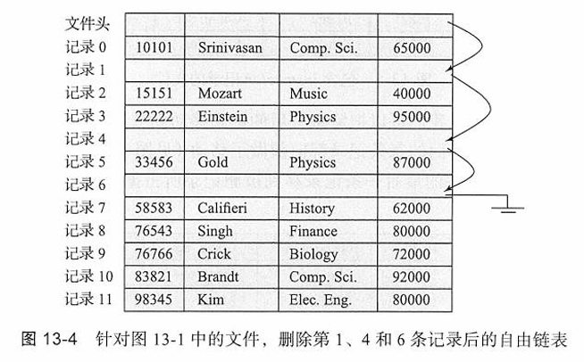

## 13.2.2 变长记录

* 记录中的属性按顺序存储
  * 先存储**定长属性**，之后再存储
  * **变长属性**
* 变长属性通过固定大小的（偏移量/偏移量，长度）来表示，实际数据存储在所有定长属性之后
* 空值通过**空值位图**表示
  * 表示本行某个属性是否取值为null

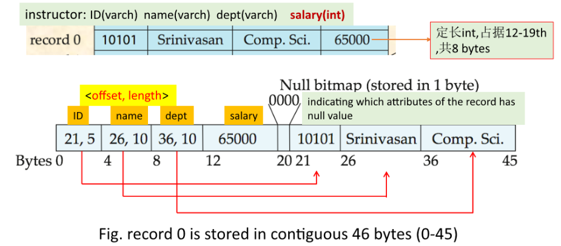

分槽的页结构（slotted-page structure）一般用于在块中组织记录

每个块的开始处有一个块头，其中包含以下信息：

* 块头中记录项的数量；
* 块中自由空间的末尾处；
* 一个由包含每条记录的位置和大小的项组成的数组。

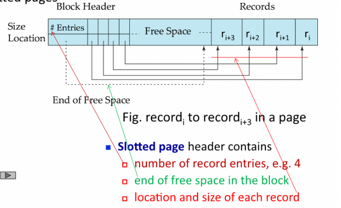

# 13.3 文件中记录的组织

* 文件包含多个记录，这些记录在磁盘上的存放属于文件（记录）结构问题，即记录的组织结构
* 对于某种结构的文件如何去查找、插入、删除记录，属于文件的存取方法
* 文件记录的组织结构决定了文件的存取方法

组织记录方式：

* 在逻辑文件层面，从用户的视角来看，数据库文件可被视为一组记录，这些记录在逻辑上通过以下方式之一进行组织

  * 堆文件、顺序文件、散列文件、聚集文件
  * 记录的逻辑组织方式也决定了文件用户访问记录的方式，即存取方法

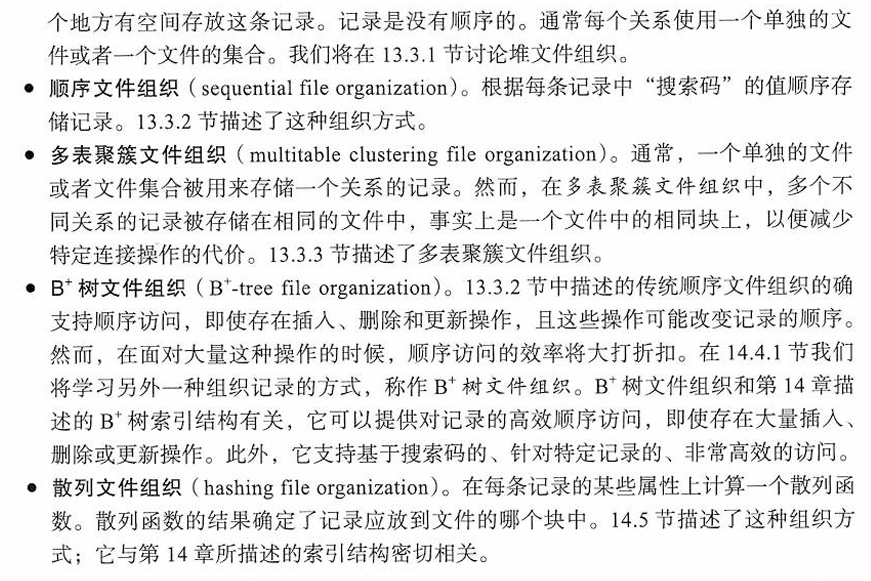

## 13.3.1 堆文件组织

在堆文件组织中，记录可以存储在对应于一个关系的文件中的任何位置。 记录一旦被放在特定位置，通常不会被移动

当一条记录被插入一个文件中时，一种选择位置的方式是总把它加到文件的末尾。因此堆文件一般以记录的输入顺序为序，决定了文件中记录顺序。

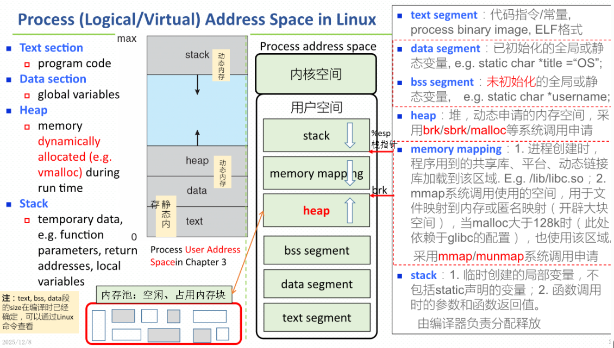

## 13.3.2 顺序文件组织

顺序文件（sequential file）是为了高效处理按某个搜索码的顺序排序的记录而设计的。

搜索码（search key）是任意的属性或者属性的集合。无须是主码，甚至也无须是超码。

通过**指针**将记录链接起来，每条记录中的指针指向搜索键顺序中的下一条记录。通过指针 pointer，将各个 records 链接组织在一起

* 从数据库的视角来看，对文件的顺序访问
  * 对文件中的记录，只能从文件中的第一个记录开始，采用顺序访问
* 需要不时地重新组织文件以恢复顺序
  * 当对 table 中的元组 / DB 文件中的记录进行 insert/delete 时，需要重新组织文件中的记录顺序
  * 将 ID=32343 的记录 / 元组的 ID 改为 ID=99000

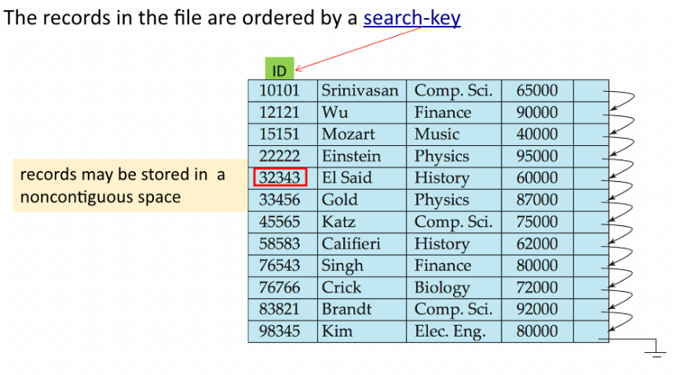

在插入和删除时维护记录的物理顺序是困难的，因为由单个的插入或删除而导致很多记录的移动是代价很高的。 我们可以按照前面看到的那样，使用指针链表来管理删除。

对于插入操作，我们应用如下两条规则：

* 在文件中定位按搜索码顺序位于待插入记录之前的那条记录。
* 如果在这条记录所在块中有一条自由的记录（即删除后留下来的空间），就在这里插人新的记录。 否则，将新记录插入一个溢出块（overflow block）中。 无论哪种情况都要调整指针，使其能按搜索码顺序把记录链接在一起。

图13-8 中的结构允许快速插入新的记录，但是迫使顺序处理文件的应用程序不得不按与记录的物理顺序不一样的顺序来处理记录。

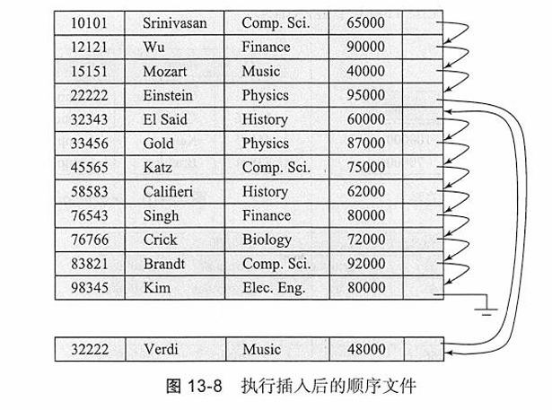

一段时间之后，搜索码顺序和物理顺序之间的相似性最终可能会完全丧失，此时，文件应该被重组（reorganized)

## 13.3.3 多表聚簇文件组织

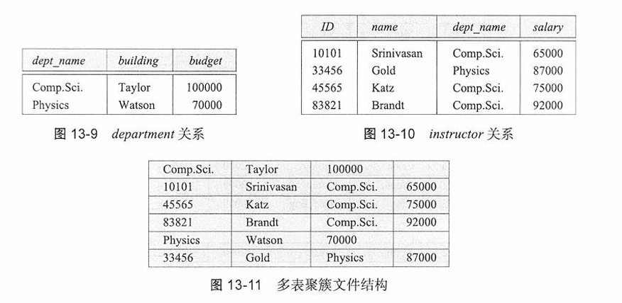

如图13-11所示，**多表聚簇文件组织**（multitable clustering file organization）是一种在每个块中存储两个或更多关系的相关记录的文件组织形式。**聚簇码**（cluster key）是一种属性，它定义了哪些记录被存储在一起；在我们之前的示例中，聚簇码是 `dept_name`。

多表聚簇被Oracle数据库系统所支持。 聚簇可以通过使用带有特定聚簇码的创建聚簇(crea te cluster ）命令来创建。 对创建表（create table）命令的扩展可以用来指定将一个关系存储在特定聚簇中，此命令将特定属性用作聚簇码。 这样可以将多种关系分配到一个聚簇上。

## 13.3.4 Hash文件组织

* 文件记录存储在若干个**桶**中，桶的编号（#bucket）就是记录的地址
* 通过对文件记录的某些属性（即搜索键）应用哈希函数，来确定文件中记录的地址
* 哈希函数
  * $h:$ {搜索键} $\rightarrow$ {记录的物理地址}，即桶的编号（#bucket）
  * 该函数的计算结果指定了记录应存放在文件的哪个块/桶中
* `account(ID, branch-name, balance)`文件的哈希文件组织
  * 使用 `branch-name`作为搜索键
* 例如：openGauss中的Hashbucket表
  * 表中每个桶对应一个物理文件


## 13.3.5 划分

表划分：将一个关系中的记录划分为更小的关系，这些关系分别进行存储。

# 13.4 数据字典存储

* 元数据（metadata)：关于数据的数据
  * 一个关系数据库系统需要维护关于关系的数据，比如关系的模式。

### 数据字典

数据字典（data dictionary）/ 系统目录（system catalog ）：关系模式和关于关系的其他元数据存储

进一步可以存储关于关系和属性的统计数据和描述数据

数据字典也可能记录关系的存储组织（堆、顺序、散列等），以及每个关系的存储位置：

* 如果关系被存储在操作系统文件中，数据字典将会记录包含每个关系的单个文件（或多个文件）的名称。
* 如果数据库把所有关系存储在单个文件中，数据字典可能将包含每个关系的记录的块记在诸如链表那样的数据结构中。

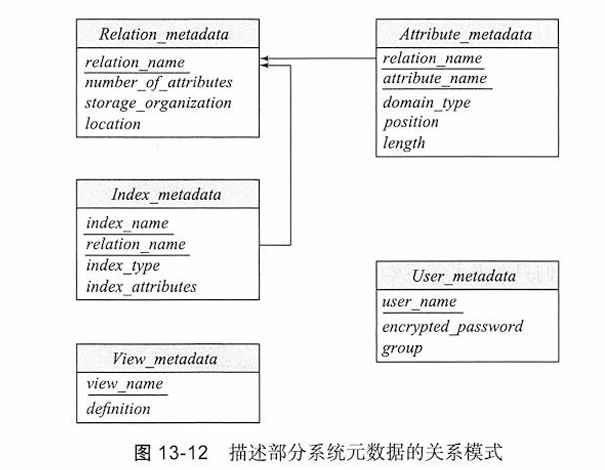

上图关系中，只要数据库系统需要从关系中检索记录，它就必须首先通过 `Relation_metadata`关系来查找关系的位置和存储组织，然后使用该信息去获取记录。

但是，`Relation_metadata`关系本身的存储组织和位置必须被记录在其他地方（例如，在数据库自身的代码中，或者在数据库中的一个固定位置），因为我们需要这些信息来找到 `Relation_metadata`的内容。

因为系统元数据被频繁访问，所以大多数数据库将其从数据库读入内存数据结构中，这种数据结构可被很高效地访问。这是在数据库开始处理任何查询之前作为数据库启动的一部分来完成的。

# 13.5 数据库缓冲区

*Redis*

因为从磁盘访问数据远比从内存访问数据要慢，所以数据库系统的一个主要目标就是尽减少在磁盘和内存之间传输的块数量。

因为在主存中保留所有块是不可能的，我们需要管理主存中用于存储块的可用空间的分配。 缓冲区（buffer ）是主存中用于存储磁盘块的拷贝的那部分。 每个块总有一份拷贝存放在磁盘上，但是磁盘上的拷贝可能比缓冲区中的版本旧。 负责缓冲区空间分配的子系统称为缓冲区管理器（buffer manager )。

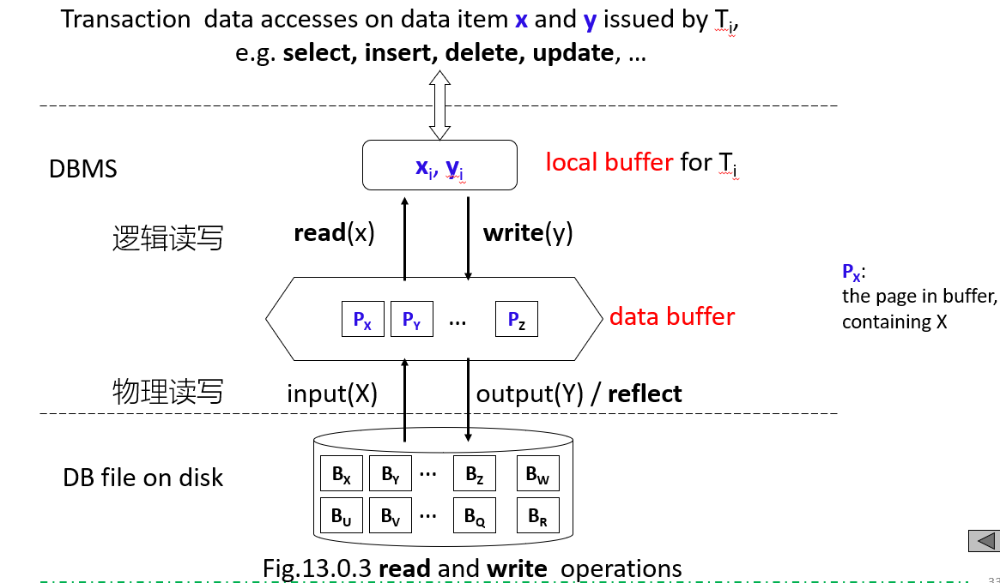

## 13.5.1 缓冲区管理器

当数据库系统中的程序需要磁盘上的块时，它向缓冲区管理器发出请求（即调用）

* 块已经在缓冲区中：
  * 缓冲区管理器将这个块在主存中的地址传给请求者
* 块不在缓冲区中：缓冲区管理器首先在缓冲区中为这个块分配空间
  * 可能会把一些其他块移出主存
  * 被移出的块仅当它在最近一次写回磁盘后被修改过才被写回磁盘
  * 缓冲区管理器把被请求的块从磁盘读入缓冲区，并将这个块在主存中的地址传给请求者

### 13.5.1.1 缓冲区替换策略（LRU常用）

当缓冲区中没有剩余空间时，一个块必须被移出（evicted)

多数操作系统使用最近最少使用（Least Recently Used,LRU）方案，即最近最少访问的块被写回磁盘，并从缓冲区中移走。

### 13.5.1.2 被钉住的块

读取/写入时块不能被移出

进程在该块上执行**钉住（pin）操作**，缓冲区管理器绝不会移出一个被钉住的块

当进程完成数据读取后，它将执行解除钉住（unpin）操作，允许该块在必要时被移出。

多个进程时为每个缓冲块维护**钉住计数(pin count)**

### 13.5.1.3 缓冲区上的共享排他锁

从页面增加或删除元组的进程可能需要移动此页面的内容，在此期间，任何其他进程都不应读取该页的内容

锁在18章中进行详细学习

### 13.5.1.4 块写出

限制一个块能被写回磁盘的时间

大多数恢复系统要求，当块上正在进行更新时，该块不能被写回磁盘。 为满足这个要求，希望将块写回磁盘的进程必须获取块上的共享锁。

通过进程进行监测

### 13.5.1.5 块的强制写出

## 13.5.2 缓冲区替换策略（较重点）

1. 最近最少使用（Least Recently Used, LRU）策略
2. 立即丢弃（toss-immediate）策略
3. 最近最常使用（Most Recently Used, MRU）策略

## 13.5.3 写操作的重排序与恢复

* 缓冲管理器支持**强制输出**块，用于恢复（第19章会详细介绍）
* **非易失性写缓冲区**通过立即将块写入非易失性RAM或闪存缓冲区，来加速磁盘写入
  * 可以重新排序写操作，以减少磁盘臂的移动
* **日志磁盘**——专门用于写入块更新的顺序日志的磁盘
  * 使用方式与非易失性RAM完全相同
    * 写入日志磁盘的速度非常快，因为不需要寻道操作
* **日志型文件系统**将数据按顺序写入非易失性RAM或日志磁盘
  * 不使用日志功能的情况下重新排序写操作：存在文件系统数据损坏的风险

# 13.6 面向列的存储

* 面向行的存储（row-oriented storage）：传统数据库把元组的所有属性存储在一条记录中，再把元组存放在如我们刚才看到的文件中
* 面向列的存储（column-oriented storage）：，关系的每个属性都被单独存
  储，来自相邻元组的属性值存储在文件中相邻的位置上
  * 也被称为柱状存储( columna r storage)

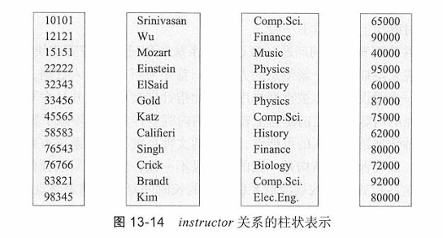

在面向列的存储的最简单形式中，每个属性都存储在一个单独的文件中。 此外，每个文件都被压缩（compressed）以减小其规模。

### 优势

* 若仅访问部分属性，可减少I/O操作
* 提升CPU缓存性能
* 增强压缩效果
* 适配现代CPU架构的**向量处理**

### 劣势

* 从列存储表示中重构元组的开销
* 元组删除与更新的开销
* 解压缩的开销

### 适用场景

* 列存储表示在**决策支持**场景下，比行式存储更高效
  （示例SQL：

  ```sql
  update instructor
  set salary=salary + 100
  where ID between 0 and 15151
  ```）
  ```

- 传统的行式存储更适合**事务处理**

### 混合存储

* 部分数据库同时支持两种存储方式
  * 称为**混合行列存储**

## 13.6.1 柱状文件表示

* **ORC和Parquet**：文件内部采用列存储的文件格式
* 在大数据应用中非常流行
* ORC文件格式展示在右侧：

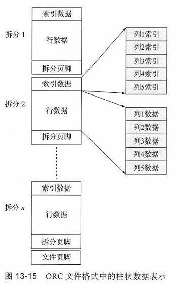

# 13.7 主存数据库的存储组织

如果整个数据库都能放进内存，则可以通过定制存储组织和数据库数据结构，来利用数据全部在内存中这一事实，从而显著提升性能。

主存数据库（main-memory database)是所有数据都驻留在内存中的数据库

大量主存可以通过给数据库缓冲区分配大量内存来使用，这将允许整个数据库被加载到缓冲区中，避免读取数据的磁盘I/O操作

* **内存数据库（in-memory database）**
* 可以无需缓冲管理器，直接将记录存储在内存中
* 列式存储可在内存中用于决策支持类应用
  * 压缩技术能降低内存需求

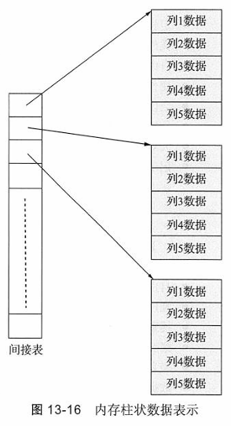
