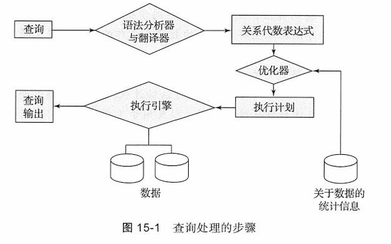
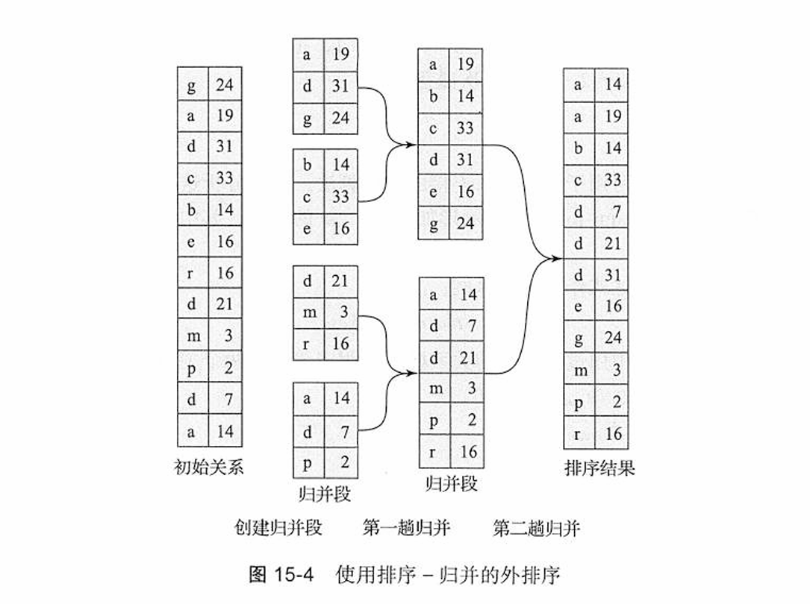
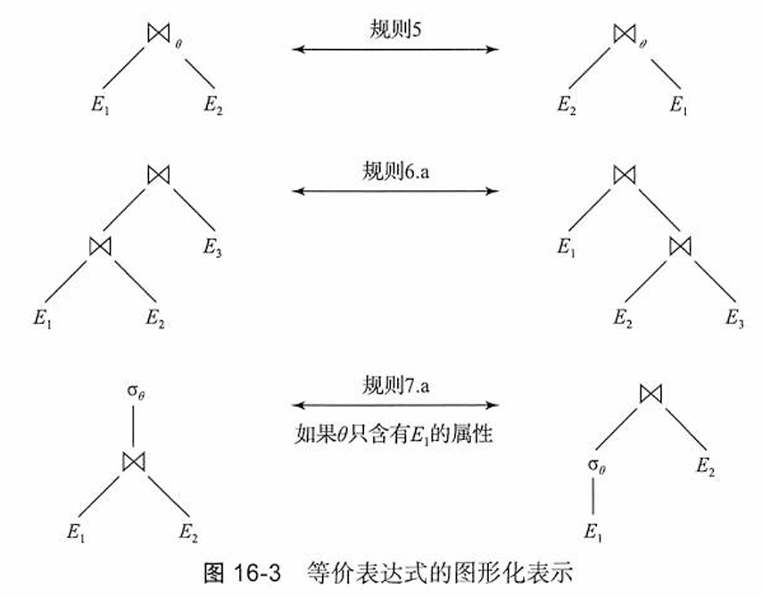
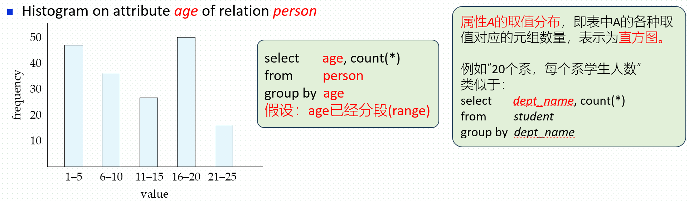
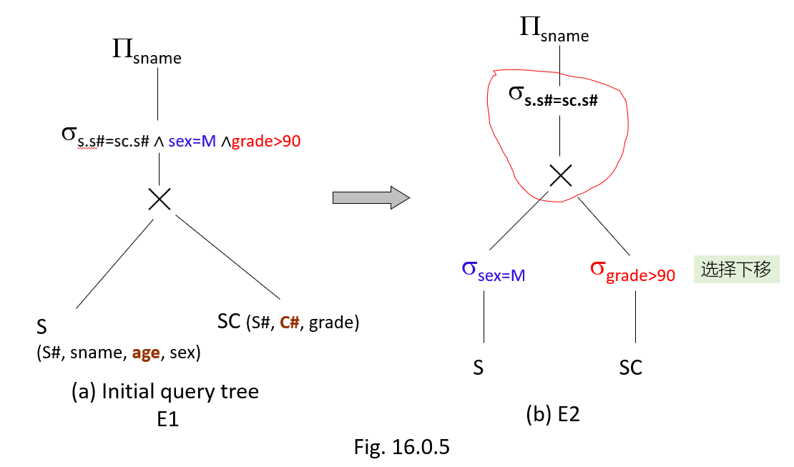
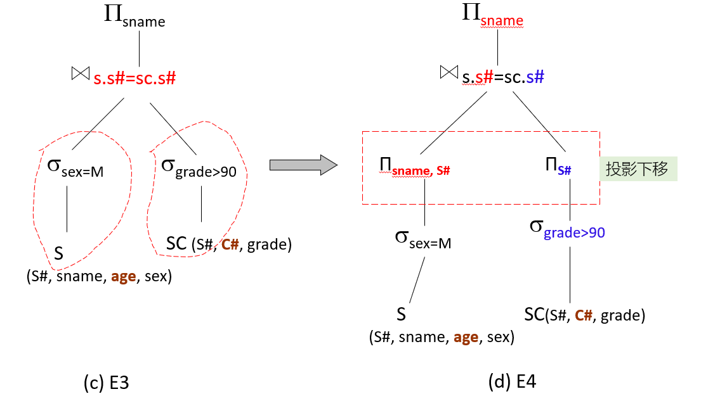

————*Snow before Spring.*

# 第十五章 查询处理

？

查询处理所涉及的步骤如图15-1所示。 基本步骤包括：

1. 语法分析与翻译
2. 优化
3. 执行



## 15.3 选择运算

在查询处理中，文件扫描（file scan）是数据访问的最低级别的运算

### 15.3.1 文件扫描的使用和索引的选择

* 索引结构称为存取路径（access path)
* 使用索引的搜索算法称为索引扫描（index scan)

|    | 算法                            | 代价                                  | 原因                                                                                                                                                                            |
| -- | ------------------------------- | ------------------------------------- | ------------------------------------------------------------------------------------------------------------------------------------------------------------------------------- |
| A1 | 线性搜索                        | $t_S + b_r * t_T$                   | 一次初始搜索加上$b_r$次块传输，其中$b_r$表示文件中的块数量                                                                                                                  |
| A1 | 线性搜索，码上的等值比较        | 平均情形$t_S + (b_r / 2) * t_T$     | 因为最多有一条记录满足条件，所以一旦找到所需的记录，扫描就可以终止。但在最坏的情形下，仍需要$b_r$次块传输                                                                     |
| A2 | B⁺树聚集索引，码上的等值比较   | $(h_i + 1) * (t_T + t_S)$           | （其中$h_i$表示索引的高度）。索引搜索遍历树的高度，再加上一次I/O来获取记录；每个这样的I/O操作需要一次寻道和一次块传输                                                         |
| A3 | B⁺树聚集索引，非码上的等值比较 | $h_i * (t_T + t_S) + t_S + b * t_T$ | 树的每一层有一次寻道，第一个块有一次寻道。这里$b$是包含具有指定搜索码记录的块数，所有这些记录都是要读取的。假定这些块是顺序存储（因为是聚集索引）的叶子块并且不需要额外的寻道 |
| A4 | B⁺树辅助索引，码上的等值比较   | $(h_i + 1) * (t_T + t_S)$           | 这种情形和聚集索引类似                                                                                                                                                          |
| A4 | B⁺树辅助索引，非码上的等值比较 | $(h_i + n) * (t_T + t_S)$           | （其中$n$是所获取记录的数量）。在这里，索引遍历的代价和A3一样，但是每条记录可能存储在不同的块上，需要对每条记录进行一次寻道。如果$n$值比较大，代价可能会非常昂贵            |
| A5 | B⁺树聚集索引，比较             | $h_i * (t_T + t_S) + t_S + b * t_T$ | 和A3、非码上的等值比较的情形一样                                                                                                                                                |
| A6 | B⁺树辅助索引，比较             | $(h_i + n) * (t_T + t_S)$           | 和A4、非码上的等值比较的情形一样                                                                                                                                                |

图15-3 选择算法的代价估计

### 15.3.3 复杂选择的实现

* 合取（conjunction）。合取选择是如下形式的选择：

  $$
  \sigma_{\theta_1 \land \theta_2 \land \dots \land \theta_n} (r)
  $$
* 析取（disjunction）：析取选择是如下形式的选择：

  $$
  \sigma_{\theta_1 \lor \theta_2 \lor \dots \lor \theta_n} (r)
  $$

  满足单个简单条件$\theta_i$的所有记录的并集满足析取条件。
* 否定（negation）：选择操作$\sigma_{\neg \theta}(r)$的结果就是对条件$\theta$取值为假的$r$的元组的集合。
  如果没有空值，该集合就只是$r$中不在$\sigma_\theta(r)$内的那些元组的集合。

我们可以通过使用下列算法之一来实现涉及多个简单条件的合取或析取的选择运算。

A7~A10

## 15.4 排序

### 15.4.1 外排序一归并算法

对不能全部放人内存中的关系进行的排序称为外排序（external sorting)

对于外排序最常用的技术是外排序一归并（external sort-merge）算法

#### 步骤

1. 在第一阶段，创建多个排好序的归并段（run）；每个归并段都是排过序的，但仅包含关系的部分记录。

   ```
   i = 0;
   repeat
       读入关系的M个块或者关系的剩余部分，
           以较小者为准；
       对关系在内存中的部分进行排序；
       将排好序的数据写到归并段文件Rᵢ中；
       i = i + 1;
   until 到达关系末尾
   ```

2. 在第二阶段，对归并段进行归并。暂且假定归并段的总数N小于M，因此我们可以为每个归并段分配一个块，并且还有剩下的空间能为输出保留一个块。归并阶段的操作如下：

   ```
   为$N$个归并段文件$R_i$各读入一个块到内存缓冲块中；
   repeat
       从所有缓冲块中（按序）挑选第一个元组；
       把该元组写到输出中，并将其从缓冲块中删除；
       if 任何一个归并段$R_i$的缓冲块为空 and not 到达$R_i$的末尾
           then 将$R_i$的下一块读入缓冲块；
   until 所有的输入缓冲块均为空
   ```

由于该算法对$N$个归并段进行归并，故称它为$N$路归并（$N$-way merge）。



### 15.4.2 外排序-归并的代价分析

我们以这样的方式来计算外排序-归并的磁盘存取代价：令$b_r$代表包含关系$r$的记录的块数。在第一阶段读入关系的每个块并将它们重新写出，共需$2b_r$次块传输。

初始归并段的数量为$\lceil b_r/M \rceil$。在归并过程中，每次在一个归并段中读入一个块会导致大量的寻道；为了减少寻道次数，一次读取或写出更多数量的块，表示为$b_b$，这就要求将$b_b$个缓冲块分配给每个输入的归并段和输出的归并段。

然后，在每趟归并中可以归并$\lfloor M / b_b \rfloor - 1$个归并段，将归并段数量减少到原来的$1/(\lfloor M / b_b \rfloor - 1)$。总共所需的归并趟数为$\lceil \log_{\lfloor M / b_b \rfloor - 1} (b_r / M) \rceil$。

每趟这样的归并读入关系的每个块一次且写出关系的每个块一次，其中有两种例外情况。

* 首先，最后一趟可以只产生排序输出而不用将其结果写到磁盘。
* 其次，可能存在在某一趟中既没有读入又没有写出的归并段——例如，某一趟有$\lfloor M / b_b \rfloor$个归并段需要归并，其中$\lfloor M / b_b \rfloor - 1$个被读入并归并，而有一个归并段在该趟中却未被访问。忽略因后一种情况而节省的（相对少的）磁盘存取，关系外排序的块传输的总数为：

$$
b_r \left( 2 \lceil \log_{\lfloor M / b_b \rfloor - 1} (b_r / M) \rceil + 1 \right)
$$

我们还需要加上磁盘寻道的代价。在产生归并段阶段需要为读取每个归并段的数据而寻道，也要为写出归并段而寻道。每一趟归并需要为读取数据而进行大约$\lceil b_r / b_b \rceil$次寻道。尽管输出是顺序写出的，如果它和输入归并段在相同的磁盘上，磁头在连续块的写操作之间可能已经移开了。因此我们需要为每趟归并加上总共$2 \lceil b_r / b_b \rceil$次寻道，除了最后一趟以外（因为我们假定最终结果并不写回磁盘）。

$$
2 \lceil b_r / M \rceil + \lceil b_r / b_b \rceil \left( 2 \lceil \log_{\lfloor M / b_b \rfloor - 1} (b_r / M) \rceil - 1 \right)
$$

## 15.5 连接运算

我们用等值连接（equi-join）来表示形如 $r \bowtie_{r.A=s.B} s$ 的连接，其中$A$和$B$分别为关系$r$与$s$的属性或属性集。

我们使用下面的表达式作为运行示例：

$$
student \bowtie takes
$$

### 15.5.1 嵌套一循环连接

嵌套-循环连接由一对嵌套的 for 循环构成

计算θ连接 $r \bowtie_\theta s$ 的方式：

```markdown
for each tuple $t_r$ in r do begin  两重循环
    for each tuple $t_s$ in s do begin
        检查元组对$(t_r, t_s)$是否满足连接条件$\theta$（例如=、>）
        如果满足，将$t_r \bullet t_s$添加到结果中
    end
end
```

$r$ 被称为连接的**外层关系（outer relation）**，$s$ 被称为连接的**内层关系（inner relation）**。

* 不需要索引，可用于任意类型的连接条件。
* 开销很大，因为它会检查两个关系中的每一对元组。

#### 代价开销

* 在最坏情况下，如果内存仅能容纳每个关系的1个块【内存只能存放关系的1个block】，估算代价为：

  * $n_r * b_s + b_r$ 次块传输，加上 $n_r + b_r$ 次寻道
* 若较小的关系可整体放入内存，将其作为内层关系【“小”关系可整体放入内存，将其作为内关系，$n_r$退化为1】

  * 代价可降低至 $b_r + b_s$ 次块传输和2次寻道

#### 索引代替？

* 若满足以下条件，索引查找可以替代文件扫描：

  * 连接是等值连接或自然连接；
  * 内层关系的连接属性上存在可用索引
    * 可以专门构建一个索引来计算连接
* 对于外层关系$r$中的每个元组$t_r$，使用索引查找$s$中与$t_r$满足连接条件的元组。
* 最坏情况：缓冲区仅能容纳$r$的一个页，且对于$r$中的每个元组，都要对$s$执行一次索引查找。
* 连接的代价：$b_r (t_T + t_S) + n_r * c$

  * 其中$c$是遍历索引并为$r$的一个元组获取所有匹配的$s$元组的代价
  * $c$可以估算为使用连接条件对$s$执行单次选择操作的代价
* 若$r$和$s$的连接属性上都有可用索引，将元组较少的关系作为外层关系。

### 15.5.4 归并～连接

归并连接（merge-join）算法（又称排序-归并-连接（sort-merge-join）算法）可用于计算自然连接和等值连接0

# 第十六章 查询优化

查询优化( q uery op timiza tion）就是从许多策略中选出最高效的查询执行计划的处理过程

## 16.1 概述

给定一个关系代数表达式，查询优化器的任务是产生一个查询执行计划，该计划能计算出与给定表达式相同的结果，并且以代价最小的方式（或至少是不比最小执行代价大多少的方式）来产生结果。

查询执行计划的产生涉及三个步骤：

1. 产生逻辑上与给定表达式等价的表达式；
   1. 调整计算顺序
   2. 视图展开
   3. 去除多余条件
   4. 嵌入式子查询 -> 多表连接
2. 以可替代的方式对所产生的表达式做注释，以产生备选的查询计划；
3. 估计每个执行计划的代价，并选择估计代价最小的那一个。（16.3）
   1. 基于代价优化
   2. 启发式优化

其中这三个步骤是**交叉**的：：先产生一些表达式并加以注释从而产生执行计划，然后进一步产生一些表达式并加以注释，依此类推。

随着执行计划的产生，通过使用关于关系的统计信息（比如关系的规模和索引的深度）来估计它们的代价。

## 16.2 关系表达式的转换（查询重写规则，第一步）

如果两个关系代数表达式在每个合法的数据库实例上都会产生相同的元组集，则称这两个表达式是**等价的（equivalent)**

### 16.2.1 等价规则

**等价规则（equivalence rule）**：说明两种不同形式的表达式是等价的

优化器利用**等价规则**来将表达式转换成**逻辑上等价的其他表达式。**



下面描述关系代数表达式上的一些等价规则。我们用$\theta$、$\theta_1$、$\theta_2$等来表示谓词，用$L_1$、$L_2$、$L_3$等来表示属性列表，并且用$E$、$E_1$、$E_2$等来表示关系代数表达式。关系名$r$是关系代数表达式的一个特例，并且可以用在$E$出现的任何地方。

#### 详细规则

1. 合取选择运算可分解为单个选择运算的序列。该变换称为$\sigma$的级联：

   $$
   \sigma_{\theta_1 \land \theta_2}(E) \equiv \sigma_{\theta_1}(\sigma_{\theta_2}(E))
   $$
2. 选择运算满足交换律（commutative）：

   $$
   \sigma_{\theta_1}(\sigma_{\theta_2}(E)) \equiv \sigma_{\theta_2}(\sigma_{\theta_1}(E))
   $$
3. 在一系列投影运算中只有最后一个运算是必需的，其余的可以省略。该转换也可称为$\prod$的级联：

   $$
   \prod_{L_1}(\prod_{L_2}(\cdots(\prod_{L_n}(E))\cdots)) \equiv \prod_{L_1}(E)
   $$

   其中$L_1 \subseteq L_2 \subseteq \cdots \subseteq L_n$。
4. 选择运算可与笛卡儿积以及$\theta$连接相结合：

   * a. $\sigma_\theta(E_1 \times E_2) \equiv E_1 \bowtie_\theta E_2$。
     该表达式就是$\theta$连接的定义。
   * b. $\sigma_{\theta_1}(E_1 \bowtie_{\theta_2} E_2) \equiv E_1 \bowtie_{\theta_1 \land \theta_2} E_2$
5. $\theta$连接运算满足交换律：

$$
E_1 \bowtie_\theta E_2 \equiv E_2 \bowtie_\theta E_1
$$

1. a. 自然连接运算满足结合律（associative）：

   $$
   (E_1 \bowtie E_2) \bowtie E_3 \equiv E_1 \bowtie (E_2 \bowtie E_3)
   $$

   b. $\theta$连接满足以下方式的结合律：

   $$
   (E_1 \bowtie_{\theta_1} E_2) \bowtie_{\theta_2 \land \theta_3} E_3 \equiv E_1 \bowtie_{\theta_1 \land \theta_3} (E_2 \bowtie_{\theta_2} E_3)
   $$

   其中$\theta_2$只涉及$E_2$与$E_3$的属性。由于其中的任意一个条件都可为空，因此这说明笛卡儿积（$\times$）运算也满足结合律。连接运算满足交换律和结合律对于查询优化中连接的重新排序是很重要的。
2. 选择运算在如下两个条件下对$\theta$连接运算满足分配律：
   a. 当选择条件$\theta_1$中的所有属性只涉及被连接的其中一个表达式（比如$E_1$）的属性时，选择运算对$\theta$连接运算满足分配律：

   $$
   \sigma_{\theta_1}(E_1 \bowtie_\theta E_2) \equiv (\sigma_{\theta_1}(E_1)) \bowtie_\theta E_2
   $$

   b. 当选择条件$\theta_1$只涉及$E_1$的属性，并且$\theta_2$只涉及$E_2$的属性时，选择运算对$\theta$连接运算满足分配律：

   $$
   \sigma_{\theta_1 \land \theta_2}(E_1 \bowtie_\theta E_2) \equiv (\sigma_{\theta_1}(E_1)) \bowtie_\theta (\sigma_{\theta_2}(E_2))
   $$
3. 投影运算在如下条件下对$\theta$连接运算满足分配律：
   a. 令$L_1$与$L_2$分别代表$E_1$与$E_2$的属性。假设连接条件$\theta$只涉及$L_1 \cup L_2$中的属性，那么：

   $$
   \prod_{L_1 \cup L_2} (E_1 \bowtie_\theta E_2) \equiv (\prod_{L_1}(E_1)) \bowtie_\theta (\prod_{L_2}(E_2))
   $$

   b. 请考虑连接$E_1 \bowtie_\theta E_2$。令$L_1$与$L_2$分别代表$E_1$与$E_2$的属性集；令$L_3$是$E_1$中出现在连接条件$\theta$中但不在$L_1$中的属性；令$L_4$是$E_2$中出现在连接条件$\theta$中但不在$L_2$中的属性。那么：

   $$
   \prod_{L_1 \cup L_2} (E_1 \bowtie_\theta E_2) \equiv \prod_{L_1 \cup L_2} ((\prod_{L_1 \cup L_3}(E_1)) \bowtie_\theta (\prod_{L_2 \cup L_4}(E_2)))
   $$

   对于外连接运算$\bowtie$、$\bowtie$与$\bowtie$，类似的等价规则也成立。
4. 集合的并与交运算满足交换律：
   a. $E_1 \cup E_2 \equiv E_2 \cup E_1$
   b. $E_1 \cap E_2 \equiv E_2 \cap E_1$
   集合的差运算不满足交换律。
5. 集合的并与交运算满足结合律：
    a. $(E_1 \cup E_2) \cup E_3 \equiv E_1 \cup (E_2 \cup E_3)$
    b. $(E_1 \cap E_2) \cap E_3 \equiv E_1 \cap (E_2 \cap E_3)$
6. 选择运算对并、交和集差运算满足分配律：
    a. $\sigma_\theta(E_1 \cup E_2) \equiv \sigma_\theta(E_1) \cup \sigma_\theta(E_2)$
    b. $\sigma_\theta(E_1 \cap E_2) \equiv \sigma_\theta(E_1) \cap \sigma_\theta(E_2)$
    c. $\sigma_\theta(E_1 - E_2) \equiv \sigma_\theta(E_1) - \sigma_\theta(E_2)$
    d. $\sigma_\theta(E_1 \cap E_2) \equiv \sigma_\theta(E_1) \cap E_2$
    e. $\sigma_\theta(E_1 - E_2) \equiv \sigma_\theta(E_1) - E_2$
    如果将“$-$”替换成“$\cup$”，则上述等价规则不成立。
7. 投影运算对并运算满足分配律：

$$
\prod_L(E_1 \cup E_2) \equiv (\prod_L(E_1)) \cup (\prod_L(E_2))
$$

### 16.2.3 连接次序

对于所有关系$r_1, r_2$和$r_3$，有：

$$
(r_1 \bowtie r_2) \bowtie r_3 = r_1 \bowtie (r_2 \bowtie r_3)
$$

若$r_2 \bowtie r_3$的规模很大，而$r_1 \bowtie r_2$的规模较小，我们选择计算：

$$
(r_1 \bowtie r_2) \bowtie r_3
$$

这样就能计算并存储一个更小的临时关系。

优化问题，优化目标：产生的中间结果/临时关系最小化

#### 原则

size小的关系作为join操作中的outer关系

## 16.3 表达式结果的统计信息估计

如何估算一个操作$\boldsymbol{p}$（例如选择、投影、连接、排序）的代价

* **step1.【基数估计】** 根据目录中关于操作所涉及关系的统计信息（元数据），估算该操作产生的结果关系的规模（例如100M）

  * 示例：$\prod_{\text{customer-name}}(\sigma_{\text{balance}<2500}(\text{account}) \bowtie \text{customer})$
    假设：
    1) 属性$\text{balance}$的值在$[0, 10000]$上均匀分布
    2) 文件$\text{account}$占用200个块
* **step2.【cost estimation/代价估计】** 借助第15章展示的代价公式（例如$<b,s>$），以磁盘访问为维度计算操作的代价

  * 磁盘访问是主要代价，磁盘的块传输次数（即$<b,s>$中的$b$）被用作评估实际代价的度量标准

**基数估计：**从底层运算开始估计它们的统计信息，并继续对高层运算进行处理，直到到达树的根为止

**代价估计：**考虑之前的基数估计，计算出的规模估计被作为这些统计数据的一部分，并可以用来计算树中单个运算的算法的代价，可以将这些代价加到一起来找到整个查询计划的代价

### 16.3.1 目录信息

数据库系统目录存储了有关数据库关系的下列统计信息：

* $n_r$，关系$r$中的元组数。
* $b_r$，包含关系$r$中元组的块数。
* $l_r$，关系$r$中一个元组的字节数。
* $f_r$，关系$r$的块因子——一个块中能容纳的关系$r$的元组数。
* $V(A, r)$，关系$r$中出现的对于属性$A$的非重复值的数量。该值与$\prod_A(r)$的规模相同。
  如果$A$是关系$r$的码，则$V(A, r)$等于$n_r$。

如果需要，最后一个统计值$V(A, r)$也可以针对属性集合进行维护，而不仅仅针对单个属性。因此，对于一个给定的属性集$\mathcal{A}$，$V(\mathcal{A}, r)$就是$\prod_{\mathcal{A}}(r)$的规模。

如果我们假设关系$r$的元组在物理上被共同存储在一个文件中，则下面的等式成立：

$$
b_r = \left\lceil \frac{n_r}{f_r} \right\rceil
$$

#### Histograms：属性的取值分布

属性A的取值分布，即表中A的各种取值对应的元组数量，表示为直方图。



* 【等宽】Equi-width histograms（等宽直方图）
* 【等深】Equi-depth histograms（等深直方图）会划分取值范围，使每个范围包含（近似）相同数量的元组
  * 例如：(4, 8, 14, 19)
* 许多数据库还会存储$n$个最常见值（MFV，或MCV，最常见值）及其计数
  * 直方图仅基于剩余的值构建

## 16.4 执行计划的选择

一个执行计划准确定义了对于每种运算应该使用什么算法以及应该如何协调各运算的执行。

基于代价的优化器（cost-based optimizer ）搜索与给定查询等价的所有查询执行计划的空间，并选择估计代价最小的那一个。

### 16.4.1 基于代价的连接次序选择（略）

1. 矩阵连乘积
2. AI4DB

### 16.4.3 优化中的启发式方法（重中之重）

一个查询的不同执行计划的数量可能非常大，并且从这个集合里找到最优计划仍需要很多计算代价。 因此，查询优化器使用启发式方法（heuristic）来减少优化的代价。

#### Heuristics/启发式规则

* 【选择下移】尽早执行选择操作，减少元组数量
* 【投影下移】尽早执行投影操作，减少属性数量
* 【替代笛卡尔积】用连接操作替代笛卡尔积与选择操作的组合
* 【优先执行restrictive操作】在其他同类操作之前，先执行限制性最强的选择和连接操作
  * 限制性最强的操作会生成规模最小的结果关系

#### 启发式优化步骤

1. **选择分解：**
   * 使用rule1，将conjunctive selection**分解为多个单独的选择操作**，以使单个选择操作尽可能沿查询树下移（尽早执行选择操作，以减少中间计算结果）
2. **选择下移：**
   * 根据选择操作的交换率和分配率，利用rule2, rule7.a, rule7.b, rule11，将查询树上的**每个选择操作尽可能移向叶节点**，以便**尽早执行选择操作**
   * 
3. 根据连接操作的结合律和交换率，使用rule6，重新安排查询树中的叶节点，使得具有restrictive selection特征的叶节点先执行
   * restrictive selection：执行此操作后，产生的结果关系最小（所含元组最少）
4. **连接替代笛卡尔积：**
   * 利用rule4.a (➤)，以连接操作代替相邻的选择和笛卡尔乘积操作
5. **投影代替选择，下移至连接后：**
   * 利用rule3, 8.a, 8.b,12，将查询树上的投影操作尽可能下移，以便尽早执行投影操作，减少中间计算结果
   * 

### 16.4.4 嵌套子查询的优化（略）

复杂的嵌套子查询的优化是一项困难的任务，并且许多优化器仅做了少量的去除相关工作。 只要有可能，最好避免使用复杂的嵌套子查询，因为我们不能确信查询优化器会成功地将它们转换成一种可以高效执行的形式。

## 16.5 物化视图（略）
