————*Rain after summer.*

许多查询只涉及文件中的一小部分记录，但全部查询是低效的，系统应当能够直接定位这些记录。

# 14.1 基本概念

索引表文件由以下形式的记录（称为索引项）组成（索引项+索引记录）

| search-key | pointer |
| ---------- | ------- |

- 索引表文件的体积通常远小于原始文件
- 索引

  - 实现从搜索键到文件记录存储位置的映射，即：搜索键 $\rightarrow$ 磁盘中记录的存储位置

如果没有索引，每个查询最终都将读取它所使用的每个关系的全部内容

两种基本的索引类型：

- **顺序索引（ordered index）**：基于值的顺序排序。
- **散列索引（hash index）**：基于将值平均分布到若干桶中。一个值所属的桶是由一个函数决定的，该函数称为散列函数（hash function）。

对每种技术的评价必须基于下面这些因素：

- **访问类型（access type）**：能有效支持的访问类型。访问类型可以包括找到具有特定属性值的记录，以及找到属性值落在某个特定范围内的记录。
- **时间开销：**
  - **访问时间（access time）**：在查询中使用该技术找到一个特定数据项或数据项集所花费的时间。
  - **插入时间（insertion time）**：插入一个新数据项所花费的时间。该值包括找到插入这个新数据项的正确位置所花费的时间，以及更新索引结构所花费的时间。
  - **删除时间（deletion time）**：删除一个数据项所花费的时间。该值包括找到待删除项所花费的时间，以及更新索引结构所花费的时间。
- **空间开销（space overhead）**：索引结构所占用的额外空间。倘若这种额外空间的规模适度，通常值得牺牲一定的空间来换取性能的提升。

用于在文件中查找记录的属性或属性集被称为**搜索键（search key)**，如果一个文件上有多个索引，那么它就有多个搜索码。

# 14.2 顺序索引

- 带有索引机制的数据库系统（DBS）文件包含两部分

  - **索引文件（indexed file）**：存储数据记录的文件
  - **索引表文件（index file）**：包含索引项的文件
  - 例如：图14.1
- 索引文件（即存储数据库数据的数据文件）可以按以下方式组织

  - 顺序文件、堆文件、散列文件、聚簇文件

**顺序索引（位于索引表文件中）**

- 索引表文件中的索引项按某种排序规则存储，与搜索键的顺序保持一致
  /*索引项的排列顺序与（被索引文件中）搜索键的排列顺序一致*/
- 例如：在图14.1中，索引表文件按 `dept_name`排序

## 14.2.1 聚集索引/主索引

**聚集索引（clustering index）：** 搜索键定义了文件的次序

- 聚簇索引也被称为**主索引（primary indices）**
- 主索引的搜索键通常（但不一定）是主键

**非聚集索引（nonclustering index）/辅助索引（secondary index)**：搜索码指定的次序与文件的排列次序不同

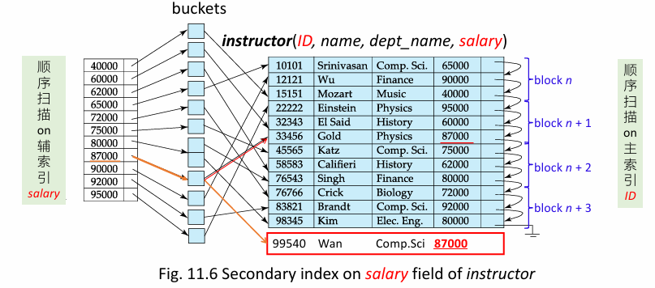

**索引顺序文件（index-sequential file)：** 搜索键上有聚集索引的文件

### 聚集索引 vs 主索引

**聚集索引**

- 索引文件的搜索键所规定的顺序与被索引的顺序文件中的记录顺序一致

**主索引**

- 建立在主键（主属性上）的索引

索引建立：

- 当一个表定义了主键后，DBMS自动为该表在主键上建立聚集索引，该索引同时又是主索引

  - 主索引一定是聚集索引，但聚集索引不一定是主索引
    - 在SQL Server中，可以为主键建立非聚集索引，即主键上的索引可以是非聚集的
- **一个表上只能建立一个聚集索引，也只能有一个主索引**

  - why？数据文件根据索引项进行排序，只能有一种排列顺序
  - **再建立索引默认变成非聚集索引**
- 表可以建立多个非聚集索引
- 如果一个表上没有定义主键，则不会有主索引；但可以为该表建立一个聚集索引

## 14.2.2 稠密索引和稀疏索引

索引项（index entry）或索引记录（index record）由一个搜索码值和指针构成

**稠密索引（dense index)**

- 在稠密索引中，对于文件中的每个搜索码值都有一个索引项。
- 索引文件中每个搜索键值，都对应索引表文件中的一个索引项
- 在稠密聚集索引中，索引记录包括搜索码值以及指向具有该搜索码值的第一条数据记录的指针。
- 具有相同搜索码值的其余记录会顺序地存储在第一条记录之后，由于该索引是聚集索引，因此记录是根据相同的搜索码值排序的。
- 在稠密非聚集索引中，索引必须存储指向具有相同搜索码值的所有记录的指针列表。

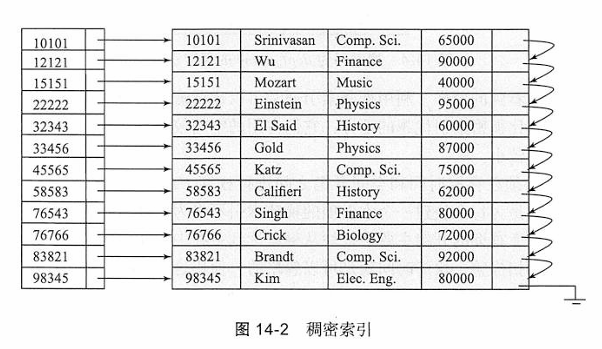

另外一种情况下，假设搜索码值并不是主码，非聚集的稠密索引也是有可能的：

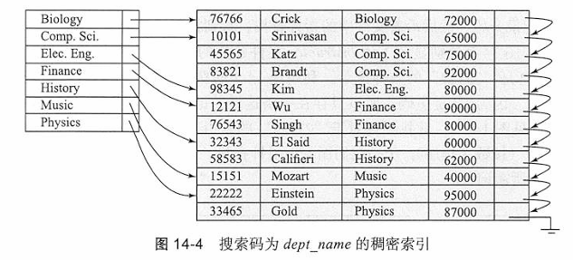

**稀疏索引（sparse index)**

- 在稀疏索引中，只为某些搜索码值建立索引项
- 只有当关系按搜索码排列次序存储时才能使用稀疏索引

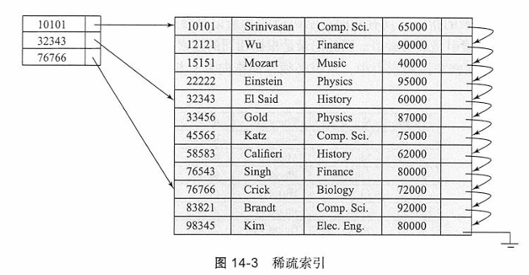

### 性能初提

- 索引在搜索记录时能带来显著的优势

  - 也就是用于 `select`操作
  - 索引可以**加速** `select`操作
- 然而，更新索引会给数据库修改操作带来额外开销——当文件被修改时，该文件上的所有索引都必须随之更新

  - 数据库的 `insert/delete/update/alter`等操作会触发DBMS对索引进行调整，引起额外的开销
  - 索引可能**减慢** `insert/delete/update/alter`操作

## 14.2.3 多级索引

- 索引表文件可能非常大，无法完全存放在内存中
- 解决方案：将磁盘上的主索引当作顺序文件处理，并在其上构建一个稀疏索引
  - **外层索引**——主索引表文件的稀疏索引
  - **内层索引**——主索引表文件本身
- 若外层索引也大到无法装入主内存，还可以再创建一层索引，以此类推

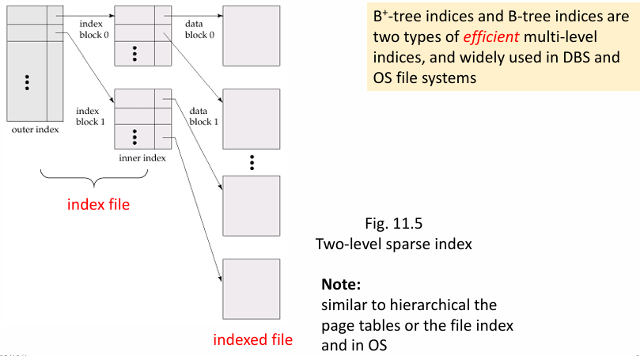

## 14.2.3 索引更新（略）

## 14.2.4 辅助索引 secondary

辅助索引必须是稠密的，而聚集索引可以是稀疏的

候选码上的辅助索引看起来就像是稠密聚集索引，只不过索引中由连续值所指向的记录并不是顺序存放的。

## 14.2.5 多码索引

- **多键索引/复合（键）索引【多键/复合（键）索引】**
- 基于复合搜索键创建的索引，复合搜索键是包含多个属性的搜索键
- 例如：`(dept_name, salary)`
- 示例：创建多键索引的SQL语句

  - `create index Mutiple-index on instructor(dept_name, salary)`
- 使用复合索引，应满足左前缀原则

  - 更多细节请参考14.6节“多键访问”

# 14.3 $B^+$树索引文件

$B^+$树索引（Bttree index）结构:

- 在数据插入和删除的情况下仍能保持其执行效率
- 引采用平衡树（balanced tree）结构，从树根到树叶的每条路径的长度都是相同的
- **特性：**树中每个非叶节点（除根节点之外）有$\lceil n/2 \rceil$到$n$个孩子，其中$n$对于特定的树是固定的；根节点有2到$n$个孩子。

## 14.3.1 B＋树的结构

B+ 树索引是一种多级索引

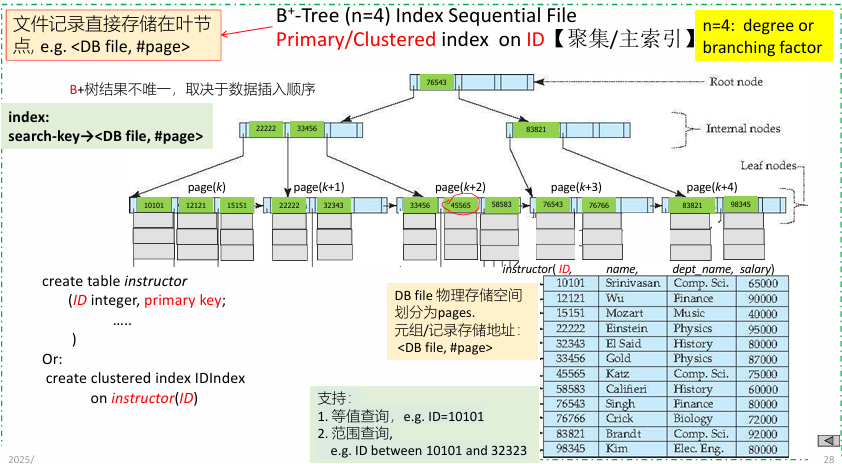

B+ 树节点规定：

- 树节点：
  - 包含$n-1$个搜索码值$K_1, K_2, \dots, K_{n-1}$，以及$n$个指针$P_1, P_2, \dots, P_n$。
  - 一个节点内的搜索码值是有序存放的，因此，如果$i < j$，那么$K_i < K_j$
  - 其中 $n$ 是数据结构规定的，与数据集无关

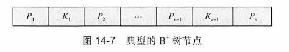

- 叶节点（leaf node）
  - 双指针
  - 指向搜索键的文件记录
  - 指向下一个叶节点
  - 每个叶节点**最多可有 $n-1$ 个值，最少包含 $\lceil (n-1)/2 \rceil$ 个值**

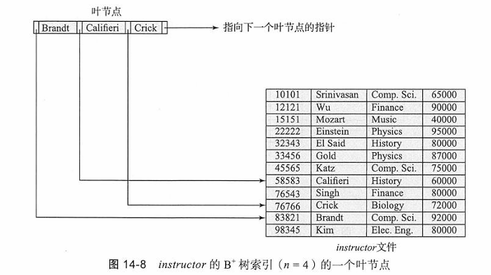

- 非叶节点（nonleaf node）
  - 叶节点之上的一个多级（稀疏）索引
  - 结构和叶节点的结构相同，只不过非叶节点中所有指针都是指向树节点的。
  - 一个非叶节点可以**最多容纳$n$个指针，同时必须至少容纳$\lceil n/2 \rceil$个指针。**
  - 一个节点中的指针数称为该节点的扇出（fanout）。非叶节点也被称为内部节点（internal node）。

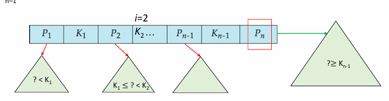

概念图：

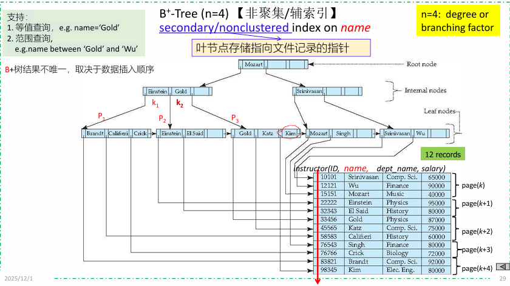

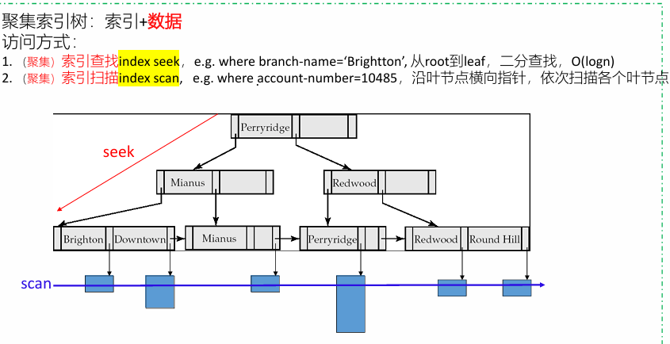

部分例子：

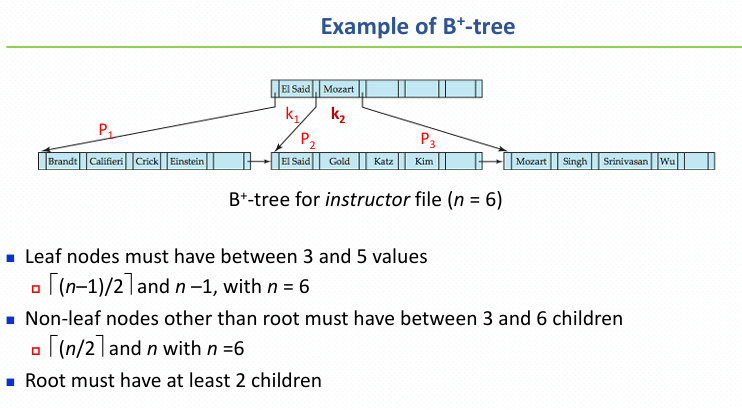

- B⁺树包含的层数相对较少

  - 根节点的下一层至少包含 $2*\lceil n/2 \rceil$ 个值
  - 再下一层至少包含 $2*\lceil n/2 \rceil*\lceil n/2 \rceil$ 个值
  - 以此类推
- **树高度**

  - 从根节点到叶节点所经历的边的数目
  - 若文件中包含 $K$ 个搜索键值，则树高度不超过：
    $$
    h=\lceil \log_{\lceil n/2 \rceil}(K) \rceil
    $$

## 14.3.2 B + 树的访问

- 对聚集/主索引，根据特定search key值（如ID=12121），从索引树root节点开始，搜索访问存储在叶节点的文件记录，需要访问的block数目最多为$h + 1$
- 对辅索引/非聚集索引，根据特定search key值（如name='Wu'），从索引树root节点开始

  - 搜索访问存储在叶节点中的记录指针，需要访问的block数目最多为$h + 1$
  - 进一步地，根据指针访问文件记录，需要访问的总block数目最多为$h + 2$

# 14.4 B＋树扩展

## 14.4.1 B＋树文件组织

不仅把B＋树结构作为索引来使用，而且把它作为一种文件中记录的组织方式来使用

在B‘树文件组织（Bk-tree file organization）中，树的叶节点存储的是记录而不是指向记录的指针。即**在树节点中直接存储文件记录**

由于记录通常比指针大，一个叶节点中能存储的最多记录数量比一个非叶节点中能存储的指针数量要少。 然而，叶节点仍然要求至少是半满的。


组织方式：

- 插入和删除的处理方式，与B⁺树索引中条目的插入和删除方式相同。
- 良好的空间利用率很重要，因为记录比指针占用更多空间。
- 为了提高空间利用率，在拆分和合并时让更多的兄弟节点参与重分配
  - 让2个兄弟节点参与重分配（尽可能避免拆分/合并），可使每个节点至少包含$\lceil 2n/3 \rceil$个条目

## 14.4.5 B 树索引文件

- B树允许搜索键值仅出现一次

  - 避免了搜索键的冗余存储
  - 每个search key在树中（叶节点、非叶节点）只出现一次
- 非叶节点中的搜索键不会在B树的其他位置出现；非叶节点中的每个搜索键必须额外包含一个指针字段

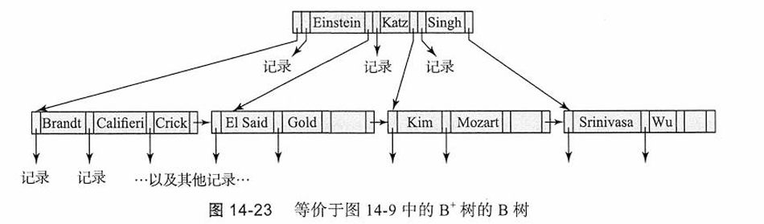

一种广义的B树叶节点如图14-24a 所示；非叶节点出现在图14-24b 中

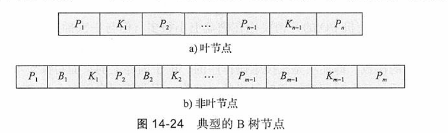

- **B树索引的优势**

  - 相比对应的B⁺树，可能使用更少的树节点
  - 有时可以在到达叶节点之前就找到搜索键值
- **B树索引的劣势**

  - 只有少部分搜索键值能提前找到
  - 非叶节点体积更大，因此扇出会降低。所以，B树的深度通常比对应的B⁺树更大
  - 插入和删除操作比B⁺树更复杂
  - 实现难度比B⁺树更高

# 14.5 散列索引

文件记录存储在一组 **桶（bucket）** 中，例如数据库文件中的页

- 桶是一个**存储单元，包含一条或多条记录**

  - 桶通常对应一个磁盘块
- 我们通过**哈希函数**，根据条目的搜索键值得到其对应的桶

### 哈希函数 **$h$**

- 是一个从文件中所有搜索键值 $K$ 的集合，映射到所有桶地址集合（即文件记录的地址集合）的函数
- 不同搜索键值的条目可能被映射到同一个桶；因此需要按顺序搜索整个桶来定位条目
- **静态哈希**

  - 使用过程中，哈希函数 $h$ 不能被修改
- **动态哈希**

  - 哈希函数 $h$ 可以被动态修改
- **在哈希索引中**

  - 桶中存储带有记录指针的条目，即：搜索键 $\rightarrow$ 记录指针
  - 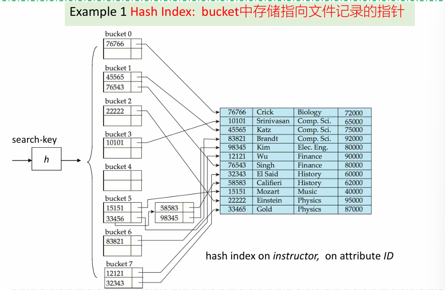
- **在哈希文件组织中**

  - 桶中直接存储记录，通过哈希函数根据记录的搜索键值直接确定其对应的桶
    - 即：搜索键 $\rightarrow$ 记录
  - 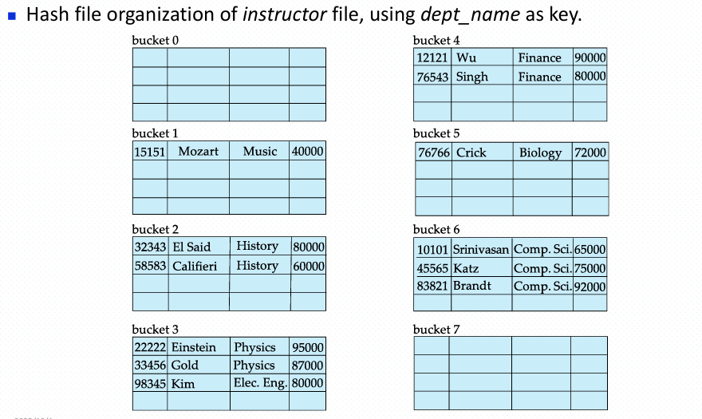

# 14.6 多码访问（重点）

## 14.6.1 使用多个单码索引

没啥用

## 14.6.2 多码索引(重点)

最左前缀原则：

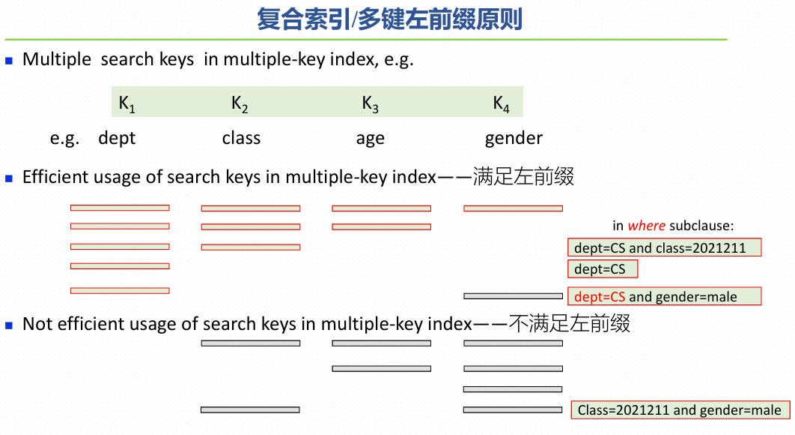

- 假设我们有一个基于复合搜索键 `(dept_name, salary)`的索引
- **【有效使用索引】**

  - 1. 配合 `where`子句的【**等值**】条件

    ```sql
    where dept_name = "Finance" and salary = 80000
    ```

    基于 `(dept_name, salary)`的索引可用于仅获取同时满足这两个条件的记录。
  - 1. 也能高效处理【**范围**】条件

    ```sql
    where dept_name = "Finance" and salary < 80000
    ```
  - 1. 也能高效处理【**左前缀**】条件

    ```sql
    where dept_name = "Finance"
    ```

    1. 可能会获取许多满足第一个条件但不满足第二个条件的记录，此时索引无法被高效利用【**索引部分有效**】
  - ```sql
    where dept_name < "Finance" and salary = 80000
    ```

    1. 该查询不会使用这个索引【**索引失效**】
  - ```sql
    where salary = 80000
    ```

# 14.7 索引的创建

- **创建索引**

  ```sql
  create index <索引名> on <关系名>
      (<属性列表>)
  ```

  示例：

  ```sql
  create index b-index on branch(branch_name)
  ```
- 使用 `create unique index`可以间接指定并强制搜索键是候选键

  - 若SQL支持 `unique`完整性约束，则实际上不需要这样做
- **删除索引**

  ```sql
  drop index <索引名>
  ```

## 14.7.1 适宜建立索引的属性（需掌握）

### Select 操作（提高）

对select查询，针对select-from-where-groupby-having操作，在以下属性上建立聚集或非聚集索引，有利于提高访问速度

- where子句涉及到的查询属性（e.g. budget）、连接属性(dept_name)
- group-by子句中的分组属性, e.g. building

```sql
select  building, avg (salary) as avg_salary
from    instructor natural_join department
where   budget>20000
group by building
        having avg (salary) > 42000
order by dept_name desc
```

### Delete 操作（降低）

对 delete-from-where 操作，如果在 where 查询条件属性上建立了索引，有利于在数据库文件中快速定位由 where 条件定义的需要删除的元组。但删除这些元组后，将引起 DBMS 将对索引进行调整重组，引起额外的系统开销，可能会降低 delete 的执行速度。

### Insert 操作（降低）

对 insert 操作，在关系表中插入新元组后，DBMS 将根据新插入的元组在索引属性上的值，对表中的索引进行调整重组，必然引起额外系统开销，降低 insert 的执行速度

### Update 操作（提高找，更新完后降，整体未知）

对update-set-where操作，如果在where查询条件属性上建立了索引，有利于在数据库文件中快速定位update需要访问的元组。但如果set操作修改了索引涉及到的属性的值，则会引发DBMS对索引的重组。索引重组带来额外的系统开销，降低了update的执行速度

E.g.对关系表Student(ID, name, dept, age)，在属性ID上建立聚集或非聚集索引，该索引未必能提高下述update的执行速度

```sql
update  tbStudent
set     ID=ID +1
where   ID>20
```
