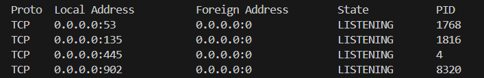

# Windows端查询端口占用

### 查看端口占用的进程

```bash
netstat -ano
```

查看所有端口的占用情况

```bash
netstat -ano | findstr :端口号
```

查看对应端口的占用情况，两者具体都会返回一个表格：



分别代表：协议、本地地址、外部地址、状态、进程ID

### 查看对应进程的详细信息

```
tasklist | findstr PID
```

这就能告诉你  **哪个程序正在使用该连接** 


