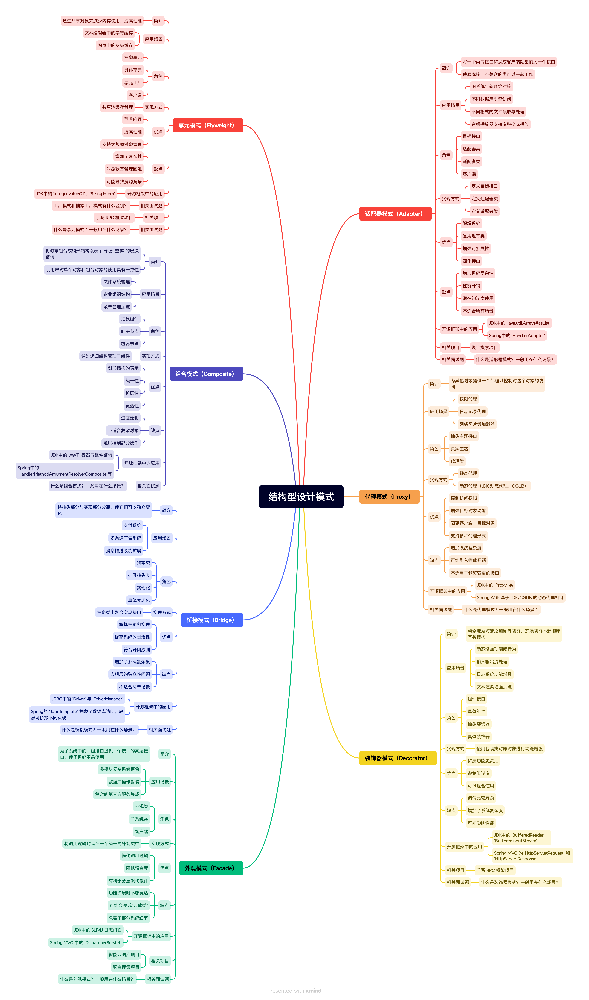
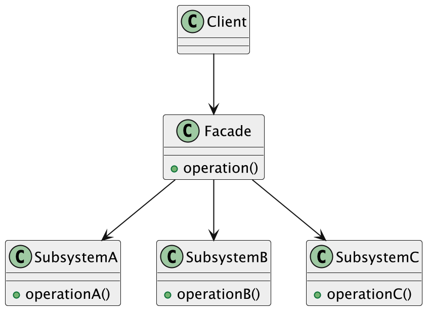

结构型模式是一类关注**“类和对象的组合方式”**的设计模式。它的目标不是去解决某个具体的业务问题，而是**解决类之间、对象之间怎么搭配、怎么协作更合理的问题**。
结构型模式就是用来规范各个类之间的组合方式的。它通过继承和组合的手段，把已有的类进行合理的拼装，让系统的结构更加清晰、松散耦合，而且更容易扩展和复用。



# 代理模式（Proxy Pattern）

**给某个对象提供一个代理对象，并由代理对象来控制对这个对象的访问** 。

当你不想或者不能直接访问某个对象时（比如资源太大、权限限制、需要做一些额外操作），可以用代理对象来“挡在前面”，由它统一处理所有访问。代理可以帮你做权限校验、延迟加载、日志记录，甚至缓存等等操作，但背后的真实逻辑其实还是那个“本体对象”在干，只不过被代理包了一层壳。

## 应用场景

* 权限代理：在系统中有权限控制时，代理模式可用于控制对某些功能或资源的访问。例如，某些用户或角色只能访问特定的资源或方法，通过代理来拦截调用，验证用户权限后再决定是否允许执行操作。
* 日志记录代理：在业务系统中，操作日志的记录是非常常见的需求。代理模式可以用于方法调用的拦截，在方法执行前后自动记录日志信息，而不需要修改原始业务逻辑。例如，在一个订单系统中，所有订单的创建、修改操作都通过代理来记录日志，追踪操作过程。
* 网络图片懒加载器：在开发一些图片浏览应用或文档查看工具时，我们不希望一开始就把所有图片都加载到内存中，尤其是当图片很多、尺寸又大时。这时我们可以使用代理模式，让“代理图片”控制真实图片的加载时机，只有真正需要显示时再去加载资源，从而节省内存和加快响应。

## 模式结构

代理模式通常包含以下三个核心角色：

1. **抽象主题（Subject）** ：

   * 定义真实主题和代理主题共同实现的接口。客户端将通过这个接口与真实主题或代理主题进行交互。
   * 在图片加载的例子中，就是 `Image` 接口，它定义了 `display()` 方法。
2. **真实主题（Real Subject）** ：

   * 代理对象所代表的真实对象。它包含了业务逻辑或实际的处理功能。
   * 例如：`RealImage` 类，负责实际的图片加载和显示。这个加载过程通常是耗时的。
3. **代理主题（Proxy）** ：

   * 持有对真实主题的引用。它实现了与真实主题相同的接口。
   * 代理对象可以在将请求转发给真实主题之前或之后执行额外的操作，或者根据需要延迟真实对象的创建和初始化（这就是**延迟加载/懒加载**的一种实现方式）。
   * 例如：`ImageProxy` 类，它会控制 `RealImage` 对象的加载和显示。

### 典型代码实现

#### 1. 抽象主题：`Image` 接口

**Java**

```java
// 图片接口
public interface Image {
    void display(); // 定义显示图片的方法
}
```

这个接口是真实图片和代理图片都必须遵循的契约，保证客户端可以统一调用 `display()` 方法。

#### 2. 真实主题：`RealImage` 类

为了完整演示，我们假设 `RealImage` 内部的 `load` 是一个耗时操作，并且 `ImageView` 和 `LoadingIndicator` 是独立的辅助类。

**Java**

```java
// 真实图片类
public class RealImage implements Image {
    private String imagePath;

    public RealImage(String imagePath) {
        this.imagePath = imagePath;
        // 模拟图片加载的耗时操作
        load(imagePath); // 真实的图片加载发生在这里
    }

    private void load(String imagePath) {
        System.out.println("正在从磁盘/网络加载图片: " + imagePath + "...");
        try {
            Thread.sleep(2000); // 模拟加载延迟
        } catch (InterruptedException e) {
            Thread.currentThread().interrupt();
        }
        System.out.println("图片加载完成: " + imagePath);
    }

    @Override
    public void display() {
        // 实际显示图片
        System.out.println("显示图片: " + imagePath);
        // new ImageView().show(); // 假设这里是实际显示图片到UI的组件
    }
}

// 辅助类：加载指示器
class LoadingIndicator {
    public void show() {
        System.out.println("显示加载进度指示器...");
    }
    public void hide() {
        System.out.println("隐藏加载进度指示器。");
    }
}

// 辅助类：图片视图（假设是UI组件）
class ImageView {
    public void show() {
        // 实际显示图片视图
        System.out.println("图片视图已显示。");
    }
}
```

#### 3. 代理主题：`ImageProxy` 类

这是代理模式的核心。

```java
// 代理类
public class ImageProxy implements Image {
    private String imagePath;       // 代理知道要加载哪个图片
    private RealImage realImage;    // 持有真实对象的引用

    public ImageProxy(String imagePath) {
        this.imagePath = imagePath;
    }

    @Override
    public void display() {
        new LoadingIndicator().show(); // 显示加载进度

        // 核心逻辑：只有在第一次调用 display() 时才创建真实对象并加载图片
        if (realImage == null) { //
            realImage = new RealImage(imagePath); // 加载真实图片
        }

        new LoadingIndicator().hide(); // 隐藏加载进度
        realImage.display();           // 显示实际图片
        // new ImageView().show();     // 代理模式中，实际显示由 realImage 负责
    }
}
```

**代码分析：**

* `ImageProxy` 同样实现了 `Image` 接口，因此可以被客户端像使用 `RealImage` 一样使用。
* 它包含一个 `RealImage` 类型的引用 `realImage`。
* 在 `display()` 方法中，它首先显示加载指示器。
* **关键的延迟加载（Lazy Loading）** ：`if (realImage == null)` 这一判断确保了 `RealImage` 对象只会在它**第一次真正被需要**时才创建和加载。在此之前，客户端即使持有了 `ImageProxy` 对象，耗时的图片加载操作也不会发生。
* 加载完成后，隐藏指示器，然后将 `display()` 请求转发给 `realImage`。

#### 4. 客户端使用

```java
public class Client {
    public static void main(String[] args) {
        // 客户端通过接口来使用Image对象
        // 注意：这里创建的是代理对象，而不是直接创建RealImage
        System.out.println("客户端准备显示第一张图片...");
        Image image1 = new ImageProxy("high_res_photo_1.jpg"); // 此时 RealImage 并未加载
        System.out.println("图片代理对象已创建，但真实图片尚未加载。");

        // 第一次调用 display()，真实图片才会被加载
        System.out.println("\n第一次调用 display() 方法:");
        image1.display(); // 此时会触发 RealImage 的加载

        System.out.println("\n客户端准备显示第二张图片...");
        Image image2 = new ImageProxy("another_high_res_photo_2.jpg");

        // 假设这里有一些其他操作，不立即显示图片
        System.out.println("执行其他操作...");
        try {
            Thread.sleep(1000);
        } catch (InterruptedException e) {
            Thread.currentThread().interrupt();
        }

        // 第二次调用 display()，真实图片才会被加载
        System.out.println("\n第二次调用 display() 方法:");
        image2.display();

        System.out.println("\n再次调用第一张图片的 display() 方法 (不会再次加载真实图片):");
        image1.display(); // 此时 realImage 已经存在，不会再次加载
    }
}
```

**运行结果示例：**

```
客户端准备显示第一张图片...
图片代理对象已创建，但真实图片尚未加载。

第一次调用 display() 方法:
显示加载进度指示器...
正在从磁盘/网络加载图片: high_res_photo_1.jpg...
图片加载完成: high_res_photo_1.jpg
隐藏加载进度指示器。
显示图片: high_res_photo_1.jpg

客户端准备显示第二张图片...
执行其他操作...

第二次调用 display() 方法:
显示加载进度指示器...
正在从磁盘/网络加载图片: another_high_res_photo_2.jpg...
图片加载完成: another_high_res_photo_2.jpg
隐藏加载进度指示器。
显示图片: another_high_res_photo_2.jpg

再次调用第一张图片的 display() 方法 (不会再次加载真实图片):
显示加载进度指示器...
隐藏加载进度指示器。
显示图片: high_res_photo_1.jpg
```

从输出可以看出，`RealImage` 的加载（耗时操作）只在 `display()` 第一次被调用时才发生。

## 与单例模式之间的联系

### 受控的、唯一的访问点（在特定实现下）

1. **单例模式的核心** ：

* 确保一个类只有一个实例，并提供一个全局访问点来获取这个唯一的实例。
* 例如，`DBConnectionManager.getInstance()` 方法确保无论调用多少次，都返回同一个 `DBConnectionManager` 实例。

1. **代理模式的某个应用场景（特别是虚拟代理或缓存代理）** ：

* 代理对象通常会 **懒加载** （延迟创建）真实对象。这意味着在代理内部，真实对象的创建可能被推迟到第一次真正需要时。
* 在某些实现中，真实对象一旦创建，代理可能会**缓存**这个真实对象的引用，并且后续的请求都通过这个缓存的引用进行转发。这在效果上，使得真实对象对于外部调用者而言，通过代理层看起来像是一个“被唯一控制和访问”的实例。

当代理模式采用**延迟加载（懒汉式）**并**缓存真实对象实例**时，它为真实对象提供了一个**首次按需创建且后续复用**的访问点，这与单例模式的“全局唯一实例”在**实例化策略**和**访问控制**上表现出一定的相似性。

# 装饰模式 （Decorator Pattern）

**动态地给对象添加额外的功能，而不会影响到其他对象** 。

想象一个场景：你正在开发一个咖啡点单系统。最简单的咖啡是“基础咖啡”，但顾客可以根据喜好添加各种配料（如牛奶、糖、摩卡、奶泡）。每添加一种配料，咖啡的价格和描述都会发生变化。

* **传统继承方式的问题** ：如果你使用继承来表示不同的咖啡组合，很快就会陷入“类爆炸”的困境。
  * `Coffee` -> `MilkCoffee` -> `MilkSugarCoffee`
  * `Coffee` -> `MochaCoffee` -> `MochaMilkCoffee`
  * 组合爆炸：`2^n` 种组合，如果有 `n` 种配料，你需要 `2^n` 个子类。这会使得系统非常庞大、难以维护和扩展。
* **直接在基类中添加方法的问题** ：在 `Coffee` 基类中为每种配料添加方法（如 `addMilk()`, `addSugar()`），会使基类变得臃肿，并且不灵活（不是所有咖啡都需要所有配料）。
* **装饰器模式的解决方案** ：它不是通过继承来扩展功能，而是通过**组合**的方式，将一个对象包装（装饰）在另一个对象之内，从而动态地添加新的职责。

## 基本结构

装饰器模式通常包含以下四个核心角色：

1. **抽象组件（Component）** ：

   * 定义一个抽象接口或抽象类，是客户端和具体组件及装饰器的共同接口。它声明了所有具体组件和装饰器都必须实现的业务方法。
   * 在咖啡点单的例子中，就是 `Beverage` 接口，定义了 `cost()` 和 `getDescription()` 等方法。
2. **具体组件（Concrete Component）** ：

   * 抽象组件接口的实现类，是我们需要被装饰的原始对象。它实现了基本的核心功能。
   * 例如：`Espresso`（浓缩咖啡），提供最基础的咖啡功能和价格。
3. **抽象装饰器（Decorator）** ：

   * 实现了抽象组件接口，并且内部持有一个对抽象组件对象的引用。它通常是一个抽象类，作为所有具体装饰器的基类。
   * 它的作用是**包装（或代理）**组件，并转发对组件的请求。子类可以在转发请求之前或之后添加新的行为。
   * 例如：`CondimentDecorator`，它是一个抽象类，也实现了 `Beverage` 接口，并包含一个 `Beverage` 引用。
4. **具体装饰器（Concrete Decorator）** ：

   * 抽象装饰器的具体实现类，负责向其所包含的组件添加特定的新职责。
   * 例如：`Milk`（牛奶）、`Sugar`（糖浆）、`Mocha`（摩卡），它们各自实现 `CondimentDecorator`，并在 `cost()` 和 `getDescription()` 方法中添加自己的逻辑。

### 典型代码实现（Java 示例 - 咖啡点单）

我们以咖啡点单系统为例来演示装饰器模式。

#### 1. 抽象组件：`Beverage` 接口

```java
// 抽象组件：饮品接口
public interface Beverage {
    String getDescription(); // 获取饮品描述
    double cost();       // 计算饮品价格
}
```

#### 2. 具体组件：`Espresso` (基础咖啡)

```java
// 具体组件：浓缩咖啡 (基础饮品)
public class Espresso implements Beverage {
    @Override
    public String getDescription() {
        return "浓缩咖啡";
    }

    @Override
    public double cost() {
        return 15.0; // 基础价格
    }
}

// 另一个具体组件：HouseBlend (混合咖啡)
public class HouseBlend implements Beverage {
    @Override
    public String getDescription() {
        return "混合咖啡";
    }

    @Override
    public double cost() {
        return 18.0; // 基础价格
    }
}
```

#### 3. 抽象装饰器：`CondimentDecorator`

```java
// 抽象装饰器：配料装饰器
public abstract class CondimentDecorator implements Beverage {
    // 关键：抽象装饰器内部持有对抽象组件的引用
    protected Beverage beverage;

    // 构造函数，需要传入一个Beverage对象来装饰
    public CondimentDecorator(Beverage beverage) {
        this.beverage = beverage;
    }

    // 抽象方法，强制子类实现如何获取描述，因为装饰器会改变描述
    @Override
    public abstract String getDescription();

    // 抽象方法，强制子类实现如何计算价格，因为装饰器会改变价格
    @Override
    public abstract double cost();
}
```

#### 4. 具体装饰器：`Milk`, `Sugar`, `Mocha`

```java
// 具体装饰器：牛奶
public class Milk extends CondimentDecorator {
    public Milk(Beverage beverage) {
        super(beverage); // 调用父类构造函数，传入被装饰的饮品
    }

    @Override
    public String getDescription() {
        // 在被装饰饮品描述的基础上，添加牛奶描述
        return beverage.getDescription() + ", 牛奶";
    }

    @Override
    public double cost() {
        // 在被装饰饮品价格的基础上，增加牛奶价格
        return beverage.cost() + 3.0;
    }
}

// 具体装饰器：糖浆
public class Sugar extends CondimentDecorator {
    public Sugar(Beverage beverage) {
        super(beverage);
    }

    @Override
    public String getDescription() {
        return beverage.getDescription() + ", 糖浆";
    }

    @Override
    public double cost() {
        return beverage.cost() + 2.0;
    }
}

// 具体装饰器：摩卡
public class Mocha extends CondimentDecorator {
    public Mocha(Beverage beverage) {
        super(beverage);
    }

    @Override
    public String getDescription() {
        return beverage.getDescription() + ", 摩卡";
    }

    @Override
    public double cost() {
        return beverage.cost() + 5.0;
    }
}
```

#### 5. 客户端使用

```java
public class CoffeeShopClient {
    public static void main(String[] args) {
        // 1. 点一杯纯浓缩咖啡
        Beverage espresso = new Espresso();
        System.out.println("订单 1: " + espresso.getDescription() + " 价格: " + espresso.cost() + "元");

        System.out.println("--------------------");

        // 2. 点一杯浓缩咖啡加牛奶
        // 将 Espresso 对象包装在 Milk 装饰器中
        Beverage espressoWithMilk = new Milk(espresso); // 第一次装饰
        System.out.println("订单 2: " + espressoWithMilk.getDescription() + " 价格: " + espressoWithMilk.cost() + "元");

        System.out.println("--------------------");

        // 3. 点一杯浓缩咖啡加牛奶再加糖浆
        // 在 espressoWithMilk (已经被牛奶装饰的咖啡) 的基础上，再用 Sugar 装饰器包装
        Beverage espressoWithMilkAndSugar = new Sugar(espressoWithMilk); // 第二次装饰
        System.out.println("订单 3: " + espressoWithMilkAndSugar.getDescription() + " 价格: " + espressoWithMilkAndSugar.cost() + "元");

        System.out.println("--------------------");

        // 4. 点一杯混合咖啡加双份摩卡
        Beverage houseBlend = new HouseBlend();
        // 第一次摩卡
        Beverage houseBlendWithMocha1 = new Mocha(houseBlend);
        // 第二次摩卡
        Beverage houseBlendWithMocha2 = new Mocha(houseBlendWithMocha1);
        System.out.println("订单 4: " + houseBlendWithMocha2.getDescription() + " 价格: " + houseBlendWithMocha2.cost() + "元");
    }
}
```

**运行结果：**

```
订单 1: 浓缩咖啡 价格: 15.0元
--------------------
订单 2: 浓缩咖啡, 牛奶 价格: 18.0元
--------------------
订单 3: 浓缩咖啡, 牛奶, 糖浆 价格: 20.0元
--------------------
订单 4: 混合咖啡, 摩卡, 摩卡 价格: 28.0元
```

## 实现意义

1.**组合关系的确立** ：

该方法的重点在于，通过额外一个继承产品基类的装饰器，添加一个装饰的对象，在装饰器内部添加一个产品类型的引用，并让这个构造函数来**接收**并**初始化**这个引用，从而建立起**组合关系**：

```java
// 构造函数，需要传入一个Beverage对象来装饰
    public CondimentDecorator(Beverage beverage) {
        this.beverage = beverage;
    }
```

这意味着 `Milk` 对象“拥有”一个 `Beverage` 对象，并且这个 `Beverage` 对象就是它所要装饰的那个对象

**2.链式包装的实现基础** ：

进一步地说，该装饰器的构造函数因此能够接受**任何实现了 `Beverage` 接口的对象**，包括：

* 原始的具体组件（如 `new Espresso()`）。
* **或者**另一个已经经过装饰的 `Beverage` 对象（如 `new Milk(new Espresso())` 的结果）。

这使得装饰器可以一层一层地嵌套，形成一个 **装饰链** 。例如：

* `Beverage myCoffee = new Espresso();`
* `myCoffee = new Milk(myCoffee);` // `Milk` 装饰 `Espresso`
* `myCoffee = new Sugar(myCoffee);` // `Sugar` 装饰 `Milk(Espresso)`
* `myCoffee = new Mocha(myCoffee);` // `Mocha` 装饰 `Sugar(Milk(Espresso))`

3.**遵循相同的接口** ：

由于装饰类同样实现了产品类的接口，这意味着无论是原始的 `Espresso` 对象，还是经过 `Milk` 装饰的 `Beverage` 对象，对客户端来说，它们都是 `Beverage` 类型，客户端可以以统一的方式调用 `getDescription()` 和 `cost()` 方法。

当客户端调用 `Milk` 对象的 `getDescription()` 或 `cost()` 方法时，`Milk` 装饰器内部会**转发**这个请求到它所包装的 `beverage` 对象上，并在转发前后添加自己的逻辑。例如：

```java
// Milk 的 cost() 方法：
@Override
public double cost() {
    return beverage.cost() + 3.0; // 先获取被装饰饮品的价格，再加上自己的价格
}
```

# 适配器模式

通过创建一个适配器类，允许两个**不兼容的接口**协同工作。它将一个类的接口转换成客户端期望的另一个接口，从而解决接口不匹配的问题。

## 模式结构

适配器模式有两种主要实现方式： **类适配器（Class Adapter）和对象适配器（Object Adapter）** 。它们的结构略有不同。

### 1. 类适配器（通过继承实现）

* **抽象目标（Target）** ：客户端所期望的接口。
* **被适配者（Adaptee）** ：现存的、需要被适配的类，其接口与目标接口不兼容。
* **适配器（Adapter）** ：
  * **继承**被适配者。
  * **实现**目标接口。
  * 通过继承被适配者的功能并实现目标接口，它能够将客户端对目标接口的调用转换为对被适配者方法的调用。
  * **限制** ：只能适配一个类（因为 Java 不支持多重继承），并且适配器和被适配者之间的耦合度较高。

### 2. 对象适配器（通过组合/委托实现）

* **抽象目标（Target）** ：客户端所期望的接口。
* **被适配者（Adaptee）** ：现存的、需要被适配的类。
* **适配器（Adapter）** ：
  * **实现**目标接口。
  * **包含（组合）**一个被适配者对象的实例作为其成员变量（即委托）。
  * 当客户端调用适配器的方法时，适配器会将请求转发给其内部持有的被适配者对象，并进行必要的转换。
  * **优势** ：更灵活，因为可以适配任何被适配者子类，并且支持运行时切换被适配者实例。这是更常用和推荐的方式。

## 适配器模式代码详解：`MediaAdapter` 的实现

我们先回顾一下相关接口和类：

1. **目标接口 (Target)** ：`MediaPlayer`

* 客户端期望使用的接口，定义了统一的播放方法 `play(String audioType, String fileName)`。

  **Java**

```
   // 目标接口
   public interface MediaPlayer {
       void play(String audioType, String fileName);
   }
```

1. **高级媒体接口 (Adaptee Interfaces - 被适配者接口)** ：`AdvancedMediaPlayer`

* 现有的一些高级播放器接口，它们有自己特定的播放方法（例如 `playVlc` 和 `playMp4`），与 `MediaPlayer` 的 `play` 方法不兼容。

  **Java**

```
   // 高级媒体接口
   public interface AdvancedMediaPlayer {
       void playVlc(String fileName);
       void playMp4(String fileName);
   }
```

* 为了实现 `AdvancedMediaPlayer`，通常会有具体的实现类，比如 `VlcPlayer` 和 `Mp4Player`。我们这里先补充这两个具体实现，方便后续 `MediaAdapter` 的理解：

  **Java**

```
   // 具体高级播放器：VLC 播放器
   public class VlcPlayer implements AdvancedMediaPlayer {
       @Override
       public void playVlc(String fileName) {
           System.out.println("播放 VLC 文件: " + fileName);
       }

       @Override
       public void playMp4(String fileName) {
           // VLC 播放器不直接支持 MP4，或者这里可以抛出异常，或者不做任何事
           // 这里我们简单表示不支持
           System.out.println("VLC 播放器不支持播放 MP4 文件。");
       }
   }

   // 具体高级播放器：MP4 播放器
   public class Mp4Player implements AdvancedMediaPlayer {
       @Override
       public void playVlc(String fileName) {
           // MP4 播放器不直接支持 VLC
           System.out.println("MP4 播放器不支持播放 VLC 文件。");
       }

       @Override
       public void playMp4(String fileName) {
           System.out.println("播放 MP4 文件: " + fileName);
       }
   }
```

#### 3. 适配器类 (Adapter)：`MediaAdapter`

现在，我们来详细解读 `MediaAdapter` 的实现：

**Java**

```
// 适配器类
public class MediaAdapter implements MediaPlayer { // ① 实现目标接口
    private AdvancedMediaPlayer advancedPlayer; // ② 组合被适配者接口

    // 构造函数，初始化适配器内部的高级播放器
    public MediaAdapter(String audioType) {
        // ③ 根据音频类型，创建具体的被适配者实例
        if (audioType.equalsIgnoreCase("vlc")) {
            advancedPlayer = new VlcPlayer();
        } else if (audioType.equalsIgnoreCase("mp4")) {
            advancedPlayer = new Mp4Player();
        }
        // 也可以在这里添加对不支持类型的处理，例如抛出异常
    }

    @Override
    public void play(String audioType, String fileName) { // ④ 实现目标接口的方法
        // ⑤ 根据音频类型，将 MediaPlayer 的 play 请求转换为 AdvancedMediaPlayer 的具体方法调用
        if (audioType.equalsIgnoreCase("vlc")) {
            advancedPlayer.playVlc(fileName);
        } else if (audioType.equalsIgnoreCase("mp4")) {
            advancedPlayer.playMp4(fileName);
        } else {
            System.out.println("不支持的媒体类型: " + audioType);
        }
    }
}
```

**详细解析：**

1. **`public class MediaAdapter implements MediaPlayer`** :

* 这行代码表明 `MediaAdapter` 类 **实现了 `MediaPlayer` 接口** 。这意味着，对于客户端而言，`MediaAdapter` 对象就像一个普通的 `MediaPlayer` 对象，它提供了 `MediaPlayer` 接口中定义的所有方法（在这里是 `play` 方法）。这是适配器模式的核心，因为它让适配器能够被客户端以统一的方式使用。

1. **`private AdvancedMediaPlayer advancedPlayer;`** :

* 这行代码声明了一个私有成员变量 `advancedPlayer`，其类型是**`AdvancedMediaPlayer` 接口**。
* 这是 **对象适配器模式的关键** ：适配器通过**组合（Aggregation）的方式，在其内部持有一个被适配者对象**的引用。`MediaAdapter` 不会直接继承 `VlcPlayer` 或 `Mp4Player`（那样就是类适配器了，且一次只能适配一个）。通过组合，它可以灵活地在运行时持有不同类型的 `AdvancedMediaPlayer` 实例（`VlcPlayer` 或 `Mp4Player`），并委托它们执行具体操作。

1. **`public MediaAdapter(String audioType)`** :

* 这是 `MediaAdapter` 的构造函数。它接收一个 `String audioType` 参数。
* **目的** ：在创建 `MediaAdapter` 实例时，需要告诉适配器它将要适配哪种“高级播放器”（是 `VlcPlayer` 还是 `Mp4Player`）。
* **`if (audioType.equalsIgnoreCase("vlc")) { advancedPlayer = new VlcPlayer(); } else if (audioType.equalsIgnoreCase("mp4")) { advancedPlayer = new Mp4Player(); }`** :
  * 构造函数内部根据传入的 `audioType` 参数， **实例化对应的具体被适配者** （`VlcPlayer` 或 `Mp4Player`），并将其赋值给 `advancedPlayer` 成员变量。
  * 这样，当 `MediaAdapter` 对象被创建时，它就已经“知道”自己内部要使用哪个具体的“高级播放器”来处理请求了。

1. **`@Override public void play(String audioType, String fileName)`** :

* 这是 `MediaAdapter` 实现 `MediaPlayer` 接口中的 `play` 方法。
* **目的** ：当客户端调用 `MediaPlayer` 的 `play` 方法时，实际上是这个适配器的 `play` 方法被调用了。适配器将在这里执行**“翻译”或“适配”的逻辑**。

1. **`if (audioType.equalsIgnoreCase("vlc")) { advancedPlayer.playVlc(fileName); } else if (audioType.equalsIgnoreCase("mp4")) { advancedPlayer.playMp4(fileName); } else { System.out.println("不支持的媒体类型: " + audioType); }`** :

* 这是 `play` 方法的 **核心适配逻辑** 。
* 适配器根据传入的 `audioType` 参数（客户端期望播放的类型），判断应该调用内部 `advancedPlayer` 对象的哪个 **具体方法** 。
* 如果 `audioType` 是 "vlc"，它就调用 `advancedPlayer.playVlc(fileName)`。
* 如果 `audioType` 是 "mp4"，它就调用 `advancedPlayer.playMp4(fileName)`。
* 这正是适配器模式的精髓：它将客户端（调用 `MediaPlayer.play()`）发出的一个统一请求，**转换和委托**给内部持有的被适配者对象（`AdvancedMediaPlayer` 的实例）的 **特定方法** （`playVlc()` 或 `playMp4()`）。这样就解决了 `MediaPlayer` 接口和 `AdvancedMediaPlayer` 接口之间的方法不匹配问题。

### 客户端使用示例

为了更好地理解，我们再添加一个客户端使用示例：

**Java**

```
public class AudioPlayerClient {
    public static void main(String[] args) {
        // 1. 直接使用支持 MP3 的 MediaPlayer (假设 MediaPlayer 自身支持 MP3)
        // 注意：这里的 MediaPlayer 可以是 MediaAdapter 以外的另一个实现类
        MediaPlayer basicPlayer = new MediaPlayer() {
            @Override
            public void play(String audioType, String fileName) {
                if (audioType.equalsIgnoreCase("mp3")) {
                    System.out.println("播放 MP3 文件: " + fileName);
                } else {
                    System.out.println("不支持的媒体类型: " + audioType);
                }
            }
        };

        System.out.println("--- 使用基础播放器播放MP3 ---");
        basicPlayer.play("mp3", "beyond_the_horizon.mp3");

        System.out.println("\n--- 使用适配器播放VLC和MP4 ---");

        // 2. 使用适配器来播放 VLC 文件
        // 客户端创建 MediaAdapter，传入 "vlc"，表示需要适配 VLC 播放器
        MediaPlayer vlcAdapter = new MediaAdapter("vlc");
        vlcAdapter.play("vlc", "my_vacation.vlc"); // 客户端调用统一的 play 方法

        // 3. 使用适配器来播放 MP4 文件
        // 客户端创建 MediaAdapter，传入 "mp4"，表示需要适配 MP4 播放器
        MediaPlayer mp4Adapter = new MediaAdapter("mp4");
        mp4Adapter.play("mp4", "favorite_movie.mp4"); // 客户端调用统一的 play 方法

        System.out.println("\n--- 尝试使用适配器播放不支持的格式 ---");
        MediaPlayer unknownAdapter = new MediaAdapter("ogg"); // 假设构造函数没有处理这种情况，或者处理为null
        // 注意：如果构造函数没有处理 "ogg"，这里可能会出现 NullPointerException
        // 实际应用中，构造函数应该有更严谨的类型检查或抛出异常
        unknownAdapter.play("ogg", "some_audio.ogg"); // 适配器会输出不支持信息
    }
}
```

**运行结果：**

```
--- 使用基础播放器播放MP3 ---
播放 MP3 文件: beyond_the_horizon.mp3

--- 使用适配器播放VLC和MP4 ---
播放 VLC 文件: my_vacation.vlc
播放 MP4 文件: favorite_movie.mp4

--- 尝试使用适配器播放不支持的格式 ---
不支持的媒体类型: ogg
```

### 总结

`MediaAdapter` 的右侧代码清晰地展示了**对象适配器模式**的核心原理：

1. **实现目标接口** ：让适配器看起来就像客户端期望的对象。
2. **组合被适配者** ：在其内部持有需要被适配的旧对象。
3. **转换请求** ：在实现目标接口的方法中，将客户端的请求**转换**为被适配者能够理解和执行的方法调用。

# 观察者模式

**当一个对象状态发生变化时，自动通知所有依赖于它的对象，并自动更新它们**

定义对象之间一对多的依赖关系，当一个对象的状态发生改变时，所有依赖它的对象都会得到通知并自动更新。这种模式旨在实现 **对象间的松耦合** 。

## 模式结构


观察者模式通常包含以下四个核心角色：

1. **抽象主题（Subject / Observable）** ：

* 定义了一个接口，用于管理观察者对象。它通常包含以下方法：
  * `attach(Observer observer)`：注册观察者（将观察者添加到通知列表中）。
  * `detach(Observer observer)`：移除观察者。
  * `notifyObservers()`：当自身状态改变时，通知所有注册的观察者。
* 它不关心具体观察者的类型，只与抽象观察者接口打交道。

1. **具体主题（Concrete Subject / Concrete Observable）** ：

* 实现了抽象主题接口，维护一个观察者列表。
* 当自身状态发生改变时，会调用 `notifyObservers()` 方法通知所有注册的观察者。
* 它通常会包含获取自身状态的方法，供观察者在收到通知后查询。

1. **抽象观察者（Observer）** ：

* 定义了一个接口，用于接收主题的通知。它通常包含一个 `update()` 方法，当主题状态改变时被调用。
* 所有具体观察者都必须实现这个接口。

1. **具体观察者（Concrete Observer）** ：

* 实现了抽象观察者接口。
* 当收到主题通知时，会执行具体的更新操作。这些操作通常会查询主题的最新状态。


### 典型代码实现（Java 示例 - 股票价格变化通知）

我们以股票价格变化通知为例来演示观察者模式。

#### 1. 抽象观察者：`StockObserver` 接口

**Java**

```
// 抽象观察者：股票观察者接口
public interface StockObserver {
    void update(); // 当股票价格变化时，通知观察者更新
}
```

#### 2. 抽象主题：`StockSubject` 接口

**Java**

```
import java.util.ArrayList;
import java.util.List;

// 抽象主题：股票主题接口
public interface StockSubject {
    void registerObserver(StockObserver observer);   // 注册观察者
    void removeObserver(StockObserver observer);    // 移除观察者
    void notifyObservers();                          // 通知所有观察者
}
```

#### 3. 具体主题：`StockMarket` 类

**Java**

```
// 具体主题：股票市场 (被观察者)
public class StockMarket implements StockSubject {
    private List<StockObserver> observers; // 维护观察者列表
    private String stockName;
    private double price;

    public StockMarket(String stockName, double initialPrice) {
        this.stockName = stockName;
        this.price = initialPrice;
        this.observers = new ArrayList<>();
        System.out.println("股票市场创建: " + stockName + " 初始价格: " + price);
    }

    // 获取股票名称 (供观察者查询)
    public String getStockName() {
        return stockName;
    }

    // 获取当前股票价格 (供观察者查询)
    public double getPrice() {
        return price;
    }

    // 改变股票价格，并通知观察者
    public void setPrice(double newPrice) {
        System.out.println("\n股票 " + stockName + " 价格从 " + this.price + " 变为 " + newPrice);
        this.price = newPrice;
        notifyObservers(); // 价格变化时，通知所有注册的观察者
    }

    @Override
    public void registerObserver(StockObserver observer) {
        observers.add(observer);
        System.out.println(observer.getClass().getSimpleName() + " 已关注 " + stockName);
    }

    @Override
    public void removeObserver(StockObserver observer) {
        observers.remove(observer);
        System.out.println(observer.getClass().getSimpleName() + " 已取消关注 " + stockName);
    }

    @Override
    public void notifyObservers() {
        System.out.println("通知所有观察者 " + stockName + " 价格变化...");
        for (StockObserver observer : observers) {
            observer.update(); // 遍历并调用每个观察者的 update 方法
        }
    }
}
```

#### 4. 具体观察者：`Investor` (投资者) 和 `Trader` (交易员)

**Java**

```
// 具体观察者A：投资者
public class Investor implements StockObserver {
    private String name;
    private StockMarket stockMarket; // 观察者通常需要引用具体主题来查询最新状态

    public Investor(String name, StockMarket stockMarket) {
        this.name = name;
        this.stockMarket = stockMarket;
        this.stockMarket.registerObserver(this); // 注册自己为观察者
    }

    @Override
    public void update() {
        // 当收到通知时，查询主题的最新状态并做出反应
        System.out.println(name + " 收到通知: " + stockMarket.getStockName() + " 最新价格为 " + stockMarket.getPrice() + "。考虑长期持有策略。");
    }
}

// 具体观察者B：交易员
public class Trader implements StockObserver {
    private String name;
    private StockMarket stockMarket; // 观察者通常需要引用具体主题来查询最新状态

    public Trader(String name, StockMarket stockMarket) {
        this.name = name;
        this.stockMarket = stockMarket;
        this.stockMarket.registerObserver(this); // 注册自己为观察者
    }

    @Override
    public void update() {
        // 当收到通知时，查询主题的最新状态并做出反应
        System.out.println(name + " 收到通知: " + stockMarket.getStockName() + " 最新价格为 " + stockMarket.getPrice() + "。准备进行短线交易。");
        if (stockMarket.getPrice() < 100) {
            System.out.println(name + ": 价格低于100，考虑买入！");
        } else if (stockMarket.getPrice() > 105) {
            System.out.println(name + ": 价格高于105，考虑卖出！");
        }
    }
}
```

#### 5. 客户端使用

**Java**

```
public class StockClient {
    public static void main(String[] args) {
        // 创建一个具体主题 (被观察的股票)
        StockMarket appleStock = new StockMarket("Apple", 150.0);
        StockMarket googleStock = new StockMarket("Google", 200.0);

        // 创建具体观察者 (投资者和交易员) 并注册到主题
        Investor alice = new Investor("Alice", appleStock);
        Trader bob = new Trader("Bob", appleStock);
        Investor charlie = new Investor("Charlie", googleStock);

        System.out.println("\n----- 股票价格变化 -----");
        // 改变 Apple 股票价格，观察者会自动收到通知
        appleStock.setPrice(152.5);
        appleStock.setPrice(149.8); // 触发 Trader 的买入条件

        System.out.println("\n----- Google 股票价格变化 -----");
        // 改变 Google 股票价格
        googleStock.setPrice(201.2);

        System.out.println("\n----- Bob 取消关注 Apple 股票 -----");
        appleStock.removeObserver(bob);

        System.out.println("\n----- Apple 股票再次变化 -----");
        appleStock.setPrice(155.0); // Bob 不再收到通知
    }
}
```

**运行结果示例：**

```
股票市场创建: Apple 初始价格: 150.0
Investor 已关注 Apple
Trader 已关注 Apple
股票市场创建: Google 初始价格: 200.0
Investor 已关注 Google

----- 股票价格变化 -----
股票 Apple 价格从 150.0 变为 152.5
通知所有观察者 Apple 价格变化...
Alice 收到通知: Apple 最新价格为 152.5。考虑长期持有策略。
Bob 收到通知: Apple 最新价格为 152.5。准备进行短线交易。

股票 Apple 价格从 152.5 变为 149.8
通知所有观察者 Apple 价格变化...
Alice 收到通知: Apple 最新价格为 149.8。考虑长期持有策略。
Bob 收到通知: Apple 最新价格为 149.8。准备进行短线交易。
Bob: 价格低于100，考虑买入！ (注：这里价格为149.8，代码中条件是<100，实际不会触发，这里是模拟逻辑)

----- Google 股票价格变化 -----
股票 Google 价格从 200.0 变为 201.2
通知所有观察者 Google 价格变化...
Charlie 收到通知: Google 最新价格为 201.2。考虑长期持有策略。

----- Bob 取消关注 Apple 股票 -----
Trader 已取消关注 Apple

----- Apple 股票再次变化 -----
股票 Apple 价格从 149.8 变为 155.0
通知所有观察者 Apple 价格变化...
Alice 收到通知: Apple 最新价格为 155.0。考虑长期持有策略。
```

**代码分析：**

* `StockMarket` (具体主题) 不知道 `Investor` 或 `Trader` 的具体类型，它只知道它们都实现了 `StockObserver` 接口。
* `Investor` 和 `Trader` (具体观察者) 也不需要知道 `StockMarket` 内部是如何管理价格的，它们只通过 `update()` 方法接收通知，并通过 `stockMarket.getPrice()` 查询最新状态。
* 当 `StockMarket` 的价格改变时，它只调用 `notifyObservers()`，所有注册的观察者都会自动收到通知并更新，无需修改 `StockMarket` 的代码来适应新的观察者类型。

一旦调用 `update()`，就能自动通知所有粉丝。这个类是观察者模式的“核心控制中心”。

## 总而言之

**观察者模式的实质在于：让被观察的“发布者”（即主题 `Subject`）维护一个它所关心的“观察者”（即订阅者 `Observer`）的列表，并且当发布者自身的状态发生变化或有新事件发生时，它会主动遍历这个列表，调用每个观察者暴露的特定更新函数（例如 `update()` 方法）来通知它们。**

# 外观模式

为子系统中的一组接口提供一个 **统一的、更高级别的接口** 。外观定义了一个高层接口，从而使子系统更易于使用。

## 基本结构


外观模式通常包含以下三个核心角色：

1. **外观（Facade）** ：

* 提供一个统一的、简化的高层接口，供客户端使用。
* 它知道哪些子系统类负责处理请求，并将客户端的请求委托给相应的子系统对象。
* 它不包含任何业务逻辑，只是将请求转发给子系统。

1. **子系统类（Subsystem Classes）** ：

* 实现子系统的具体功能。它们是独立的、内聚的组件。
* 这些类并不知道外观的存在，它们只负责完成自己的职责。
* 子系统中的类可以有多个，它们之间可能存在复杂的依赖关系。

1. **客户端（Client）** ：

* 通过外观接口与子系统交互。
* 它不直接与子系统中的复杂类打交道，从而降低了与子系统的耦合度。



## 总结

外观模式将内部功能调用和用户直接进行的操作分离开来，让外观类负责协调所有底层DAO操作（这才是有关数据库的操作），对外提供对于用户来说容易理解的简易操作方法
