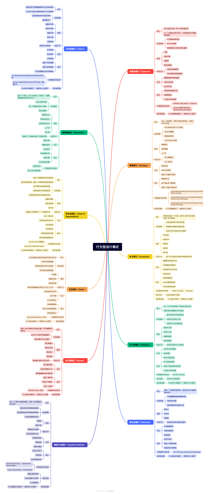

*如果说创建型模式是关于“生产零部件”，结构型模式是关于“组装机器”，那么行为型模式就是关于“ 机器的各个部件如何高效地协作和交互 ”。它们关注对象之间的职责分配和 通信方式 。*

行为型模式，主要是用来解决**对象之间如何协作、职责如何划分、行为如何解耦**的问题。

在程序开发中，光有数据结构和功能模块还不够，还需要设计 **对象之间怎么交流、怎么协作、职责如何划分** 。如果这些关系处理不好，系统会变得非常混乱，修改一个功能可能牵一发动全身。



# 策略模式

**目的**：当遇到分支场景时，避免过多的 `if-else`或者 `switch-case`判断

使用策略模式，我们可以把每一种策略独立封装成单独的类，后续如果要新增、修改策略，只需要扩展新的策略类就行，原有代码不需要改动，系统的扩展性和可维护性就能大大提升。

## 基本结构

策略模式通常包含以下三个核心角色：

1. **抽象策略（Strategy）** ：

   * 定义了一个所有具体策略类必须实现的公共接口。这个接口通常包含一个或多个方法，用于封装具体的算法。
   * 客户端通过这个接口来调用具体的算法，而不需要知道具体是哪个算法的实现。
   * 在支付的例子中，就是 `PaymentStrategy` 接口，定义了 `pay(double amount)` 方法。
2. **具体策略（Concrete Strategy）** ：

   * 实现了抽象策略接口，封装了具体的算法或行为。
   * 例如：`CreditCardPayment`, `AlipayPayment`, `WeChatPayPayment`，它们各自实现了 `PaymentStrategy` 接口。
3. **上下文（Context）** ：

   * 维护一个对抽象策略对象的引用。
   * 它不直接实现具体的算法，而是将请求委托给它内部持有的策略对象来执行。
   * 上下文通常在运行时通过注入或设置的方式获取具体的策略对象。
   * 例如：`Order` 或 `PaymentProcessor` 类，它持有一个 `PaymentStrategy` 引用，并调用其 `pay()` 方法。

## 典型代码实现（Java 示例 - 订单支付）

我们以订单支付功能为例来演示策略模式。

#### 1. 抽象策略：`PaymentStrategy` 接口

```java
// 抽象策略：支付策略接口
public interface PaymentStrategy {
    void pay(double amount); // 定义支付方法
}
```

#### 2. 具体策略：`CreditCardPayment`, `AlipayPayment`, `WeChatPayPayment`

```java
// 具体策略：信用卡支付
public class CreditCardPayment implements PaymentStrategy {
    private String cardNumber;
    private String cvv;

    public CreditCardPayment(String cardNumber, String cvv) {
        this.cardNumber = cardNumber;
        this.cvv = cvv;
    }

    @Override
    public void pay(double amount) {
        System.out.println("使用信用卡 " + cardNumber + " 支付 " + amount + " 元。");
        // 这里可以加入更复杂的信用卡支付逻辑，如与支付网关交互
    }
}

// 具体策略：支付宝支付
public class AlipayPayment implements PaymentStrategy {
    private String userId;

    public AlipayPayment(String userId) {
        this.userId = userId;
    }

    @Override
    public void pay(double amount) {
        System.out.println("使用支付宝账户 " + userId + " 支付 " + amount + " 元。");
        // 这里可以加入支付宝支付的逻辑
    }
}

// 具体策略：微信支付
public class WeChatPayPayment implements PaymentStrategy {
    private String openId;

    public WeChatPayPayment(String openId) {
        this.openId = openId;
    }

    @Override
    public void pay(double amount) {
        System.out.println("使用微信账户 " + openId + " 支付 " + amount + " 元。");
        // 这里可以加入微信支付的逻辑
    }
}
```

#### 3. 上下文：`Order` 类

```java
// 上下文：订单类
public class Order {
    private double totalAmount;
    private PaymentStrategy paymentStrategy; // 持有抽象策略的引用

    public Order(double totalAmount) {
        this.totalAmount = totalAmount;
    }

    // 设置支付策略（运行时可动态切换）
    public void setPaymentStrategy(PaymentStrategy paymentStrategy) {
        this.paymentStrategy = paymentStrategy;
    }

    // 执行支付操作，将请求委托给当前设置的策略对象
    public void processPayment() {
        if (paymentStrategy == null) {
            System.out.println("未设置支付策略，无法支付！");
            return;
        }
        System.out.println("订单总额: " + totalAmount + " 元。");
        paymentStrategy.pay(totalAmount); // 将支付操作委托给具体策略
        System.out.println("支付完成。");
    }
}
```

#### 4. 客户端使用

```java
public class PaymentClient {
    public static void main(String[] args) {
        // 创建一个订单
        Order order1 = new Order(100.50);

        System.out.println("--- 订单1：选择信用卡支付 ---");
        // 创建一个信用卡支付策略
        PaymentStrategy creditCard = new CreditCardPayment("1234-5678-9012-3456", "123");
        // 将策略设置到订单中
        order1.setPaymentStrategy(creditCard);
        // 处理支付
        order1.processPayment();

        System.out.println("\n--- 订单2：选择支付宝支付 ---");
        Order order2 = new Order(50.00);
        // 创建一个支付宝支付策略
        PaymentStrategy alipay = new AlipayPayment("user123");
        // 将策略设置到订单中
        order2.setPaymentStrategy(alipay);
        // 处理支付
        order2.processPayment();

        System.out.println("\n--- 订单3：选择微信支付 ---");
        Order order3 = new Order(200.00);
        // 创建一个微信支付策略
        PaymentStrategy weChatPay = new WeChatPayPayment("wx_open_id_abc");
        // 将策略设置到订单中
        order3.setPaymentStrategy(weChatPay);
        // 处理支付
        order3.processPayment();
    }
}
```

其中：

* `PaymentStrategy` 接口定义了所有支付方式的统一契约。
* `CreditCardPayment`、`AlipayPayment`、`WeChatPayPayment` 是具体的支付算法实现，它们都遵循 `PaymentStrategy` 接口。
* `Order` 类是上下文，它持有一个 `PaymentStrategy` 引用。它不直接知道具体的支付方式，而是通过 `paymentStrategy.pay()` 来委托执行支付操作。
* 客户端可以根据用户的选择，动态地创建不同的具体策略对象，并将其设置给 `Order` 对象。当需要改变支付方式时，只需切换 `Order` 内部的 `PaymentStrategy` 对象即可，无需修改 `Order` 类的代码。

## 总而言之

策略模式是一种面向行为的通过实现接口来简化分支判断的方法，这一点与工厂模式和创建者模式类似

# 模板方法模式

在一个抽象父类中定义一个 **算法的骨架（模板方法）** ，将一些具体步骤的实现延迟到子类中。这样，子类可以在不改变算法结构的前提下，重新定义算法的某些特定步骤。

## 基本结构

模板方法模式通常包含以下两个核心角色：

1. **抽象类（Abstract Class）** ：

   * 定义了 **模板方法** ，它是一个具体方法，封装了算法的骨架（即一系列固定顺序的步骤）。
   * 在模板方法中，会调用一些 **抽象方法** （由子类实现）和/或 **具体方法** （在抽象类中实现，供所有子类复用）。
   * 也可以包含 **钩子方法（Hook Method）** ，它们是空的或提供了默认实现的方法，子类可以选择性地重写，以在不改变算法骨架的情况下插入自定义行为。
   * 在游戏角色的例子中，就是 `GameCharacter` 抽象类。
2. **具体类（Concrete Class）** ：

   * 继承抽象类。
   * 实现抽象类中定义的抽象方法，从而提供算法中可变步骤的具体实现。
   * 可以选择性地重写钩子方法。
   * 在游戏角色的例子中，就是 `Warrior`, `Mage`, `Archer` 等。

## 典型代码实现（Java 示例 - 游戏角色流程）

我们以游戏角色流程为例来演示模板方法模式。

#### 1. 抽象类：`GameCharacter`

**Java**

```
// 抽象类：游戏角色
public abstract class GameCharacter {

    // 模板方法：定义游戏流程的骨架
    public final void playCharacter() { // final 关键字确保子类不能修改这个流程骨架
        selectCharacter();         // 步骤1: 选择角色 (通用步骤)
        loadMap();                 // 步骤2: 加载地图 (通用步骤)
        enterGame();               // 步骤3: 进入游戏 (通用步骤)
        startBattle();             // 步骤4: 开始战斗 (抽象方法，子类实现)
        if (shouldDisplayVictoryMessage()) { // 钩子方法，子类可选择重写
            displayVictoryMessage(); // 步骤5: 显示胜利消息 (通用步骤)
        }
        endGame();                 // 步骤6: 结束游戏 (通用步骤)
    }

    // 具体方法：通用步骤，所有角色都一样
    private void selectCharacter() {
        System.out.println("选择角色...");
    }

    private void loadMap() {
        System.out.println("加载游戏地图...");
    }

    private void enterGame() {
        System.out.println("角色进入游戏场景...");
    }

    private void displayVictoryMessage() {
        System.out.println("恭喜你，战斗胜利！");
    }

    private void endGame() {
        System.out.println("游戏结束，角色下线。");
    }

    // 抽象方法：可变步骤，由子类具体实现
    protected abstract void startBattle();

    // 钩子方法：提供了默认行为，子类可选择重写
    // 决定是否显示胜利消息，默认是显示
    protected boolean shouldDisplayVictoryMessage() {
        return true;
    }
}
```

#### 2. 具体类：`Warrior`, `Mage`, `Archer`

**Java**

```
// 具体类：战士
public class Warrior extends GameCharacter {
    @Override
    protected void startBattle() {
        System.out.println("战士挥舞大剑，近战攻击！");
    }

    // 战士总是很自信，不需要胜利消息
    // @Override
    // protected boolean shouldDisplayVictoryMessage() {
    //     return false; // 可以选择不显示胜利消息
    // }
}

// 具体类：法师
public class Mage extends GameCharacter {
    @Override
    protected void startBattle() {
        System.out.println("法师吟唱咒语，施放魔法攻击！");
    }
}

// 具体类：弓箭手
public class Archer extends GameCharacter {
    @Override
    protected void startBattle() {
        System.out.println("弓箭手拉弓射箭，远程精准打击！");
    }

    // 弓箭手可能在特定条件下不显示胜利消息
    @Override
    protected boolean shouldDisplayVictoryMessage() {
        // 假设弓箭手只有在遇到特定boss时才显示胜利消息
        // return someCondition ? true : false;
        return true; // 这里保持默认行为
    }
}
```

#### 3. 客户端使用

**Java**

```
public class GameClient {
    public static void main(String[] args) {
        System.out.println("--- 扮演战士 ---");
        GameCharacter warrior = new Warrior();
        warrior.playCharacter(); // 调用模板方法

        System.out.println("\n--- 扮演法师 ---");
        GameCharacter mage = new Mage();
        mage.playCharacter(); // 调用模板方法

        System.out.println("\n--- 扮演弓箭手 ---");
        GameCharacter archer = new Archer();
        archer.playCharacter(); // 调用模板方法
    }
}
```

* `playCharacter()` 是模板方法，它定义了所有角色都遵循的通用游戏流程。这个方法被 `final` 修饰，确保其结构不可更改。
* `selectCharacter()`, `loadMap()`, `enterGame()`, `displayVictoryMessage()`, `endGame()` 是通用步骤，由抽象父类 `GameCharacter` 实现并复用。
* `startBattle()` 是一个抽象方法，它表示算法中**可变**的部分，具体战斗方式由子类 `Warrior`, `Mage`, `Archer` 各自实现。
* `shouldDisplayVictoryMessage()` 是一个钩子方法，提供了默认行为（返回 `true`）。子类可以选择性地重写它，以在特定点插入或修改行为，而不会破坏整个算法结构。

## 总而言之

**模板方法**是关于“ **流程** ”，它规定了“ **怎么办** ”的通用步骤，并允许子类填充“ **如何具体做某一步** ”。它是一种**“不变中求变”**的设计。

# 责任链模式

为请求创建一个处理者对象的链。沿着这条链传递请求，直到有一个对象处理它。从而将发送者和接收者解耦

*什么上游服务器？*

## 基本结构

责任链模式通常包含以下三个核心角色：

1. **抽象处理者（Handler）** ：

   * 定义一个处理请求的接口或抽象类。
   * 包含一个方法，用于处理请求（`handleRequest()`）。
   * 包含一个指向**下一个处理者**的引用（通常是 `protected Handler nextHandler;`），并提供设置下一个处理者的方法 (`setNextHandler()`)。
   * 它可以实现公共的请求处理逻辑，例如默认的转发机制。
   * 在请假审批的例子中，就是 `Approver` 抽象类。
2. **具体处理者（Concrete Handler）** ：

   * 继承或实现抽象处理者接口。
   * 实现处理请求的具体逻辑。
   * 如果它能处理请求，就处理并可能终止链。
   * 如果它不能处理请求，就将请求转发给链中的下一个处理者。
   * 在请假审批的例子中，就是 `TeamLeader`, `DepartmentManager`, `HRDirector` 等。
3. **客户端（Client）** ：

   * 创建责任链。
   * 向链中的第一个处理者发送请求。
   * 客户端不直接知道哪个处理者最终会处理请求。

## 典型代码实现（Java 示例 - 请假审批）

我们以请假审批流程为例来演示责任链模式。

#### 1. 抽象处理者：`Approver`

**Java**

```
// 抽象处理者：审批人
public abstract class Approver {
    protected Approver nextApprover; // 下一个审批人

    // 设置下一个审批人
    public void setNextApprover(Approver nextApprover) {
        this.nextApprover = nextApprover;
    }

    // 抽象的审批请求方法，由具体审批人实现
    public abstract void processRequest(LeaveRequest request);
}
```

#### 辅助类：`LeaveRequest` (请假请求)

**Java**

```
// 请假请求类
public class LeaveRequest {
    private String applicantName;
    private int leaveDays;
    private String reason;

    public LeaveRequest(String applicantName, int leaveDays, String reason) {
        this.applicantName = applicantName;
        this.leaveDays = leaveDays;
        this.reason = reason;
    }

    public String getApplicantName() {
        return applicantName;
    }

    public int getLeaveDays() {
        return leaveDays;
    }

    public String getReason() {
        return reason;
    }

    @Override
    public String toString() {
        return "请假申请 [申请人: " + applicantName + ", 天数: " + leaveDays + "天, 原因: " + reason + "]";
    }
}
```

#### 2. 具体处理者：`TeamLeader`, `DepartmentManager`, `HRDirector`

**Java**

```
// 具体处理者：组长 (可以审批1-3天的请假)
public class TeamLeader extends Approver {
    @Override
    public void processRequest(LeaveRequest request) {
        if (request.getLeaveDays() <= 3) {
            System.out.println("组长审批通过: " + request.getApplicantName() + " 的 " + request.getLeaveDays() + " 天请假。");
        } else {
            System.out.println("组长：请假天数超过3天，转交给部门经理审批。");
            if (nextApprover != null) {
                nextApprover.processRequest(request); // 转发给下一个审批人
            } else {
                System.out.println("没有下一个审批人可以处理此请求。");
            }
        }
    }
}

// 具体处理者：部门经理 (可以审批4-7天的请假)
public class DepartmentManager extends Approver {
    @Override
    public void processRequest(LeaveRequest request) {
        if (request.getLeaveDays() <= 7) {
            System.out.println("部门经理审批通过: " + request.getApplicantName() + " 的 " + request.getLeaveDays() + " 天请假。");
        } else {
            System.out.println("部门经理：请假天数超过7天，转交给HR总监审批。");
            if (nextApprover != null) {
                nextApprover.processRequest(request); // 转发给下一个审批人
            } else {
                System.out.println("没有下一个审批人可以处理此请求。");
            }
        }
    }
}

// 具体处理者：HR总监 (可以审批8-15天的请假)
public class HRDirector extends Approver {
    @Override
    public void processRequest(LeaveRequest request) {
        if (request.getLeaveDays() <= 15) {
            System.out.println("HR总监审批通过: " + request.getApplicantName() + " 的 " + request.getLeaveDays() + " 天请假。");
        } else {
            System.out.println("HR总监：请假天数超过15天，权限不足，无法审批此请假。");
            // 在这里可以选择抛出异常，或通知请求无法处理
            if (nextApprover != null) { // 如果还有下一个审批人 (比如总经理)，可以继续转发
                 nextApprover.processRequest(request);
            } else {
                System.out.println("请假申请最终未被处理，需重新提交或升级。");
            }
        }
    }
}
```

#### 3. 客户端使用

**Java**

```
public class LeaveApprovalClient {
    public static void main(String[] args) {
        // 1. 创建具体审批人实例
        Approver teamLeader = new TeamLeader();
        Approver manager = new DepartmentManager();
        Approver hrDirector = new HRDirector();

        // 2. 组装责任链
        // 组长 -> 经理 -> HR总监
        teamLeader.setNextApprover(manager);
        manager.setNextApprover(hrDirector);
        // HR总监后面没有审批人，nextApprover 保持为 null

        // 3. 客户端发送请假请求，从链的起始点发起
        System.out.println("--- 提交请假请求1 (2天) ---");
        LeaveRequest request1 = new LeaveRequest("小明", 2, "私人事务");
        teamLeader.processRequest(request1);

        System.out.println("\n--- 提交请假请求2 (5天) ---");
        LeaveRequest request2 = new LeaveRequest("小红", 5, "家庭旅游");
        teamLeader.processRequest(request2);

        System.out.println("\n--- 提交请假请求3 (10天) ---");
        LeaveRequest request3 = new LeaveRequest("小刚", 10, "出国考察");
        teamLeader.processRequest(request3);

        System.out.println("\n--- 提交请假请求4 (20天) ---");
        LeaveRequest request4 = new LeaveRequest("小李", 20, "重大疾病");
        teamLeader.processRequest(request4);
    }
}
```

* `Approver` 是抽象处理者，定义了处理请求的方法和设置下一个处理者的方法。
* `TeamLeader`, `DepartmentManager`, `HRDirector` 是具体处理者，它们实现了 `processRequest()` 方法，包含各自的审批逻辑和转发逻辑。每个处理者都判断自己是否能处理，不能则转发。
* 客户端创建了这些处理者，并**手动组装**了链条（例如 `teamLeader.setNextApprover(manager)`）。实际应用中，链的组装可能更自动化，例如通过配置或工厂方法。
* 客户端只需向链的起点 (`teamLeader`) 发送请求，后续的传递和处理都由链内部完成，客户端无需关心具体是哪个审批人处理了请求。

然而实际上的使用应该总结为这两句：

1. **定义阶段（类定义）** ：处理者类只提供了建立链接的 **能力** （通过 `nextHandler` 引用和 `setNextHandler` 方法）。
2. **使用阶段（客户端）** ：客户端负责**实际地构建**这个链条，将各个处理者实例连接起来。只有链条构建完毕，模式才能发挥作用。

## 联系与思考

### 责任链vs装饰

和之前的学习中装饰模式比较后，可以发现，两者都涉及到一个对象“包含”另一个对象，并且请求或数据流经这些被包含的对象时

* **责任链** ：处理者形成一条链，请求沿着这条链传递。每个处理者都持有对下一个处理者的引用，看起来像一个链条。
* **装饰器** ：装饰器对象包装（组合）了被装饰者对象，并且装饰器本身又可以被另一个装饰器包装，也形成一种链式嵌套结构。

# 命令模式

将一个请求（或操作）封装成一个独立的对象，从而可以用不同的请求、队列、日志来参数化客户端。命令模式还支持可撤销（Undo）的操作。

* **核心意图** ： **将一个请求（操作）封装成一个独立的对象** 。它的主要目标是 **将请求的发出者（调用者）与请求的执行者（接收者）解耦，并支持请求的参数化、排队、日志和撤销/重做** 。
* **关注点** ： **操作的封装、管理和动态化** 。它将一个具体的行为和执行者“打包”成一个可传递的对象。
* **解决的问题** ： **解耦调用者和接收者，提供更灵活的请求处理机制** 。它允许你将动作作为数据来处理，实现更高级的功能。

## 典型代码实现（Java 示例 - 智能家居遥控器）

我们以智能家居遥控器为例来演示命令模式，遥控器上有一些按钮，每个按钮可以执行不同的操作，例如打开/关闭电灯、打开/关闭风扇。

#### 1. 接收者：`Light` (电灯), `Fan` (风扇)

**Java**

```
// 接收者：电灯
public class Light {
    private String location;

    public Light(String location) {
        this.location = location;
    }

    public void on() {
        System.out.println(location + " 的灯亮了。");
    }

    public void off() {
        System.out.println(location + " 的灯灭了。");
    }
}

// 接收者：风扇
public class Fan {
    private String location;
    public static final int HIGH = 3;
    public static final int MEDIUM = 2;
    public static final int LOW = 1;
    public static final int OFF = 0;
    int speed;

    public Fan(String location) {
        this.location = location;
        speed = OFF;
    }

    public void high() {
        speed = HIGH;
        System.out.println(location + " 的风扇高速运转。");
    }

    public void medium() {
        speed = MEDIUM;
        System.out.println(location + " 的风扇中速运转。");
    }

    public void low() {
        speed = LOW;
        System.out.println(location + " 的风扇低速运转。");
    }

    public void off() {
        speed = OFF;
        System.out.println(location + " 的风扇关闭。");
    }

    public int getSpeed() {
        return speed;
    }
}
```

#### 2. 命令：`Command` 接口 (包含撤销功能)

**Java**

```
// 命令接口
public interface Command {
    void execute(); // 执行命令
    void undo();    // 撤销命令 (可选，但很常见)
}
```

#### 3. 具体命令：`LightOnCommand`, `LightOffCommand`, `FanOnCommand`, `FanOffCommand` 等

**Java**

```
// 具体命令：打开电灯
public class LightOnCommand implements Command {
    private Light light; // 持有接收者引用
    private int prevSpeed; // 用于撤销，记录风扇之前的速度

    public LightOnCommand(Light light) {
        this.light = light;
    }

    @Override
    public void execute() {
        light.on(); // 调用接收者的具体操作
    }

    @Override
    public void undo() {
        light.off(); // 撤销：关灯
    }
}

// 具体命令：关闭电灯
public class LightOffCommand implements Command {
    private Light light; // 持有接收者引用

    public LightOffCommand(Light light) {
        this.light = light;
    }

    @Override
    public void execute() {
        light.off(); // 调用接收者的具体操作
    }

    @Override
    public void undo() {
        light.on(); // 撤销：开灯
    }
}

// 具体命令：打开风扇 (高速)
public class FanHighCommand implements Command {
    private Fan fan;
    private int prevSpeed; // 用于撤销，记录风扇之前的速度

    public FanHighCommand(Fan fan) {
        this.fan = fan;
    }

    @Override
    public void execute() {
        prevSpeed = fan.getSpeed(); // 执行前记录当前速度，以便撤销
        fan.high();
    }

    @Override
    public void undo() {
        // 根据之前记录的速度来恢复风扇状态
        if (prevSpeed == Fan.HIGH) {
            fan.high();
        } else if (prevSpeed == Fan.MEDIUM) {
            fan.medium();
        } else if (prevSpeed == Fan.LOW) {
            fan.low();
        } else if (prevSpeed == Fan.OFF) {
            fan.off();
        }
    }
}

// 具体命令：关闭风扇
public class FanOffCommand implements Command {
    private Fan fan;
    private int prevSpeed; // 用于撤销

    public FanOffCommand(Fan fan) {
        this.fan = fan;
    }

    @Override
    public void execute() {
        prevSpeed = fan.getSpeed(); // 执行前记录当前速度，以便撤销
        fan.off();
    }

    @Override
    public void undo() {
        // 撤销：恢复到之前的速度
        if (prevSpeed == Fan.HIGH) {
            fan.high();
        } else if (prevSpeed == Fan.MEDIUM) {
            fan.medium();
        } else if (prevSpeed == Fan.LOW) {
            fan.low();
        } else if (prevSpeed == Fan.OFF) {
            fan.off();
        }
    }
}

// 可选：无操作命令（用于初始化遥控器按钮，避免空指针异常）
public class NoCommand implements Command {
    @Override
    public void execute() {
        // 什么也不做
        System.out.println("无操作...");
    }

    @Override
    public void undo() {
        // 什么也不做
    }
}
```

#### 4. 调用者：`RemoteControl` (遥控器)

**Java**

```
import java.util.Stack; // 用于撤销/重做

// 调用者：遥控器
public class RemoteControl {
    private Command[] onCommands;  // 存放“开”命令的数组
    private Command[] offCommands; // 存放“关”命令的数组
    private Stack<Command> undoStack; // 用于存储最近执行的命令，实现撤销

    public RemoteControl() {
        onCommands = new Command[7];  // 假设有7个槽位
        offCommands = new Command[7];
        undoStack = new Stack<>();

        // 初始化所有命令槽位为“无操作”命令，避免空指针
        Command noCommand = new NoCommand();
        for (int i = 0; i < 7; i++) {
            onCommands[i] = noCommand;
            offCommands[i] = noCommand;
        }
    }

    // 设置遥控器某个槽位的命令
    public void setCommand(int slot, Command onCommand, Command offCommand) {
        onCommands[slot] = onCommand;
        offCommands[slot] = offCommand;
    }

    // 按下“开”按钮
    public void onButtonWasPushed(int slot) {
        onCommands[slot].execute(); // 执行“开”命令
        undoStack.push(onCommands[slot]); // 将执行的命令压入撤销栈
    }

    // 按下“关”按钮
    public void offButtonWasPushed(int slot) {
        offCommands[slot].execute(); // 执行“关”命令
        undoStack.push(offCommands[slot]); // 将执行的命令压入撤销栈
    }

    // 按下“撤销”按钮
    public void undoButtonWasPushed() {
        if (!undoStack.empty()) {
            Command lastCommand = undoStack.pop(); // 弹出最近的命令
            System.out.println("正在执行撤销操作...");
            lastCommand.undo(); // 执行该命令的撤销方法
        } else {
            System.out.println("没有可撤销的命令了。");
        }
    }

    @Override
    public String toString() {
        StringBuilder sb = new StringBuilder();
        sb.append("\n------ 遥控器 ------\n");
        for (int i = 0; i < onCommands.length; i++) {
            sb.append("[slot " + i + "] " + onCommands[i].getClass().getName() + "\t" + offCommands[i].getClass().getName() + "\n");
        }
        sb.append("[undo] " + undoStack.getClass().getName() + "\n");
        return sb.toString();
    }
}
```

#### 5. 客户端使用

**Java**

```
public class RemoteLoader {
    public static void main(String[] args) {
        // 1. 创建调用者 (遥控器)
        RemoteControl remote = new RemoteControl();

        // 2. 创建接收者 (家居设备)
        Light livingRoomLight = new Light("客厅");
        Light kitchenLight = new Light("厨房");
        Fan livingRoomFan = new Fan("客厅风扇");

        // 3. 创建具体命令对象，并传入对应的接收者
        Command livingRoomLightOn = new LightOnCommand(livingRoomLight);
        Command livingRoomLightOff = new LightOffCommand(livingRoomLight);
        Command kitchenLightOn = new LightOnCommand(kitchenLight);
        Command kitchenLightOff = new LightOffCommand(kitchenLight);

        Command livingRoomFanHigh = new FanHighCommand(livingRoomFan);
        Command livingRoomFanOff = new FanOffCommand(livingRoomFan);

        // 4. 将命令对象加载到遥控器的槽位中
        remote.setCommand(0, livingRoomLightOn, livingRoomLightOff);
        remote.setCommand(1, kitchenLightOn, kitchenLightOff);
        remote.setCommand(2, livingRoomFanHigh, livingRoomFanOff);

        System.out.println(remote); // 打印遥控器配置

        // 5. 客户端 (你) 按下按钮，遥控器执行命令
        System.out.println("\n--- 按下按钮 ---");
        remote.onButtonWasPushed(0); // 客厅灯开
        remote.offButtonWasPushed(0); // 客厅灯关

        remote.onButtonWasPushed(1); // 厨房灯开
        remote.onButtonWasPushed(2); // 风扇高速

        System.out.println("\n--- 尝试撤销 ---");
        remote.undoButtonWasPushed(); // 撤销风扇高速 (回到关)
        remote.undoButtonWasPushed(); // 撤销厨房灯开 (回到关)
        remote.undoButtonWasPushed(); // 撤销客厅灯关 (回到开)
        remote.undoButtonWasPushed(); // 撤销客厅灯开 (回到关)
        remote.undoButtonWasPushed(); // 尝试再次撤销，栈已空
    }
}
```

* **解耦** ：`RemoteControl` (调用者) 完全不知道 `Light` 或 `Fan` (接收者) 的存在，它只与 `Command` 接口交互。它甚至不知道 `LightOnCommand` 内部是如何工作的。
* **命令对象** ：`LightOnCommand` 等具体命令对象封装了**要执行的操作** (`light.on()`) 和**执行该操作的接收者** (`light` 实例)。
* **参数化请求** ：你可以将任何 `Command` 对象放入遥控器的槽位中。这些命令对象本身就可以被作为参数传递、存储（在 `onCommands` / `offCommands` 数组中和 `undoStack` 中）。
* **撤销/重做** ：通过在 `Command` 接口中添加 `undo()` 方法，并在 `RemoteControl` 中维护一个命令历史栈，可以轻松实现撤销功能。执行命令时压栈，撤销时弹栈并调用 `undo()`。

## 联系与思考

### 外观vs命令

| 特性 / 模式            | 外观模式 (Facade Pattern)                                                     | 命令模式 (Command Pattern)                                                                   |
| ---------------------- | ----------------------------------------------------------------------------- | -------------------------------------------------------------------------------------------- |
| **主要目的**     | 简化对**一组复杂操作/子系统**的访问，降低**客户端与子系统**耦合。 | 封装**单个请求/操作** ，实现**调用者与接收者**的解耦，支持 **请求管理** 。 |
| **封装什么**     | **多个子系统组件间的复杂协作逻辑** 。                                   | **一个动作（操作）及其相关的接收者和参数** 。                                          |
| **是做什么**     | 提供一个**高层接口** ，隐藏 **底层多个子系统的实现细节** 。       | 将**一个操作抽象为一个对象** ，使得该操作可以被 **传递、存储、执行和撤销** 。    |
| **主要效果**     | **简化接口，降低客户端复杂性。**                                        | **增强了对单个操作的控制和管理能力（参数化、排队、撤销）。**                           |
| **层级**         | 通常作用于**系统层面** ，为**整个子系统**提供一个统一入口。       | 通常作用于**操作层面** ，封装 **单个或一组原子操作** 。                          |
| **“谁知道谁”** | 外观知道子系统，客户端知道外观。子系统不知道外观。                            | 命令知道接收者，调用者知道命令，客户端知道调用者、命令、接收者。                             |

# 中介者模式 （Mediator Pattern）

用一个中介对象来封装一系列的对象交互。中介者使各对象不需要显式地相互引用，从而使其耦合松散，而且可以独立地改变它们之间的交互。

## 基本结构

* **抽象中介者（Mediator）** ：
  * 定义一个接口，用于同事对象与中介者之间的通信。它通常包含一个或多个方法，供同事对象发送消息给中介者，或中介者通知同事对象。
  * 在聊天室的例子中，就是 `ChatRoom` 接口。
* **具体中介者（Concrete Mediator）** ：
  * 实现了抽象中介者接口。
  * 维护所有**同事对象（Colleague）**的引用。
  * 负责封装所有同事对象之间的复杂交互逻辑。当一个同事对象发送消息给中介者时，具体中介者会根据业务逻辑决定如何转发消息给其他同事对象。
  * 在聊天室的例子中，就是 `ChatRoomMediator` 类。
* **抽象同事类（Colleague）** ：
  * 定义一个接口或抽象类，用于所有具体同事类。
  * 包含一个对**中介者对象**的引用，以便向中介者发送消息。
  * 在聊天室的例子中，就是 `User` 抽象类。
* **具体同事类（Concrete Colleague）** ：
  * 继承或实现抽象同事类。
  * 当需要与其他同事对象交互时，不再直接引用其他同事，而是通过调用中介者的方法来完成。
  * 在聊天室的例子中，就是 `ChatUser` 类。


## 典型代码实现（Java 示例 - 聊天室）

我们以聊天室为例来演示中介者模式。

#### 1. 抽象同事类：`User`

```java
// 抽象同事类：用户
public abstract class User {
    protected ChatRoomMediator mediator; // 持有中介者的引用
    protected String name;

    public User(String name, ChatRoomMediator mediator) {
        this.name = name;
        this.mediator = mediator;
    }

    public String getName() {
        return name;
    }

    // 用户向中介者发送消息
    public void send(String message) {
        System.out.println(name + " 发送消息: " + message);
        mediator.sendMessage(message, this); // 将消息发送给中介者
    }

    // 用户接收消息
    public abstract void receive(String message);
}
```

#### 2. 抽象中介者：`ChatRoomMediator` 接口

```java
import java.util.ArrayList;
import java.util.List;

// 抽象中介者：聊天室中介者接口
public interface ChatRoomMediator {
    void sendMessage(String message, User sender); // 发送消息
    void addUser(User user);                      // 添加用户到聊天室
}
```

#### 3. 具体同事类：`ChatUser`

```java
// 具体同事类：聊天用户
public class ChatUser extends User {

    public ChatUser(String name, ChatRoomMediator mediator) {
        super(name, mediator);
    }

    @Override
    public void receive(String message) {
        System.out.println(name + " 收到消息: " + message);
    }
}
```

#### 4. 具体中介者：`ChatRoom`

```java
// 具体中介者：聊天室 (实现了中介者接口)
public class ChatRoom implements ChatRoomMediator {
    private List<User> users; // 中介者维护所有同事对象的引用

    public ChatRoom() {
        this.users = new ArrayList<>();
    }

    @Override
    public void addUser(User user) {
        users.add(user);
        System.out.println("用户 " + user.getName() + " 加入聊天室。");
    }

    @Override
    public void sendMessage(String message, User sender) {
        // 中介者封装了复杂的交互逻辑
        // 在这里，中介者决定将消息转发给除了发送者之外的所有用户
        for (User user : users) {
            if (user != sender) { // 不把消息发回给发送者
                user.receive(sender.getName() + ": " + message);
            }
        }
    }
}
```

#### 5. 客户端使用

```java
public class ChatClient {
    public static void main(String[] args) {
        // 1. 创建具体中介者 (聊天室)
        ChatRoom chatRoom = new ChatRoom();

        // 2. 创建具体同事对象 (用户)，并传入中介者
        User john = new ChatUser("John", chatRoom);
        User jane = new ChatUser("Jane", chatRoom);
        User mike = new ChatUser("Mike", chatRoom);

        // 3. 将用户添加到聊天室 (中介者维护用户列表)
        chatRoom.addUser(john);
        chatRoom.addUser(jane);
        chatRoom.addUser(mike);

        System.out.println("\n--- 开始聊天 ---");

        // 4. 用户通过中介者发送消息
        john.send("大家好！"); // John发送消息，中介者转发给Jane和Mike
        System.out.println();
        jane.send("John你好，Mike你好！"); // Jane发送消息，中介者转发给John和Mike
        System.out.println();
        mike.send("很高兴见到你们！"); // Mike发送消息，中介者转发给John和Jane
    }
}
```


* **解耦** ：`ChatUser` (同事对象) 之间不再直接互相通信。`John` 不知道 `Jane` 和 `Mike` 的存在，他只知道通过 `chatRoom` (中介者) 来发送消息。
* **集中控制** ：`ChatRoom` (中介者) 集中了所有用户之间的通信逻辑。它决定了消息应该如何转发（例如，向所有人广播，或私聊某人）。
* **可扩展性** ：增加新的用户（新的 `ChatUser` 实例）非常容易，只需要将其添加到 `ChatRoom` 中介者即可，无需修改现有用户的代码。改变消息转发规则也只需要修改中介者的代码。

## 关键点

将复杂的交互逻辑从各个同事对象中抽离出来，集中到中介者中，使得交互逻辑更易于理解和维护

虽然解耦了同事对象之间的直接耦合，但同事对象现在与中介者紧密耦合


# 迭代器模式（Iterator Pattern）

提供一种方法顺序访问一个聚合对象中各个元素，而又不暴露该对象的内部表示

## 基本结构


迭代器模式通常包含以下四个核心角色：

1. **迭代器（Iterator）** ：

* 定义了一个访问和遍历元素的接口。
* 通常包含以下方法：
  * `hasNext()`: 检查序列中是否还有下一个元素。
  * `next()`: 返回序列中的下一个元素。
  * `remove()`: (可选) 删除上次 `next()` 方法返回的元素。
* 在电话簿的例子中，就是 `Iterator`接口，包含 `hasNextPage()`和 `flipToNextPage()`等方法。

1. **具体迭代器（Concrete Iterator）** ：

* 实现了迭代器接口。
* 维护遍历过程中的当前位置。
* 负责实现具体的遍历逻辑，知道如何遍历其关联的聚合对象。
* 在电话簿的例子中，就是 `PhoneBookIterator`。

1. **聚合（Aggregate）** ：

* 定义一个创建相应迭代器对象的接口。这个接口通常包含一个方法，例如 `createIterator()`。
* 它是一个对象的集合，客户端需要对其进行遍历。
* 在电话簿的例子中，就是 `PhoneBook`。

1. **具体聚合（Concrete Aggregate）** ：

* 实现了聚合接口。
* 负责创建并返回一个具体的迭代器实例，该迭代器能够遍历该聚合对象自身。
* 它维护着要遍历的元素集合。
* 在电话簿的例子中，就是 `MyPhoneBook`。


## 典型代码实现（Java 示例 - 书籍集合遍历）

我们以自定义书籍集合的遍历为例来演示迭代器模式。

#### 1. 元素类：`Book`

```java
// 书籍类
public class Book {
    private String title;
    private String author;

    public Book(String title, String author) {
        this.title = title;
        this.author = author;
    }

    public String getTitle() {
        return title;
    }

    public String getAuthor() {
        return author;
    }

    @Override
    public String toString() {
        return "《" + title + "》by " + author;
    }
}
```

#### 2. 迭代器：`BookIterator` 接口

```java
// 迭代器接口
public interface BookIterator {
    boolean hasNext(); // 是否还有下一个元素
    Book next();       // 返回下一个元素
    // void remove(); // 可选：移除当前元素
}
```

#### 3. 聚合：`BookCollection` 接口

```java
// 聚合接口
public interface BookCollection {
    BookIterator createIterator(); // 创建迭代器的方法
}
```

#### 4. 具体聚合：`MyBookCollection` (内部使用数组)

```java
// 具体聚合：我的书籍集合（使用数组实现）
public class MyBookCollection implements BookCollection {
    private Book[] books;
    private int numberOfBooks;
    private static final int MAX_BOOKS = 100; // 假设最大容量

    public MyBookCollection() {
        books = new Book[MAX_BOOKS];
        numberOfBooks = 0;
    }

    public void addBook(Book book) {
        if (numberOfBooks < MAX_BOOKS) {
            books[numberOfBooks] = book;
            numberOfBooks++;
        } else {
            System.out.println("书籍集合已满，无法添加新书。");
        }
    }

    public Book getBook(int index) {
        if (index >= 0 && index < numberOfBooks) {
            return books[index];
        }
        return null;
    }

    public int getNumberOfBooks() {
        return numberOfBooks;
    }

    @Override
    public BookIterator createIterator() {
        // 创建并返回一个具体迭代器实例
        return new MyBookCollectionIterator(this);
    }

    // 为了让迭代器能够访问内部数组，可以提供一些包可见或私有的访问方法
    // 但更好的实践是，迭代器作为内部类，可以直接访问外部类的私有成员。
    // 这里为了演示，我们假设迭代器通过传入聚合对象来获取信息。
}
```

#### 5. 具体迭代器：`MyBookCollectionIterator`

```java
// 具体迭代器：遍历MyBookCollection
public class MyBookCollectionIterator implements BookIterator {
    private MyBookCollection bookCollection; // 持有对聚合对象的引用
    private int position; // 当前遍历位置

    public MyBookCollectionIterator(MyBookCollection bookCollection) {
        this.bookCollection = bookCollection;
        this.position = 0; // 初始化位置
    }

    @Override
    public boolean hasNext() {
        // 判断是否还有下一个元素
        return position < bookCollection.getNumberOfBooks() && bookCollection.getBook(position) != null;
    }

    @Override
    public Book next() {
        // 返回当前元素，并移动到下一个位置
        Book book = bookCollection.getBook(position);
        position++;
        return book;
    }
}
```

#### 6. 客户端使用

```java
public class LibraryClient {
    public static void main(String[] args) {
        // 1. 创建具体聚合对象 (书籍集合)
        MyBookCollection myLibrary = new MyBookCollection();
        myLibrary.addBook(new Book("设计模式", "Gamma et al."));
        myLibrary.addBook(new Book("Clean Code", "Robert C. Martin"));
        myLibrary.addBook(new Book("Effective Java", "Joshua Bloch"));
        myLibrary.addBook(new Book("深入理解Java虚拟机", "周志明"));

        // 2. 从聚合对象获取迭代器
        BookIterator iterator = myLibrary.createIterator();

        System.out.println("--- 遍历我的图书馆所有书籍 ---");
        // 3. 客户端使用迭代器进行遍历，而无需关心MyBookCollection的内部实现（数组）
        while (iterator.hasNext()) {
            Book book = iterator.next();
            System.out.println("书名: " + book.getTitle() + ", 作者: " + book.getAuthor());
        }

        System.out.println("\n--- 再次遍历 (获取新的迭代器) ---");
        // 可以获取新的迭代器进行独立遍历
        BookIterator anotherIterator = myLibrary.createIterator();
        while (anotherIterator.hasNext()) {
            Book book = anotherIterator.next();
            System.out.println("复习: " + book);
        }

        // 假设我们现在有一个使用List实现的集合
        // List<Book> anotherList = new ArrayList<>();
        // anotherList.add(new Book("Spring in Action", "Craig Walls"));
        // 我们可以直接使用 Java 内置的迭代器：
        // Iterator<Book> javaIterator = anotherList.iterator();
        // System.out.println("\n--- 遍历另一个List集合 ---");
        // while (javaIterator.hasNext()) {
        //    System.out.println(javaIterator.next());
        // }
    }
}
```
