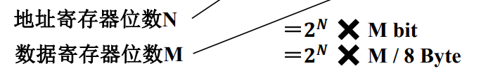

# 计算机性能指标

## 容量

总容量＝存储单元个数 ✖️ 存储字长 bit ( 8 Byte )

## 速度

执行耗时 = 总CPI / CPU时钟频率 = 总CPI ✖️ 时钟周期

* MIPS：每秒百万指令数
  * MIPS=（指令总数 / 程序执行时间） × 10^-6
* MFLOPS：每秒百万次浮点操作次数
  * MFLOPS=（程序中浮点运算次数 / 程序执行时间）×10^-6

性能指标专业术语：

* 总线宽度：数据总线一次所能并行传送信息的位数
* 存储器带宽：单位时间内从存储器读出的字节数，一般用字节数/秒表示。
* 吞吐量：表征一台计算机在某一时间间隔内能够处理的信息量，单位是字节/秒（B/S）
* 响应时间：指从用户向计算机发送一个请求，到系统对该请求作出响应并获得它所需要的结果的等待时间包括CPU时间与等待时间
* 利用率：在给定的时间间隔内系统被实际使用的时间所占的比率，用百分比表示

# 计算机的硬件

◆存储器：存放程序和数据
◆控制器：根据取得的指令向其他部件发出控制信号，完成指令规定操作
◆运算器：完成算术和逻辑运算操作，也称为数据通路
◆输入/输出设备：完成人与计算机的相互通信

* 指令由操作码和地址码组成
* 机器以运算器为中心，数据传送都经过运算器
* 采用存储程序的方式，编制好的程序和数据存放在同一存储器中，计算机自动完成逐条取出指令和执行指令的操作。故称之为存储程序式计算机
