*请求出错: Expecting value: line 1 column 1 (char 0)*——*未知*

介质访问控制是一种控制对传输介质访问的方式，目的是促进对介质进行有序且高效的使用。

# Channel Allocation Problem 信道分配问题

## Multiple Access Schemes 多路访问方案

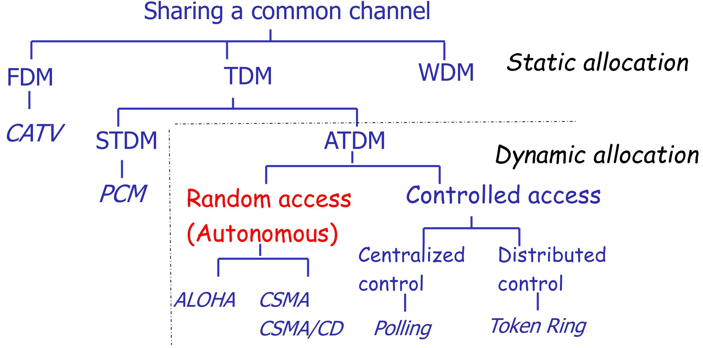

重点在于：STDM: Synchronous TDM 同步时分复用、ATDM: Asynchronous TDM 异步时分复用(统计复用)

* **静态分配**
  * **频分复用（FDM，Frequency - Division Multiplexing）** ：将信道的可用频带划分为若干互不重叠的频段，每个用户占用特定频段进行通信，有线电视（CATV）是其应用实例 。
  * **时分复用（TDM，Time - Division Multiplexing）** ：把时间划分为若干时隙，多个用户轮流在各自时隙内占用信道传输数据。
  * **同步时分复用（STDM，Synchronous TDM ）** ：固定分配时隙，不管用户有无数据传输，时隙都预留给固定用户，比如脉冲编码调制（PCM ） 。
  * **异步时分复用（ATDM，Asynchronous TDM ）** ：又称统计复用，根据用户实际需求动态分配时隙，提高信道利用率 。
  * **波分复用（WDM，Wavelength - Division Multiplexing）** ：在光纤通信中，利用不同波长的光在同一根光纤中传输来实现多路复用 。
* **动态分配**
  * **随机访问（Random access，也标注为 Autonomous 自主式）** ：用户自主决定何时发送数据，可能产生冲突。
  * **ALOHA** ：纯 ALOHA 协议中，用户有数据就发送，若发生冲突则重传；时隙 ALOHA 将时间划分为时隙，用户只能在时隙开始时发送 。
  * **载波监听多路访问（CSMA，Carrier Sense Multiple Access）及 CSMA/CD（带有冲突检测的 CSMA ）** ：CSMA 发送前监听信道，若空闲则发送；CSMA/CD 在 CSMA 基础上增加冲突检测功能，检测到冲突后停止发送并强化冲突信号 。
  * **受控访问**
    * **集中控制** ：轮询（Polling）方式，由主站依次询问从站是否有数据要发送 。
    * **分布控制** ：令牌环（Token Ring）方式，通过在网络中传递令牌，只有拿到令牌的站点才能发送数据 。

### 同步时分多址接入 STDM Access

基于时分多址（TDMA，time division multiple access ）技术

**工作原理：**

* **循环访问信道** ：各站点以 “轮次” 的方式访问信道 。
* **固定时隙分配** ：在每一轮中，每个站点都会被分配固定长度的时隙（slot ），时隙长度等同于帧传输时间 。
  * 即便站点在某一轮没有数据传输，所分配时隙也不会被其他站点占用，处于空闲状态

一个有 6 个站点的局域网为例，若站点 1、3、4 有数据要传输，那么在每一轮的 6 个时隙帧（6 - slot frame）中，站点 1、3、4 会占用各自时隙传输数据，而时隙 2、5、6 则处于空闲状态 。

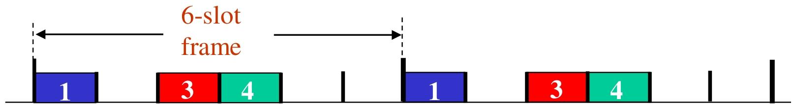

简单、易于实现，但信道利用率不高

## Static Channel Allocation 静态信道分配（重点）

### 基于利特尔法则和 M/M/1 排队系统 From Little’s Law and M/M/1 queuing system

公式：

$$
T = \frac{1}{\mu - \lambda} ：
$$

* $\mu$ 代表平均服务速率（Average Service Rate），即单位时间内能够处理的任务数量 。

- $\lambda$ 代表平均到达速率（Average Arrival Rate），也就是单位时间内新任务到达的数量 。
- $T$ 代表平均等待时间，包含排队时间和服务时间
  - Average Waiting Time = Queuing Time + Service Time
  - 该公式用于计算在M/M/1排队系统下的平均等待时间。

#### 示例（单信道情况）

- **参数设定**：
  - 数据传输速率为100 Mbps ，平均帧长10,000 bits 。
  - 根据平均服务速率$\mu$的计算公式（$\mu$ = 数据传输速率/平均帧长 ），可得$\mu = 100\times10^6\div10000 = 10000$ frames/sec 。
  - 帧到达速率$\lambda = 5000$ frames/sec 。
- **计算结果**：将$\mu$和$\lambda$代入公式$T = \frac{1}{\mu - \lambda}$ ，可得平均延迟$T = 1\div(10000 - 5000) = 0.2$ ms 。

### 频分复用（FDM）

信道被划分为 N 个静态子信道

公式

$$
T_{FDM} = \frac{1}{\mu C / N - \lambda / N}=NT ：
$$

* $C$ 表示信道容量（数据速率，单位为bps ） 。

- $T$ 是平均延迟（等待时间 + 服务时间） 。
- $\lambda$ 是帧到达速率（单位为frames/sec ） 。
- $\frac{1}{\mu}$ 是平均帧长度（单位为bits/frame ）
- 平均服务速率$\mu$还可表示为$1/T_{trans}$ ，且$\mu C = 1/((1 / \mu)/C)$ 。此公式用于计算频分复用下的平均延迟 。

#### 示例（信道划分为 N 个子信道情况）

- **参数设定**：
  - 将100 - Mbps网络替换为10个10 Mbps的网络，进行静态信道分配。
  - 对于每个子信道，平均服务速率$\mu = 10\times10^6\div10000 = 1000$ frames/sec ，帧到达速率$\lambda = 500$ frames/sec 。
- **计算结果**：代入公式$T = \frac{1}{\mu - \lambda}$ ，平均延迟$T = 1\div(1000 - 500) = 2$ ms 。

### 性能不佳

* 将信道划分为**N**个静态子信道
  * 频分复用（FDM） ，相比单信道会产生大得多的延迟
  * 时分复用（TDM）也存在同样问题
  * 静态分配不管各子信道实际使用情况，即便某子信道无数据传输，资源也被闲置
* 静态信道分配方式都难以应对突发流量 `None of the static channel allocation methods works well with bursty traffic`
  * 其他子信道即使空闲也无法帮助分担流量
* 鉴于静态信道分配的不足，采用动态信道分配（Dynamic Channel Allocation ）方式

## Dynamic Channel Allocation 动态信道分配

* 随机多址访问（Random multiple access）
* 受控多址访问（Controlled multiple access）

假设条件：

1. **站点模型（Station model）** ：假设为独立且单用户系统。意味着各站点相互独立，不考虑多用户协作或关联情况，便于简化对单个站点接入信道行为的分析。
2. **单信道假设（Single channel assumption）** ：仅考虑单一通信信道场景，不涉及多信道复杂情况，专注研究单个信道上的动态分配策略 。
3. **冲突假设（Collision assumption）** ：默认在信道访问过程中可能出现冲突情况，即多个站点同时发送数据导致信号干扰，这是研究如何避免或处理冲突的基础 。
4. **时间假设（Time assumption）**
   * **连续时间（Continuous time）** ：不将时间划分为固定时隙，站点可在任意时刻尝试发送数据。
   * **分时隙（Slotted time）** ：把时间划分为固定长度时隙，站点只能在时隙边界开始发送数据，能一定程度减少冲突 。
5. **载波监听假设（Carrier sense assumption）**
   * **载波监听（Carrier sense）** ：站点在发送数据前能检测信道是否空闲，根据检测结果决定是否发送，如 CSMA 系列协议基于此机制 。
   * **无载波监听（No carrier sense）** ：站点发送数据前不检测信道状态，像纯 ALOHA 协议，有数据就直接发送 。 这些假设条件为研究和设计动态信道分配算法提供了前提和简化基础。

# Multiple Access Protocols 多路访问协议

## 随机多路访问

### ALOHA:Pure ALOHA & Slotted ALOHA

#### 基本原理

* **无协调发送** ：站点只要有数据帧就发送，无需与其他站点进行协调。
  * `stations transmit a frame whenever they have one without coordination with others`
  * 这种自主发送方式简单直接，但易引发冲突，因为多个站点可能同时发送数据帧 。
* **冲突处理** ：若站点发送数据帧后未收到确认（acknowledge ），则认为可能发生了冲突，随即进行重传
  * `If the acknowledge not received (maybe collision), then do retransmission`
  * 重传机制旨在确保数据最终能成功传输，但多次冲突和重传会降低信道效率 。

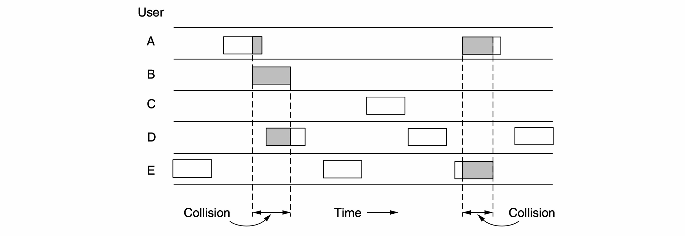

#### Flow of Pure ALOHA

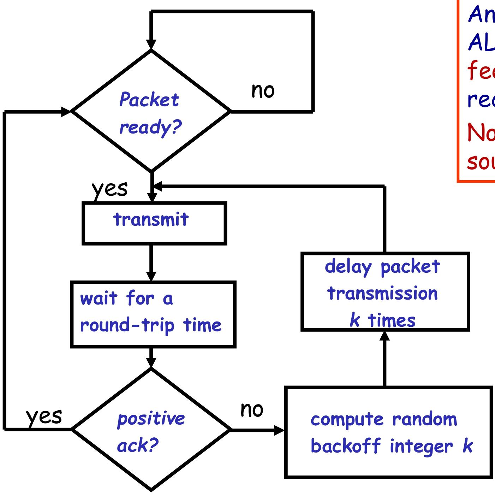

#### 性能

- **假设条件**：帧传输时长$T_0$，假定每个帧时长相同，$T_0 = T_f + 2T_p$ ，其中$T_f$是帧传输时间，$T_p$是传播延迟 。
  * 帧的产生服从泊松分布
- **吞吐量（Throughput，$S$）**：指在$T_0$时间内成功传输的帧数 。
- **网络负载（Network Load，$G$）**：指在$T_0$时间内到达的帧数 。吞吐量$S$与网络负载$G$的关系为
  - $S = G × P$ （$P$为成功传输概率 ）

依据公式可以推导出：

$$
P = e^{-\lambda(2T)} = e^{-2G}
$$

$$
S = G \times P = Ge^{-2G}
$$

并最终在$G=0.5$时取得最大值

#### 成功传输条件

若在某帧开始传输前以及传输过程中的$T_0$秒内，没有其他数据包到达，则该帧传输成功

#### 脆弱期（Vulnerable Period）2T

纯ALOHA协议的脆弱期（易冲突期）为$2T_0$ 。

在某帧开始传输前$T_0$内或传输过程中的$T_0$内，若有其他帧到达，都会发生冲突

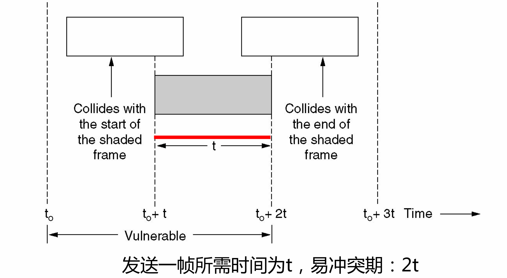

#### Slotted ALOHA(时隙/分槽ALOHA)

* 将时间分割为时长相等的时隙，每个时隙的时长均为$T_0$
* 需要依赖中心时钟或其他同步机制
* 数据传输起始于时隙边界

同步方式是一个特殊的栈在每个时间槽起始时发送一个脉冲信号来界定时间槽边界。

因为数据帧只能在时隙边界发送，所以冲突只可能发生在同一个时隙内

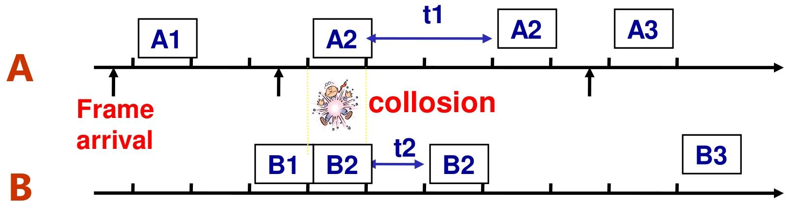

时间槽的长度为T，易冲突期也为T

$$
P_0 = e^{-\lambda(T)} = e^{-G}
$$

$$
S = G\times P_0= Ge^{-G}
$$

当 $G = 1$ 时，

$$
S=\frac{1}{e}\approx0.368
$$

### Carrier Sense Multiple Access Protocols CSMA(载波监听多点接入/多路访问)

CSMA 通过载波监听机制，将易受干扰期从较长的时间（如 ALOHA 的一个时隙时长等 ）缩短到了仅仅一个传播时延 $τ$ ，从而在一定程度上降低了冲突发生的概率，提高了信道的利用率

#### CSMA 易受干扰期（Vulnerable Period）

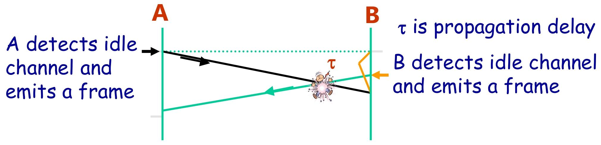

上述结论的原因：

* **站 A 先检测到信道空闲，于是开始发送一个数据帧**。
  * 在信号从 A 传播到 B 的这一段时间 $τ$ 内 ，站 B 检测到的信道状态仍然是空闲的（因为 A 发送的信号还未到达 B ）。
* **站 B 也可能会认为信道空闲并发送自己的数据帧**。
  * 这样，A 和 B 发送的数据帧就会在信道中发生冲突（如图中碰撞标识所示 ）。
* **从 A 开始发送数据帧，到 A 发送的数据帧传播到 B ，这一时间段就是易受干扰期**。
  * 因为在这期间，其他站点（如 B ）可能会因为尚未感知到 A 发送的信号而错误地认为信道空闲并发送数据，从而导致冲突。

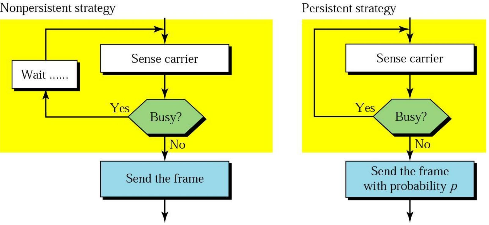

#### 非坚持 CSMA（Nonpersistent CSMA）

当设备检测到信道处于忙状态时，不会持续监听信道，而是等待一段随机时长(设备自行确定的，不同设备等待的时间不同)

等待结束后，设备再次尝试监听信道状态，以此决定是否可以发送数据帧

#### 坚持 CSMA（Persistent - CSMA）

* **一般坚持 CSMA 策略** ：
  * 当设备检测到信道忙时，会持续监听信道，直到信道变为空闲状态 。
  * 一旦信道空闲，设备就立即发送数据帧 。
* **1 - 坚持 CSMA** ：
  * 当设备检测到信道空闲时，以概率**1**（也就是肯定会）发送数据帧
* **p - 坚持 CSMA** ：当设备检测到信道空闲时，以概率 $p$ 发送数据帧，以概率$1−p$ 延迟发送，即等待一段随机时间后再尝试发送

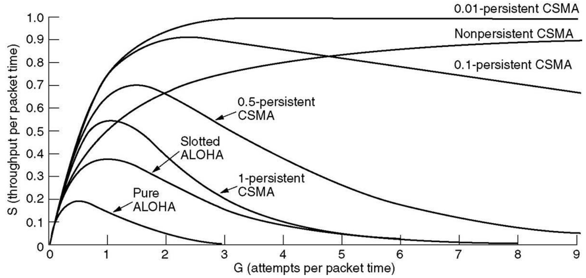

#### 1 - 坚持 CSMA 和非坚持 CSMA 性能分析

#### 1 - 坚持 CSMA

* **低负载情况** ：**高吞吐量**
  * 在网络负载较低时，**信道空闲时间较多**。由于 1 - 坚持 CSMA 只要检测到信道空闲就以概率 1 立即发送数据帧，所以能快速利用这些空闲时段进行数据传输 。这使得数据能及时发送出去，从而实现高吞吐量（High throughput），同时数据传输等待时间短，延迟（delay）也较低 。
* **高负载情况** ：**吞吐量降低**
  * 当网络负载升高，**多个设备同时检测到信道空闲并立即发送数据的概率增大**，容易频繁发生冲突 。冲突发生后，设备需要重传数据，这会消耗信道资源，导致实际成功传输的数据量减少，最终使得吞吐量降低（Low throughput） 。

#### 非坚持 CSMA

* **高负载情况** ：**保持高吞吐量**
  * 在网络负载较高时，信道繁忙是常态。非坚持 CSMA 在检测到信道忙后，会等待一段随机时间再重新监听信道 。这种**随机等待机制使得多个设备不会集中在同一时刻竞争信道，有效减少了冲突的发生概率** 。较少的冲突意味着更多的数据能够成功传输，所以在高负载情况下可以实现较高的吞吐量（High throughput） 。

## 带冲突检测的载波监听多路访问 CSMA/CD (CSMA with Collision Detection)

* 当检测到冲突后，设备立即停止数据传输，进入退避（backoff）过程
* 在停止传输后，设备会发送一个强化信号（jam signal）
  * 其目的是让网络中其他设备都能明确感知到发生了冲突，避免其他设备误判信道状态 。
* 发送完强化信号后，设备等待一段随机时长，然后再次尝试发送数据

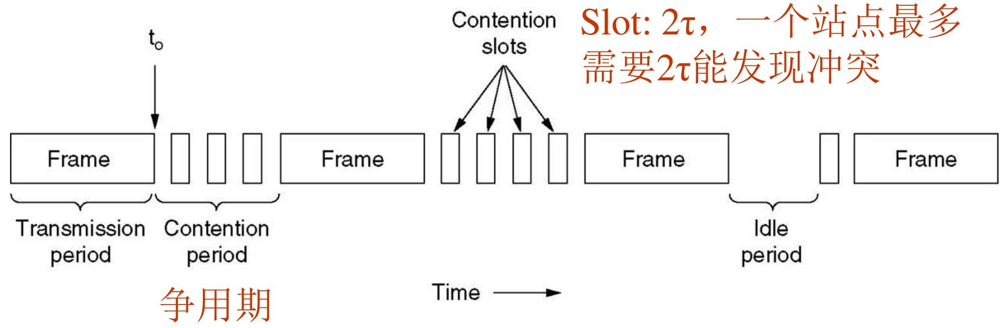

* Transmission period：传输周期，一个站点使用信道，其他站点禁止使用
* Contention period：竞争周期，所有站点都有权尝试使用信道，争用时间槽
* Idle period：空闲周期，所有的站点都不使用信道

### CSMA/CD: Contention Periods(争用期)

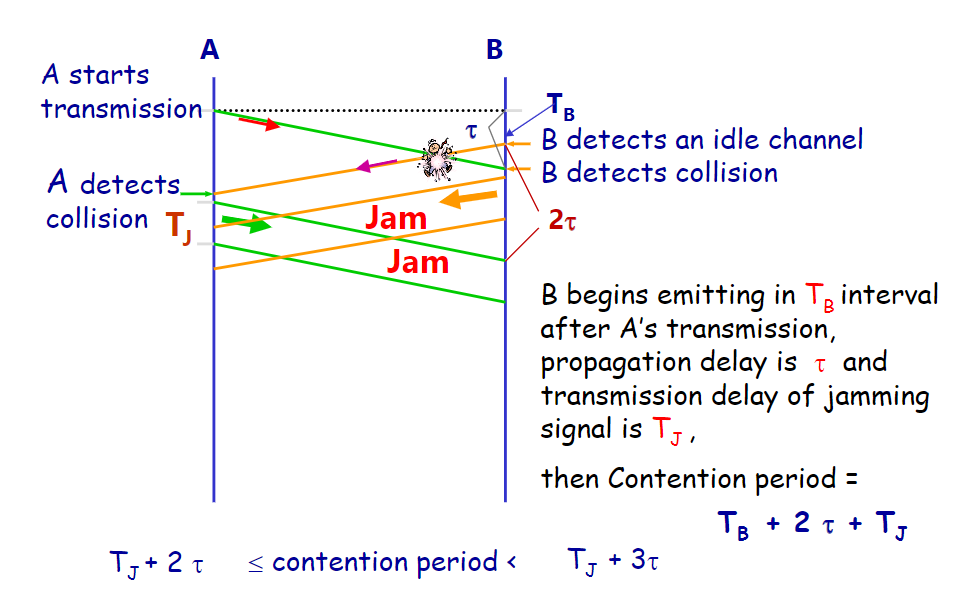

* 从A开始发送数据，到B检测到冲突，信号传播时间为 $\tau$ （A到B的传播延迟 ），B检测到冲突后，信号再从B传播回A让A也检测到冲突，又需要 $\tau$ ，所以这部分时间总共是 $2\tau$
* 当检测到冲突后，设备要发送强化信号（Jam signal） ，其传输延迟为 $T_J$
* B在A开始传输后的$T_B$ 时间段内检测到信道空闲并开始发送 ， $T_B$ 也属于争用期的一部分

综合得到：

$$
争用期  = T_B + 2\tau + T_J
$$

$$
0\leq T_B<\tau
$$

$$
T_J + 2\tau \leq 争用期  < T_J + 3\tau
$$

### 1 - 坚持 CSMA/CD

当发生冲突需要重传数据时，设备会在**0**到**d**之间选择一个随机数**k**

如果检测到信道空闲，设备就立即发送数据 ；若检测到信道仍被占用，设备会继续等待，直到信道变为空闲状态

若在后续尝试发送同一帧数据时又发生冲突，设备会重复上述选择随机数**k** 、等待并检测信道的过程

设备会记录重传尝试的次数 。当达到预设的最大尝试次数（通常为**16**次 ）时，设备就会放弃重传，丢弃该数据帧

#### **指数退避（Exponential backoff）机制**

指数退避是一种特殊的退避策略，在每次重传尝试时，最大延迟时间会翻倍

##### 二进制指数退避算法

从集合{$0, 1, 2, \ldots, 2^k - 1$\}中随机选取一个数 $r $

 $r$ = {$0, 1, 2, \ldots, 2^k - 1$\}

 $k$ = min[ number of attempt,10]

*比如第一次重传尝试，k = 1 ，r从{0, 1}中选；第二次尝试，k = 2 ，r从{0, 1, 2, 3}中选 ，依此类推*

Retransmission time = r × basic retransmission_time

## Collision-Free Protocols 无冲突协议（受控多路访问）

### Polling(轮询)

* 基于 HDLC
* 主站负责按照顺序依次轮询各个从站
* 从站接收到主站的轮询命令后，根据自身状态做出响应（Response ）
* 主站收到从站响应后，再轮询下一个从站
* 轮询属于集中控制方式，主站掌控整个轮询过程

### Token Passing(令牌传递)

* 分布式控制方式
  * 没有中心控制节点
  * 各个站点地位相对平等，共同参与信道访问控制
* 令牌：一种代表发送权限的小消息
  * 拥有令牌的站点才有权利发送数据
* **令牌环**
  * 所有站点连接成一个环形拓扑结构，令牌沿着固定方向依次从一个节点传递到下一个节点
  * 当一个站点接收到令牌时
    * 如果它没有数据要发送，就直接将令牌传递给下一个站点；如果有数据要发送，它会先保留令牌，在发送完数据后再将令牌传递出去 。
  * 站点只有在获取到令牌后才能传输数据

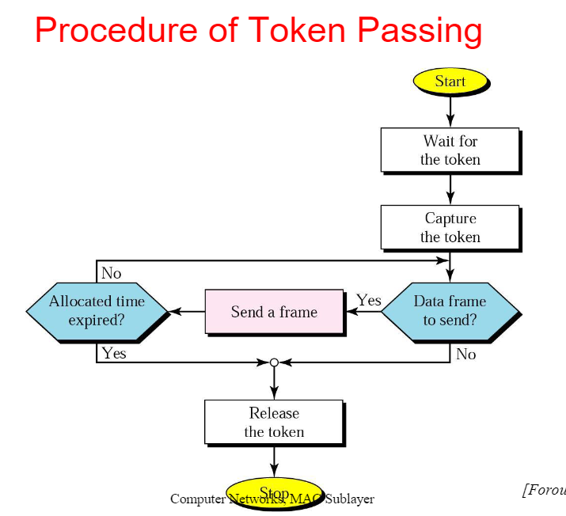

## 总结

* **纯 ALOHA（Pure ALOHA）**
  * 工作在连续时间模式下，设备发送数据前不进行载波监听
  * Continuous time, no carrier sense
  * Vulnerable period: 2$T_0$
* **时隙 ALOHA（Slotted ALOHA）**
  * 将时间划分为等长时隙，设备发送数据也不进行载波监听
  * Slotted time, no carrier sense
  * Vulnerable period: $T_0$
* **载波监听多路访问（CSMA）**
  * 通过监听信道状态，判断是否有其他设备正在发送数据
  * Carrier sense
  * Vulnerable period: Propagation delay $τ$

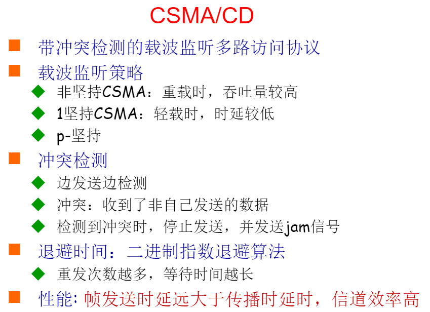

## Wireless LAN Protocols

* 无线电发射器有固定的传输范围
  * 在一些无线局域网（wireless LANs）中，并非所有站点都在彼此的传输范围内 。
* 由于站点传输范围的差异，在某些情况下冲突可能无法被检测到
* 在无线环境中，干扰主要发生在接收端（receiver ），而非发送端
* CSMA/CD is not appropriate

### 问题

#### Hidden station (隐蔽站) problem

某个站点由于处于其他发送站点的信号覆盖范围外，无法检测到信道中正在进行的传输，进而在同一时刻向同一接收端发送数据，导致冲突

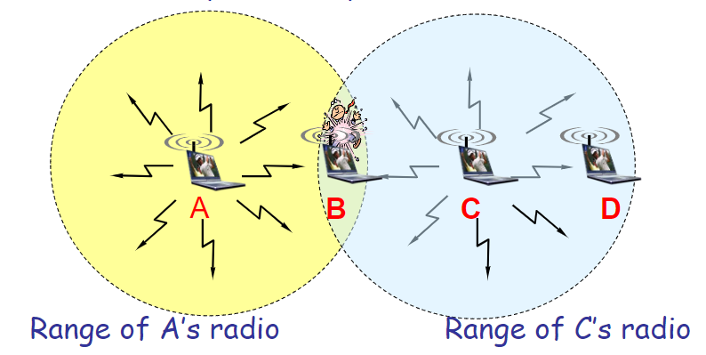

#### Exposed station (暴露站/曝露站) problem

一个站点因感知到其他站点的信号，错误地认为自己无法进行数据传输，从而造成信道资源浪费

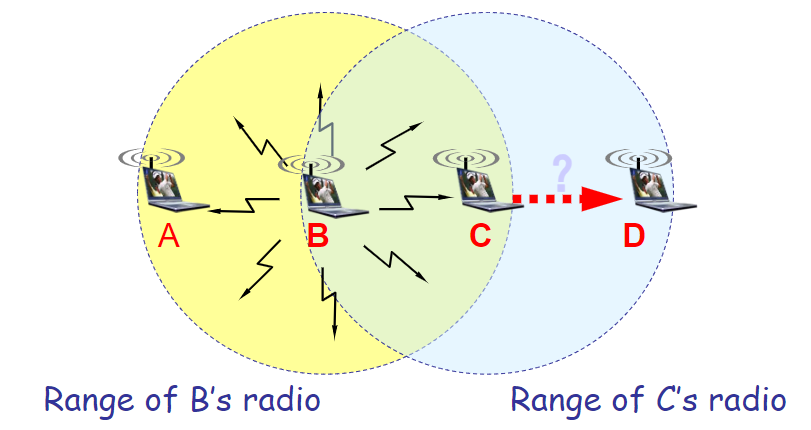

### PCF (Point Coordination Function点协调功能)

#### Polling(轮询) 集中控制

* 由基站（base station）掌控其覆盖区域（cell）内的所有活动
* 基站周期性地广播信标帧（beacon frame）
* 一旦站点完成注册，就能被有效保障一定比例的带宽

### DCF (Distributed Coordination Function,分布协调功能)

* **握手机制** ：DCF 中站点通过握手（handshake）方式来确定谁可以发送数据
* **避免冲突协议** ：DCF 引入了避免冲突的多址接入（MACA：Multiple Access with Collision Avoidance ）和带冲突避免的载波监听多路访问（CSMA/CA：CSMA with Collision Avoidance ）协议

### MACA (带冲突避免的多路访问)

多路访问的冲突避免（Multiple Access Collision Avoidance ）

1. **四帧交换机制（提升可靠性）**
   * **RTS 帧发送** ：源站点（Source）向目的站点（Destination）发送请求发送（Request to Send, RTS）帧 。
     * RTS 帧就像是源站点发出的 “预约申请”，告知目的站点自己有数据要发送，并试图预约信道 。同时，RTS 帧会警示源站点信号覆盖范围内的所有站点，让它们知道即将有数据传输，避免在此期间发送数据导致冲突 。
   * **CTS 帧响应** ：目的站点接收到 RTS 帧后，回复允许发送（Clear to Send, CTS）帧 。
     * CTS 帧是目的站点对源站点的 “许可回应”，表示目的站点准备好接收数据，并且也警示了目的站点信号覆盖范围内的所有站点，要求它们暂时不要发送数据，从而为源站点到目的站点的数据传输预留信道 。
   * **数据帧传输** ：源站点在收到 CTS 帧后，开始传输数据（DATA）帧 。
     * 此时，由于 RTS 和 CTS 帧已经对信道进行了预约和协调，其他站点不会在这段时间内发送数据，大大降低了冲突发生的概率 。
   * **ACK 帧确认** ：目的站点成功接收数据帧后，向源站点发送确认（ACK）帧 。
     * ACK 帧用于告知源站点数据已成功接收，若源站点未收到 ACK 帧，则会认为数据传输失败，进而进行重传 。整个过程可表示为 RTS (S to R) -> CTS (R to S) -> DATA (S to R) -> ACK (R to S) 。

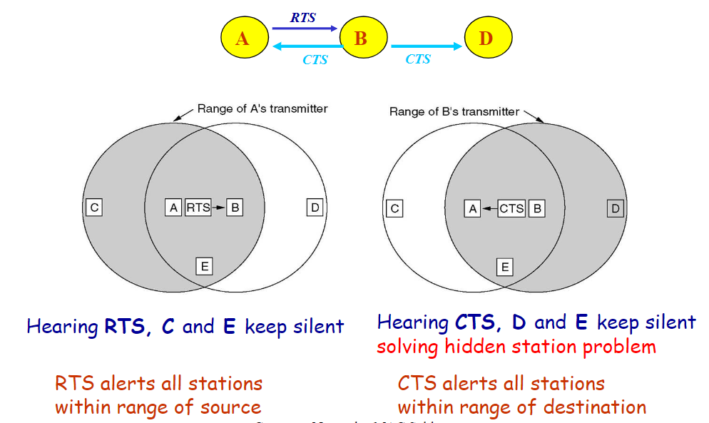

#### MACA: Collisions

当两个站点（如图中的 A 和 D ）同时向同一个站点（B ）发送 RTS（Request to Send）帧时，就会发生冲突

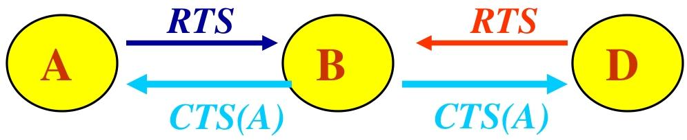

在这种情况下，B 可能无法正确接收和处理这两个同时到达的 RTS 帧

* **发送方处理方式**：对于发送 RTS 帧但未在预期时间间隔内收到 CTS（Clear to Send）帧的站点（即发送失败的站点 ），它会等待一段随机时间，然后再次尝试发送 RTS 帧

The algorithm used is binary exponential backoff(二进制指数退避)

# IEEE 802 Reference Model

* Physical Layer
* MAC (Media Access Control,介质访问控制)子层
* LLC (Logic Link Control,逻辑链路控制)子层

## LLC Services and Protocol

### LLC Services（逻辑链路控制服务）

* **Unreliable datagram service（不可靠数据报服务）**
* **Acknowledged datagram service（确认数据报服务）**
  * MACA（Multiple Access Collision Avoidance，多路访问冲突避免） 技术采用的这种服务，发送方发送数据报后，接收方会向发送方返回确认信息
* **Reliable connection - oriented service（可靠的面向连接服务）**

### LLC protocol（逻辑链路控制协议）

* **Based on HDLC, but not identical（基于高级数据链路控制（HDLC），但不完全相同）**
* **Multiplexing using LSAPs (LLC Service Access Points)（使用逻辑链路控制服务访问点（LSAP）进行多路复用）**

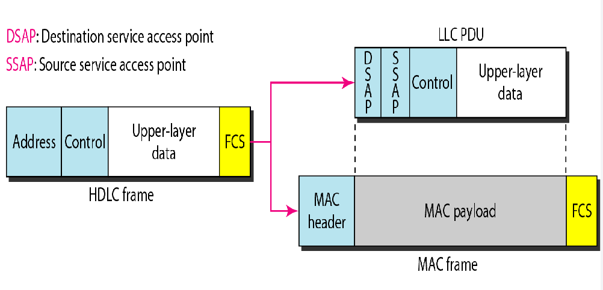

# Ethernet 以太网

* **建立和管理网络连接（Establishes and manages the computer's network connection）**
* **编码（Encoding: translates digital computer data into signals）**

## Classic Ethernet(传统以太网)

### Physical Layer

#### 网卡（NIC）

网卡的任务：

* 建立和管理计算机的网络连接
* 编码:将计算机的数字数据转换为信号

网卡支持LLC, MAC和物理层功能，每块网卡有唯一的MAC地址

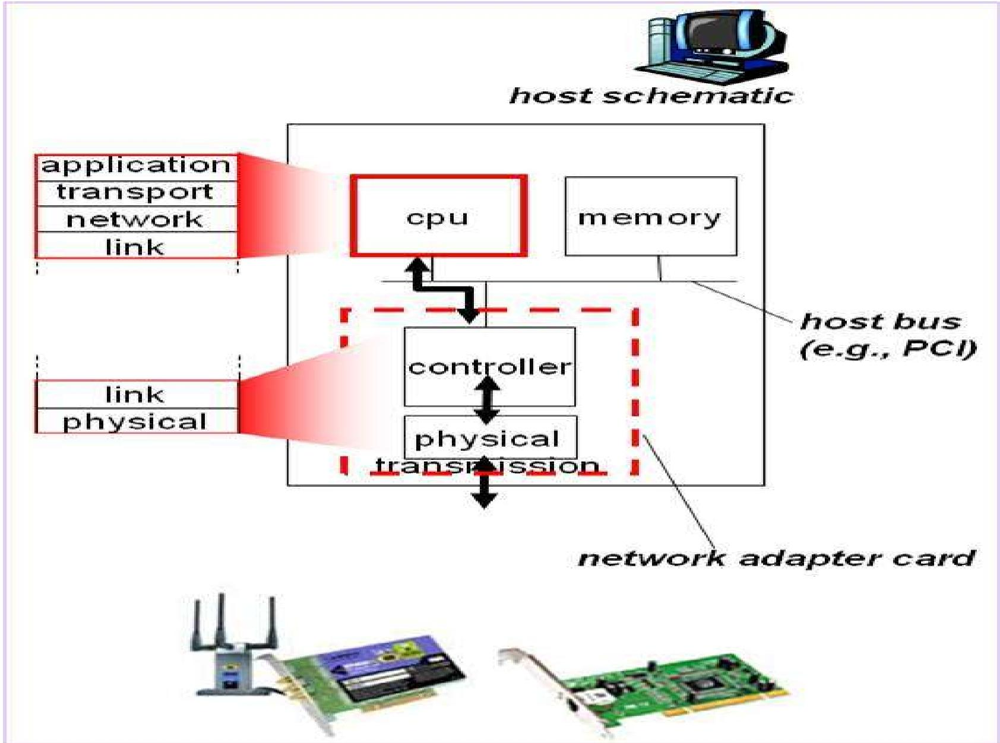

| Name      | Cable        | Max. seg.   | Nodes/seg. | Advantages                   |
| --------- | ------------ | ----------- | ---------- | ---------------------------- |
| 10Base5   | Thick coax   | $500 ~m$  | 100        | Original cable; now obsolete |
| 10Base2   | Thin coax    | $185 ~m$  | $30$     | No hub needed                |
| 10Base-T  | Twisted pair | 100 m       | 1024       | Cheapest system              |
| 10 Base-F | Fiber optics | $2000 ~m$ | 1024       | Best between buildings       |

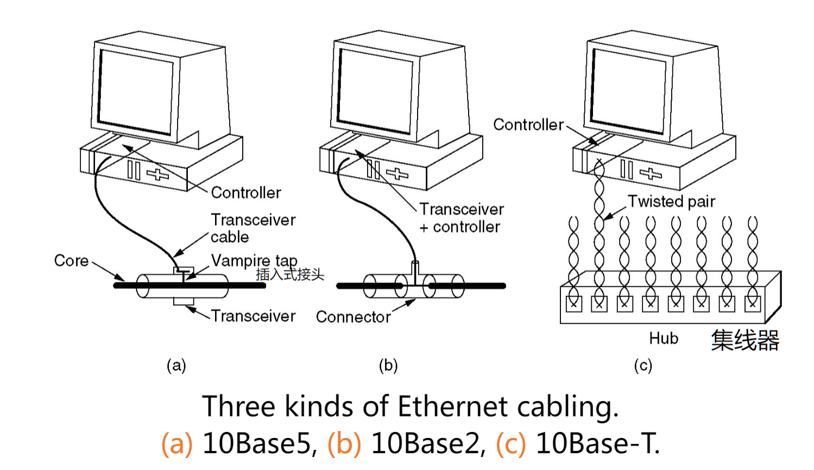

#### 粗缆以太网(10Base5)连接站点

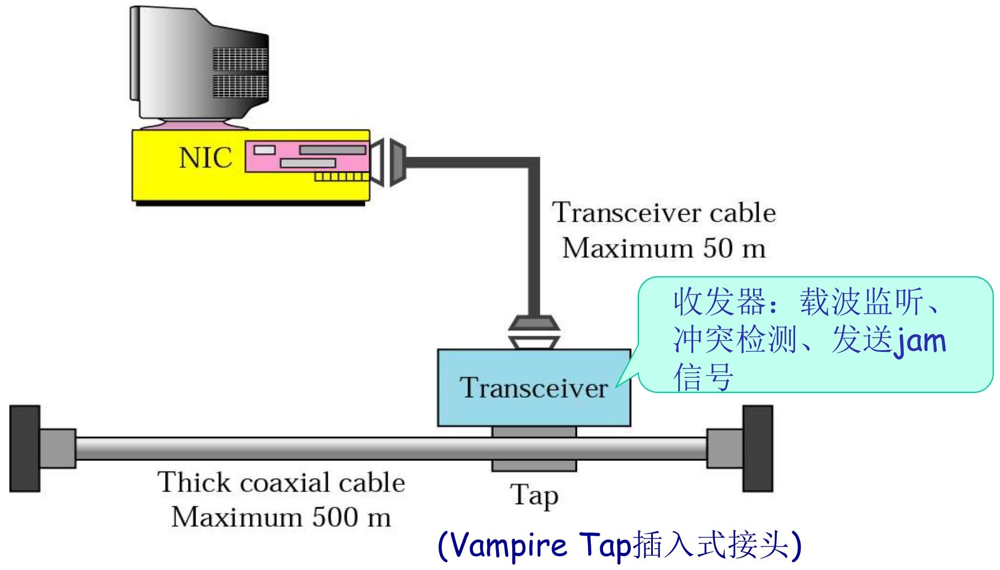

* **InterFace board** 网卡：负责数据帧的处理，将数据组装成特定格式的帧并进行收发，处理校验和以保障数据准确性；管理接收和发送缓冲区，实现与主机的直接内存传输，提升数据传输效率。
* **Transceiver(接收器)** ：具备载波检测和冲突检测能力，能判断信道是否空闲，并在数据传输时检测冲突。一旦检测到冲突，会发出特殊无效信号通知其他收发器，使整个网络能及时响应并处理冲突 。

计算机通过网卡连接到收发器电缆，收发器通过插入式接头与粗同轴电缆相连。在数据发送时，网卡将数据发送给收发器，收发器进行载波监听，若无其他设备发送数据，则将数据发送到粗同轴电缆上；在接收数据时，收发器监听电缆上的信号，将接收到的数据传给网卡。当检测到冲突时，收发器发送 jam 信号，通知网络中其他设备停止发送并等待重新发送时机

#### 细缆以太网(10Base 2)连接站点

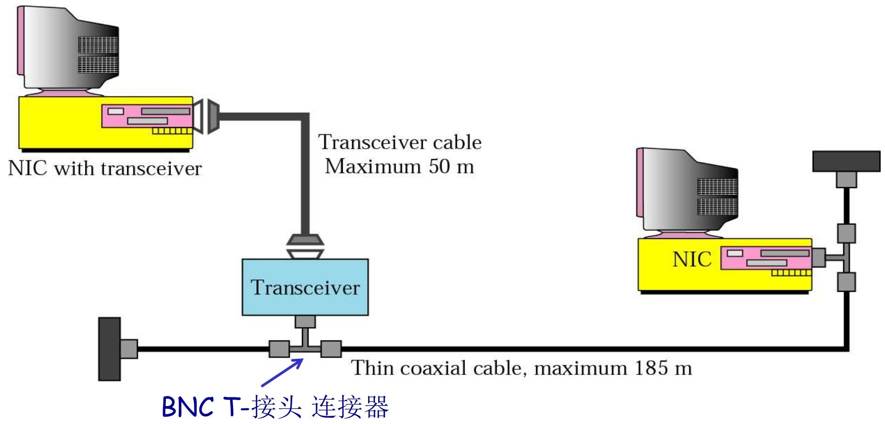

* 电缆: 直径5mm的同轴电缆,最大段长度185m
* BNC T型连接器
* 收发器放在网卡上

#### 10BaseT连接站点

* 完全没有共享电缆
* 集线器 **Hub** ：
  * Station is connected to Hub by a **deficated(专有的)** cable
  * 媒体信号的再生
* RJ-45, UTP5 (非屏蔽双绞线、传输介质)
  * 差分传输：一对线中的一根线以正电平方式传输信号，另外一根线 以负电平方式传输同一信号，减少电磁干扰
  * 同一线对的绞合：减少近端串扰

##### Repeaters(中继器)

* 物理层设备
* 放大信号､对信号整形,以减小信号失真和衰减,使 信号传播得更远
* 扩展LAN段
* 一个LAN里最多4个中继器

##### Hub 集线器

集线器是一种多端口**中继器(repeater)** 。中继器的作用是对传输介质上的信号进行放大和整形，以延长信号传输距离，而集线器拥有多个端口，可连接多个设备。

* Providing a **star connection physically** implements a **bus topology logically**
* 星型的逻辑结构和总线的逻辑结构
* 支持10Mbps or 100Mbps
* 完全取代了中继器
* 一个网段中最多配置3个集线器，否则可能影响网络性能

##### 连线

* 接线标准:TIA/EIA-568B
  * 1236先橙后绿
* 接线标准:TIA/EIA-568A
  * 1236先绿后橙
* 直连线
  * 电缆两端的RJ45接头遵循相同的接线标准
  * 用于连接一个设备(PC 或路由器) 和另一个**不同**设备 different device ( Hub或交换机)
* 交叉线
  * 电缆两端的RJ45接头遵循不同的接线标准
  * 用于连接连个相似的设备：交换机-交换机、交换机-Hub、Hub-Hub、路由器-路由器、PC-PC

### MAC Sublayer

广播链路:每个站都可以接收其他站发送的数据

* 必须使用地址来标识目的站
* 只有一个站复制并处理帧,其他站忽略该帧

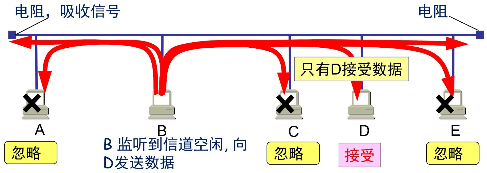

##### 帧间隙IFG

10M bps 以太网的帧间隙是9.6μs（更准确地说,是96比特时间）

#### 以太网/IEEE 802.3：1-坚持的CSMA/CD的工作步骤

* Step 1. 首先,监听信道是否空闲, “说前先听”
* Step 2. 如果空闲时间超过IFG,则发送. “如果空闲就说”
* Step 3. 如果信道忙,持续监听. “一直等到信道空闲再说”
* Step 4. 边发送边检测冲突“边说边听”
* Step 5. 如果发现冲突,第一个发现冲突的站发送 jam信号以便使其他站意识到发生了冲突｡发送站立 即停止发送,接收站拒绝该数据,其他要发送数据的 站重新计算其各自的退避时间｡”蜂鸣器响了,说明 发言的不只一个”
* Step 6.收到jam信号,所有站点退避一段时间后重新 监听信道;16次冲突后,放弃发送该帧｡

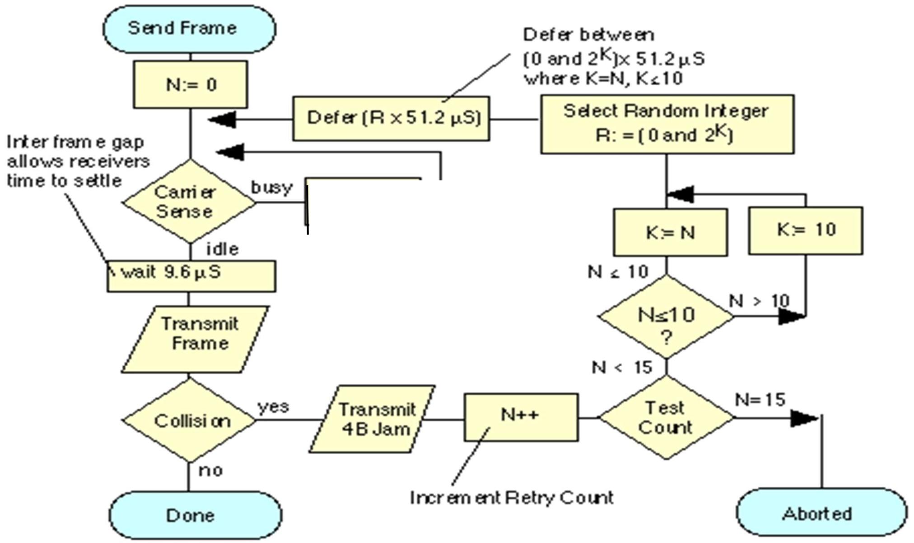

#### MAC帧结构

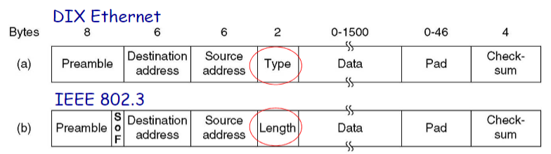

a)：DIX Ethernet 普遍使用的帧格式

b)：IEEE 802.3规定的帧格式

两种帧格式相互兼容

* Preamble(前导码)：8字节，用于同步时钟
* Destination address(目的地址)：6字节，48 bits，目的地址的Mac地址
  * 前24比特标识生产商(OUI: 组织机构唯一识别码)
* Source address(源地址)：6字节，48 bits，发送方的Mac地址
  * 后24比特是由生产商指定的序列号
* Type(类型)：2字节，用于标识用于封装数据字段的上层协议类型，如0x0800表示IP协议
* Length(长度)：2字节，用于表示数据字段的长度
* Data(数据)：0到1500字节，承载上层传递下来的数据
* pad(填充)：0-46字节，当数据长度小于64字节时，用于填充使得帧**总长**超过64bytes
* Check sum(校验和)：4字节用于存储校验和，错误的帧直接丢弃
* SoF：帧开始的界定符，表示后面的信息就是Mac帧

所以Preamble的8字节并不算Mac帧的内容

#### Frame Length 帧长

##### Max Frame Length

* 1518 Bytes(1500字节数据帧+18字节用于封装，不考虑Preamble码)

##### Min Frame Length

* 有效的最小帧长为64btyes (46+18)
  * 为了使主机有时间检测到冲突
* 这是为了满足传输延时大于2τ = 51.2 μs

$$
10Mbps × 51.2us=512bits
$$

$$
512bits=64bytes
$$

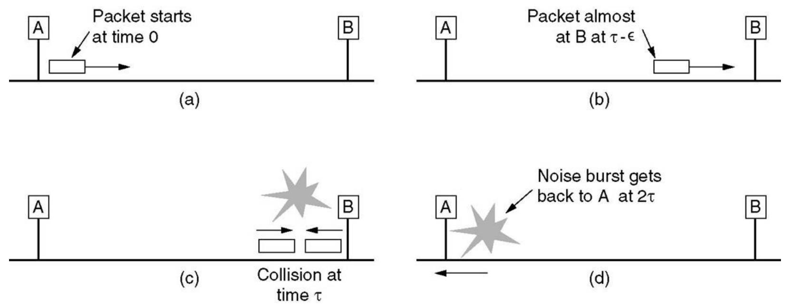

### 以太网性能

#### 涉及参数

* **Frame length（帧长）** ：用 **F** 表示。
* **Bandwidth（带宽）** ：用 **B** 表示 。
* **Cable length（电缆长度）** ：用 **L** 表示 。
* **Speed of signal propagation（信号传播速度）** ：用 **c** 表示 。
* **传送一帧平均时间** ：用 **P** 表示，**(P = F/B)** 。
* **某个站获得信道的概率** ：用 **A** 表示 ，2τ为时间槽 。
  * 每次竞争发送成功需要的平均时隙数= 1/A

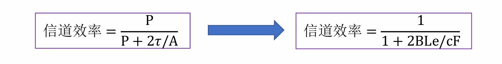

* 给定帧长的情况下，增加带宽B或**距离L**会降低网络效率
* 电缆越长，τ越大，任何两个站之间的最大电缆距离会影响性能
* 减少冲突
  * 用交换式以太网代替共享式以太网(即传统以太网)
  * 减少连接在同一个LAN上的计算机的数量
    * 用网桥将多个LAN连接在一起
* 增加数据率
  * 快速以太网和千兆以太网

### 交换式以太网

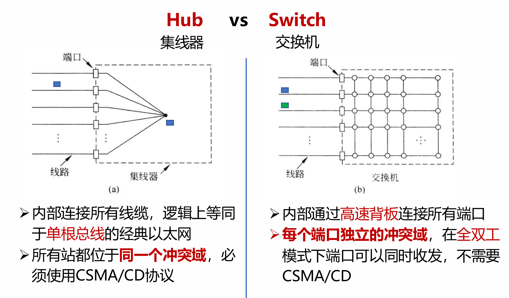

#### Switched Ethernet（交换式以太网）

* 中心节点采用交换机 (而非Hub)
* 交换机将来自特定站 的输入帧交换到合适的输出线上
* 未使用的线路可以用 来交换其他流量,因 此允许多个站同时传输
* LAN的容量成倍扩充
* 比传统共享式以太网**更安全**

#### 冲突域

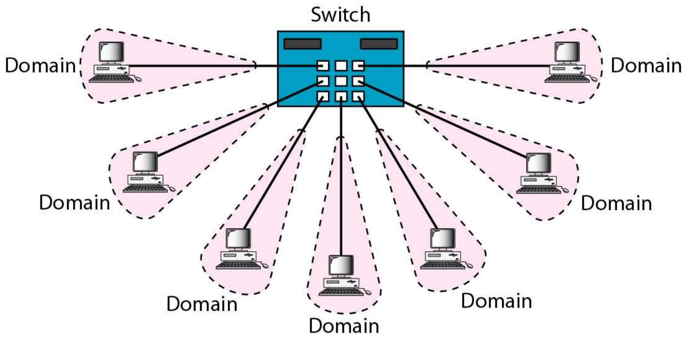

### 快速以太网: IEEE 802.3u

* 保留IEEE802.3协议的帧格式､接口和过程规则
* 将比特时间从100 ns减小到10 ns
* 最小帧长度仍为64字节
* 快速以太网系统使用Hub或交换机连接;不允许使用插入式接头或BNC连接器连接电缆的方式

| Name         | Cable        | Max. segment | Advantages                         |
| ------------ | ------------ | ------------ | ---------------------------------- |
| 100Base - T4 | Twisted pair | 100m         | Uses category 3 UTP                |
| 100Base - TX | Twisted pair | 100m         | Full duplex at 100 Mbps            |
| 100Base - FX | Fiber optics | 2000m        | Full duplex at 100 Mbps; long runs |

#### 1. Hub（集线器）

* **通信模式** ：半双工通信，意味着在同一时刻，设备只能发送数据或者接收数据，不能同时进行。
* **工作原理** ：输入线在逻辑上连接在一起，形成一个单一的冲突域。当多个设备同时通过 Hub 发送数据时，就可能产生冲突，需要采用 CSMA/CD（载波监听多路访问 / 冲突检测 ）机制来检测和处理冲突。
* 工作方式契合经典以太网

#### 2. 交换机

* **通信模式** ：全双工通信，设备可以同时发送和接收数据，大大提升了数据传输效率 。
* **工作原理** ：交换机缓存输入的帧，通过学习帧中的源 MAC 地址来构建 MAC 地址表，然后依据目的 MAC 地址将帧转发给对应的目的站点，每个端口都有独立的带宽，减少了冲突。

## Gigabit(千兆) Ethernet:IEEE 802.3z

* 比起之前10倍块
* 向后兼容
  * 帧格式不变
  * 最大帧长不变
  * 最小帧长不变
* 单播和多播的无确认数据报服务
* 采用当前使用的48-bit地址

### 全双工时（交换机）

* 不使用CSMA/CD协议
* 最大电缆长度取决于信号强度
* 自由地混合和匹配各种速度
* 支持自动配置

### 半双工时（集线器）

* 使用CSMA/CD协议
* 载波扩展
  * 通过在普通帧后面增加填充比特，使帧长度扩展到 512 字节
  * 在物理层上增加信号传输时间，让冲突检测机制能在更长的线缆距离上有效工作
* 帧突发
  * 允许发送方将多个帧级联在一起一次性传输出去
  * 减小发送多个单独帧时的额外开销

### Flow control 流量控制

千兆以太网速度太快(1G bps)，如果接收方在1毫秒内忙于其他任务,就可能会积累1953 个帧,缓冲区很可能会溢出

**PAUSE控制帧**：使用暂停帧(一种控制帧)允许或禁止帧的传输

暂停时间是最小帧时的整数倍，是普通的以太帧，类型字段设置为0x8808

### 10Gbps Ethernet

* Support only full-duplex (Not using CSMA/CD ）仅支持全双工，不再支持多路访问控制协议
* **Preserve(保留)** the 802.3 Ethernet frame format at mac interface 在MAC接口上保持802.3以太网帧格式
* Preserve the minimum and maximum frame size of the current 802.3 standard
* 重点关注支持高速率的物理层的细节
* 支持自动协商

| 以太网类型   | 传输速率（Mbps） | 相关标准   | 典型网络种类、介质及拓扑结构            | 介质访问控制技术及工作模式                          | 编码方案              | 典型帧长                 | 最大网络长度   | 其他特点                                       |
| ------------ | ---------------- | ---------- | --------------------------------------- | --------------------------------------------------- | --------------------- | ------------------------ | -------------- | ---------------------------------------------- |
| 经典以太网   | 10               | IEEE802.3  | 总线、10base5、10base2、10baseT（星型） | CSMA/CD，集线器                                     | 曼彻斯特码            | 最小64B，最大1518B       | 2500m          | 48bit地址、特定帧间隔                          |
| 快速以太网   | 100              | IEEE802.3u | 星型、点到点，10baseT                   | CSMA/CD，半双工（中继器、集线器）、全双工（交换机） | MLT - 3、4B/5B、8B/6T | 最小64B，最大1518B       | 100m           | 自动协商，地址、帧格式和长度等不变             |
| 千兆以太网   | 1000             | IEEE802.3z | 星型、点到点，光纤                      | CSMA/CD（集线器）、不使用（交换机，全双工）         | 8B/10B等              | 帧突发最小64B，最大1518B | 载波扩展后200m | 自动协商、载波扩展                             |
| 万兆以太网   | 10000            | IEEE802.3a | 星型、点到点                            | 全双工（交换机，无冲突）                            | -                     | 最小64B，最大1518B       | -              | 应用于校园网骨干网、MAN、与WAN互联             |
| 交换式以太网 | -                | -          | -                                       | 无冲突，全双工（交换机）                            | -                     | -                        | -              | 引入交换机，分割冲突域，更安全，过滤、隔离流量 |

# Wireless LAN 无线局域网

## infrastructure Mode 基础构架模式

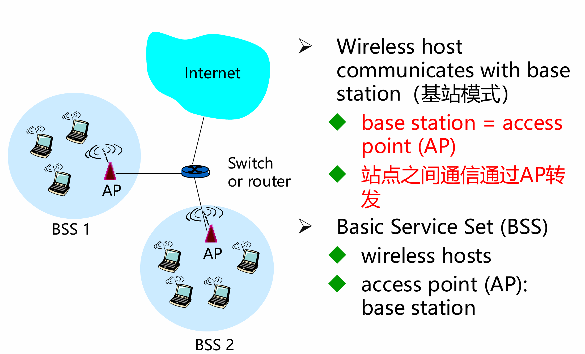

## Ad hoc Mode 自组织模式

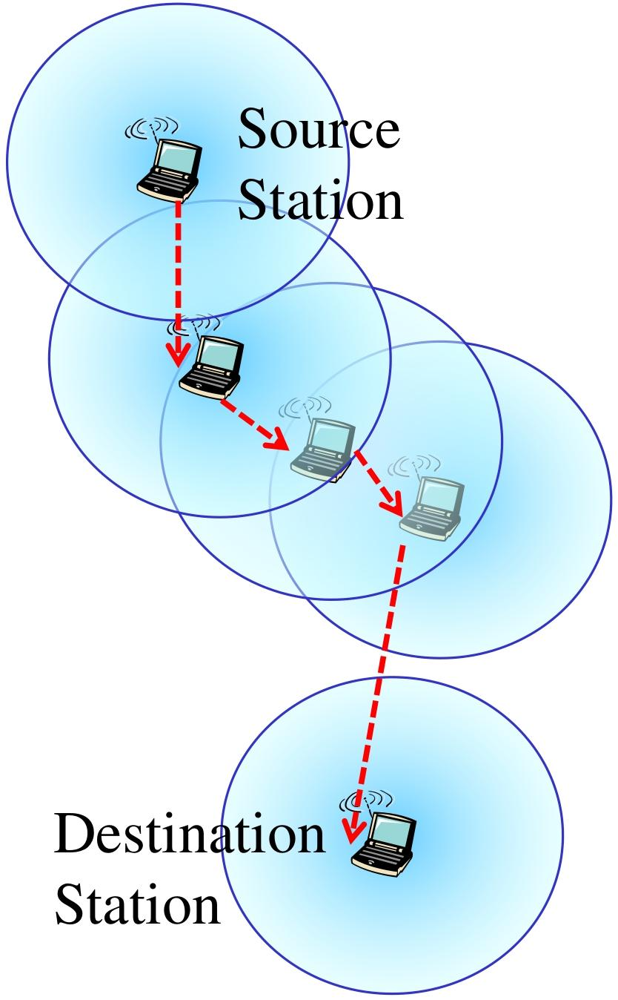

* 无基站
* 节点只能在无线链路覆盖范围内传输给其他节点
* 节点将自己组织成网络：节点之间进行路由选择

## IEEE802.11 Protocol Layer

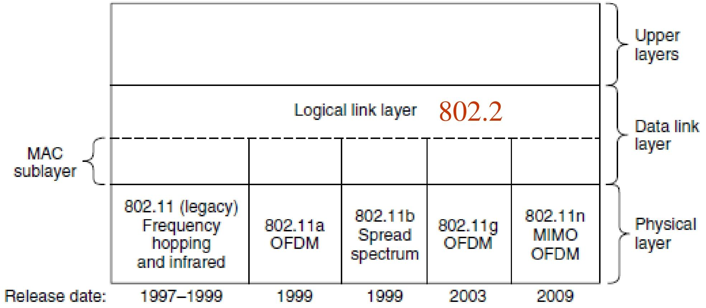

* FHSS: Frequency Hopping Spread Spectrum 跳频扩频
* DSSS: Direct Sequence Spread Spectrum 直接序列扩频
* OFDM: Orthogonal Frequency Division Multiplexing 正交频分复用
* MIMO: Multiple Input Multiple Output 多输入多输出

常见的802.11标准：

* 802.11b
* 802.11a
* 802.11g
* 802.11n

## 802.11 MAC Sublayer

### Multiple access 多路访问

不能使用冲突检测（CD）

点协调功能 (PCF)

* 有基站控制
* 支持基于轮询的优先级

分布协调功能(DCF)

* 没有集中控制
* CSMA/CA(拥塞避免)

### CSMA/CA

* CSMA – 发送之前监听信道是否空闲
* 显式ACK
* 指数退避
* 拥塞避免可选
  * 使用RTS和CTS

802.11 发送方：

1. If sense channel idle for DIFS(帧间间隔) then transmit entire frame
2. 如果检测到通道繁忙，则先等待传输结束，然后开始随机后退
   * 先随机后退0~15个时间槽，每当检测到一个空闲时间槽计数器就减一，当有帧传输时则挂起后退过程，当计数器减为零时发送帧。
3. 如果没有收到ACK, 意味着有冲突发生或其他错误,退避时间加倍并再 次尝试(与以太网中的指数退避一 样),重复2

802.11 接收方

1. 如果收到正确的帧,目的站等待 SIFS（短帧间隔） 时间后发送ACK (显式确认)
2. Lack of an ACK is inferred(推断) to indicate(表明) a collision or other error, **doubles** the backoff period and tries again.

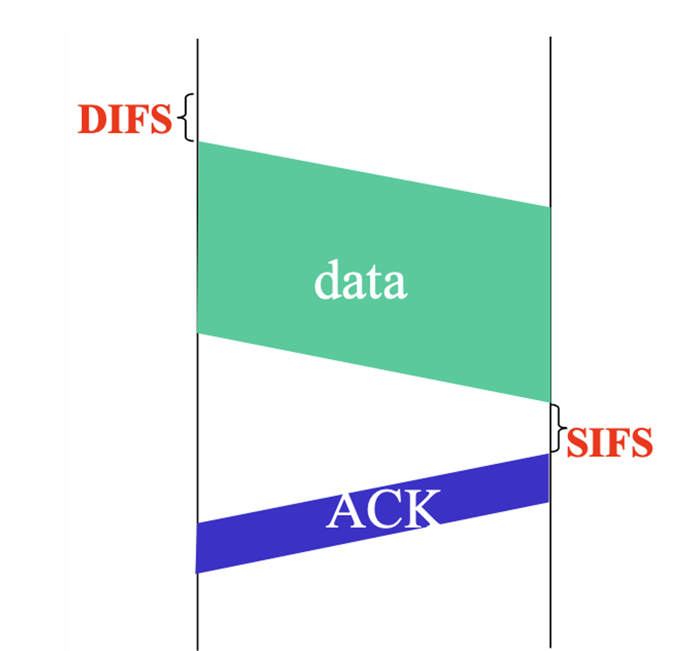

所有站点完成发送后，必须等待一段很短的时间才能发送下一帧。这段时间统称为帧间间隙。(IFS)

* DIFS：Dcf InterFrame Spacing DCF帧间隔
  * Regular data frames
* SIFS：Shot InterFrame Spacing 短帧间隔
  * ACK frame
  * Other control frame sequences like RTS and CTS
  * a brust of fragments
* $AIFS _{1}$ (Arbitration InterFrame Space): time waiting before sending high-priority traffic 仲裁帧间隔，短的AIFS
* $AIFS _{4}$ : time waiting before sending low-priority traffic 仲裁帧间隔，长的AIFS
* EIFS: time waiting before retransmission 扩展帧间隔

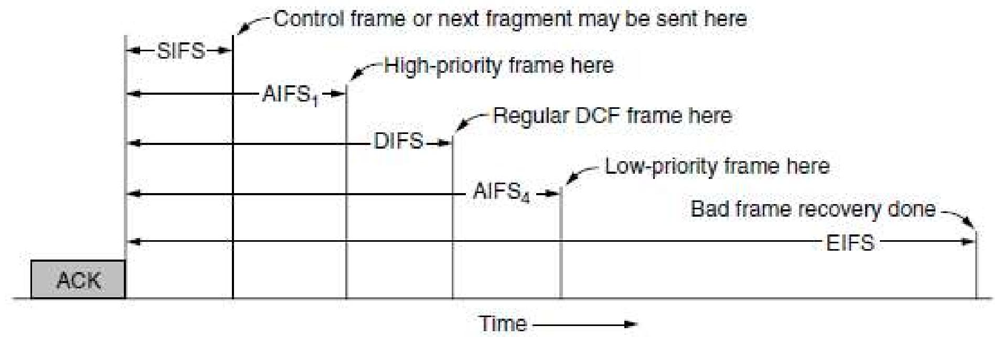

802.11对隐蔽站问题的解决方案:RTS/CTS + NAV

### 802.11 MAC:虚拟监听

* Physical sensing 物理监听
  * Checks the medium to see if there is a valid signal
* Virtual sensing 虚拟监听、
  * 每个站点通过跟踪NAV(Network Allocation Vector)来逻辑上记录信道的使用情况
  * NAV：每个帧都携带一个NAV，用于表示携带本帧所属的通信将占用信道的时间（包含返回ACK的时间）。
    * NAV表示从开始响应到结束响应，越早响应表示离站点越近

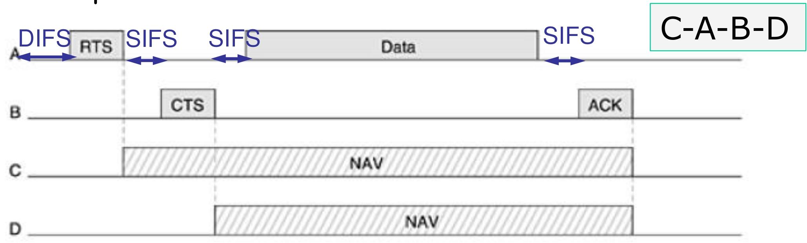

**带NAV的CSMA/CA只能解决隐藏站问题**

### 802.11 MAC: Fragment burst(分段突发)

设1个比特的出错概率为 p

分段突发：

* 将数据分成多个短片段
* 每个片段加上独立的序号和校验字段,使用停止等待协议发送

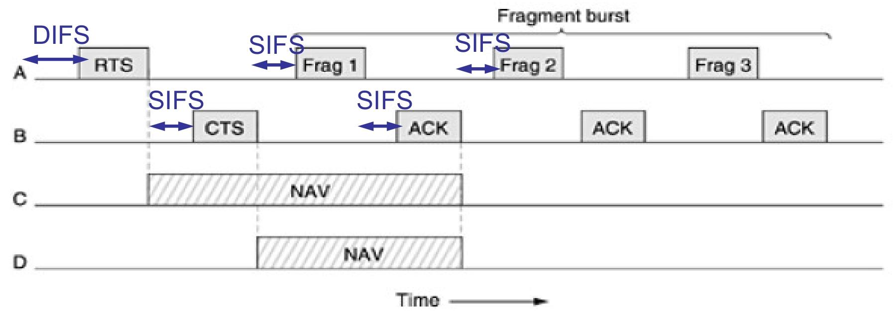

### 802.11 MAC: PCF

点协调功能：集中控制 Point Coordination Function: Centralized control

* 基站通过轮询来控制数据传输
* 基站在小区内周期性地(每秒10-100次)广播信标帧
* 信标帧邀请新站点加入轮询

### QoS 扩展: 传输机会TXOP

不使用TXOP：每个站点占用信道时只发送一个数据帧，每个站点得到相同的平均数据

使用TXOP：每个站获得相同的传输时间，而不是相同数量的帧

### 802.11 帧: 地址

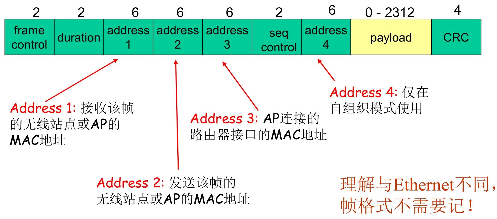

## Bluetooth: IEEE 802.15

# Data Link Layer Switching 数据链路层交换（局域网互联）

## Bridge 网桥

Bridges are used to interconnect LANs at data link layer.

* 网桥是工作在数据链路层的网络互连设备
* 网桥基于帧的目的MAC地址来决定将帧转发到相邻的LAN
* 即插即用

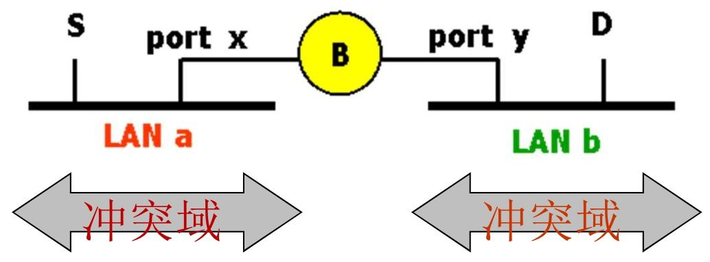

### 从802.11到802.3的LAN网桥

当两个端口中连接的局域网使用不同的协议时，Bridge还负责协议转换：

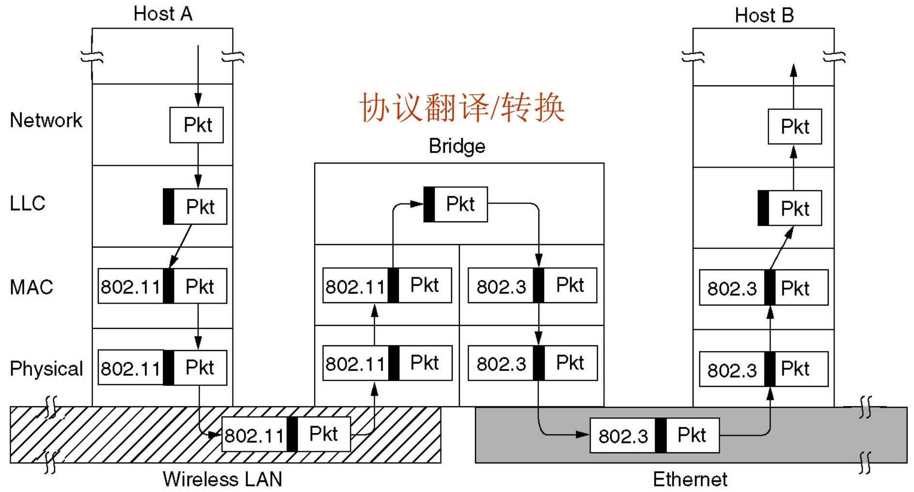

## Learning Bridge 学习网桥

理想的网桥是透明(Transparent):

* 即插即用，无需任何配置
* 网络中的站点无需感知网桥的存在与否

工作模式（混杂模式）：

* Accepting every frame transmitted on all the LANs to which it is attached
* 接受连接到的所有局域网上传输的每一个帧。
* Station stable(MAC地址表)
  * Lists each possible destination and tell which output line (LAN) it belongs on

## Station table 站表?

网桥的三种处理过程：

* forwarding 转发
* filtering 过滤
* flooding 泛洪
* 对于来自端口port-x的输入帧,查找站表

  * 如果目的端口= port-x, 丢弃帧
  * 如果目的端口≠ port-x, 转发帧
  * 如果目的端口未知或者是广播地址, 洪泛转发帧

## LAN Switches LAN交换机

网桥内部维护着一张MAC地址表，记录不同MAC地址对应的端口信息，通过查找这个表，确定将帧转发到那个端口所连接的局域网。

网桥的三种处理过程：

* forwarding 转发
* filtering 过滤
* flooding 泛洪

网桥收到一帧后，根据帧中的目的地址检查转发表，如果查到的输出端口与输入端口一致，则不转发；如果输出端口与输入端口不一致，则转发到相应端口；如果查不到，则洪泛转发到除输入端
18
口之外的所有端口。

### flooding

将收到的数据向其余所有的端口进行发送，除了源端口

两种目的地址的帧需要泛洪：

1. 广播帧：目的地址为FF-FF-FF-FF-FF-FF
2. 未知单播帧：目的地址**不在MAC地址转发表中**的单播数据帧（目的地址未知）

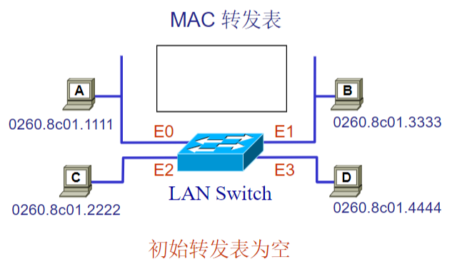

### forwarding

目的局域网与源局域网不同，则将帧转发到对应端口。

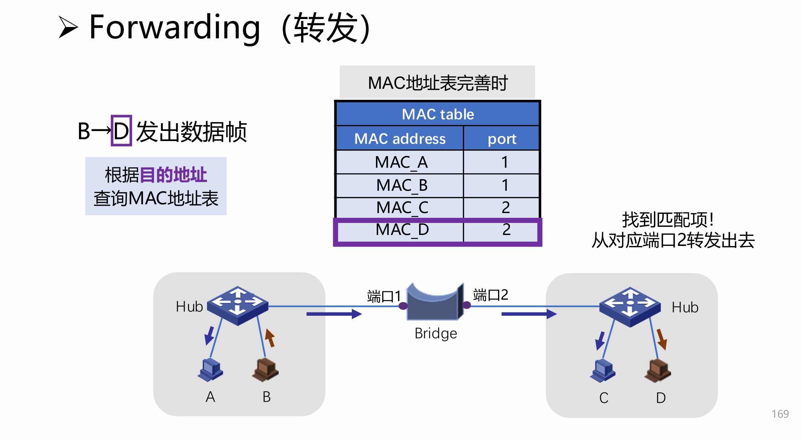

### Filtering

目的局域网和源局域网是一个，则忽略。

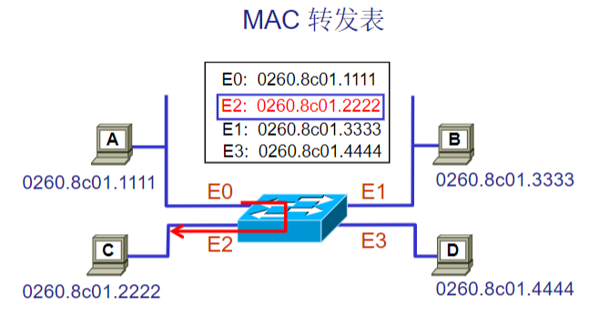

目的地址已知，不进行洪泛转发，而是查表转发到对应端口E2

## Bridge vs Switch

处理方式：

* 网桥：帧处理由软件(software)完成。
* 交换机：地址识别和帧转发由硬件(hardware)实现

数据处理能力：

* 每次只能分析和转发一帧
* 具备多条**并行**数据路径(multiple **parallel** data paths)，可同时处理多个帧

转发操作：

* 网桥：采用存储转发(store-and-forward)
* 交换机：使用直通(cut-through)操作

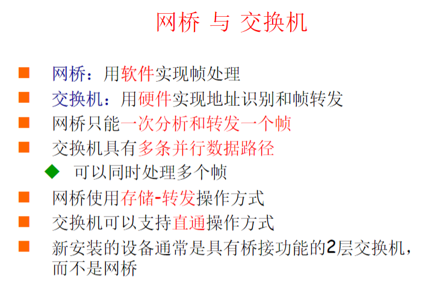

# VLAN:Virtual LAN 虚拟局域网

VLAN 实现了逻辑拓扑和物理拓扑的分离(拓扑解耦)

实现方法：

* Lable each port with a “color” ,and prohibit multicast(多播) and broadcast(广播) across colors
* Prohibit packets from traveling to destinations on different VLANs
* 给每个端口标记一种“颜色”，禁止跨颜色（不同颜色）的多播和广播
* 禁止从源主机向不同VLAN的目的主机传输数据包，至少需要IP选路才行

基于支持VLAN-aware 的网桥或 LAN 交换机实现

## VLAN标识(VLAN ID)

In the switches, configuration tables tell which VLANs are accessible via which ports.在交换机中，配置表（configuration tables）用于指明通过哪些端口（ports）可以访问哪些 VLAN 。

VLAN ID 的选取方法：

* Every port is assigned a VLAN ID
  * 此方法仅在一个端口上的所有机器都属于同一VLAN时有效
* Every MAC address is assigned a VLAN ID
  * 当一个帧到达时，网桥或交换机提取MAC地址并在表中查找它，以查看帧来自哪个VLAN
* Every layer 3 protocol or IP address assigned a VLAN ID

# MAC子层重点内容

## 一、信道分配与多路访问协议

1. **静态和动态信道分配**
   * **静态信道分配** ：预先将信道固定分配给不同用户或设备，资源利用效率低，适用于用户数量和业务量稳定场景。
   * **动态信道分配** ：根据用户需求和信道状态实时分配信道，能提高资源利用率，适用于业务量波动大的场景。
2. **多路访问协议**
   * **CSMA/CD（载波监听多路访问 / 冲突检测）** ：用于以太网，设备发送数据前监听信道，空闲则发送。发送过程中检测冲突，发生冲突时发送干扰信号（jam） ，然后采用二进制指数退避算法重发。
   * **MACA（无线局域网协议）** ：用于无线局域网，通过发送请求发送（RTS）和允许发送（CTS）帧来避免冲突，减少隐藏终端问题。

## 二、IEEE 802 参考模型

1. **IEEE 802 参考模型** ：包括逻辑链路控制（LLC）子层、MAC 子层和物理层。

* **LLC 功能** ：提供逻辑链路控制服务，如差错控制、流量控制等，屏蔽不同 MAC 子层差异。
* **MAC 功能** ：负责介质访问控制，决定设备如何使用物理介质传输数据。
* **物理层功能** ：处理物理介质上的信号传输，包括信号编码、传输速率等。

## 三、以太网相关

1. **以太网线缆** ：常见类型有同轴电缆、双绞线、光纤等，不同线缆传输距离、速率和抗干扰能力不同。
2. **曼彻斯特编码** ：将时钟和数据包含在信号中，每个比特中间跳变，便于接收方提取时钟信号，用于以太网早期。
3. **以太网工作原理** ：基于 CSMA/CD，多台设备共享传输介质，通过竞争方式发送数据。
4. **快速以太网 / 千兆以太网** ：快速以太网速率达 100Mbps，千兆以太网速率为 1000Mbps，提升了以太网传输速率，采用新的编码和传输技术。
5. **交换式局域网** ：以交换机为核心设备，为每个端口提供独立带宽，通过 MAC 地址学习建立端口 - MAC 地址映射表，实现数据帧的精准转发，减少冲突。

## 四、无线局域网与数据链路层交换

1. **无线局域网** ：IEEE 802.11 是无线局域网标准族，定义了无线 MAC 协议和物理层规范，使设备能在无线环境中通信。
2. **数据链路层交换**
   * **学习网桥** ：通过学习网络中 MAC 地址与端口的对应关系，过滤和转发数据帧，减少网络流量。
   * **中继器、集线器、网桥、交换机、路由器、网关**
     * **中继器** ：物理层设备，放大和整形信号，延长传输距离。
     * **集线器** ：物理层设备，将接收到的信号广播到所有端口，共享带宽，易产生冲突。
     * **网桥** ：数据链路层设备，根据 MAC 地址转发数据帧，隔离冲突域。
     * **交换机** ：数据链路层设备，基于 MAC 地址表进行数据帧转发，每个端口独立带宽。
     * **路由器** ：网络层设备，根据 IP 地址选择最佳路径转发数据包，隔离广播域。
     * **网关** ：用于不同网络协议间转换，可在网络层及以上层次工作。
   * **工作层次和冲突域** ：不同设备工作在不同层次，中继器和集线器在物理层，网桥和交换机在数据链路层，路由器在网络层；中继器和集线器连接设备共享冲突域，网桥、交换机可隔离冲突域，路由器隔离广播域。
   * **虚拟局域网（VLAN）** ：通过软件方式将局域网内设备划分成不同逻辑子网，不受物理位置限制，可提高网络安全性和管理效率 ，不同 VLAN 间通信需通过路由器或三层交换机。
