*“语言是思想的影子，而非其本身。”*

# 传输层的功能与服务

## 传输层在协议栈中的位置

整个协议层次结构的核心

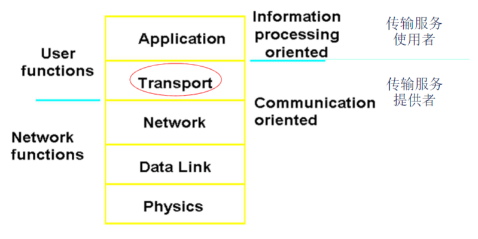

作用范围：

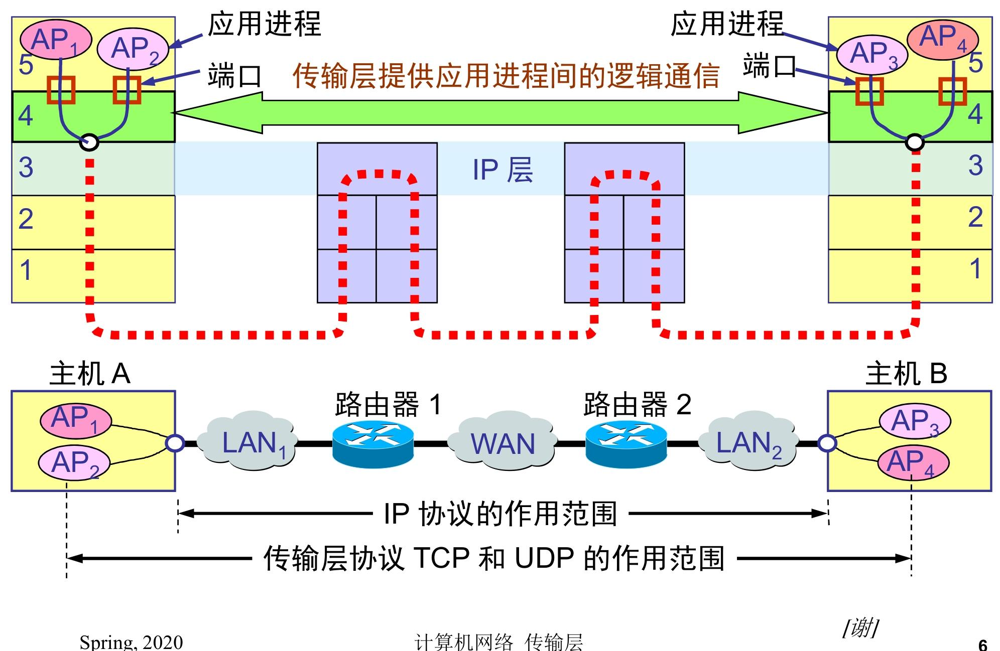

## 传输层提供给上层的服务

* 屏蔽通信子网的多样性,为上层提供公共接口
* 提供共享同一个网络链路的多个服务访问点(SAP)
* 提供两类服务: 无连接的传输服务, 面向连接的传输服务

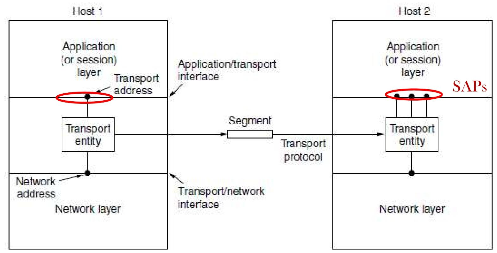

# 客户端-服务器模式(CS)

服务器：

* 管理资源并为客户端提供服务
* 最先开始执行
* 在预定位置被动等待客户端的请求

客户端：

* 稍后开始执行
* 主动发起与服务器的联系

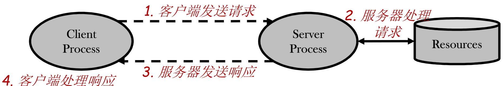

# 传输服务原语

* 提供给应用进程的接口(应用编程接口API)
* 一个简单的面向连接的服务示例

| Primitive  | Packet sent       | Meaning                                    |
| ---------- | ----------------- | ------------------------------------------ |
| LISTEN     | (none)            | Block until some process tries to connect  |
| CONNECT    | CONNECTION REQ.   | Actively attempt to establish a connection |
| SEND       | DATA              | Send information                           |
| RECEIVE    | (none)            | Block until a DATA packet arrives          |
| DISCONNECT | DISCONNECTION REQ | Request a release of the connection        |

## 套接字(Socket)

因特网中广泛使用的API

| Primitive | Meaning                                                     |
| --------- | ----------------------------------------------------------- |
| SOCKET    | Create a new communication endpoint                         |
| BIND      | Associate a local address with a socket                     |
| LISTEN    | Announce willingness to accept connections; give queue size |
| ACCEPT    | Passively establish an incoming connection                  |
| CONNECT   | Actively attempt to establish a connection                  |
| SEND      | Send some data over the connection                          |
| RECEIVE   | Receive some data from the connection                       |
| CLOSE     | Release the connection                                      |

### 基于TCP的Socket程序流程

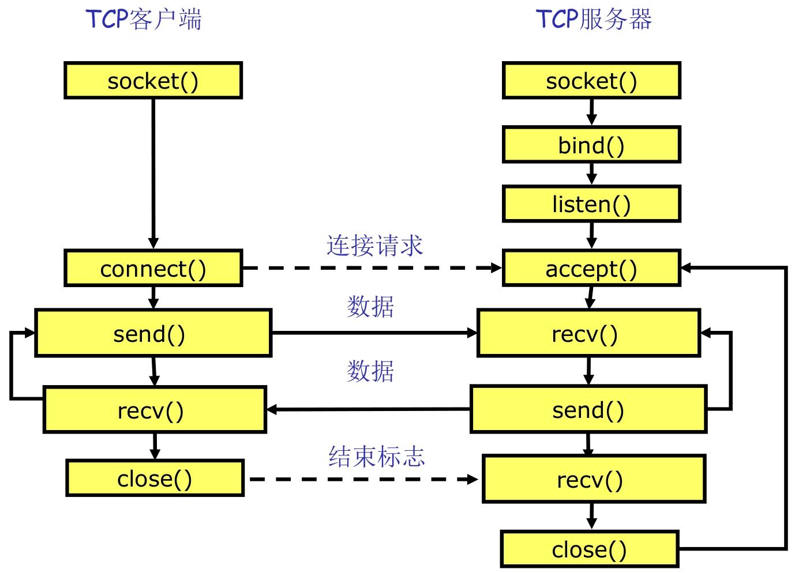

# 传输协议要素

## 传输协议与数据链路协议

* 两种协议都要处理差错控制?排序?流量控制等问题(使 用ARQ)
* 点-点交付（数据链路层）与进程-进程交付（传输层）
* 两种协议的运行环境不同

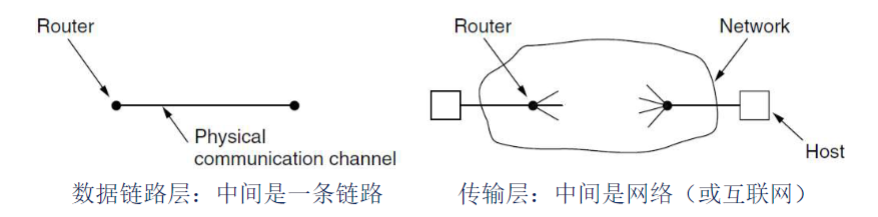

## 寻址

* 是应用进程的服务访问点(SAP)
* 决定哪个应用进程获得哪个消息

### IP地址与端口号

IP 地址和端口号相互配合，IP 地址先定位到目的主机，然后端口号在主机内进一步定位到具体的应用进程。

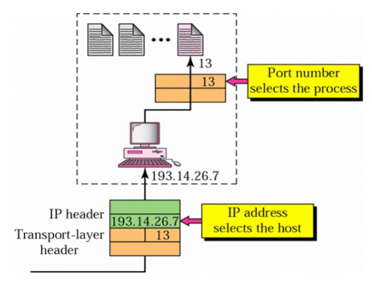

## Multiplexing(复用)

* 在发送端，传输层完成复用：
  * 从不同的应用进程接收数据报文，以端口号区分
* 在接收端，完成解复用：
  * 传输层根据端口号，将报文交给对应的进程

### 逆向复用与 SCTP

逆向复用主要应用于流控制传输协议（SCTP） 。SCTP 是一种面向连接的传输层协议，相较于常见的 TCP 协议，它在多归属（一个端点可以有多个网络接口）等方面有独特优势。

### TCP连接与SCTP联合

1. **TCP（传输控制协议）**
   TCP 是一种面向连接、可靠的传输层协议。在图中上方的连接模式里，客户端主机（Client host）和服务器主机（Server host）通过 TCP 建立连接。它通过三次握手建立连接，四次挥手断开连接，传输过程中采用确认、重传、流量控制和拥塞控制等机制，保证数据按序、无差错地传输，适用于对数据准确性要求高的场景，如文件传输、网页浏览等。
2. **SCTP（流控制传输协议）**
   SCTP 也是传输层协议，具备面向连接的特性，同时支持多归属（一个端点可关联多个网络地址）和多流（一个连接可同时传输多个数据流）功能。图中下方展示了 SCTP 连接，客户端和服务器端都有多个接口（如通过以太网 Ethernet 和 802.11 无线方式），SCTP 能利用这些接口实现更灵活可靠的传输，适用于电信信令传输等对可靠性和灵活性要求高的场景。

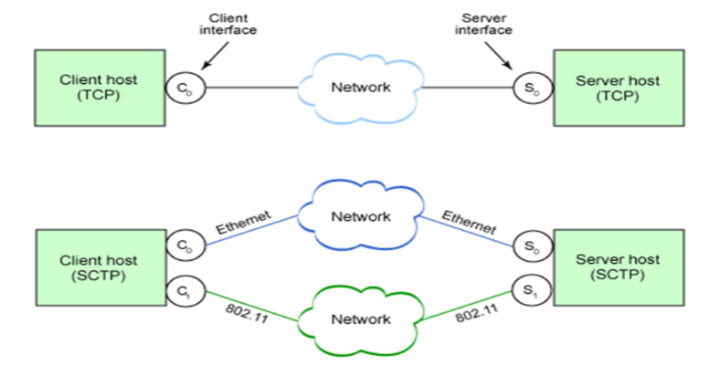

# 连接问题

## 被延迟的重复连接请求(CR)

连接请求(CR)被网络延迟并重传, 导致接收方主机2将重复的CR当做新的CR进行处理

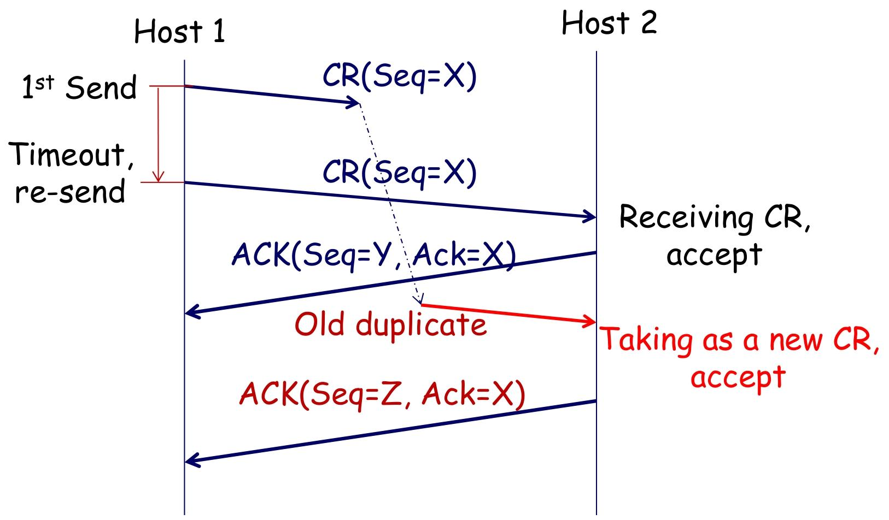

## 解决方案: 三次握手

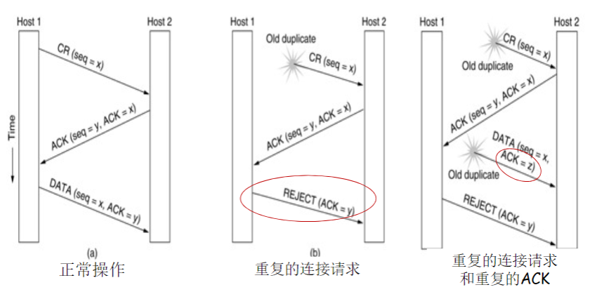

# 释放问题

## 对称释放

非对称释放:类似电话系统,突然释放可能导致数据丢失

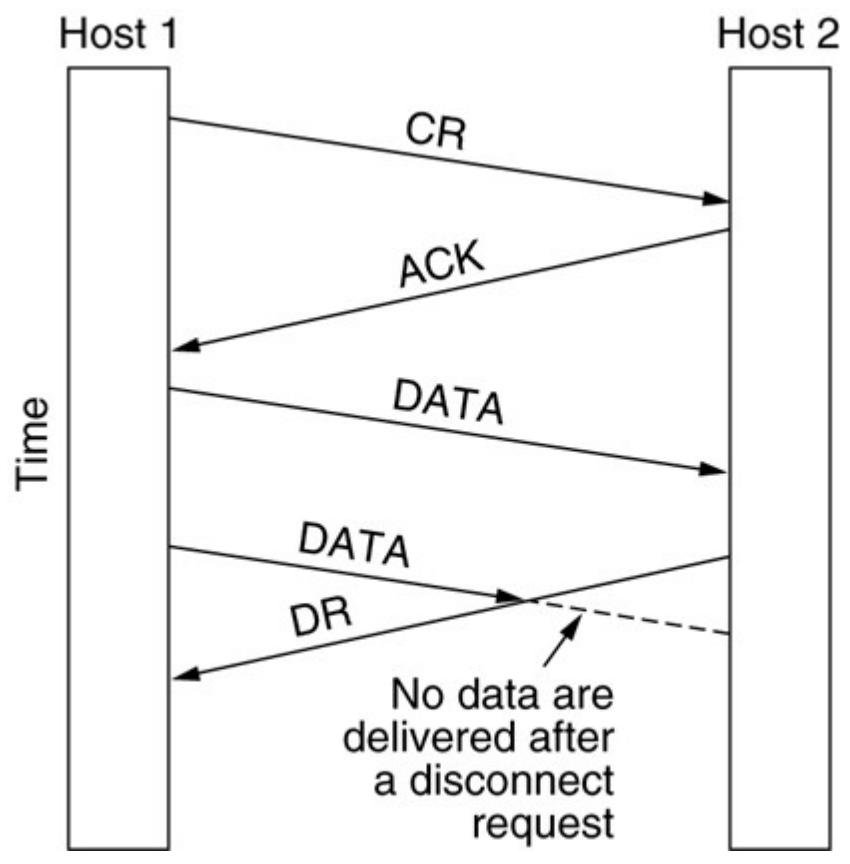

对称释放:每个方向分别释放连接,独立于另一个方向

## 三次握手

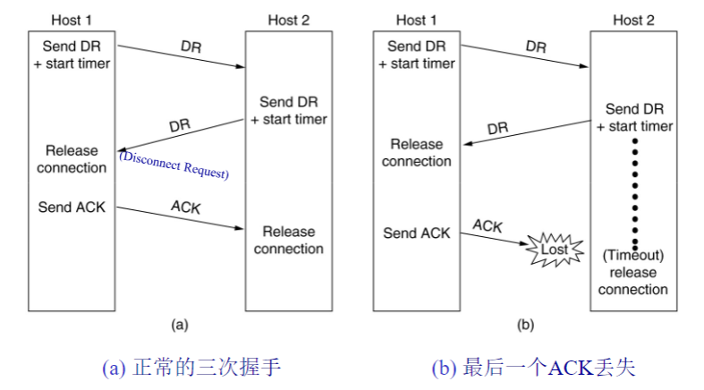

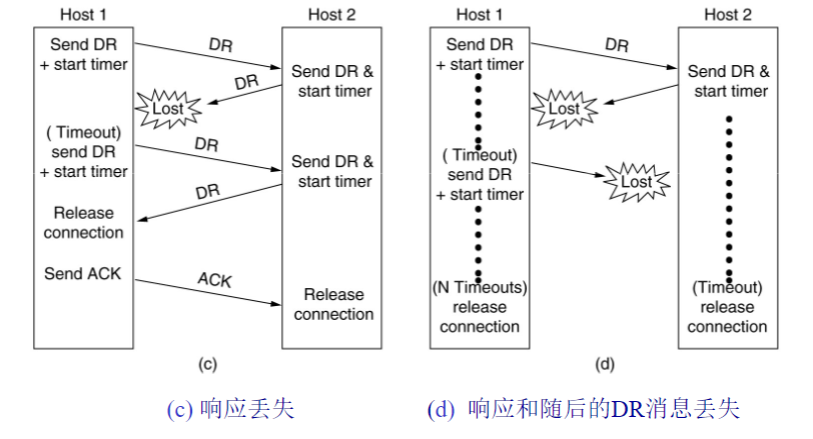

只要DR能够成功被接受一次就可以启用计时器释放连接

### Half-open Connections （半开连接）

半开连接：

初始的断开连接请求DR以及后续的N次重传全部丢失了，发送方会放弃并释放连接。然而，另一方对这些断开尝试一无所知，连接的一端已经关闭，而另一端仍然认为连接是打开的，这就形成了半开连接。

终止半开连接：

* If no TPDUs have arrived for a certain number of sconds, the connection is then automatically disconnected.
* Dummy TPDU: 只是为了防止另一端断开连接，发送一些探测报文，以确认另一端仍然存活。如果一段时间没有相应，则认为连接中断，进行清理。

# 差错控制

## 自动请求重传(ARQ)

* 报文段携带检错码(如**校验和**)
  * 报文段携带用于标识本段的序号，接收方成功接收后返回确认
  * 发送方如果没有收到确认，将重发段
* 滑动窗口协议结合了上述特性，并支持双向数据传输

### 端到端/进程-进程

差错控制作用于端到端（即从发送端到接收端）或进程 - 进程（不同应用进程间）层面。确保数据在传输过程中，无论跨越网络的不同节点，还是在同一主机的不同进程间交互，都能准确无误地到达目标位置，保障通信可靠性。

## 差错控制: 传输层与数据链路层

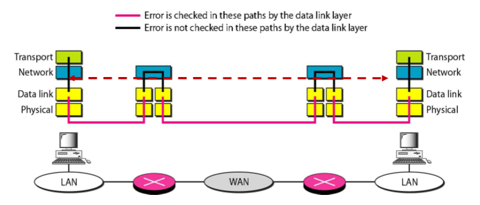

* 功能上的差异

# 缓存的权衡

发送方缓存还是接收方缓存：连接之上的业务量的类型

* 低带宽：发送方
* 高带宽：接收方

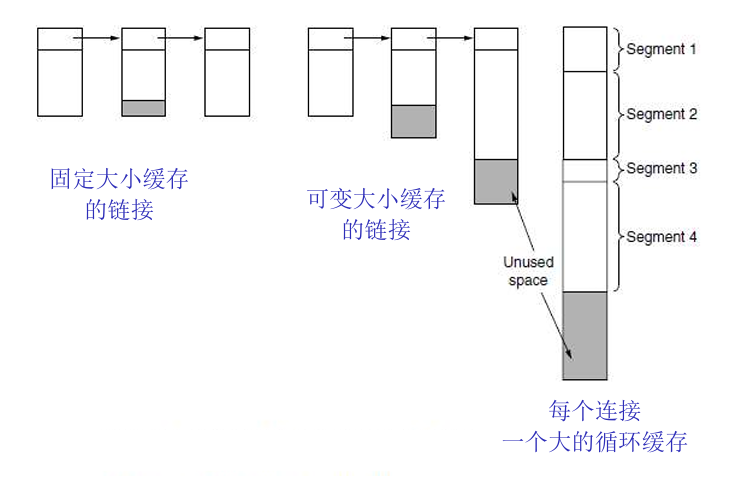

# 拥塞

传输实体太快地向网络中发送了太多数据包，网络就会变得拥塞

效率与功率：

$$
power=\frac{load}{delay}
$$

达到最大功率时的负载即是传输实体发送到网络的高效负载

## 拥塞控制

控制拥塞、将负载限制在容量之下的机制和技术

因特网的拥塞控制很大程度上依赖传输层协议TCP实现

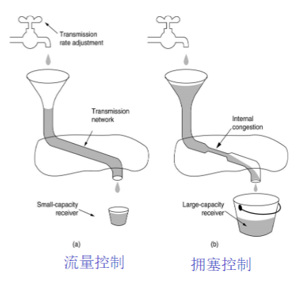

目标：

* 避免拥塞
* 找到一种好的带宽分配方案,尽量利用全部可用带宽(高效性)
* 公平对待竞争的传输实体(公平性)
* 能快速跟踪流量需求的变化(收敛性)

### 最大最小公平性

* 使得资源分配向量的最小分量的值最大
* 防止任何网络流被‘饿死’，同时在一定程度上尽可能增加每个流的速率。

**原则阐述** ：在一条信道上，首先要满足各个网络流的最小带宽需求，然后在此基础上，尽量让各网络流均匀分配剩余带宽。如果给某个参与者增加带宽，会使其他拥有相同或更少带宽的参与者带宽下降，此时就符合最大最小公平性原则。

#### **收敛性**

好的拥塞控制算法应该快速收敛到理想的操作点(公平 且高效的带宽分配),并且应该随着时间的变化能够跟 踪该点. (尽快达到理想分配)

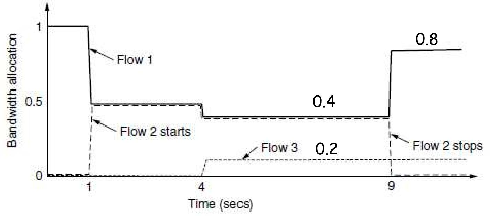

在任何时候,总分配带宽大约是100%,因此网络 被充分利用,竞争流得到平等的对待

### Internet的拥塞控制

1. 发现拥塞:路由器根据队列长度或者线路利用率判断
2. 将拥塞情况通知源主机

   1. 显式拥塞通知:TCP with ECN
   2. 或隐式拥塞通知:源主机(TCP)自己根据丢包情况判断
3. 源主机采取措施(TCP)

   1. 在无拥塞时,增加发送速率;
   2. 在出现拥塞时,降低发送速率

拥塞控制协议的信号：

| Protocol     | Signal                         | Explicit? | Precise? |
| ------------ | ------------------------------ | --------- | -------- |
| XCP          | Rate to use                    | Yes       | Yes      |
| TCP with ECN | Congestion warning             | Yes       | No.      |
| FAST TCP     | End-to-end delay               | $ No $  | Yes      |
| Compound TCP | Packet loss & end-to-end delay | $ No $  | Yes      |
| CUBIC TCP    | Packet loss                    | $ No $  | $ No $ |
| TCP          | Packet loss                    | No.       | No.      |

## 控制法则: AIMD(加法增乘法减)

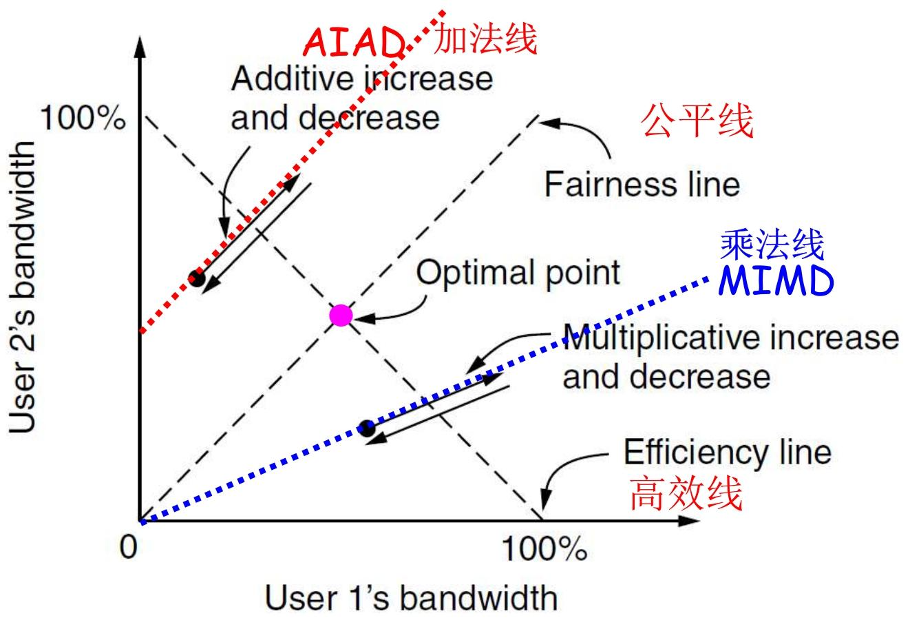

最优点：高效线和公平线的交点

### 控制法则:加法增乘法减(AIMD)

加法增乘法减(AIMD): AIMD可以收敛于最优点, 兼具高效性､公平性和收敛性

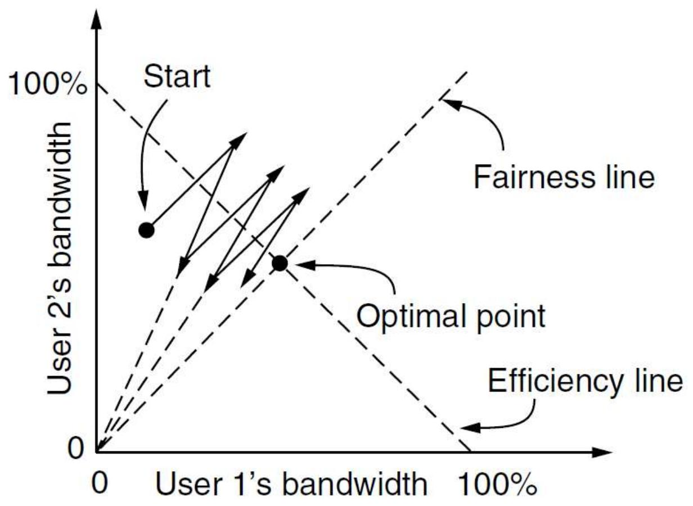

稳定性观点：驱使网络拥塞很容易但是从中恢复却很难

* 带宽递增策略应该温和
* 带宽递减策略应该激进

实际中通常使用的策略是调整滑动窗口的大小, 而不是直接调整速率

### TCP友好的拥塞控制

新协议必须能与TCP进行公平的竞争

TCP和非TCP传输协议可以自由地混合,而没 有任何不良影响

# 因特网的传输层协议

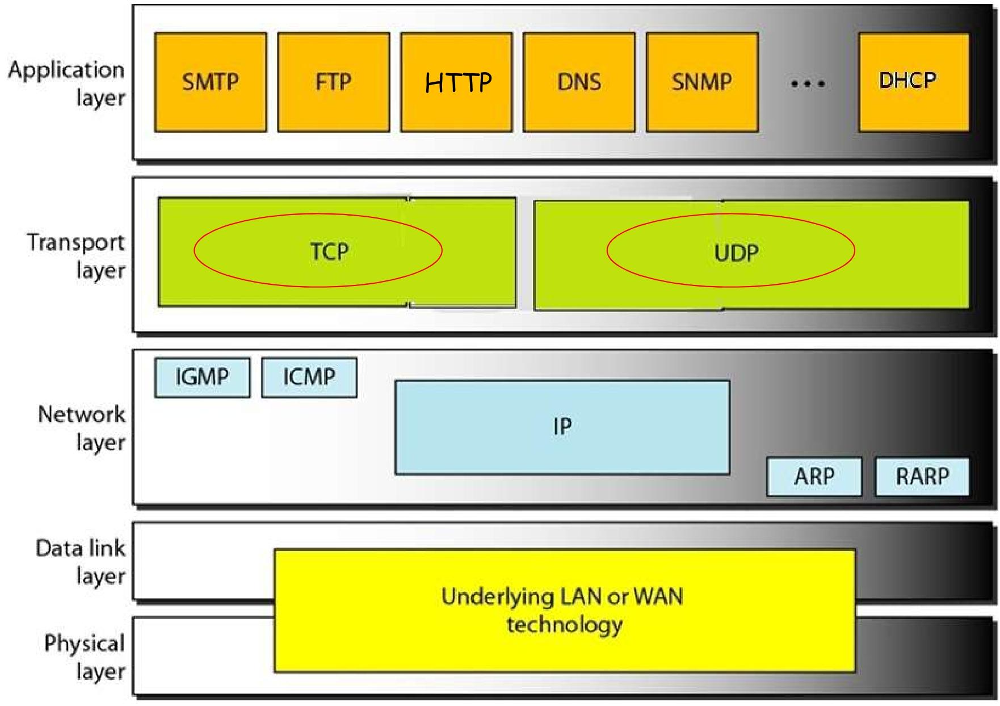

# UDP:用户数据报协议

基于UDP的应用

* DNS域名解析(Domain Name System,53)
* DHCP 动态主机配置(Dynamic Host Configuration Protocol, 67/68)
* RIP路由信息协议(Routing Information Protocol) (要求知道上述三种协议的传输层采用UDP协议)
* RTP (Real-time Transport Protocol)
* P2P (Peer-to-Peer, DHT, ‘Kademlia’)

## UDP数据报格式

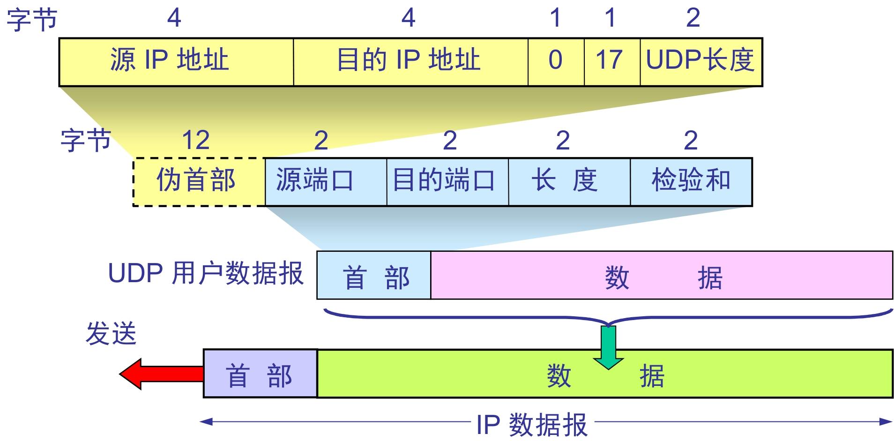

UDP在发送方与接收方之间保留消息边界

## 校验和的计算

伪包头（计算校验和）

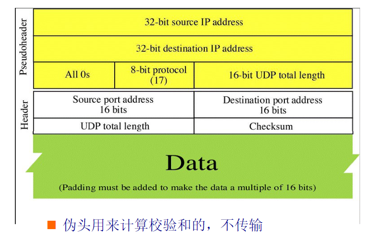

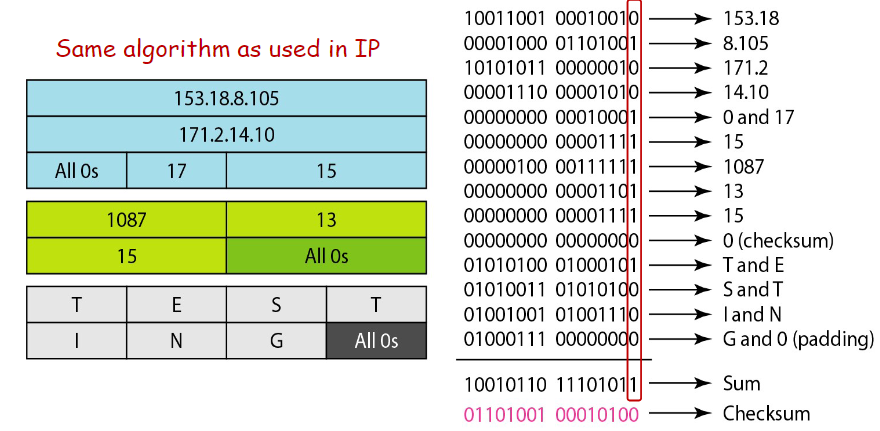

模2加法

当用户数据报传递给IP时,伪报头和填充被删除

# TCP: 传输控制协议

## TCP的特征

传输控制协议TCP是为了在不可靠的互联网络上提供**面向连接的､可靠的､端到端服务**而设计的协议

### 可靠交付(ARQ)

* 以确认来表示数据已交付
* 使用检查和来发现数据被破坏
* 超时后重传出错的数据
* 用序号来检测数据的丢失或乱序
* 基于窗口的流量控制防止淹没接收方

使用拥塞控制来共享网络容量

面向字节流:报文长度任意,没有边界

**不能保留消息边界（接收方无法区分发送方发送的每一条“消息”是如何分隔的）	**

### TCP不能保证上层应用消息的边界

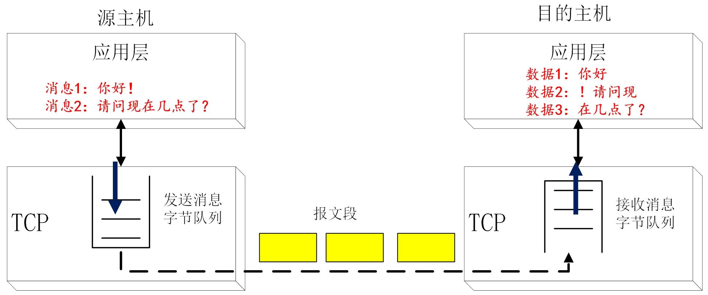

* TCP报文段内携带多少字节数据由TCP协议决定,与上层消息长度无关
* TCP仅保证交给上层的数据正确､按序

### TCP报文段

* TCP 段=(20或更多字节)TCP头+(n字节)数据
* 没有任何数据的段是合法的,通常用于ACK和控制消息
* 最大段长度MSS (Maximum Segment Size):段中的最 大数据长度
  * 受IP数据报长度的限制(65515字节)
  * 受各数据链路的最大传输单元MTU的限制(MTU通常是1500字节,以太网的负载长度), 因此路由器可以TCP段进行分片
* 段序号和确认号均面向字节
  * TCP段中的序号是该段第一个字节的序号
  * ACK段中的确认序号是下一个期待的字节的序号
* 滑动窗口大小动态可变

## TCP段格式

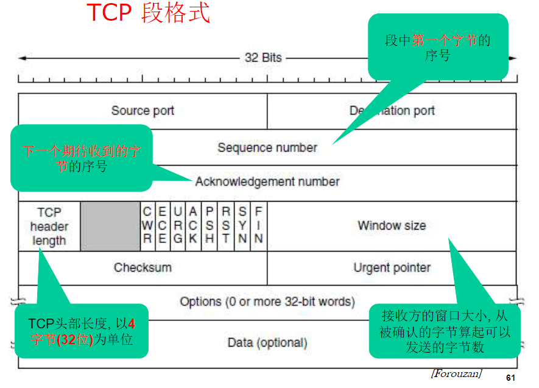

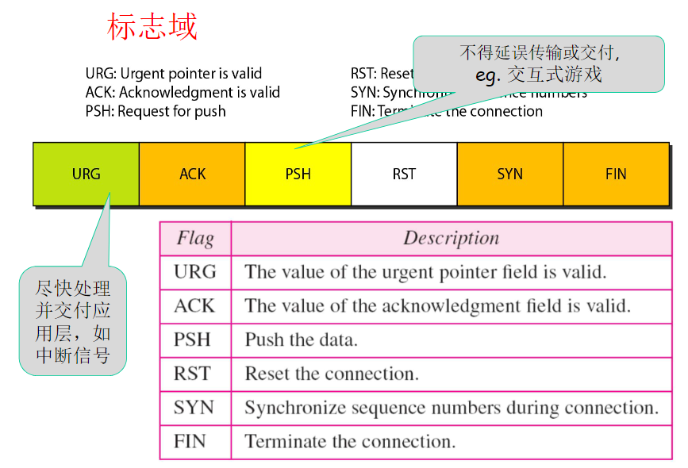

### ECN 和ECE/CWR

ECN 是一种网络拥塞控制机制，它允许路由器在检测到拥塞时，不丢弃数据包，而是在 **IP头部** 中设置一个标志位，通知接收端网络已拥塞。

ECE（ECN Echo，位于TCP头部）

* **接收端使用** ：当接收到 IP 数据包的 ECN 值为 `11`（CE，即路由器检测到拥塞），接收端将 TCP 头部中的 ECE 置为 1，告诉发送端“我收到了一个拥塞提示”。

CWR（Congestion Window Reduced，位于TCP头部）

* **发送端使用** ：发送端在处理了 ECE（即降低了拥塞窗口）后，会在接下来发送的 TCP 包中将 CWR 置为 1，告诉接收端“我已经响应了拥塞通知，调整了发送速率”。

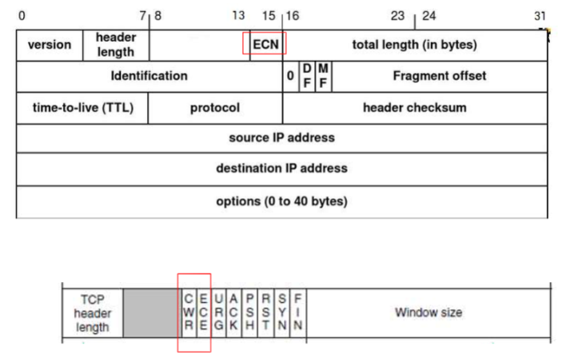

### TCP校验和

* 提供额外的可靠性
* 校验范围:TCP段头､数据和伪报头三部分
* 伪报头:帮助检测错误的数据包
* TCP中的校验和是必须支持的

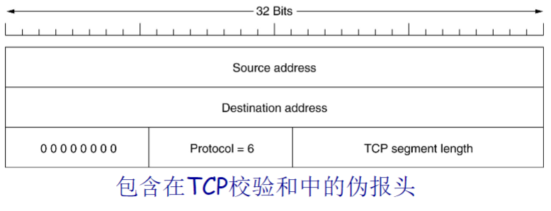

### 可选项

* MSS(最大段大小)
* Window scal(窗口尺度)
* Timestamp(时间戳)
* SACK (选择确认)

### TCP选项: SACK

TCP 中的 **SACK（Selective Acknowledgment，选择性确认）** 是一种增强的确认机制，用于提高在丢包或乱序环境下的传输效率。相比传统的 ACK，它能更有效地告知发送端哪些数据已经收到，哪些数据仍需重传。

**SACK** 允许接收方明确指出 **已经收到的“片段”范围** ，而不是只说“我收到了前面的”。

* 是对确认序号的补充,可用在一个数据包已经丢失但后续 (或重复的)数据到达的情况
* 使用SACK,发送方能够明确地知道接收端收到了哪些数 据,并据此确定应该重传什么数据
* SACK内容由RFC2108和RFC 2883定义

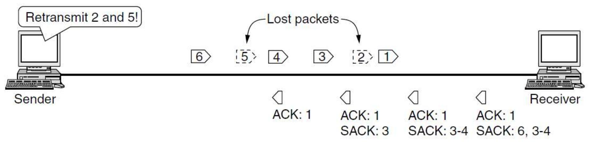

## TCP连接建立

* 客户端
  * 执行CONNECT原语,说明其希望连接的IP地址和端口 ､愿意接收的最大TCP段长以及其他一些可选参数,
  * TCP实体发送一个SYN=1和ACK=0的TCP段,等待服务 器端的响应
* 服务器端
  * 当客户端的SYN段到达后, TCP实体检查是否有一个进程 已经在目标端口字段指定的端口上执行了LISTEN
    * 如果没有, 则发送一个设置了RST \((RST=1)\) )的应答 报文,拒绝该连接
    * 如果某个进程正在该端口监听, 则将入境的TCP段交给该进程处理, ......

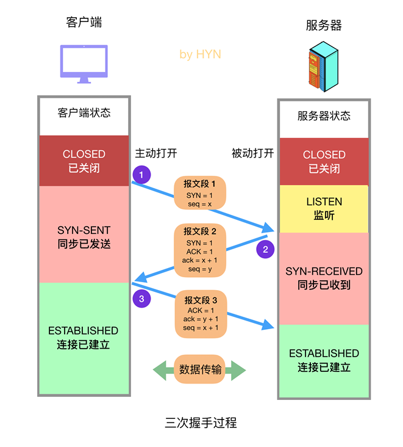

这是 TCP 建立连接的特殊情况，有时会出现两台机器同时执行主动打开的情况，不过概率非常小，这种情况大家仅作了解即可。在这种情况下就无所谓发送方和接收方了，双放都可以称为客户端和服务器，同时打开的过程如下：

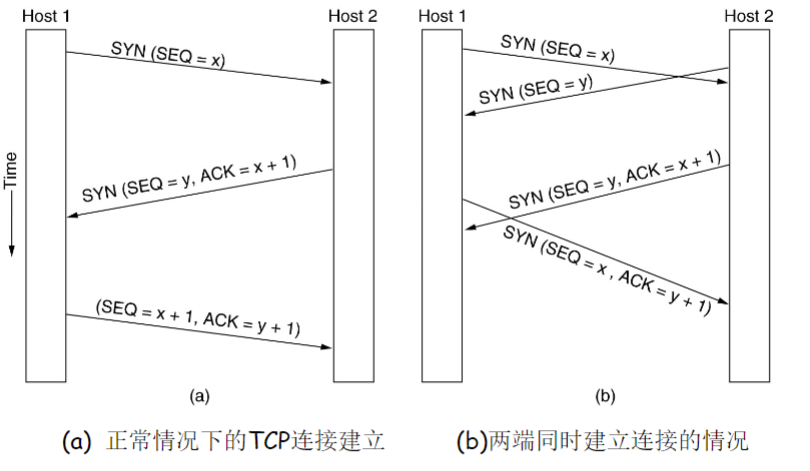

如图所示，双方在同一时刻发送 SYN 报文段，并进入 SYN-SENT 状态，在收到 SYN 后，状态变为 SYN-RECEIVED，同时它们都再发送一个 SYN + ACK 的报文段，状态都变为 ESTABLISHED，连接成功建立。在此过程中双方一共交换了4个报文段，比三次握手多一个。

### 初始序号

采用了一个基于时钟的方案, 时钟每4 µsec滴答一次

### 安全性

三次握手方式存在漏洞,当监听进程接受一个连接请 求,并以SYN段作为响应时,它必须记住该SYN段的 序号--- SYN洪泛攻击

SYN Cookie—一种抗SYN洪泛攻击的方法

## TCP数据传输

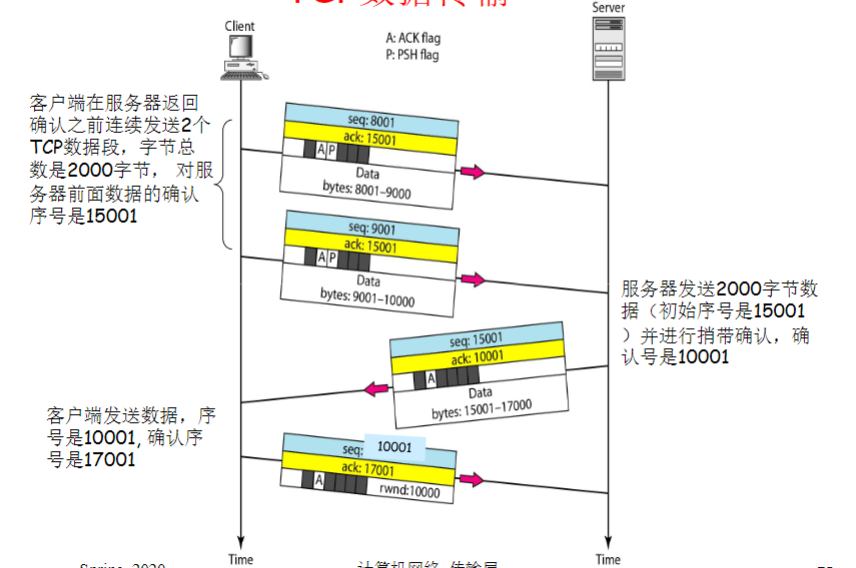

## TCP释放 4步连接释放:半关闭连接

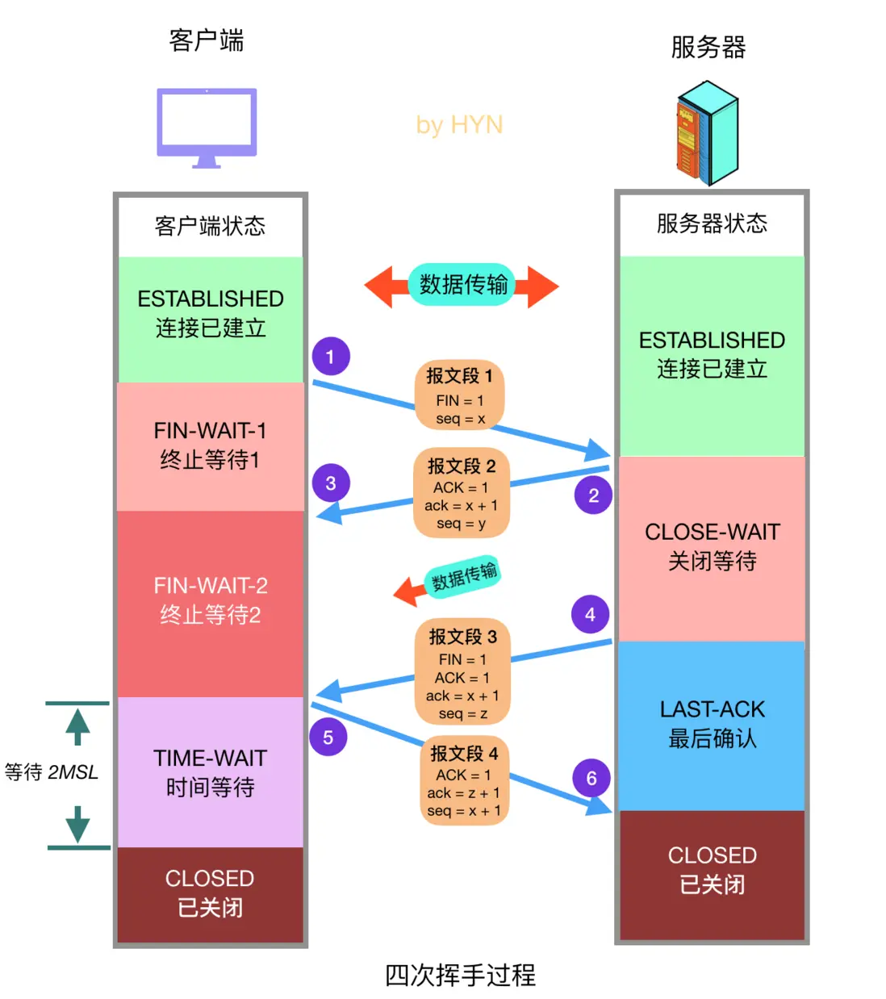

## TCP 流量控制

### 窗口管理

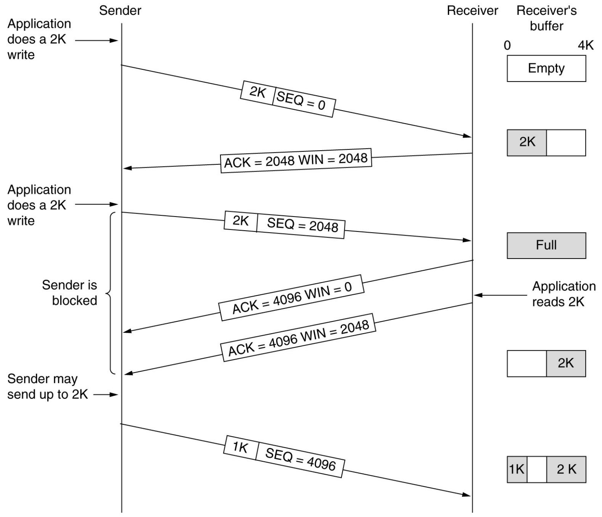

将正确接收段的确认和接收端缓冲区的分配分离开来

* TCP的滑动窗口是**面向字节**的, 而数据链路层的滑动窗口 是面向帧的
* TCP的滑动窗口大小是变化的(确认号+ 窗口尺寸), 但 是数据链路层的窗口大小是固定的

具体一点：

* TCP 报文头中包含一个 16 位字段：`Window Size`
* 它表示接收方还可接受的数据字节数（即通告窗口）
* 如果为 0，则发送方必须停止发送（等待窗口更新）

#### 问题与特征

* 发送端不一定接收到应用进程传递过来的数据就马上 将数据传送出去.
* 窗口大小动态变化
  * 发送方窗口大小完全由接收方窗口值控制. 但由于网络可能 拥塞,因此实际值可能更小
* 接收方可以在其愿意的时候发送确认消息

## Nagle 算法（发送）

问题:小数据包问题(发送小包网络效率低)

* 开销: TCP head + IP head=20+20 bytes
* 在TELNET使用时,1字节的数据需要40字节的开销

> Nagle 算法的核心思想是：
>
> **“一个未被确认的小包在路上时，不再发送新的小包。”**

也就是说，TCP 不会立即发送新数据，而是将多个小数据块 **缓存起来合并后再一起发送** 。

 **启用 Nagle 算法时** ，TCP 发送数据遵循：

> 如果已经发送一个小数据包且还未收到 ACK，**就暂缓发送后续数据，直到收到 ACK 或累积的数据达到 MSS（最大报文段）大小。**

如果缓冲区中有数据未被确认（outstanding unACKed data）：

* **不立即发送新数据**
* 除非当前缓冲数据 ≥ MSS（最大报文段）

## Clark 算法（接收）

* 接收方应用程序**读取数据不及时或太慢**
* 接收缓存一点一点变空，TCP 就**每次只通告一个非常小的窗口**
* 发送方收到小窗口更新后，只能发一点点数据
* 导致网络中充斥着**极小的 TCP 报文段**

> 当 TCP 接收方的窗口非常小（即使有空余缓冲），不要立即通告这个窗口，而是等到窗口足够大时再通告。

算法：

当接收方需要通告窗口大小更新时，满足以下任一条件才通告：

1. 当前可用窗口 **≥ 一个最大报文段大小（MSS）**
2. 当前可用窗口 **≥ 接收缓冲区总大小的一半**

否则：**不要通告窗口更新，让发送方等待**

## TCP差错控制

### ARQ（自动重传请求，Automatic Repeat reQuest）

 **ARQ 是一种基于“确认 + 超时重传”的错误恢复机制** 。它不尝试直接纠正错误，而是通过：

* 检测错误（如校验失败或超时未确认）
* 重新请求发送错误数据（自动重传）

这就是所谓的 **自动重传请求（ARQ）协议** 。

#### ✅ 1. **确认（ACK）**

* 接收方收到正确的数据段后，发送 ACK 给发送方。
* ACK 通知发送方：“你发送的数据我已收到，可以继续。”

#### ❌ 2. **超时重传**

* 如果发送方在一定时间内没收到 ACK，它认为数据丢失或损坏。
* 然后 **自动重传** 数据段。

#### ✅ 3. **重复 ACK（Fast Retransmit）**

* 如果接收方多次收到相同的段（说明某个中间段丢了），会连续发送重复 ACK。
* 发送方根据多个重复 ACK 快速重传丢失段（不必等待超时）。

### 快速重传

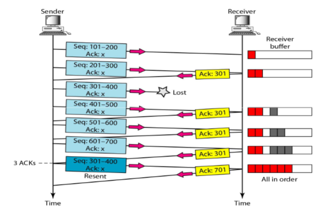

快速重传: 当收到三个重复ACK(相同确认号)时,发送方立即重传丢失的段 而不需要等待重传计时器RTO超时

## TCP定时器管理

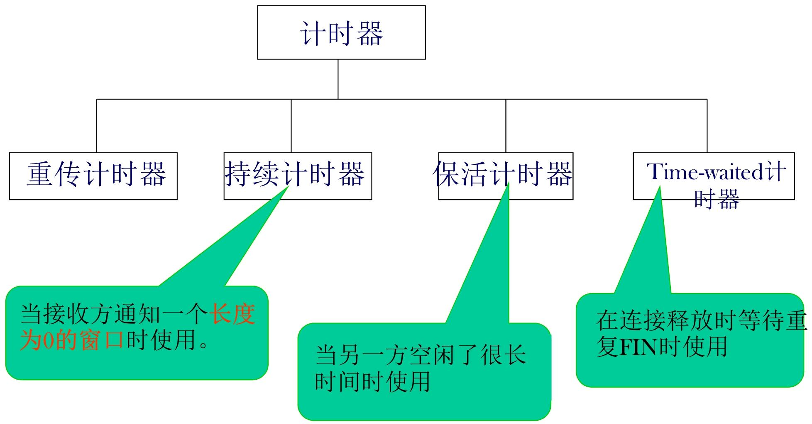

往返时间的概率密度(RTT)

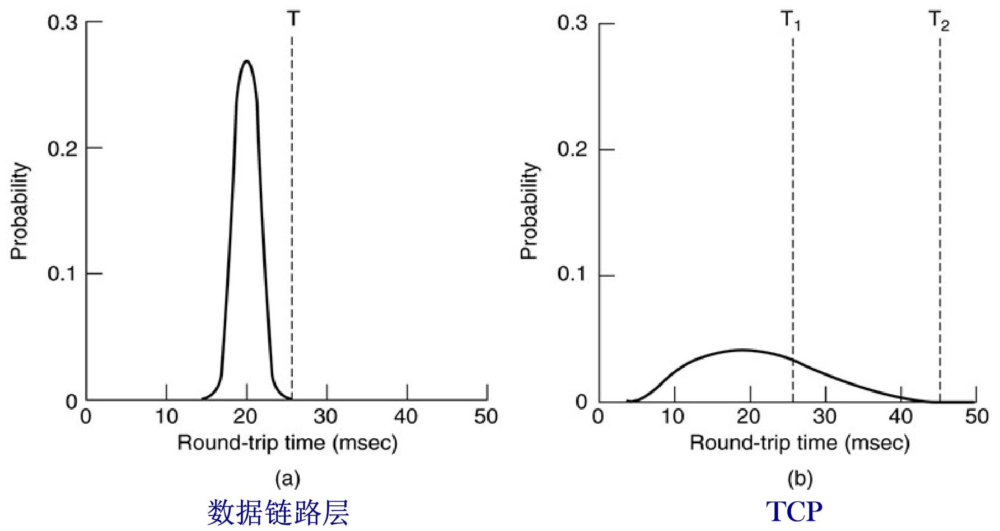

解决方案: making timeout proportional to RTT

$$
新RTT =a \times( IHRTT)+(1-a) \times(新样值 )
$$

### 重传计时器: RTO

RTO对RTT-variance (RTTVAR)和SRTT敏感

$$
R T T V A R =\beta × R T T V A R+(1-\beta) × | S R T T-S a m p l e|
$$

$$
R T O=S R T T+4 × R T T V A R
$$

### TCP 计时器

#### 持续计时器

* 防止0窗口死锁
* 当定时器超时时,发送方向接收方发送一个探测消息, 接收方对探测消息的响应中会给出窗口大小｡

#### 保活计时器

* 防止半开的连接
* 当连接长时间处于空闲状态时,keepalive计时器可能会 超时,从而促使一端检查另一端是否仍然还在｡

#### TIMED WAIT状态时使用的计时器

该定时器的超时值为两倍于数据包的最大生存期,主要 用来确保当连接关闭后,由它创建的所有数据包已经完 全消失

## TCP 拥塞控制

* 当队列长度增大到很大时,路由器(工作在网络层) 检测到拥塞,并试图通过丢弃数据包来管理拥塞
* 源主机(传输层, TCP)接收到网络层反馈来的拥塞信 息,通过减慢其发送到网络的速率来缓解拥塞.

### 拥塞窗口

“拥塞窗口”（ **Congestion Window** ，简称  **cwnd** ）是TCP（传输控制协议）中的一个核心概念，用于控制网络中数据包的发送速率，以避免引起 **网络拥塞** 。

> 表示网络能够接收多少字节

### 拥塞控制方式

* 如何检测拥塞
  * 丢包是拥塞的最好标志
  * 如何检测分组丢失? ACKs
    * TCP使用ACK来告知数据的接收
    * ACK指示接收到的最后一个连续字节
  * 超时后没有ACK意味着丢包
* 如何调整发送速率
  * 收到ACK后,增加速率
  * 当检测到丢包时,降低速率

### Van Jacobson 拥塞控制算法

近似一个AIMD拥塞窗口

* TCP维护一个拥塞窗口(cwnd)和一个流量控制窗口(rwnd), 两者都是动态变化的,发送方窗口是其中较小的一个
* 分组丢失是网络拥塞的信号
  * 仅适用于传输误码率相对很低的场合
  * 这也说明了为什么802.11有自己的重传机制
* 需要一个良好的重传定时器来准确地检测丢包信号
  * 计时器含RTT的均值和方差的估算方法

### ACK时钟

ACK 时钟的本质是：

> **每当接收方返回一个 ACK，发送方就以此为“时钟节拍”发出新的数据段。**

这意味着：

* 发送方的数据发送节奏  **受接收方 ACK 到达的节奏控制** 。
* TCP 不需要人为地定时发送数据，而是“ **跟着 ACK 的节奏走** ”。

如果TCP以ACK返回的速度向网络中注入包,则包将以慢速链路允许的速度发送,不会排队并阻塞路径上的任何路由器

通过使用ACK时钟,TCP平滑了流量,避免了路由器上不必要的队列

### 慢启动: initial rate is slow (cwnd=1)

连接建立后，TCP 最开始只能发送  **一个数据包** ，必须等这个包被 ACK 之后，才能发送更多。

#### 指数递增

在慢启动算法中,拥塞窗口的大小呈指数递增,直到达到阈值

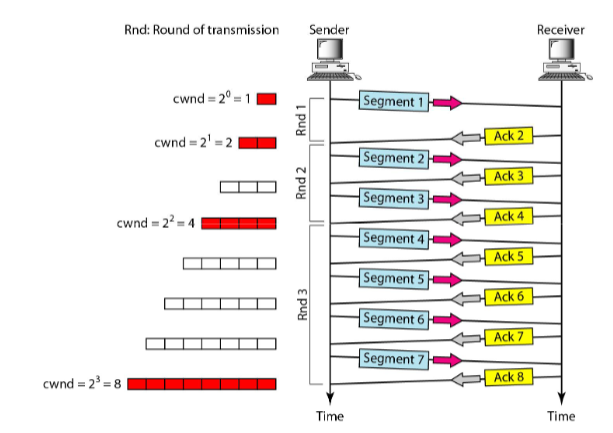

* 启动速率很低,TCP连接建立时,拥塞窗口= 1 MSS
* 按指数级增加发送速率(每一轮发送结束,拥塞窗口加倍)
* 直至拥塞窗口达到阈值或发现数据丢失

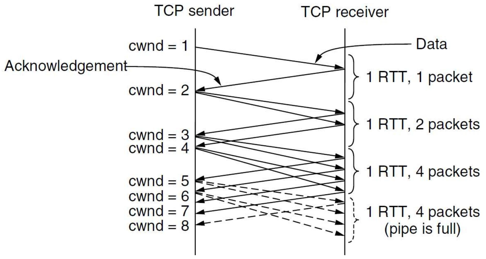

### AIMD 拥塞避免: 加法递增

当 `cwnd` 达到某个阈值（ **慢启动门限 `ssthresh`** ）时，TCP 从“慢启动”进入“拥塞避免”，此时：

拥塞窗口的大小加法递增,直到检测到拥塞为止.

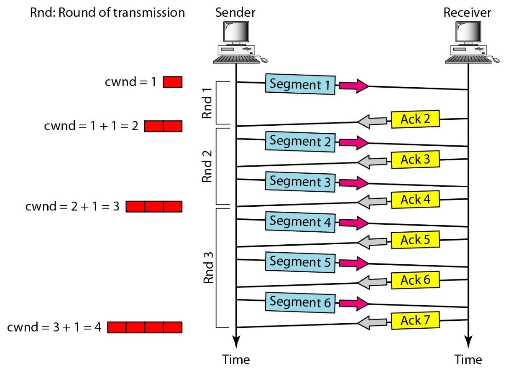

* 拥塞窗口达到阈值时,降低发送速度的增长,按线性增长 (每一轮发送结束,拥塞窗口增加1个MSS)
* 出现定时器超时,拥塞窗口降为1个MSS,开始新的慢启 动(阈值降为超时时的一半)
* 收到3个重复的ACK,拥塞窗口降为当前值的一半,开始新 的拥塞避免(AI)

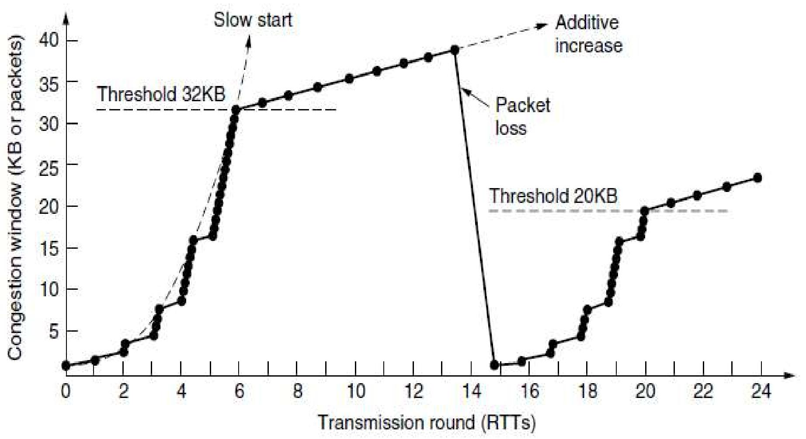

### 快速重传和快速恢复

快速重传: TCP Tahoe将3个重复的ACK视为超时,然后开始 一个新的慢启动阶段.

快速回复：对于3个重复的ACK, TCP Reno将拥塞窗口减半,执行“快 速重传”,并进入一个新的拥塞避免阶段

#### 快速重传

📌 触发条件：

* 当发送方收到  **三个重复的 ACK** （即连续 3 个 ACK 报告同一个序号未到达）

📦 意义：

* 表示 **下一个包可能丢失了** ，因为接收方不断收到后续包但一直缺一个。

✅ 动作：

* **立即重传**这个“可能丢失”的数据段（ **无需等超时** ）

#### 快速恢复

当发生快速重传时：

1. **设置 ssthresh = cwnd / 2**
2. **将 cwnd 也降为一半（不归 1）（跟ssthresh一样）**
3. **跳过慢启动，直接进入拥塞避免**

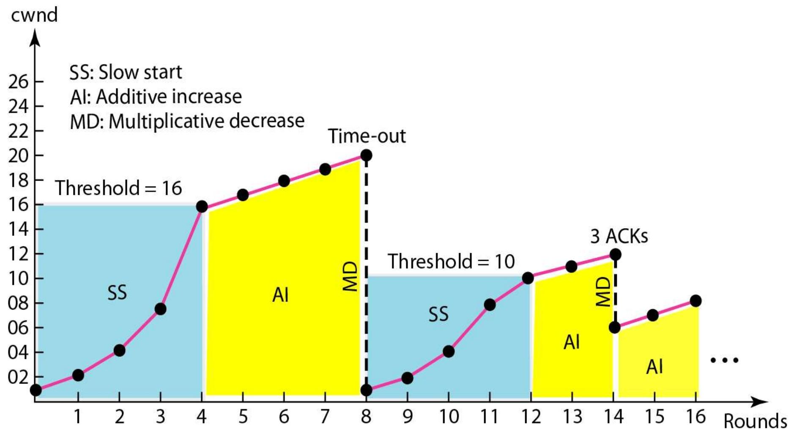

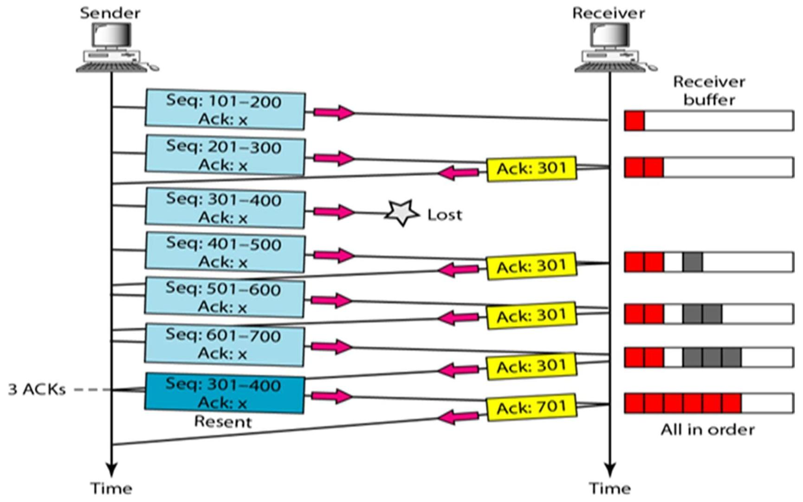

### AIMD效应

Additive Increase, Multiplicative Decrease（加法增加，乘法减少）

#### 加法递增

* 当发送完全部窗口内的数据包而没有丢失时,拥塞窗口值 加1
* 线性增加以避免拥塞

#### 乘法递减

* 丢包后拥塞窗口值减半

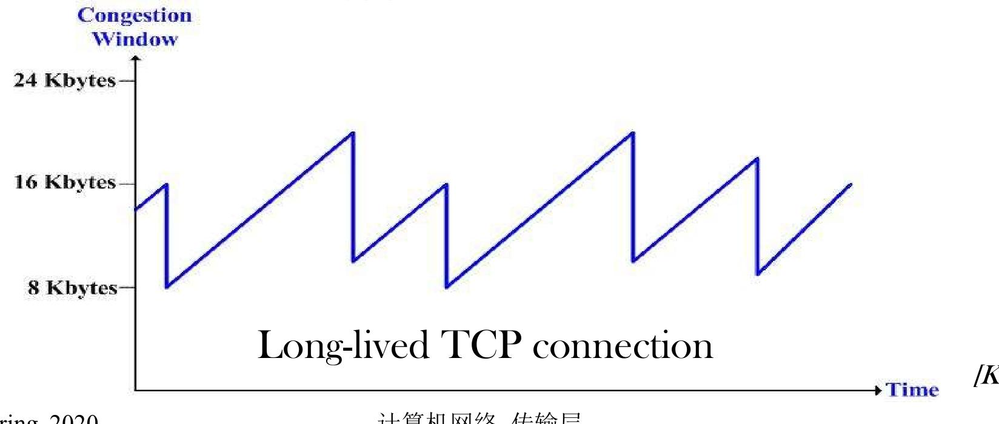

### TCP拥塞控制小结

* 当拥塞窗口值(Congwin)小于阈值时,发送方处于 慢启动阶段,窗口呈指数增长.
* 当拥塞窗口值(Congwin)大于阈值时,发送方处于 拥塞避免阶段,窗口线性增长.
* 当收到三个重复ACK(3-duplicate-ACK)时,阈值减 到拥塞窗口值(Congwin) 的一半,并令CongWin值 等于阈值.
* 超时时,阈值设置为拥塞窗口值(Congwin) 的一半, 并令CongWin值等于1MSS.
