*『  女子总爱在情爱一事上动脑筋，男子喜好在江山一事上花心思  』*

# 应用层概述

* 为最终用户提供各种应用程序
* 协议数量最多且最复杂
* 每个协议专门针对一种类型的应用程序,没有通用协议

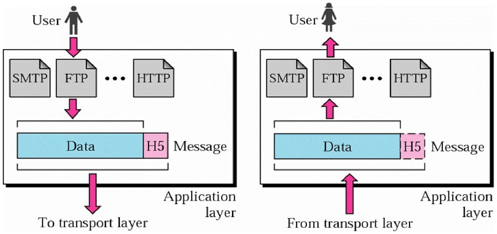

## 客户端-服务器(C/S)模式

### 服务器

* 一直在线
* 永久的IP地址
* 可扩展的服务器群

### 客户端

* 与服务器通信
* 可以是间歇性连接
* 可以是动态IP地址
* 客户端彼此之间不能直接通信

包括：域名系统(DNS), 万维网(Web), 电 子邮件(email)…

## P2P架构

* 任意端系统之间可以直接通信
* 对等点之间是间歇性连接且可以改变IP地址
* BT,eMule, 迅雷…

# DNS: 域名系统

## 名字空间

### 平面名字空间

* 所有名称都是 **唯一的、无层次结构** ；
* 不能有重复名称；
* 类似一个长列表，每个名字都要全局唯一；
* **名字之间没有组织关系** ，比如 `server1`、`host33`、`bob`、`printer5`。

#### 📌 举例：

* **早期的 `hosts.txt` 文件系统** （最初用于 ARPANET）：
* 每台主机都记录一个统一的 `hosts.txt` 文件；
* 每台主机名在整个网络中必须唯一；
* 文件越大越难管理、更新困难， **无法扩展** 。

### 层次名字空间

主机具有层次结构组织的复合名称

* 名称具有 **多级结构** ，像一棵树；
* 高层节点可管理其下属子树；
* 不同分支下的名字可以相同；
* 易于组织、分布式管理；
* **DNS 就采用了这种模型** 。

#### 📌 举例：

* `www.example.com`：
  * `com` 是顶级域；
  * `example` 是 `com` 下的子域；
  * `www` 是 `example.com` 下的主机名；
* 每一级都可以由不同组织管理，适合大规模网络。

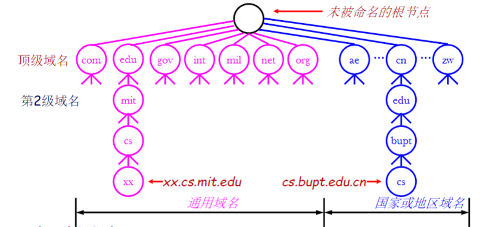

在一个主机中：

* 可以进一步细分
* 可以是任意级别(最大深度=128)
* 未标准化,由组织自身控制

命名原则:从叶到根向上的路径，用“.”分隔

### 域名服务器（区 ZONE）

DNS名字空间被划分为多个不重叠的区域(zones)

* 每个圈起来的区域包含域名树的一部分
* 区域对应于负责该层次结构部分的授权管理机构
* 每个区域都与一个或多个域名服务器关联,这些服务器就是 拥有该区域数据库的主机

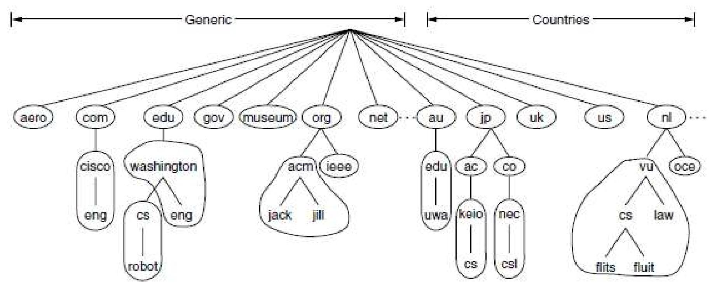

## 域名系统DNS

一种客户端-服务器(C/S)模式的应用,使用唯一的､用户友好的名字(域名)标识Internet上的每台主机

将域名(主机名字) 转换为对应的IP地址

## DNS 特征

### 资源记录(RR) Resource Record

DNS中的每个域都有一组与它相关的资源记录(RRs),这些记录 组成了DNS数据库｡

每个资源记录是一个五元组,格式如下:

| 字段                | 说明                                                                                                                                                                                                                                    | 示例/取值说明                           |
| ------------------- | --------------------------------------------------------------------------------------------------------------------------------------------------------------------------------------------------------------------------------------- | --------------------------------------- |
| Domain_name         | 指出该记录适用的域                                                                                                                                                                                                                      | 如 `example.com`                      |
| Time_to_live（TTL） | 定义缓存记录的有效生存时间，单位为秒                                                                                                                                                                                                    | 数值，如 `3600`（1小时）              |
| Class               | 指定协议族类别，常用 `IN` 表示 Internet 信息                                                                                                                                                                                          | `IN`（常见）                          |
| Type                | 记录类型，如：` `- SOA：Start Of Authority，标识区域 ` `- A：Host Address（主机地址）` `- MX：Mail Exchanger（邮件交换器）` `- CNAME：Canonical Name（规范名称，别名）` `- HINFO：Host Information（主机信息） | 按实际记录类型选，如 `A`、`MX` 等   |
| Value               | 与类型相关，类型不同值含义不同，如 `A` 类型对应主机IP，`MX` 类型对应邮件服务器地址                                                                                                                                                  | 类型为 `A` 时填IP，如 `192.168.1.1` |

## DNS客户端

客户端: 也称为解析器(resolver)

运行在客户端的软件,能够访问至少一个名字服务器，如本地名字服务器

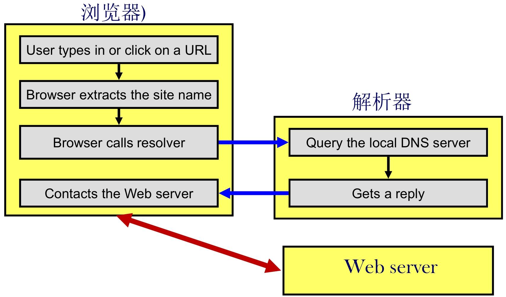

## 域名服务器

* 域名服务器按层次结构组织
* 权威域名服务器(Authoritative Name Server)
  * 包含其负责的区域内主机的所有记录
  * 从自己磁盘的一个文件获得有关的域名信息
* 缓存记录:有可能是过时的信息

服务器如何知道其他区的负责的服务器是哪些?

* 每个服务器知道根服务器
* 根服务器知道所有顶级域名服务器
* 每个服务器知道层次结构中其下层的服务器

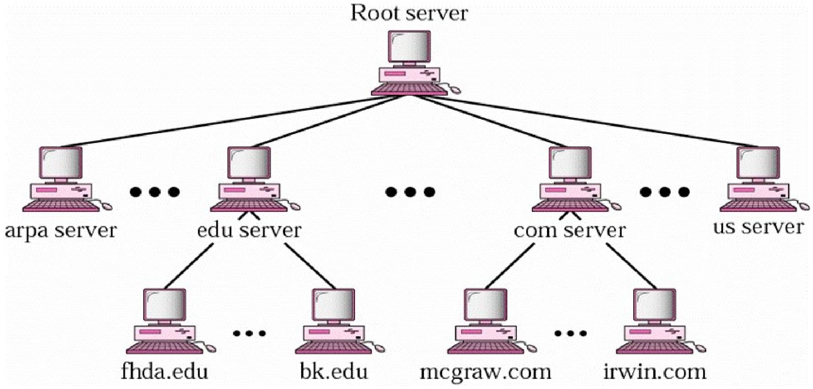

## 域名解析

域名解析:查询一个名字,找出其对应地址的 过程

* 应用进程（本地终端客户端）
  * 作为DNS客户端
  * 首先向本地名字服务器发送查询请求
* 本地域名服务器（服务端）
  * 在53端口监听服务请求, 传输层通常使用UDP
  * 如果知道查询结果, 则向客户端返回响应
  * 如果不知道
    * 向根服务器或顶级域名服务器发送查询请求
    * Follows links
    * 直到查询到权威域名服务器, 由权威名字服务器进行名字解析并返回响应

### 域名解析方法

解析器将有关域名的查询传递给本地域名服务器,如果本地 域名服务器不能解析该名称,那么它将查询另一个服务器.

#### 递归解析/递归查询

服务器找不到时，自发查找下一个服务器，直到有消息返回

* 如果被查询的服务器没有这些信息,那么它进行适当的查 询来获得这些信息
* 服务器执行另一个递归查询,直到返回所需要的答案｡不 能返回部分答案｡

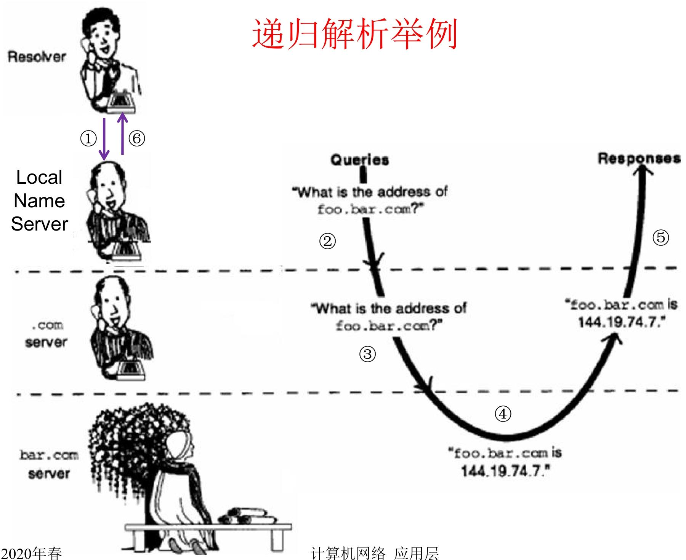

#### 迭代解析/迭代查询

服务器找不到时，将自己能找到的服务器返回，让客户端自己去接着查

* 如果被查询的服务器没有该信息,那么它可以用另一个服 务器的地址进行响应(即返回部分答案);然后,本地域名 服务器(代表解析器)查询该服务器(被该服务器可能响应另 一个服务器的地址,依次类推,直到得到查询的结果)
* 该方法是互联网上常用的域名解析方法

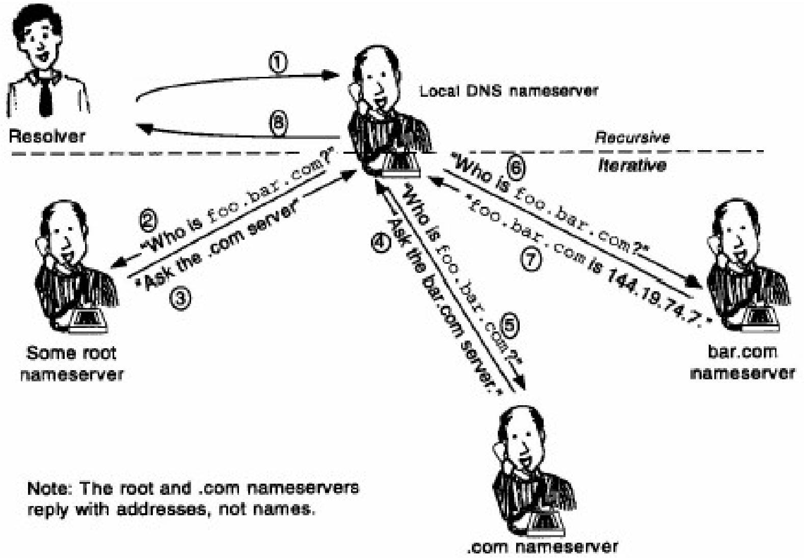

## DNS缓存

* 所有的查询答案,包括所有的部分查询答案都会被缓存
  * 域名服务器会缓存查询答案
  * 主机也可以缓存查询答案
* 使用缓存答案的做法可大大简化一次查询的步骤,并提高查询性能
* 缓存的答案不具权威性

# 电子邮件系统和协议

## 电子邮件

电子邮件(email, e-mail)

* 提供从一个人向另一个人异步发送电子消息的方法
* 因特网上最流行的应用程序之一,也是当今最重要 的通信方法之一

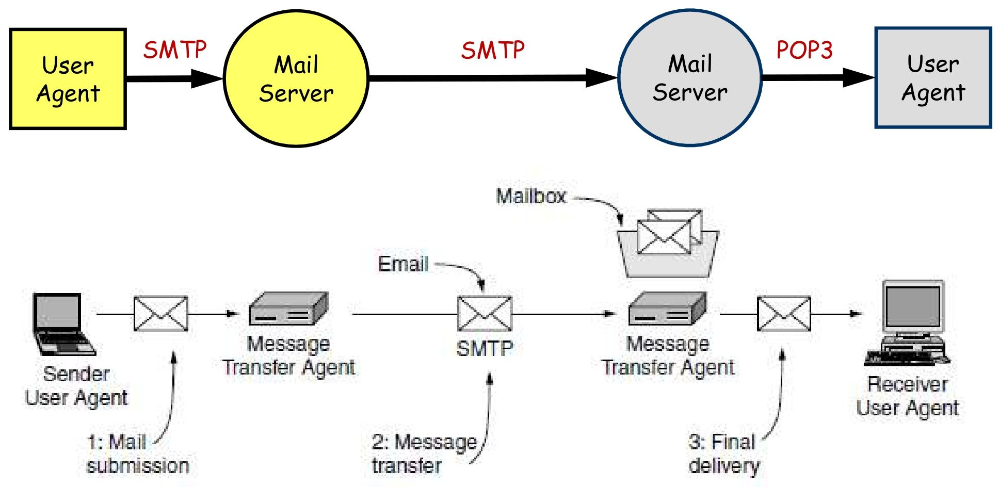

* 用户代理UA
  * 终端用户邮件程序
  * 终端用户和电子邮件服务器之间的接口
* 邮件传送代理(也称为电子邮件服务器)
  * 负责发送/接收邮件,并向邮件发送者报告邮件传送 的状态信息
* 电子邮件协议
  * SMTP: 用于发送电子邮件
  * POP3/IMAP: 用于接收电子邮件

邮件发送端 User Agent 提交邮件（Mail submission ），经 Message Transfer Agent 借 SMTP 传输（Message transfer ），到接收端 Mail Server 的 Mailbox，再经 POP3 由接收端 User Agent 最终收取（Final delivery ） ，呈现了邮件从发起到接收的关键环节与所用技术 。

## 电子邮件地址

* 邮件目的地址必须是邮件传输代理可以处理的格式
* 希望的形式是:user@dns-address ( RFC 5322 )
* 互联网上每个电子邮件地址是唯一的,因为
  * 互联网上域名地址是唯一的
  * 一个域名地址中的用户邮箱地址是唯一的

### 邮件格式(RFC5322)

* 信封
  * 包含完成邮件传输和交付所需的全部信息
  * 由邮件传输代理负责构造生成
* 消息内容:包含要交付给接收者的对象
  * 邮件头: from, to, subject, date, postmarks
  * 一个空行
  * 邮件体:实际的消息,可能有很多部分

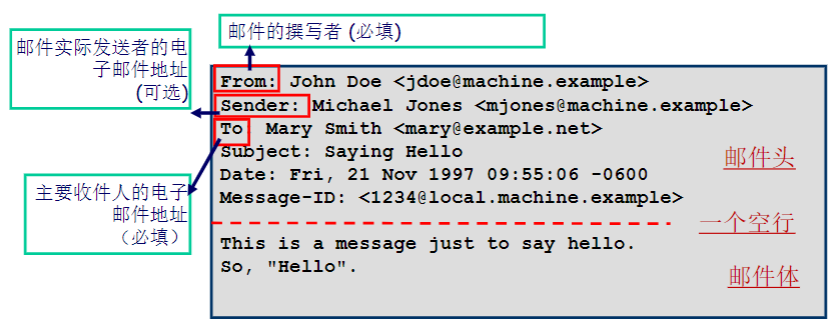

* 邮件头是空白行之前的所有内容,邮件体是空白行之 后的所有内容
* RFC 5322存在的问题:只能使用7位ASCII格式

## 多用途Internet邮件扩展 (Multipurpose Internet Mail Extension, MIME)

* 主要扩展用于多部分和多媒体邮件
* MIME的基本思想是继续使用RFC822格式,但在邮件体中增 加了结构性,并为传送非ASCII码的邮件定义了编码规则
* 支持多部分消息内容类型
  * 每个部分有自己的类型和编码
* MIME消息可以使用现有的邮件程序和协议发送

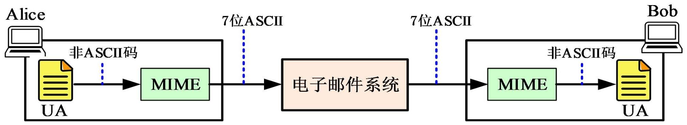

## 邮件传输与投递

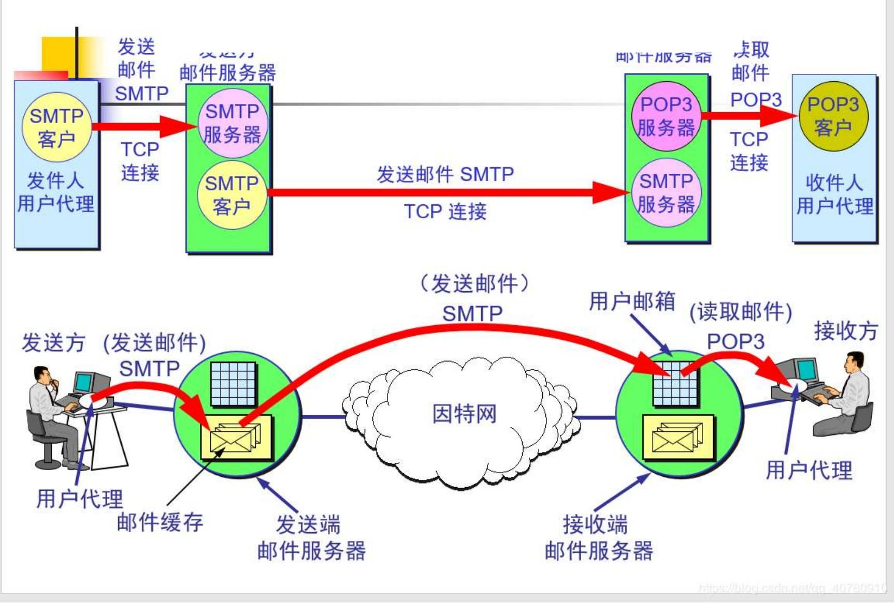

## SMTP 简单邮件传输协议

* 简单邮件传输协议SMTP:用于将邮件消息从UA传输到邮 件服务器,以及在邮件服务器之间传输
* SMTP是一个简单的ASCII协议
* SMTP服务器监听端口25,SMTP客户端建立到此端口的 TCP连接
* 如果消息无法传递,则向发送方返回包含无法传递消息 的第一部分的错误报告

### SMTP 基本模型

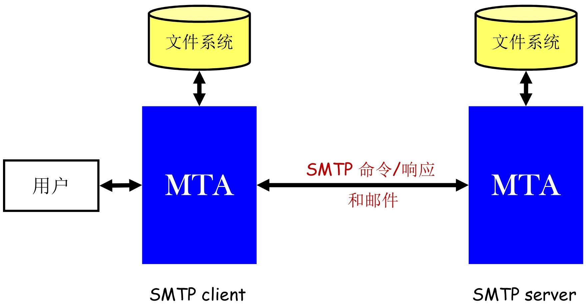

MTA:邮件传输代理,使用SMTP的邮件服务器

## POP 邮件交付基本模型

用于将邮件从邮件服务器传输到UA

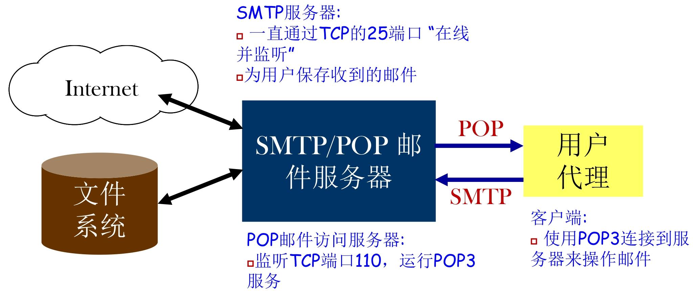

* 基本的存储转发
  * 邮件存储在服务器上,直到客户端连接,然后下载到客户端
  * 可以在服务器上保留一个副本
* 协议简单,使用广泛
* 协议: POP3 (邮局协议版本3)
* 不适合移动用户或使用多台机器接收邮件的用户
  * 通常把邮件下载到用户代理所在的计算机,而不是留在邮件服务器上
  * 解决方案: IMAP (Internet Message Access Protocol) Internet邮 件访问协议

## IMAP: Internet邮件访问协议

* 文件夹和邮件即可以保存在服务器上,也可以保 存在本地计算机上
* 因为邮件保存在服务器上,即使使用哑终端也可 以访问邮件(终端要求低)
* 对于移动用户比POP3友好
* 可以根据多种规则,选择性地从Server下载部分 邮件

QQ/163/gmail 对于IMAP和POP3都支持

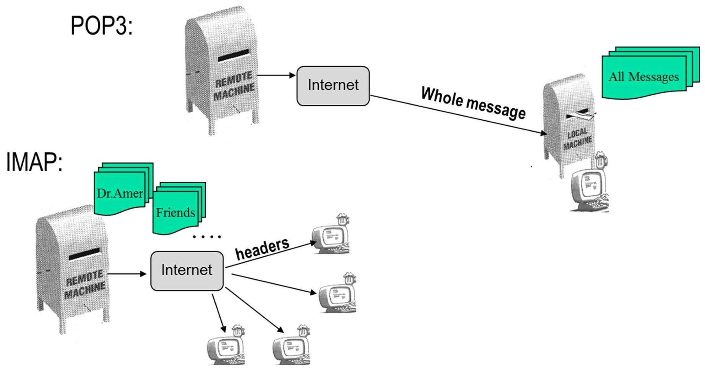

* **POP3 流程** ：远程机器（邮件服务器）里的邮件，经互联网，以 “Whole message（完整消息）” 形式传输到本地机器，本地机器接收 “All Messages（所有消息）” 。
* **IMAP 流程** ：远程机器（邮件服务器）中的邮件，分类存于 “Dr.Amer”“Friends” 等文件夹，经互联网，先传输 “headers（邮件头，含发件人、主题等信息 ）” 到多个本地终端，方便用户预览和选择是否下载完整邮件 。

## Webmail: HTTP

以网页格式传送邮件

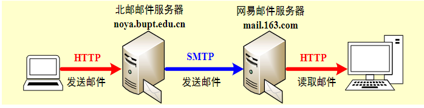

# 万维网(WWW)

## 万维网(WWW): World Wide Web

* 分布在互联网上的信息存储在web服务器上,通过超链接进行 访问
* 客户端/服务器模式, 将浏览器作为客户端
* WWW文档通过统一资源定位符URL(Uniform Resource Locator)定位
* WWW文档用超文本标记语言HTML(HyperText Markup Language)编写
* 客户机和服务器之间利用超文本传输协议HTTP(Hyper-Text Transfer Protocol)进行交互

## Web客户端: 浏览器

* 用户用来查看Web网页的应用程序,用户到Web的接口
* 从web服务器取回信息(网页)
* 为用户展示取回的网页信息

点击超链接后：

1. 确定链接网页的URL和名称,如www.abc.com/example.html
2. 向域名系统(DNS)查询域名www.abc.com 对应的IP地址
3. 建立到响应的IP地址的TCP连接
4. 发送HTTP 请求消息请求网页/example.html
5. 取回嵌入式图像
6. 向用户显示网页/example.html上的所有文本和图像
7. 释放TCP连接

## Web服务器

* 存储一组Web文档
* 通过发送文档副本来响应来自浏览器的请求
* 服务器循环执行如下步骤
  1. 接受来自客户端(浏览器)的TCP连接.
  1. 获取网页的路径,即被请求的文件的名字
  1. 读取文件(从磁盘上).
  1. 将文件的内容发送给客户端.
  1. 释放TCP连接

## Web文档

也称为web网页(HTML)

### 静态Web页面(Static)

* 每个URL对应一个存储在硬盘上的单个文件,固定不变
* 以HTML格式编辑,.html, .htm

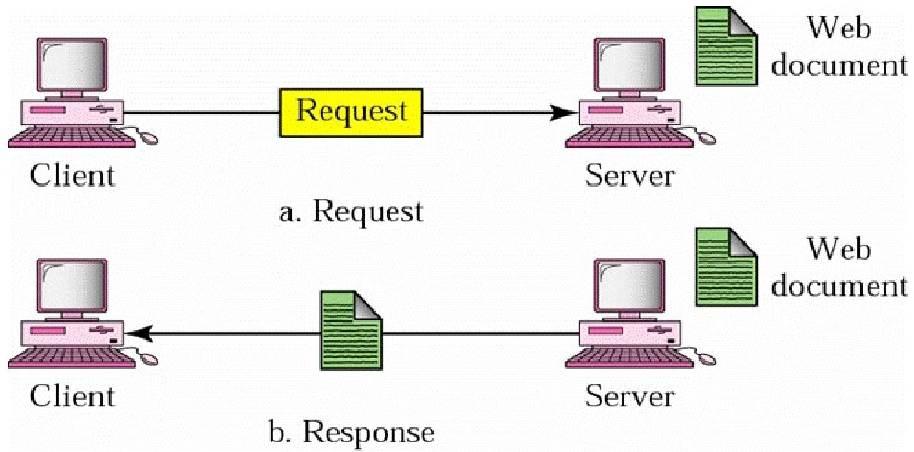

### 动态web页面(Dynamic)

转换在服务端进行

* 每当服务器收到请求时可以改变
* 网页在服务器端产生
* 由服务器上的程序输出, 通常是一段脚本, ASP, JSP, VB Script, PHP, CGI或其他程序

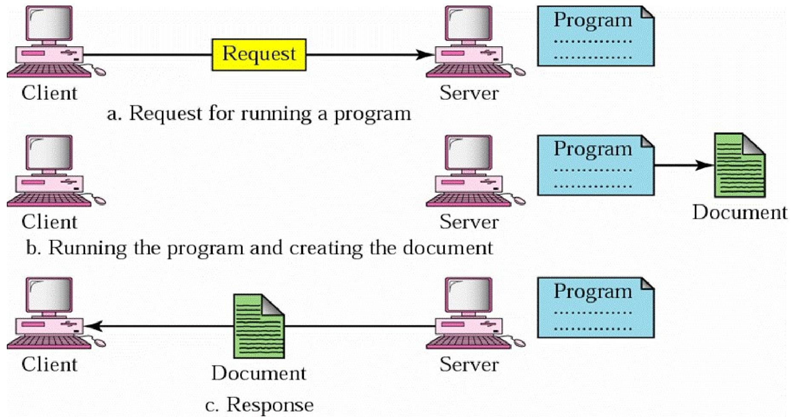

### 活跃web页(Active)

转换在客户端进行

* 文档加载到浏览器后可以改变
* 网页在客户端产生
* 由计算机程序组成,如运行在浏览器端的Java

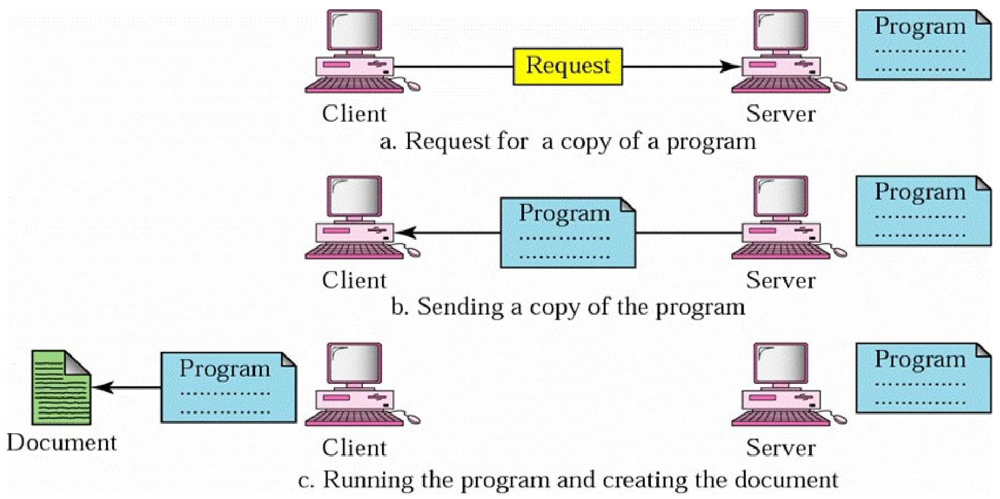	

## 链接到其他网页

### 浏览器

对用户隐藏链接文本

将网页上的项目与链接进行关联

### URL 调用统一资源定位符(Uniform Resource Locator URL)

* 作为网页的全球范围的名称
* 由三部分构成:协议(http); 主机域名(www.bupt.edu.cn)+端口号; 路径名(index.html)

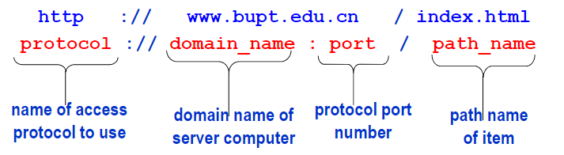

## HTTP : 超文本传输协议

* 客户端-服务器结构
* 同步请求/响应协议
  * 运行在TCP协议之上, 使用80端口
* 每个命令都是独立执行的，与前面操作的执行情况无关

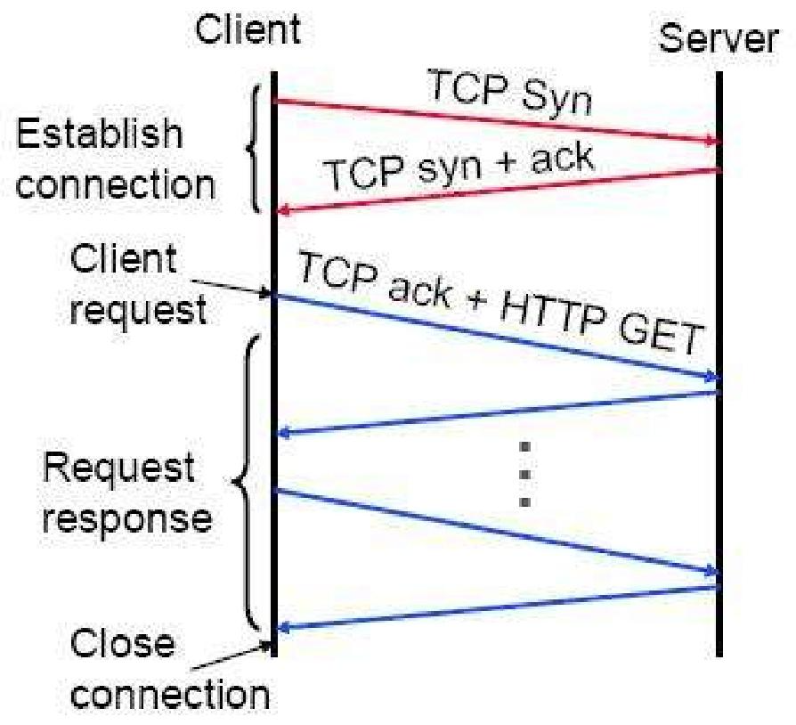

### HTTP操作过程

1. 浏览器分析超链接 URL（如[http://www.abc.com/example.html](http://www.abc.com/example.html) ）
2. 浏览器用域名解析服务获服务器（[www.abc.com](https://www.abc.com/) ）IP 地址
3. 浏览器与服务器建立 TCP 连接
4. 浏览器发 HTTP 请求（如 GET /example.html HTTP/1.0 ）
5. 服务器返回被请求网页
6. 释放 TCP 连接
7. 浏览器展示网页 example.html

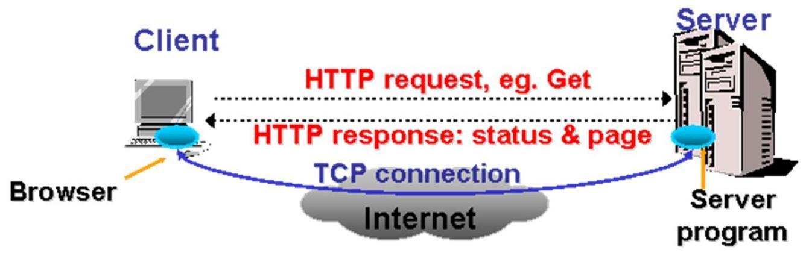

### HTTP事务

* **流程阶段** ：建立连接、客户端请求、服务器响应、连接终止
* **各阶段内容** ：
* 建立连接：建立 TCP 连接，用端口号（通常 80 端口 ）作应用程序索引
* 客户端请求：用 request - line 发 HTTP 消息，格式为 “方法 URL HTTP 版本”
* 服务器响应：发送 HTTP 消息和可选被请求数据，resp - message 格式为 “HTTP 版本 状态码 原因短语 [可选]”
* 连接终止：一般由服务器终止，也可能客户端终止，谁先注意到就由谁终止 ，清晰呈现 HTTP 事务从建立到终止的完整流程及各环节规则 。

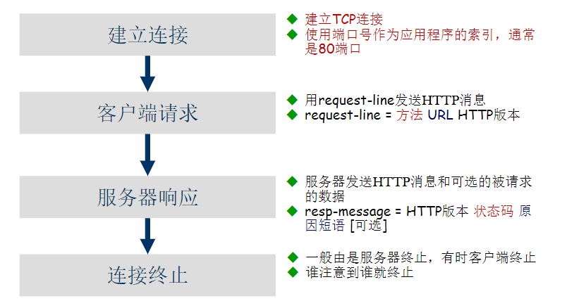
