*The root of all evil is the kotatsu.*——*Nodame Cantabile*

# Position, Functions & Services of Data Link Layer (Textbooks 3.1.1)

## 数据链路控制功能

* **错误控制** ：`Probable transmission bit errors in physical layer:error control` 物理层在传输过程中可能出现比特错误。数据链路层通过检错编码（如 CRC 循环冗余校验）和纠错机制，能够检测并纠正部分错误，保证数据传输的准确性。
* **流量控制** ：`Receiver may need to prevent too much data coming in: flow control` 发送方和接收方的处理速度可能不匹配，例如图中服务器传输速率为 1Gbps，而 PC 端为 1Mbps。数据链路控制可以防止接收方因数据接收过快而导致缓冲区溢出，通过反馈机制让发送方调整发送速率。
* **广播信道管理** ：`Broadcast channel: addressing, media access control` 在广播信道环境下，需要进行地址管理，确保数据能准确发送到目标设备；同时进行媒体访问控制，协调多个设备对共享信道的访问，避免冲突，提升信道利用率。

### 位置及功能

Data link layer has responsibility of transferring data (frame) from one node to adjacent node in a reliable and efficient way over a link

数据链路层负责通过链路以可靠且高效的方式将数据（帧）从一个节点传输到相邻节点。

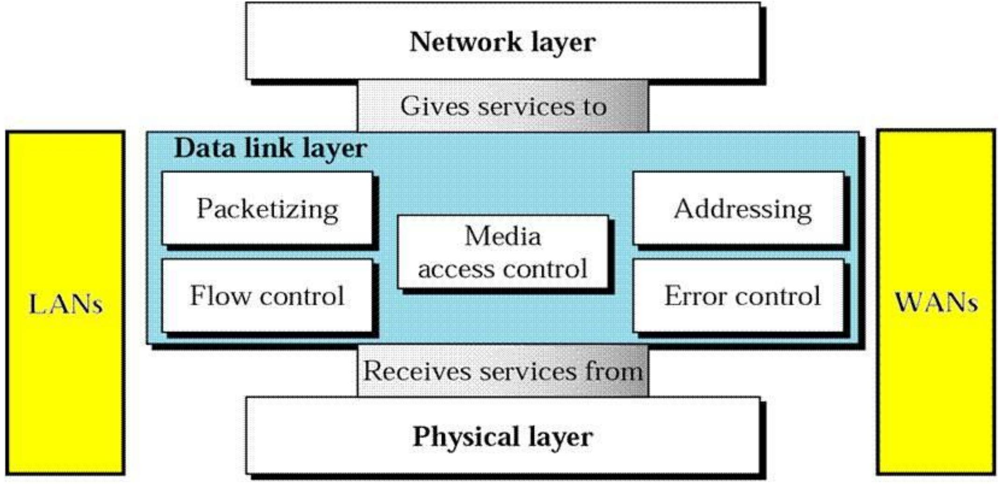

**可靠传输** ：物理层在传输数据时可能会出现比特错误 。数据链路层通过差错控制机制，来检测和纠正这些错误，确保接收方接收到的数据与发送方发送的数据一致

**高效传输** ：发送方和接收方的处理速度可能存在差异。数据链路层通过流量控制机制，防止接收方因发送方发送数据过快而导致缓冲区溢出，避免数据丢失

**介质访问控制：**协调多个设备对共享信道的访问，减少冲突，提高信道利用率

# 设计问题

Study the algorithms for achieving reliable, efficient communication between two adjacent machines

数据链路层要保证数据准确且快速地在相邻节点间传输，减少错误和延迟。

* 设计问题：

  * **为网络层提供的服务** ：`Services Provided to the Network Layer` 数据链路层向上为网络层提供服务，如无差错的帧传输，使网络层不用考虑底层传输细节。
  * **成帧（Framing）** ：`break up the bit stream into discrete frames` 将物理层传来的比特流分割成离散的帧。通过添加帧头和帧尾标识，确定帧的开始和结束，方便接收方识别和处理。
  * **错误控制（Error Control）** ：`Ensure data received equal to data sent` 确保接收的数据与发送的数据一致。利用检错码（如 CRC）和纠错机制，检测并纠正传输过程中的比特错误。
  * **流量控制（Flow Control）** ：`Slow receivers must not be swamped by fast senders` 防止慢的接收方被快的发送方淹没。通过反馈机制让发送方调整发送速率，匹配接收方处理能力，避免数据丢失 。

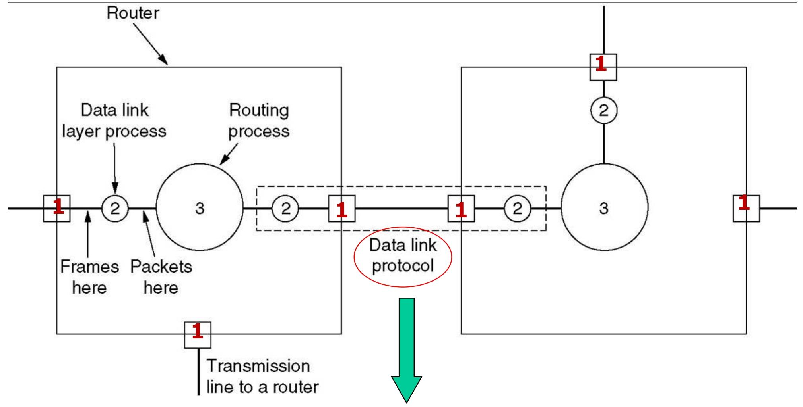

* Flow Control: How much data shall be sent?
* Error Control: How can errors be corrected?
* Access Control: who shall send? chapter 4

## hop-to-hop communication(逐跳通信)

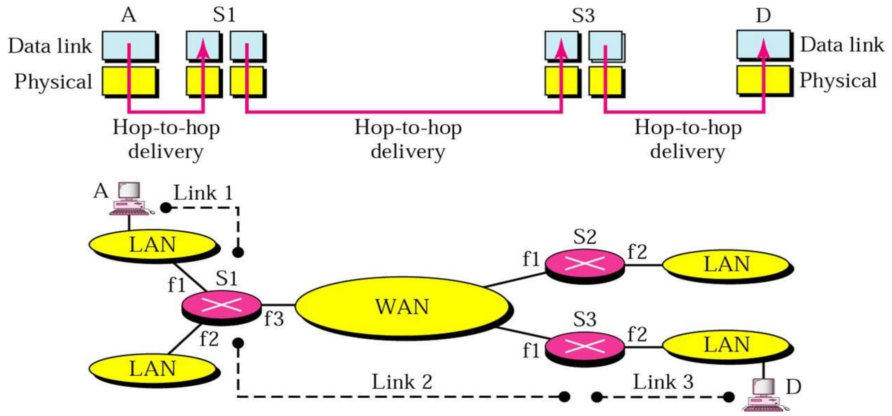

## Adapters Communicating 适配器（网卡）通信功能

### 发送端 Sending side

* **封装数据包** ：`Encapsulates network packet in a frame` 将网络层传来的数据包封装在一个数据帧（frame）中。
  * 为了在链路层传输时对数据进行格式化处理，添加必要的控制信息。
* **添加校验和控制信息** ：`Adds error checking bits, reliable transfer, flow control, etc` 添加错误校验位（如 CRC 校验码），以检测传输过程中的错误；同时实现可靠传输和流量控制等功能，确保数据能够正确、有序且不过载地发送。

### 接收端 Receving side

* **检查与控制** ：`Looks for errors, reliable transfer, flow control, etc` 检查接收到的数据帧是否存在错误，继续执行可靠传输和流量控制等操作，保证数据接收的准确性和稳定性。
* **提取与传递** ：`Extracts packet, passes to receiving node `从数据帧中提取出原始的数据包，并将其传递给接收节点的上层（通常是网络层）进行进一步处理。

### 链路层实现 Link layer implemented in “adapter” (NIC, 网卡)

链路层的功能由适配器（网卡，NIC）实现，常见的网卡类型有以太网卡（Ethernet card）、PCMCIA 卡、802.11 无线网卡等。这些网卡负责处理数据链路层的相关协议，实现数据在物理链路中的有效传输

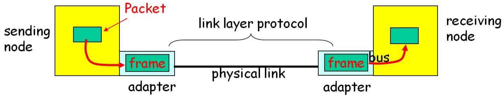

## Services Provided to NetworkLayer 服务于网络层

### **无连接服务（Connectionless services）**

* **无确认无连接服务（Unacknowledged connectionless service）** ：
  * `No acknowledgement, no logical connection `不进行确认，也不建立逻辑连接
  * `Most LANs use such service `大多数局域网（LANs）使用这种服务。
* **确认无连接服务（Acknowledged connectionless service）** ：
  * `Each frame acknowledged, used in unreliable channel, such as wireless systems `每个帧都需要确认，常用于不可靠的信道，比如无线系统。

### **确认面向连接服务（Acknowledged connection - oriented service）**

A connection established, frames are numbered, reliable transmission guaranteed, eg. ATM

会建立连接，对帧进行编号，保证可靠传输，例如异步传输模式（ATM）

## 总结

* 数据链路层的功能：**相邻**节点间可靠地传输数据帧
* 实现可靠传输的功能
  * 成帧（帧同步）：在原始比特流中识别出帧
  * 差错控制：检测差错、纠正差错
  * 流量控制：防止发送方速度过快而淹没接收方（接收方来不及接收而丢失数据）
  * 介质访问控制(MAC)：对于共享信道,如何防止因两个站点同时发送而导致冲突?---在下一章学习
* 向网络层提供的服务:取决于不同的物理网络(数据链路层+物理层)
  * Ethernet：无连接服务
  * Wifi：带确认的无连接服务
  * ATM：面向连接服务

# Design Issues

## 成帧（Framing）

A sequence of bits is sent from node A to node B over a point-to-point link. Node B must recognize exactly what set of bits constitutes a frame, that is, it must determine where the frame begins and ends.

* 通过点到点链路，数据以比特序列的形式从节点 A 发送到节点 B。
* 节点 B 需要准确识别哪些比特集合构成一帧，也就是要确定帧的起始和结束位置 。这是数据链路层的重要功能，确保接收方能够正确地接收和处理数据。

### 任务

Requirements: Framing(拆分比特流)

Constraints 限制：

* 接收方容易实现——simple
* 与传输的消息内容无关——code independence
* 使用的信道带宽尽量少——efficient
* 帧的长度与所传输的数据的内容无关
* 不易出错,出错后易重新同步——robustness

Methods 方法：

* Character count (字符计数法)
* Flag byte with byte stuffing (字符填充法)
* Starting and ending flags, with bit stuffing(比特填充法)
* Physical layer coding violations (物理层编码违例法)

### Character Count(字符计数法)

* **原理** ：`Using a field in header to specify number of characters in the frame （包括计数字符在内）` 在帧的头部设置一个字段，用来指定帧内字符的数量，这个数量包含计数字符本身。
* **缺点** ：`The count may be garbled by a transmission error` 传输过程中，计数字段可能因错误而被篡改，导致接收方无法正确识别帧的边界。
* **应用** ：`Used in DDCMP(DEC)` 在数字数据通信消息协议（DDCMP，由 DEC 开发）中有所应用。

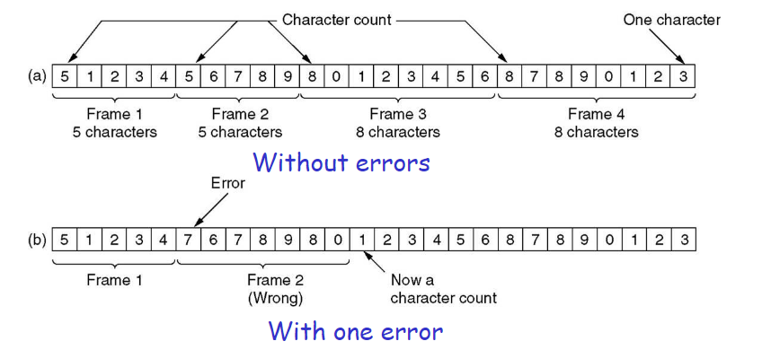

图中所示：

* 无差错时（图 a），帧 1 到帧 4 的字符计数分别为 5、5、8、8，接收方可以正常识别帧的边界。
* 有一个差错时（图 b），帧 2 的字符计数字段从 5 变为 7，导致接收方无法正确识别帧的边界。

### Byte (Character) Stuffing(字节/字符填充)

* **原理** ：`Using flag bytes to mark the starting and ending of a frame` 使用标志字节（flag bytes）来标记帧的起始和结束。当数据内容中出现与标志字节相同的字节时，通过填充特殊字节来区分，以避免混淆。
* **特点** ：`Closely tied to the use of 8-bit characters` 与 8 位字符的使用紧密相关。
* **应用** ：`Used in BISYNC(IBM)` 在 IBM 开发的二进制同步通信协议（BISYNC）中使用。

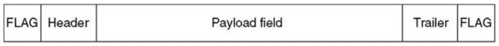

理论图示应该是这样的：

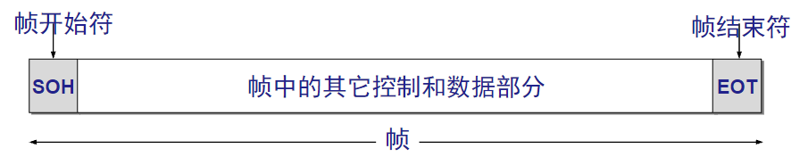

#### Byte stuffing: transparent transmission(透明传输)

What if payload includes same byte with the flag?

当有效载荷（payload）中包含与帧标志字节相同的字节时，需要特殊处理，以免被误判为帧边界。

* `Using special stuffing byte: ESC (eg. 0x1B) `使用特殊的填充字节 “ESC”（例如十六进制的 0x1B）
* `Inserted before “flag” in payload`在有效载荷中出现 “标志字节（FLAG）” 前插入

#### 类似转义的想法

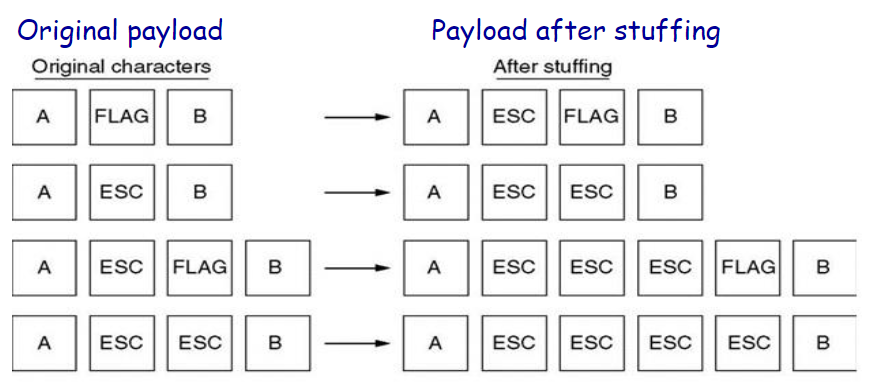

### Bit Stuffing(比特填充)

* **特点** ：`Allowing a frame to contain arbitrary number of bits` 允许帧包含任意数量的比特。
* **帧标志** ：`Starting and ending flag: 0111,1110` **使用 “01111110” 作为帧的起始和结束标志**。
* **填充规则** ：`Stuffing: a ‘0’ is stuffed after five consecutive 1s` 当发送方在数据中遇到连续 5 个 “1” 时，自动在其后插入一个 “0”。
* **应用** ：在高级数据链路控制（HDLC）协议中使用。

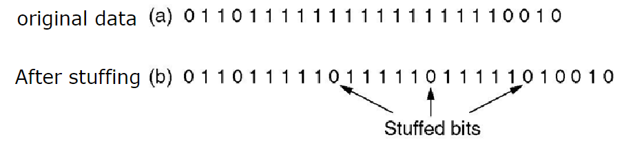

#### 例题

已知 HDLC 帧定界符为 `01111110`，从给定比特序列 `1101 0111 1110 0111 1110 1101 1011 1110 0010 1100 0101 1111 0101 1001 1111 1001`中找到首尾帧标志 `01111110`，确定帧范围在两个帧标志之间。

##### 去除填充

根据比特填充规则，出现连续 5 个 1 后插入 1 个 0，接收方要去掉这些插入的 0。

* 对于 `1101 1011 1110 0010 1100 0101 1111 0101 10`，其中 `1101 1011 1110`中连续 5 个 1 后的 0 是填充的，去掉后为 `1101 1011 111`；`0101 1111 0101 10`中 `0101 1111`后的 0 是填充的，去掉后为 `0101 1111 101 10`。
* 最终处理后的比特序列为 `1101 1011 111 0010 1100 0101 1111 101 10`。

##### 转换为十六进制

将处理后的二进制比特序列按 4 位一组转换为十六进制：

* `1101`对应十六进制 `D`；
* `1011`对应十六进制 `B`；
* `1110`对应十六进制 `E`；
* `0010`对应十六进制 `2`；
* `1100`对应十六进制 `C`；
* `0101`对应十六进制 `5`；
* `1111`对应十六进制 `F`；
* `1010`对应十六进制 `A`。

但题目中已给出处理和转换结果为 `1101 1011 111 0 010 1 100 0 101 1 111 1 01 10`，对应十六进制 `D B E 5 8 B F 6` ，这是按照题目特定的划分方式得出的结果，重点在于理解比特填充和去填充以及进制转换的过程。

### Physical Layer Coding Violations (物理层编码违例法)

**适用条件** ：该方法适用于存在冗余的编码方案

* `Each valid bit has a transition in the middle of signal` 正常情况下，每个有效比特在信号中间都会有跳变
* **帧界定原理** ：`Then code without transition, i.e. high-high and low-low are used for frame delimitation` 利用没有跳变的编码（即高 - 高和低 - 低的状态）来界定帧的边界。因为正常曼彻斯特编码规则下不会出现这些状态，所以可作为特殊标志来区分帧。

### Review:framing (成帧)

* 如何实现发送方与接收方的同步?
  * 让接收方能够从来自物理层的一串二进制位流中提取出 完整的一帧
* 成帧方法
  * 字符计数法:前面加一个帧长度字段,不实用
  * 字节(字符)填充法:前面加一个帧首标志字符,后面加 一个帧尾标志字符
    * 透明传输:用添加转义字符来实现
  * 比特(位)填充法:用0111 1110标记帧头和帧尾
    * 透明传输：零比特填充，在帧中连续的五个1之后添加一个0
  * 物理层编码违例法：曼彻斯特编码，使用非法编码标记帧头和帧尾；支持透明传输，无需填充

## 差错控制（Error Control）

* `Make sure all frames are eventually delivered to the network layer at the destination and in the proper order` 确保所有帧最终能按正确顺序传递到目的网络层
  * `Provide the sender with some feedback about what is happening at the other end of the line `确保向发送方反馈线路另一端的情况
  * `Hardware troubles may cause a frame to vanish completely `硬件故障可能导致帧完全丢失
    * `If either the frame or the ACK is lost, the timer will go off, alerting the sender to a potential problem `当帧或确认信息（ACK）丢失时，计时器会超时，提醒发送方可能存在的问题
    * `Managing the timers and sequence numbers so as to ensure that each frame is ultimately passed to the network layer at the destination exactly once, no more and no less `管理计时器和序列号，以保证每个帧恰好一次传递到目的网络层，不多不少

#### 错误类型 Type of Errors

* **丢失帧（Lost frames）** ：`a frame failed to arrive to the other side `帧未能到达另一端
  * `Owing to noise burst or dropped from a queue `原因可能是突发噪声干扰或从队列中被丢弃。
* **损坏帧（Damaged frames）** ：`some bits are in error `部分比特出现错误。

#### 错误纠正  Error correction

* **前向纠错（Forward Error Correction，FEC）**
* **重传（Retransmission）** ：自动重传请求（Automatic Repeat reQuest，ARQ）

#### **错误检测** Error detection

* **奇偶校验（Parity check）** ：`able to detect single bit errors` 能够检测单个比特错误。
* **循环冗余校验（Cyclic Redundancy Check，CRC）** ：`detecting some burst errors `可以检测一些突发错误。
* **校验和（Checksum）** ：将在网络层学习。

### Single-bit Error & Burst Error 单比特错误和突发错误

* **单比特错误（Single - bit error）** ：`Single-bit error, only one bit has changed` 只有一个比特发生改变，示例中发送的比特串 “00000010” 中有一位从 0 变为 1，接收为 “00001010” 。
* **突发错误（Burst error）** ：`A burst error(突发差错) means that 2 or more bits have changed. `指有两个或更多比特发生了改变。突发错误的长度是指改变的比特数量，示例中突发错误长度为 5 比特，发送和接收的比特串中有 5 个比特发生了变化。
  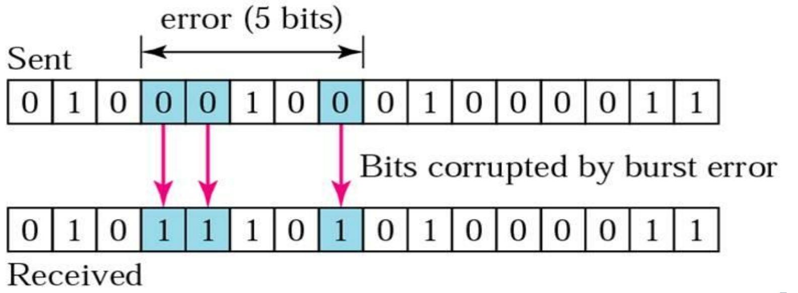

### Odd & Even Parity(奇偶校验)

* 单个奇校验位性能
  * 可检出奇数个位翻转错误
  * 其它情况漏检率50%

### Error Correcting Code(纠错码)

基本思路：将冗余信息加入到待发送的信息中

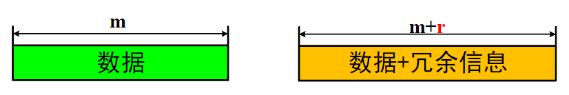

将冗余信息加入到原始待发送的数据中。原本的数据长度为 m，加入冗余信息后总长度变为 m + r 。

基本术语：

- **Block code（块码）**：是一种将信息序列划分成固定长度的组（块），并对每个块独立进行编码的编码方式，常用于差错控制编码中。
- **Systematic code**：即系统码，先发送 $m$ 位原始数据，然后再发送 $r$ 位校验位，校验位是根据原始数据计算得出，用于检测和纠正传输过程中的错误 。
- **Line code**：线路码，$r = f(m)$ 表示校验位 $r$ 是数据位 $m$ 的函数，线路码是将数字信号转换为适合在通信信道中传输的信号形式。
- **XOR**：异或运算，是一种基本的逻辑运算，当两个输入值不同时结果为1，相同时结果为0，在编码和数据校验中经常使用。
- **Code rate**：码率，计算公式为 $m/n$（其中 $n = m + r$），表示编码后数据中原始信息所占的比例，反映了编码的效率。

#### Error Correcting Code(纠错码): Hamming Distance(汉明/海明距离)

**汉明距离定义** ：指两个码字中不同比特位的数量

**错误检测** ：若要检测 t 位错误，需要一个汉明距离为 t + 1 的码。

**错误纠正** ：若要纠正 t 位错误，需要一个汉明距离为 2t + 1 的码。

在合法码字的汉明距离不一致的情况下，用于确定检测能力和纠错能力的是所有合法码字之间的最小汉明距离。

以合法码字 ci 和 cj 为例，它们之间距离为 2t + 1，在各自 t 距离范围内是不会相互重叠的。当码字出现不超过 t 位错误时，错误后的码字离原本的合法码字距离更近，从而可以判断并纠正到原合法码字。

#### Hamming Code: correction of single bit error

* **基本概念** ：
  * **m**表示消息位，即原始需要传输的数据位。
  * **r**表示校验位，用于检测和纠正错误的附加位。
  * **n**表示码字长度，**n**=**m**+**r** 。

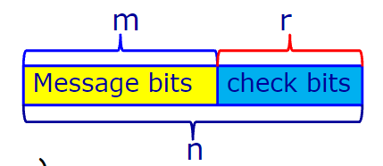

#### 求码字长度

有$2^m$个合法消息。每个合法消息会有$n$个距离为$1$的非法码字（即单比特错误的情况），那么总共的码字数量为$(n+1)2^m$。而总共有$2^n$种可能的码字组合

要纠正单个bit的错误，校验位的长度需要满足公式：

$$
m+r+1≤2^r
$$

例如数据位为 `m=7` 的码元，需要正确能够矫正单比特的错误

$$
7+r+1≤2^r
$$

解得 $ r≥4$

所以码字的最小长度为$7+4=11$

#### 码字的编排

1. **码字编号规则** ：码字的每个bit位都被编号，最左侧的第一个bit位为1，向右依次递增 `The bits of the codeword are numbered, start with 1 at left end, bit 2 to its immediate right, and so on.`
2. **校验位** ：校验位从左向右依次被放到2的次幂的位置上(1,2,4,8…)`The bits that are powers of 2 (1, 2, 4, 8, 16...) are check bits`
   * 每个校验位负责使包括它自身在内的一组比特位的奇偶性为偶数（或奇数）
   * 通过这种方式来检测和纠正单比特错误
3. **数据位** ：其余位置(3,5,6,7,…) 填充数据位

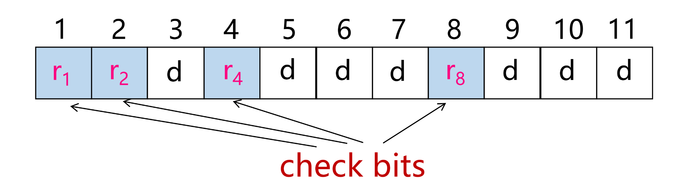

###### 示例

**编码过程：**

* **消息与数据位** ：消息为字符 `'A'`，其 7 位 ASCII 码是 `100,0001`。数据位填充在编号为 `3,5,6,7,9,10,11` 的位置。
* **校验位** ：有 4 个校验位，位置在编号为 `1,2,4,8` 的位置，采用偶校验（即相关位异或结果为 0）。
* **确定校验关系** ：根据 “编号为各校验位编号之和的位由这些校验位校验” 的规则，例如 `3 = 1 + 2`，所以第 3 位由第 1 和第 2 校验位校验；`5 = 1 + 4`，第 5 位由第 1 和第 4 校验位校验等。通过这种关系确定每个校验位所负责校验的数据位组合，再根据偶校验原则算出校验位的值，最终得到码字 `00100001001`。
  * 这里的校验关系似乎可以使用二进制理解：每个校验位对应的是二进制中的一位，数据位因此可以用校验位的组合表示
  * 由于是偶校验，那么异或的结果便是对应校验位的答案

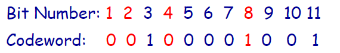

**纠错过程：**

* 接收者收到码字后，通过异或运算检查校验位关系。例如 `b1` 与它负责校验的数据位 `b3⊕b5⊕b7⊕b9⊕b11` 进行异或，**结果应为 0** ；`b2` 与 `b3⊕b6⊕b7⊕b10⊕b11` 异或结果为 0 等。
* 若**某组异或结果不为 0**，则表示该组涉及的比特位中可能存在错误。将所有校验位相关异或结果组合起来，能确定出错比特位的编号，进而纠正单比特错误。

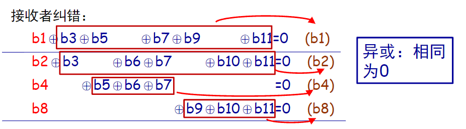

关键原因在于：

* 任何一个数据位bk错了，都会影响所有与之关联的校验位的校验结果
* 所有出错的校验位（1）序号求和，就知道哪个数据位错了——反转！

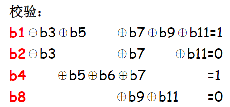

就图中而言，因为b1和b4位出错，单比特错误情况下错误位应该为$1+4=5$

此时应该翻转第5位

#### 海明编码解码一简便法（重点）

##### 编码简便法

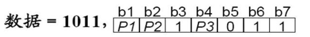

将码字中为 `1`的各位码字位号表示为二进制码，再按模 2 求和（即异或运算）得到校验码。

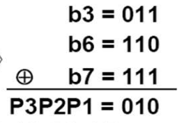

即第1位、第2位、第4位的校验码依次是：0，1，0

##### 解码简便法

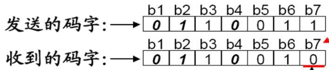

将码字中为 `1`的各位码字位号表示为二进制码，再按模 2 求和。若和为0，则无差错。 若和不为0，则指明差错的位号。

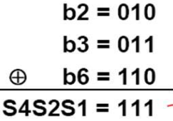

如这里出错位是第7位

### Error Detecting Code(EDC)

#### Error Correcting & Detecting

* **信道选择策略** ：
  * 在可靠的信道（如光纤）上，使用检错码更经济，发现偶尔的错误块时只需重传 `On channels that are reliable, such as fiber, it is cheaper to use an error detecting code and just retransmit the occasional block found to be faulty`
  * 在容易出错的信道（如无线链路）上，更好的方法是为每个数据块添加足够的冗余信息，让接收方能够确定原始数据块，即使用纠错码 `On channels such as wireless links that make many errors, it is better to add enough redundancy to each block for the receiver to be able to figure out what the original block was, i.e. using error correcting code`

示例：

* Bit Error Rate(BER)=$10^{-6}$, 1block=1000bits, Data=1Mbits
* The overhead for 1000 blocks（1M/1K=1K)
  * Error detection(parity check) + retransmission: 2001 bits
    出错可能：$1M×10^{-6}=1$；
    一个数据块 1000 比特，检错（如奇偶校验）可能需 1 比特，发现错误后重传 1000 比特，所以总开销约 2001 比特。
  * 汉明码的开销为 10000 比特，每个数据块有 10 个校验比特。因为有 1000 个数据块，每个数据块 10 个校验比特（$2^{10}=1024$），$1000×10=10Kbit$

#### Parity Check for Blocks (Interleaving, 交错校验)

这张幻灯片介绍了数据块的奇偶校验（交错校验）相关知识：

##### 编码规则

- 编码使用n个校验位
  - 每个数据块是一个$k \times n$的矩阵 `Each block is a k×n matrix`
  - 矩阵按行依次传输 `The matrix is transmitted one row at a time`
  - 并且为**每列单独计算**一个奇偶校验位 `A parity bit is computed separately for each column`
  - 例如图中左侧展示了一个数据矩阵，按行发送，然后根据每列计算出校验位 “1011110”

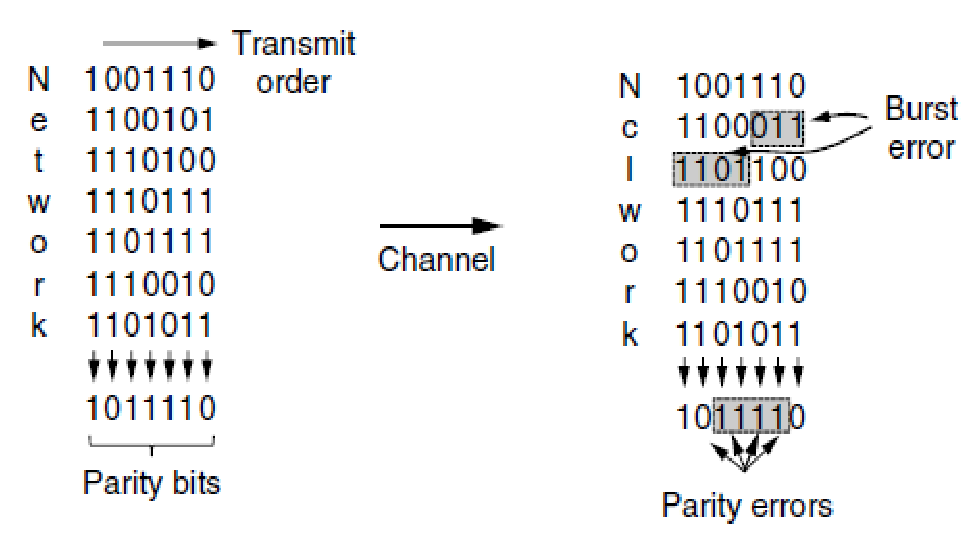

##### 性能特点?

- 能检测长度为n的单个突发错误 `Can detect a single burst of length n`
  - 比如图中右侧展示了传输过程中出现了突发错误（Burst error），接收端通过校验位发现了校验错误（Parity errors）。
- 如果突发错误长度为 $n + 1$ ，并且第一个和最后一个比特翻转，其他比特都正确，那么这个错误将无法被检测到。`A burst of length n+1 will pass undetected if the first bit is inverted, the last bit is inverted, and all the other bits are correct`
- 如果数据块因长突发错误而混乱，被误接受的概率是$2^{-n}$ 。 这是因为每个校验位有两种状态（0或1），n个校验位共有 $2^{n}$ 种组合，错误恰好能使校验结果看似正确的概率就是 $2^{-n}$ `If block is garbled by a long burst,the probability of being accepted is 2^{-n}`

### Polynomial Code(多项式编码) CRC(Cyclic Redundancy Check，循环冗余校验),FCS (Frame Check Sequence帧校验序列) (重点)

多项式编码也称为 CRC（循环冗余校验）和 FCS（帧校验序列） ，常用于数据传输中的错误检测。

- **数据表示**：用$M(x)$表示，将比特串看作系数为0和1的多项式 `M(x): Treating bit strings as representations of polynomials with coefficients of 0 and 1`
  - 一个 $k$ 比特的帧被视为一个有 $k$ 项的多项式的系数列表，项的范围从 $x^{k - 1}$ 到 $x^{0}$  。例如，比特串“110001”可表示为多项式 $x^{5}+x^{4}+x^{0} $ `A k-bit frame is regarded as the coefficient list for a polynomial with k terms, ranging from \(x^{k-1}\) to \(x^{0}\) \(110001=>x^{5}+x^{4}+x^{0}\)`
- **运算规则**：多项式运算采用模2运算，加法和减法等同于异或（XOR）操作 。这种运算规则便于在数字电路中实现 `Polynomial arithmetic is done modulo 2, addition and subtraction are identical to XOR`
- **生成多项式**：用 $G(x)$ 表示，在CRC校验中，发送方和接收方预先约定一个生成多项式，用于计算和校验冗余校验码，以检测数据在传输过程中是否发生错误 `G(x): Generator polynomial(生成多项式)`

#### Sender: Computing the Checksum (校验位) 发送方

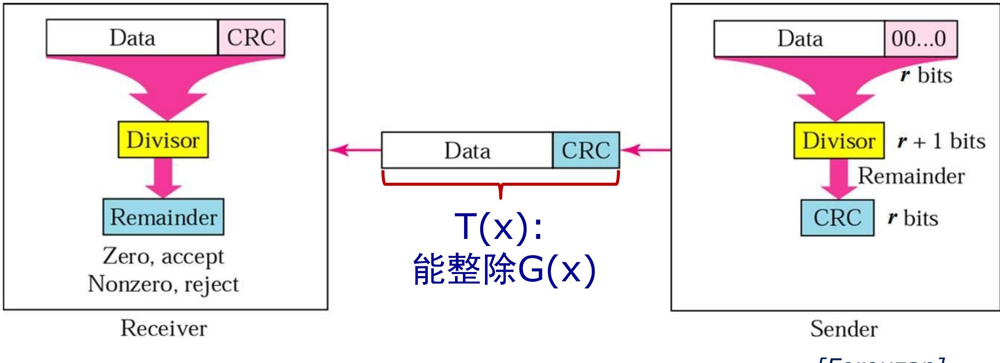

1. 生成多项式G(x)为r项，则需要先在m个数据为后补r个0
   `Append r zero bits to the low-order end of the frame (G(x) is of degree r)`
2. 用与$G(x)$对应的比特串去除上一步得到的比特串（模 2 除法，等同于异或运算）。通过这种运算得到余数，该余数就是用于校验的冗余信息。
   `Divide the bit string corresponding to G(x)`
3. 将结果于n位相加，得到传输字码T(x)
   `T(x): Subtract the remainder from the bit string`

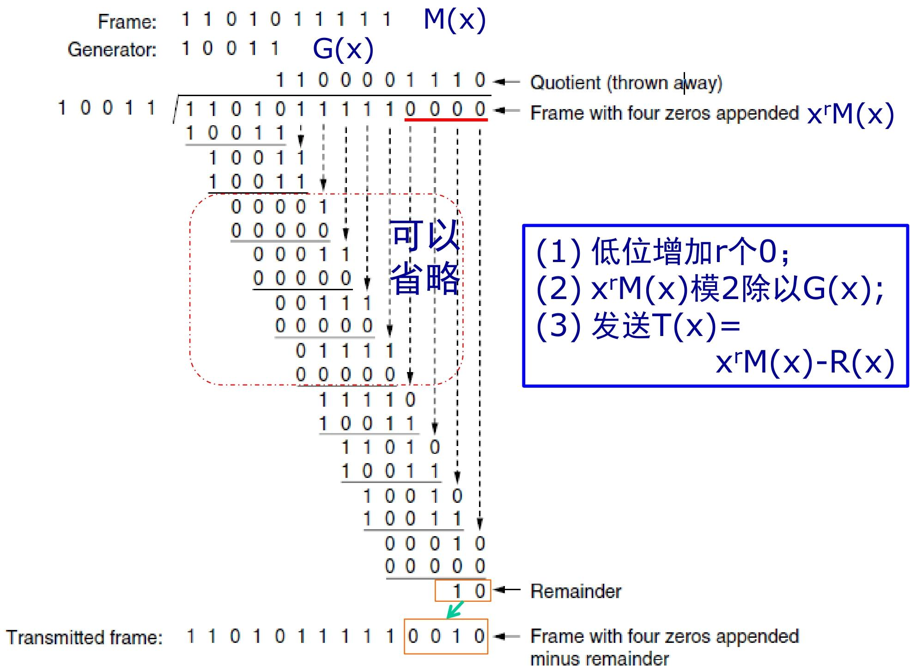

- **传输错误情况**：当传输过程中出现错误时，接收方接收到的不是发送方发出的$T(x)$对应的比特串，而是$T(x) + E(x) $，其中$E(x)$代表由于传输错误引入的多项式。
- **校验计算**：接收方计算$[T(x) + E(x)] / G(x)$ 。因为发送方计算的$T(x)$是能被\(G(x)\)整除的（即$T(x)/G(x)$ 的结果为0 ），所以计算结果实际上是$E(x)/G(x) $。
- **错误检测结果**：如果传输错误对应的多项式$E(x)$恰好包含$G(x)$作为一个因式，那么E(x)/G(x)的结果为整数，这种情况下错误将无法被检测出来（会被忽略）；而其他的错误会使得$E(x)/G(x)$有余数，从而被检测到 。

综上就是：

接收方：

* 无错误：没有传出错误时,T(x)/G(x) = 0
* 有错误：结果为E(x)/G(x)，(E(x)表示错误多项式)
* 漏检：E(x)/G(x) 为整数

效果：

* **$r$个校验位：所有长度小于等于$r$的突发错误都可以被检测**
* 单比特错误：表示为$E(x)=x^i$
* 两个孤立单比特错误检测 ：两个孤立单比特错误的多项式E(x)=xi+xj=xj(xi−j+1)（i>j） 。当选择的生成多项式G(x)在最大帧长度内，对于任意k都不能整除xk+1时，就能检测到这类错误。
* 奇数个翻转比特错误检测 ：当x+1是生成多项式G(x)的一个因式时，能检测出所有由奇数个翻转比特组成的错误。因为若E(x)有奇数个项且能被x+1整除，E(1)=0 ；若E(x)有奇数个项且E(1)=1，就说明有错误。
* 长度大于r的突发错误 ：对于长度大于r的突发错误，错误帧被接受的概率是2−r 。因为r个校验位有2r种状态组合，错误恰好不被检测到的组合占比为2−r 。

#### Error Correcting or Detecting

* 低可靠信道：如无线网，会出现很多错，选择**纠错码**更好
* 高可靠信道：如光纤，使用 **检错码** ，并仅重传偶尔发现的错误，效率更高

### 小结

* 差错纠正方法
  * 纠错码：汉明码（海明码），纠正1比特翻转错误
    * 序号是2的幂次的位置放校验位，其它位置放数据位
    * 任何一个数据位的序号都可以写成2的幂次的和，即由对应的校验位进行奇偶校验；该位置的数据位出错时，必然会影响到对应校验位的校验结果
  * 检错码+重传纠错
    * 奇偶校验:检测单比特错误/奇数个比特错误，ASCII码使用
    * 交错校验:块数据使用，$n*k$矩阵,可检测出长度$≤n$的错误
    * CRC(循环冗余校验)
  * 检错情况
    1. 发送方：待校验数据补充r个0之后，对生成多项式进行模2除法,余数(r位)即为校验信息
    2. 接收方：待校验数据和校验信息一起，对生成多项式进行模2除法,余数不为0即认为有错

## Flow control(流量控制)

**流量控制的目的** ：确保发送方不会使接收方不堪重负，即防止缓冲区溢出。

两种方法：

* **基于反馈的流量控制（Feedback - based flow control）** ：接收方会向发送方反馈信息，告知发送方是否可以发送更多数据，或者至少让发送方了解接收方的状态。这种流量控制方式下有两种方法：
  * **停止等待协议（Stop - and - Wait）** ：发送方每次只发送一帧数据。
  * **滑动窗口协议（Sliding Window）** ：发送方每次可以发送多帧数据。
* **基于速率的流量控制（Rate - based flow control）** ：协议内置了一种机制，在不依赖接收方反馈的情况下，限制发送方的传输速率，这部分内容将在网络层中学习。

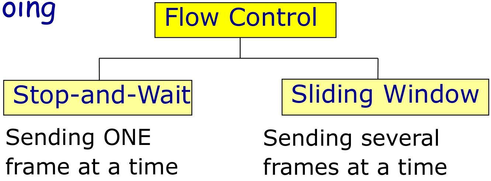

### 基本协议（Elementary Protocols）

* 理想的单工协议（A Utopian Simplex Protocol ），这是一种假设在无差错、无干扰的理想信道条件下的单方向数据传输协议。
* 无差错信道的单工停止等待协议（A Simplex Stop-and-Wait Protocol for an Error-Free Channel ），在无差错信道中，发送方发送一帧数据后，等待接收方的确认，收到确认后再发送下一帧。
* 有噪声信道的单工协议（A Simplex Protocol for a Noisy Channel ），用于处理信道中存在噪声，可能导致数据出错的情况。

### 滑动窗口协议（**Sliding Window Protocols**）

* 一位滑动窗口协议（A One-Bit Sliding Window Protocol ），窗口大小为 1，发送方和接收方通过窗口来控制数据的发送和接收。
* 回退 N 帧协议（A Protocol Using Go Back N ），发送方可以连续发送多个帧，若某个帧出错，发送方需要回退 N 个帧重新发送。
* 选择重传协议（A Protocol Using Selective Repeat ），当某个帧出错时，只重传出错的那一帧，而不是像回退 N 帧协议那样重传多个帧。

# 基本/初级协议 Elementary Protocols

## Protocol 1: Utopian Simplex Protocol（乌托邦）

假设条件：

* **信道特性** ：信道是单工的
* **无差错传输** ：信道是无差错的
* **接收端缓存** ：接收方的缓冲区大小是无限的，不用担心缓冲区溢出问题。
* **始终连接**：the transmitting and receiving network layers are always ready

`No need of error control and flow control `该协议不需要进行差错控制（error control）和流量控制（flow control）

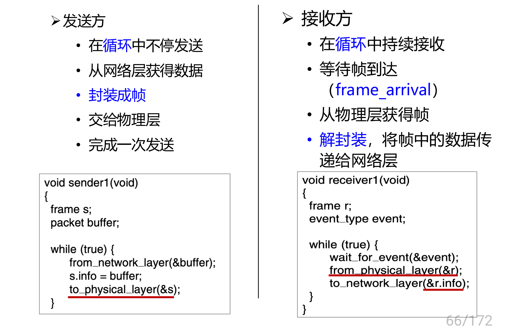

`frame s` 是分装成帧的结构体，其结构如下：

```cpp
typedef struct{
    frame_kind kind;
    seq_nr seq;
    seq_nr ack;
    packet info;
}frame;
```

## Protocol 2:Simplex Stop-and-Wait Protocol for an Error-Free Channel 无错信号停等协议

假设条件：

* **信道特性** ：信道为单工
* **无差错传输** ：信道无差错
* **接收端缓存** ：接收方的缓冲区大小有限

因此：

* **无需差错控制** ：因为信道无差错，所以不需要进行差错控制。
* **需要流量控制** ：由于接收方缓冲区有限，为防止缓冲区溢出，流量控制是必要的。

### 停止等待机制（Stop-and-wait）

* 发送方发送一帧数据后，进入等待状态。
* 接收方收到数据帧后，发送一个确认帧（ACK，dummy fame）给发送方。
  * **流量控制机制** ：接收方可以通过不发送确认帧来停止数据流量
* 发送方收到确认帧后，才会发送下一帧数据。

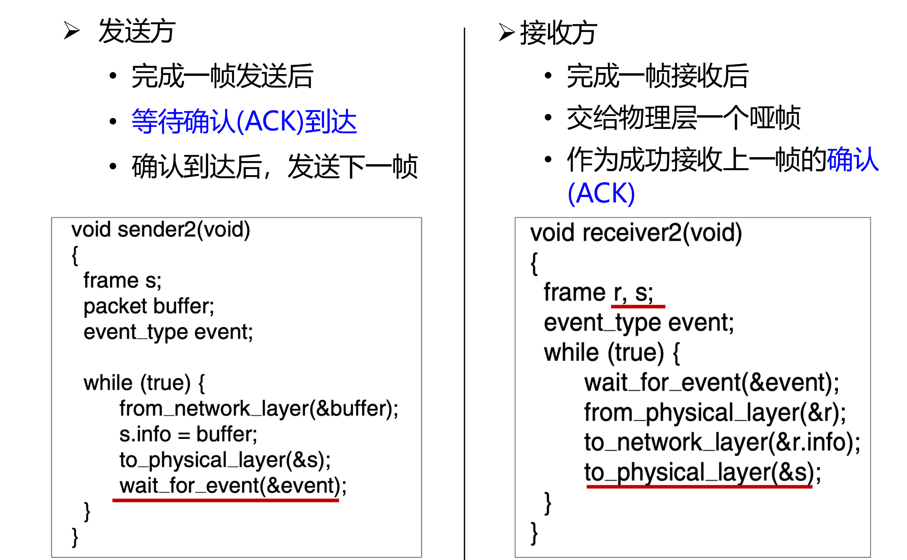

* **结束标识：**“EOT” 表示传输结束（End Of Transmission），用于告知对方数据传输完毕
* 整个过程中，“WT = Wait time” 表示等待时间，即发送方发送数据后等待接收方确认的时间间隔 。

#### 问题

##### 数据帧损坏情况

* 接收方通过循环冗余校验（CRC）检测到帧错误后，会丢弃该帧。
* 发送方在超时（timing out）后，会重传（retransmits）该帧。

##### 数据帧丢失情况

* **数据帧丢失** ：发送方未收到接收方针对该数据帧的确认，在超时后会重传此数据帧。
* **确认帧（ACK frame）丢失** ：发送方因为没收到确认帧，在超时后也会重传对应的 数据帧。 这些情况表明，在不可靠信道中，仅依靠协议 2 原本的机制，会因为帧的损坏和丢失导致重传，影响传输效率和可靠性 。

### 解决方案 Solutions: using Sequence Number

* **序列号的作用** ：区分首次接收的帧还是重传的帧
  * 具体做法是在每个帧的头部添加一个序列号。
* **不同层所需序列号的最小位数** ：
  * **数据链路层** ：最少需要 1 位来表示序列号，这样就有两个序列号（0 和 1）。因为停止等待协议中，利用 0 和 1 交替的序列号就能区分当前帧是新发送的还是重传的。
  * **传输层** ：由于传输的数据量通常更大、更复杂，需要更大的编号空间，例如 32 位。
* **相关协议** ：涉及到自动请求重传（ARQ，Automatic Repeat reQuest）协议，通过序列号配合 ARQ 能更好地实现可靠的数据传输。

#### Procedure of ARQ

* **错误检测（Error detection）** ：通过循环冗余校验（CRC）或帧校验序列（FCS）来判断帧是否损坏，同时也能检测到帧是否丢失。若 CRC/FCS 校验不通过或帧未接收到，就认为出现错误。
* **肯定确认（Positive acknowledgment）** ：接收方会向发送方返回确认帧（ACK），但不一定每收到一帧就立即返回一个 ACK，可能会累积一定数量的帧后再发送。
* **发送方超时重传（Retransmission by sender after timeout）** ：发送方发送数据帧后启动定时器，若在超时时间内未收到 ACK，就会重传数据帧。为了避免接收方接收重复帧，会使用序列号（Sequence number）来检测重复帧。
* **否定确认（Negative acknowledgment，可选）** ：接收方可以返回否认帧（NAK），表示数据帧接收错误，发送方收到 NAK 后会重传相应的数据帧 。

## Protocol 3: Positive ACK with Retransmission(PAR) 停等协议

假设条件

* **信道特性** ：信道是单工的
* **可靠性** ：信道不可靠，在数据传输过程中可能出现错误或数据丢失
* **接收端缓存** ：接收方的缓冲区大小有限

协议的增强点

* **帧中的序列号** ：在数据帧中引入序列号，用于区分新发送的帧和重传的帧，避免接收方收到重复帧，也有助于按序接收和处理数据。
* **超时和重传机制** ：发送方发送数据帧后启动定时器，若在规定时间内未收到接收方的确认（ACK），就会重传该数据帧，以此来应对数据帧或确认帧丢失的情况，保证数据的可靠传输。

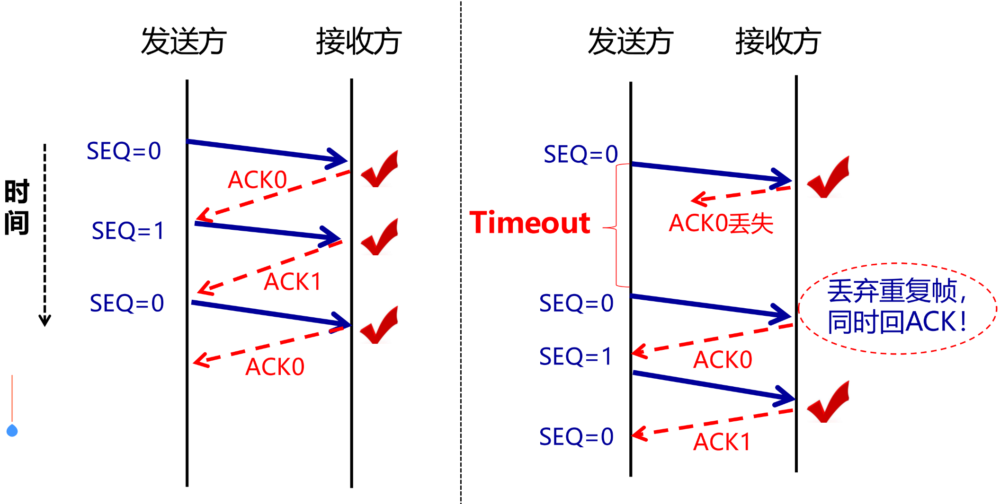

总结：

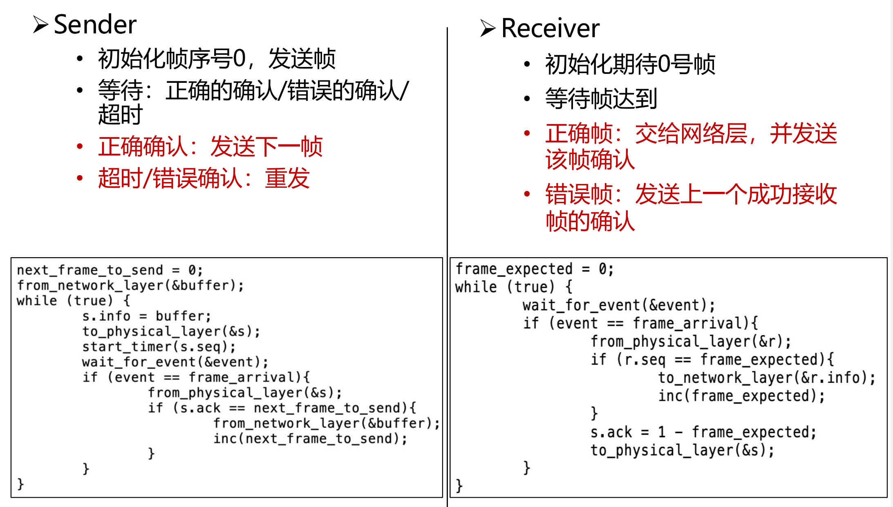

### 关于时钟

* **超时（Timeout）** ：如果超时时间间隔设置过短，发送方会在确认帧（ACK）还在传输途中时，就误以为数据未被接收而重传不必要的数据帧。虽然这些额外的数据帧不会影响协议的正确性，但会降低传输性能，增加网络开销。
* **关于否认帧（NAK）** ：
  * **是否必需** ：NAK 不是强制的。在一些 ARQ 协议实现中，可以仅依靠超时重传和 ACK 来保证数据的可靠传输。
  * **使用优势** ：当接收方明确检测到数据帧错误时，发送 NAK 能让发送方更快地知道哪些数据帧需要重传，相比单纯等待发送方超时重传，能更高效地利用网络资源，加快数据的正确传输。

### 单向传输数据的停止等待ARQ协议

* **发送方操作** ：在数据帧中添加校验字段，发送数据帧后启动超时定时器。
  * 收到确认帧（ACK）后发送下一帧，并重启定时器。
  * 若定时器超时，则重传刚发送的数据帧。
  * 此外，发送的数据帧和收到的 ACK 中都携带 1 比特的序列号，用于判断是否为重复帧。
* **接收方操作** ：对接收到的数据帧进行检错，出错就丢弃该帧；若校验无误，则发送 ACK。
  * 同时，接收方也根据数据帧中的序列号判断是否为重复数据帧。

该协议通过校验、超时重传、序列号等机制，保证了在不可靠信道上单向数据传输的可靠性。

## 回顾

|            | 乌托邦 协议 | 无错信道停等协议           | 有噪声信道停等协议                                         |
| ---------- | ----------- | -------------------------- | ---------------------------------------------------------- |
| 信道条件   | 理想信 道   | 无差错信道                 | 数据帧会出错､丢失 确认帧会丢失                            |
| 通信模式   | 单工        | 单工                       | 单工                                                       |
| 协议功能   |             | 流量控制 ( stop-and-wait ) | 差错控制 : 检错码 + 重传 (Timer) 流量控制( stop-and-wait ) |
| 确认的作用 | 无需        | 通知 sender 发送下一帧     | 告知 sender 已经正确收到的 最后一帧的序号                  |
| 序号       | 无          | 无                         | 1 位数据帧序号和 ACK 序号                                  |
| 帧种类     | 数据帧      | 数据帧,确认帧              | 数据帧, ACK , NAK(option)                                  |

# 滑动窗口协议 Sliding Window Protocols

流水线协议/管道协议：允许发送方在没收到确认前连续发送多个帧。(滑动窗口协议的本质思想)

## Protocol 4: Illustration/Sliding Window of Size 1 双工通信

### 原则

* **全双工**数据发送，允许**捎带应答**(piggybacking)：减少网络中的额外开销
* **批量发送数据帧** ：发送方被允许一次发送多个数据帧，而不必每发送一个帧就等待确认
* **发送窗口限制** ：在收到确认（ACK）之前，发送方最多能发送 W 个帧，W 即发送窗口的大小
* **接收方缓存** ：接收方可以缓存多个帧，这样即使不能立即处理，也能暂存数据
* **序号循环使用** ：使用 n 比特来表示帧的序号
  * 帧按照模 $2^n$ 编号，范围是0到 $2^n-1$
  * 窗口大小不一定是最大值，可以根据网络状况和接收方的处理能力进行调整

#### 捎带应答/确认

**应答延迟策略** ：当接收方收到一个数据帧时，不会立即发送单独的控制帧（ACK，确认帧）来进行确认，而是等待，直到网络层传递下一个数据包

**应答附着方式** ：等到发送下一个数据帧时，接收方会将确认信息（ACK）附着在即将发出的数据帧中，利用帧头中的 ACK 字段来携带确认信息

### 发送窗口&接收窗口

* **发送窗口** ：
  * 发送方在任何时刻都会维护一个序号集合，这些序号对应的帧是可以立即发送出去的
  * 这些帧就处于发送窗口内
  * 发送窗口的大小决定了在收到确认信息（ACK）之前，发送方最多能发送的帧数
* **接收窗口** ：
  * 接收方同样会维护一个接收窗口，窗口内的序号代表着接收方当前可以接收的帧
  * 只有序号落在接收窗口内的帧才会被接收并处理，不在窗口内的帧会被丢弃或暂存
  * 接收窗口大小反映了接收方的缓存和处理能力

### 大小为1的滑动窗口

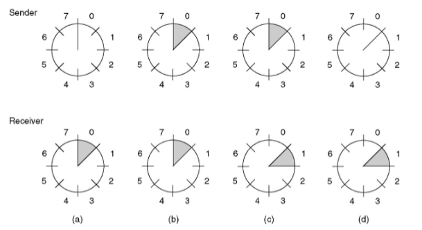

滑动窗口大小为 1 且使用 3 位序号时的工作过程：

* **初始窗口（a）** ：发送方和接收方的窗口都未包含任何帧。发送方可以准备发送序号范围内（0 - 7，因为是 3 位序号，$2^3=8$）的帧。
* **发出第一帧（b）** ：发送方发送了一帧，此时发送窗口内包含了已发送但未确认的这一帧。接收方等待接收该帧，其窗口状态也相应变化，准备接收特定序号的帧。
* **收到第一帧（c）** ：接收方成功收到该帧，接收窗口滑动，准备接收下一帧（序号加 1 的帧），同时可能会准备发送确认信息（ACK）。
* **收到第一个 ACK（d）** ：发送方收到确认信息后，发送窗口滑动，允许发送下一个帧，此时发送方可以继续发送新的帧。

### 具体流程

* **发送方操作** ：
  * 发送方在数据帧中添加校验字段，用于接收方检测数据传输是否出错。
  * 发送数据帧后启动超时定时器，若在规定时间内未收到确认，就重传该数据帧。
    * 另外，数据帧带有发送序号，可帮助接收方判断是否为重复帧
    * 发送方也能根据 ACK 序号判断 ACK 是否重复。
* **接收方操作** ：
  * 接收方收到数据帧后进行检错，出错就丢弃
  * 若校验无误且不是重复帧，则提交给网络层，并发送确认帧（ACK），也可在回传的数据帧中捎带确认

### 问题：效率低

在500/520或96%的时间内，发送方都处于阻塞状态（即等待ACK），只用到4%的带宽

## Protocol 5 :GO Back N(GBN) 回退N步协议

### 原则

* **窗口缓存功能** ：
  * 发送窗口：缓存待发送以及已发送但未确认的帧
  * 接收窗口：缓存接收到的帧
  * 通过窗口大小控制未确认的帧数
    * 发送方在收到 ACK 前可发送多个帧
    * 实现流水线（pipelining）传输
* **差错处理** ：
  * 若接收方检测到帧有差错，会丢弃出错帧及后续所有到达的帧，直至正确收到重发的原出错帧
  * 发送方则需回退，并重传出错帧及其后续的全部帧

### Cumulative ACK 累计确认

不必对收到的分组逐个发送确认，而是对**按序到达**的最后一个分组发送确认

[](http://s20.ulna520.top:4000/image/%E8%AE%A1%E7%AE%97%E6%9C%BA%E7%BD%91%E7%BB%9C%E7%AC%AC%E4%B8%89%E7%AB%A0--%E6%95%B0%E6%8D%AE%E9%93%BE%E8%B7%AF%E5%B1%82_20250315_094457/1742626943379.png "1742626943379")

当用3 bit来存储接收窗口和发送窗口时，总共可用的序号有：8个

由于需要避免发送窗口与接收窗口重叠:

* 发送窗口为0~6，大小为7
* 接收窗口只有一个大小

### 错误情形

1. **帧损坏：**
   1. 接收方检测为i号帧有错
   2. 丢弃i号帧及后面收到的所有帧
   3. 发送方超时重发i号帧及后面的所有已发帧
2. **ACK损坏：**
   1. 接收方收到i号帧，发送ACK(i)，ACK丢失
   2. 由于ACK是累积的，下一个ACK(i+n)可能在发送方超时之前到达，因此不需要重传
   3. 如果发送方超时，重发i号帧及后面的所有已发帧

Channel efficiency 信道效率：520/520=100%、Pipelining(流水线)

#### 例子：

1. 帧丢失：

   * 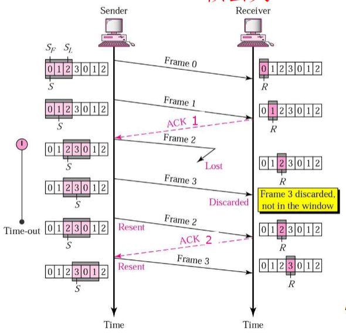
   * 接收方先后收到帧0到2，然后发送ACK(0)到ACK(2)，然后收到帧4到6，但是由于没有收到帧3，所以收到后续帧后依然发送ACK(2)
2. ACK丢失：

   * 接收方收到帧0~6 并且返回ACK(0)到ACK(6)，ACK(3)丢失后，发送可以通过ACK(6)确定接收方已经正确收到了所有的帧。不再进行重复发送

### 最大发送窗口问题

使用n位序号时，窗口大小在0~$2^n-1$之间

所以当发送位超过$2^n$时，丢失ACK后接收方不能判断重复帧

**原则：**对于 n 位序号，最大发送窗口$W_T≤2^n−1$

避免序号循环使用时出现的帧识别混淆问题

## Protocol 6:Selective Repeat 选择重传(ARQ)

- **最大窗口大小**：
  - 为避免序号混淆，选择重传协议的最大窗口大小不超过序号范围的**一半**。
  - 使用n位序号时，序号范围是0到$2^{n}-1$，发送窗口$W_T$和接收窗口$W_R$需满足$W_T + W_R \leq 2^{n}$，且$W_T \geq W_R$。
  - 实际中，通常设置$W_T = W_R = 2^{n - 1}$
- **接收方缓存**：接收方所需的缓存数量=窗口大小，而不是序号范围

### 对于协议5的改进

#### ACK Timer

* **工作机制** ：
  * 启动：当一个按序的数据帧到达后，会通过 start_ack_timer 启动一个辅助定时器。
  * 确认：如果在这个辅助定时器超时之前没有反向流量（即没有可以携带确认信息的其他数据帧传输），就会单独发送一个 ACK 帧（确认帧） 。
  * 停止：一旦出现反向流量，ACK 定时器就会停止
* **超时时间特点** ：辅助定时器的超时时间明显短于用于数据帧超时的定时器。

#### NAK机制

NAK 帧是接收方发现问题时向发送方发送的用于请求重传的帧。当接收方有理由怀疑出现错误时，就会发送 NAK 帧给发送方

* **怀疑出错的情况** ：
  * 接收到损坏（damaged）的帧。
  * 接收到的帧不是期望接收的帧。
* **避免重复请求重传** ：接收方会记录是否已经针对某个帧发送过 NAK，以此来避免对同一帧多次发出重传请求 。

# 协议总结

- **协议1**：理想信道，无需流量控制。假设信道无差错、无丢帧，数据可无阻碍传输。
- **协议2**：无差错信道，采用停止等待协议。接收方收到数据后发送确认（ACK），发送方在收到ACK前等待，确保数据可靠传输。
- **协议3**：无差错但帧可能丢失的信道。引入定时器和1比特序列号，发送方发送数据后启动定时器，若超时未收到ACK则重发，序列号用于区分新帧和重发帧。
- **协议4**：1比特滑动窗口（停止等待），支持全双工通信，使用捎带技术（Piggybacking），即在数据帧中捎带确认信息，提高信道利用率。
- **协议5**：回退N帧（Go Back N）滑动窗口协议。发送窗口大小大于1，接收窗口大小为1。对于n比特序列号（SN），发送窗口大小 $W_T \leq 2^n - 1$ 。若接收方未正确收到某帧，发送方需重传该帧及之后的所有帧。
- **协议6**：选择重传（Selective Repeat）滑动窗口协议。发送窗口和接收窗口大小都大于1。对于n比特序列号，通常发送窗口大小 $W_T$ 和接收窗口大小 $W_R$ 都等于 $2^{n - 1}$ 。引入ACK定时器和否定确认（NAK），仅重传出错的帧，后续正确到达的帧可缓存，提高传输效率 。

|          | 乌托邦协议                 | 无错信道停等协议                   | 停等协议                             | 1 比特滑动窗口协议                                 | GoBackN                                              | 选择重传                                   |
| -------- | -------------------------- | ---------------------------------- | ------------------------------------ | -------------------------------------------------- | ---------------------------------------------------- | ------------------------------------------ |
| 信道条件 | 理想信道                   | 无错信道                           | 无错但帧可能丢失的信道               | 无错但帧可能丢失的信道                             | 无错但帧可能丢失的信道                               | 无错但帧可能丢失的信道                     |
| 协议功能 | 无流量控制                 | 流量控制                           | 差错控制、流量控制                   | 差错控制、流量控制                                 | 差错控制、流量控制                                   | 差错控制、流量控制                         |
| 通信模式 | 单工                       | 单工                               | 单工                                 | 双工                                               | 双工                                                 | 双工                                       |
| 确认方式 | 无                         | 接收方发送ACK                      | 接收方发送ACK                        | 捎带确认（Piggybacking）                           | 捎带确认（Piggybacking）                             | 捎带确认（Piggybacking）或单独发送ACK      |
| 序号     | 无                         | 无                                 | 1比特序列号                          | 1比特序列号                                        | n比特序列号                                          | n比特序列号                                |
| 窗口尺寸 | 无窗口概念                 | 发送窗口=1，接收窗口=1             | 发送窗口=1，接收窗口=1               | 发送窗口=1，接收窗口=1                             | 发送窗口$W_{T} \leq 2^{n}-1$ ，接收窗口$W_{R}=1$ | 发送窗口$W_{T}=W_{R}=2^{n - 1}$          |
| 信道效率 | 最高（理论上无损耗）       | 低（发送方需等待确认才能继续发送） | 低（发送方需等待确认，存在超时重传） | 较高（全双工且捎带确认提高了效率）                 | 较高（可连续发送多个帧）                             | 高（仅重传出错帧，减少不必要重传）         |
| 帧种类   | 仅数据帧（假设）           | 数据帧、ACK帧                      | 数据帧、ACK帧                        | 数据帧、ACK帧（捎带在数据帧中）                    | 数据帧、ACK帧（捎带在数据帧中）                      | 数据帧、ACK帧、NAK帧                       |
| 典型协议 | 无实际对应（理想化概念）   | 简单停等协议                       | 改进的停等协议（引入定时器和序列号） | 类似HDLC（高级数据链路控制）的简化版本（部分特性） | HDLC等                                               | HDLC（部分实现采用）                       |
| 适用场景 | 理论研究场景（实际不存在） | 低负载、对可靠性要求不高的低速链路 | 低速、对可靠性有一定要求的链路       | 全双工、对实时性要求不高的低速链路                 | 高负载、对可靠性要求较高的链路                       | 高负载、对可靠性和传输效率要求都很高的链路 |

# Performance of sliding window protocols

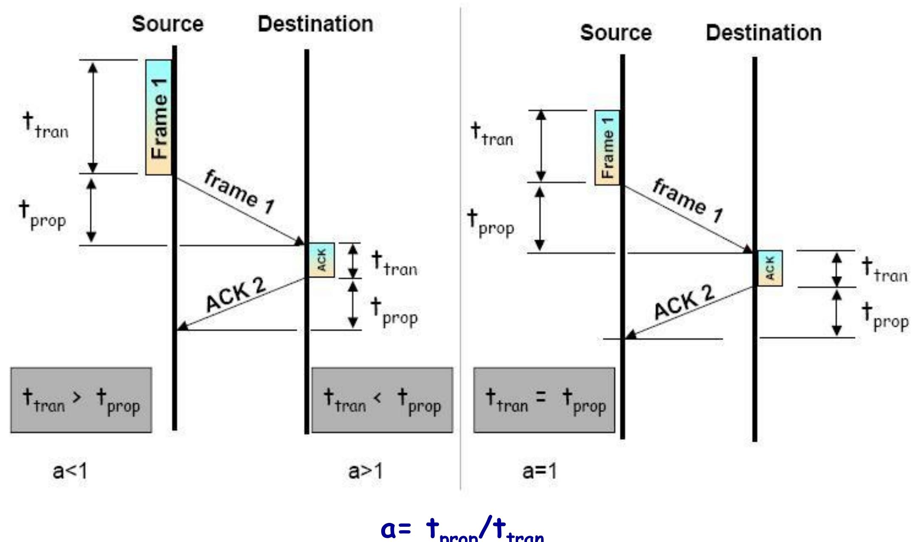

* $t_{tran}$：帧传输时间（发送时间），把一帧数据从源端发送到传输介质上所需时间，公式为 $t_{tran}=\frac{L}{R}$
* $t_{prop}$：传输时间，帧在传输介质上从源端传播到目的端所需时间，公式为 $t_{prop}=\frac{d}{v}$
* $a = \frac{t_{prop}}{t_{tran}}$：传播时间与传输时间的比值 ，用于衡量不同传输场景特性，又称为带宽时延积 Bandwidth-delay product

## 时间

### 帧传输时间（$t_{xfr}$ ）

- **定义**：接收方接收整个帧所需的时间 。
- **公式**：$t_{xfr}=t_{tran}+t_{prop}+t_{queue/switching}$  。其中：
  - **$t_{tran}$** ：帧传输时间，计算公式为 $t_{tran}=\frac{number\ of\ frame\ bits[bits]}{data\ rate[bps]}$ ，即帧的比特数除以数据传输速率，反映将帧从源端发送到传输介质上花费的时间。
  - **$t_{prop}$** ：传播时间，计算公式为 $ t_{prop}=\frac{link\ length[m]}{v_{prop}[m/s]}$ ，即链路长度除以信号在链路中的传播速度，代表帧在传输介质中从源端传播到目的端的用时。
  - $t_{queue/switching} $：排队/交换时间，指帧在网络设备（如路由器、交换机）中排队等待处理以及进行交换操作所花费的时间 。

### 往返时间（RTT ）

- **定义**：数据帧从源端发送到目的端，再收到目的端返回的确认帧（ACK）所经历的总时间 。
- **特性**：当数据帧和ACK帧经过不同链路传输时 ，往返时间可能不是单向延迟的两倍 。因为不同链路的$ t_{tran}$、$t_{prop} 等参数可能不同，导致往返路径上的总延迟不能简单按单向延迟乘以2来计算。 这些概念对于评估网络性能、设计网络协议（如TCP的拥塞控制等）有着重要意义。

### 无差错停等协议

总时长：$T_F = t_{tran}+t_{prop}+t_{proc}+t_{ack}+t_{prop}+t_{proc}$

$T_{F}$ : The time to send one frame and receive an acknowledgement

$t_{tran }$ : time to transmit a frame

$t_{prop }$: propagation time from Source to Destination

$t_{proc }$ : processing time

$t_{ack }$ : time to transmit an acknowledgement.

#### 当假设 $t_{proc}$（处理时间）和 $t_{ack}$（确认帧传输时间）相对可忽略时

$$
U=\frac{t_{tran }}{2 t_{prop }+t_{tran }}=\frac{1}{1+2 a}
$$

$$
where a=\frac{ propagation time }{ transmission time }
$$

Bandwidth-delay product:在单程传播时延的 时间内,信道可以容纳多少位数据

#### 线路利用率（Line Utilization）

* Channel capacity is b bits/sec
* Frame size l bits
* Round-trip propagation time R sec（往返时间总合）

$$
\frac{\frac{l}{b}}{\frac{l}{b}+R}=\frac{l}{l+b R}
$$

If \(1<b R\) , the efficiency will be less than 50 percent

当 l<bR 时，效率低于 50%（当帧大小相对往返传播时间与信道容量的乘积较小时，发送方大部分时间处于等待确认状态，信道空闲时间长，线路利用率低 。）

#### Stop-and-wait with error

p：出错概率

重传次数：$N_{r}=\sum_{i=1}^{\infty} i p^{i-1}(1-p)=\frac{1}{1-p}$

$$
U=\frac{T_{tran }}{N_{r}\left(T_{tran }+2 T_{prop }\right)}=\frac{1-p}{1+2 \alpha}
$$

#### 滑动窗口大小

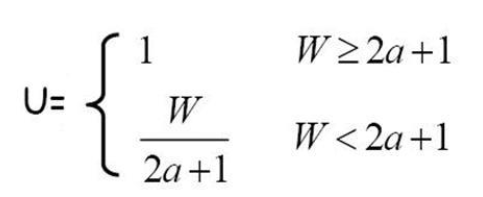

### Performance of Error-Free Sliding-Window Flow Control: Piggybacking 捎带确认

Piggybacking: (捎带确认/搭载ACK)

在捎带确认机制下，由于反向数据帧（携带确认信息 ）也需要传输时间，所以在分析性能时，反向流量（数据帧 ）的传输时间必须被考虑进去。

$$
U=W/(2a+2) = W/2(a+1)
$$

## 协议性能

1. **停等协议（Stop - and - wait ）**
   - **无差错信道**：信道利用率 $U = \frac{1}{1 + 2a}$ ，其中 $a=\frac{T_{prop}}{T_{tran}}$ （传播时间与传输时间的比值 ）。由于发送方每发送一帧都要等待确认，传播时间相对越长（a 越大 ），等待时间占比越高，信道利用率越低。
   - **有差错信道**：信道利用率 $U=\frac{1 - p}{1 + 2a}$ ， $p$ 为帧出错概率。帧出错概率 $p$ 越大，需要重传的次数越多，信道利用率越低。
2. **Go - Back N和Selective Reject（无差错情况 ）**
   - 当 $W\geq2a + 1$ 时，信道利用率 $U = 1$ ，此时窗口大小足够大，能充分利用链路，发送方持续发送帧，链路被填满，达到最高效率。
   - 当 $W<2a + 1$ 时，信道利用率 $U=\frac{W}{2a + 1}$ ，窗口大小小于理想值，发送方会有等待时间，信道利用率与窗口大小成正比，与传播时间和传输时间的关系（a ）成反比。
3. **捎带确认（Piggybacking ）**
   - 信道利用率 $U=\frac{W}{2(a + 1)}$ ，考虑了反向数据帧（携带确认信息 ）的传输时间，相比其他情况，分母增加了一个与传输时间相关的系数，导致在相同窗口大小 $W$ 下，信道利用率相对更低。

# Example Protocols

## 点到点链路（Point to point links）

* One sender, one receiver 仅涉及一个发送方和一个接收方
* Address may not be necessary 通信双方固定，地址信息并非必需
* Reliable communication
* Sample protocols: HDLC, PPP…

### HDLC (High-Level Data Link Control) (高级数据链路控制)

基本概念：

* Primary station(主站)
  * 负责控制整个数据链路的操作。
  * 它发出的帧（数据包）被称为  **命令 (Commands)** 。
  * 尤其在多点配置中）负责维护与每一个从站之间的独立逻辑连接。
    [](http://ipv6.ulna520.top:4000/image/%E8%AE%A1%E7%AE%97%E6%9C%BA%E7%BD%91%E7%BB%9C%E7%AC%AC%E4%B8%89%E7%AB%A0--%E6%95%B0%E6%8D%AE%E9%93%BE%E8%B7%AF%E5%B1%82_20250315_094457/1743057040724.png "1743057040724")
* Secondary station(从站)
  * **运行在主站的控制之下。**
  * **它发出的帧被称为**  **响应 (Responses)** ，通常是回应主站发来的命令。
    [](http://ipv6.ulna520.top:4000/image/%E8%AE%A1%E7%AE%97%E6%9C%BA%E7%BD%91%E7%BB%9C%E7%AC%AC%E4%B8%89%E7%AB%A0--%E6%95%B0%E6%8D%AE%E9%93%BE%E8%B7%AF%E5%B1%82_20250315_094457/1743057063300.png "1743057063300")
* Combined station(复合站)
  * 这种站既可以发送命令，也可以发送响应。
  * 它结合了主站和从站的功能，通常用于平衡配置（例如两个对等站之间的点对点通信）。
    [](http://ipv6.ulna520.top:4000/image/%E8%AE%A1%E7%AE%97%E6%9C%BA%E7%BD%91%E7%BB%9C%E7%AC%AC%E4%B8%89%E7%AB%A0--%E6%95%B0%E6%8D%AE%E9%93%BE%E8%B7%AF%E5%B1%82_20250315_094457/1743057073501.png "1743057073501")

#### HDLC帧的基本格式

* Synchronous transmission 同步传输
* Bit-oriented, bit stuffing for transparent transmission 零比特填充

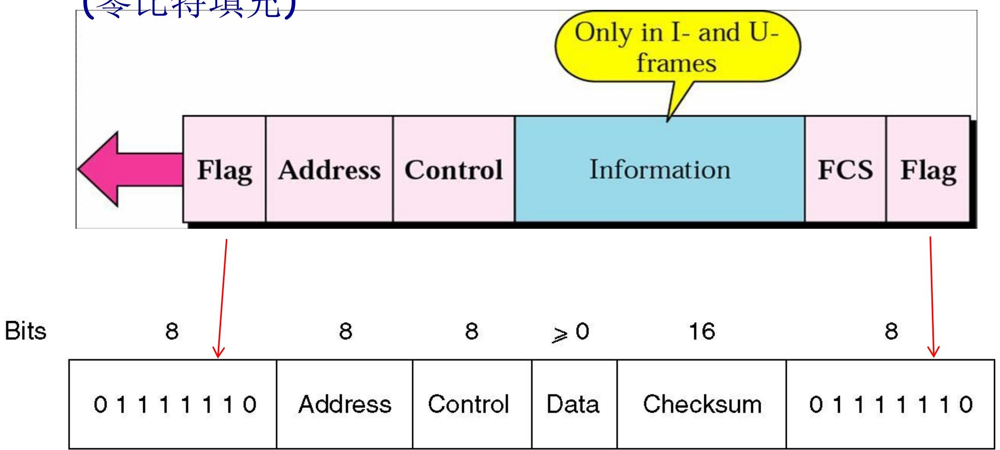

#### HDLC的三种帧

三种不同类型的帧的控制信号在Control信息段中

* I-frame 信息帧:An information frame (INFO)
* S-frame 监控帧：A supervisory frame (RR/RNR/REJ/SREJ)
* U-frame 无序号帧: An unnumbered frame (SABM/UA/DISC/FRMR)

#### I-frame

I-frame 的第一个bit为0：

[](http://ipv6.ulna520.top:4000/image/%E8%AE%A1%E7%AE%97%E6%9C%BA%E7%BD%91%E7%BB%9C%E7%AC%AC%E4%B8%89%E7%AB%A0--%E6%95%B0%E6%8D%AE%E9%93%BE%E8%B7%AF%E5%B1%82_20250315_094457/1743057786832.png "1743057786832")

#### S-frame

S-frame 的前两个bit为 `10`

[](http://ipv6.ulna520.top:4000/image/%E8%AE%A1%E7%AE%97%E6%9C%BA%E7%BD%91%E7%BB%9C%E7%AC%AC%E4%B8%89%E7%AB%A0--%E6%95%B0%E6%8D%AE%E9%93%BE%E8%B7%AF%E5%B1%82_20250315_094457/1743057862116.png "1743057862116")

RR：Reveiver Ready

* ACK frame used to indicate(表示) the N(R) frame expected
* 这个帧主要用于没有 **反向流量** (reverse traffic)可以 **捎带** (piggybacking)时。

RNR：Reveiver Not Ready

* 这个帧确认收到的所有帧，但是不包括N(R)，同时告诉发送方停止发送。

REJ：Reject 拒绝接收

* REJ 表示检测到传输错误。
* 其中的 N (R) 字段指示没有被正确接收的 **第一个帧** ，也就是需要重传的帧。
* 发送方需要重传从 N (R)  **开始的所有未确认帧** 。

SREJ: Selective Rejective 选择性拒收

* SREJ 意为 **仅要求重传由 N (R) 指定的帧** 。

#### U-frame

U-frame 开头两个bit为 `11`，用于控制链路本身，如呼叫、确认和断开连接等控制。

### SLIP – Serial Line Internet Protocol(串行线IP)

### PPP (Point-to-Point Protocol)

#### PPP vs. HDLC

##### Point-point link vs. Multiple configurations

##### Byte oriented vs. Bit oriented

* **PPP** ：是面向字节的协议
  * 当数据中出现与控制字符相同的字节时，采用字节填充技术
* **HDLC** ：是面向比特的协议
  * 采用比特填充技术。当连续出现一定数量（通常是 5 个）的 1 时，自动在后面插入一个 0

##### Connectionless unacknowledged service vs. Reliable connection - oriented service

* **PPP** ：提供无连接无确认服务。它不建立端到端的连接
* **HDLC** ：可提供可靠的面向连接服务。在数据传输前先建立连接，传输过程中对数据进行确认、差错控制等操作

##### PPP compared with HDLC


1. Simpler（PPP更简单）
   * PPP在设计上相对HDLC更为简洁，没有过于复杂的机制 。比如HDLC有多种链路配置模式、严格的面向比特操作等，而PPP专注于基本的点到点链路功能，实现起来更简单直接。
2. What are enhanced（PPP增强的方面）
   * **Working with numerous network layer protocols**：PPP能够与众多网络层协议协同工作。它通过网络控制协议（NCP）组件，可以灵活适配不同的网络层协议，如IP、IPX等 ，使得在不同网络层协议环境下都能正常传输数据。
   * **Negotiation of connections**：PPP支持连接协商。在链路建立阶段，通信双方可以通过链路控制协议（LCP）协商链路的相关参数，如最大接收单元（MRU）等，确保链路以合适的参数运行 。
   * **User authentication**：PPP具备用户认证功能。它可以使用密码验证协议（PAP）或挑战握手认证协议（CHAP）等方式，对链路两端的用户身份进行验证，增强了链路的安全性 。
   * **Negotiation of data compression**：PPP允许进行数据压缩协商。双方可以协商采用何种数据压缩算法，如Stac、Predictor等，以减少数据传输量，提高链路传输效率 。
   * **Physical layer can be asynchronous or synchronous**：PPP在物理层的适应性更强，既可以工作在异步模式（如通过调制解调器连接 ），也可以工作在同步模式（如高速专线连接 ），相比HDLC在物理层模式上更为灵活。
3. What are removed（PPP去除的方面）
   * **Error correction**：HDLC有内置的差错控制机制来纠正传输错误，而PPP去除了这一功能。PPP认为在现代网络环境中，底层物理链路和上层协议（如TCP ）可以承担差错控制任务，所以不专门在链路层进行纠错，以简化协议 。
   * **Flow control**：HDLC有流量控制机制来协调发送方和接收方的数据传输速率，防止接收方因来不及处理数据而丢包。PPP去除了流量控制功能，因为它更注重简单高效的数据传输，对于流量控制可以依赖上层协议（如TCP ）来实现 。
   * **Sequence number**：HDLC使用序列号来对帧进行编号，以便实现可靠传输、差错控制和流量控制等功能。PPP去除了序列号，由于它不进行链路层的可靠传输、差错控制和流量控制，所以不需要通过序列号来管理帧的顺序等 。

##### PPP: Multiple network protocols

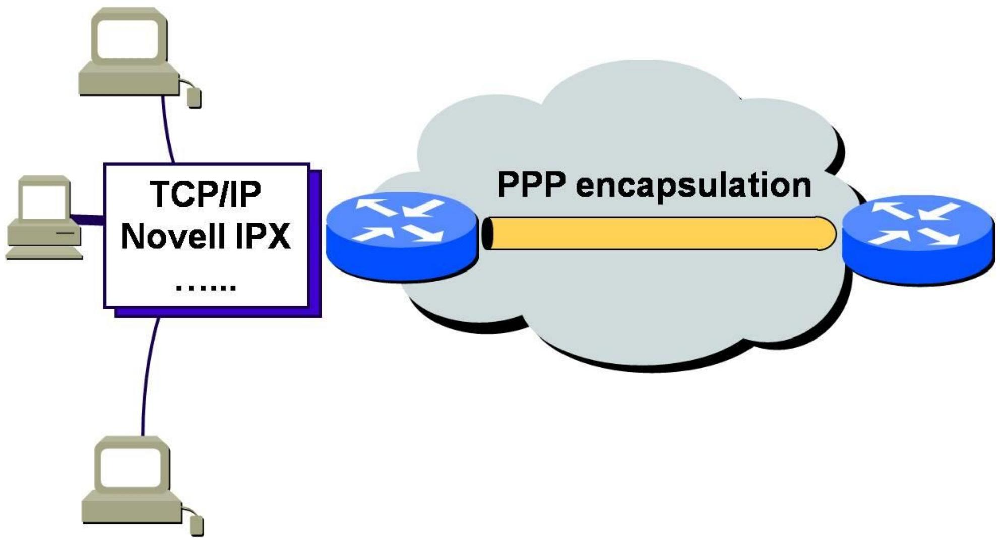

##### PPP: Sub-layers

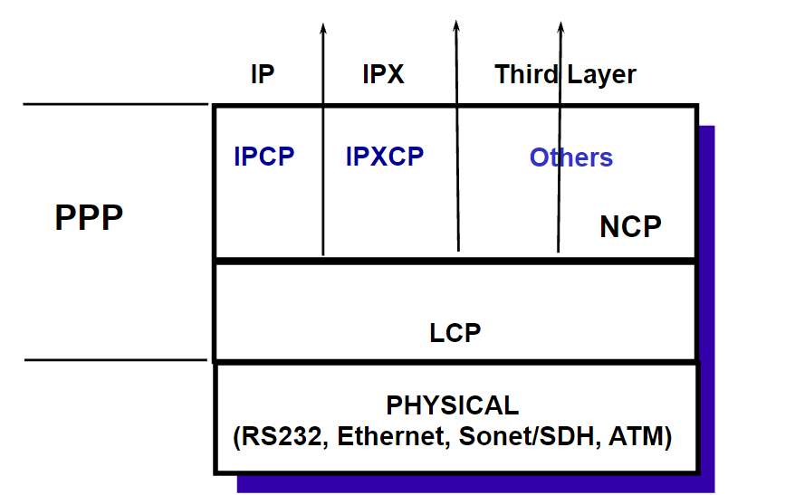

* 物理层

  * **同步电路（Synchronous circuits）** ：采用面向比特的编码方式 ，像在 SONET（Synchronous Optical Network，同步光纤网络）上运行 PPP 。SONET 是一种用于光纤通信的标准，面向比特编码能高效处理连续的比特流。
  * **异步电路（Asynchronous circuits）** ：采用面向字节的编码方式 。适用于一些对实时性要求不那么高、数据以字节为基本单元传输的场景。
  * **PPPoE（PPP over Ethernet）** ：即以太网承载 PPP 协议，常用于 ADSL（Asymmetric Digital Subscriber Line，非对称数字用户线路 ）宽带接入，它允许在以太网上传输 PPP 帧 。
* 链路控制协议层

  * **错误检测（Error detection）** ：利用 CRC（Cyclic Redundancy Check，循环冗余校验 ）算法来检测链路传输过程中是否出现错误，通过对数据计算校验码并在接收端验证，能有效发现数据传输错误 。
  * **允许认证（Permits authentication）** ：支持在链路建立阶段对通信双方进行身份认证，确保连接的安全性，防止非法接入 。
* 网络控制协议层

  * 负责协商网络层选项，比如协商分配 IP 地址 ，使得 PPP 链路两端的设备在网络层能够正确通信，根据不同的网络层协议（如 IPv4、IPv6 等）进行相应配置 。

##### PPP used in dial-up access to Internet

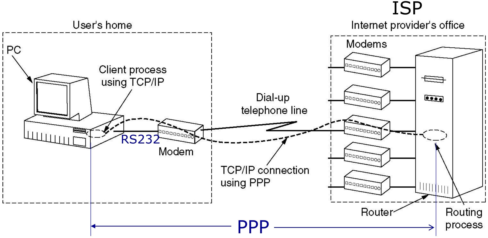

在用户端和 ISP 端之间建立的 TCP/IP 连接中使用 PPP 协议 。PPP 协议在此起到链路控制和网络层协议配置等作用

例如通过 LCP（链路控制协议）进行链路建立、配置和测试，通过 NCP（网络控制协议）协商网络层参数（如 IP 地址分配 ），使得家庭个人计算机能够作为互联网主机（A home personal computer as an Internet host）接入互联网 。

##### PPP for PPPoE: Frame Format 用于 PPPoE（以太网承载 PPP 协议 ）的 PPP 帧格式


## Broadcast links(广播链路)

* Many senders and potential receivers 存在多个发送方和潜在接收方
* Accessing a shared medium 设备需要访问共享介质来发送数据
* Addressing is necessary 必须使用地址来区分不同发送方和接收方
* Sample protocols: CSMA/CD, CSMA/CA……
