*"No longer the Aizen you know," hm...? I'm afraid you've been deluded, Abarai-kun...The 'Aizen Sousuke' you knew never existed to begin with.*——*Bleach*

# Position and Function of Physical Layer 位置和功能

* `The lowest layer in our protocol model.` 协议最底层
* `It defines the electrical, timing and other interfaces by which bits are sent as signals over channels.` 它定义了电气、定时和其他接口，通过这些接口，比特以信号的形式在通道上发送。

# Basic concepts on data communications 基础概念

Channel 信道 ：传送信息的媒介（介质）

Bandwidth 带宽 ：`The Width of the frequency range transmitted without being strongly attenuated (Hz)` 在没有被强烈衰减的情况下所传输的频率范围的宽度（单位为赫兹）

#### 分类

模拟带宽：指介质能够传输的模拟信号的频率范围

数字带宽：数字带宽以 bps（比特每秒）来表示，代表单位时间内可以传输的数据量

### Low-pass and Band-pass 低通和带通

在电子学、信号处理等领域，低通滤波器允许低频信号通过，而阻止高频信号；带通滤波器则允许一定频率范围内的信号通过，阻止频率范围外的信号。

#### 低通

在数字通信 `(Digital transmmision)` 中，数字传输是指将数字信号从一个地方传输到另一个地方。低通通道是一种允许低频信号通过而阻止高频信号通过的通道。**数字传输通常需要低通通道**是因为数字信号通常包含一定的低频成分，而低通通道可以保证这些低频成分能够顺利通过，从而保证数字信号的完整性和准确性。

#### 带通

模拟传输 `（Analog transmission) `是一种传输方式，在通信系统中，通过连续变化的信号来表示信息。

带通信道是一种通信信道，它只允许特定频率范围内的信号通过。模拟传输可以利用带通信道来传输模拟信号，例如音频信号、视频信号等。在模拟传输中，信号的幅度、频率或相位等参数会随着时间连续变化，而带通信道可以对这些信号进行传输和处理。

### Baud Rate vs. Bit Rate 波特率与比特率

**Bit Rate(bps)**: The number of bits transmitted per second 每秒传输比特数量，数据传输的速度和质量

**Baud Rate(Baud)**: The number of signal units per second required to represent bits 每秒传输的信号单元数量

不知名解释：波特率是指单位时间内传输的码元符号的个数，单位是波特（Baud）。码元是指在数字通信中，用时间间隔相同的符号来表示一位二进制数字。

Baud Rate=1/T T is the period of a signal unit 波特率等于 1 除以 T，其中 T 表示信号的周期。

$Bit Rate = Baud Rate*(log_2V)$ 其中V是信号的有效状态数(电平级数)

### 时延(Delay)

从向网络中发送数据块的第一位开始，到最后一位数据被接收所经历的时间

时延的组成：发送时延、传播时延、/结点处理时延、排队时延/（等待随机性）

#### 发送时延(Transmission Delay) 可计算

设备发送一个数据块所需要的时间（数据块长度/信道带宽)

$R=link bandwidth (bps)$
$L=packet length (bits)$
$time to send bits into link = L/R$

#### 传播时延(Propagation Delay) 可计算

信号通过传输介质的时间。

$d = length of physical link$
$s = propagation speed in$
$medium (~2x108 m/sec) propagation delay = d/s$

#### 节点处理时延(Nodal Processing Delay)

交换机/路由器检查数据、选路的时间

* check bit errors
* determine output link

#### 排队时延(Queuing Delay)

在交换机/路由器中排队等待的时间

* time waiting at output link for transmission
* depends on congestion level of router

### 综合

* 信道容量(Channel Capacity)：信道的最大数据率

  * 信道容量是信道在理想条件下能够达到的最大数据传输速率，它由信道的物理特性（如带宽、信噪比等）决定，是一个理论上的上限值，为网络的数据传输能力设定了根本的限制。
* 吞吐量(Throughput)：网络容量的度量，表示单位时间内网络**可以传送**的数据位数（bps）

  * 吞吐量是在实际网络运行中，单位时间内成功传输的数据量。由于网络中存在各种干扰、噪声、传输错误、协议开销、设备性能等因素，吞吐量通常会小于信道容量。
* 负载(Load): 表示单位时间内**注入(进入)网络**的数据位数（bps）

  * 负载可以在一定范围内接近信道容量，但不能超过信道容量。如果负载持续超过信道容量，网络性能会急剧下降，数据丢失和延迟会变得非常严重。
* 传播速度(Propagation Speed)：通信线路上，信号单位时间内传送的距离（米/秒）
* 误码率BER(Bit Error Rate)：信道传输可靠性指标

  * P= 传送错的位数 /总的传送位数

### Simplex, Half-duplex, Full-duplex 单工、半双工、全双工

* 单工是指数据只能在一个方向上传输，例如广播，只能从广播电台传向听众，听众不能向广播电台发送信息。
* 半双工是指数据可以在两个方向上传输，但不能同时进行。比如对讲机，一方说话的时候另一方只能听，不能同时说话。
* 全双工是指数据可以同时在两个方向上传输。像电话，双方可以同时说话和聆听。

### 传输

Serial transmission(串行传输) vs. Parallel transmission（并行传输）

Asynchronous Transmission(异步传输) vs. Synchronous Transmission（同步传输）

#### Transmission Impairment 传输损伤

* Signal received may differ from signal transmitted 接收到的信号可能与发送的信号不同。
* Analog - degradation of signal quality 模拟信号质量的下降
* Digital - bit errors 数字比特错误

##### Attenuation(衰减) and attenuation distortion （失真）

`Attenuation: loss of signal power through distance` 信号在传输过程中，随着距离的增加而出现的信号功率的损失，但通过**信号放大器**可以解决

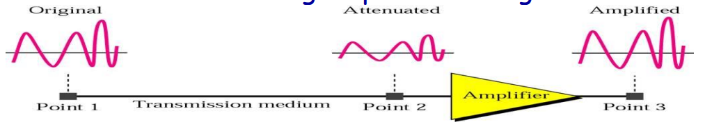

##### Delay distortion(时延失真)

`Delay Distortion: Propagation velocity varies with frequency `由于不同频率成分的传播速度不同而产生的失真现象（波形叠加）

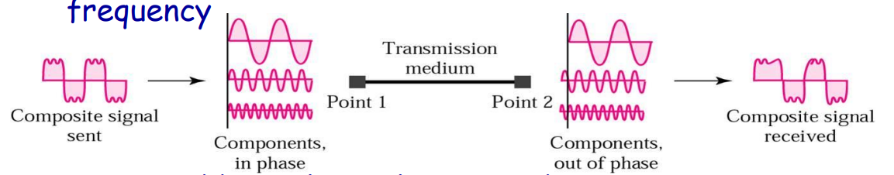

##### Noise(噪声)

`Noise: Additional signals inserted between transmitter and receiver` 在发射器和接收器之间插入的额外信号

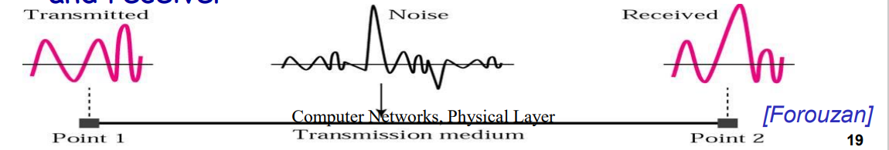

# Theoretical basis for data communications 数据通信的理论基础

### Fourier Transform（傅里叶变换）

### 信道的比特率、周期、基频与谐波

### Bandwidth 带宽

* No transmission facility can transmit signal without losing some power 任何设备在传输的过程中都会损失一些功率
* All transmission facilities diminish different Fourier components by different amounts 所有的传输设备以不同的程度削弱不同的傅里叶分量

带宽定义：

* Range of frequencies transmitted without being strongly (0.5) attenuated is called bandwidth 传输时不会被强烈（0.5）衰减的频率范围被称为带宽。
  * 带宽通常用来衡量一个通信系统能够传输的频率范围大小
* bandwidth is a physical property of the transmission medium, depends on  Construction, thickness, length
  * 带宽在这里指的是在特定传输介质中能够传输数据的能力范围。
* 单位：
  * Hz(模拟信道允许通过的最高信号频率）
  * bps(信道的最大数据率）

### Capacity for noiseless channel(无噪声信道)

#### Nyquist Bit Rate(奈奎斯特公式，1924)

$bit rate = 2 × bandwidth × log_2 V$

### Noisy Channel: Shannon Capacity（香农公式，1948）

#### Shannel’s theorem

$Capacity = bandwidth\times \log_2(1 + \frac{signal\_power}{noise\_power})$

#### SNR (Signal-to-Noise Ratio)

$S/N_{\mathrm{db}} = 10 \log_{10} S/N{}$

# Transmission medium 传输介质

## Magnetic Media 磁性介质

磁性介质通常是指利用磁性材料来存储数据或信息的媒介，例如硬盘、磁带等

## Guided

### Twisted Pair(双绞线)

Most common transmission media, Can be used for transmitting either analog or digital signals 最常见的传输介质，可以用于传输模拟信号或数字信号

#### 结构

consists of two insulated copper wires, about 1 mm thick, the wires are twisted together in a helical form (螺旋状)

这由两根绝缘的铜线组成，铜线大约 1 毫米厚，这些电线以螺旋状绞在一起。

When the wires are twisted, the waves from different twists cancel out, so the wire radiates less effectively

当电线绞合在一起时，来自不同绞合处的波相互抵消，所以电线的辐射效率降低。

带宽取决于以下因素：

* 电线的粗细，即电线的厚度。
* 铜芯的纯度。
* 传输的距离。
* 每米的绞合次数。

### Coaxial Cable（同轴电缆）

`It has better shielding and greater bandwidth than UTP(span longer distances at higher speed)sulv `它比无屏蔽双绞线（UTP）有更好的屏蔽性能和更大的带宽（在更高的速度下跨越更长的距离）。

两种同轴电缆被广泛使用：

* 50-ohm cable, is commonly used when it is intended for digital transmission
* 75-ohm cable, is commonly used for analog transmission and cable television

high bandwidth(1GHz）

excellent noise immunity 卓越的抗噪声能力

### Fiber Cables 光纤

Side view of a single fiber.

End view of a sheath with three fibers.

#### Fiber Optic Networks 光纤网络

`A fiber optic ring with active repeaters `一种带有有源中继器的光纤环

#### 光纤优势

High bandwidth

Lightweight

Security

### Power Line Communication 电力线通信

A network that uses household electrical wiring

## Wireless Transmission 无线传输

特点：

* Comparatively higher bit error rate 较高的误码率
  * 误码率是指在数据传输过程中，错误接收的码元数与传输的总码元数之比
* Longer propagation delay 较长的传播延迟
* Omni-direction vs. Uni-direction 全向与单向

### Electromagnetic spectrum 电磁频谱与在通信中的应用

#### Transmission Frequency Band 传输频带

在通信系统中用于传输信号的特定频率范围

* 大多数使用窄频带
* 一些使用扩频技术（蓝牙、无线局域网、码分多址等）

### Category of Wireless Transmission

#### Radio Propogation 无线电传播

无线电波在空间中的传播过程，包括从发射端到接收端的传输

（a）在甚低频（VLF）、低频（LF）和中频（MF）波段，无线电波沿着地球的曲率传播。
（b）在高频（HF）波段，它们从电离层反射。
（c）在甚高频（VHF）波段及以上，它们使用视距传输，不受电离层影响。

#### Microwave Transmission 微波传输

`Before fiber optic, microwaves formed the heart of the long-distance telephone transmission system` 在光纤出现之前，微波构成了长途电话传输系统的核心。

#### Politics of Electromagnetic Spectrum

##### National governments allocate spectrum

#### Infrared Transmission

* 广泛用于短距离通信；
* 具有一定的方向性，成本较低；
* 无法穿透固体物体；
* 运行红外系统无需政府许可证 。

#### Communication Satellites

通信卫星在天空中充当一个大型微波中继器

“Transponder (转发器)” 是通信卫星中的一个重要部件，它能够监听频谱的某一部分，放大输入的信号，然后在另一个频率上重新广播出去（下行波束），就像一个 “弯管”。

“Downward beams” 即下行波束，有宽波束和窄波束之分。宽波束能覆盖地球表面的很大一部分；窄波束即点波束，能覆盖几百公里的区域。

# Digital modulation and encoding 数字调制与编码

## Signal Encoding Techniques 信号编码技术

### Analog Signals Carrying Analog & Digital Data（承载模拟和数字数据的模拟信号）

* **模拟信号承载模拟数据** ：模拟数据本身就是连续变化的，模拟信号可以直接以连续变化的电磁波来表示这些模拟数据，两者的变化规律相匹配。
* **模拟信号承载数字数据** ：当要传输数字数据（由离散的 0 和 1 组成）时，需要通过调制技术将其加载到模拟信号上。常见的调制方式如移幅键控（ASK）、移频键控（FSK）、移相键控（PSK）等。这样，原本离散的数字数据就能够通过连续变化的模拟信号在信道中进行传输，到达接收端后再通过解调等操作恢复出原始的数字数据。

### Digital Signals Carrying Analog & Digital Data 数字信号承载模拟和数字数据

* **数字信号承载模拟数据** ：要让数字信号承载它，需先进行采样、量化和编码等操作。
* **数字信号承载数字数据** ：本身已是离散二进制形式的数字数据，可通过数字编码技术直接转换为数字信号。不同编码改变数字数据的电信号表示形式，使其适应传输信道特性，传输后接收端按对应编码规则还原原始数字数据。

### Baseband transmission vs Passband transmission 基带传输和带通传输

* Baseband signal: `Signals that run from 0 up to a maximum frequency` 基带信号是指频率范围从 0 到某个最大频率的信号
* Passband signal: `Signals that are shifted to occupy a higher range of frequencies. eg. wireless transmissions` 带通信号是指那些被移到较高频率范围的信号，在通信系统中，很多情况下由于传输介质的特性或实际应用的需求，信号不能直接以其原始的频率进行传输。带通信号就是通过调制的方式，将原始信号的频率范围进行搬移，使其占据较高的频率范围。

#### Baseband transmission: `In which the signals occupies frequencies from 0 to a maximum frequency`（主要了解编码规则）

在基带传输中，信号直接在信道上传输，不需要经过调制将其搬移到更高的频率范围 。

passband transmission : `In which the signals occupies a band of frequencies around the frequency of the carrier signal. `带通传输是指信号占据以载波信号频率为中心的一段频带范围的传输方式

##### Nonreturn-to-Zero-Level (NRZ-L)

* **信号电平表示** ：在 NRZ-L 编码规则里，“0” 用高电平来表示，“1” 则用低电平来表示 。
* **同步问题** ：NRZ-L 编码存在信号同步方面的缺陷。

##### Nonreturn-to-Zero Inverted (NRZI)

* **编码规则** ：以信号在每个比特时间间隔开始处是否发生跳变来表示数据。当表示 “0” 时，在间隔开始处没有电平跳变；当表示 “1” 时，在间隔开始处有电平跳变。
* **同步问题** ：与 NRZ-L 类似，NRZI 在遇到连续多个 “0” 时，由于没有电平跳变，接收端难以从信号中准确判断一个符号的结束和下一个符号的起始，容易出现信号同步问题

##### Manchester（曼彻斯特编码）

* **编码规则** ：在每个比特周期的中间都会有电平跳变。其中，从高电平跳变到低电平表示 “0”，从低电平跳变到高电平表示 “1”。
  * 每个比特中间的跳变既可以作为数据传输，又能为接收端提供时钟同步信息，便于接收端准确判断数据的起始和结束位置
  * 在每个比特周期的中间都有电平跳变，这种跳变既用于表示数据，又可以当作时钟信号。
* **带宽效率** ：其带宽效率为 50% ，意味着需要两个符号来表示 1 比特数据。相比其他编码方式，在传输相同比特率的数据时，曼彻斯特编码需要占用更宽的带宽。

##### ClockRecovery 时钟恢复

* `the receiver must know when one symbol ends and the next symbol begins to correctly decode the bits `在数据通信的基带传输过程中，接收端准确识别符号边界对正确解码数据至关重要
* 策略：
  * `send a separate clock signal to the receiver` 向接收端发送一个单独的时钟信号

    * 接收端根据这个单独的时钟信号来进行同步，以此确定数据的采样时刻。
  * 接收端根据这个单独的时钟信号来进行同步，以此确定数据的采样时刻。
  * `mix the clock signal with the data signal` 将时钟信号与数据信号混合

    * 这样接收端可以从混合的信号中提取出时钟信息，进而实现与发送端的同步。

###### Manchester

(a) Bit stream

(b) Non-Return to Zero (NRZ) (Clock that is XORed with bits)

(d) Manchester

曼彻斯特编码是**时钟信号与 NRZ 信号异或（XOR）的结果**，还给出了异或运算规则（X⊕0=X，X⊕1=X̅ ）。

- **编码规则**：“Transition in middle of each bit period”指在每个比特周期的中间会有电平跳变；“Low to high represents 1, High to low represents 0”表示电平从低到高的跳变代表二进制的“1”，从高到低的跳变代表“0”。
- **功能特点**：“Transition serves as clock and data”说明这种电平跳变不仅携带了数据信息，还起到了时钟信号的作用，接收端可以根据跳变来同步时钟，保证数据接收的准确性。
- **应用领域**：“Used by IEEE 802.3 LAN”表明曼彻斯特编码被应用于IEEE 802.3标准的局域网（LAN）中，用于数据的传输编码。

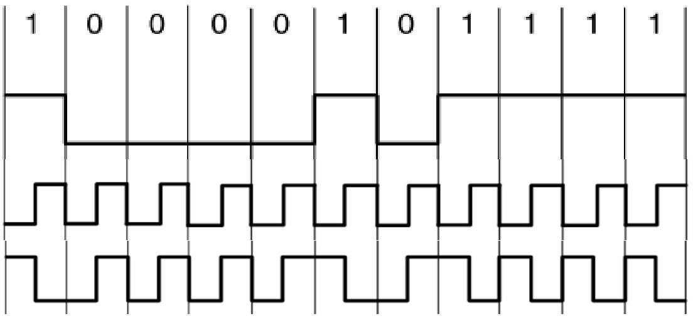

$X \oplus 0=X, X \oplus 1=\overline{X}$

$Clock⊕NRZ= Manchester$

`4B/5B never be a run of more than three consecutive 0s` 4B/5B 编码不会出现超过三个连续的 0 。

##### Bandwidth Efficiency

* 带宽是一种有限的资源，即使是有线信道也是如此。
* 为了在有限的带宽条件下传输更多的数据，一种可行的策略是采用多于两种的信令电平。
  * 传统的编码方式，如 NRZ - L 和 NRZI，通常只使用两种电平（高电平和低电平）来表示数据。但如果使用更多的信令电平，每个符号就能携带更多的比特信息。

NRZ need a bandwidth of at least B/2 Hz when the bit rate is B bits/sec (Nyquist rate: \($C=2 Hlog_{2} ~V$\) )(2bit/Hz) 在比特率为  比特 / 秒时，非归零码（NRZ）所需带宽至少为 B/2 赫兹的原因，涉及奈奎斯特速率公式 $C=2 Hlog_{2} ~V$（每赫兹 2 比特）

* C ：信道的最大数据传输速率（比特 / 秒），也就是比特率。
* H ：信道带宽（赫兹）。
* V  :  信号所取的离散值个数。

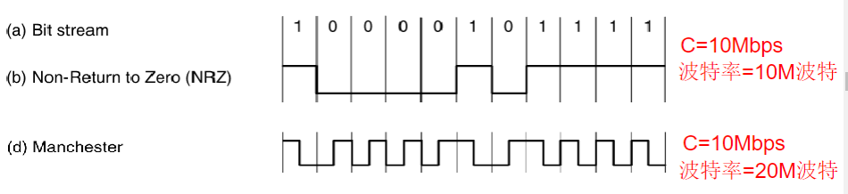

* `The bandwidth efficiency of Manchester is 50%` 曼彻斯特编码用 2 个符号传 1 比特，所以其带宽效率只有 50%。（一次周期用了两次信号变化）
  * Two symbols represent 1 bit
* `the number of signal levels does not need to be a power of two` 在一些编码方式中，信号电平数量（即离散值个数）通常是 2 的幂次方，但曼彻斯特编码主要依据电平跳变来表示数据，它的信号电平数量与是否为 2 的幂次方没有必然联系 。

##### Balanced Signals

* `Signals that have as much positive voltage as negative voltage even over short periods of time` 即使在短时间内，信号的正电压和负电压也一样多。
* `Have no DC electrical component `这种特性使得信号没有直流电气分量，因为直流分量是由电压的单向积累导致的。
  * `Strongly attenuate `信号在传输中出现的强度大幅降低的情况
  * `Capacitive coupling(电容耦合) passes only the AC portion of a signal.` 电容耦合在信号传输过程中，只允许信号的交流（AC）部分通过，而阻止直流（DC）部分通过。（电容的基本特性是 “隔直流、通交流”）

**Bipolar encoding**: use two voltage levels to represent a logical 1.(AMI) 双极性编码（Bipolar encoding），也称为交替标记反转（AMI，Alternate Mark Inversion ）

使用两个电压电平来表示逻辑 1。在传输数据时，逻辑 1 会交替使用正电压和负电压来表示，而逻辑 0 则通常用零电压表示。

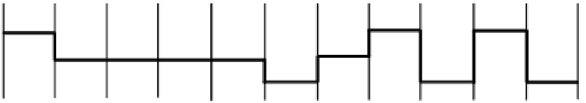

## Modulation 调制

* **调制的作用** ：`Placing a signal in a given frequency band is useful`将信号放置在给定的频段内很有用。原因包括：
  * `the frequency of transmission media does not start at zero`传输介质的频率范围不是从 0 开始；
  * `for wireless channel: sending very low frequency signals is not practical`对于无线信道，发送极低频率信号不现实；
  * `for wires: different kinds of signals can coexist on one channel`对于有线线路，不同种类的信号可以在同一信道中共存。
* **数字调制原理** ：`Digital modulation is accomplished by modulating a carrier signal sitting in the passband`数字调制是通过调制处于通带中的载波信号来实现的，
  * 载波信号
  * `modulate the amplitude, frequency, or phase of the carrier signal` 可以对载波信号的幅度、频率或相位进行调制。
* **调制设备** ：实现调制功能的设备是调制解调器（Modem） 。

### Modulations 调制波形

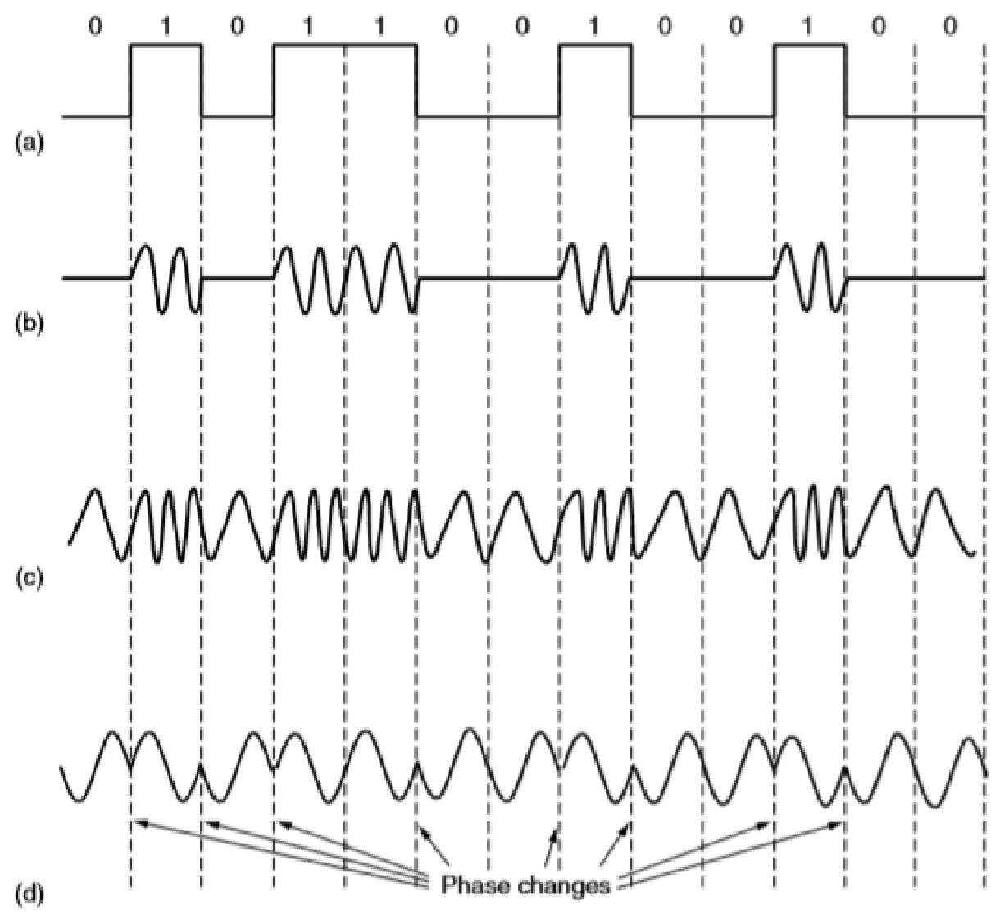

这张图展示了调制的几种类型及其波形：

- **二进制信号（a）**：用高电平和低电平分别表示数字信号中的“1”和“0” ，是基础的数字信号表示形式。
- **幅移键控（Amplitude shift keying，ASK）（b）** ：通过改变载波信号的幅度来表示数字信号。在图中，有载波信号出现时表示“1”，没有载波信号（即幅度为0）时表示“0” 。
- **频移键控（Frequency shift keying，FSK）（c）** ：通过改变载波信号的频率来表示数字信号。图中可以看到不同频率的载波信号分别对应不同的数字信号状态。
- **相移键控（Phase shift keying，PSK）（d）** ：通过改变载波信号的相位来表示数字信号，图中标注了“Phase changes”（相位变化），不同的相位对应不同的数字信息。

### Combination of modulation techniques 调制技术组合

* `Modems use a combination of modulation techniques to transmit multiple bits per baud` 调制解调器（Modems）采用多种调制技术相结合的方式，目的是在每波特（baud）的传输中传递多个比特的数据。
* **关键调制技术** ：

  * **QPSK（正交相移键控）QuadraturePhase Shift Keying** ：通过不同的相位变化来表示数据。
  * **QAM（正交幅度调制）Quadrature Amplitude Modulation** ：利用幅度和相位的组合来传输数据。
* **星座图（Constellation Diagram）** ：用于直观展示调制信号的状态。

  * **相位(phase)** ：图中**从原点到点的连线与正 X 轴的夹角 (angle)** 表示点的相位。
  * **幅度(amplitude)** ：**点到原点 (origin) 的距离表示幅度**。图中示例展示了 4 个点，分别对应不同的二进制组合（00、01、10、11） 。

# Multiplexing(复用)

## Frequency Division Multiplexing 频分复用

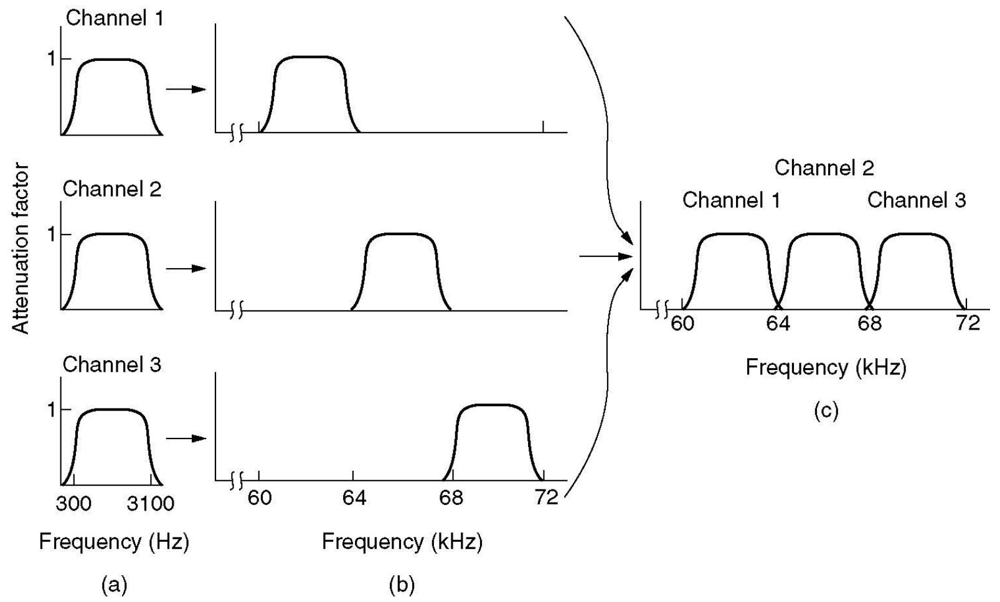

- **原始带宽（a）**：三个不同的信道（Channel 1、Channel 2、Channel 3）有各自的频率范围，如Channel 3的频率范围是300Hz - 3100Hz。这是信号原本占用的带宽情况。
- **频率提升后的带宽（b）**：各信道的带宽在频率上被提升到新的范围，为复用做准备，此时它们仍保持各自独立的频段。
- **复用信道（c）**：三个信道在不同的频段被组合到一起，形成一个复用信道。如Channel 1在60kHz - 64kHz，Channel 2在64kHz - 68kHz ，Channel 3在68kHz - 72kHz，不同信道在同一传输介质上占用不同频段同时传输信号。

## Wavelength Division Multiplexing 波分复用

在发送端，复用器将多种不同波长的光载波信号汇合在一起，并耦合到同一根光纤中进行传输；在接收端，解复用器把各种波长的光载波分离，再由光接收机进一步处理恢复原信号。

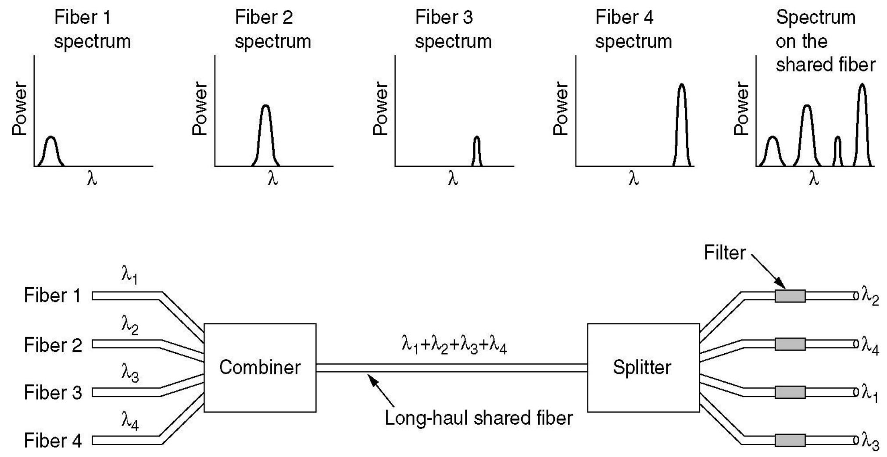

每个光纤承载不同波长（λ）的光信号，这些光信号的功率（Power）分布不同。最右侧是共享光纤（shared fiber）上的光谱，显示了多个不同波长的光信号复合在一起的情况。

通过合波器（Combiner）将这些不同波长的光信号合并到一根长距离共享光纤（Long-haul shared fiber）中传输。在接收端，通过分路器（Splitter）和滤波器（Filter）将不同波长的光信号分离出来，恢复成原来各个光纤的光信号。

## Time Division Multiplexing 时分复用

- **传输特点**：`Signals are transferred apparently simultaneously as sub-channels in one communication channel, but are physically taking turns on the channel.`信号看似同时在一个通信信道中作为子信道传输，但实际上在物理层面是轮流使用信道的。也就是说，多个信号不会同时占用信道，而是按照一定顺序依次传输。
- **时隙划分**：`The time domain is divided into several recurrent timeslots of fixed length, one for each sub-channel.`将时域划分为若干个固定长度的重复时隙（timeslots），每个子信道对应一个时隙。例如图中展示了4个设备（编号1 - 4）连接到复用器（MUX），复用器按照1、2、3、4的顺序将各设备的数据分配到时隙中传输，经过信道后，解复用器（DEMUX）再将数据还原到对应的设备上。

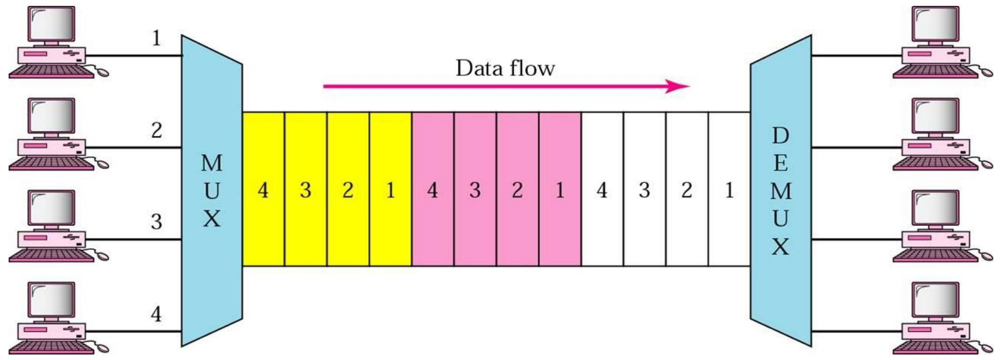

但是TDM Frames(复用帧)可能会引起资源的浪费，因为当有的设备已经不使用时，帧分配的时隙依旧存在

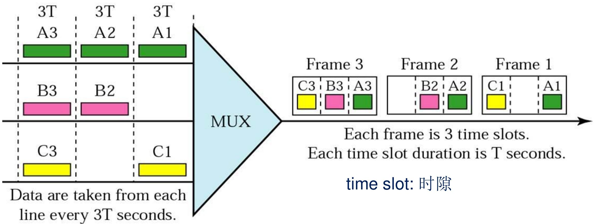

### Synchronous TDM vs. Statistical TDM 同步时分复用和统计时分复用

- **同步时分复用（Synchronous TDM）**：在每个时间周期内，为每个用户$（A、B、C、D）$固定分配一个时隙。无论该用户是否有数据传输，对应的时隙都会保留。如图中，每个周期都依次有 $A_1$、$B_1$、$C_1$、$D_1$ 这样固定顺序的时隙分配，即使某个用户无数据（如第二个周期中 A 用户无数据），其对应的时隙也会空闲，造成了一定的资源浪费。
- **统计时分复用（Statistical TDM）**：根据用户实际有无数据传输来动态分配时隙。只有当用户有数据（如 $A_1、B_1、B_2、C_2$）时，才会分配时隙，这样能有效利用信道资源，减少空闲时隙。但每个数据单元需要添加地址信息（蓝色方块），以便接收端能正确区分数据来自哪个用户。图中也展示了在某些周期中存在未使用的容量（Unused capacity），不过相比同步时分复用，整体资源利用率更高 （发送节奏不同，与异步一样，需要封装）

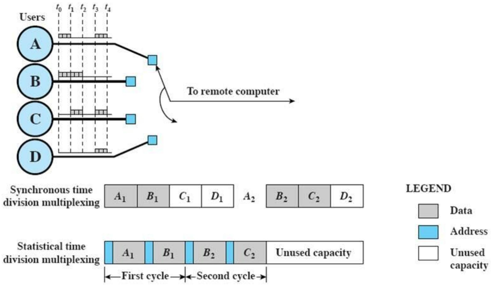

## CDM(码分复用)

* **基本性质** ：`A form of spread spectrum communication`码分复用是扩频通信的一种形式。
* **码分多址（CDMA）原理** ：`Code Division Multiple Access:Each station can transmit over the entire frequency spectrum all the time.`每个站点在任何时候都可以在整个频谱上进行传输。与频分多址（FDMA）和时分多址（TDMA）不同，FDMA 将频段划分给不同用户，TDMA 将时间划分为时隙分配给用户，而 CDMA 允许多个站点同时在整个频谱上传输信号，这些同时进行的传输通过**编码理论**来区分 `Multiple simultaneous transmissions are separated using coding theory.`，即每个站点被分配一个唯一的编码序列，接收端利用这些编码序列从混合信号中分离出属于自己的信号 。

# Physical network: PSTN 物理网络中的公共交换电话网络（Public Switched Telephone Network）

## Structure of the Telephone System

(a) **Fully-interconnected network（全互联网络）** ：在这种网络结构中，每一个节点（如电话用户终端或交换设备）都与其他所有节点直接相连。这意味着任意两个节点之间都存在直接的物理链路，无需通过其他中间节点转接通信。

(b) **Centralized switch（集中式交换机）**：在该结构里，存在一个中心交换机，所有的电话用户终端或其他交换设备都连接到这个中心交换机上。

(c) **Two-level hierarchy.（两级层次结构）** ：此结构将网络分为两个层次。通常是在本地设置端局（End office），端局连接众多的本地用户，然后端局再与高层的长途局（Toll office）相连。本地用户之间的通信优先在端局内部进行处理，如果是长途通信，则通过端局转接至长途局，再由长途局完成与其他地区端局的连接和通信。

### A typical circuit route for a medium-distance call (**中距离通话的典型电路路由**)

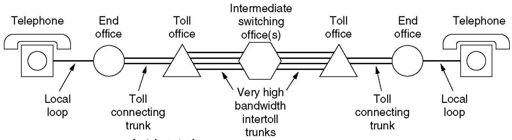

电话信号从一部电话出发，经本地环路（Local loop）到达端局（End office），再通过长途连接中继（Toll connecting trunk）到达长途局（Toll office），经过中间交换局（Intermediate switching office (s)），再通过另一个长途局和长途连接中继，最后经端局和本地环路到达另一部电话。

* **本地环路（Local loops）** ：`Analog twisted pairs going to houses and businesses`使用模拟双绞线连接家庭和企业。
* **中继（Trunks）** ：`Digital fiber optics connecting the switching offices`采用数字光纤连接各个交换局。
* **交换局（Switching offices）** ：包括端局、汇接局（Tandem office）和长途局，作用是将通话从一条中继线转移到另一条中继线。

## Switching(交换)

`In telephone system, switches interconnect telephone subscriber lines or virtual circuits of digital systems to establish telephone calls between subscribers. `在电话系统中，交换机（switches）用于互连电话用户线路或数字系统的虚电路（virtual circuits ），以便在用户之间建立电话呼叫。

具体来说，电话用户通过用户线路接入电话系统，当一个用户要呼叫另一个用户时，交换机根据被叫号码，在众多线路和虚电路中选择合适的路径，将两者连接起来，从而实现通话。

### Digital and Analog Transmission in PSTN (公共交换电话网（PSTN）中的数字和模拟传输)

**传输方式：**`The use of both analog and digital transmissions for a computer to computer call. Conversion is done by the Modems and Codecs. `在计算机到计算机的通话中，同时使用模拟和数字传输，转换由调制解调器（Modems）和编码解码器（Codecs）完成。

**传输路径及速率** ：计算机通过本地环路（模拟线路）连接调制解调器，然后信号到达编码解码器，经数字中继线路传输。到另一端时，信号经编码解码器，再通过模拟线路连接到接收方的调制解调器。

**编码解码器（Codec）** ：`8000 samples per second,1 sample = 8 bits (非线性编码)`每秒采样 8000 次，每个样本为 8 比特（采用非线性编码）

### Digitized Analog Signals （数字化模拟信号传输）

* **数字化语音信号** ：采用脉冲编码调制（PCM，Pulse Code Modulation）技术。
* **使用设备** ：Codec编码解码器(digitized analog signals)，用于对模拟信号进行数字化处理。
* **处理步骤**
  * **采样（Sampling）** ：`According to Nyquist theorem, the sampling rate must be at least 2 times the highest frequency.`依据奈奎斯特定理（Nyquist theorem），采样率必须至少是最高频率的 2 倍。
  * **量化（Quantizing）** ：`Dividing signal strength into levels linearly or logarithmically`将信号强度线性或对数地划分为不同等级。A 律算法用于欧洲和中国；μ 律（Mu Law）算法用于北美和日本。
  * **编码（Encoding）** ：图中未详细展开，通常是将量化后的信号转换为二进制代码。

#### 美日方案T1

一帧：24个通道+1bit

一个通道：8bit

一帧的数据大小：$24∗8+1=193bits$

电话信道的带宽：4000Hz，则需要最少样本数为8000.

所以得出速率为：8000*193 = 1.544Mbps

### 我国方案E1

32 channels,30 for user data ,2 for control data.

速率：$32∗8∗8000=2.048Mbps$

### From analog signal to PCM digital code （从模拟信号到脉冲编码调制（PCM）数字代码）

1. **采样** ：原始模拟数据（Analog data）经过 PCM 处理后得到采样后的模拟数据（Sampled analog data），这是将连续的模拟信号在时间上离散化的过程。
2. **量化** ：采样后的模拟数据进入量化（Quantization）模块，将信号幅度划分为不同等级，得到量化数据（Quantized data），图中示例有数值 127、34、287 。
3. **二进制编码** ：量化数据进一步进行二进制编码（Binary encoding），转换为二进制数据（Binary data），如 0001100000100110… 。
4. **线路编码** ：二进制数据经过线路编码（Line coding）后转换为适合传输的数字信号（Digital signal） 。 整个流程实现了模拟信号到 PCM 数字代码的完整转换。

### Modems （调制解调器）

* **调制技术** ：`Modems use a combination of modulation techniques to transmit multiple bits per baud (multiple amplitudes and multiple phase shifts)` 调制解调器结合多种调制技术，在每波特中传输多个比特，使用的技术包括相移键控（QPSK，Quadrature Phase Shift Keying）和正交幅度调制（QAM，Quadrature Amplitude Modulation） 。通过多种幅度和相移变化来承载更多信息。
* **采样及数据传输速率** ：调制解调器每秒采样 2400 次，致力于在每个样本中获取更多比特。

  * $V.32: 2400 baud * (5-1) bits = 9.6Kbps$
  * $V.32bis: 2400 baud * (7-1) bits = 14.4Kbps$
  * $V.34: 2400 baud * 12 bits = 28.8Kbps$
  * $V.34bis: 2400 baud * 14 bits = 33.6Kbps$
* **V.90 标准** ：速率为 56Kbps，常用于调制解调器与互联网服务提供商（ISP）之间的连接 。

### DSL: Digital Subscriber Lines (数字用户线)

Bandwidth versus distances over UTP3 for DSL

#### xDSL Services

* **xDSL 服务的目标** ：
* 需在现有的三类非屏蔽双绞线（UTP3）本地环路上运行。
* 不能影响用户现有的电话和传真机设备的使用。
* 数据传输速度必须远高于 56kbps 。
* 应保持始终在线的状态，采用按月收费的方式，而非按分钟计费。
* **ADSL** ：即非对称数字用户线（Asymmetric DSL），是 xDSL 服务中的一种类型 。

## ADSL（非对称数字用户线）

### ADSL: Discrete Multitone Modulation

* **信道划分** ：将 1.1MHz 的频谱划分为 256 个带宽为 4312.5Hz 的信道。
* **信道用途**
  * 第 0 信道（Channel 0）用于传统电话业务（POTS）。
  * 1 - 5 号信道不使用，目的是避免语音信号和数据信号相互干扰。
  * 从 Channel 6 开始的多个信道（如 Channel 6、Channel 30 等），采用正交幅度调制（QAM），每波特可传输 15 比特。
  * 剩下 250 个信道中，1 个用于上行控制，1 个用于下行控制，248 个用于传输用户数据。
  * 上行比特（Upstream bits）通过串并转换器（Serial/parallel converter）处理，下行比特（Downstream bits）通过并串转换器（Parallel/serial converter）处理，实现数据的传输与转换。
* **复用技术** ：采用频分复用（FDM）技术，将不同用途的信号分配到不同的频率信道上，实现同时传输 。

### ADSL Modulation Scheme （ADSL 的调制方案）

* **调制方案**
  * **采样率：**每个信道内采用类似于 V.34 的调制方案，**采样率**为 4000 波特。
  * **线路质量监控** ：持续监控每个信道的线路质量，并相应地不断调整数据速率。
  * **实际数据传输** ：实际数据通过正交幅度调制（QAM）发送，每波特最多可传输 15 比特。

### A typical ADSL equipment configuration ADSL设备配置

* **电话公司端局（Telephone company end office）** ：
  * **语音交换机（Voice switch）** ：处理语音通话信号。
  * **编码解码器（Codec）** ：对语音信号进行编码和解码。
  * **分离器（Splitter）** ：将语音信号和数据信号分离，使二者能在同一电话线上传输。
  * **数字用户线接入复用器（DSLAM，Digital Subscriber Line Access Multiplexer）** ：汇聚多个用户的 ADSL 连接，并将数据转发到互联网服务提供商（ISP） 。
* **用户端（Customer premises）** ：
  * **网络接口设备（NID，Network Interface Device）** ：是电话公司线路和用户内部线路的分界点。
  * **分离器（Splitter）** ：再次分离语音和数据信号，使电话和计算机能同时使用同一线路。
  * **ADSL 调制解调器（ADSL modem）** ：将计算机的数字信号与电话线上传输的模拟信号进行转换。
  * **电话（Telephone）** ：用于语音通话。
  * **计算机（Computer）** ：通过以太网（Ethernet）连接 ADSL 调制解调器上网 。
    本地环路（Local loop）则是连接电话公司端局和用户端的线路 。

## Time Division Multiplexing in PSTN 时分复用

**帧结构** ：一个帧（frame）为 193 比特，时长 125 微秒。一帧内包含 24 个信道（Channel）。每个信道每次采样传输 7 个数据比特（7 Data bits per channel per sample），第 8 比特用于信令（signaling），第 1 比特是成帧码（framing code） 。

更高等级载波：

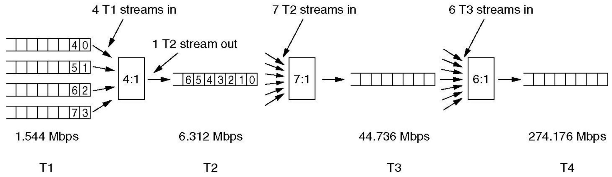

* **T1 到 T2** ：4 条速率为 1.544 Mbps 的 T1 数据流复用成 1 条 T2 数据流，复用比例为 4:1 ，得到的 T2 数据流速率为 6.312 Mbps。
* **T2 到 T3** ：7 条 T2 数据流复用成 1 条 T3 数据流，复用比例为 7:1 ，T3 数据流速率提升到 44.736 Mbps。
* **T3 到 T4** ：6 条 T3 数据流复用成 1 条 T4 数据流，复用比例为 6:1 ，最终 T4 数据流的速率达到 274.176 Mbps 。 这种复用方式逐步提升了数据传输速率，以满足更高的通信需求。

## 总结

* 调制技术:改变基带信号的频率
  * 典型技术:ASK,FSK,PSK,QPSK,QAM
  * 典型设备:Modem(2400baud), ADSL(4000baud)
* 复用技术:FDM,TDM,CDM,WDM
* 三个设备:
  * **数字发送器**---**线路编码技术**,数字基带信号,抗干扰､ 带宽效率
  * **调制解调器**---**调制解调技术**,信号频率变换,通带信号 ,长距离传输､有效利用带宽
  * **编码解码器**---**采样､量化､编码技术,**  将模拟信号数字化,将模拟信源的输出变为数字数据

# Physical network: Cable TV system 物理网络中的有线电视系统

### Structure of Cable TV System

* **系统类型** ：采用混合光纤同轴（HFC，Hybrid Fiber-Coaxial）技术。
* **拓扑结构** ：树状拓扑（Tree topology），属于广播网络（Broadcasting network） 。
* **组成部分** ：
* **区域有线电视前端（RCH，regional cable head）** ：通过接收天线（Picking antenna）收集信号，然后经分配集线器（Distribution hub）处理。
* **传输介质** ：使用高带宽光纤进行长距离传输，在光纤节点（Fiber node）处，信号转换到同轴电缆，再传输到各个用户端。传输过程中，双向放大器（Bidirectional amplifier）用于增强信号。
* **交换设备** ：交换机（Switch）在网络中起到数据交换和管理的作用 。

## Spectrum Allocation in Typical CATV System 有线电视（CATV）系统频谱分配

**信道特点** ：采用非对称信道（Asymmetric Channel）

* 下行数据调制采用 64 - QAM（正交幅度调制），理论数据速率为 30Mbps。
* 上行数据调制采用 QPSK（正交相移键控） ，理论数据速率为 12Mbps。

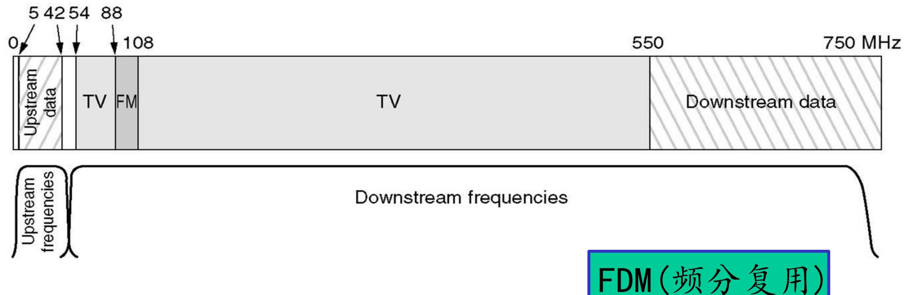

## ADSL vs. Cable

ADSL：独占DSL

Cable：共享电缆

# Circuit Switching vs. Packet Switching

## Circuit switching(电路交换)
