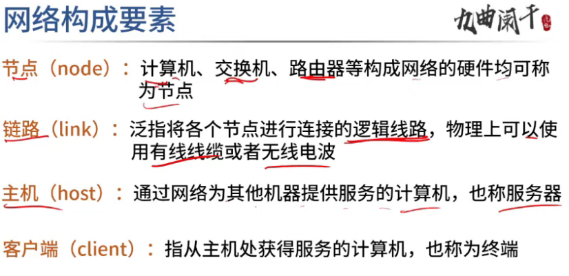
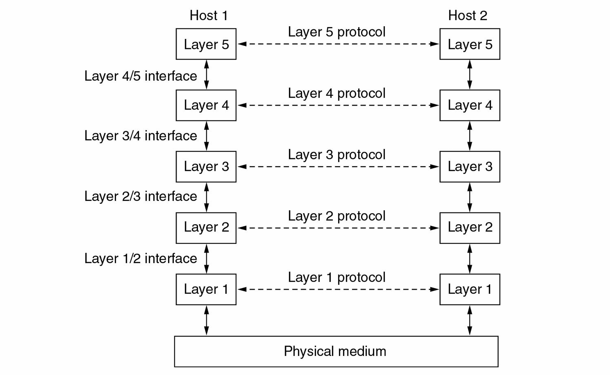
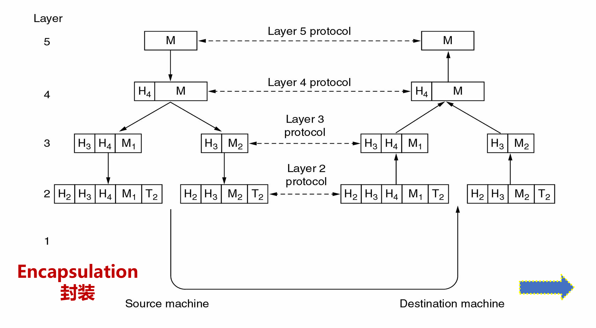
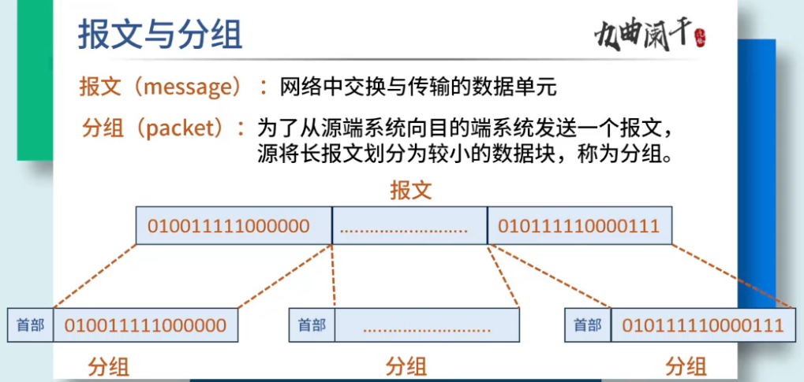
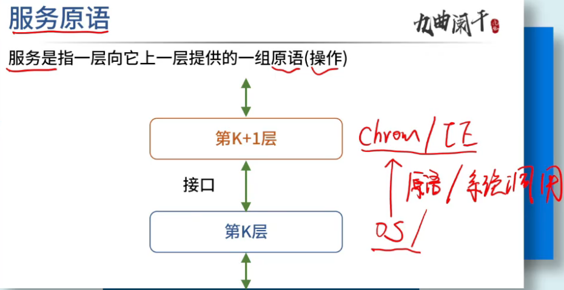
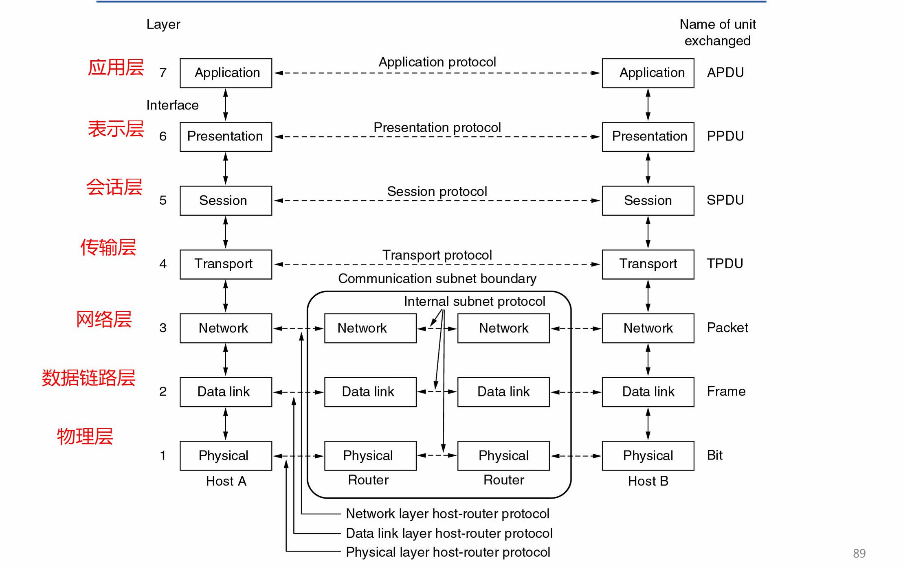
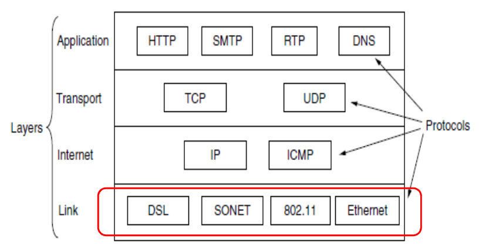
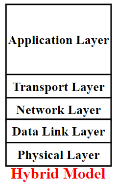
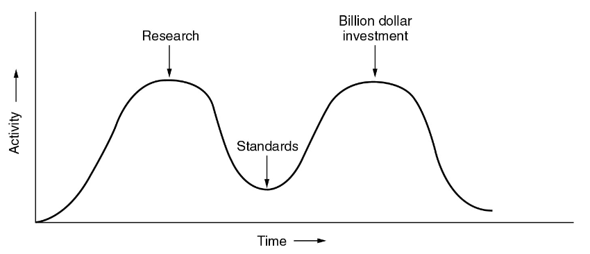

# 计算机网络的定义

* 定义：`A collection of autonomous(自主的) computers interconnected by a single technology.`一组自主的计算机通过单一技术相互连接
* 组成：
  * `Computers/Hosts(主机)/End Systems(端系统)`
  * `Communication Links` 通讯连接
  * `Switches(交换机)/Routers(路由器)`

### 分布式系统

`A collection of independent computers appears to its users as a single coherent（凝聚的） system`

* 透明地呈现给用户
* 万维网

分布式系统的目标是为用户和应用程序提供一个统一的、透明的计算和处理环境，使得多个节点能够协同工作，共同完成复杂的任务，如大规模数据处理、分布式计算等，让用户感觉像是在使用一个单一的系统。

### 计算机网络

主要目标是实现不同计算机之间的通信和数据传输，使计算机之间能够交换信息、共享资源，如文件共享、打印机共享等。

分布式系统在计算机网络之上，依赖于计算机网络。

# 计算机网络的模式

## Client-Server Model 客户端服务器模型

A network with two clients and one server

## Home Applications 家庭网络应用

一种典型的**peer-to -peer model** 简称P2P模型

## Classified by Transmission Technology (传输技术)

### Point-to-point networks(点到点网络)（单播网络）

点到点链路：只有一个发送方和接收方

`To go from the source to the destination, a packet may visit one or more intermediate（中间的）machines (Often multiple routes are possible, finding good ones is important)`

为了从源到目的地，一个数据包可能会访问一个或多个中间的机器（通常可以有多个路由，找到好的路由很重要）

### Broadcast networks(广播网络)

Sending a packet to all destinations, each machine checks the address field。

通信信道被网络上所有机器共享，任何一台机器发出的数据包能被所有其他机器收到。

* 如果数据包是为接收机器准备的，则该机器会处理数据包
* 如果数据包是为其他机器准备的，它只是被忽略。

## Classified by Scale(规模)

personal area network (个域网PAN) -> Local area network (局域网LAN)-> Metropolitan area network (城域网MAN) ->Wide area network(广域网WAN) -> The Internet(英特网)

## Classified by Location(网络位置)

### Access Network 接入网

各种异构网络通过边缘路由器(edge router)接入。

### Core Networks 核心网

核心网络的主要功能是：路由和转发 `Routing and Forwarding`

路由：利用路由算法来确定数据包从源端到目的端所经过的路径，为数据传输规划合适的路线。

转发：类似 “交换” 操作，根据路由算法生成的本地转发表，将到达路由器输入链路的数据包，转移到合适的输出链路，实现数据包的接力传输。

#### Packet Switching 分组交换

* `Unit`(单位)：`packet`(包)
* `Store and forward` 存储转发
* `packet header contains address(distination address and source address)` 每个包中都含有包的目的地址和源地址
* 每个分组在互联网中独立地选择传输路径, 支持灵活的统计多路复用

##### Store-and-forward 存储转发

* **Packet transmission delay 数据分组传输延迟**
  takes L/R seconds to transmit (push out) L-bit packet into link at R bps
* Store and forward
  **Entire(全部的)** packet must arrive at router before it can be transmitted on next link

#### Circuit Switching (电路交换)

电路交换是一种在通信双方之间建立一条专用的物理通信路径（电路）的通信方式，就像传统电话网络那样 。在通信开始前，先通过呼叫建立连接，分配端到端的资源，包括链路带宽资源和交换机的交换能力等，这些资源在通信过程中被独占，不会与其他通信共享。

# **网络**体系**结构**及其**协议（Network architecture and protocols）**

## 分层协议stack of layers(层次栈)

目的：

* 减少设计复杂度，向更高层提供特定的服务，同时将这些层与实际实现这些服务的细节隔离开来（封装）
  * 每一层向更高层提供一些服务，但是会向高层隐藏这些层所提供服务的具体实现细节。
* 分层架构使得不同厂商开发的硬件和软件能够遵循相同的协议标准，实现兼容性和互操作性。

## Layers, protocols, and interfaces

* Protocol(协议)
  * An agreement between the communicating parties on how communication is to proceed.
    沟通双方就如何进行沟通达成的协议
  * define the format,order of messages sent and received among network entities,and actiones taken on message
    定义网络实体之间发送和接收消息的格式、顺序，以及在消息传输、接收时采取的行动。
* Peers （对等实体）
  * 在不同机器上组成相应层的实体
* Interface （接口）
  * 定义底层使哪些基本操作和服务对上层可用
* Network architecture（网络体系结构）
  * 一组层和协议
* Protocol Stack（协议栈）
  * A list of protocols used by a certain system
    某个系统使用的协议列表

## Information flow(信息流)

### 层次之间虚拟通信

1. 第五层的应用进程生成消息 M 并交给第四层传输。
2. 第四层在消息前添加头部信息（包含控制信息如序列号等），然后将结果传递给第三层 。
3. 第三层由于协议对消息大小有限制，会将收到的消息拆分成更小的单元（数据包），为**每个**数据包添加第三层头部，并决定使用哪条输出线路，将数据包传递给第二层。
4. 第二层会为每个数据单元添加头部和尾部，再将结果交给第一层进行物理传输。

每一层协议都会对数据包进行封装(Encapsulation)，除了最高层负责产生消息并不封装

**考点：**

* 分层简化设计和实现，便于互连互通
* 每一层的对等实体之间进行通信，通信要遵守协议
* 只有最底层是实际通信，其它各层都是虚拟通信
* 数据流向：发送系统自顶向下，最底层实际传输数据，接收系统自底向上
* 封装：某层实体在上一层交付的数据前面（可能也在后面）加上自己的控制信息，构成本层的数据包

### 设计问题

* Reliability 可靠性
  * 差错检测和恢复
  * 路由选择
* Network evolution 网络进化
  * 协议层：分化问题和隐藏细节
  * 寻址或命名：识别发送方和接受方
  * 网络互通性
  * 可扩展性
* Resource allocation 资源分配
  * 统计复用：按需分配
  * 流量控制
  * QoS 服务质量

## Connection-oriented(面向连接) vs. Connectionless(无连接)

| 面向连接                                          | 无连接                 |
| ------------------------------------------------- | ---------------------- |
| negotiation                                       |                        |
| Reliable (acknowledged)                           | unreliable             |
| Message                                           | packet                 |
| Store-and-forward switching                       | cut-through switching |
| TCP                                               | UDP                    |
| 系统调用：由操作系统提供给用户的应用编程接口(API) |                        |

* **Connection - Oriented（面向连接）** ：类似于打电话，**在数据传输之前，需要在发送端和接收端之间建立一条逻辑连接**。比如 TCP（传输控制协议），先通过 “三次握手” 建立连接，**传输过程中对数据进行排序、确认和重传等操作以保证数据可靠传输**，传输结束后通过 “四次挥手” 释放连接。

强调三个阶段：

1. 建立连接
2. 传输数据
3. 释放连接

* **Connectionless（无连接）** ：类似寄信，**发送端无需事先与接收端建立连接，直接将数据报发送出去，每个数据报独立选择路由**。像 UDP（用户数据报协议），它不保证数据一定能到达、不进行排序和重传，**传输效率高但可靠性低**。常用于对实时性要求高、少量数据传输的场景，如视频流、音频流传输和 DNS 查询等 。

只有一个阶段：

1. 传输数据

图中数据包有如下解释：

## Interface and Service 接口及服务

#### Service provider and service user (服务提供者和服务用户)

`The entities(实体) in layer n implement(执行) a service used by layer n+1, layer n is called the services provider, layer n+1 is called service user`

#### SAP：service access point 服务访问点

`Layer n SAPs are the places where layer n+1 can access the services offered`。第n层SAP是第n+1层可以访问所提供服务的地方

#### PDU:Protocol Data Unit(协议数据单元)

`Information exchanged between two peers`。两个对等点之间交换的信息

## Service Primitives(服务原语)

在计算机网络中，服务原语（Service Primitive）是上层实体（如应用程序）使用下层提供的服务时的一种抽象指令，用于定义服务用户和服务提供者之间的交互。

如果协议栈位于操作系统中，基元通常是**系统调用 (系统调用)**

实现简单的面向连接的服务的五个服务原语：

在一个简单的客户机-服务器中发送的数据包面向连接的网络上的交互：三对握手+四次握手

## Services vs. Protocols

* 服务

  * 定义了该层准备代表其用户执行哪些操作，但没有说明这些操作是如何实现的
    * 关键点：定义哪些服务可以被上层调用、隐藏所有实现方法
  * 涉及两层之间的接口，下层是服务提供者，上层是服务用户
* 协议

  * 用于管理对等实体交换的消息的格式和含义的一组规则
  * 服务是通过协议实现的
  * Service and protocol are completely decoupled 解耦

PDU(Protocol Data Unit): 两个对等体之间交换的信息

### 服务不变协议变

如果他们不改变服务，他们可以自由地改变协议

* 协议是水平的，服务是垂直的
* 实体使用协议来实现它们的服务
* 实体可以随意更改协议，前提是对其用户可见的服务保持不变

在网络体系结构中，每一层都通过接口向上层提供一定的功能（业务）

# Reference Models(网络参考模型)

* OSI参考模型：法律上的国际标准
* TCP/IP参考模型：最广泛应用的模型

## Open Systems Interconnection (OSI参考模型)

### Physical Layer 物理层

`Transmitting raw bits over a communication channel` 通过通信信道传输原始比特

注意事项：

* `how many volts() should be used to represent a 1 and how many for a 0` 应该分别用多少伏特代表1和0。
* `how many nanoseconds a bit lasts` 一位维持多少纳秒
* `whether transmission may proceed simultaneously in both directions` 是否是全双工
* `how the initial connection is established and how it is torn down when both sides are finished` 初始连接是如何建立的，以及当双方都完成时它是如何被断开的。

为数据链路层提供透明的比特流传输服务

### Data Link Layer 数据链路层（帧传输）

`Transform a raw transmission facility(设施) into a logic channel` 将原始传输设施转换为逻辑通道

主要负责将网络层的数据封装成帧，并在相邻节点之间进行可靠的数据传输。

范围：**point-to-point** : `the protocols are between each machine and its immediate neighbors`. 该协议只作用于直接相邻的机器之间。

主要功能：

* Framing(成帧)：`Sender break up the input data into data frames and transmit the frames` 发送者将输入数据分解为数据帧并传输帧
  * 数据通信中，将数据按照一定的格式进行组织，形成一个个的数据帧。数据帧通常包含帧头、数据部分和帧尾等组成部分。
* Error detection and correction(差错检测)：`If the service is reliable, the receiver confirms correct receipt of each frame by sending back an acknowledgement frame.`如果是可靠性服务，接收方会通过发送确认帧来确认正确接收了每一帧。
* Flow control(流量控制): `Keep a fast transmitter from drowning a slow receiver in data.`防止快速发送器淹没数据中的慢速接收器
* Broadcast networks(广播网络)：`how to control access to the shared channel` 如何控制对于共享通道的访问

### Network Layer 网络层（包）

网络层负责将数据从源主机传输到目的主机，通过选择合适的路由和转发数据报来实现。它主要处理网络中的寻址、路由选择和数据包转发等问题。

`Control opeartion of subnets`控制子网的操作，确定通过子网使用哪条路由

作用：

* `Forwarding`(转发)
* `Routing`(路由)：`How packets are routed from source to destination (route table)`
* `Congestion control`(拥塞控制)
  * Highly dynamic
* `QoS`(Quality of service 服务质量)
  * delay, transit time, jitter, etc
* `Heterogeneous networks interconnection `(异构网络互联)
* `For broadcast networks, routing is simple` 路由对于广播网络来说很简单

### Transport Layer 传输层

传输层负责端到端(end_to_end)的数据传输控制，作用域具体到主机上的进程(process)。它的主要功能包括对数据进行分段、提供可靠或不可靠的传输服务、进行流量控制和错误恢复等

`Accept data from above,split it up into smaller units if need be ,pass these to the network layer,and ensure that the pieces all arrive currently at the other end` 接受来自上层的数据，如果需要的话将其拆分成较小的单元，把这些单元传递给网络层，并确保所有的这些部分都能正确地到达 **另一端(传输的目标设备)** 。

作用：

* `Determines what type of service(reliable or unreliable) to provide to the session layer `确定向会话层提供何种服务(可靠服务还是不可靠服务)
* `an error-free end-to-end channel` 无错误的端到端通道
* `transporting of isolated messages,with no guarantee about the order of delivery` 独立消息的传输，无法保证传递的顺序
* `broadcasting of messages to multiple destinations` 向多个目的地广播消息

### Session Layer 会话层

`Allows users on different machines to establish sessions.` 允许不同机器上的用户建立会话连接。（在通信系统中负责建立、管理和终止表示层实体之间的通信会话）

* `Dialog control` 会话控制
  * keeping track of whose turn it is to transmit 记录轮到谁进行传输
* `Token management` 令牌管理
  * `preventing two parties from attempting the same critical operation at the same time` 阻止双方同时尝试相同的关键操作
* `Synchronization` 同步
  * `checkpointing long transmissions to allow them to continue from where they were after a crash`对长传输进行检查点设置，以便在发生崩溃后能够从它们中断的地方继续进行。

### Presentation Layer表示层

`The syntax(语法) and semantics(语义) of the information transmitted` 传输信息的语法和语义

* `the data structures to be exchanged can be defined in an abstract way` 待交换的数据结构可以以抽象的方式进行定义。
* `Data encryption` 数据加密
* `Data compression` 数据压缩

### Application Layer 应用层

`Avariety of protocols that are commonly needed by users. HTTP，File transfer，Electronic mail.....`.种用户通常需要的协议。包括 HTTP（超文本传输协议，用于在网络上传输网页等超文本内容）、文件传输协议（用于在不同设备之间传输文件）、电子邮件协议（用于发送和接收电子邮件）等等。

应用层直接与用户和应用程序交互，通过各种协议实现不同的应用功能。

### OSI模型几点说明

* 七层模型是考虑了异构计算机通信的最复杂情况下的模
* 在具体网络中需要根据实际需要确定

## TCP/IP Reference Model

### 设计目标

* `Connect multiple networks in a seamless way`以无缝的方式连接多个网络
* `Be able to survive loss of subnet hardware, without existing conversations being broken off `能够在子网硬件丢失的情况下生存，而不会使现有的对话中断
* `A flexible architecture to support applications with divergent requirements `一种灵活的架构，用于支持具有不同需求的应用程序

### The Internet Layer(网际层)（Internet)

在 TCP/IP 模型中，网际层负责处理网络中的分组（数据包），实现网络中的寻址和路由选择功能，确保数据能够从源主机传输到目标主机。它的主要协议包括 IP 协议（网际协议）等。这一层的作用是在不同的网络之间进行数据传输，使得不同网络中的主机能够相互通信。

* `A packet-switchingnetwork based on a connectionlessinternetwork layer `基于无连接网络层的分组交换网络
* `Defines an official packet format and protocol called IP(Internet Protocol)` 定义了一种被称为 IP（互联网协议）的官方数据包格式和协议
* `The job of the internet layer is to deliver IP packets where they are supposed to go` 网际层的工作是将 IP 数据包传送到它们应该去的地方。
  * Packet routing
  * Avoiding congestion

### The Transport Layer

#### TCP (Transmission Control Protocol)

* Reliable connection-oriented
* byte stream(字节流): Segments incoming byte stream into discrete messages
* Reassembles the received messages into the output stream
* Flow control(流量控制)
* Congestion control(拥塞控制)

#### UDP (User Datagram Protocol)

* Unreliable, connectionlessprotocol
* `For applications that do not want TCP‘s sequencing or flow control and wish to provide their own (i.e. NFS 网络文件系统)` 对于那些不想要 TCP 的排序或流控制功能，并且希望提供自己的这些功能的应用程序（例如 NFS 网络文件系统）
* For applications in which prompt delivery is more important than accurate delivery, such as transmitting speech or video, DNS Computer Networks, Introduction

### TCP/IP 网络和协议

## Hybrid Model 混合模型

* `The strength of the OSI reference model is the model which is useful for discussing computer networks` OSI 参考模型的优势在于这个模型对于讨论计算机网络很有用
* `The strength of the TCP/IP reference model is the protocolswhich have been widely used for many years` TCP/IP 参考模型的优势在于其协议已经被广泛使用了很多年
* The hybrid reference model used in this course

## OSI与TCP/IP比较

相似：

* Both are based on the concept of a stack of independent protocols 两者都是基于独立协议栈的概念
* The functionality of the layers is roughly similar 这些层的功能大致相似

不同：

* Concepts of model: services, interfacesand protocols 模型的概念：服务、接口和协议
* The relationship of model and protocols 模型与协议的关系
* The number of layers
* The area of connectionless versus connection-oriented communications 无连接通信和面向连接通信各自所涉及的范围或领域

## OSI features

* Services (semantics)
  * What the layer does, not how entities above it access it or how the layer works.
  * 服务：某层实体对于上一层实体的支持
* Interfaces (syntax)
  * Tells the processes above it how to access it
  * 接口：定义某层实体对于上一层提供的原语操作
* Protocols
  * 协议：两个系统同层的对等实体进行通信所必须遵守的规则

## OSI: Critique

### Bad timing

The apocalypse of the two elephants

### Bad Technology

* `The choice of 7 layers was more political than technical, and two of the layers (session and presentation) are nearly empty, whereas two other ones (data link and network) are overfull` 7 层的选择更多是出于政治因素而非技术因素，并且其中两层（会话层和表示层）几乎是空的，而另外两层（数据链路层和网络层）则过于饱满
* `Service definitions and protocols are extraordinarily complex and difficult to implement and inefficient in operation`服务定义和协议非常复杂，难以实施，并且在操作中效率低下
* `Some functions, such as addressing, flow control, and error control, reappear again and again in each layer` 某些功能，例如寻址、流控制和错误控制，在每一层中一次又一次地出现。
