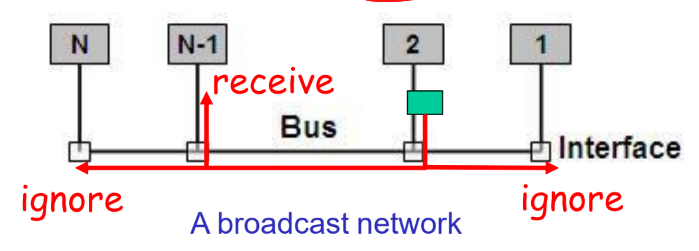
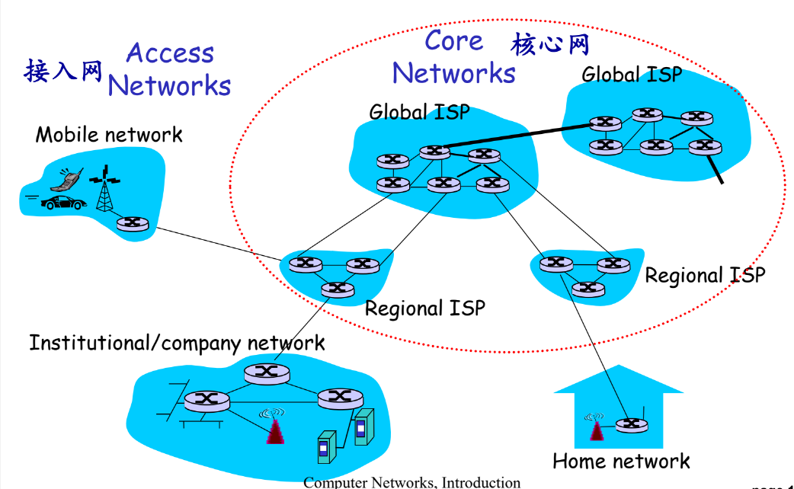
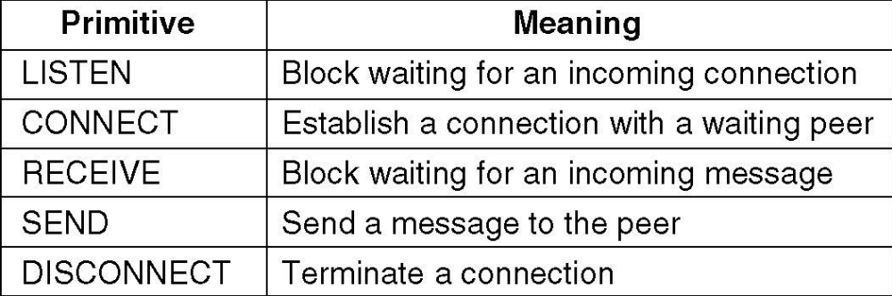
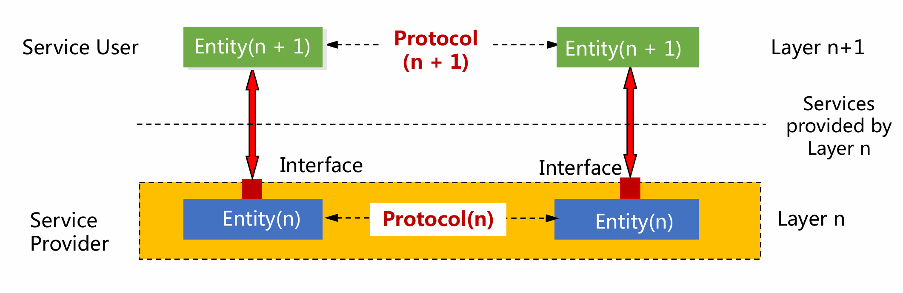

# 计算机网络的定义

* 定义：`A collection of autonomous(自主的) computers interconnected by a single technology. `一组自主的计算机通过单一技术相互连接
* 组成：
  * `Computers/Hosts(主机)/End Systems(端系统)`
  * `Communication Links` 通讯连接
  * `Switches(交换机)/Routers(路由器)`

### 分布式系统

`A collection of independent computers appears to its users as a single coherent（凝聚的） system`

* 透明地呈现给用户
* 万维网

分布式系统的目标是为用户和应用程序提供一个统一的、透明的计算和处理环境，使得多个节点能够协同工作，共同完成复杂的任务，如大规模数据处理、分布式计算等，让用户感觉像是在使用一个单一的系统。

### 计算机网络

主要目标是实现不同计算机之间的通信和数据传输，使计算机之间能够交换信息、共享资源，如文件共享、打印机共享等。

分布式系统在计算机网络之上，依赖于计算机网络。

# 计算机网络的模式

## Client-Server Model 客户端服务器模型

A network with two clients and one server

## Home Applications 家庭网络应用

一种典型的**peer-to -peer model** 简称P2P模型

## Classified by Transmission Technology (传输技术)

### Broadcast networks(广播网络)

Sending a packet to all destinations, each machine checks the address field。

通信信道被网络上所有机器共享，任何一台机器发出的数据包能被所有其他机器收到。

* 如果数据包是为接收机器准备的，则该机器会处理数据包
* 如果数据包是为其他机器准备的，它只是被忽略。

### Point-to-point networks(点到点网络)（单播网络）

点到点链路：只有一个发送方和接收方

`To go from the source to the destination, a packet may visit one or more intermediate（中间的）machines (Often multiple routes are possible, finding good ones is important)`

为了从源到目的地，一个数据包可能会访问一个或多个中间的机器（通常可以有多个路由，找到好的路由很重要）

## Classified by Scale(规模)

personal area network (个域网PAN) -> Local area network (局域网LAN)-> Metropolitan area network (城域网MAN) ->Wide area network(广域网WAN) -> The Internet(英特网)

## Classified by Location(网络位置)

### Access Network 接入网

各种异构网络通过边缘路由器(edge router)接入。

### Core Networks 核心网

核心网络的主要功能是：路由和转发 `Routing and Forwarding`

路由：利用路由算法来确定数据包从源端到目的端所经过的路径，为数据传输规划合适的路线。

转发：类似 “交换” 操作，根据路由算法生成的本地转发表，将到达路由器输入链路的数据包，转移到合适的输出链路，实现数据包的接力传输。

#### Packet Switching 分组交换

* `Unit`(单位)：`packet `(包)
* `Store and forward` 存储转发
* `packet header contains address(distination address and source address)` 每个包中都含有包的目的地址和源地址
* 每个分组在互联网中独立地选择传输路径, 支持灵活的统计多路复用

##### Store-and-forward 存储转发

* **Packet transmission delay 数据分组传输延迟**
  takes L/R seconds to transmit (push out) L-bit packet into link at R bps
* Store and forward
  **Entire(全部的)** packet must arrive at router before it can be transmitted on next link

#### Circuit Switching (电路交换)

电路交换是一种在通信双方之间建立一条专用的物理通信路径（电路）的通信方式，就像传统电话网络那样 。在通信开始前，先通过呼叫建立连接，分配端到端的资源，包括链路带宽资源和交换机的交换能力等，这些资源在通信过程中被独占，不会与其他通信共享。

# **网络**体系**结构**及其**协议（Network architecture and protocols）**

## 分层协议stack of layers(层次栈)

目的：

* 减少设计复杂度，向更高层提供特定的服务，同时将这些层与实际实现这些服务的细节隔离开来（封装）
  * 每一层向更高层提供一些服务，但是会向高层隐藏这些层所提供服务的具体实现细节。
* 分层架构使得不同厂商开发的硬件和软件能够遵循相同的协议标准，实现兼容性和互操作性。

## Layers, protocols, and interfaces

* Protocol(协议)
  * An agreement between the communicating parties on how communication is to proceed.
    沟通双方就如何进行沟通达成的协议
  * define the format,order of messages sent and received among network entities,and actiones taken on message
    定义网络实体之间发送和接收消息的格式、顺序，以及在消息传输、接收时采取的行动。
* Peers （对等实体）
  * 在不同机器上组成相应层的实体
* Interface （接口）
  * 定义底层使哪些基本操作和服务对上层可用
* Network architecture（网络体系结构）
  * 一组层和协议
* Protocol Stack（协议栈）
  * A list of protocols used by a certain system
    某个系统使用的协议列表

## Information flow(信息流)

### 层次之间虚拟通信

1. 第五层的应用进程生成消息 M 并交给第四层传输。
2. 第四层在消息前添加头部信息（包含控制信息如序列号等），然后将结果传递给第三层 。
3. 第三层由于协议对消息大小有限制，会将收到的消息拆分成更小的单元（数据包），为**每个**数据包添加第三层头部，并决定使用哪条输出线路，将数据包传递给第二层。
4. 第二层会为每个数据单元添加头部和尾部，再将结果交给第一层进行物理传输。

每一层协议都会对数据包进行封装(Encapsulation)，除了最高层负责产生消息并不封装

**考点：**

* 分层简化设计和实现，便于互连互通
* 每一层的对等实体之间进行通信，通信要遵守协议
* 只有最底层是实际通信，其它各层都是虚拟通信
* 数据流向：发送系统自顶向下，最底层实际传输数据，接收系统自底向上
* 封装：某层实体在上一层交付的数据前面（可能也在后面）加上自己的控制信息，构成本层的数据包

### 设计问题

* Reliability 可靠性
  * 差错检测和恢复
  * 路由选择
* Network evolution 网络进化
  * 协议层：分化问题和隐藏细节
  * 寻址或命名：识别发送方和接受方
  * 网络互通性
  * 可扩展性
* Resource allocation 资源分配
  * 统计复用：按需分配
  * 流量控制
  * QoS 服务质量

## Connection-oriented(面向连接) vs. Connectionless(无连接)

| 面向连接                                          | 无连接                 |
| ------------------------------------------------- | ---------------------- |
| negotiation                                       |                        |
| Reliable (acknowledged)                           | unreliable             |
| Message                                           | packet                 |
| Store-and-forward switching                       | cut-through switching |
| TCP                                               | UDP                    |
| 系统调用：由操作系统提供给用户的应用编程接口(API) |                        |

* **Connection - Oriented（面向连接）** ：类似于打电话，在数据传输之前，需要在发送端和接收端之间建立一条逻辑连接。比如 TCP（传输控制协议），先通过 “三次握手” 建立连接，传输过程中对数据进行排序、确认和重传等操作以保证数据可靠传输，传输结束后通过 “四次挥手” 释放连接。

强调三个阶段：

1. 建立连接
2. 传输数据
3. 释放连接

* **Connectionless（无连接）** ：类似寄信，发送端无需事先与接收端建立连接，直接将数据报发送出去，每个数据报独立选择路由。像 UDP（用户数据报协议），它不保证数据一定能到达、不进行排序和重传，传输效率高但可靠性低。常用于对实时性要求高、少量数据传输的场景，如视频流、音频流传输和 DNS 查询等 。

只有一个阶段：

1. 传输数据

## Interface and Service 接口及服务

#### Service provider and service user (服务提供者和服务用户)

The entities(实体) in layer n implement(执行) a service used by layer n+1, layer n is called the services provider, layer n+1 is called service user

#### SAP：service access point 服务访问点

Layer n SAPs are the places where layer n+1 can access the services offered。第n层SAP是第n+1层可以访问所提供服务的地方

#### PDU:Protocol Data Unit(协议数据单元)

Information exchanged between two peers。两个对等点之间交换的信息

## Service Primitives(服务原语)

在计算机网络中，服务原语（Service Primitive）是上层实体（如应用程序）使用下层提供的服务时的一种抽象指令，用于定义服务用户和服务提供者之间的交互。

如果协议栈位于操作系统中，基元通常是**系统调用 (系统调用)**

实现简单的面向连接的服务的五个服务原语：

在一个简单的客户机-服务器中发送的数据包面向连接的网络上的交互：三对握手+四次握手

## Services vs. Protocols

* 服务

  * 定义了该层准备代表其用户执行哪些操作，但没有说明这些操作是如何实现的
    * 关键点：定义哪些服务可以被上层调用、隐藏所有实现方法
  * 涉及两层之间的接口，下层是服务提供者，上层是服务用户
* 协议

  * 用于管理对等实体交换的消息的格式和含义的一组规则
  * 服务是通过协议实现的
  * Service and protocol are **completely decoupled** 解耦

PDU(Protocol Data Unit): 两个对等体之间交换的信息

### 服务不变协议变

如果他们不改变服务，他们可以自由地改变协议

* 协议是水平的，服务是垂直的
* 实体使用协议来实现它们的服务
* 实体可以随意更改协议，前提是对其用户可见的服务保持不变

在网络体系结构中，每一层都通过接口向上层提供一定的功能（业务）

# Reference Models(网络参考模型)
